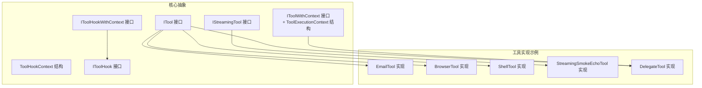
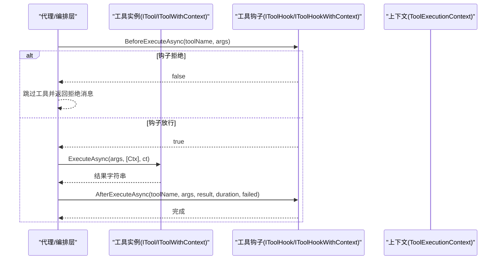
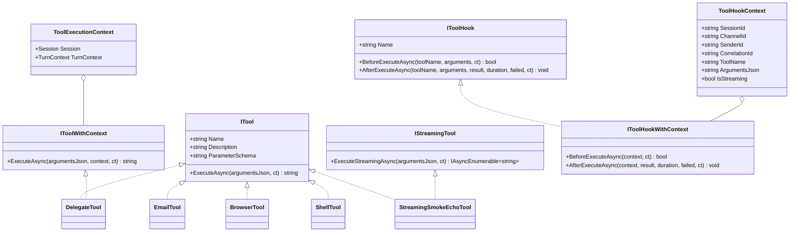

# 自定义工具开发

<cite>
**本文引用的文件**
- [ITool 接口](file://src/OpenClaw.Core/Abstractions/ITool.cs)
- [IStreamingTool 接口](file://src/OpenClaw.Core/Abstractions/IStreamingTool.cs)
- [IToolWithContext 接口与 ToolExecutionContext 结构](file://src/OpenClaw.Core/Abstractions/IToolWithContext.cs)
- [ToolHookContext 结构](file://src/OpenClaw.Core/Abstractions/ToolHookContext.cs)
- [IToolHook 接口](file://src/OpenClaw.Core/Abstractions/IToolHook.cs)
- [IToolHookWithContext 接口](file://src/OpenClaw.Core/Abstractions/IToolHookWithContext.cs)
- [EmailTool 实现示例](file://src/OpenClaw.Agent/Tools/EmailTool.cs)
- [BrowserTool 实现示例](file://src/OpenClaw.Agent/Tools/BrowserTool.cs)
- [ShellTool 实现示例](file://src/OpenClaw.Agent/Tools/ShellTool.cs)
- [StreamingSmokeEchoTool 实现示例](file://src/OpenClaw.Agent/Tools/StreamingSmokeEchoTool.cs)
- [DelegateTool 实现示例](file://src/OpenClaw.Agent/Tools/DelegateTool.cs)
- [工具使用与安装指南](file://docs/TOOLS_GUIDE.md)
- [MAF AOT/JIT 流式工具发现报告](file://docs/maf-aot-jit/maf-aot-jit-stream-tool-findings.md)
- [MAF AOT/JIT 响应流式工具发现报告](file://docs/maf-aot-jit/maf-aot-jit-responses-stream-tool-findings.md)
- [MAF AOT/JIT 工具发现报告](file://docs/maf-aot-jit/maf-aot-jit-findings.md)
</cite>

## 目录
1. [简介](#简介)
2. [项目结构](#项目结构)
3. [核心组件](#核心组件)
4. [架构总览](#架构总览)
5. [详细组件分析](#详细组件分析)
6. [依赖关系分析](#依赖关系分析)
7. [性能考量](#性能考量)
8. [故障排查指南](#故障排查指南)
9. [结论](#结论)
10. [附录](#附录)

## 简介
本指南面向希望在系统中开发与集成“自定义工具”的工程师，聚焦以下目标：
- 工具接口设计与实现规范：ITool、IStreamingTool、IToolWithContext 及其上下文传递机制
- 工具注册、配置管理、安全策略与沙箱能力
- 错误处理、可观测性与性能优化
- 开发、测试、调试与部署流程
- 提供工具模板、开发示例与最佳实践

## 项目结构
与“自定义工具开发”直接相关的关键位置：
- 核心抽象层：src/OpenClaw.Core/Abstractions（定义工具接口、钩子、上下文）
- 工具实现层：src/OpenClaw.Agent/Tools（内置原生工具示例）
- 文档与参考：docs（工具使用指南、MAF AOT/JIT 性能与流式工具报告）

图表来源
- [ITool 接口:6-16](file://src/OpenClaw.Core/Abstractions/ITool.cs#L6-L16)
- [IStreamingTool 接口:7-10](file://src/OpenClaw.Core/Abstractions/IStreamingTool.cs#L7-L10)
- [IToolWithContext 接口与 ToolExecutionContext 结构:6-15](file://src/OpenClaw.Core/Abstractions/IToolWithContext.cs#L6-L15)
- [ToolHookContext 结构:6-17](file://src/OpenClaw.Core/Abstractions/ToolHookContext.cs#L6-L17)
- [IToolHook 接口:8-22](file://src/OpenClaw.Core/Abstractions/IToolHook.cs#L8-L22)
- [IToolHookWithContext 接口:7-12](file://src/OpenClaw.Core/Abstractions/IToolHookWithContext.cs#L7-L12)
- [EmailTool 实现示例:16-90](file://src/OpenClaw.Agent/Tools/EmailTool.cs#L16-L90)
- [BrowserTool 实现示例:17-448](file://src/OpenClaw.Agent/Tools/BrowserTool.cs#L17-L448)
- [ShellTool 实现示例:11-85](file://src/OpenClaw.Agent/Tools/ShellTool.cs#L11-L85)
- [StreamingSmokeEchoTool 实现示例:11-46](file://src/OpenClaw.Agent/Tools/StreamingSmokeEchoTool.cs#L11-L46)
- [DelegateTool 实现示例:16-191](file://src/OpenClaw.Agent/Tools/DelegateTool.cs#L16-L191)

章节来源
- [ITool 接口:6-16](file://src/OpenClaw.Core/Abstractions/ITool.cs#L6-L16)
- [IStreamingTool 接口:7-10](file://src/OpenClaw.Core/Abstractions/IStreamingTool.cs#L7-L10)
- [IToolWithContext 接口与 ToolExecutionContext 结构:6-15](file://src/OpenClaw.Core/Abstractions/IToolWithContext.cs#L6-L15)
- [ToolHookContext 结构:6-17](file://src/OpenClaw.Core/Abstractions/ToolHookContext.cs#L6-L17)
- [IToolHook 接口:8-22](file://src/OpenClaw.Core/Abstractions/IToolHook.cs#L8-L22)
- [IToolHookWithContext 接口:7-12](file://src/OpenClaw.Core/Abstractions/IToolHookWithContext.cs#L7-L12)

## 核心组件
- ITool：最小化工具接口，包含名称、描述、参数 Schema 与同步/异步执行方法。为 AOT 剪枝友好设计。
- IStreamingTool：可选接口，支持在流式会话中增量返回结果，便于实时反馈。
- IToolWithContext：扩展 ITool，允许在执行时接收 ToolExecutionContext 上下文，包含会话与轮次信息。
- ToolHookContext：工具钩子上下文，包含会话/通道/发送者关联 ID、工具名、参数、是否流式等。
- IToolHook / IToolHookWithContext：工具执行前后钩子扩展点，支持拒绝执行、统计耗时与结果、失败标记等。

章节来源
- [ITool 接口:6-16](file://src/OpenClaw.Core/Abstractions/ITool.cs#L6-L16)
- [IStreamingTool 接口:7-10](file://src/OpenClaw.Core/Abstractions/IStreamingTool.cs#L7-L10)
- [IToolWithContext 接口与 ToolExecutionContext 结构:6-15](file://src/OpenClaw.Core/Abstractions/IToolWithContext.cs#L6-L15)
- [ToolHookContext 结构:6-17](file://src/OpenClaw.Core/Abstractions/ToolHookContext.cs#L6-L17)
- [IToolHook 接口:8-22](file://src/OpenClaw.Core/Abstractions/IToolHook.cs#L8-L22)
- [IToolHookWithContext 接口:7-12](file://src/OpenClaw.Core/Abstractions/IToolHookWithContext.cs#L7-L12)

## 架构总览
工具在系统中的调用与扩展点如下：

图表来源
- [IToolHook 接口:8-22](file://src/OpenClaw.Core/Abstractions/IToolHook.cs#L8-L22)
- [IToolHookWithContext 接口:7-12](file://src/OpenClaw.Core/Abstractions/IToolHookWithContext.cs#L7-L12)
- [IToolWithContext 接口与 ToolExecutionContext 结构:6-15](file://src/OpenClaw.Core/Abstractions/IToolWithContext.cs#L6-L15)

## 详细组件分析

### ITool 接口与实现规范
- 设计要点
  - 名称与描述用于工具注册与展示
  - 参数 Schema 使用 JSON Schema 描述，便于 LLM 推断与参数校验
  - ExecuteAsync 接受 JSON 字符串参数与取消令牌
- AOT 友好：字段最小化，避免复杂泛型与反射
- 最佳实践
  - 参数 Schema 必须覆盖所有必填字段与枚举值
  - 对外部输入进行显式校验与错误归一化
  - 将敏感配置通过密钥引用机制注入，避免硬编码

章节来源
- [ITool 接口:6-16](file://src/OpenClaw.Core/Abstractions/ITool.cs#L6-L16)

### IStreamingTool 接口与流式工具
- 设计要点
  - ExecuteStreamingAsync 返回增量字符串序列，适配 SSE/响应流式场景
  - 与 ITool 并行实现，不改变非流式行为
- 性能与体验
  - 流式工具在 AOT/JIT 与 MAF 下均有性能对比与回归验证
- 示例参考
  - StreamingSmokeEchoTool 展示了最小流式实现与参数解析

章节来源
- [IStreamingTool 接口:7-10](file://src/OpenClaw.Core/Abstractions/IStreamingTool.cs#L7-L10)
- [StreamingSmokeEchoTool 实现示例:11-46](file://src/OpenClaw.Agent/Tools/StreamingSmokeEchoTool.cs#L11-L46)
- [MAF AOT/JIT 流式工具发现报告:1-24](file://docs/maf-aot-jit/maf-aot-jit-stream-tool-findings.md#L1-L24)
- [MAF AOT/JIT 响应流式工具发现报告:1-26](file://docs/maf-aot-jit/maf-aot-jit-responses-stream-tool-findings.md#L1-L26)

### IToolWithContext 与上下文传递
- 上下文结构
  - 包含 Session 与 TurnContext，便于工具访问会话状态、轮次元数据
- 使用场景
  - 需要基于会话/通道/发送者信息进行策略控制或审计
  - 与钩子结合，实现细粒度的拦截与观测
- 示例参考
  - DelegateTool 实现了 IToolWithContext，并在执行时构建子会话与委托摘要

章节来源
- [IToolWithContext 接口与 ToolExecutionContext 结构:6-15](file://src/OpenClaw.Core/Abstractions/IToolWithContext.cs#L6-L15)
- [ToolHookContext 结构:6-17](file://src/OpenClaw.Core/Abstractions/ToolHookContext.cs#L6-L17)
- [DelegateTool 实现示例:16-191](file://src/OpenClaw.Agent/Tools/DelegateTool.cs#L16-L191)

### 工具钩子体系（IToolHook / IToolHookWithContext）
- IToolHook
  - BeforeExecuteAsync：返回 false 可拒绝执行
  - AfterExecuteAsync：无论成功与否均回调，便于统计与审计
- IToolHookWithContext
  - 基于 ToolHookContext 获取会话/通道/发送者等上下文
- 使用建议
  - 将鉴权、白名单/黑名单、速率限制、审计日志等逻辑放入钩子
  - 钩子按注册顺序执行，注意短路与副作用

章节来源
- [IToolHook 接口:8-22](file://src/OpenClaw.Core/Abstractions/IToolHook.cs#L8-L22)
- [IToolHookWithContext 接口:7-12](file://src/OpenClaw.Core/Abstractions/IToolHookWithContext.cs#L7-L12)
- [ToolHookContext 结构:6-17](file://src/OpenClaw.Core/Abstractions/ToolHookContext.cs#L6-L17)

### 工具实现示例与开发模板

#### EmailTool（原生 C# 工具）
- 能力概览
  - 发送/读取邮件（SMTP/IMAP），参数通过 JSON Schema 描述
  - 支持只读模式、凭据安全解析、IMAP 输入净化
- 开发要点
  - 参数解析与必填校验
  - 外部服务连接与异常归一化
  - 安全：凭据引用、输入净化、最大结果限制
- 适用场景
  - 邮件自动化、邮件检索与分析

章节来源
- [EmailTool 实现示例:16-90](file://src/OpenClaw.Agent/Tools/EmailTool.cs#L16-L90)
- [EmailTool 实现示例:92-239](file://src/OpenClaw.Agent/Tools/EmailTool.cs#L92-L239)

#### BrowserTool（交互式浏览器工具）
- 能力概览
  - 导航、点击、填写、取文本、截图、JS 评估
  - 支持本地执行与沙箱执行，URL 安全策略
- 开发要点
  - Playwright 初始化与页面生命周期管理
  - URL 安全校验与路由拦截
  - 取消信号与超时处理
- 适用场景
  - 动态网页抓取、表单自动化、前端交互验证

章节来源
- [BrowserTool 实现示例:17-448](file://src/OpenClaw.Agent/Tools/BrowserTool.cs#L17-L448)
- [BrowserTool 实现示例:449-475](file://src/OpenClaw.Agent/Tools/BrowserTool.cs#L449-L475)
- [BrowserTool 实现示例:580-603](file://src/OpenClaw.Agent/Tools/BrowserTool.cs#L580-L603)

#### ShellTool（本地命令执行）
- 能力概览
  - 本地 Shell 命令执行，带超时与输出截断
  - 支持沙箱封装与结果格式化
- 开发要点
  - 读模式与禁用策略
  - 超时与输出上限控制
- 适用场景
  - 文件系统操作、系统查询、脚本执行

章节来源
- [ShellTool 实现示例:11-85](file://src/OpenClaw.Agent/Tools/ShellTool.cs#L11-L85)
- [ShellTool 实现示例:87-113](file://src/OpenClaw.Agent/Tools/ShellTool.cs#L87-L113)

#### StreamingSmokeEchoTool（流式示例）
- 能力概览
  - 将参数中的分片按序流式返回，作为流式工具的最小实现
- 开发要点
  - ExecuteStreamingAsync 的逐片 yield
  - 取消令牌与调度让步
- 适用场景
  - 流式工具回归测试、性能对比基线

章节来源
- [StreamingSmokeEchoTool 实现示例:11-46](file://src/OpenClaw.Agent/Tools/StreamingSmokeEchoTool.cs#L11-L46)

#### DelegateTool（委托工具）
- 能力概览
  - 将任务委托给子代理，支持深度限制与会话持久化
  - 构建子工具集合、系统提示注入、委托摘要与变更追踪
- 开发要点
  - 配置化代理档案与工具白名单
  - 子会话生命周期与状态回传
- 适用场景
  - 多角色/多专长的协作式代理

章节来源
- [DelegateTool 实现示例:16-191](file://src/OpenClaw.Agent/Tools/DelegateTool.cs#L16-L191)

### 工具注册、配置管理与安全
- 注册方式
  - 原生 C# 工具：通过应用配置启用与命名（见工具使用指南）
  - 桥接工具（Node.js 插件）：动态加载，需满足运行时模式兼容性
- 配置要点
  - 工具参数 Schema 与默认值
  - 安全策略：只读模式、工作区限制、路径白名单、审批要求
  - URL 安全策略、沙箱模式偏好
- 参考
  - 工具使用与安装指南提供了详细的配置项与安全建议

章节来源
- [工具使用与安装指南:7-37](file://docs/TOOLS_GUIDE.md#L7-L37)
- [工具使用与安装指南:47-54](file://docs/TOOLS_GUIDE.md#L47-L54)
- [工具使用与安装指南:85-194](file://docs/TOOLS_GUIDE.md#L85-L194)
- [工具使用与安装指南:394-405](file://docs/TOOLS_GUIDE.md#L394-L405)

### 错误处理与可观测性
- 错误处理
  - 参数解析失败、必填字段缺失、外部服务异常均需返回统一错误格式
  - 取消与超时场景需清晰区分与反馈
- 可观测性
  - 钩子 AfterExecuteAsync 记录耗时与失败标记
  - 运行时指标与事件日志用于诊断与审计
- 性能对比
  - MAF AOT/JIT 场景下的工具与流式工具性能矩阵可用于回归与优化

章节来源
- [IToolHook 接口:8-22](file://src/OpenClaw.Core/Abstractions/IToolHook.cs#L8-L22)
- [MAF AOT/JIT 工具发现报告:1-24](file://docs/maf-aot-jit/maf-aot-jit-findings.md#L1-L24)
- [MAF AOT/JIT 流式工具发现报告:1-24](file://docs/maf-aot-jit/maf-aot-jit-stream-tool-findings.md#L1-L24)
- [MAF AOT/JIT 响应流式工具发现报告:1-26](file://docs/maf-aot-jit/maf-aot-jit-responses-stream-tool-findings.md#L1-L26)

## 依赖关系分析
工具接口与实现之间的依赖关系如下：

图表来源
- [ITool 接口:6-16](file://src/OpenClaw.Core/Abstractions/ITool.cs#L6-L16)
- [IStreamingTool 接口:7-10](file://src/OpenClaw.Core/Abstractions/IStreamingTool.cs#L7-L10)
- [IToolWithContext 接口与 ToolExecutionContext 结构:6-15](file://src/OpenClaw.Core/Abstractions/IToolWithContext.cs#L6-L15)
- [ToolHookContext 结构:6-17](file://src/OpenClaw.Core/Abstractions/ToolHookContext.cs#L6-L17)
- [IToolHook 接口:8-22](file://src/OpenClaw.Core/Abstractions/IToolHook.cs#L8-L22)
- [IToolHookWithContext 接口:7-12](file://src/OpenClaw.Core/Abstractions/IToolHookWithContext.cs#L7-L12)
- [EmailTool 实现示例:16-90](file://src/OpenClaw.Agent/Tools/EmailTool.cs#L16-L90)
- [BrowserTool 实现示例:17-448](file://src/OpenClaw.Agent/Tools/BrowserTool.cs#L17-L448)
- [ShellTool 实现示例:11-85](file://src/OpenClaw.Agent/Tools/ShellTool.cs#L11-L85)
- [DelegateTool 实现示例:16-191](file://src/OpenClaw.Agent/Tools/DelegateTool.cs#L16-L191)
- [StreamingSmokeEchoTool 实现示例:11-46](file://src/OpenClaw.Agent/Tools/StreamingSmokeEchoTool.cs#L11-L46)

## 性能考量
- AOT/JIT 与 MAF 下的工具与流式工具性能矩阵可用于对比与优化
- 流式工具在不同运行时与编排器组合下的启动与回合耗时、上游请求次数、Token 消耗与事件形态均有记录
- 建议
  - 在 AOT 场景优先选择 ITool 与 IStreamingTool 的最小实现
  - 对外部调用设置合理超时与重试策略
  - 使用钩子进行限流与审计，避免热点工具造成抖动

章节来源
- [MAF AOT/JIT 工具发现报告:1-24](file://docs/maf-aot-jit/maf-aot-jit-findings.md#L1-L24)
- [MAF AOT/JIT 流式工具发现报告:1-24](file://docs/maf-aot-jit/maf-aot-jit-stream-tool-findings.md#L1-L24)
- [MAF AOT/JIT 响应流式工具发现报告:1-26](file://docs/maf-aot-jit/maf-aot-jit-responses-stream-tool-findings.md#L1-L26)

## 故障排查指南
- 常见问题
  - 参数解析失败：检查 JSON Schema 与必填字段
  - 外部服务异常：查看工具内部异常归一化返回
  - 取消/超时：确认取消令牌与超时配置
  - 权限/安全：只读模式、路径白名单、URL 安全策略
- 调试建议
  - 使用钩子记录 Before/After 执行信息
  - 查看运行时指标与事件日志
  - 对比 AOT/JIT/MAF 下的性能差异以定位瓶颈
- 参考
  - 工具使用指南提供了安装、配置与安全策略的详细说明

章节来源
- [工具使用与安装指南:7-37](file://docs/TOOLS_GUIDE.md#L7-L37)
- [工具使用与安装指南:47-54](file://docs/TOOLS_GUIDE.md#L47-L54)
- [工具使用与安装指南:85-194](file://docs/TOOLS_GUIDE.md#L85-L194)
- [工具使用与安装指南:394-405](file://docs/TOOLS_GUIDE.md#L394-L405)

## 结论
通过 ITool、IStreamingTool、IToolWithContext 与钩子体系，系统为自定义工具提供了清晰的扩展面与强大的可观测性。结合内置工具示例与工具使用指南，开发者可以快速实现高性能、安全可控且易于维护的工具，并在 AOT/JIT/MAF 环境中获得稳定的性能表现。

## 附录

### 工具开发模板（步骤清单）
- 定义工具接口与上下文
  - 实现 ITool 或 IToolWithContext
  - 准备参数 JSON Schema
- 实现执行逻辑
  - 解析参数、校验必填与范围
  - 调用外部服务或本地能力
  - 归一化错误与结果
- 可选：实现流式输出
  - 实现 IStreamingTool 的 ExecuteStreamingAsync
- 安全与配置
  - 设置只读/工作区/路径白名单
  - 使用密钥引用与输入净化
- 注册与测试
  - 在应用配置中启用工具
  - 编写单元/回归测试，覆盖正常与异常分支
- 性能与可观测性
  - 使用钩子进行限流与审计
  - 对照 AOT/JIT/MAF 性能矩阵进行优化

章节来源
- [ITool 接口:6-16](file://src/OpenClaw.Core/Abstractions/ITool.cs#L6-L16)
- [IStreamingTool 接口:7-10](file://src/OpenClaw.Core/Abstractions/IStreamingTool.cs#L7-L10)
- [IToolWithContext 接口与 ToolExecutionContext 结构:6-15](file://src/OpenClaw.Core/Abstractions/IToolWithContext.cs#L6-L15)
- [IToolHook 接口:8-22](file://src/OpenClaw.Core/Abstractions/IToolHook.cs#L8-L22)
- [工具使用与安装指南:7-37](file://docs/TOOLS_GUIDE.md#L7-L37)