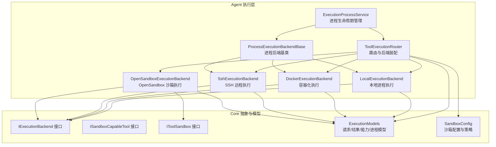
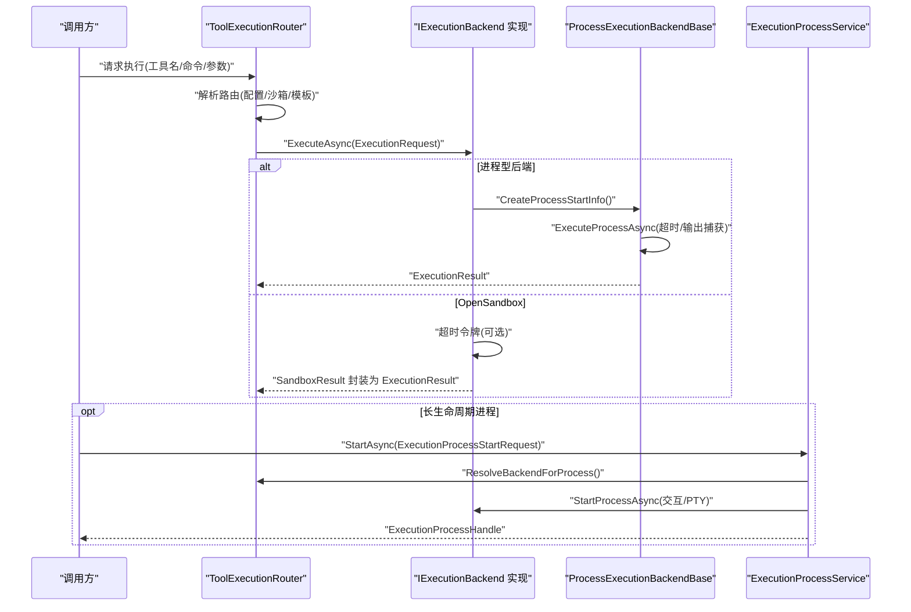
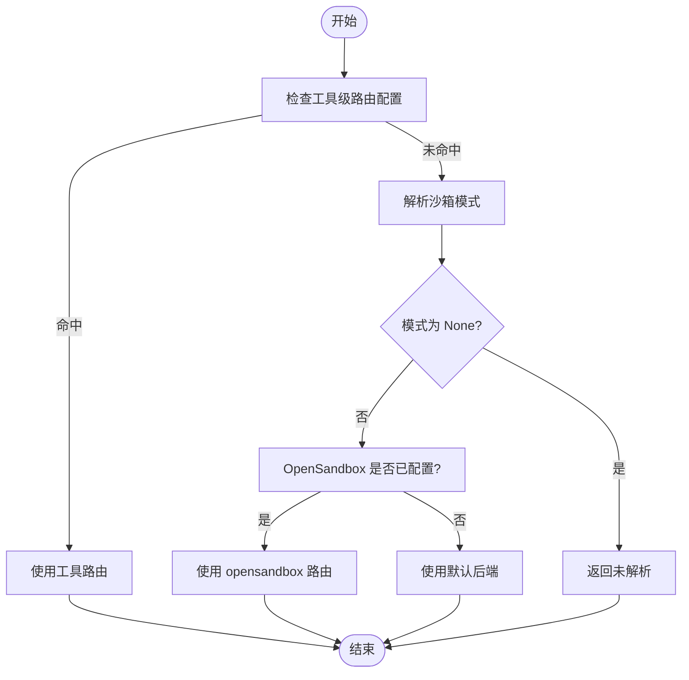
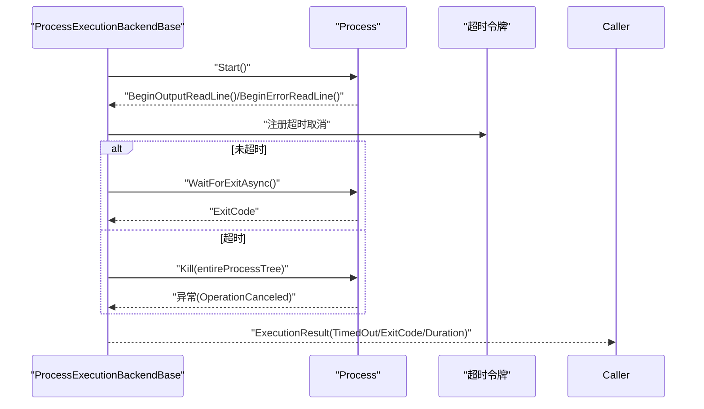
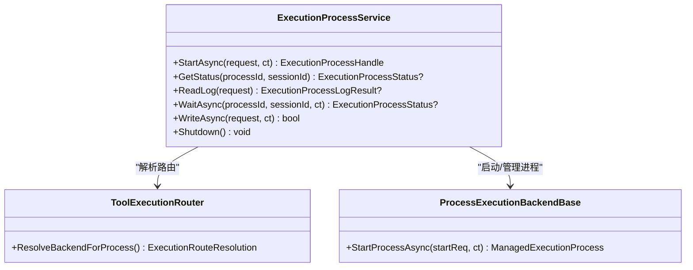
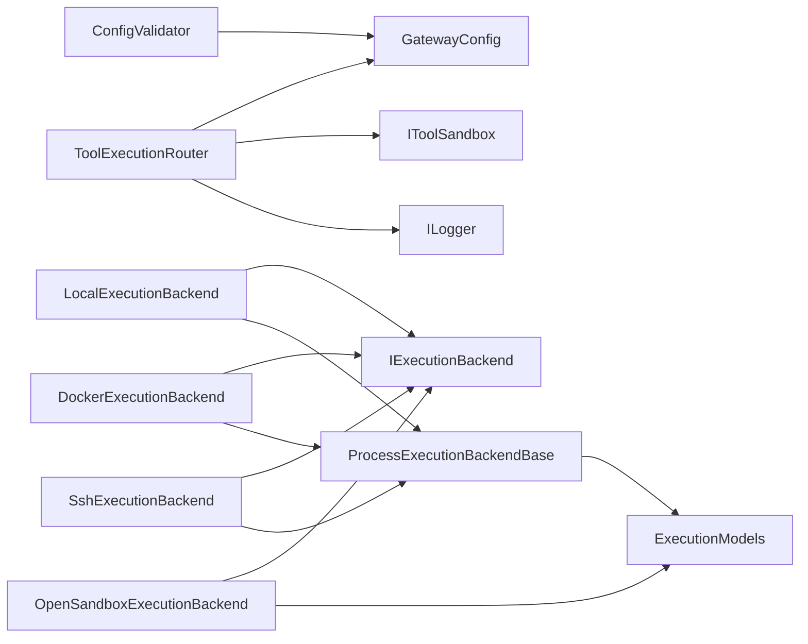

# 远程工具桥接

<cite>
**本文引用的文件**
- [ToolExecutionRouter.cs](file://src/OpenClaw.Agent/Execution/ToolExecutionRouter.cs)
- [ProcessExecutionBackendBase.cs](file://src/OpenClaw.Agent/Execution/ProcessExecutionBackendBase.cs)
- [DockerExecutionBackend.cs](file://src/OpenClaw.Agent/Execution/DockerExecutionBackend.cs)
- [LocalExecutionBackend.cs](file://src/OpenClaw.Agent/Execution/LocalExecutionBackend.cs)
- [OpenSandboxExecutionBackend.cs](file://src/OpenClaw.Agent/Execution/OpenSandboxExecutionBackend.cs)
- [SshExecutionBackend.cs](file://src/OpenClaw.Agent/Execution/SshExecutionBackend.cs)
- [ExecutionProcessService.cs](file://src/OpenClaw.Agent/Execution/ExecutionProcessService.cs)
- [IExecutionBackend.cs](file://src/OpenClaw.Core/Abstractions/IExecutionBackend.cs)
- [ISandboxCapableTool.cs](file://src/OpenClaw.Core/Abstractions/ISandboxCapableTool.cs)
- [IToolSandbox.cs](file://src/OpenClaw.Core/Abstractions/IToolSandbox.cs)
- [ExecutionModels.cs](file://src/OpenClaw.Core/Models/ExecutionModels.cs)
- [SandboxConfig.cs](file://src/OpenClaw.Core/Models/SandboxConfig.cs)
- [ConfigValidator.cs](file://src/OpenClaw.Core/Validation/ConfigValidator.cs)
- [GatewayConfig.cs](file://src/OpenClaw.Gateway/Models/GatewayConfig.cs)
</cite>

## 目录
1. [简介](#简介)
2. [项目结构](#项目结构)
3. [核心组件](#核心组件)
4. [架构总览](#架构总览)
5. [详细组件分析](#详细组件分析)
6. [依赖关系分析](#依赖关系分析)
7. [性能考量](#性能考量)
8. [故障排除指南](#故障排除指南)
9. [结论](#结论)
10. [附录](#附录)

## 简介
本技术文档聚焦于远程工具桥接的执行路由与后端架构，系统性阐述以下内容：
- 工具执行路由机制：基于配置驱动的路由决策、沙箱模式解析与模板选择。
- 执行后端选择策略：本地、Docker 容器、SSH 远程、OpenSandbox 安全沙箱的差异化实现与适用场景。
- 远程执行架构：进程生命周期管理、超时控制、资源清理与故障转移。
- 配置选项、性能特性与安全考虑：各后端的参数、能力与限制。
- 调试技巧、监控指标与故障排除方法：日志、事件、度量与常见问题定位。

## 项目结构
围绕“工具执行路由”与“执行后端”的核心代码位于 Agent 层的 Execution 命名空间，并通过 Core 层的模型与策略进行配置与约束。下图展示关键文件在系统中的位置与职责：

**图表来源**
- [ToolExecutionRouter.cs:1-253](file://src/OpenClaw.Agent/Execution/ToolExecutionRouter.cs#L1-L253)
- [ProcessExecutionBackendBase.cs:1-142](file://src/OpenClaw.Agent/Execution/ProcessExecutionBackendBase.cs#L1-L142)
- [LocalExecutionBackend.cs:1-99](file://src/OpenClaw.Agent/Execution/LocalExecutionBackend.cs#L1-L99)
- [DockerExecutionBackend.cs:1-66](file://src/OpenClaw.Agent/Execution/DockerExecutionBackend.cs#L1-L66)
- [SshExecutionBackend.cs:1-63](file://src/OpenClaw.Agent/Execution/SshExecutionBackend.cs#L1-L63)
- [OpenSandboxExecutionBackend.cs:1-69](file://src/OpenClaw.Agent/Execution/OpenSandboxExecutionBackend.cs#L1-L69)
- [ExecutionProcessService.cs:281-512](file://src/OpenClaw.Agent/Execution/ExecutionProcessService.cs#L281-L512)
- [IExecutionBackend.cs:1-13](file://src/OpenClaw.Core/Abstractions/IExecutionBackend.cs#L1-L13)
- [ISandboxCapableTool.cs:1-14](file://src/OpenClaw.Core/Abstractions/ISandboxCapableTool.cs#L1-L14)
- [IToolSandbox.cs:1-12](file://src/OpenClaw.Core/Abstractions/IToolSandbox.cs#L1-L12)
- [ExecutionModels.cs:1-179](file://src/OpenClaw.Core/Models/ExecutionModels.cs#L1-L179)
- [SandboxConfig.cs:1-152](file://src/OpenClaw.Core/Models/SandboxConfig.cs#L1-L152)

**章节来源**
- [ToolExecutionRouter.cs:1-253](file://src/OpenClaw.Agent/Execution/ToolExecutionRouter.cs#L1-L253)
- [ExecutionModels.cs:1-179](file://src/OpenClaw.Core/Models/ExecutionModels.cs#L1-L179)

## 核心组件
- ToolExecutionRouter：负责根据工具名称与沙箱策略解析执行路由，装配并管理多种执行后端；支持故障转移（fallback）与工作区要求判定。
- ProcessExecutionBackendBase：进程型后端的通用基类，统一处理进程启动、输出捕获、超时与终止逻辑。
- LocalExecutionBackend：本地进程执行，支持工作区限制、环境变量注入与交互式输入。
- DockerExecutionBackend：通过 docker CLI 启动容器执行命令，支持镜像、工作目录与环境变量映射。
- SshExecutionBackend：通过 ssh 远程执行命令，支持主机、端口、用户名与私钥认证。
- OpenSandboxExecutionBackend：调用 IToolSandbox 执行沙箱命令，内置超时控制与结果封装。
- ExecutionProcessService：管理长生命周期进程（会话、输入、日志读取、状态查询与清理）。

**章节来源**
- [ToolExecutionRouter.cs:1-253](file://src/OpenClaw.Agent/Execution/ToolExecutionRouter.cs#L1-L253)
- [ProcessExecutionBackendBase.cs:1-142](file://src/OpenClaw.Agent/Execution/ProcessExecutionBackendBase.cs#L1-L142)
- [LocalExecutionBackend.cs:1-99](file://src/OpenClaw.Agent/Execution/LocalExecutionBackend.cs#L1-L99)
- [DockerExecutionBackend.cs:1-66](file://src/OpenClaw.Agent/Execution/DockerExecutionBackend.cs#L1-L66)
- [SshExecutionBackend.cs:1-63](file://src/OpenClaw.Agent/Execution/SshExecutionBackend.cs#L1-L63)
- [OpenSandboxExecutionBackend.cs:1-69](file://src/OpenClaw.Agent/Execution/OpenSandboxExecutionBackend.cs#L1-L69)
- [ExecutionProcessService.cs:281-512](file://src/OpenClaw.Agent/Execution/ExecutionProcessService.cs#L281-L512)

## 架构总览
下图展示从路由到执行再到进程管理的整体流程，以及各后端的差异化点：

**图表来源**
- [ToolExecutionRouter.cs:65-157](file://src/OpenClaw.Agent/Execution/ToolExecutionRouter.cs#L65-L157)
- [ProcessExecutionBackendBase.cs:61-128](file://src/OpenClaw.Agent/Execution/ProcessExecutionBackendBase.cs#L61-L128)
- [OpenSandboxExecutionBackend.cs:22-67](file://src/OpenClaw.Agent/Execution/OpenSandboxExecutionBackend.cs#L22-L67)
- [ExecutionProcessService.cs:301-387](file://src/OpenClaw.Agent/Execution/ExecutionProcessService.cs#L301-L387)

## 详细组件分析

### ToolExecutionRouter 路由算法与策略
- 路由解析优先级
  - 工具级配置：若在 Execution.Tools 中为特定工具配置了 Backend，则直接使用。
  - 沙箱模式：若工具实现 ISandboxCapableTool，依据 SandboxConfig 与 ToolSandboxPolicy 解析有效模式（None/Prefer/Require），并决定是否走 OpenSandbox。
  - 默认回退：若未命中工具配置且沙箱模式为 None，则返回 false，交由上层处理。
- 后端装配
  - 支持的类型：local、docker、ssh、opensandbox。
  - 本地后端始终可用；Docker/SSH 需要相应配置；OpenSandbox 需要 IToolSandbox 注入与配置启用。
- 故障转移
  - ExecuteAsync 在指定后端执行失败时，若存在 fallbackBackend 且允许本地回退，则切换到备选后端重试。
- 工作区要求
  - Docker/SSH 类型默认需要工作区；可通过 RequireWorkspace 控制。
- 进程路由
  - ResolveBackendForProcess 专门用于“process/shell”等进程类工具，优先工具配置，其次沙箱策略，最后回退到默认后端。

**图表来源**
- [ToolExecutionRouter.cs:65-112](file://src/OpenClaw.Agent/Execution/ToolExecutionRouter.cs#L65-L112)
- [ToolExecutionRouter.cs:164-203](file://src/OpenClaw.Agent/Execution/ToolExecutionRouter.cs#L164-L203)
- [ToolExecutionRouter.cs:236-251](file://src/OpenClaw.Agent/Execution/ToolExecutionRouter.cs#L236-L251)

**章节来源**
- [ToolExecutionRouter.cs:1-253](file://src/OpenClaw.Agent/Execution/ToolExecutionRouter.cs#L1-L253)
- [ISandboxCapableTool.cs:1-14](file://src/OpenClaw.Core/Abstractions/ISandboxCapableTool.cs#L1-L14)
- [SandboxConfig.cs:48-152](file://src/OpenClaw.Core/Models/SandboxConfig.cs#L48-L152)

### 进程执行基类与通用流程
- 统一能力
  - SupportsOneShotCommands、SupportsProcesses、SupportsPty（按平台）、SupportsInteractiveInput。
- 进程启动
  - StartProcessAsync 创建 ProcessStartInfo 并启动，捕获标准输出/错误流，返回托管进程句柄。
- 执行流程
  - ExecuteProcessAsync 启动进程、异步读取输出、设置超时取消、等待退出；超时则尝试终止进程树并返回超时结果。
- 资源清理
  - 通过托管进程与超时令牌确保资源释放；进程退出后由 ExecutionProcessService 进行状态更新与度量上报。

**图表来源**
- [ProcessExecutionBackendBase.cs:61-128](file://src/OpenClaw.Agent/Execution/ProcessExecutionBackendBase.cs#L61-L128)

**章节来源**
- [ProcessExecutionBackendBase.cs:1-142](file://src/OpenClaw.Agent/Execution/ProcessExecutionBackendBase.cs#L1-L142)
- [ExecutionModels.cs:88-143](file://src/OpenClaw.Core/Models/ExecutionModels.cs#L88-L143)

### 执行后端实现差异

#### 本地执行（LocalExecutionBackend）
- 特性
  - 支持交互式输入与 PTY（非 Windows 平台）。
  - 可强制工作区根路径校验，拒绝越权目录。
  - 合并全局与请求级环境变量。
- 关键点
  - 工作目录解析支持 ~ 用户目录展开与绝对路径规范化。
  - 超时与输出捕获由基类统一处理。

**章节来源**
- [LocalExecutionBackend.cs:1-99](file://src/OpenClaw.Agent/Execution/LocalExecutionBackend.cs#L1-L99)
- [ExecutionModels.cs:62-86](file://src/OpenClaw.Core/Models/ExecutionModels.cs#L62-L86)

#### Docker 执行（DockerExecutionBackend）
- 特性
  - 通过 docker CLI 启动容器，自动传入 --rm、工作目录、环境变量与命令参数。
  - 镜像来源优先请求模板，其次后端配置。
- 关键点
  - 必须提供镜像，否则抛出异常。
  - 超时与输出捕获由基类统一处理。

**章节来源**
- [DockerExecutionBackend.cs:1-66](file://src/OpenClaw.Agent/Execution/DockerExecutionBackend.cs#L1-L66)
- [ExecutionModels.cs:26-41](file://src/OpenClaw.Core/Models/ExecutionModels.cs#L26-L41)

#### SSH 执行（SshExecutionBackend）
- 牺牲
  - 通过 ssh 命令在远端主机执行，支持端口、私钥与工作目录切换。
  - 环境变量以“KEY=VAL 命令”的形式拼接到远端命令前。
- 关键点
  - Host/Username 必填；必要时对含空格的值进行转义引号处理。
  - 超时与输出捕获由基类统一处理。

**章节来源**
- [SshExecutionBackend.cs:1-63](file://src/OpenClaw.Agent/Execution/SshExecutionBackend.cs#L1-L63)
- [ExecutionModels.cs:26-41](file://src/OpenClaw.Core/Models/ExecutionModels.cs#L26-L41)

#### OpenSandbox 执行（OpenSandboxExecutionBackend）
- 特性
  - 调用 IToolSandbox.ExecuteAsync 执行沙箱命令，内部可设定超时。
  - 返回结果封装为 ExecutionResult，TimedOut=false（由内部超时逻辑单独处理）。
- 关键点
  - 作为独立后端存在，不参与进程型后端的 StartProcessAsync 流程。
  - 适合需要强隔离与受控环境的工具执行。

**章节来源**
- [OpenSandboxExecutionBackend.cs:1-69](file://src/OpenClaw.Agent/Execution/OpenSandboxExecutionBackend.cs#L1-L69)
- [IToolSandbox.cs:1-12](file://src/OpenClaw.Core/Abstractions/IToolSandbox.cs#L1-L12)
- [ExecutionModels.cs:77-86](file://src/OpenClaw.Core/Models/ExecutionModels.cs#L77-L86)

### 进程生命周期管理（ExecutionProcessService）
- 生命周期
  - StartAsync：解析路由（含沙箱模式），按需启动进程，返回句柄。
  - 状态查询：GetStatus、WaitAsync。
  - 日志读取：ReadLog（支持偏移增量读取）。
  - 输入写入：WriteAsync（交互式输入）。
  - 清理：Shutdown 时回收孤儿进程，定期修剪已完成进程。
- 度量与事件
  - 退出事件触发计数（完成/失败/被杀/超时），并更新保留数量。

**图表来源**
- [ExecutionProcessService.cs:281-512](file://src/OpenClaw.Agent/Execution/ExecutionProcessService.cs#L281-L512)
- [ToolExecutionRouter.cs:164-203](file://src/OpenClaw.Agent/Execution/ToolExecutionRouter.cs#L164-L203)
- [ProcessExecutionBackendBase.cs:23-44](file://src/OpenClaw.Agent/Execution/ProcessExecutionBackendBase.cs#L23-L44)

**章节来源**
- [ExecutionProcessService.cs:281-512](file://src/OpenClaw.Agent/Execution/ExecutionProcessService.cs#L281-L512)
- [ExecutionModels.cs:96-178](file://src/OpenClaw.Core/Models/ExecutionModels.cs#L96-L178)

## 依赖关系分析
- 路由器依赖
  - GatewayConfig：执行配置、工具路由、后端配置、沙箱策略。
  - IToolSandbox：当启用 OpenSandbox 时提供沙箱执行能力。
  - ILogger：记录沙箱模式解析信息。
- 后端依赖
  - IExecutionBackend：统一执行接口。
  - ProcessExecutionBackendBase：进程型后端共享逻辑。
  - ExecutionModels：请求/结果/能力/进程模型。
- 验证与约束
  - ConfigValidator：校验 OpenSandbox 的 Endpoint、TTL、模板等必填项。

**图表来源**
- [ToolExecutionRouter.cs:16-63](file://src/OpenClaw.Agent/Execution/ToolExecutionRouter.cs#L16-L63)
- [ProcessExecutionBackendBase.cs:8-17](file://src/OpenClaw.Agent/Execution/ProcessExecutionBackendBase.cs#L8-L17)
- [ExecutionModels.cs:1-179](file://src/OpenClaw.Core/Models/ExecutionModels.cs#L1-L179)
- [ConfigValidator.cs:160-187](file://src/OpenClaw.Core/Validation/ConfigValidator.cs#L160-L187)

**章节来源**
- [ToolExecutionRouter.cs:1-253](file://src/OpenClaw.Agent/Execution/ToolExecutionRouter.cs#L1-L253)
- [ConfigValidator.cs:160-187](file://src/OpenClaw.Core/Validation/ConfigValidator.cs#L160-L187)

## 性能考量
- 超时控制
  - 后端配置的 TimeoutSeconds 对所有类型生效；OpenSandbox 内部也设置超时令牌。
  - 进程型后端在超时后尝试终止进程树，避免僵尸进程。
- 输出捕获
  - 异步读取标准输出/错误，降低阻塞风险；大输出建议分段读取（日志偏移）。
- 资源占用
  - Docker/SSH 启动额外进程或连接，需评估并发与连接池；本地执行开销最小。
- 进程保留
  - ExecutionProcessService 对已完成进程进行时间与数量限制，避免内存膨胀。

**章节来源**
- [ProcessExecutionBackendBase.cs:87-128](file://src/OpenClaw.Agent/Execution/ProcessExecutionBackendBase.cs#L87-L128)
- [ExecutionProcessService.cs:491-512](file://src/OpenClaw.Agent/Execution/ExecutionProcessService.cs#L491-L512)

## 故障排除指南
- 常见错误与定位
  - 后端未配置：ExecuteAsync 抛出无效操作异常，提示后端未配置。
  - Docker 缺少镜像：CreateProcessStartInfo 抛出异常，提示需要镜像。
  - SSH 缺少主机/用户名：CreateProcessStartInfo 抛出异常，提示需要 Host 和 Username。
  - 本地工作区越权：ResolveWorkingDirectory 抛出异常，提示工作目录超出工作区根。
  - OpenSandbox 未启用：沙箱模式解析为 None 或未装配 opensandbox 后端。
- 配置校验
  - 使用 ConfigValidator 校验 OpenSandbox 的 Endpoint/TTL/模板等字段。
- 调试技巧
  - 开启路由器日志，查看沙箱模式解析详情。
  - 使用 ExecutionProcessService 的日志读取与状态查询，定位长时间运行进程问题。
  - 观察度量指标（完成/失败/超时/被杀）判断后端稳定性。

**章节来源**
- [ToolExecutionRouter.cs:88-96](file://src/OpenClaw.Agent/Execution/ToolExecutionRouter.cs#L88-L96)
- [DockerExecutionBackend.cs:24-26](file://src/OpenClaw.Agent/Execution/DockerExecutionBackend.cs#L24-L26)
- [SshExecutionBackend.cs:24-25](file://src/OpenClaw.Agent/Execution/SshExecutionBackend.cs#L24-L25)
- [LocalExecutionBackend.cs:77-82](file://src/OpenClaw.Agent/Execution/LocalExecutionBackend.cs#L77-L82)
- [ConfigValidator.cs:160-187](file://src/OpenClaw.Core/Validation/ConfigValidator.cs#L160-L187)

## 结论
该远程工具桥接通过“配置驱动的路由 + 统一的进程基类 + 多后端适配”的架构，实现了灵活、可扩展且安全的工具执行体系。路由层结合沙箱策略与工具配置，后端层统一处理超时、输出与资源清理，进程服务层保障长生命周期工具的可观测性与可控性。针对不同场景（本地开发、容器隔离、远程执行、安全沙箱），可按需选择与组合后端，同时通过严格的配置校验与日志/度量体系提升运维可靠性。

## 附录

### 配置选项与模型摘要
- 执行配置（ExecutionConfig）
  - Enabled：是否启用执行路由。
  - DefaultBackend：默认后端名称。
  - Profiles：后端配置字典（键不区分大小写）。
  - Tools：工具到后端的路由映射。
- 后端配置（ExecutionBackendProfileConfig）
  - Type：后端类型（local/docker/ssh/opensandbox）。
  - Enabled：是否启用。
  - WorkingDirectory/Environment/Image/Host/Port/Username/PrivateKeyPath/TimeoutSeconds/WorkspaceRoot：各后端所需参数。
- 请求/结果/进程模型（ExecutionModels）
  - ExecutionRequest/ExecutionResult：单次执行的请求与结果。
  - ExecutionProcessStartRequest/ExecutionProcessHandle/ExecutionProcessStatus/ExecutionProcessLogRequest/ExecutionProcessLogResult：进程生命周期管理相关模型。
- 沙箱配置（SandboxConfig）
  - Provider/Endpoint/ApiKey/DefaultTTL/Tools：沙箱提供者与工具级策略。

**章节来源**
- [ExecutionModels.cs:8-179](file://src/OpenClaw.Core/Models/ExecutionModels.cs#L8-L179)
- [SandboxConfig.cs:1-152](file://src/OpenClaw.Core/Models/SandboxConfig.cs#L1-L152)