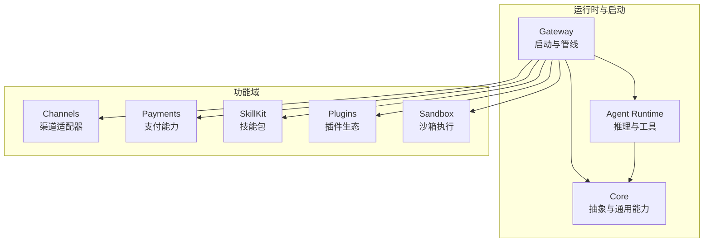
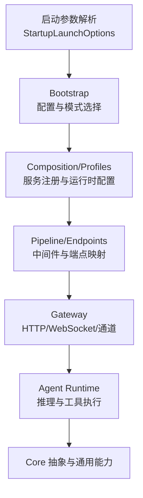
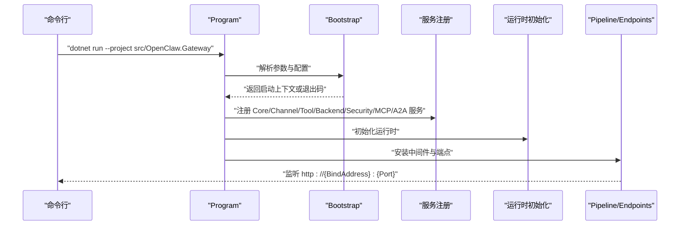
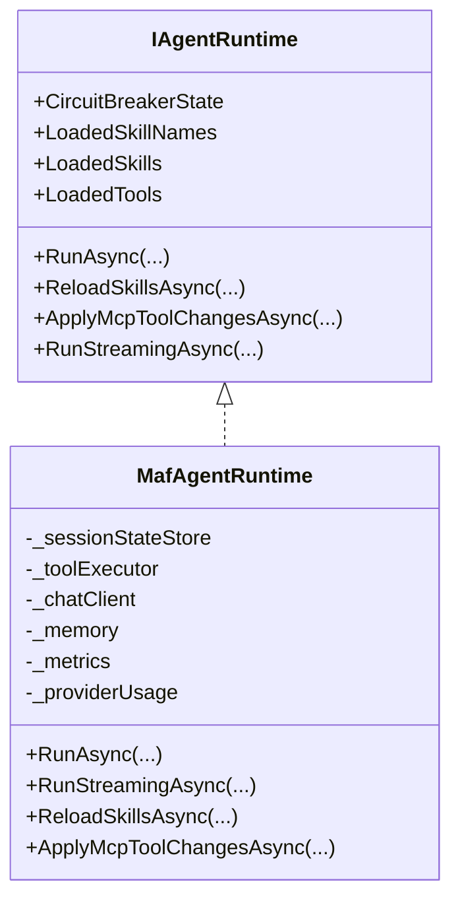
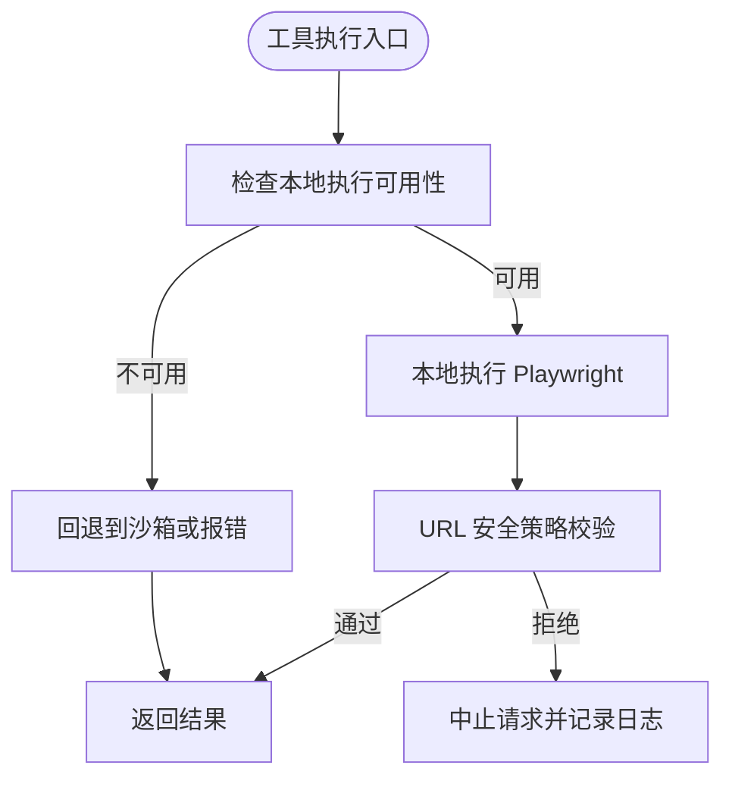
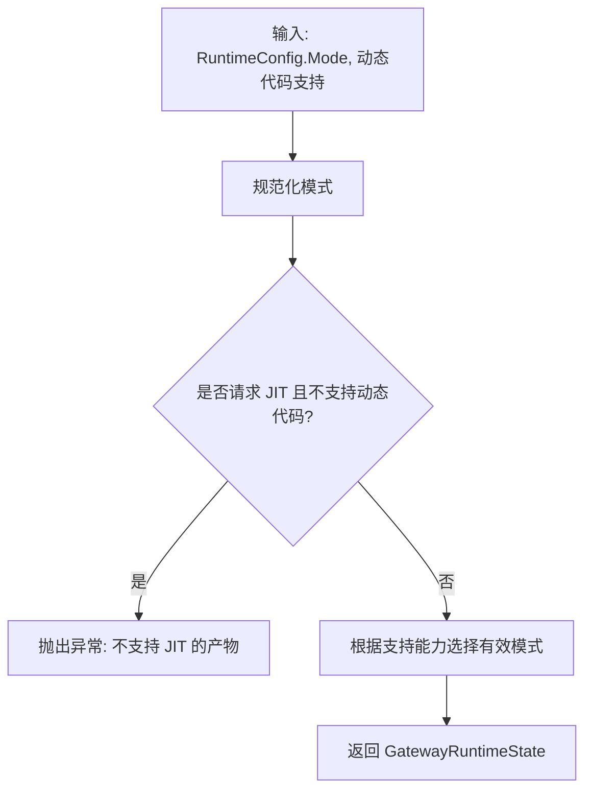
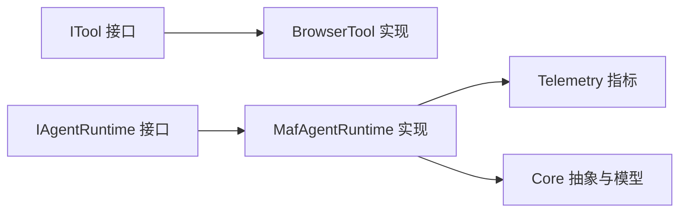

# 代码规范和最佳实践

<cite>
**本文引用的文件**
- [Directory.Build.props](file://Directory.Build.props)
- [Directory.Build.targets](file://src/OpenClaw.Core/Directory.Build.targets)
- [Program.cs](file://src/OpenClaw.Gateway/Program.cs)
- [StartupLaunchOptions.cs](file://src/OpenClaw.Gateway/Bootstrap/StartupLaunchOptions.cs)
- [IAgentRuntime.cs](file://src/OpenClaw.Agent/IAgentRuntime.cs)
- [MafAgentRuntime.cs](file://src/OpenClaw.Agent/MafAgentRuntime.cs)
- [RuntimeModels.cs](file://src/OpenClaw.Core/Models/RuntimeModels.cs)
- [ITool.cs](file://src/OpenClaw.Core/Abstractions/ITool.cs)
- [BrowserTool.cs](file://src/OpenClaw.Agent/Tools/BrowserTool.cs)
- [Telemetry.cs](file://src/OpenClaw.Core/Observability/Telemetry.cs)
- [ConfigValidator.cs](file://src/OpenClaw.Core/Validation/ConfigValidator.cs)
- [ToolPathPolicy.cs](file://src/OpenClaw.Core/Security/ToolPathPolicy.cs)
- [DocsConsistencyTests.cs](file://src/OpenClaw.Tests/DocsConsistencyTests.cs)
- [README.md](file://README.md)
</cite>

## 目录
1. [引言](#引言)
2. [项目结构](#项目结构)
3. [核心组件](#核心组件)
4. [架构总览](#架构总览)
5. [详细组件分析](#详细组件分析)
6. [依赖关系分析](#依赖关系分析)
7. [性能考量](#性能考量)
8. [故障排查指南](#故障排查指南)
9. [结论](#结论)
10. [附录](#附录)

## 引言
本指南面向 OpenClaw.NET 团队与贡献者，系统化总结并提炼本仓库的代码规范、最佳实践与工程化标准。内容覆盖 C# 代码风格与命名约定、架构原则（含 SOLID）、设计模式与依赖注入实践、代码审查清单、静态分析与质量度量、文档注释规范、API 设计原则、错误处理策略、重构技巧与遗留代码治理、以及团队协作与版本控制流程。

## 项目结构
OpenClaw.NET 采用多项目分层组织：Gateway 启动与运行时组合、Agent 运行时、Core 抽象与通用能力、各功能域模块（渠道、支付、技能包等），并辅以 CLI、桌面配套应用、仪表盘前端等客户端与工具。

- 分层与职责
  - Gateway：启动、配置加载、服务注册、中间件与端点映射、运行时初始化与生命周期管理
  - Agent：推理、工具执行、会话与记忆、技能装载与提示构建
  - Core：抽象接口、模型、验证器、可观测性、安全策略、管道与中间件
  - 功能域：渠道适配器、支付、技能包、插件桥接、沙箱集成等

- 关键构建与工程化
  - 统一目标框架与语言版本、可空引用、隐式 using、严格警告为错误
  - NativeAOT 友好配置（TrimMode=link、InvariantGlobalization 等）
  - 模块化目录构建 Targets，提升编译稳定性

**图表来源**
- [Program.cs:1-124](file://src/OpenClaw.Gateway/Program.cs#L1-L124)
- [MafAgentRuntime.cs:1-120](file://src/OpenClaw.Agent/MafAgentRuntime.cs#L1-L120)
- [RuntimeModels.cs:1-69](file://src/OpenClaw.Core/Models/RuntimeModels.cs#L1-L69)

**章节来源**
- [Directory.Build.props:1-41](file://Directory.Build.props#L1-L41)
- [Directory.Build.targets:1-37](file://src/OpenClaw.Core/Directory.Build.targets#L1-L37)
- [README.md:145-197](file://README.md#L145-L197)

## 核心组件
- 接口与契约
  - IAgentRuntime：定义 Agent 运行时的核心行为（同步/流式推理、技能重载、MCP 工具热替换）
  - ITool：最小化工具接口，面向 AOT 裁剪友好
- 运行时与模式
  - RuntimeConfig/RuntimeModeResolver：统一解析运行时模式（aot/jit/auto）与编排器（native/maf）
- 观测性与度量
  - Telemetry：集中式 ActivitySource 与 Meter，定义关键指标（工具执行时延、限流计数、审批队列深度）
- 配置与安全
  - ConfigValidator：启动前严格校验配置，失败即刻中止
  - ToolPathPolicy：路径白名单与安全策略（当前以注释形式存在，体现安全策略设计思路）

**章节来源**
- [IAgentRuntime.cs:1-51](file://src/OpenClaw.Agent/IAgentRuntime.cs#L1-L51)
- [ITool.cs:1-17](file://src/OpenClaw.Core/Abstractions/ITool.cs#L1-L17)
- [RuntimeModels.cs:1-69](file://src/OpenClaw.Core/Models/RuntimeModels.cs#L1-L69)
- [Telemetry.cs:1-54](file://src/OpenClaw.Core/Observability/Telemetry.cs#L1-L54)
- [ConfigValidator.cs:1-200](file://src/OpenClaw.Core/Validation/ConfigValidator.cs#L1-L200)
- [ToolPathPolicy.cs:1-136](file://src/OpenClaw.Core/Security/ToolPathPolicy.cs#L1-L136)

## 架构总览
OpenClaw.NET 将“启动”与“运行时”解耦为三层：Bootstrap（配置加载与模式选择）、Composition/Profiles（服务注册与运行时配置）、Pipeline/Endpoints（中间件、通道与端点）。Gateway 负责接入面与安全策略，Agent Runtime 负责推理与工具执行；通过可选 MAF 适配器切换编排策略。

**图表来源**
- [Program.cs:1-124](file://src/OpenClaw.Gateway/Program.cs#L1-L124)
- [StartupLaunchOptions.cs:1-122](file://src/OpenClaw.Gateway/Bootstrap/StartupLaunchOptions.cs#L1-L122)
- [RuntimeModels.cs:1-69](file://src/OpenClaw.Core/Models/RuntimeModels.cs#L1-L69)

## 详细组件分析

### 组件一：Gateway 启动与运行时装配
- 控制流要点
  - 解析启动参数，支持 doctor/health-check/quickstart 等模式
  - Bootstrap 完成配置加载与模式解析，必要时提前退出
  - 注册核心服务（Core、Channel、Tool、Backend、Security、MCP、A2A）
  - 初始化运行时、安装中间件与端点，启动监听
- 错误恢复
  - 启动阶段异常支持交互式快速修复与恢复尝试
  - 失败时输出诊断报告，便于定位问题

**图表来源**
- [Program.cs:1-124](file://src/OpenClaw.Gateway/Program.cs#L1-L124)
- [StartupLaunchOptions.cs:1-122](file://src/OpenClaw.Gateway/Bootstrap/StartupLaunchOptions.cs#L1-L122)

**章节来源**
- [Program.cs:1-124](file://src/OpenClaw.Gateway/Program.cs#L1-L124)
- [StartupLaunchOptions.cs:1-122](file://src/OpenClaw.Gateway/Bootstrap/StartupLaunchOptions.cs#L1-L122)

### 组件二：Agent 运行时（MAF 集成）
- 职责边界
  - 会话状态管理、消息构建、技能注入、工具声明与调用、历史压缩/修剪
  - 支持同步与流式推理，具备合同预算与令牌预算控制
- 并发与线程安全
  - 技能列表与工具集合访问加锁，避免并发读写
- 可观测性
  - 使用 Telemetry 记录活动与指标，便于追踪与告警

**图表来源**
- [IAgentRuntime.cs:1-51](file://src/OpenClaw.Agent/IAgentRuntime.cs#L1-L51)
- [MafAgentRuntime.cs:1-120](file://src/OpenClaw.Agent/MafAgentRuntime.cs#L1-L120)

**章节来源**
- [IAgentRuntime.cs:1-51](file://src/OpenClaw.Agent/IAgentRuntime.cs#L1-L51)
- [MafAgentRuntime.cs:1-200](file://src/OpenClaw.Agent/MafAgentRuntime.cs#L1-L200)

### 组件三：工具接口与浏览器工具
- ITool 最小化设计，仅保留名称、描述、参数 Schema 与异步执行入口，利于 AOT 裁剪
- BrowserTool 展示了“原生工具 + 沙箱路由”的典型实现：在不满足本地执行条件时给出明确错误提示，并内置安全策略（URL 安全、私网阻断、CIDR 白黑名单等）

**图表来源**
- [ITool.cs:1-17](file://src/OpenClaw.Core/Abstractions/ITool.cs#L1-L17)
- [BrowserTool.cs:1-200](file://src/OpenClaw.Agent/Tools/BrowserTool.cs#L1-L200)

**章节来源**
- [ITool.cs:1-17](file://src/OpenClaw.Core/Abstractions/ITool.cs#L1-L17)
- [BrowserTool.cs:1-200](file://src/OpenClaw.Agent/Tools/BrowserTool.cs#L1-L200)

### 组件四：运行时模式与编排器
- RuntimeConfig 提供运行时模式与编排器选择
- RuntimeModeResolver 根据请求模式与动态代码支持能力，决定有效模式（aot/jit），并在不满足要求时抛出异常
- 编排器默认 native，MAF 仅在启用的产物中生效

**图表来源**
- [RuntimeModels.cs:1-69](file://src/OpenClaw.Core/Models/RuntimeModels.cs#L1-L69)

**章节来源**
- [RuntimeModels.cs:1-69](file://src/OpenClaw.Core/Models/RuntimeModels.cs#L1-L69)

### 组件五：配置验证与安全策略
- ConfigValidator 在启动阶段对端口、LLM、内存、会话、WebSocket、工具、沙箱等进行严格校验，失败即刻中止，确保系统在健康状态下运行
- ToolPathPolicy 体现了路径白名单与安全策略的设计思路（当前以注释形式存在，建议后续落地）

**章节来源**
- [ConfigValidator.cs:1-200](file://src/OpenClaw.Core/Validation/ConfigValidator.cs#L1-L200)
- [ToolPathPolicy.cs:1-136](file://src/OpenClaw.Core/Security/ToolPathPolicy.cs#L1-L136)

## 依赖关系分析
- 松耦合与高内聚
  - IAgentRuntime 与具体实现解耦，便于替换编排器（native/maf）
  - ITool 保持最小接口，降低裁剪成本
- 依赖注入与扩展点
  - Gateway 通过 AddOpenClaw* 扩展方法注册服务，形成清晰的服务边界
- 可观测性贯穿
  - Telemetry 作为全局度量与追踪入口，被 Agent Runtime 与 Core 广泛使用

**图表来源**
- [IAgentRuntime.cs:1-51](file://src/OpenClaw.Agent/IAgentRuntime.cs#L1-L51)
- [MafAgentRuntime.cs:1-120](file://src/OpenClaw.Agent/MafAgentRuntime.cs#L1-L120)
- [ITool.cs:1-17](file://src/OpenClaw.Core/Abstractions/ITool.cs#L1-L17)
- [Telemetry.cs:1-54](file://src/OpenClaw.Core/Observability/Telemetry.cs#L1-L54)

**章节来源**
- [IAgentRuntime.cs:1-51](file://src/OpenClaw.Agent/IAgentRuntime.cs#L1-L51)
- [MafAgentRuntime.cs:1-120](file://src/OpenClaw.Agent/MafAgentRuntime.cs#L1-L120)
- [ITool.cs:1-17](file://src/OpenClaw.Core/Abstractions/ITool.cs#L1-L17)
- [Telemetry.cs:1-54](file://src/OpenClaw.Core/Observability/Telemetry.cs#L1-L54)

## 性能考量
- NativeAOT 优化
  - 启用 TrimMode=link、InvariantGlobalization，减少运行时开销与二进制体积
  - ITool 等关键接口最小化，有利于裁剪
- 运行时模式选择
  - aot：低内存占用，适合主流部署；jit：兼容更广但资源消耗更高
- 观测性驱动优化
  - 通过 Telemetry 的 Histogram/Counter/Gauge 持续监控工具执行时延、限流与审批队列深度，指导容量与策略调整

**章节来源**
- [Directory.Build.props:1-41](file://Directory.Build.props#L1-L41)
- [RuntimeModels.cs:1-69](file://src/OpenClaw.Core/Models/RuntimeModels.cs#L1-L69)
- [Telemetry.cs:1-54](file://src/OpenClaw.Core/Observability/Telemetry.cs#L1-L54)

## 故障排查指南
- 启动失败
  - 使用 doctor/health-check 快速定位配置与环境问题
  - 查看 StartupFailureReporter 输出的诊断信息
- 配置错误
  - ConfigValidator 会在启动前集中报错，按错误提示修正配置项
- 工具执行异常
  - BrowserTool 在本地不可用时给出明确提示；检查沙箱配置与模板
- 观测性
  - 通过 /metrics 与 /health 获取运行时指标与健康状态

**章节来源**
- [Program.cs:1-124](file://src/OpenClaw.Gateway/Program.cs#L1-L124)
- [ConfigValidator.cs:1-200](file://src/OpenClaw.Core/Validation/ConfigValidator.cs#L1-L200)
- [BrowserTool.cs:1-200](file://src/OpenClaw.Agent/Tools/BrowserTool.cs#L1-L200)

## 结论
本指南从工程化与架构角度总结了 OpenClaw.NET 的代码规范与最佳实践：以最小接口、清晰分层、严格配置校验与可观测性为核心，结合 NativeAOT 友好设计与可插拔的运行时模式，既保证生产可用性，又为演进留足空间。建议团队在日常开发中持续遵循这些规范，并通过自动化测试与文档一致性检查保障质量。

## 附录

### 代码风格与命名约定
- 命名
  - 类型与接口：PascalCase；枚举值：PascalCase；常量：PascalCase
  - 方法与属性：PascalCase；字段：私有使用下划线前缀（如 _field）
  - 参数与局部变量：camelCase
- 文件与项目
  - 项目文件与目录按功能域划分，保持单一职责
- 注释与文档
  - 公共 API 与复杂逻辑需提供 XML 文档注释，说明用途、参数、返回值与异常

**章节来源**
- [IAgentRuntime.cs:1-51](file://src/OpenClaw.Agent/IAgentRuntime.cs#L1-L51)
- [MafAgentRuntime.cs:1-120](file://src/OpenClaw.Agent/MafAgentRuntime.cs#L1-L120)

### 架构原则与 SOLID 应用
- 单一职责：IAgentRuntime、ITool、ConfigValidator 各自聚焦单一职责
- 开闭原则：通过接口与扩展方法（AddOpenClaw*）扩展服务，不修改既有实现
- 里氏替换：MafAgentRuntime 实现 IAgentRuntime，可直接替换使用
- 接口隔离：ITool 最小化，避免非必要的依赖
- 依赖倒置：Gateway 依赖抽象（Core、Agent），并通过 DI 注入具体实现

**章节来源**
- [IAgentRuntime.cs:1-51](file://src/OpenClaw.Agent/IAgentRuntime.cs#L1-L51)
- [ITool.cs:1-17](file://src/OpenClaw.Core/Abstractions/ITool.cs#L1-L17)
- [Program.cs:1-124](file://src/OpenClaw.Gateway/Program.cs#L1-L124)

### 设计模式与依赖注入最佳实践
- 工厂与注册
  - 使用扩展方法注册服务（AddOpenClaw*），集中配置
- 中间件与管道
  - 通过 UseOpenClawPipeline 组织中间件顺序与职责
- 事件与钩子
  - 通过钩子与回调（如 ToolApprovalCallback）实现横切关注点

**章节来源**
- [Program.cs:1-124](file://src/OpenClaw.Gateway/Program.cs#L1-L124)
- [MafAgentRuntime.cs:1-120](file://src/OpenClaw.Agent/MafAgentRuntime.cs#L1-L120)

### 代码审查清单
- 接口与契约
  - 是否最小化接口？是否符合 AOT 裁剪需求？
  - 是否提供充分的 XML 文档注释？
- 配置与安全
  - 是否通过 ConfigValidator 校验关键配置？
  - 是否考虑路径白名单与 URL 安全策略？
- 错误处理
  - 是否捕获并记录关键异常？是否向用户返回可理解的错误信息？
- 观测性
  - 是否使用 Telemetry 记录关键指标与活动？
- 测试与一致性
  - 是否包含单元测试与文档一致性测试？

**章节来源**
- [ConfigValidator.cs:1-200](file://src/OpenClaw.Core/Validation/ConfigValidator.cs#L1-L200)
- [ToolPathPolicy.cs:1-136](file://src/OpenClaw.Core/Security/ToolPathPolicy.cs#L1-L136)
- [Telemetry.cs:1-54](file://src/OpenClaw.Core/Observability/Telemetry.cs#L1-L54)
- [DocsConsistencyTests.cs:1-115](file://src/OpenClaw.Tests/DocsConsistencyTests.cs#L1-L115)

### 静态分析与代码质量度量
- 编译期
  - TreatWarningsAsErrors=true，确保问题不被忽略
  - LangVersion、Nullable、ImplicitUsings 统一语言特性
- 运行时度量
  - 工具执行时延、限流计数、审批队列深度等指标
- 文档一致性
  - 通过 DocsConsistencyTests 校验文档与命令/端点的一致性

**章节来源**
- [Directory.Build.props:1-41](file://Directory.Build.props#L1-L41)
- [Telemetry.cs:1-54](file://src/OpenClaw.Core/Observability/Telemetry.cs#L1-L54)
- [DocsConsistencyTests.cs:1-115](file://src/OpenClaw.Tests/DocsConsistencyTests.cs#L1-L115)

### 文档注释规范
- 公共类型与成员必须提供 XML 注释，至少包含摘要、参数说明、返回值说明与可能的异常说明
- 复杂算法与业务规则需补充说明背景与边界条件

**章节来源**
- [IAgentRuntime.cs:1-51](file://src/OpenClaw.Agent/IAgentRuntime.cs#L1-L51)
- [MafAgentRuntime.cs:1-120](file://src/OpenClaw.Agent/MafAgentRuntime.cs#L1-L120)

### API 设计原则
- 清晰的端点语义与一致的响应格式
- 明确的鉴权与速率限制策略
- 对外暴露的 API 应提供 OpenAPI 文档

**章节来源**
- [Program.cs:1-124](file://src/OpenClaw.Gateway/Program.cs#L1-L124)

### 错误处理策略
- 启动阶段失败即刻中止，提供诊断信息
- 运行时异常分类处理，区分用户可恢复与系统级错误
- 使用结构化日志与分布式追踪，便于定位问题

**章节来源**
- [Program.cs:1-124](file://src/OpenClaw.Gateway/Program.cs#L1-L124)
- [MafAgentRuntime.cs:1-200](file://src/OpenClaw.Agent/MafAgentRuntime.cs#L1-L200)

### 重构技巧与遗留代码处理
- 优先最小化接口与抽象，降低耦合
- 逐步替换复杂类为更小、可测试的单元
- 对于已注释的安全策略（如 ToolPathPolicy），制定落地计划并纳入迭代

**章节来源**
- [ITool.cs:1-17](file://src/OpenClaw.Core/Abstractions/ITool.cs#L1-L17)
- [ToolPathPolicy.cs:1-136](file://src/OpenClaw.Core/Security/ToolPathPolicy.cs#L1-L136)

### 团队协作与版本控制流程
- 使用 Pull Request 模板进行变更评审
- 通过 CI/CD 自动化构建与测试，确保主干稳定
- 发布前执行 doctor 检查与兼容性验证

**章节来源**
- [.github/PULL_REQUEST_TEMPLATE.md](file://.github/PULL_REQUEST_TEMPLATE.md)
- [README.md:651-670](file://README.md#L651-L670)