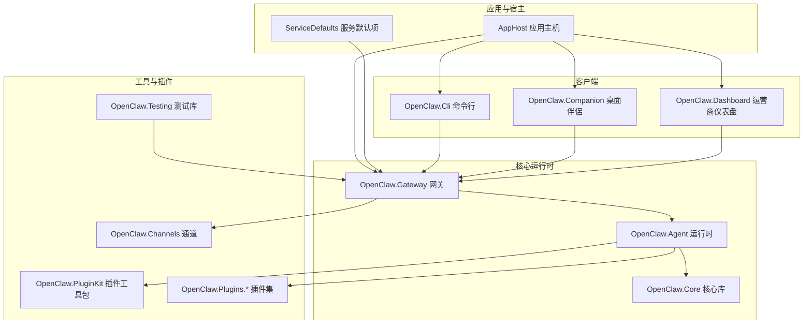
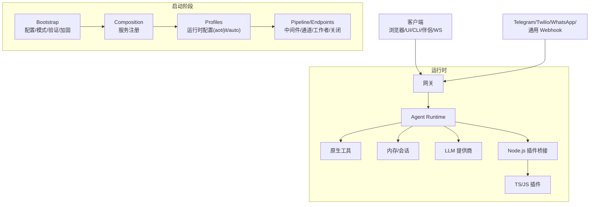
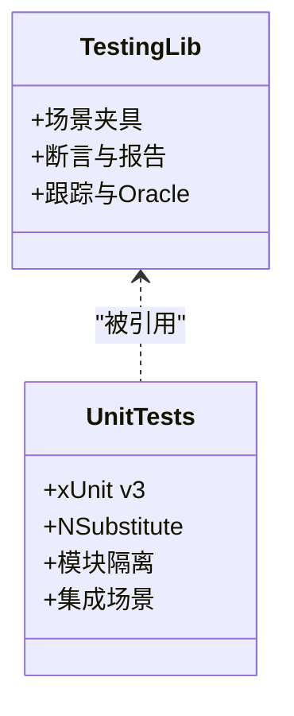
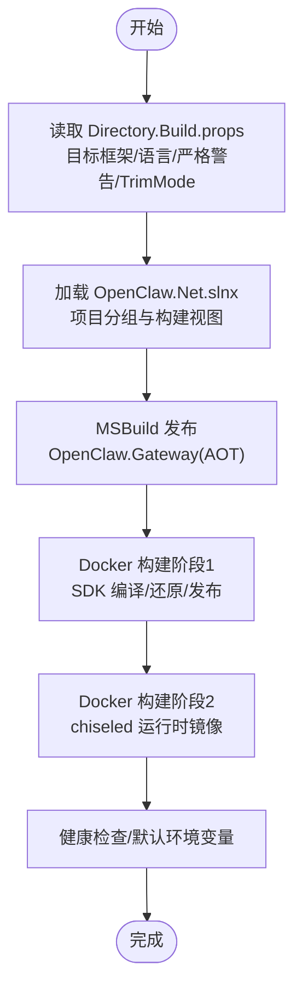
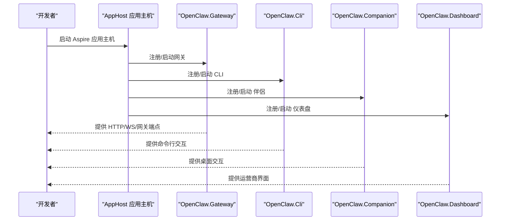
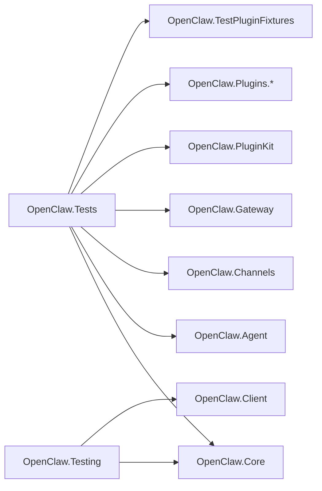

# 开发指南

<cite>
**本文档引用的文件**   
- [README.md](file://README.md)
- [QUICKSTART.md](file://QUICKSTART.md)
- [Directory.Build.props](file://Directory.Build.props)
- [OpenClaw.Net.slnx](file://OpenClaw.Net.slnx)
- [.github/PULL_REQUEST_TEMPLATE.md](file://.github/PULL_REQUEST_TEMPLATE.md)
- [scripts/README.md](file://scripts/README.md)
- [Dockerfile](file://Dockerfile)
- [src/OpenClaw.Tests/OpenClaw.Tests.csproj](file://src/OpenClaw.Tests/OpenClaw.Tests.csproj)
- [src/OpenClaw.Testing/OpenClaw.Testing.csproj](file://src/OpenClaw.Testing/OpenClaw.Testing.csproj)
- [src/OpenClaw.Core/Directory.Build.targets](file://src/OpenClaw.Core/Directory.Build.targets)
- [Kingcrab.AppHost/AppHost.cs](file://Kingcrab.AppHost/AppHost.cs)
- [Kingcrab.ServiceDefaults/Extensions.cs](file://Kingcrab.ServiceDefaults/Extensions.cs)
</cite>

## 目录
1. [简介](#简介)
2. [项目结构](#项目结构)
3. [核心组件](#核心组件)
4. [架构总览](#架构总览)
5. [详细组件分析](#详细组件分析)
6. [依赖关系分析](#依赖关系分析)
7. [性能考虑](#性能考虑)
8. [故障排查指南](#故障排查指南)
9. [结论](#结论)
10. [附录](#附录)

## 简介
本开发指南面向希望参与 OpenClaw.NET 项目的开发者，系统性地阐述开发环境设置、代码规范、构建与打包流程、测试策略（单元测试与场景回归）、调试与性能分析、问题诊断、代码审查与提交规范、发布与部署流水线，以及社区协作与持续集成实践。内容以仓库现有配置与文档为基础，结合实际源码组织方式，帮助新老成员快速上手并高质量交付。

## 项目结构
OpenClaw.NET 采用多项目解决方案组织，核心由“网关（Gateway）+ 运行时（Agent/Runtime）+ 工具与插件生态 + 测试与验证工具”构成，并通过 Aspire 应用主机进行本地编排与服务发现。关键特性包括：
- 网关层：HTTP/WebSocket/浏览器 UI/网关端点/中间件/通道适配器等
- 运行时层：推理、工具执行、内存与会话、策略与审批、消息管道
- 插件与桥接：Node.js 桥接与可选的动态原生插件
- 可选沙箱：OpenSandbox 容器化高风险工具执行
- 多客户端：浏览器聊天、CLI、桌面伴侶应用、Blazor 运营商仪表盘
- 可复用库：Core、PluginKit、SkillKit、Payments、Testing 等

**图表来源**
- [OpenClaw.Net.slnx:1-43](file://OpenClaw.Net.slnx#L1-L43)
- [Kingcrab.AppHost/AppHost.cs](file://Kingcrab.AppHost/AppHost.cs)
- [Kingcrab.ServiceDefaults/Extensions.cs](file://Kingcrab.ServiceDefaults/Extensions.cs)

**章节来源**
- [OpenClaw.Net.slnx:1-43](file://OpenClaw.Net.slnx#L1-L43)
- [README.md:145-196](file://README.md#L145-L196)

## 核心组件
- 网关（Gateway）：负责 HTTP/WebSocket/网关端点、中间件、通道启动、工作者、关闭处理与分组表面；支持 OpenAI 兼容端点与可观测性接口。
- 运行时（Agent/Runtime）：负责推理、工具执行、内存交互、技能加载、策略与审批、消息管道。
- 插件与桥接：Node.js JSON-RPC 桥接与可选动态原生插件；支持不同运行时模式（aot/jit/auto）与 MAF 后端。
- 沙箱（可选）：通过 OpenSandbox 对 shell/code_exec/browser 等高风险工具进行容器化执行。
- 客户端：浏览器聊天 UI、CLI、桌面伴侶应用、Blazor 运营商仪表盘。
- 测试与验证：单元测试、场景回归测试、桥接集成测试、Python 校验脚本与迁移辅助脚本。

**章节来源**
- [README.md:31-670](file://README.md#L31-L670)
- [QUICKSTART.md:1-190](file://QUICKSTART.md#L1-L190)

## 架构总览
OpenClaw.NET 将启动分为明确的层次：Bootstrap（配置加载、模式选择、验证与加固）、Composition/Profiles（服务注册与运行时配置）、Pipeline/Endpoints（中间件、通道、工作者、关闭处理）。运行时由网关与 Agent Runtime 组成，Agent Runtime 与工具、内存、LLM 提供商、Node.js 桥接及 JS 插件协同工作。

**图表来源**
- [README.md:145-196](file://README.md#L145-L196)

**章节来源**
- [README.md:145-196](file://README.md#L145-L196)

## 详细组件分析

### 组件 A：测试与回归框架（OpenClaw.Testing 与 OpenClaw.Tests）
- OpenClaw.Testing 提供场景化测试夹具与断言能力，便于对 Agent Trace 与 Oracle 进行一致性校验。
- OpenClaw.Tests 作为集中测试工程，引用核心与各子项目，使用 xUnit v3 与 NSubstitute，针对功能模块与集成场景进行覆盖。
- 部分测试文件根据可选装配条件被排除，避免在默认构建中缺失依赖时报错。

**图表来源**
- [src/OpenClaw.Testing/OpenClaw.Testing.csproj:1-15](file://src/OpenClaw.Testing/OpenClaw.Testing.csproj#L1-L15)
- [src/OpenClaw.Tests/OpenClaw.Tests.csproj:1-55](file://src/OpenClaw.Tests/OpenClaw.Tests.csproj#L1-L55)

**章节来源**
- [src/OpenClaw.Testing/OpenClaw.Testing.csproj:1-15](file://src/OpenClaw.Testing/OpenClaw.Testing.csproj#L1-L15)
- [src/OpenClaw.Tests/OpenClaw.Tests.csproj:1-55](file://src/OpenClaw.Tests/OpenClaw.Tests.csproj#L1-L55)

### 组件 B：构建与打包（MSBuild、AOT、Docker）
- 目标框架与语言版本：.NET 10，启用可空引用与隐式 using，严格警告为错误。
- NativeAOT：开启 TrimMode=link，提升裁剪性能；通过 Directory.Build.user 可为开发者添加本地开关（如启用 OpenSandbox）。
- 解决方案视图：通过 .slnx 组织 src 与 tests，便于 IDE 与 CI 管理。
- Docker：两阶段构建，第一阶段使用 SDK 编译与发布 NativeAOT 单文件二进制；第二阶段使用 chiseled 运行时镜像，暴露健康检查与默认安全环境变量。

**图表来源**
- [Directory.Build.props:1-41](file://Directory.Build.props#L1-L41)
- [OpenClaw.Net.slnx:1-43](file://OpenClaw.Net.slnx#L1-L43)
- [Dockerfile:1-59](file://Dockerfile#L1-L59)

**章节来源**
- [Directory.Build.props:1-41](file://Directory.Build.props#L1-L41)
- [OpenClaw.Net.slnx:1-43](file://OpenClaw.Net.slnx#L1-L43)
- [Dockerfile:1-59](file://Dockerfile#L1-L59)

### 组件 C：Aspire 应用主机与服务默认项
- AppHost：将网关、CLI、伴侶、仪表盘等项目纳入 Aspire 应用主机，便于本地一键启动与服务发现。
- ServiceDefaults：提供服务默认配置扩展，统一健康检查、指标导出、代理信任等行为。

**图表来源**
- [Kingcrab.AppHost/AppHost.cs](file://Kingcrab.AppHost/AppHost.cs)
- [Kingcrab.ServiceDefaults/Extensions.cs](file://Kingcrab.ServiceDefaults/Extensions.cs)

**章节来源**
- [Kingcrab.AppHost/AppHost.cs](file://Kingcrab.AppHost/AppHost.cs)
- [Kingcrab.ServiceDefaults/Extensions.cs](file://Kingcrab.ServiceDefaults/Extensions.cs)

## 依赖关系分析
- 项目间依赖：OpenClaw.Tests 引用核心与各子项目，OpenClaw.Testing 依赖 OpenClaw.Client 与 OpenClaw.Core，形成测试夹具与被测系统的清晰边界。
- 可选依赖：OpenClawEnableOpenSandbox 通过 Directory.Build.props 控制变体，影响中间输出路径与构建行为。
- 目录级优化：OpenClaw.Core/Directory.Build.targets 修复 MSBuild 编译缓存写入问题，提升构建稳定性。

**图表来源**
- [src/OpenClaw.Tests/OpenClaw.Tests.csproj:9-20](file://src/OpenClaw.Tests/OpenClaw.Tests.csproj#L9-L20)
- [src/OpenClaw.Testing/OpenClaw.Testing.csproj:10-13](file://src/OpenClaw.Testing/OpenClaw.Testing.csproj#L10-L13)

**章节来源**
- [src/OpenClaw.Tests/OpenClaw.Tests.csproj:1-55](file://src/OpenClaw.Tests/OpenClaw.Tests.csproj#L1-L55)
- [src/OpenClaw.Testing/OpenClaw.Testing.csproj:1-15](file://src/OpenClaw.Testing/OpenClaw.Testing.csproj#L1-L15)
- [src/OpenClaw.Core/Directory.Build.targets:1-37](file://src/OpenClaw.Core/Directory.Build.targets#L1-L37)

## 性能考虑
- NativeAOT 裁剪：通过 TrimMode=link 减少运行时体积与启动时间，适合生产部署与边缘场景。
- 运行时模式：aot 保持低内存与更安全的裁剪路径；jit 支持更广的插件兼容性与动态能力；auto 根据运行时能力自动选择。
- 沙箱执行：对 shell/code_exec/browser 等高风险工具进行容器化执行，降低主机风险并可控制资源与镜像。
- 观测性：集成 OpenTelemetry，提供健康检查、指标端点与结构化日志，便于性能监控与问题定位。

**章节来源**
- [Directory.Build.props:10-12](file://Directory.Build.props#L10-L12)
- [README.md:62-70](file://README.md#L62-L70)
- [README.md:121-124](file://README.md#L121-L124)
- [README.md:619-649](file://README.md#L619-L649)

## 故障排查指南
- 启动诊断：使用 --doctor 检查配置与兼容性，确认运行时模式与桥接能力是否匹配。
- 公网绑定安全：非回环绑定需设置认证令牌与 TLS，必要时启用反向代理与转发头信任。
- 请求体限制：各通道与 Webhook 的请求体上限可通过配置调整，避免过大负载导致解析失败。
- Docker 健康检查：容器内置健康检查命令，便于编排系统自动探测与恢复。
- 日志与追踪：通过结构化日志与分布式追踪，结合 Correlation ID 快速定位会话与工具调用链路。

**章节来源**
- [QUICKSTART.md:41-45](file://QUICKSTART.md#L41-L45)
- [README.md:277-324](file://README.md#L277-L324)
- [README.md:393-403](file://README.md#L393-L403)
- [Dockerfile:55-56](file://Dockerfile#L55-L56)
- [README.md:619-649](file://README.md#L619-L649)

## 结论
本指南基于仓库现有配置与文档，系统梳理了 OpenClaw.NET 的开发环境、代码规范、构建与打包、测试策略、调试与性能分析、问题诊断、代码审查与提交规范、发布与部署流水线以及社区协作与持续集成实践。建议在本地使用 Aspire 应用主机快速启动，结合 --doctor 与健康/指标端点进行验证，并通过 OpenClaw.Testing 与 OpenClaw.Tests 建立稳定的回归保障体系。

## 附录

### A. 开发环境设置
- 前置要求：.NET 10 SDK；如需 JS/TS 插件支持，可选安装 Node.js 20+。
- 本地启动：设置模型密钥与可选工作空间，运行网关并使用浏览器 UI/CLI/伴侶进行交互。
- Aspire 本地编排：通过 AppHost 一键启动网关、CLI、伴侶与仪表盘。

**章节来源**
- [QUICKSTART.md:5-10](file://QUICKSTART.md#L5-L10)
- [QUICKSTART.md:10-51](file://QUICKSTART.md#L10-L51)
- [Kingcrab.AppHost/AppHost.cs](file://Kingcrab.AppHost/AppHost.cs)

### B. 代码规范与构建流程
- 语言与框架：.NET 10，启用可空引用与隐式 using，严格警告为错误。
- AOT 裁剪：默认启用 TrimMode=link，提升性能与体积控制。
- 本地开关：通过 Directory.Build.user 添加 OpenClawEnableOpenSandbox=true 等个性化配置。
- 解决方案管理：使用 .slnx 组织项目，便于 IDE 与 CI 管理。

**章节来源**
- [Directory.Build.props:1-25](file://Directory.Build.props#L1-L25)
- [Directory.Build.props:38-40](file://Directory.Build.props#L38-L40)
- [OpenClaw.Net.slnx:1-43](file://OpenClaw.Net.slnx#L1-L43)

### C. 测试策略与最佳实践
- 单元测试：使用 xUnit v3 与 NSubstitute，覆盖核心逻辑与边界条件。
- 场景回归：利用 OpenClaw.Testing 提供的夹具与断言，对 Agent Trace 与 Oracle 进行一致性校验。
- 集成测试：针对网关端点、通道适配器、桥接与插件进行集成验证。
- 可选装配：部分测试文件根据 OpenClawEnableOpenSandbox 条件排除，避免依赖缺失。

**章节来源**
- [src/OpenClaw.Tests/OpenClaw.Tests.csproj:28-53](file://src/OpenClaw.Tests/OpenClaw.Tests.csproj#L28-L53)
- [src/OpenClaw.Testing/OpenClaw.Testing.csproj:1-15](file://src/OpenClaw.Testing/OpenClaw.Testing.csproj#L1-L15)

### D. 调试技巧与性能分析
- 启动诊断：使用 --doctor 输出配置与兼容性报告，提前发现潜在问题。
- 观测性：启用 OpenTelemetry，访问 /health 与 /metrics 获取运行状态与计数器。
- 日志：结构化日志与 Activity 追踪，结合 Correlation ID 定位会话与工具调用链路。
- 性能：优先采用 aot 模式与裁剪优化；对高风险工具使用沙箱执行。

**章节来源**
- [QUICKSTART.md:41-45](file://QUICKSTART.md#L41-L45)
- [README.md:619-649](file://README.md#L619-L649)
- [README.md:121-124](file://README.md#L121-L124)

### E. 代码审查与提交规范
- 提交模板：遵循 .github/PULL_REQUEST_TEMPLATE.md 的结构化清单，明确变更范围、Schema 边界、验证与文档更新。
- 校验脚本：针对 ontology slice/projection 与 runtime contract 使用仓库提供的 Python 校验入口（详见 [本体切片](../本体切片/本体切片.md)）。
- 文档更新：当使用边界变化时，至少更新一个入口文档，并根据需要检查迁移清单与契约文档。

**章节来源**
- [.github/PULL_REQUEST_TEMPLATE.md:1-47](file://.github/PULL_REQUEST_TEMPLATE.md#L1-L47)
- [scripts/README.md:87-195](file://scripts/README.md#L87-L195)

### F. 发布与部署流水线
- Docker 镜像：两阶段构建，第一阶段发布 NativeAOT 二进制，第二阶段使用 chiseled 运行时镜像，内置健康检查与默认安全环境变量。
- 多架构：支持 linux/amd64 与 linux/arm64 平台构建与推送。
- Aspire 集成：AppHost 与 ServiceDefaults 统一服务发现与默认配置，便于容器化与云原生部署。

**章节来源**
- [Dockerfile:1-59](file://Dockerfile#L1-L59)
- [Kingcrab.AppHost/AppHost.cs](file://Kingcrab.AppHost/AppHost.cs)
- [Kingcrab.ServiceDefaults/Extensions.cs](file://Kingcrab.ServiceDefaults/Extensions.cs)