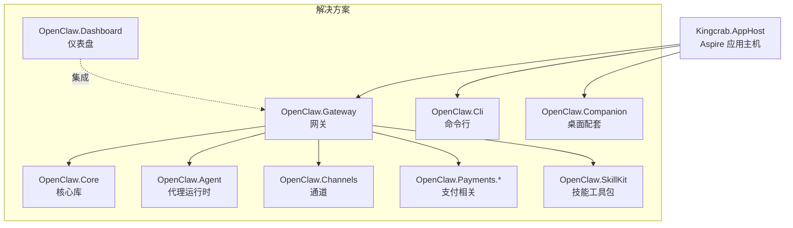
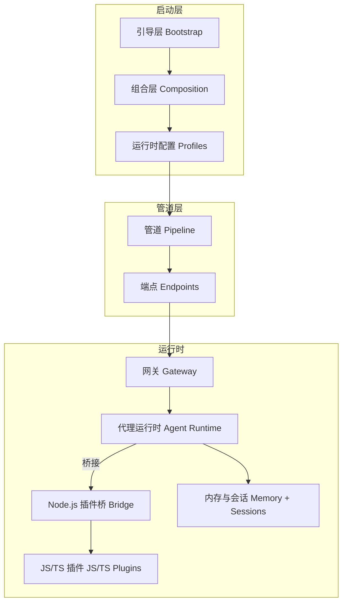
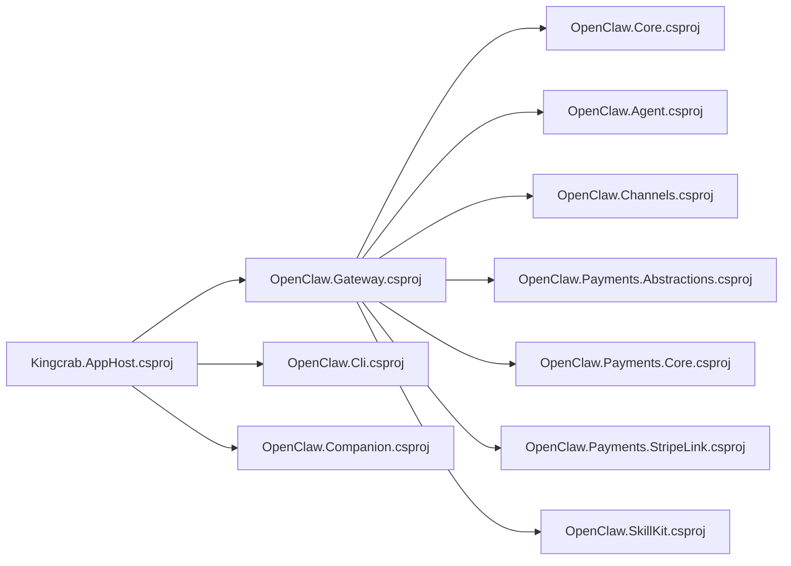

# 开发环境设置

<cite>
**本文引用的文件**
- [README.md](file://README.md)
- [QUICKSTART.md](file://QUICKSTART.md)
- [Directory.Build.props](file://Directory.Build.props)
- [Dockerfile](file://Dockerfile)
- [docker-compose.yml](file://docker-compose.yml)
- [Kingcrab.AppHost/Kingcrab.AppHost.csproj](file://Kingcrab.AppHost/Kingcrab.AppHost.csproj)
- [Kingcrab.AppHost/AppHost.cs](file://Kingcrab.AppHost/AppHost.cs)
- [Kingcrab.AppHost/Properties/launchSettings.json](file://Kingcrab.AppHost/Properties/launchSettings.json)
- [Dockerfile.opensandbox](file://Dockerfile.opensandbox)
- [Dockerfile.opensandbox.base](file://Dockerfile.opensandbox.base)
- [scripts/build-opensandbox-base-image.ps1](file://scripts/build-opensandbox-base-image.ps1)
- [scripts/build-opensandbox-app-image.ps1](file://scripts/build-opensandbox-app-image.ps1)
- [OpenClaw.Net.slnx](file://OpenClaw.Net.slnx)
- [src/OpenClaw.Gateway/OpenClaw.Gateway.csproj](file://src/OpenClaw.Gateway/OpenClaw.Gateway.csproj)
- [src/OpenClaw.Cli/Program.cs](file://src/OpenClaw.Cli/Program.cs)
- [src/OpenClaw.Companion/Program.cs](file://src/OpenClaw.Companion/Program.cs)
</cite>

## 目录
1. [简介](#简介)
2. [项目结构](#项目结构)
3. [核心组件](#核心组件)
4. [架构总览](#架构总览)
5. [详细组件分析](#详细组件分析)
6. [依赖关系分析](#依赖关系分析)
7. [性能注意事项](#性能注意事项)
8. [故障排查指南](#故障排查指南)
9. [结论](#结论)
10. [附录](#附录)

## 简介
本指南面向 OpenClaw.NET 的开发者，提供从零到一的完整开发环境设置说明。内容覆盖 .NET SDK 要求、Node.js 环境配置、Docker 安装与使用、IDE 配置（Visual Studio、VS Code）、项目构建配置（MSBuild 属性与编译选项）、环境变量与本地数据库配置、外部服务依赖、开发服务器启动与调试断点设置，以及容器化开发环境的搭建与使用。

## 项目结构
仓库采用多项目解决方案组织，核心模块包括网关、CLI、桌面配套应用、仪表盘、支付与技能工具包等。Aspire 应用主机用于本地组合运行多个服务，并可集成 Keycloak 等外部资源。

图表来源
- [OpenClaw.Net.slnx:1-43](file://OpenClaw.Net.slnx#L1-L43)
- [Kingcrab.AppHost/Kingcrab.AppHost.csproj:1-28](file://Kingcrab.AppHost/Kingcrab.AppHost.csproj#L1-L28)

章节来源
- [OpenClaw.Net.slnx:1-43](file://OpenClaw.Net.slnx#L1-L43)
- [Kingcrab.AppHost/Kingcrab.AppHost.csproj:1-28](file://Kingcrab.AppHost/Kingcrab.AppHost.csproj#L1-L28)

## 核心组件
- 网关（Gateway）：提供 HTTP/WebSocket/Browser UI/Webhook 等多种接入面，负责认证、策略、可观测性与会话管理。
- CLI：提供聊天、一次性执行、模型管理、迁移、维护、心跳脉冲、插件与技能管理等命令行能力。
- 桌面配套（Companion）：基于 Avalonia 的跨平台桌面应用，支持网关连接与令牌记忆。
- Aspire 应用主机（AppHost）：本地组合运行网关、CLI、桌面配套，并可引入 Keycloak 等外部服务。

章节来源
- [src/OpenClaw.Gateway/OpenClaw.Gateway.csproj:1-143](file://src/OpenClaw.Gateway/OpenClaw.Gateway.csproj#L1-L143)
- [src/OpenClaw.Cli/Program.cs:1-800](file://src/OpenClaw.Cli/Program.cs#L1-L800)
- [src/OpenClaw.Companion/Program.cs:1-22](file://src/OpenClaw.Companion/Program.cs#L1-L22)
- [Kingcrab.AppHost/AppHost.cs:1-25](file://Kingcrab.AppHost/AppHost.cs#L1-L25)

## 架构总览
下图展示启动与运行阶段的分层结构：引导层（Bootstrap）、组合层（Composition/Profiles）、管道层（Pipeline/Endpoints），以及运行时的网关与代理运行时协作。

图表来源
- [README.md:145-196](file://README.md#L145-L196)
- [src/OpenClaw.Gateway/OpenClaw.Gateway.csproj:1-143](file://src/OpenClaw.Gateway/OpenClaw.Gateway.csproj#L1-L143)

章节来源
- [README.md:145-196](file://README.md#L145-L196)

## 详细组件分析

### .NET SDK 与构建配置
- 目标框架与语言版本：目标框架为 net10.0，语言版本为 14；启用可空引用与隐式 using，错误即停。
- NativeAOT 优化：默认启用链接裁剪以减小二进制体积；禁用事件源、调试器支持、HTTP 活动传播等以提升性能。
- 特定项目属性：网关项目关闭 AOT 发布并启用尺寸优先优化；对 Playwright 的反射警告进行抑制以适配 JIT 场景。
- Aspire 应用主机：使用 Aspire.AppHost.Sdk，引用 CLI、Companion、Gateway 项目，并可引入 Keycloak 资源。

章节来源
- [Directory.Build.props:1-41](file://Directory.Build.props#L1-L41)
- [src/OpenClaw.Gateway/OpenClaw.Gateway.csproj:1-143](file://src/OpenClaw.Gateway/OpenClaw.Gateway.csproj#L1-L143)
- [Kingcrab.AppHost/Kingcrab.AppHost.csproj:1-28](file://Kingcrab.AppHost/Kingcrab.AppHost.csproj#L1-L28)

### Node.js 环境配置
- 可选但推荐：若需要上游风格的 TS/JS 插件支持，需安装 Node.js 20+。
- OpenSandbox 增强镜像：在 OpenSandbox 基础镜像中预装 Node.js 22、Playwright 并缓存浏览器二进制，便于沙箱内高风险工具执行。

章节来源
- [QUICKSTART.md:5-9](file://QUICKSTART.md#L5-L9)
- [Dockerfile.opensandbox.base:1-76](file://Dockerfile.opensandbox.base#L1-L76)
- [Dockerfile.opensandbox:1-113](file://Dockerfile.opensandbox#L1-L113)

### Docker 安装与使用
- 本地镜像构建：使用多阶段构建，第一阶段安装 NativeAOT 依赖并发布单文件二进制，第二阶段使用 Chiseled 运行时镜像，非 root 用户运行。
- 默认环境变量：绑定地址、端口、内存存储路径、工具根目录、插件开关等均通过环境变量配置。
- Compose 编排：提供 openclaw 服务与可选 Caddy 反向代理（自动 TLS），支持按配置文件卷挂载工作区与内存数据卷。
- 健康检查：容器入口通过参数触发健康检查，便于 Compose 管理。

章节来源
- [Dockerfile:1-59](file://Dockerfile#L1-L59)
- [docker-compose.yml:1-68](file://docker-compose.yml#L1-L68)

### IDE 配置（Visual Studio 与 VS Code）
- Visual Studio
  - 使用 .NET 10 SDK 与 .NET MAUI 工作负载（如需桌面配套 UI 调试）。
  - 打开解决方案文件或直接打开项目，选择合适的启动配置（如 Aspire AppHost 或单个项目）。
  - 在“启动项目”中选择 AppHost 或具体项目（Gateway/CLI/Companion）。
- VS Code
  - 安装 C# 扩展、C# Dev Kit、EditorConfig、OmniSharp 等扩展。
  - 使用推荐的工作区设置（如编码、缩进、格式化规则）。
  - 在终端中使用 dotnet 命令进行构建与运行，或通过任务/调试配置启动 AppHost/Gateway/CLI/Companion。
  - 推荐使用 Tasks/launch.json 配置调试任务，以便一键启动与附加进程。

（本节为通用 IDE 配置建议，不直接分析具体文件）

### 项目构建配置与 MSBuild 属性
- 全局属性
  - 目标框架：net10.0
  - 语言版本：14
  - 可空引用：启用
  - 隐式 using：启用
  - 错误即停：启用
  - 全球化：InvariantGlobalization
  - NativeAOT：链接裁剪
- 网关项目变体
  - 通过条件属性区分标准与 OpenSandbox 增强变体，中间输出目录按变体分隔。
  - 支持通过用户级导入文件进行本地覆盖（例如启用 OpenSandbox）。
- 网关项目编译优化
  - 关闭 AOT 发布、启用尺寸优先优化、禁用调试器支持、禁用 HTTP 活动传播等。
  - 对 Playwright 反射警告进行抑制，避免 AOT 构建失败。
- Aspire AppHost
  - 引入 Aspire.Hosting.Keycloak，添加 Keycloak 资源并导入 Realm 配置。
  - 引用 CLI、Companion、Gateway 项目，实现本地组合运行。

章节来源
- [Directory.Build.props:1-41](file://Directory.Build.props#L1-L41)
- [src/OpenClaw.Gateway/OpenClaw.Gateway.csproj:1-143](file://src/OpenClaw.Gateway/OpenClaw.Gateway.csproj#L1-L143)
- [Kingcrab.AppHost/Kingcrab.AppHost.csproj:1-28](file://Kingcrab.AppHost/Kingcrab.AppHost.csproj#L1-L28)
- [Kingcrab.AppHost/AppHost.cs:1-25](file://Kingcrab.AppHost/AppHost.cs#L1-L25)

### 环境变量与本地数据库配置
- 必需环境变量
  - MODEL_PROVIDER_KEY：模型提供商密钥（通过环境变量注入，避免硬编码于配置文件）。
  - OPENCLAW_AUTH_TOKEN：非回环绑定时的认证令牌（建议强随机值）。
- 可选环境变量
  - OPENCLAW_WORKSPACE：工作区目录，用于文件工具与工作区技能。
  - OpenClaw__Runtime__Mode：运行时模式（aot/jit/auto）。
  - OPENCLAW_DOMAIN：用于 Caddy 自动 TLS 的域名。
- Docker 默认安全策略
  - 默认禁止 Shell 工具与插件桥，工具读写根限制在工作区。
  - 公网绑定默认拒绝危险设置，需显式放宽并承担安全风险。

章节来源
- [README.md:405-431](file://README.md#L405-L431)
- [Dockerfile:43-51](file://Dockerfile#L43-L51)
- [docker-compose.yml:13-31](file://docker-compose.yml#L13-L31)

### 外部服务依赖
- Keycloak（可选）：通过 Aspire Hosting 引入，用于身份认证与授权。
- Caddy（可选）：反向代理与自动 TLS，配合 Compose 使用。
- Node.js（可选）：用于 JS/TS 插件桥与 OpenSandbox 浏览器工具链。
- Playwright（可选）：浏览器工具链，OpenSandbox 增强镜像中预装并缓存 Chromium。

章节来源
- [Kingcrab.AppHost/AppHost.cs:9-14](file://Kingcrab.AppHost/AppHost.cs#L9-L14)
- [docker-compose.yml:44-62](file://docker-compose.yml#L44-L62)
- [Dockerfile.opensandbox.base:52-57](file://Dockerfile.opensandbox.base#L52-L57)
- [Dockerfile.opensandbox:65-69](file://Dockerfile.opensandbox#L65-L69)

### 开发服务器启动与调试断点设置
- 本地启动
  - 使用 dotnet run 启动网关（Release 配置），或先执行 --doctor 进行诊断。
  - 使用 CLI 的 chat/run/start 等子命令进行交互式或批处理式测试。
  - 使用 Aspire AppHost 组合启动网关、CLI、Companion，并可引入 Keycloak。
- 调试断点
  - 在 Visual Studio 中设置断点于网关、CLI 或 Companion 的入口点与关键逻辑处。
  - 在 VS Code 中通过 launch.json 配置调试目标，附加到相应进程。
- 端口与访问
  - 默认端口为 18789，可通过环境变量或配置调整。
  - Web UI：http://127.0.0.1:18789/chat
  - WebSocket：ws://127.0.0.1:18789/ws

章节来源
- [QUICKSTART.md:10-51](file://QUICKSTART.md#L10-L51)
- [src/OpenClaw.Cli/Program.cs:12-69](file://src/OpenClaw.Cli/Program.cs#L12-L69)
- [Kingcrab.AppHost/Properties/launchSettings.json:1-32](file://Kingcrab.AppHost/Properties/launchSettings.json#L1-L32)

### 容器化开发环境搭建与使用
- 构建镜像
  - 标准镜像：使用 Dockerfile 构建，多阶段发布 NativeAOT 二进制。
  - OpenSandbox 增强镜像：使用 Dockerfile.opensandbox 构建，预装 Node.js 22、Playwright 并缓存浏览器。
  - 基础镜像：Dockerfile.opensandbox.base 仅安装系统依赖与工具，供增量构建复用。
- 构建脚本
  - build-opensandbox-base-image.ps1：构建基础镜像，建议定期更新以保持系统与工具最新。
  - build-opensandbox-app-image.ps1：在基础镜像之上快速构建应用镜像，支持多平台与推送。
- Compose 使用
  - 单独运行网关：docker compose up -d openclaw
  - 启用 TLS：设置 OPENCLAW_DOMAIN 后 docker compose --profile with-tls up -d
  - 数据持久化：挂载 openclaw-memory 与可选的 workspace 卷。

章节来源
- [Dockerfile:1-59](file://Dockerfile#L1-L59)
- [Dockerfile.opensandbox:1-113](file://Dockerfile.opensandbox#L1-L113)
- [Dockerfile.opensandbox.base:1-76](file://Dockerfile.opensandbox.base#L1-L76)
- [scripts/build-opensandbox-base-image.ps1:1-127](file://scripts/build-opensandbox-base-image.ps1#L1-L127)
- [scripts/build-opensandbox-app-image.ps1:1-141](file://scripts/build-opensandbox-app-image.ps1#L1-L141)
- [docker-compose.yml:1-68](file://docker-compose.yml#L1-L68)

## 依赖关系分析

图表来源
- [src/OpenClaw.Gateway/OpenClaw.Gateway.csproj:25-47](file://src/OpenClaw.Gateway/OpenClaw.Gateway.csproj#L25-L47)
- [Kingcrab.AppHost/Kingcrab.AppHost.csproj:22-25](file://Kingcrab.AppHost/Kingcrab.AppHost.csproj#L22-L25)

章节来源
- [src/OpenClaw.Gateway/OpenClaw.Gateway.csproj:25-47](file://src/OpenClaw.Gateway/OpenClaw.Gateway.csproj#L25-L47)
- [Kingcrab.AppHost/Kingcrab.AppHost.csproj:22-25](file://Kingcrab.AppHost/Kingcrab.AppHost.csproj#L22-L25)

## 性能注意事项
- NativeAOT 优化：启用链接裁剪与尺寸优先优化，禁用调试器与活动传播以降低体积与运行时开销。
- 运行时模式选择：aot 更适合主流部署场景，jit 提供更广兼容性但体积与内存占用更高。
- OpenSandbox：默认启用沙箱路由，可在 Prefer/Require 模式间切换，必要时回退至本地执行。
- 日志与指标：生产环境建议开启结构化日志与 OpenTelemetry 指标导出，便于性能观测与问题定位。

章节来源
- [Directory.Build.props:10-13](file://Directory.Build.props#L10-L13)
- [src/OpenClaw.Gateway/OpenClaw.Gateway.csproj:6-20](file://src/OpenClaw.Gateway/OpenClaw.Gateway.csproj#L6-L20)
- [README.md:72-124](file://README.md#L72-L124)

## 故障排查指南
- 启动前诊断
  - 使用 --doctor 参数验证配置与环境，确保密钥、绑定地址、工具根目录等正确。
- 认证与安全
  - 非回环绑定必须设置 OPENCLAW_AUTH_TOKEN；WebChat 使用查询令牌时需允许查询字符串令牌。
  - 公网绑定默认拒绝危险设置，如需放宽请明确配置并评估风险。
- Docker 健康检查
  - 容器健康检查通过参数触发，Compose 中可观察服务健康状态。
- CLI 与网关交互
  - 使用 CLI 的 run/chat/start 子命令进行快速验证；必要时指定 --url 与 --token。
- Aspire 资源
  - Keycloak 初始化失败时检查 Realm 导入文件与凭据；确认端口与网络可达。

章节来源
- [QUICKSTART.md:41-51](file://QUICKSTART.md#L41-L51)
- [README.md:277-313](file://README.md#L277-L313)
- [Dockerfile:55-57](file://Dockerfile#L55-L57)
- [src/OpenClaw.Cli/Program.cs:12-69](file://src/OpenClaw.Cli/Program.cs#L12-L69)
- [Kingcrab.AppHost/AppHost.cs:9-14](file://Kingcrab.AppHost/AppHost.cs#L9-L14)

## 结论
通过本指南，您可以在本地完成 OpenClaw.NET 的开发环境搭建，涵盖 .NET SDK、Node.js、Docker、IDE 配置、构建与运行、调试与容器化等全流程。建议优先使用 Aspire AppHost 进行本地组合运行，结合 Docker 进行一致化部署验证，并根据实际需求选择 aot/jit 运行时模式与 OpenSandbox 增强功能。

## 附录

### 常用命令速查
- 本地启动网关（带诊断）：dotnet run --project src/OpenClaw.Gateway -c Release -- --doctor
- 本地启动网关：dotnet run --project src/OpenClaw.Gateway -c Release
- CLI 聊天：dotnet run --project src/OpenClaw.Cli -c Release -- chat
- CLI 一次性执行：dotnet run --project src/OpenClaw.Cli -c Release -- run "<提示词>"
- Aspire 组合启动：dotnet run --project Kingcrab.AppHost/Kingcrab.AppHost.csproj
- Docker 启动（无 TLS）：docker compose up -d openclaw
- Docker 启动（含 TLS）：export OPENCLAW_DOMAIN=example.com && docker compose --profile with-tls up -d

章节来源
- [QUICKSTART.md:41-93](file://QUICKSTART.md#L41-L93)
- [README.md:198-246](file://README.md#L198-L246)
- [Kingcrab.AppHost/AppHost.cs:1-25](file://Kingcrab.AppHost/AppHost.cs#L1-L25)