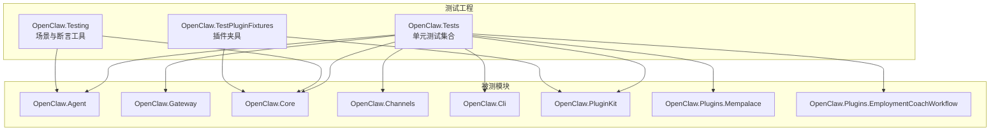
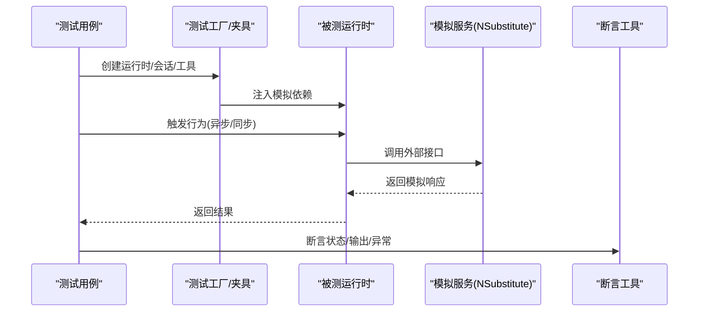
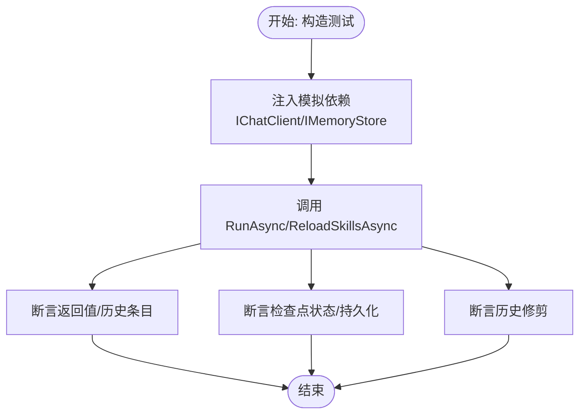
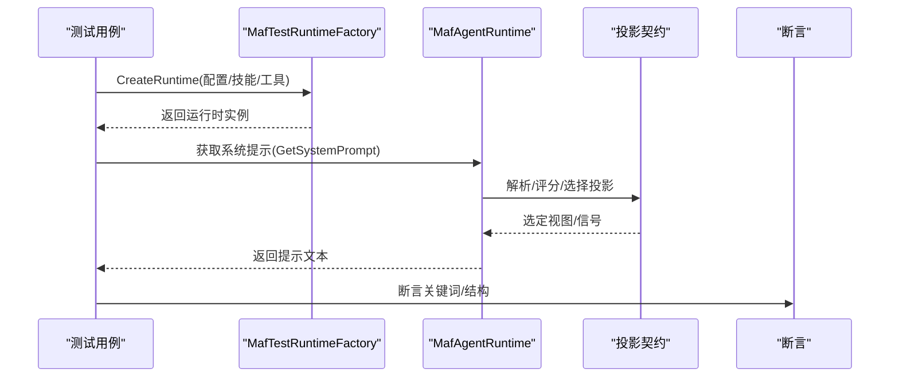
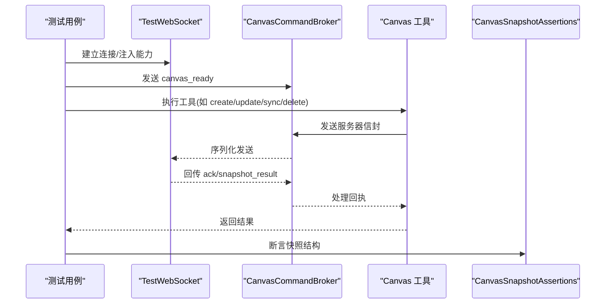
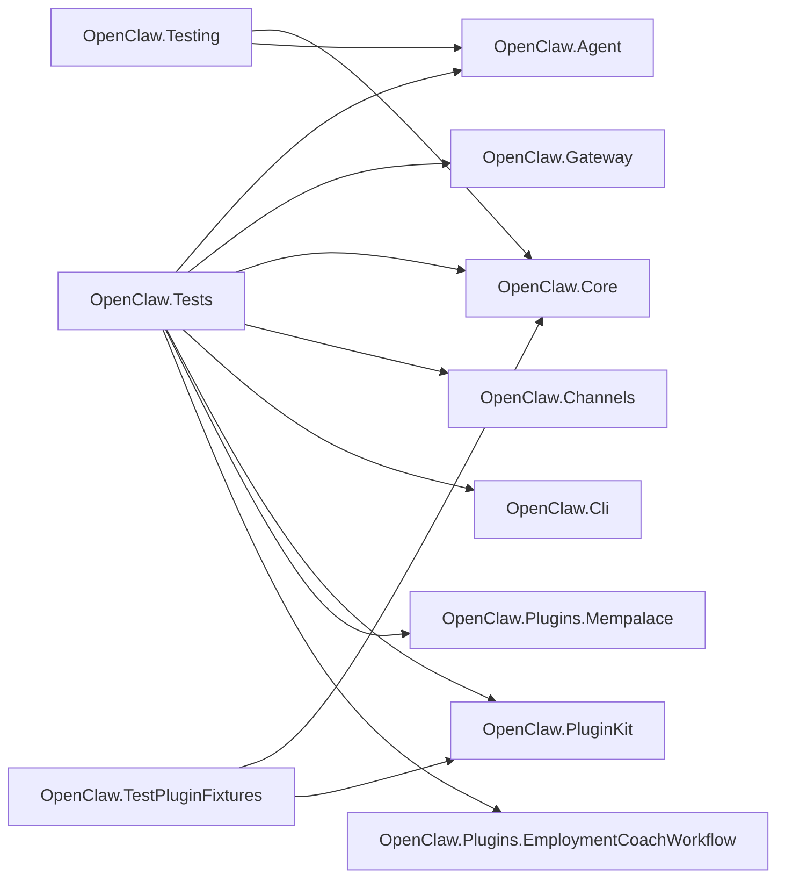

# 单元测试

<cite>
**本文引用的文件**
- [OpenClaw.Tests.csproj](file://src/OpenClaw.Tests/OpenClaw.Tests.csproj)
- [OpenClaw.Testing.csproj](file://src/OpenClaw.Testing/OpenClaw.Testing.csproj)
- [OpenClaw.TestPluginFixtures.csproj](file://src/OpenClaw.TestPluginFixtures/OpenClaw.TestPluginFixtures.csproj)
- [AgentRuntimeTests.cs](file://src/OpenClaw.Tests/AgentRuntimeTests.cs)
- [MafAgentRuntimeTests.cs](file://src/OpenClaw.Tests/MafAgentRuntimeTests.cs)
- [CanvasToolTests.cs](file://src/OpenClaw.Tests/CanvasToolTests.cs)
- [CanvasSnapshotAssertions.cs](file://src/OpenClaw.Tests/CanvasSnapshotAssertions.cs)
- [MafTestRuntimeFactory.cs](file://src/OpenClaw.Tests/MafTestRuntimeFactory.cs)
- [ToolApprovalServiceTests.cs](file://src/OpenClaw.Tests/ToolApprovalServiceTests.cs)
- [SessionManagerTests.cs](file://src/OpenClaw.Tests/SessionManagerTests.cs)
- [TestWebSocket.cs](file://src/OpenClaw.Tests/TestWebSocket.cs)
- [A2AIntegrationTests.cs](file://src/OpenClaw.Tests/A2AIntegrationTests.cs)
- [Utf8JsonContentTest.cs](file://src/OpenClaw.Tests/Utf8JsonContentTest.cs)
</cite>

## 目录
1. [简介](#简介)
2. [项目结构](#项目结构)
3. [核心组件](#核心组件)
4. [架构总览](#架构总览)
5. [详细组件分析](#详细组件分析)
6. [依赖关系分析](#依赖关系分析)
7. [性能考量](#性能考量)
8. [故障排查指南](#故障排查指南)
9. [结论](#结论)
10. [附录](#附录)

## 简介
本文件系统性梳理 OpenClaw.NET 的单元测试体系，覆盖设计原则、测试隔离策略、组织结构、测试夹具与数据管理、模拟对象与存根实践、断言模式与异常/边界测试、命名约定与分类、优先级管理，并通过具体测试用例路径给出可复用的编写范式与常见反模式规避建议。目标是帮助开发者在不直接阅读源码的情况下，也能快速理解并高效编写高质量的单元测试。

## 项目结构
OpenClaw.NET 的测试工程采用“按功能域分层”的组织方式：
- 测试工程聚合：OpenClaw.Tests 聚合各子系统（Agent、Gateway、Core、Channels、CLI 等）的测试用例，统一引用与运行环境。
- 场景化测试：OpenClaw.Testing 提供场景回归与断言工具，便于端到端或半集成测试。
- 插件夹具：OpenClaw.TestPluginFixtures 为插件相关测试提供可复用夹具与基础设施。
- 测试工具与夹具：MafTestRuntimeFactory、TestWebSocket、CanvasSnapshotAssertions 等作为通用测试基础设施，贯穿多类测试。

图表来源
- [OpenClaw.Tests.csproj:10-19](file://src/OpenClaw.Tests/OpenClaw.Tests.csproj#L10-L19)
- [OpenClaw.Testing.csproj:10-13](file://src/OpenClaw.Testing/OpenClaw.Testing.csproj#L10-L13)
- [OpenClaw.TestPluginFixtures.csproj:5-8](file://src/OpenClaw.TestPluginFixtures/OpenClaw.TestPluginFixtures.csproj#L5-L8)

章节来源
- [OpenClaw.Tests.csproj:1-55](file://src/OpenClaw.Tests/OpenClaw.Tests.csproj#L1-L55)
- [OpenClaw.Testing.csproj:1-15](file://src/OpenClaw.Testing/OpenClaw.Testing.csproj#L1-L15)
- [OpenClaw.TestPluginFixtures.csproj:1-10](file://src/OpenClaw.TestPluginFixtures/OpenClaw.TestPluginFixtures.csproj#L1-L10)

## 核心组件
- 测试框架与断言：xUnit v3（含 runner.visualstudio），用于编写事实与理论测试。
- 模拟与存根：NSubstitute，用于 I/O 与外部依赖的替身。
- 场景与断言工具：OpenClaw.Testing 提供场景加载、回归执行与断言模型；OpenClaw.Tests 内置 CanvasSnapshotAssertions 等断言助手。
- 测试夹具与工厂：MafTestRuntimeFactory 统一构建 MAF Agent 运行时上下文；TestWebSocket 提供 WebSocket 通信替身；CanvasToolTests 中的工具链与连接器用于 Canvas 命令流测试。

章节来源
- [OpenClaw.Tests.csproj:29-36](file://src/OpenClaw.Tests/OpenClaw.Tests.csproj#L29-L36)
- [MafTestRuntimeFactory.cs:15-96](file://src/OpenClaw.Tests/MafTestRuntimeFactory.cs#L15-L96)
- [TestWebSocket.cs:6-118](file://src/OpenClaw.Tests/TestWebSocket.cs#L6-L118)
- [CanvasSnapshotAssertions.cs:6-41](file://src/OpenClaw.Tests/CanvasSnapshotAssertions.cs#L6-L41)

## 架构总览
下图展示了测试运行时的关键交互：测试用例通过工厂与夹具构造被测对象与依赖，使用 NSubstitute 替身模拟外部系统，断言结果与副作用。

图表来源
- [MafTestRuntimeFactory.cs:17-96](file://src/OpenClaw.Tests/MafTestRuntimeFactory.cs#L17-L96)
- [AgentRuntimeTests.cs:20-35](file://src/OpenClaw.Tests/AgentRuntimeTests.cs#L20-L35)
- [CanvasToolTests.cs:16-608](file://src/OpenClaw.Tests/CanvasToolTests.cs#L16-L608)

## 详细组件分析

### Agent 运行时测试（AgentRuntimeTests）
- 设计要点
  - 使用 NSubstitute 为 IChatClient、IMemoryStore 等接口提供默认行为与断言点。
  - 通过构造函数一次性准备共享依赖，减少重复设置。
  - 针对单轮对话、历史修剪、检查点保存/恢复、技能热重载等关键路径进行验证。
- 关键断言模式
  - 等值断言：对返回文本与会话历史条目进行精确匹配。
  - 结构断言：对消息内容类型（文本/URI）进行细粒度校验。
  - 状态断言：对检查点状态、工具调用次数、持久化时机进行断言。
- 异常与边界
  - 对外部提供者抛出的特定异常进行错误提示映射与降级处理断言。
  - 对历史长度阈值进行边界测试，确保修剪逻辑符合预期。
- 示例路径
  - [AgentRuntimeTests.cs:37-46](file://src/OpenClaw.Tests/AgentRuntimeTests.cs#L37-L46)
  - [AgentRuntimeTests.cs:73-106](file://src/OpenClaw.Tests/AgentRuntimeTests.cs#L73-L106)
  - [AgentRuntimeTests.cs:123-168](file://src/OpenClaw.Tests/AgentRuntimeTests.cs#L123-L168)
  - [AgentRuntimeTests.cs:259-306](file://src/OpenClaw.Tests/AgentRuntimeTests.cs#L259-L306)

图表来源
- [AgentRuntimeTests.cs:20-35](file://src/OpenClaw.Tests/AgentRuntimeTests.cs#L20-L35)
- [AgentRuntimeTests.cs:37-168](file://src/OpenClaw.Tests/AgentRuntimeTests.cs#L37-L168)

章节来源
- [AgentRuntimeTests.cs:12-390](file://src/OpenClaw.Tests/AgentRuntimeTests.cs#L12-L390)

### MAF Agent 运行时测试（MafAgentRuntimeTests）
- 设计要点
  - 使用 MafTestRuntimeFactory 统一创建 MAF Agent 运行时，支持多种配置组合（并行工具执行、工具审批、记忆召回等）。
  - 验证系统提示生成的投影路由选择、阻断规则与优先级策略。
  - 对技能热重载与工作区加载进行断言。
- 关键断言模式
  - 文本片段断言：对系统提示中特定关键词与结构进行存在性/排他性断言。
  - 投影契约断言：基于多生产者优先级与信号匹配，断言最终选择的投影视图。
- 示例路径
  - [MafAgentRuntimeTests.cs:40-49](file://src/OpenClaw.Tests/MafAgentRuntimeTests.cs#L40-L49)
  - [MafAgentRuntimeTests.cs:110-181](file://src/OpenClaw.Tests/MafAgentRuntimeTests.cs#L110-L181)
  - [MafAgentRuntimeTests.cs:183-238](file://src/OpenClaw.Tests/MafAgentRuntimeTests.cs#L183-L238)
  - [MafAgentRuntimeTests.cs:240-309](file://src/OpenClaw.Tests/MafAgentRuntimeTests.cs#L240-L309)

图表来源
- [MafTestRuntimeFactory.cs:106-113](file://src/OpenClaw.Tests/MafTestRuntimeFactory.cs#L106-L113)
- [MafAgentRuntimeTests.cs:110-181](file://src/OpenClaw.Tests/MafAgentRuntimeTests.cs#L110-L181)

章节来源
- [MafAgentRuntimeTests.cs:11-396](file://src/OpenClaw.Tests/MafAgentRuntimeTests.cs#L11-L396)
- [MafTestRuntimeFactory.cs:15-273](file://src/OpenClaw.Tests/MafTestRuntimeFactory.cs#L15-L273)

### Canvas 工具测试（CanvasToolTests）
- 设计要点
  - 使用 TestWebSocket 与 CanvasCommandBroker 搭建 WebSocket 通道，模拟 a2ui v0.9 协议下的命令往返。
  - 通过 CanvasSnapshotAssertions 统一断言快照结构（dataModelJson、components、frameCount、diagnostics）。
  - 针对 URL 白名单、组件合法性、数据模型格式、能力声明缺失等边界条件进行断言。
- 关键断言模式
  - 结构化 JSON 断言：对快照字段进行存在性与类型断言。
  - 协议字段断言：对操作类型、表面 ID、目录 ID、参数与组件数组进行断言。
- 示例路径
  - [CanvasToolTests.cs:18-26](file://src/OpenClaw.Tests/CanvasToolTests.cs#L18-L26)
  - [CanvasToolTests.cs:63-79](file://src/OpenClaw.Tests/CanvasToolTests.cs#L63-L79)
  - [CanvasToolTests.cs:409-518](file://src/OpenClaw.Tests/CanvasToolTests.cs#L409-L518)
  - [CanvasSnapshotAssertions.cs:8-40](file://src/OpenClaw.Tests/CanvasSnapshotAssertions.cs#L8-L40)

图表来源
- [CanvasToolTests.cs:520-573](file://src/OpenClaw.Tests/CanvasToolTests.cs#L520-L573)
- [CanvasToolTests.cs:575-590](file://src/OpenClaw.Tests/CanvasToolTests.cs#L575-L590)
- [CanvasSnapshotAssertions.cs:8-40](file://src/OpenClaw.Tests/CanvasSnapshotAssertions.cs#L8-L40)

章节来源
- [CanvasToolTests.cs:16-608](file://src/OpenClaw.Tests/CanvasToolTests.cs#L16-L608)
- [CanvasSnapshotAssertions.cs:6-41](file://src/OpenClaw.Tests/CanvasSnapshotAssertions.cs#L6-L41)
- [TestWebSocket.cs:6-118](file://src/OpenClaw.Tests/TestWebSocket.cs#L6-L118)

### 工具审批服务测试（ToolApprovalServiceTests）
- 设计要点
  - 验证请求创建、决策记录、请求者匹配、管理员覆盖、过期清理与等待超时等完整生命周期。
  - 使用事实与理论测试覆盖授权匹配与拒绝、并发等待与超时返回等场景。
- 断言模式
  - 枚举/结果枚举断言：对 TrySetDecision 的返回值进行断言。
  - 列表断言：对待审批列表的清空与保留进行断言。
- 示例路径
  - [ToolApprovalServiceTests.cs:8-22](file://src/OpenClaw.Tests/ToolApprovalServiceTests.cs#L8-L22)
  - [ToolApprovalServiceTests.cs:76-85](file://src/OpenClaw.Tests/ToolApprovalServiceTests.cs#L76-L85)
  - [ToolApprovalServiceTests.cs:103-120](file://src/OpenClaw.Tests/ToolApprovalServiceTests.cs#L103-L120)

章节来源
- [ToolApprovalServiceTests.cs:6-134](file://src/OpenClaw.Tests/ToolApprovalServiceTests.cs#L6-L134)

### 会话管理器测试（SessionManagerTests）
- 设计要点
  - 并发场景：验证同一会话并发创建返回同一实例，容量限制与驱逐策略。
  - 生命周期：会话激活状态、过期清理、暂停/过期会话恢复。
  - 容错：取消令牌导致的语义不破坏。
- 断言模式
  - 引用相等断言：Same(...) 验证实例一致性。
  - 计数断言：ActiveCount 与历史长度断言。
- 示例路径
  - [SessionManagerTests.cs:10-28](file://src/OpenClaw.Tests/SessionManagerTests.cs#L10-L28)
  - [SessionManagerTests.cs:144-179](file://src/OpenClaw.Tests/SessionManagerTests.cs#L144-L179)
  - [SessionManagerTests.cs:181-200](file://src/OpenClaw.Tests/SessionManagerTests.cs#L181-L200)

章节来源
- [SessionManagerTests.cs:8-251](file://src/OpenClaw.Tests/SessionManagerTests.cs#L8-L251)

### A2A 集成测试（A2AIntegrationTests）
- 设计要点
  - 验证代理卡片、接口绑定、流式响应、任务状态更新与制品传输的一致性。
  - 使用理论测试覆盖路径规范化、大小写与空白处理等边界。
- 断言模式
  - 结构断言：对 JSON 字段的存在性与值进行断言。
  - 类型断言：对事件序列与制品类型进行断言。
- 示例路径
  - [A2AIntegrationTests.cs:32-39](file://src/OpenClaw.Tests/A2AIntegrationTests.cs#L32-L39)
  - [A2AIntegrationTests.cs:188-194](file://src/OpenClaw.Tests/A2AIntegrationTests.cs#L188-L194)
  - [A2AIntegrationTests.cs:354-360](file://src/OpenClaw.Tests/A2AIntegrationTests.cs#L354-L360)

章节来源
- [A2AIntegrationTests.cs:122-419](file://src/OpenClaw.Tests/A2AIntegrationTests.cs#L122-L419)

### UTF-8 JSON 内容测试（Utf8JsonContentTest）
- 设计要点
  - 验证 JSON 内容编码/解码的正确性与边界条件。
- 示例路径
  - [Utf8JsonContentTest.cs](file://src/OpenClaw.Tests/Utf8JsonContentTest.cs)

章节来源
- [Utf8JsonContentTest.cs](file://src/OpenClaw.Tests/Utf8JsonContentTest.cs)

## 依赖关系分析
- 测试工程依赖
  - OpenClaw.Tests 引用多个业务工程，确保测试覆盖核心模块。
  - OpenClaw.Testing 仅引用 OpenClaw.Client 与 OpenClaw.Core，聚焦场景与断言。
  - OpenClaw.TestPluginFixtures 引用 OpenClaw.Core 与 OpenClaw.PluginKit，为插件测试提供夹具。
- 第三方依赖
  - Microsoft.NET.Test.Sdk、xunit.v3、NSubstitute、Microsoft.AspNetCore.TestHost。

图表来源
- [OpenClaw.Tests.csproj:10-19](file://src/OpenClaw.Tests/OpenClaw.Tests.csproj#L10-L19)
- [OpenClaw.Testing.csproj:10-13](file://src/OpenClaw.Testing/OpenClaw.Testing.csproj#L10-L13)
- [OpenClaw.TestPluginFixtures.csproj:5-8](file://src/OpenClaw.TestPluginFixtures/OpenClaw.TestPluginFixtures.csproj#L5-L8)

章节来源
- [OpenClaw.Tests.csproj:1-55](file://src/OpenClaw.Tests/OpenClaw.Tests.csproj#L1-L55)
- [OpenClaw.Testing.csproj:1-15](file://src/OpenClaw.Testing/OpenClaw.Testing.csproj#L1-L15)
- [OpenClaw.TestPluginFixtures.csproj:1-10](file://src/OpenClaw.TestPluginFixtures/OpenClaw.TestPluginFixtures.csproj#L1-L10)

## 性能考量
- 测试并发与资源竞争
  - 使用并发任务与共享内存存储验证会话管理器的线程安全与容量控制，避免死锁与资源泄漏。
- I/O 与网络模拟
  - 使用 TestWebSocket 与 NSubstitute 替身替代真实网络与外部服务，降低测试时延与不确定性。
- 历史修剪与压缩
  - 在 Agent 运行时测试中验证历史修剪与压缩阈值，避免无界增长影响测试稳定性。

[本节为通用指导，无需列出具体文件来源]

## 故障排查指南
- 常见问题
  - WebSocket 未就绪或协议能力缺失：检查 canvas_ready 是否正确注入，能力列表是否包含所需版本。
  - 快照断言失败：确认 dataModelJson、components、frameCount 等字段是否存在且类型正确。
  - 工具审批未生效：核对请求者匹配、管理员覆盖路径与过期时间。
  - 会话并发冲突：确认并发创建是否返回同一实例，容量限制是否触发驱逐。
- 排查步骤
  - 启用详细日志与断言，逐步缩小范围。
  - 使用断言助手（如 CanvasSnapshotAssertions）统一断言结构。
  - 通过工厂与夹具复现最小可复现案例，排除外部干扰。

章节来源
- [CanvasToolTests.cs:520-573](file://src/OpenClaw.Tests/CanvasToolTests.cs#L520-L573)
- [CanvasSnapshotAssertions.cs:8-40](file://src/OpenClaw.Tests/CanvasSnapshotAssertions.cs#L8-L40)
- [ToolApprovalServiceTests.cs:24-39](file://src/OpenClaw.Tests/ToolApprovalServiceTests.cs#L24-L39)
- [SessionManagerTests.cs:144-179](file://src/OpenClaw.Tests/SessionManagerTests.cs#L144-L179)

## 结论
OpenClaw.NET 的单元测试以“工厂+夹具+模拟”为核心，围绕关键运行时（Agent、MAF、Canvas、会话管理、工具审批）构建了高内聚、低耦合的测试体系。通过统一的断言工具与严格的边界/异常测试，确保核心行为的稳定性与可维护性。建议在新增测试时遵循本文档的命名、断言与隔离策略，持续提升测试质量与覆盖率。

[本节为总结，无需列出具体文件来源]

## 附录

### 测试命名约定与分类
- 命名约定
  - 采用动词短语形式，如 RunAsync_SingleTurn_ReturnsResponse，清晰表达前置条件、行为与期望。
  - 理论测试使用 [Theory] + [InlineData(...)] 表达多输入场景。
- 分类
  - 功能测试：验证核心业务逻辑（Agent 运行时、Canvas 工具、会话管理）。
  - 边界测试：验证阈值、空值、非法输入（URL 白名单、组件合法性、JSON 格式）。
  - 异常测试：验证外部异常映射与降级策略（提供者异常、过期清理、取消语义）。
  - 场景测试：使用 OpenClaw.Testing 与场景加载器进行端到端或半集成验证。

章节来源
- [AgentRuntimeTests.cs:37-46](file://src/OpenClaw.Tests/AgentRuntimeTests.cs#L37-L46)
- [CanvasToolTests.cs:28-38](file://src/OpenClaw.Tests/CanvasToolTests.cs#L28-L38)
- [ToolApprovalServiceTests.cs:76-85](file://src/OpenClaw.Tests/ToolApprovalServiceTests.cs#L76-L85)
- [SessionManagerTests.cs:144-179](file://src/OpenClaw.Tests/SessionManagerTests.cs#L144-L179)

### 测试优先级管理
- 高优先级
  - 核心运行时（Agent/MAF）、会话管理、工具审批、Canvas 协议。
- 中优先级
  - 插件与技能加载、网关端点与中间件。
- 低优先级
  - 可选功能与第三方集成（根据构建开关移除部分测试）。

章节来源
- [OpenClaw.Tests.csproj:39-48](file://src/OpenClaw.Tests/OpenClaw.Tests.csproj#L39-L48)

### 最佳实践与反模式
- 最佳实践
  - 使用工厂与夹具统一构造被测对象，减少重复设置。
  - 通过 NSubstitute 为外部依赖提供可控行为与断言点。
  - 将复杂断言抽取为断言助手（如 CanvasSnapshotAssertions），提升可读性与复用性。
  - 对并发与边界条件进行系统性测试，覆盖取消、过期、容量限制等场景。
- 常见反模式
  - 在测试中直接依赖真实外部服务或文件系统，导致脆弱与不稳定。
  - 使用硬编码字符串而非断言助手，导致断言分散且易遗漏。
  - 缺少理论测试覆盖多输入场景，仅依赖少量事实用例。

[本节为通用指导，无需列出具体文件来源]