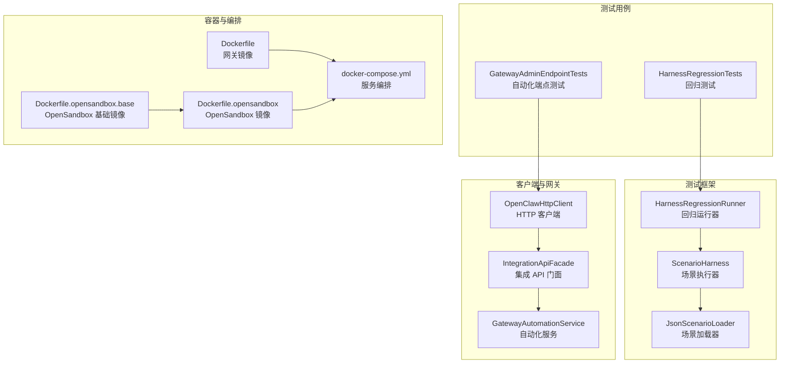
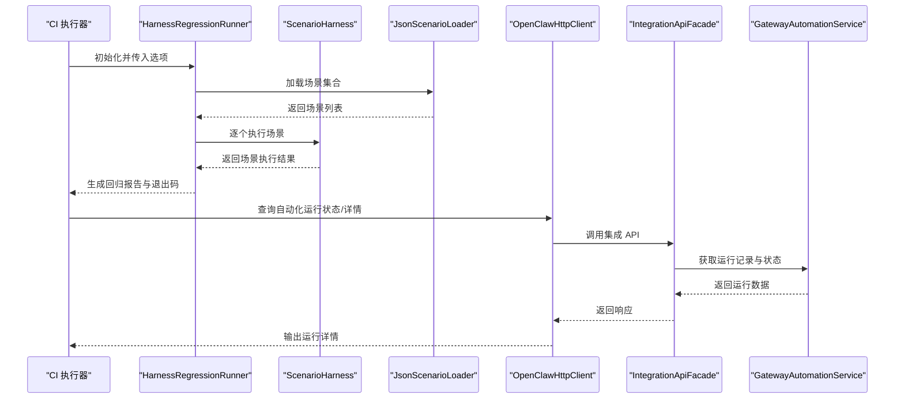
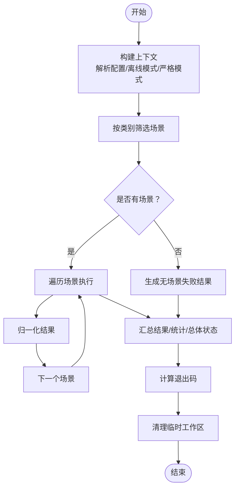
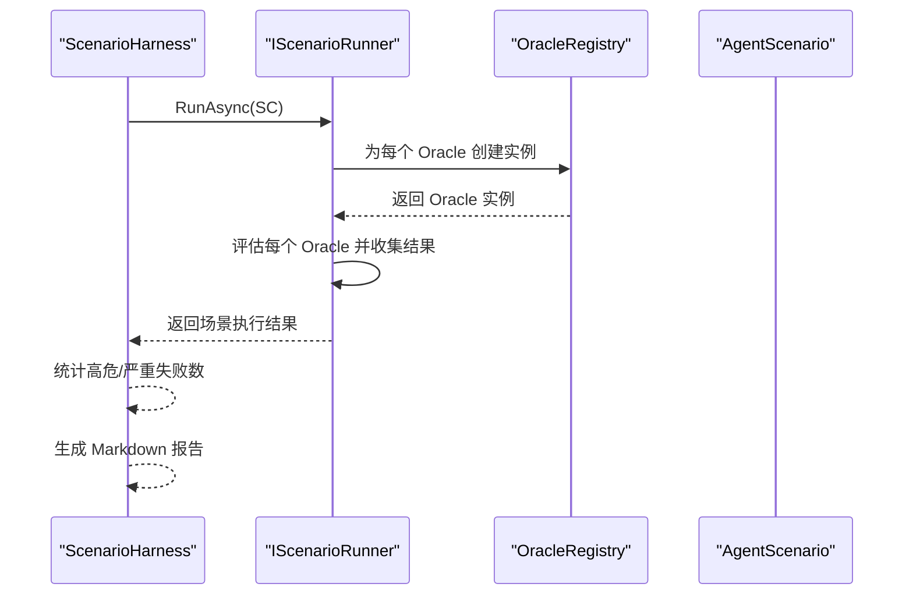
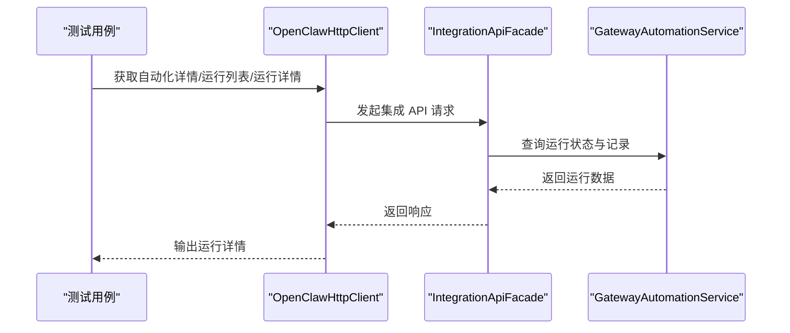
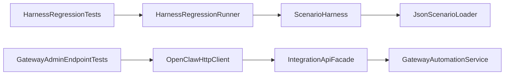

# 测试自动化

<cite>
**本文引用的文件**
- [docker-compose.yml](file://docker-compose.yml)
- [Dockerfile](file://Dockerfile)
- [Dockerfile.opensandbox](file://Dockerfile.opensandbox)
- [Dockerfile.opensandbox.base](file://Dockerfile.opensandbox.base)
- [HarnessRegressionRunner.cs](file://src/OpenClaw.Testing/HarnessRegressionRunner.cs)
- [ScenarioHarness.cs](file://src/OpenClaw.Testing/ScenarioHarness.cs)
- [ScenarioLoader.cs](file://src/OpenClaw.Testing/ScenarioLoader.cs)
- [HarnessRegressionTests.cs](file://src/OpenClaw.Tests/HarnessRegressionTests.cs)
- [GatewayAdminEndpointTests.cs](file://src/OpenClaw.Tests/GatewayAdminEndpointTests.cs)
- [OpenClawHttpClient.cs](file://src/OpenClaw.Client/OpenClawHttpClient.cs)
- [GatewayAutomationService.cs](file://src/OpenClaw.Gateway/GatewayAutomationService.cs)
- [IntegrationApiFacade.cs](file://src/OpenClaw.Gateway/Composition/IntegrationApiFacade.cs)
</cite>

## 目录
1. [简介](#简介)
2. [项目结构](#项目结构)
3. [核心组件](#核心组件)
4. [架构总览](#架构总览)
5. [详细组件分析](#详细组件分析)
6. [依赖关系分析](#依赖关系分析)
7. [性能考量](#性能考量)
8. [故障排查指南](#故障排查指南)
9. [结论](#结论)
10. [附录](#附录)

## 简介
本文件面向 OpenClaw.NET 的测试自动化与持续集成（CI），系统性阐述测试自动化配置与执行流程、测试脚本与场景管理、测试环境容器化与自动配置、测试数据准备、并行执行与分片策略、结果聚合与报告生成、通知机制、以及在云平台上的运行实践。文档同时给出最佳实践、故障恢复策略与性能监控建议，帮助团队在 CI 中稳定、高效地交付高质量测试。

## 项目结构
OpenClaw.NET 将测试相关能力集中在专用库与测试项目中，并通过容器镜像与编排文件实现测试环境的快速部署与复用。关键结构如下：
- 测试运行与回归框架：位于 OpenClaw.Testing，提供场景加载、脚本化场景执行、回归报告与退出码控制等能力。
- 测试用例与集成测试：位于 OpenClaw.Tests，覆盖自动化运行、工作流、客户端接口等端到端验证。
- 客户端与网关：OpenClaw.Client 提供对网关 API 的访问；Gateway 提供自动化模板与运行状态管理。
- 容器化与编排：Dockerfile 与 docker-compose.yml 提供本地与集成测试所需的最小运行时与可选反向代理。

图表来源
- [HarnessRegressionRunner.cs:1-383](file://src/OpenClaw.Testing/HarnessRegressionRunner.cs#L1-L383)
- [ScenarioHarness.cs:1-179](file://src/OpenClaw.Testing/ScenarioHarness.cs#L1-L179)
- [ScenarioLoader.cs:1-154](file://src/OpenClaw.Testing/ScenarioLoader.cs#L1-L154)
- [HarnessRegressionTests.cs:34-353](file://src/OpenClaw.Tests/HarnessRegressionTests.cs#L34-L353)
- [GatewayAdminEndpointTests.cs:5886-5931](file://src/OpenClaw.Tests/GatewayAdminEndpointTests.cs#L5886-L5931)
- [OpenClawHttpClient.cs:758-798](file://src/OpenClaw.Client/OpenClawHttpClient.cs#L758-L798)
- [GatewayAutomationService.cs:472-497](file://src/OpenClaw.Gateway/GatewayAutomationService.cs#L472-L497)
- [IntegrationApiFacade.cs:603-628](file://src/OpenClaw.Gateway/Composition/IntegrationApiFacade.cs#L603-L628)
- [Dockerfile:1-59](file://Dockerfile#L1-L59)
- [Dockerfile.opensandbox:1-113](file://Dockerfile.opensandbox#L1-L113)
- [Dockerfile.opensandbox.base:1-76](file://Dockerfile.opensandbox.base#L1-L76)
- [docker-compose.yml:1-68](file://docker-compose.yml#L1-L68)

章节来源
- [Dockerfile:1-59](file://Dockerfile#L1-L59)
- [docker-compose.yml:1-68](file://docker-compose.yml#L1-L68)
- [Dockerfile.opensandbox:1-113](file://Dockerfile.opensandbox#L1-L113)
- [Dockerfile.opensandbox.base:1-76](file://Dockerfile.opensandbox.base#L1-L76)

## 核心组件
- 回归运行器（HarnessRegressionRunner）
  - 负责选择场景、执行场景、汇总结果、计算总体状态与退出码、清理临时工作区。
  - 支持严格模式（将警告/跳过视为失败）、分类筛选、超时与取消处理。
- 场景执行器（ScenarioHarness）
  - 对一组 Agent 场景进行顺序执行，产出带 Markdown 报告的运行报告。
- 场景加载器（JsonScenarioLoader）
  - 从目录递归加载 JSON 场景定义，标准化输入、期望、脚本化轨迹与元数据。
- 客户端与网关
  - OpenClawHttpClient 提供自动化模板、运行、重放、清 Quarantine 等 API 访问。
  - IntegrationApiFacade 暴露自动化详情、运行列表与运行详情查询。
  - GatewayAutomationService 内置自动化模板（如 incident follow-up、repo hygiene）。

章节来源
- [HarnessRegressionRunner.cs:1-383](file://src/OpenClaw.Testing/HarnessRegressionRunner.cs#L1-L383)
- [ScenarioHarness.cs:1-179](file://src/OpenClaw.Testing/ScenarioHarness.cs#L1-L179)
- [ScenarioLoader.cs:1-154](file://src/OpenClaw.Testing/ScenarioLoader.cs#L1-L154)
- [OpenClawHttpClient.cs:758-798](file://src/OpenClaw.Client/OpenClawHttpClient.cs#L758-L798)
- [IntegrationApiFacade.cs:603-628](file://src/OpenClaw.Gateway/Composition/IntegrationApiFacade.cs#L603-L628)
- [GatewayAutomationService.cs:472-497](file://src/OpenClaw.Gateway/GatewayAutomationService.cs#L472-L497)

## 架构总览
下图展示测试自动化在 CI 中的端到端流程：测试驱动程序调用回归运行器与场景执行器，加载场景并执行；客户端通过网关 API 查询自动化运行状态；容器化环境提供统一的测试运行时。

图表来源
- [HarnessRegressionRunner.cs:18-68](file://src/OpenClaw.Testing/HarnessRegressionRunner.cs#L18-L68)
- [ScenarioHarness.cs:129-171](file://src/OpenClaw.Testing/ScenarioHarness.cs#L129-L171)
- [ScenarioLoader.cs:7-40](file://src/OpenClaw.Testing/ScenarioLoader.cs#L7-L40)
- [OpenClawHttpClient.cs:779-798](file://src/OpenClaw.Client/OpenClawHttpClient.cs#L779-L798)
- [IntegrationApiFacade.cs:609-628](file://src/OpenClaw.Gateway/Composition/IntegrationApiFacade.cs#L609-L628)
- [GatewayAutomationService.cs:472-497](file://src/OpenClaw.Gateway/GatewayAutomationService.cs#L472-L497)

## 详细组件分析

### 回归运行器（HarnessRegressionRunner）
- 功能要点
  - 场景选择：支持按类别筛选场景。
  - 执行与归一化：逐场景执行并归一化结果（状态、严重级别、时间戳、证据等）。
  - 总体状态判定：根据严格模式与必选项决定最终状态。
  - 退出码：仅当必选失败时返回非零退出码，严格模式下警告/跳过也会导致非零退出码。
  - 清理：无论成功与否，均清理临时工作区。
- 关键路径
  - 运行入口：[HarnessRegressionRunner.RunAsync:18-68](file://src/OpenClaw.Testing/HarnessRegressionRunner.cs#L18-L68)
  - 退出码逻辑：[HarnessRegressionRunner.GetExitCode:70-88](file://src/OpenClaw.Testing/HarnessRegressionRunner.cs#L70-L88)
  - 结果归一化与摘要：[NormalizeResult/BuildSummary:158-198](file://src/OpenClaw.Testing/HarnessRegressionRunner.cs#L158-L198)
  - 临时工作区创建与清理：[CreateTempWorkspace/TryDeleteDirectory:300-322](file://src/OpenClaw.Testing/HarnessRegressionRunner.cs#L300-L322)

图表来源
- [HarnessRegressionRunner.cs:18-127](file://src/OpenClaw.Testing/HarnessRegressionRunner.cs#L18-L127)
- [HarnessRegressionRunner.cs:129-137](file://src/OpenClaw.Testing/HarnessRegressionRunner.cs#L129-L137)
- [HarnessRegressionRunner.cs:158-187](file://src/OpenClaw.Testing/HarnessRegressionRunner.cs#L158-L187)
- [HarnessRegressionRunner.cs:189-229](file://src/OpenClaw.Testing/HarnessRegressionRunner.cs#L189-L229)
- [HarnessRegressionRunner.cs:70-88](file://src/OpenClaw.Testing/HarnessRegressionRunner.cs#L70-L88)
- [HarnessRegressionRunner.cs:300-322](file://src/OpenClaw.Testing/HarnessRegressionRunner.cs#L300-L322)

章节来源
- [HarnessRegressionRunner.cs:1-383](file://src/OpenClaw.Testing/HarnessRegressionRunner.cs#L1-L383)

### 场景执行器（ScenarioHarness）
- 功能要点
  - 顺序执行 Agent 场景，收集每个场景的执行轨迹与 Oracle 评估结果。
  - 产出运行报告，包含 Markdown 报告与摘要统计。
- 关键路径
  - 场景执行：[ScenarioHarness.RunAsync:129-171](file://src/OpenClaw.Testing/ScenarioHarness.cs#L129-L171)
  - 脚本化轨迹构建：[BuildTrace:59-115](file://src/OpenClaw.Testing/ScenarioHarness.cs#L59-L115)

图表来源
- [ScenarioHarness.cs:129-171](file://src/OpenClaw.Testing/ScenarioHarness.cs#L129-L171)
- [ScenarioHarness.cs:3-57](file://src/OpenClaw.Testing/ScenarioHarness.cs#L3-L57)

章节来源
- [ScenarioHarness.cs:1-179](file://src/OpenClaw.Testing/ScenarioHarness.cs#L1-L179)

### 场景加载器（JsonScenarioLoader）
- 功能要点
  - 递归扫描目录，解析单个或数组形式的场景 JSON 文件。
  - 标准化输入、期望、脚本化轨迹与元数据，确保后续执行一致性。
- 关键路径
  - 加载与解析：[JsonScenarioLoader.LoadAsync:7-40](file://src/OpenClaw.Testing/ScenarioLoader.cs#L7-L40)
  - 标准化逻辑：[Normalize*:42-153](file://src/OpenClaw.Testing/ScenarioLoader.cs#L42-L153)

章节来源
- [ScenarioLoader.cs:1-154](file://src/OpenClaw.Testing/ScenarioLoader.cs#L1-L154)

### 客户端与网关（自动化运行与查询）
- 功能要点
  - 客户端提供自动化模板、运行、重放、清 Quarantine 等 API。
  - 网关提供自动化详情、运行列表与运行详情查询。
  - 网关内置自动化模板（如 incident follow-up、repo hygiene）。
- 关键路径
  - 自动化运行与查询：[OpenClawHttpClient:758-798](file://src/OpenClaw.Client/OpenClawHttpClient.cs#L758-L798)
  - 自动化详情/运行列表/运行详情：[IntegrationApiFacade:609-628](file://src/OpenClaw.Gateway/Composition/IntegrationApiFacade.cs#L609-L628)
  - 自动化模板示例：[GatewayAutomationService:472-497](file://src/OpenClaw.Gateway/GatewayAutomationService.cs#L472-L497)

图表来源
- [OpenClawHttpClient.cs:758-798](file://src/OpenClaw.Client/OpenClawHttpClient.cs#L758-L798)
- [IntegrationApiFacade.cs:609-628](file://src/OpenClaw.Gateway/Composition/IntegrationApiFacade.cs#L609-L628)
- [GatewayAutomationService.cs:472-497](file://src/OpenClaw.Gateway/GatewayAutomationService.cs#L472-L497)

章节来源
- [OpenClawHttpClient.cs:758-798](file://src/OpenClaw.Client/OpenClawHttpClient.cs#L758-L798)
- [IntegrationApiFacade.cs:603-628](file://src/OpenClaw.Gateway/Composition/IntegrationApiFacade.cs#L603-L628)
- [GatewayAutomationService.cs:472-497](file://src/OpenClaw.Gateway/GatewayAutomationService.cs#L472-L497)

### 测试用例与回归验证
- 回归测试用例
  - 验证失败场景导致非零退出码、跳过不默认失败、严格模式下警告/跳过视为失败、结果归一化、负耗时钳制、取消时清理临时工作区、按类别筛选等。
- 关键路径
  - 回归测试断言与行为：[HarnessRegressionTests:34-353](file://src/OpenClaw.Tests/HarnessRegressionTests.cs#L34-L353)
  - 自动化运行状态与历史查询（集成测试）：[GatewayAdminEndpointTests:5886-5931](file://src/OpenClaw.Tests/GatewayAdminEndpointTests.cs#L5886-L5931)

章节来源
- [HarnessRegressionTests.cs:34-353](file://src/OpenClaw.Tests/HarnessRegressionTests.cs#L34-L353)
- [GatewayAdminEndpointTests.cs:5886-5931](file://src/OpenClaw.Tests/GatewayAdminEndpointTests.cs#L5886-L5931)

## 依赖关系分析
- 组件耦合
  - HarnessRegressionRunner 依赖 ScenarioHarness 与 JsonScenarioLoader，形成“运行-执行-加载”的清晰职责分离。
  - ScenarioHarness 依赖 IScenarioRunner 与 Oracle 注册表，便于扩展不同类型的场景执行器。
  - 测试用例通过 OpenClawHttpClient 与网关交互，验证自动化运行状态与历史。
- 外部依赖
  - 容器镜像与编排文件提供一致的测试运行时，减少环境差异带来的不确定性。
- 潜在循环依赖
  - 当前模块间为单向依赖，未见循环依赖迹象。

图表来源
- [HarnessRegressionTests.cs:34-353](file://src/OpenClaw.Tests/HarnessRegressionTests.cs#L34-L353)
- [HarnessRegressionRunner.cs:1-383](file://src/OpenClaw.Testing/HarnessRegressionRunner.cs#L1-L383)
- [ScenarioHarness.cs:1-179](file://src/OpenClaw.Testing/ScenarioHarness.cs#L1-L179)
- [ScenarioLoader.cs:1-154](file://src/OpenClaw.Testing/ScenarioLoader.cs#L1-L154)
- [GatewayAdminEndpointTests.cs:5886-5931](file://src/OpenClaw.Tests/GatewayAdminEndpointTests.cs#L5886-L5931)
- [OpenClawHttpClient.cs:758-798](file://src/OpenClaw.Client/OpenClawHttpClient.cs#L758-L798)
- [IntegrationApiFacade.cs:603-628](file://src/OpenClaw.Gateway/Composition/IntegrationApiFacade.cs#L603-L628)
- [GatewayAutomationService.cs:472-497](file://src/OpenClaw.Gateway/GatewayAutomationService.cs#L472-L497)

章节来源
- [HarnessRegressionRunner.cs:1-383](file://src/OpenClaw.Testing/HarnessRegressionRunner.cs#L1-L383)
- [ScenarioHarness.cs:1-179](file://src/OpenClaw.Testing/ScenarioHarness.cs#L1-L179)
- [ScenarioLoader.cs:1-154](file://src/OpenClaw.Testing/ScenarioLoader.cs#L1-L154)
- [OpenClawHttpClient.cs:758-798](file://src/OpenClaw.Client/OpenClawHttpClient.cs#L758-L798)
- [IntegrationApiFacade.cs:603-628](file://src/OpenClaw.Gateway/Composition/IntegrationApiFacade.cs#L603-L628)
- [GatewayAutomationService.cs:472-497](file://src/OpenClaw.Gateway/GatewayAutomationService.cs#L472-L497)

## 性能考量
- 并行执行与分片
  - 在 CI 中，建议将场景集按类别或风险等级拆分为多个作业并行执行，结合容器化隔离资源，避免共享状态竞争。
  - 使用“分片”策略：按场景 ID 或哈希值取模分配到不同分片，保证可重复性与可恢复性。
- 资源隔离与容器化
  - 使用 docker-compose 启动最小化的网关服务，必要时启用反向代理与健康检查，确保测试稳定性。
  - OpenSandbox 镜像适合需要浏览器、Python 等工具链的复杂场景，但需注意镜像体积与启动时间。
- 结果聚合与报告
  - 回归运行器输出结构化报告，建议在 CI 中以 artifacts 形式保存 JSON 与 Markdown 报告，便于后续分析与通知。
- 监控与可观测性
  - 在容器中开启健康检查与日志采集，结合 CI 日志导出与外部监控平台，建立端到端性能基线。

## 故障排查指南
- 回归运行器常见问题
  - 无场景匹配：检查场景目录与类别过滤参数，确认场景文件命名与格式正确。
  - 严格模式失败：若警告或跳过被视作失败，调整严格模式参数或修复场景。
  - 取消与清理：若任务被取消，确认临时工作区已被清理，避免磁盘占用。
- 场景执行问题
  - 缺少脚本化轨迹或 Oracle：确保场景定义包含必要的 scriptedTrace 与 oracles 字段。
  - 超时与取消：为长场景设置合理的超时与取消令牌，避免阻塞 CI。
- 客户端与网关交互
  - 自动化运行状态异常：通过客户端 API 查询运行详情与重放，定位失败原因。
  - 权限与认证：确保测试使用的鉴权令牌有效，避免 401/403 导致的查询失败。
- 容器化问题
  - 端口冲突与绑定：检查容器端口映射与绑定地址，确保服务可访问。
  - 健康检查失败：查看容器日志与健康检查命令，确认应用启动完成。

章节来源
- [HarnessRegressionRunner.cs:129-137](file://src/OpenClaw.Testing/HarnessRegressionRunner.cs#L129-L137)
- [HarnessRegressionRunner.cs:300-322](file://src/OpenClaw.Testing/HarnessRegressionRunner.cs#L300-L322)
- [ScenarioHarness.cs:129-171](file://src/OpenClaw.Testing/ScenarioHarness.cs#L129-L171)
- [OpenClawHttpClient.cs:758-798](file://src/OpenClaw.Client/OpenClawHttpClient.cs#L758-L798)
- [docker-compose.yml:1-68](file://docker-compose.yml#L1-L68)

## 结论
OpenClaw.NET 的测试自动化体系以“场景驱动 + 回归运行器 + 容器化运行时”为核心，实现了从场景加载、执行、评估到报告生成与退出码控制的完整闭环。通过严格的分片与并行策略、完善的容器化与编排、以及可追溯的结果与通知机制，可在 CI 中稳定、高效地交付高质量测试。建议在实际落地中结合云平台能力与监控体系，持续优化执行效率与稳定性。

## 附录
- 最佳实践
  - 场景设计：明确风险等级与标签，确保可重复与可诊断。
  - 分片策略：按类别/风险/资源需求分片，避免热点与资源争用。
  - 报告与通知：统一输出 JSON 与 Markdown 报告，结合 CI 通知渠道（邮件、IM 等）。
  - 环境治理：优先使用容器镜像，固定版本与依赖，减少环境漂移。
- 故障恢复
  - 支持重放失败运行，保留证据与轨迹，便于回溯。
  - 引入 Quarantine 与重试策略，降低瞬时故障影响。
- 性能监控
  - 建立端到端指标（启动时间、执行时延、失败率、重试次数），结合可视化看板持续改进。