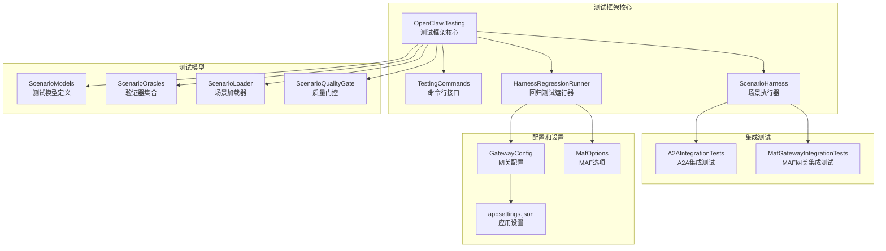
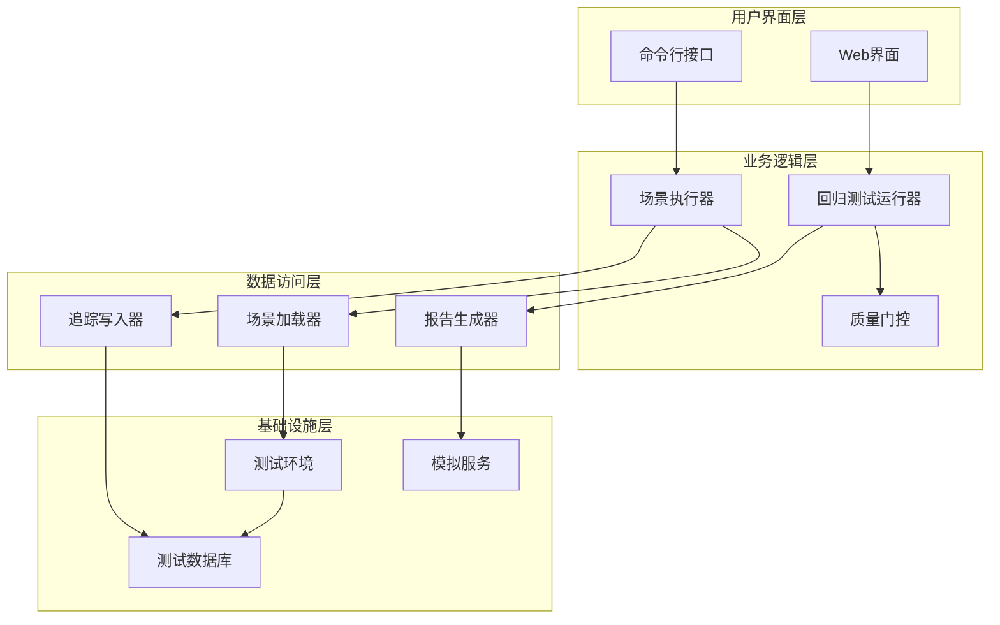
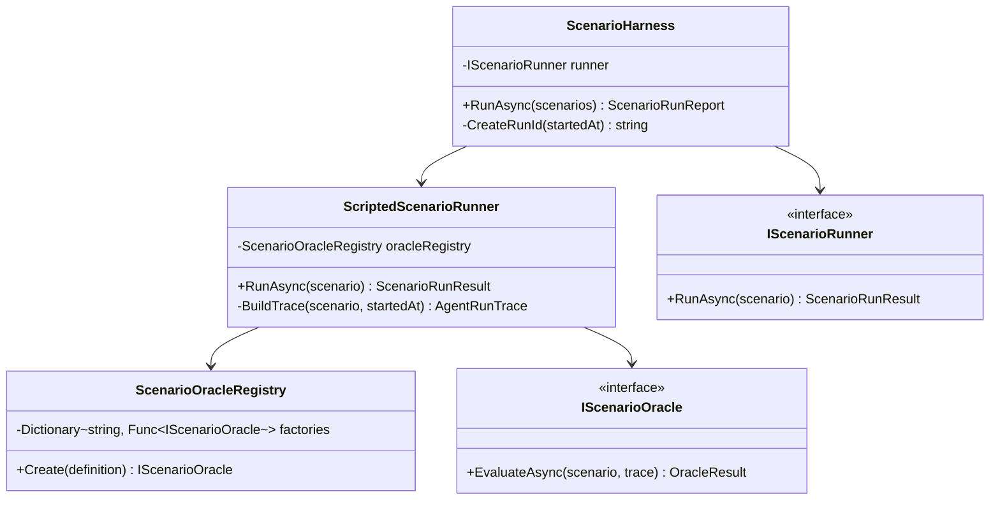
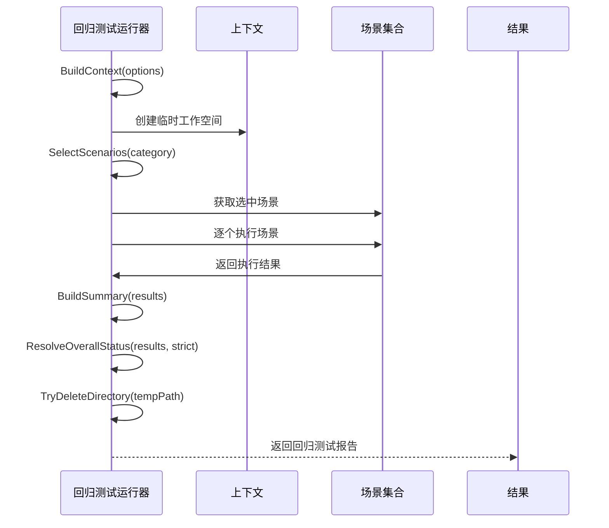
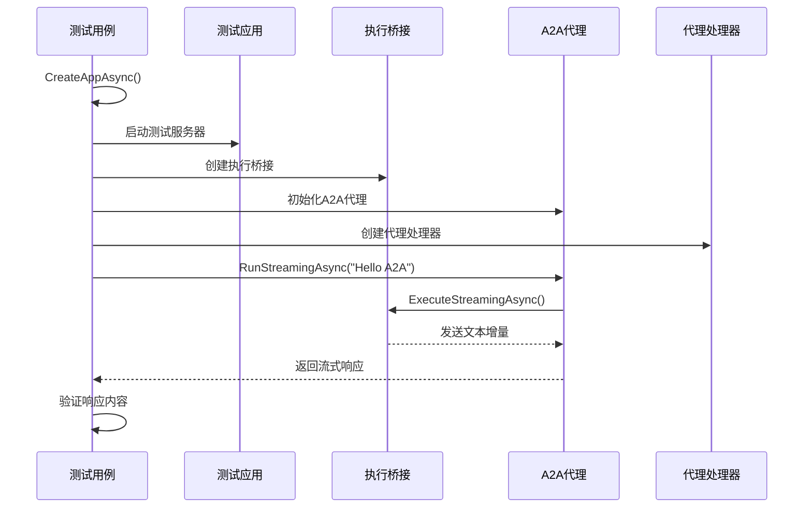
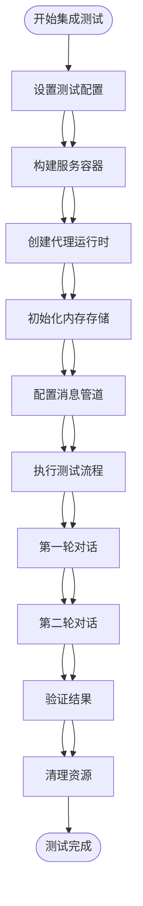
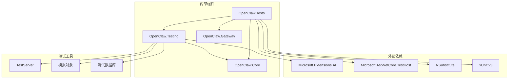

# 集成测试

<cite>
**本文档引用的文件**
- [OpenClaw.Testing.csproj](file://src/OpenClaw.Testing/OpenClaw.Testing.csproj)
- [OpenClaw.Tests.csproj](file://src/OpenClaw.Tests/OpenClaw.Tests.csproj)
- [TestingCommands.cs](file://src/OpenClaw.Cli/TestingCommands.cs)
- [ScenarioHarness.cs](file://src/OpenClaw.Testing/ScenarioHarness.cs)
- [HarnessRegressionRunner.cs](file://src/OpenClaw.Testing/HarnessRegressionRunner.cs)
- [ScenarioModels.cs](file://src/OpenClaw.Testing/ScenarioModels.cs)
- [ScenarioOracles.cs](file://src/OpenClaw.Testing/ScenarioOracles.cs)
- [HarnessRegressionScenarios.cs](file://src/OpenClaw.Testing/HarnessRegressionScenarios.cs)
- [ScenarioLoader.cs](file://src/OpenClaw.Testing/ScenarioLoader.cs)
- [ScenarioQualityGate.cs](file://src/OpenClaw.Testing/ScenarioQualityGate.cs)
- [A2AIntegrationTests.cs](file://src/OpenClaw.Tests/A2AIntegrationTests.cs)
- [MafGatewayIntegrationTests.cs](file://src/OpenClaw.Tests/MafGatewayIntegrationTests.cs)
</cite>

## 目录
1. [简介](#简介)
2. [项目结构](#项目结构)
3. [核心组件](#核心组件)
4. [架构概览](#架构概览)
5. [详细组件分析](#详细组件分析)
6. [依赖分析](#依赖分析)
7. [性能考虑](#性能考虑)
8. [故障排除指南](#故障排除指南)
9. [结论](#结论)
10. [附录](#附录)

## 简介

OpenClaw.NET 集成测试框架是一个全面的测试解决方案，专为验证复杂 AI 代理系统在真实环境中的行为而设计。该框架不仅支持传统的单元测试，更重要的是提供了端到端的集成测试能力，能够模拟真实的用户交互、工具调用和系统集成场景。

集成测试的核心目标是验证：
- 组件间的正确交互和数据流
- API 端点的完整功能实现
- 数据库和存储系统的集成
- 外部服务的模拟和集成
- 安全策略和权限控制的有效性
- 性能和并发处理能力

该框架采用场景驱动的方法，通过预定义的测试场景来验证系统的各个方面，确保在各种配置和环境下的一致性表现。

## 项目结构

OpenClaw.NET 集成测试框架由多个相互协作的组件组成，形成了一个完整的测试生态系统：



**图表来源**
- [OpenClaw.Testing.csproj:1-15](file://src/OpenClaw.Testing/OpenClaw.Testing.csproj#L1-L15)
- [OpenClaw.Tests.csproj:1-55](file://src/OpenClaw.Tests/OpenClaw.Tests.csproj#L1-L55)

**章节来源**
- [OpenClaw.Testing.csproj:1-15](file://src/OpenClaw.Testing/OpenClaw.Testing.csproj#L1-L15)
- [OpenClaw.Tests.csproj:1-55](file://src/OpenClaw.Tests/OpenClaw.Tests.csproj#L1-L55)

## 核心组件

### 测试执行引擎

测试执行引擎是整个框架的核心，负责协调所有测试活动并提供统一的执行接口。

**章节来源**
- [ScenarioHarness.cs:123-179](file://src/OpenClaw.Testing/ScenarioHarness.cs#L123-L179)
- [HarnessRegressionRunner.cs:7-68](file://src/OpenClaw.Testing/HarnessRegressionRunner.cs#L7-L68)

### 场景驱动测试

场景驱动测试方法允许测试人员定义具体的测试场景，每个场景都包含预期的行为和验证规则。

**章节来源**
- [ScenarioModels.cs:15-28](file://src/OpenClaw.Testing/ScenarioModels.cs#L15-L28)
- [ScenarioModels.cs:50-58](file://src/OpenClaw.Testing/ScenarioModels.cs#L50-L58)

### 验证器系统

验证器系统提供了多种内置的验证规则，用于检查测试结果是否符合预期。

**章节来源**
- [ScenarioOracles.cs:6-16](file://src/OpenClaw.Testing/ScenarioOracles.cs#L6-L16)
- [ScenarioOracles.cs:33-62](file://src/OpenClaw.Testing/ScenarioOracles.cs#L33-L62)

## 架构概览

OpenClaw.NET 集成测试框架采用了分层架构设计，确保了测试的可维护性和扩展性：



**图表来源**
- [TestingCommands.cs:12-82](file://src/OpenClaw.Cli/TestingCommands.cs#L12-L82)
- [HarnessRegressionRunner.cs:18-68](file://src/OpenClaw.Testing/HarnessRegressionRunner.cs#L18-L68)

## 详细组件分析

### 场景执行器 (ScenarioHarness)

场景执行器是测试框架的核心组件，负责加载、执行和报告测试场景。



**图表来源**
- [ScenarioHarness.cs:123-179](file://src/OpenClaw.Testing/ScenarioHarness.cs#L123-L179)
- [ScenarioHarness.cs:3-57](file://src/OpenClaw.Testing/ScenarioHarness.cs#L3-L57)
- [ScenarioOracles.cs:33-62](file://src/OpenClaw.Testing/ScenarioOracles.cs#L33-L62)

**章节来源**
- [ScenarioHarness.cs:123-179](file://src/OpenClaw.Testing/ScenarioHarness.cs#L123-L179)
- [ScenarioHarness.cs:1-122](file://src/OpenClaw.Testing/ScenarioHarness.cs#L1-L122)

### 回归测试运行器

回归测试运行器专门用于执行预定义的回归测试场景，确保系统在更新后仍能保持预期的功能。



**图表来源**
- [HarnessRegressionRunner.cs:18-68](file://src/OpenClaw.Testing/HarnessRegressionRunner.cs#L18-L68)

**章节来源**
- [HarnessRegressionRunner.cs:7-383](file://src/OpenClaw.Testing/HarnessRegressionRunner.cs#L7-L383)

### A2A 集成测试

A2A（Agent-to-Agent）集成测试验证了代理间通信协议的正确实现。



**图表来源**
- [A2AIntegrationTests.cs:56-121](file://src/OpenClaw.Tests/A2AIntegrationTests.cs#L56-L121)

**章节来源**
- [A2AIntegrationTests.cs:24-659](file://src/OpenClaw.Tests/A2AIntegrationTests.cs#L24-L659)

### MAF 网关集成测试

MAF（Microsoft Agent Framework）网关集成测试验证了完整的代理运行时环境。



**图表来源**
- [MafGatewayIntegrationTests.cs:51-181](file://src/OpenClaw.Tests/MafGatewayIntegrationTests.cs#L51-L181)

**章节来源**
- [MafGatewayIntegrationTests.cs:25-633](file://src/OpenClaw.Tests/MafGatewayIntegrationTests.cs#L25-L633)

## 依赖分析

集成测试框架的依赖关系展示了各个组件之间的耦合程度和交互模式：



**图表来源**
- [OpenClaw.Testing.csproj:10-13](file://src/OpenClaw.Testing/OpenClaw.Testing.csproj#L10-L13)
- [OpenClaw.Tests.csproj:29-37](file://src/OpenClaw.Tests/OpenClaw.Tests.csproj#L29-L37)

**章节来源**
- [OpenClaw.Testing.csproj:1-15](file://src/OpenClaw.Testing/OpenClaw.Testing.csproj#L1-L15)
- [OpenClaw.Tests.csproj:1-55](file://src/OpenClaw.Tests/OpenClaw.Tests.csproj#L1-L55)

## 性能考虑

集成测试框架在设计时充分考虑了性能优化：

### 并发处理
- 支持多线程和异步操作
- 使用通道(Channels)进行高效的消息传递
- 内存存储优化，支持缓存机制

### 资源管理
- 自动化的资源清理机制
- 临时文件和目录的生命周期管理
- 连接池和资源复用策略

### 测试隔离
- 每个测试独立的临时工作空间
- 隔离的数据库实例
- 独立的服务容器

## 故障排除指南

### 常见问题诊断

**场景加载失败**
- 检查 JSON 文件格式是否正确
- 验证必需字段是否存在
- 确认文件编码格式

**测试执行超时**
- 增加超时时间设置
- 检查外部服务连接状态
- 验证网络配置

**内存不足错误**
- 减少并发测试数量
- 清理临时文件
- 优化测试数据大小

### 调试技巧

**启用详细日志**
```csharp
// 在测试配置中启用详细日志
builder.Services.AddLogging(logging =>
{
    logging.SetMinimumLevel(LogLevel.Debug);
});
```

**断点调试**
- 在关键测试点设置断点
- 监视服务注册过程
- 检查依赖注入容器状态

**性能监控**
- 使用性能计数器跟踪测试执行时间
- 监控内存使用情况
- 分析并发测试的资源消耗

**章节来源**
- [HarnessRegressionRunner.cs:307-322](file://src/OpenClaw.Testing/HarnessRegressionRunner.cs#L307-L322)

## 结论

OpenClaw.NET 集成测试框架提供了一个强大而灵活的测试解决方案，能够有效验证复杂 AI 代理系统在各种环境下的行为。通过场景驱动的方法和全面的验证器系统，该框架确保了测试的一致性和可维护性。

框架的主要优势包括：
- **模块化设计**：清晰的组件分离和职责划分
- **可扩展性**：支持自定义验证器和测试场景
- **自动化程度高**：减少手动干预，提高测试效率
- **全面覆盖**：从单元测试到端到端集成测试的完整覆盖

未来的发展方向包括：
- 更丰富的测试场景模板
- 增强的性能测试能力
- 更好的可视化报告功能
- 改进的并发测试支持

## 附录

### 测试场景设计最佳实践

**场景编写规范**
- 明确的场景标识符和描述
- 具体的预期行为声明
- 完整的验证规则定义
- 合理的风险级别评估

**测试数据管理**
- 使用固定的测试数据集
- 实现数据重置机制
- 支持数据参数化

**测试环境配置**
- 独立的测试环境设置
- 外部服务的模拟配置
- 网络和安全设置的隔离

### 性能基准测试

框架支持性能基准测试，包括：
- 响应时间测量
- 并发处理能力测试
- 资源使用率监控
- 内存泄漏检测

通过这些工具和方法，OpenClaw.NET 集成测试框架为开发团队提供了一个全面的质量保证解决方案。