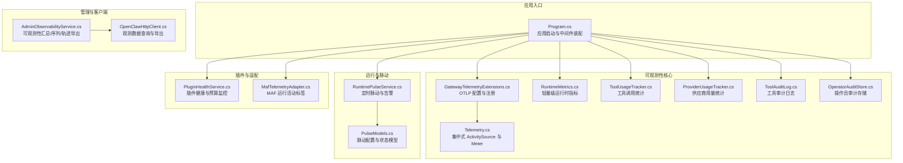
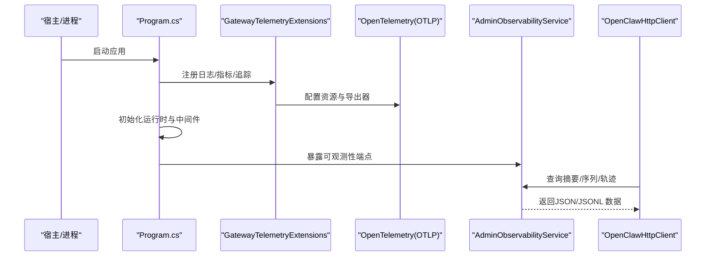
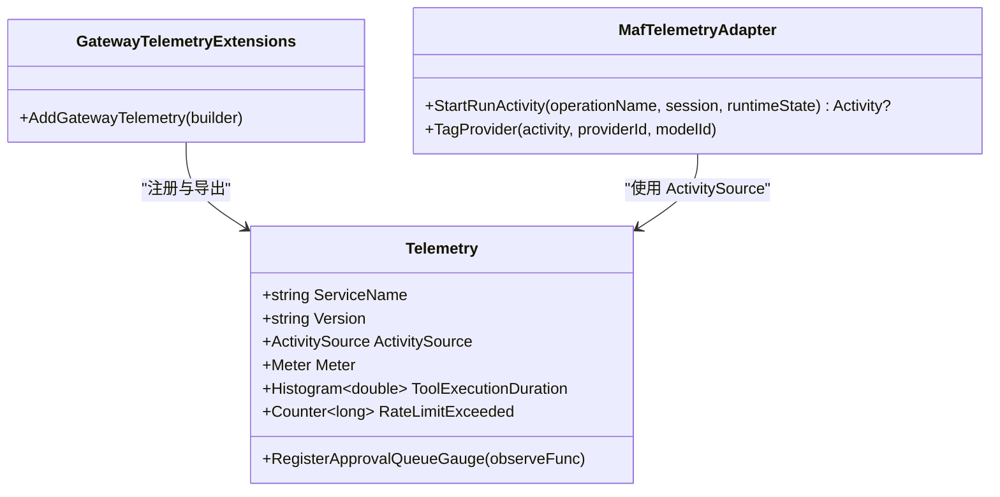
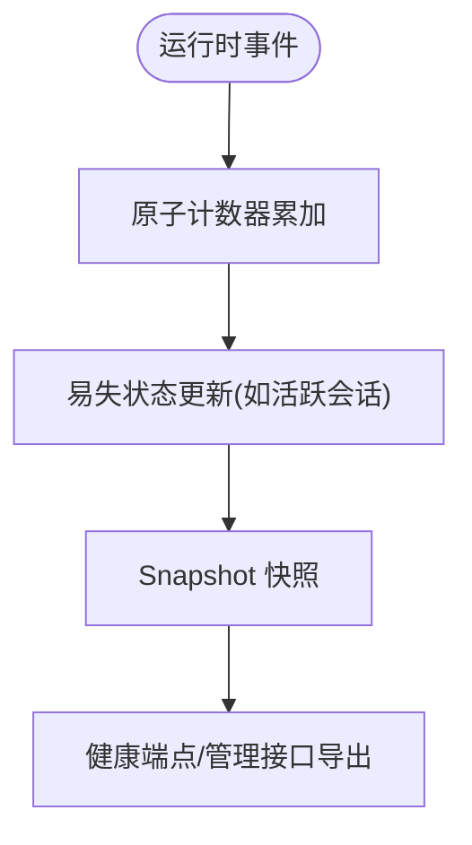
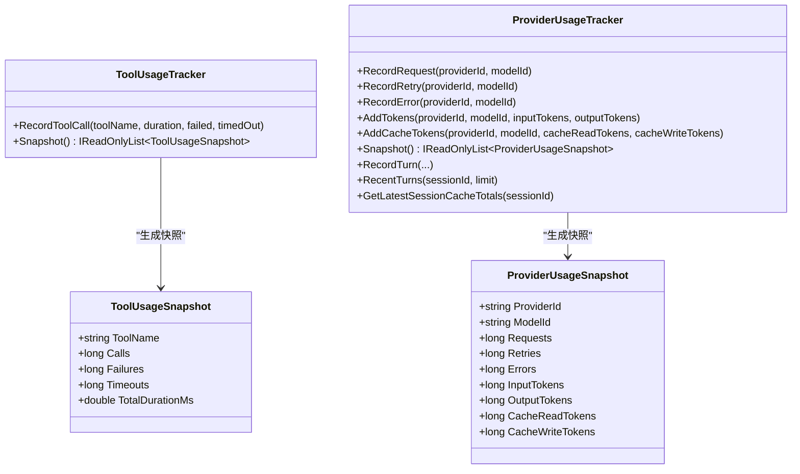
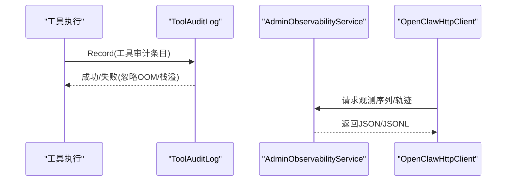
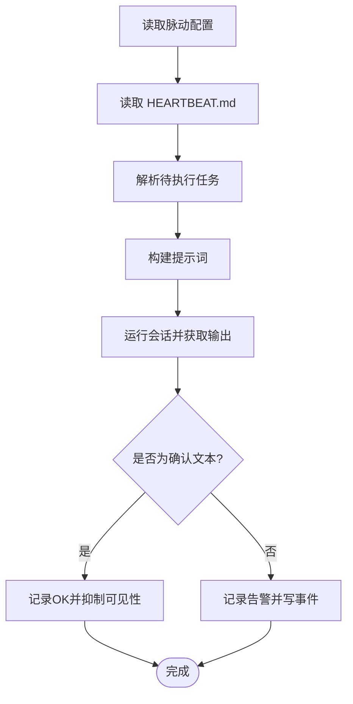
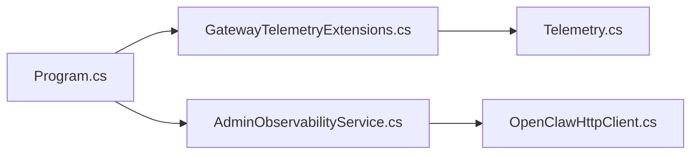

# 调试和性能分析

<cite>
**本文引用的文件**
- [Telemetry.cs](file://src/OpenClaw.Core/Observability/Telemetry.cs)
- [GatewayTelemetryExtensions.cs](file://src/OpenClaw.Gateway/Extensions/GatewayTelemetryExtensions.cs)
- [RuntimeMetrics.cs](file://src/OpenClaw.Core/Observability/RuntimeMetrics.cs)
- [ToolUsageTracker.cs](file://src/OpenClaw.Core/Observability/ToolUsageTracker.cs)
- [ProviderUsageTracker.cs](file://src/OpenClaw.Core/Observability/ProviderUsageTracker.cs)
- [ToolAuditLog.cs](file://src/OpenClaw.Core/Observability/ToolAuditLog.cs)
- [OperatorAuditStore.cs](file://src/OpenClaw.Gateway/OperatorAuditStore.cs)
- [AdminObservabilityService.cs](file://src/OpenClaw.Gateway/AdminObservabilityService.cs)
- [OpenClawHttpClient.cs](file://src/OpenClaw.Client/OpenClawHttpClient.cs)
- [Program.cs](file://src/OpenClaw.Gateway/Program.cs)
- [appsettings.json](file://Kingcrab.AppHost/appsettings.json)
- [appsettings.Development.json](file://Kingcrab.AppHost/appsettings.Development.json)
- [RuntimePulseService.cs](file://src/OpenClaw.Gateway/RuntimePulseService.cs)
- [PulseModels.cs](file://src/OpenClaw.Core/Models/PulseModels.cs)
- [PluginHealthService.cs](file://src/OpenClaw.Gateway/PluginHealthService.cs)
- [MafTelemetryAdapter.cs](file://src/OpenClaw.Agent/MafTelemetryAdapter.cs)
- [OpenClawToolExecutorTests.cs](file://src/OpenClaw.Tests/OpenClawToolExecutorTests.cs)
- [PluginBridgeIntegrationTests.cs](file://src/OpenClaw.Tests/PluginBridgeIntegrationTests.cs)
</cite>

## 目录
1. [简介](#简介)
2. [项目结构](#项目结构)
3. [核心组件](#核心组件)
4. [架构总览](#架构总览)
5. [详细组件分析](#详细组件分析)
6. [依赖关系分析](#依赖关系分析)
7. [性能考量](#性能考量)
8. [故障排查指南](#故障排查指南)
9. [结论](#结论)
10. [附录](#附录)

## 简介
本指南面向 OpenClaw.NET 的调试与性能分析场景，覆盖以下主题：
- 调试工具使用、断点设置与变量监视技巧
- 性能分析方法、内存泄漏检测与 CPU 使用率分析
- 日志级别配置、结构化日志记录与错误追踪
- 分布式追踪、指标采集与监控告警设置
- 常见性能瓶颈识别、优化策略与基准测试方法
- 生产环境调试、远程调试与故障排查流程

## 项目结构
OpenClaw.NET 将可观测性能力集中在核心库与网关服务中，并通过扩展方法在启动阶段统一接入 OpenTelemetry（日志、指标、追踪）。运行时关键指标由轻量级计数器与快照结构暴露，便于健康检查与告警。

图表来源
- [Program.cs:1-124](file://src/OpenClaw.Gateway/Program.cs#L1-L124)
- [GatewayTelemetryExtensions.cs:1-53](file://src/OpenClaw.Gateway/Extensions/GatewayTelemetryExtensions.cs#L1-L53)
- [Telemetry.cs:1-54](file://src/OpenClaw.Core/Observability/Telemetry.cs#L1-L54)
- [RuntimeMetrics.cs:1-312](file://src/OpenClaw.Core/Observability/RuntimeMetrics.cs#L1-L312)
- [ToolUsageTracker.cs:1-59](file://src/OpenClaw.Core/Observability/ToolUsageTracker.cs#L1-L59)
- [ProviderUsageTracker.cs:1-176](file://src/OpenClaw.Core/Observability/ProviderUsageTracker.cs#L1-L176)
- [ToolAuditLog.cs:1-125](file://src/OpenClaw.Core/Observability/ToolAuditLog.cs#L1-L125)
- [OperatorAuditStore.cs:38-178](file://src/OpenClaw.Gateway/OperatorAuditStore.cs#L38-L178)
- [AdminObservabilityService.cs:107-182](file://src/OpenClaw.Gateway/AdminObservabilityService.cs#L107-L182)
- [OpenClawHttpClient.cs:1462-1516](file://src/OpenClaw.Client/OpenClawHttpClient.cs#L1462-L1516)
- [RuntimePulseService.cs:1-800](file://src/OpenClaw.Gateway/RuntimePulseService.cs#L1-L800)
- [PulseModels.cs:32-102](file://src/OpenClaw.Core/Models/PulseModels.cs#L32-L102)
- [PluginHealthService.cs:270-308](file://src/OpenClaw.Gateway/PluginHealthService.cs#L270-L308)
- [MafTelemetryAdapter.cs:1-24](file://src/OpenClaw.Agent/MafTelemetryAdapter.cs#L1-L24)

章节来源
- [Program.cs:1-124](file://src/OpenClaw.Gateway/Program.cs#L1-L124)
- [GatewayTelemetryExtensions.cs:18-51](file://src/OpenClaw.Gateway/Extensions/GatewayTelemetryExtensions.cs#L18-L51)

## 核心组件
- 集中式遥测：通过 Telemetry 提供 ActivitySource 与 Meter，GatewayTelemetryExtensions 统一注册 OTLP 导出器，支持日志、指标与追踪。
- 运行时指标：RuntimeMetrics 提供线程安全的计数器与仪表快照，用于健康端点与监控告警。
- 工具与供应商统计：ToolUsageTracker 记录工具调用次数、失败与超时；ProviderUsageTracker 记录请求、重试、错误与令牌用量。
- 审计日志：ToolAuditLog 与 OperatorAuditStore 提供结构化 JSON Lines 审计，避免敏感信息泄露。
- 可观测性服务：AdminObservabilityService 支持摘要卡片、时间序列与轨迹导出，OpenClawHttpClient 提供查询与导出接口。
- 脉动与告警：RuntimePulseService 周期性运行，根据 HEARTBEAT.md 生成提示并产出告警或抑制可见性。
- 插件健康：PluginHealthService 基于重启次数与工作集限制自动隔离插件。
- MAF 适配：MafTelemetryAdapter 为 MAF 运行注入分布式追踪标签。

章节来源
- [Telemetry.cs:9-54](file://src/OpenClaw.Core/Observability/Telemetry.cs#L9-L54)
- [GatewayTelemetryExtensions.cs:18-51](file://src/OpenClaw.Gateway/Extensions/GatewayTelemetryExtensions.cs#L18-L51)
- [RuntimeMetrics.cs:10-312](file://src/OpenClaw.Core/Observability/RuntimeMetrics.cs#L10-L312)
- [ToolUsageTracker.cs:5-59](file://src/OpenClaw.Core/Observability/ToolUsageTracker.cs#L5-L59)
- [ProviderUsageTracker.cs:7-176](file://src/OpenClaw.Core/Observability/ProviderUsageTracker.cs#L7-L176)
- [ToolAuditLog.cs:39-125](file://src/OpenClaw.Core/Observability/ToolAuditLog.cs#L39-L125)
- [OperatorAuditStore.cs:38-178](file://src/OpenClaw.Gateway/OperatorAuditStore.cs#L38-L178)
- [AdminObservabilityService.cs:117-182](file://src/OpenClaw.Gateway/AdminObservabilityService.cs#L117-L182)
- [OpenClawHttpClient.cs:1462-1516](file://src/OpenClaw.Client/OpenClawHttpClient.cs#L1462-L1516)
- [RuntimePulseService.cs:16-800](file://src/OpenClaw.Gateway/RuntimePulseService.cs#L16-L800)
- [PluginHealthService.cs:270-308](file://src/OpenClaw.Gateway/PluginHealthService.cs#L270-L308)
- [MafTelemetryAdapter.cs:7-24](file://src/OpenClaw.Agent/MafTelemetryAdapter.cs#L7-L24)

## 架构总览
下图展示从应用启动到可观测性数据采集、处理与导出的关键路径。

图表来源
- [Program.cs:66-96](file://src/OpenClaw.Gateway/Program.cs#L66-L96)
- [GatewayTelemetryExtensions.cs:18-51](file://src/OpenClaw.Gateway/Extensions/GatewayTelemetryExtensions.cs#L18-L51)
- [AdminObservabilityService.cs:117-182](file://src/OpenClaw.Gateway/AdminObservabilityService.cs#L117-L182)
- [OpenClawHttpClient.cs:1462-1516](file://src/OpenClaw.Client/OpenClawHttpClient.cs#L1462-L1516)

## 详细组件分析

### 分布式追踪与指标
- 中央遥测源：Telemetry 提供 ActivitySource 与 Meter，命名空间与版本固定，便于统一追踪与指标命名。
- OTLP 配置：GatewayTelemetryExtensions 在构建阶段注册日志、指标与追踪，指定资源名与 OTLP 导出器。
- MAF 适配：MafTelemetryAdapter 为会话与运行模式打标签，便于跨组件关联。

图表来源
- [Telemetry.cs:9-54](file://src/OpenClaw.Core/Observability/Telemetry.cs#L9-L54)
- [GatewayTelemetryExtensions.cs:18-51](file://src/OpenClaw.Gateway/Extensions/GatewayTelemetryExtensions.cs#L18-L51)
- [MafTelemetryAdapter.cs:7-24](file://src/OpenClaw.Agent/MafTelemetryAdapter.cs#L7-L24)

章节来源
- [Telemetry.cs:9-54](file://src/OpenClaw.Core/Observability/Telemetry.cs#L9-L54)
- [GatewayTelemetryExtensions.cs:18-51](file://src/OpenClaw.Gateway/Extensions/GatewayTelemetryExtensions.cs#L18-L51)
- [MafTelemetryAdapter.cs:7-24](file://src/OpenClaw.Agent/MafTelemetryAdapter.cs#L7-L24)

### 运行时指标与健康端点
- 指标类型：计数器（单调递增）、仪表（可观察值）与瞬态状态（如活跃会话数）。
- 快照结构：RuntimeMetrics 提供 Snapshot 结构，避免分配热点，适合 AOT 场景。
- 暴露方式：通过健康端点或管理接口对外提供，便于 Prometheus/Grafana 等消费。

图表来源
- [RuntimeMetrics.cs:10-251](file://src/OpenClaw.Core/Observability/RuntimeMetrics.cs#L10-L251)

章节来源
- [RuntimeMetrics.cs:10-312](file://src/OpenClaw.Core/Observability/RuntimeMetrics.cs#L10-L312)

### 工具与供应商使用统计
- 工具统计：ToolUsageTracker 记录调用次数、失败与超时，以及总耗时（双精度位模式存储以保证线程安全）。
- 供应商统计：ProviderUsageTracker 记录请求、重试、错误与输入/输出令牌用量，支持最近回合明细与会话缓存读写统计。

图表来源
- [ToolUsageTracker.cs:5-59](file://src/OpenClaw.Core/Observability/ToolUsageTracker.cs#L5-L59)
- [ProviderUsageTracker.cs:7-176](file://src/OpenClaw.Core/Observability/ProviderUsageTracker.cs#L7-L176)

章节来源
- [ToolUsageTracker.cs:5-59](file://src/OpenClaw.Core/Observability/ToolUsageTracker.cs#L5-L59)
- [ProviderUsageTracker.cs:7-176](file://src/OpenClaw.Core/Observability/ProviderUsageTracker.cs#L7-L176)

### 审计日志与错误追踪
- 工具审计：ToolAuditLog 仅记录必要字段与字节计数，避免敏感载荷；提供最近条目快照。
- 操作员审计：OperatorAuditStore 以 JSON Lines 追加写入，维护链式哈希校验，异常时增加失败计数并记录警告。
- 客户端查询：OpenClawHttpClient 提供构建观测序列与轨迹导出的 URI 方法，便于前端或外部系统拉取。

图表来源
- [ToolAuditLog.cs:72-108](file://src/OpenClaw.Core/Observability/ToolAuditLog.cs#L72-L108)
- [OperatorAuditStore.cs:38-93](file://src/OpenClaw.Gateway/OperatorAuditStore.cs#L38-L93)
- [AdminObservabilityService.cs:170-182](file://src/OpenClaw.Gateway/AdminObservabilityService.cs#L170-L182)
- [OpenClawHttpClient.cs:1462-1516](file://src/OpenClaw.Client/OpenClawHttpClient.cs#L1462-L1516)

章节来源
- [ToolAuditLog.cs:39-125](file://src/OpenClaw.Core/Observability/ToolAuditLog.cs#L39-L125)
- [OperatorAuditStore.cs:38-178](file://src/OpenClaw.Gateway/OperatorAuditStore.cs#L38-L178)
- [OpenClawHttpClient.cs:1462-1516](file://src/OpenClaw.Client/OpenClawHttpClient.cs#L1462-L1516)

### 脉动与监控告警
- 脉动服务：RuntimePulseService 周期性读取 HEARTBEAT.md，解析任务，按配置生成提示并运行；根据结果产出“OK 抑制”或“告警”，同时更新状态与事件。
- 配置模型：PulseModels 定义可见性、间隔、目标等配置项，支持本地时区与活跃时段控制。
- 指标与事件：运行时对脉动运行、跳过、告警与错误进行计数，并写入运行事件存储。

图表来源
- [RuntimePulseService.cs:136-299](file://src/OpenClaw.Gateway/RuntimePulseService.cs#L136-L299)
- [PulseModels.cs:32-102](file://src/OpenClaw.Core/Models/PulseModels.cs#L32-L102)

章节来源
- [RuntimePulseService.cs:16-800](file://src/OpenClaw.Gateway/RuntimePulseService.cs#L16-L800)
- [PulseModels.cs:32-102](file://src/OpenClaw.Core/Models/PulseModels.cs#L32-L102)

### 插件健康与资源预算
- 预算监控：PluginHealthService 基于最大重启次数与工作集上限检测违规，自动隔离插件并记录原因。
- 运行时度量：RuntimeMetrics 提供插件桥相关计数器，便于健康端点展示。

章节来源
- [PluginHealthService.cs:270-308](file://src/OpenClaw.Gateway/PluginHealthService.cs#L270-L308)
- [RuntimeMetrics.cs:28-90](file://src/OpenClaw.Core/Observability/RuntimeMetrics.cs#L28-L90)

## 依赖关系分析
- 启动阶段：Program.cs 调用 AddGatewayTelemetry 注入遥测，随后初始化运行时与中间件。
- 遥测扩展：GatewayTelemetryExtensions 依赖 Telemetry 的 ActivitySource 与 Meter，注册 ASP.NET Core、HTTP 客户端与运行时指标，并启用 OTLP。
- 观测服务：AdminObservabilityService 依赖运行时快照与审计存储，提供摘要、序列与轨迹导出。
- 客户端：OpenClawHttpClient 通过构造查询参数与导出 URI，拉取观测数据。

图表来源
- [Program.cs:66-96](file://src/OpenClaw.Gateway/Program.cs#L66-L96)
- [GatewayTelemetryExtensions.cs:18-51](file://src/OpenClaw.Gateway/Extensions/GatewayTelemetryExtensions.cs#L18-L51)
- [AdminObservabilityService.cs:117-182](file://src/OpenClaw.Gateway/AdminObservabilityService.cs#L117-L182)
- [OpenClawHttpClient.cs:1462-1516](file://src/OpenClaw.Client/OpenClawHttpClient.cs#L1462-L1516)

章节来源
- [Program.cs:66-96](file://src/OpenClaw.Gateway/Program.cs#L66-L96)
- [GatewayTelemetryExtensions.cs:18-51](file://src/OpenClaw.Gateway/Extensions/GatewayTelemetryExtensions.cs#L18-L51)

## 性能考量
- 指标采集开销：RuntimeMetrics 使用 Interlocked/Volatile 实现无锁/低锁访问，Snapshot 结构体避免 GC；建议在高并发路径中直接读取快照而非频繁序列化。
- 工具统计：ToolUsageTracker 对总耗时采用位模式双精度累加，注意线程安全与精度边界；批量导出时建议分页与限流。
- 供应商统计：ProviderUsageTracker 使用队列限制最近回合数量，避免内存膨胀；会话缓存统计需结合业务场景评估阈值。
- 日志与审计：ToolAuditLog 与 OperatorAuditStore 采用追加写与锁保护，注意磁盘 IO 与文件大小；建议配合轮转与压缩策略。
- 脉动运行：RuntimePulseService 在受限上下文中运行，避免与业务高峰冲突；可通过活跃时段与“忙碌跳过”策略降低影响。
- 插件预算：PluginHealthService 的预算检查应与运行时指标联动，防止资源滥用导致级联故障。

[本节为通用性能指导，不直接分析具体文件]

## 故障排查指南
- 启动失败恢复：Program.cs 在首次启动失败时尝试交互式恢复与快速启动；若未处理则输出失败报告。
- 日志级别：Development 与默认配置分别设置默认日志级别与第三方组件抑制级别，便于定位问题。
- 审计回溯：ToolAuditLog 与 OperatorAuditStore 提供最近条目与链式校验，结合客户端导出接口进行离线分析。
- 脉动诊断：RuntimePulseService 提供状态响应与事件记录，可判断是否因配置禁用、可见性关闭、非活跃时段或运行中而跳过。
- 插件异常：PluginHealthService 自动隔离越界插件并记录原因；结合运行时指标查看重启与内存使用情况。

章节来源
- [Program.cs:99-122](file://src/OpenClaw.Gateway/Program.cs#L99-L122)
- [appsettings.Development.json:1-8](file://Kingcrab.AppHost/appsettings.Development.json#L1-L8)
- [appsettings.json:1-9](file://Kingcrab.AppHost/appsettings.json#L1-L9)
- [RuntimePulseService.cs:64-87](file://src/OpenClaw.Gateway/RuntimePulseService.cs#L64-L87)
- [PluginHealthService.cs:270-308](file://src/OpenClaw.Gateway/PluginHealthService.cs#L270-L308)

## 结论
OpenClaw.NET 通过集中式遥测、轻量指标与结构化审计，提供了完善的调试与性能分析基础。结合脉动告警与插件预算机制，可在生产环境中实现可观测性闭环。建议在实际部署中：
- 明确日志级别与 OTLP 出口配置
- 利用健康端点与管理接口建立监控告警
- 使用审计导出进行离线复盘
- 借助脉动与指标识别瓶颈并制定优化策略

[本节为总结性内容，不直接分析具体文件]

## 附录

### 调试与性能分析清单
- 断点与监视
  - 在工具执行前后设置断点，结合 ToolUsageTracker 快照核对调用次数与耗时
  - 在供应商调用路径设置断点，结合 ProviderUsageTracker 核对令牌用量
  - 在会话生命周期关键节点（创建、锁定、持久化）设置断点，结合 RuntimePulseService 事件定位问题
- 性能分析
  - 使用指标快照对比峰值与平均值，识别工具与供应商热点
  - 通过审计导出与轨迹导出进行端到端回放
  - 结合脉动输出与事件记录定位周期性问题
- 内存与 CPU
  - 关注插件工作集与重启次数，必要时调整预算或隔离
  - 通过运行时指标观察进程启动/完成/超时等计数变化
- 日志与审计
  - 调整日志级别以获取更细粒度信息
  - 使用审计导出进行合规与取证分析
- 远程与生产
  - 使用健康端点与管理接口进行远程诊断
  - 通过脉动与告警通道接收异常通知
  - 借助基准测试（参考插件集成测试）验证优化效果

章节来源
- [ToolUsageTracker.cs:28-40](file://src/OpenClaw.Core/Observability/ToolUsageTracker.cs#L28-L40)
- [ProviderUsageTracker.cs:40-106](file://src/OpenClaw.Core/Observability/ProviderUsageTracker.cs#L40-L106)
- [RuntimePulseService.cs:188-281](file://src/OpenClaw.Gateway/RuntimePulseService.cs#L188-L281)
- [PluginHealthService.cs:293-308](file://src/OpenClaw.Gateway/PluginHealthService.cs#L293-L308)
- [PluginBridgeIntegrationTests.cs:80-90](file://src/OpenClaw.Tests/PluginBridgeIntegrationTests.cs#L80-L90)