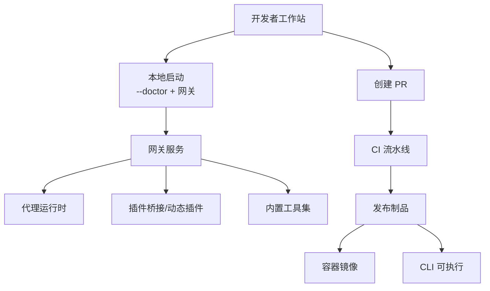
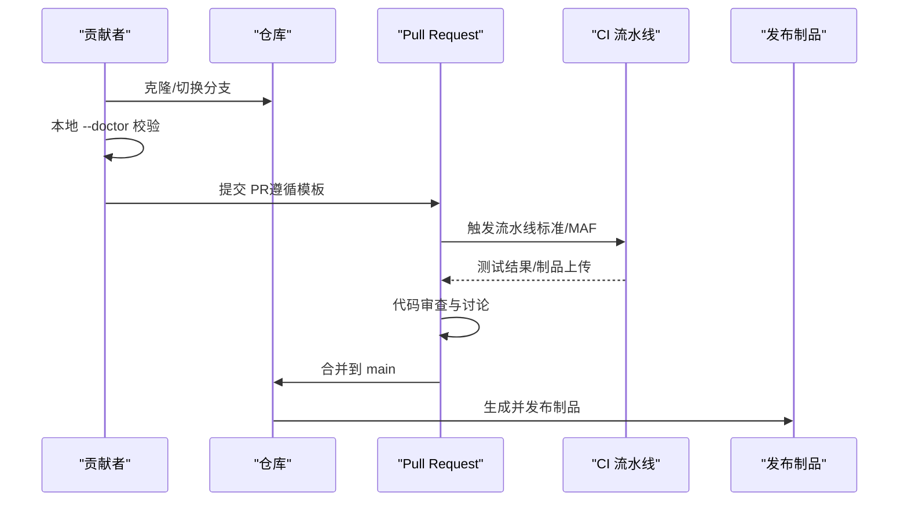
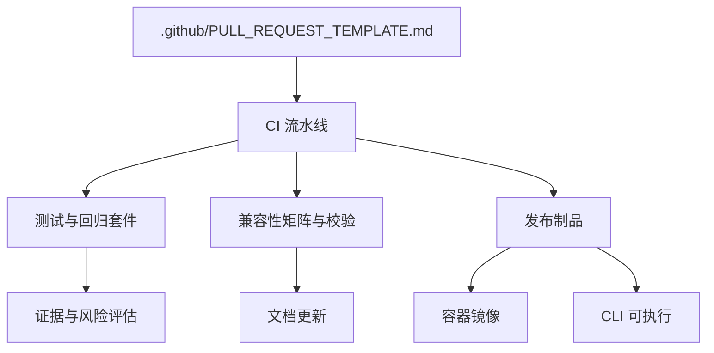

# 贡献流程

<cite>
**本文引用的文件**
- [README.md](file://README.md)
- [.github/PULL_REQUEST_TEMPLATE.md](file://.github/PULL_REQUEST_TEMPLATE.md)
- [COMPATIBILITY.md](file://COMPATIBILITY.md)
- [docs/COMPATIBILITY.md](file://docs/COMPATIBILITY.md)
- [QUICKSTART.md](file://QUICKSTART.md)
- [Directory.Build.props](file://Directory.Build.props)
- [src/OpenClaw.Cli/SetupLifecycleCommand.cs](file://src/OpenClaw.Cli/SetupLifecycleCommand.cs)
- [src/OpenClaw.Gateway/Tools/EmitArtifactTool.cs](file://src/OpenClaw.Gateway/Tools/EmitArtifactTool.cs)
- [src/OpenClaw.Tests/HarnessRegressionTests.cs](file://src/OpenClaw.Tests/HarnessRegressionTests.cs)
- [src/OpenClaw.Tests/EvidenceBundleTests.cs](file://src/OpenClaw.Tests/EvidenceBundleTests.cs)
- [src/OpenClaw.Core/Validation/ConfigValidator.cs](file://src/OpenClaw.Core/Validation/ConfigValidator.cs)
- [src/OpenClaw.Gateway/ChannelReadinessEvaluator.cs](file://src/OpenClaw.Gateway/ChannelReadinessEvaluator.cs)
- [src/OpenClaw.Core/Models/AdminApiModels.cs](file://src/OpenClaw.Core/Models/AdminApiModels.cs)
</cite>

## 目录
1. [简介](#简介)
2. [项目结构](#项目结构)
3. [核心组件](#核心组件)
4. [架构总览](#架构总览)
5. [详细组件分析](#详细组件分析)
6. [依赖分析](#依赖分析)
7. [性能考虑](#性能考虑)
8. [故障排查指南](#故障排查指南)
9. [结论](#结论)
10. [附录](#附录)

## 简介
本指南面向 OpenClaw.NET 的贡献者，系统说明从本地开发到 Pull Request（PR）提交、代码审查、合并与发布的完整流程；涵盖分支策略、PR 规范、兼容性与向后兼容性保障、破坏性变更处理、文档与测试要求、发布准备以及新贡献者的入门路径与社区协作方式。

## 项目结构
仓库采用多项目解决方案组织，核心模块包括网关、代理运行时、CLI、仪表盘、支付、技能包与测试等。贡献流程围绕以下关键点展开：本地快速启动、配置校验、插件兼容性、测试与回归、发布产物生成与验证。

图表来源
- [README.md: 651-670:651-670](file://README.md#L651-L670)
- [QUICKSTART.md: 10-52:10-52](file://QUICKSTART.md#L10-L52)

章节来源
- [README.md: 125-138:125-138](file://README.md#L125-L138)
- [QUICKSTART.md: 1-190:1-190](file://QUICKSTART.md#L1-L190)

## 核心组件
- 本地启动与验证
  - 使用 doctor 模式在启动前进行配置与安全校验，避免暴露公网绑定风险。
  - 支持 AOT/JIT 运行模式选择，按需启用扩展能力。
- 插件兼容性与诊断
  - 明确区分 AOT/JIT 能力矩阵，不支持的表面在加载阶段即失败并输出诊断。
  - 支持 TS 插件通过 jiti 解析，缺失时明确报错。
- 测试与回归
  - 提供测试命令与回归套件，支持严格模式与分类筛选。
  - 证据与风险评估模型用于质量门禁与审计。
- 发布与部署
  - 通过 CLI 命令生成部署制品，支持多平台与多架构打包。
  - Docker 多架构镜像构建与推送，配合生产环境加固清单。

章节来源
- [README.md: 651-670:651-670](file://README.md#L651-L670)
- [COMPATIBILITY.md: 11-29:11-29](file://COMPATIBILITY.md#L11-L29)
- [docs/COMPATIBILITY.md: 11-29:11-29](file://docs/COMPATIBILITY.md#L11-L29)
- [src/OpenClaw.Cli/SetupLifecycleCommand.cs: 77-110:77-110](file://src/OpenClaw.Cli/SetupLifecycleCommand.cs#L77-L110)
- [src/OpenClaw.Gateway/Tools/EmitArtifactTool.cs: 133-159:133-159](file://src/OpenClaw.Gateway/Tools/EmitArtifactTool.cs#L133-L159)

## 架构总览
下图展示贡献流程的关键节点：本地验证、PR 规范、CI、制品与发布。

图表来源
- [README.md: 651-657:651-657](file://README.md#L651-L657)
- [.github/PULL_REQUEST_TEMPLATE.md: 1-47:1-47](file://.github/PULL_REQUEST_TEMPLATE.md#L1-L47)

## 详细组件分析

### 分支策略与工作流
- 主分支
  - main：稳定基线，仅接受通过 CI 的 PR 合并。
- 功能分支
  - 建议以功能或修复命名，如 feature/xxx、fix/xxx。
- 合并与保护
  - 保护规则建议：需要 CI 通过、审查批准、无直接推送等。
- 本地验证
  - 在提交 PR 前务必运行 doctor 检查，确保配置与安全项通过。

章节来源
- [README.md: 651-657:651-657](file://README.md#L651-L657)
- [QUICKSTART.md: 41-46:41-46](file://QUICKSTART.md#L41-L46)

### Pull Request 规范
- 必填信息
  - 变更概要、影响范围（producer/runtime/both）、主题/合约路径。
- 作用域勾选
  - 明确是否涉及模板/索引/投影/解析器行为/文档等。
- Schema 边界检查
  - 明确分类为 producer/runtime/both，并核对对应 schema 基线。
- 验证清单
  - 针对不同变更运行相应验证脚本（切片/投影/合约索引/文档）。
- 运行时消费确认
  - 确认字段被 SkillLoader/SkillProjectionResolver 实际使用，避免 schema 允许但未消费的歧义。
- 文档更新
  - 若使用边界变化，同步更新入口文档与迁移清单。
- Notes 区域
  - 记录已执行命令、潜在风险与后续工作。

章节来源
- [.github/PULL_REQUEST_TEMPLATE.md: 1-47:1-47](file://.github/PULL_REQUEST_TEMPLATE.md#L1-L47)

### 代码审查流程与合并要求
- 审查要点
  - 兼容性矩阵与 AOT/JIT 能力边界；TS 插件 jiti 依赖；配置 schema 关键字支持。
  - 安全与诊断：非回环绑定的加固、通道就绪性评估、错误与告警指引。
  - 测试覆盖：回归测试、严格模式、证据与风险评估。
- 合并条件
  - CI 通过、审查批准、满足兼容性与文档更新要求。
- 冲突解决
  - 优先通过 rebase/squash 合并，保持提交历史清晰；必要时通过讨论与修订解决分歧。

章节来源
- [COMPATIBILITY.md: 11-29:11-29](file://COMPATIBILITY.md#L11-L29)
- [docs/COMPATIBILITY.md: 11-29:11-29](file://docs/COMPATIBILITY.md#L11-L29)
- [src/OpenClaw.Core/Validation/ConfigValidator.cs: 322-377:322-377](file://src/OpenClaw.Core/Validation/ConfigValidator.cs#L322-L377)
- [src/OpenClaw.Gateway/ChannelReadinessEvaluator.cs: 263-294:263-294](file://src/OpenClaw.Gateway/ChannelReadinessEvaluator.cs#L263-L294)
- [src/OpenClaw.Tests/HarnessRegressionTests.cs: 225-262:225-262](file://src/OpenClaw.Tests/HarnessRegressionTests.cs#L225-L262)
- [src/OpenClaw.Tests/EvidenceBundleTests.cs: 247-289:247-289](file://src/OpenClaw.Tests/EvidenceBundleTests.cs#L247-L289)

### 兼容性保证与向后兼容性检查
- 运行时模式
  - aot：严格低内存兼容；jit：扩展桥接与动态插件能力；auto：根据动态代码可用性自动选择。
- 桥接矩阵
  - registerTool/registerService：aot/jit 均支持。
  - registerChannel/registerCommand/registerProvider/api.on：仅 jit 支持。
  - 不支持表面：registerGatewayMethod/registerCli，加载阶段失败并给出兼容性代码。
- 配置 schema 子集
  - 支持 type/properties/required/items/enum/oneOf/anyOf 等关键字；不支持关键字将被拒绝。
- 自动化证明
  - 桥接与原生动态插件的集成测试覆盖；公共烟雾清单验证主流包与拒绝场景。

章节来源
- [COMPATIBILITY.md: 5-10:5-10](file://COMPATIBILITY.md#L5-L10)
- [COMPATIBILITY.md: 11-39:11-39](file://COMPATIBILITY.md#L11-L39)
- [COMPATIBILITY.md: 61-94:61-94](file://COMPATIBILITY.md#L61-L94)
- [COMPATIBILITY.md: 95-119:95-119](file://COMPATIBILITY.md#L95-L119)
- [docs/COMPATIBILITY.md: 5-10:5-10](file://docs/COMPATIBILITY.md#L5-L10)
- [docs/COMPATIBILITY.md: 11-49:11-49](file://docs/COMPATIBILITY.md#L11-L49)
- [docs/COMPATIBILITY.md: 72-94:72-94](file://docs/COMPATIBILITY.md#L72-L94)
- [docs/COMPATIBILITY.md: 105-131:105-131](file://docs/COMPATIBILITY.md#L105-L131)

### 破坏性变更处理
- 识别与评估
  - 任何可能影响上游插件或运行时行为的变更均视为潜在破坏性变更。
  - 通过兼容性矩阵与自动化测试进行评估。
- 通知与迁移
  - 在 PR 中明确破坏性变更说明与迁移步骤；必要时提供迁移清单。
- 回滚与降级
  - 保留兼容性诊断与降级路径，确保失败时可明确提示而非静默降级。

章节来源
- [COMPATIBILITY.md: 85-104:85-104](file://COMPATIBILITY.md#L85-L104)
- [docs/COMPATIBILITY.md: 96-104:96-104](file://docs/COMPATIBILITY.md#L96-L104)

### 文档更新要求
- 入口文档
  - 当使用边界变化时，至少更新一个入口文档。
- 迁移清单
  - 若变更涉及 schema 边界工作流，检查并更新迁移清单。
- 合同/投影文档
  - 若运行时合约行为变更，检查是否需要更新相关文档。

章节来源
- [.github/PULL_REQUEST_TEMPLATE.md: 37-42:37-42](file://.github/PULL_REQUEST_TEMPLATE.md#L37-L42)

### 测试覆盖要求
- 测试命令与回归
  - 使用测试命令运行指定分类与严格模式，确保关键路径通过。
- 证据与风险评估
  - 使用证据包模型记录测试总结、风险、假设、未测试区域与人工评审意见。
- 配置与通道校验
  - 配置校验器与通道就绪性评估器提供结构化错误与修复指引。

章节来源
- [src/OpenClaw.Tests/HarnessRegressionTests.cs: 225-262:225-262](file://src/OpenClaw.Tests/HarnessRegressionTests.cs#L225-L262)
- [src/OpenClaw.Tests/EvidenceBundleTests.cs: 247-289:247-289](file://src/OpenClaw.Tests/EvidenceBundleTests.cs#L247-L289)
- [src/OpenClaw.Core/Validation/ConfigValidator.cs: 322-377:322-377](file://src/OpenClaw.Core/Validation/ConfigValidator.cs#L322-L377)
- [src/OpenClaw.Gateway/ChannelReadinessEvaluator.cs: 263-294:263-294](file://src/OpenClaw.Gateway/ChannelReadinessEvaluator.cs#L263-L294)

### 发布准备工作
- 制品生成
  - 使用 CLI 命令生成部署制品，输出到目标目录并列出产物。
- 艺术品变体
  - 标准与 OpenSandbox 特性变体，通过构建属性控制中间输出路径。
- 容器镜像
  - 多架构构建与推送，结合生产加固清单与域名配置。

章节来源
- [src/OpenClaw.Cli/SetupLifecycleCommand.cs: 77-110:77-110](file://src/OpenClaw.Cli/SetupLifecycleCommand.cs#L77-L110)
- [Directory.Build.props: 27-32:27-32](file://Directory.Build.props#L27-L32)
- [README.md: 405-516:405-516](file://README.md#L405-L516)

### 新贡献者入门指南
- 快速开始
  - 设置模型密钥与可选工作区，选择运行时模式，先运行 doctor 再启动网关。
- 推荐本地工作流
  - 先 doctor，再启动，交互用浏览器 UI/桌面配套，脚本用 CLI，仅在需要时启用 jit。
- 本地启动与端点
  - 默认 Web UI、WebSocket、健康检查端点，便于快速验证。

章节来源
- [QUICKSTART.md: 10-52:10-52](file://QUICKSTART.md#L10-L52)
- [QUICKSTART.md: 177-184:177-184](file://QUICKSTART.md#L177-L184)
- [README.md: 198-246:198-246](file://README.md#L198-L246)

### 社区行为准则与沟通渠道
- 行为准则
  - 尊重与包容，禁止骚扰与歧视；鼓励建设性反馈与协作。
- 沟通渠道
  - 通过 Issues/PRs 进行技术讨论；在 PR 中遵循模板与清单。
  - 重大变更建议先开 Issue 讨论，再提交 PR。

章节来源
- [.github/PULL_REQUEST_TEMPLATE.md: 1-47:1-47](file://.github/PULL_REQUEST_TEMPLATE.md#L1-L47)

### 问题报告与功能请求
- 问题报告
  - 提供最小复现步骤、期望与实际行为、环境信息（运行时模式、版本、配置片段）。
- 功能请求
  - 描述使用场景、收益与可能的影响面；若涉及兼容性，附上兼容性矩阵与风险评估。

章节来源
- [README.md: 658-668:658-668](file://README.md#L658-L668)

## 依赖分析
贡献流程中的关键依赖关系如下：

图表来源
- [.github/PULL_REQUEST_TEMPLATE.md: 1-47:1-47](file://.github/PULL_REQUEST_TEMPLATE.md#L1-47)
- [README.md: 651-657:651-657](file://README.md#L651-L657)
- [src/OpenClaw.Tests/HarnessRegressionTests.cs: 225-262:225-262](file://src/OpenClaw.Tests/HarnessRegressionTests.cs#L225-L262)
- [src/OpenClaw.Tests/EvidenceBundleTests.cs: 247-289:247-289](file://src/OpenClaw.Tests/EvidenceBundleTests.cs#L247-L289)
- [COMPATIBILITY.md: 11-29:11-29](file://COMPATIBILITY.md#L11-L29)
- [src/OpenClaw.Cli/SetupLifecycleCommand.cs: 77-110:77-110](file://src/OpenClaw.Cli/SetupLifecycleCommand.cs#L77-L110)

章节来源
- [README.md: 651-657:651-657](file://README.md#L651-L657)
- [COMPATIBILITY.md: 11-29:11-29](file://COMPATIBILITY.md#L11-L29)

## 性能考虑
- 本地验证前置：通过 doctor 提前发现配置与安全问题，减少无效尝试。
- 运行时模式选择：AOT 更适合轻量部署，JIT 用于需要扩展能力的场景。
- 测试分层：回归测试与证据评估双轨并行，降低缺陷逃逸风险。

## 故障排查指南
- 配置与通道就绪性
  - 使用配置校验器与通道就绪性评估器定位缺失项与告警，按指引修复。
- 插件兼容性
  - 若出现兼容性失败码，对照兼容性矩阵调整运行时模式或插件实现。
- 文档与证据
  - 在 PR 的 Notes 区域记录已执行命令与后续工作，便于复现与追踪。

章节来源
- [src/OpenClaw.Core/Validation/ConfigValidator.cs: 322-377:322-377](file://src/OpenClaw.Core/Validation/ConfigValidator.cs#L322-L377)
- [src/OpenClaw.Gateway/ChannelReadinessEvaluator.cs: 263-294:263-294](file://src/OpenClaw.Gateway/ChannelReadinessEvaluator.cs#L263-L294)
- [COMPATIBILITY.md: 85-104:85-104](file://COMPATIBILITY.md#L85-L104)
- [.github/PULL_REQUEST_TEMPLATE.md: 43-47:43-47](file://.github/PULL_REQUEST_TEMPLATE.md#L43-L47)

## 结论
本指南将 OpenClaw.NET 的贡献流程标准化为“本地验证—PR 规范—CI—审查—合并—发布”的闭环。通过兼容性矩阵、自动化测试与证据评估，确保变更在功能、安全与可维护性方面均达到预期；通过明确的文档与发布准备流程，保障交付质量与可追溯性。

## 附录
- 术语
  - AOT：NativeAOT 部署路径，强调裁剪与低内存占用。
  - JIT：动态代码支持路径，扩展桥接与动态插件能力。
- 参考
  - 快速开始与本地启动路径参考：[QUICKSTART.md](file://QUICKSTART.md)
  - CI/CD 与发布参考：[README.md](file://README.md)
  - 兼容性矩阵与自动化证明参考：[COMPATIBILITY.md](file://COMPATIBILITY.md)、[docs/COMPATIBILITY.md](file://docs/COMPATIBILITY.md)