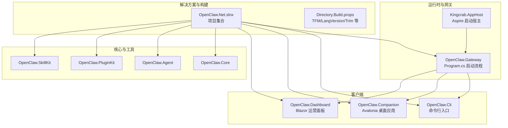
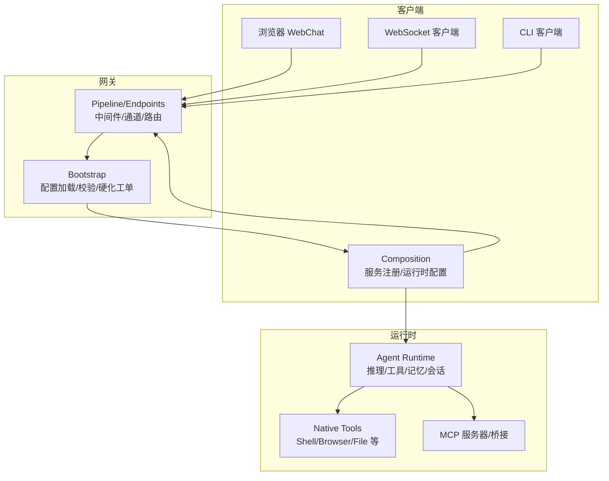
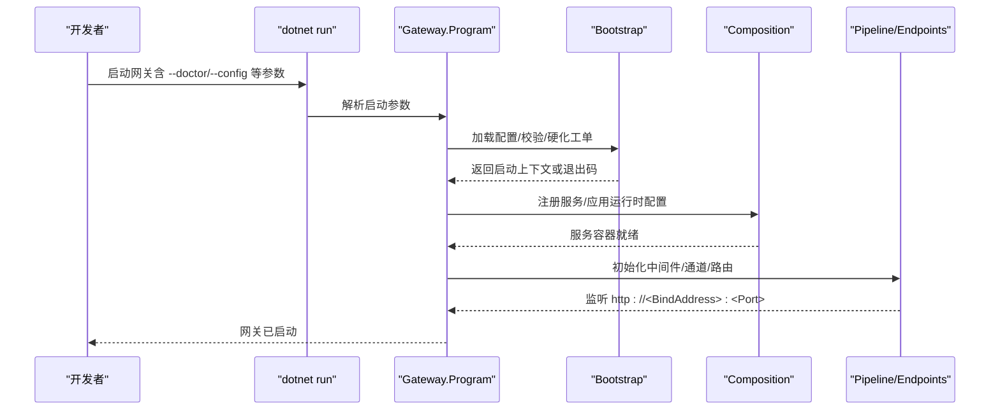
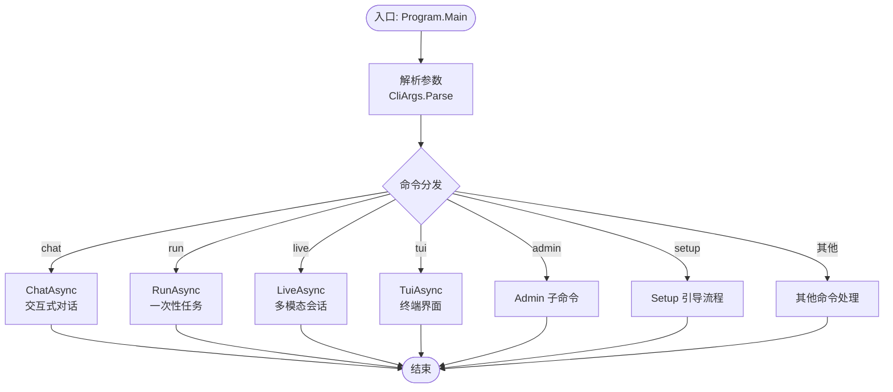

# 快速开始

<cite>
**本文引用的文件**
- [README.md](file://README.md)
- [QUICKSTART.md](file://QUICKSTART.md)
- [Directory.Build.props](file://Directory.Build.props)
- [OpenClaw.Net.slnx](file://OpenClaw.Net.slnx)
- [Kingcrab.AppHost.csproj](file://Kingcrab.AppHost/Kingcrab.AppHost.csproj)
- [appsettings.Development.json](file://Kingcrab.AppHost/appsettings.Development.json)
- [appsettings.json](file://src/OpenClaw.Gateway/appsettings.json)
- [Program.cs（网关）](file://src/OpenClaw.Gateway/Program.cs)
- [Program.cs（CLI）](file://src/OpenClaw.Cli/Program.cs)
- [Program.cs（Companion）](file://src/OpenClaw.Companion/Program.cs)
- [App.axaml.cs（Companion）](file://src/OpenClaw.Companion/App.axaml.cs)
- [CliArgs.cs（CLI 参数解析）](file://src/OpenClaw.Cli/CliArgs.cs)
- [docs/QUICKSTART.md](file://docs/QUICKSTART.md)
- [docs/USER_GUIDE.md](file://docs/USER_GUIDE.md)
</cite>

## 目录
1. [简介](#简介)
2. [项目结构](#项目结构)
3. [核心组件](#核心组件)
4. [架构总览](#架构总览)
5. [详细组件分析](#详细组件分析)
6. [依赖关系分析](#依赖关系分析)
7. [性能与运行模式](#性能与运行模式)
8. [故障排除指南](#故障排除指南)
9. [结论](#结论)
10. [附录](#附录)

## 简介
本“快速开始”指南面向希望从零到一在本地运行 OpenClaw.NET 的开发者与运维人员。内容覆盖环境准备、安装配置、基础使用示例，并提供多客户端入口（Web UI、CLI、桌面应用）。同时给出常见问题与故障排除建议，帮助你在最短时间内完成部署与验证。

## 项目结构
OpenClaw.NET 采用多项目分层组织，核心由“网关（Gateway）+ 客户端（CLI/Companion/Dashboard）+ 运行时（Agent/Runtime）+ 插件与工具（Plugins/Tools）+ 配置与启动（Bootstrap/Composition/Pipeline）”构成。解决方案文件与构建属性统一了目标框架、语言版本与打包策略。

图示来源
- [OpenClaw.Net.slnx:1-43](file://OpenClaw.Net.slnx#L1-L43)
- [Directory.Build.props:1-41](file://Directory.Build.props#L1-L41)
- [Kingcrab.AppHost.csproj:1-28](file://Kingcrab.AppHost/Kingcrab.AppHost.csproj#L1-L28)
- [Program.cs（网关）:1-124](file://src/OpenClaw.Gateway/Program.cs#L1-L124)

章节来源
- [OpenClaw.Net.slnx:1-43](file://OpenClaw.Net.slnx#L1-L43)
- [Directory.Build.props:1-41](file://Directory.Build.props#L1-L41)
- [Kingcrab.AppHost.csproj:1-28](file://Kingcrab.AppHost/Kingcrab.AppHost.csproj#L1-L28)

## 核心组件
- 网关（Gateway）
  - 负责 HTTP/WebSocket/集成 API/MCP 等入口，内置安全、速率限制、可观测性与启动恢复机制。
  - 支持两种运行模式：AOT（裁剪友好）与 JIT（扩展兼容），默认 JIT。
- CLI
  - 提供 chat/run/live/tui/admin 等子命令，支持 OpenAI 兼容请求、流式输出、图像/文件附件等。
- Companion（桌面应用）
  - 基于 Avalonia 的跨平台桌面伴侣，可连接网关、管理本地网关生命周期、审批轮询等。
- Dashboard（Blazor 运营面板）
  - 提供运营仪表盘页面与相关服务，便于查看状态与执行管理操作。
- Core/Agent/PluginKit/SkillKit
  - 核心抽象与运行时能力，插件与技能生态的基础库。

章节来源
- [README.md:31-40](file://README.md#L31-L40)
- [Program.cs（网关）:1-124](file://src/OpenClaw.Gateway/Program.cs#L1-L124)
- [Program.cs（CLI）:1-800](file://src/OpenClaw.Cli/Program.cs#L1-L800)
- [Program.cs（Companion）:1-22](file://src/OpenClaw.Companion/Program.cs#L1-L22)
- [App.axaml.cs（Companion）:1-78](file://src/OpenClaw.Companion/App.axaml.cs#L1-L78)

## 架构总览
下图展示从客户端到网关、再到运行时与工具的典型交互路径，以及启动阶段的分层职责。

图示来源
- [README.md:145-197](file://README.md#L145-L197)
- [Program.cs（网关）:42-98](file://src/OpenClaw.Gateway/Program.cs#L42-L98)

章节来源
- [README.md:145-197](file://README.md#L145-L197)
- [Program.cs（网关）:42-98](file://src/OpenClaw.Gateway/Program.cs#L42-L98)

## 详细组件分析

### 环境准备与安装
- .NET SDK
  - 使用 .NET 10 目标框架；启用严格警告、内联全球化、NativeAOT 裁剪等构建选项。
- 可选：Node.js 20+
  - 若需要上游风格的 TS/JS 插件支持，需安装 Node.js 20+。
- 开发体验（可选）
  - Aspire 应用主机用于本地组合网关、CLI、Companion 启动。

章节来源
- [Directory.Build.props:1-41](file://Directory.Build.props#L1-L41)
- [Kingcraw.AppHost.csproj:1-28](file://Kingcrab.AppHost/Kingcrab.AppHost.csproj#L1-L28)
- [QUICKSTART.md:5-9](file://QUICKSTART.md#L5-L9)

### 环境变量与配置要点
- API 密钥
  - MODEL_PROVIDER_KEY：模型提供商密钥（推荐通过环境变量注入）。
  - 可选：MODEL_PROVIDER_ENDPOINT（代理或自建端点）。
- 认证与绑定
  - OPENCLAW_AUTH_TOKEN：非回环绑定时必须设置。
  - OPENCLAW_BASE_URL：CLI 默认访问地址（默认 http://127.0.0.1:18789）。
- 工作空间
  - OPENCLAW_WORKSPACE：文件工具与工作区技能目录。
- 运行模式
  - OpenClaw__Runtime__Mode：aot/jit/auto，默认 jit。
- 配置文件
  - --config 或 OPENCLAW_CONFIG_PATH：指向外部 JSON 配置文件。
- 开发日志
  - Aspire 开发环境日志级别可在 appsettings.Development.json 中调整。

章节来源
- [README.md:204-223](file://README.md#L204-L223)
- [docs/USER_GUIDE.md:25-40](file://docs/USER_GUIDE.md#L25-L40)
- [appsettings.Development.json:1-9](file://Kingcrab.AppHost/appsettings.Development.json#L1-L9)

### 启动与验证（本地）
- 最短路径
  1) 设置 MODEL_PROVIDER_KEY（与可选 OPENCLAW_WORKSPACE）
  2) 可选：设置 OpenClaw__Runtime__Mode=aot 或 jit
  3) 运行网关前先 --doctor 校验配置
  4) dotnet run --project src/OpenClaw.Gateway -c Release 启动
- 默认端点
  - Web UI: http://127.0.0.1:18789/chat
  - WebSocket: ws://127.0.0.1:18789/ws
  - 健康检查: http://127.0.0.1:18789/health
- CLI 与桌面应用
  - CLI: dotnet run --project src/OpenClaw.Cli -c Release -- chat
  - Companion: dotnet run --project src/OpenClaw.Companion -c Release

章节来源
- [QUICKSTART.md:10-58](file://QUICKSTART.md#L10-L58)
- [docs/QUICKSTART.md:10-66](file://docs/QUICKSTART.md#L10-L66)
- [README.md:198-246](file://README.md#L198-L246)

### CLI 使用示例
- 交互式聊天
  - openclaw chat
- 单次任务
  - openclaw run "summarize this README" --file ./README.md
- 流式输出
  - openclaw run "<prompt>" --no-stream 关闭流式
- Live 多模态
  - openclaw live --provider gemini --model gemini-2.0-flash-live-001
- TUI
  - openclaw tui（若可用）

章节来源
- [Program.cs（CLI）:481-662](file://src/OpenClaw.Cli/Program.cs#L481-L662)
- [docs/QUICKSTART.md:77-94](file://docs/QUICKSTART.md#L77-L94)

### 桌面 Companion（Avalonia）
- 启动
  - dotnet run --project src/OpenClaw.Companion -c Release
- 认证与存储
  - 非回环绑定时需在网关设置 OPENCLAW_AUTH_TOKEN，并在 Companion 中输入相同令牌。
  - “记住”选项会持久化令牌至系统应用数据目录的 settings.json。

章节来源
- [README.md:247-255](file://README.md#L247-L255)
- [Program.cs（Companion）:1-22](file://src/OpenClaw.Companion/Program.cs#L1-L22)
- [App.axaml.cs（Companion）:1-78](file://src/OpenClaw.Companion/App.axaml.cs#L1-L78)

### 网关启动流程（代码级）

图示来源
- [Program.cs（网关）:14-98](file://src/OpenClaw.Gateway/Program.cs#L14-L98)

章节来源
- [Program.cs（网关）:14-98](file://src/OpenClaw.Gateway/Program.cs#L14-L98)

### CLI 参数解析与命令分发

图示来源
- [Program.cs（CLI）:12-69](file://src/OpenClaw.Cli/Program.cs#L12-L69)
- [CliArgs.cs（CLI 参数解析）:1-98](file://src/OpenClaw.Cli/CliArgs.cs#L1-L98)

章节来源
- [Program.cs（CLI）:12-69](file://src/OpenClaw.Cli/Program.cs#L12-L69)
- [CliArgs.cs（CLI 参数解析）:1-98](file://src/OpenClaw.Cli/CliArgs.cs#L1-L98)

## 依赖关系分析
- 项目依赖
  - OpenClaw.Gateway 作为核心宿主，依赖 Core/Agent/PluginKit/SkillKit 等库。
  - Kingcrab.AppHost 组合 Gateway、CLI、Companion，便于本地一体化调试。
- 运行时模式
  - 通过 OpenClaw:Runtime:Mode 控制 aot/jit/auto；不同模式影响桥接能力与动态插件加载。
- 配置与环境
  - appsettings.json 提供默认值；可通过 --config 或 OPENCLAW_CONFIG_PATH 外部化配置。
  - 环境变量优先级高于配置文件，适合注入密钥与端点。

章节来源
- [OpenClaw.Net.slnx:7-31](file://OpenClaw.Net.slnx#L7-L31)
- [appsettings.json:1-908](file://src/OpenClaw.Gateway/appsettings.json#L1-L908)
- [docs/USER_GUIDE.md:18-24](file://docs/USER_GUIDE.md#L18-L24)

## 性能与运行模式
- 运行模式选择
  - aot：裁剪友好、内存占用低，适合主流部署。
  - jit：扩展兼容性强，支持 registerChannel/registerCommand/registerProvider/api.on 等动态表面。
  - auto：根据运行时能力自动选择。
- 生产建议
  - 在非回环绑定前务必设置 OPENCLAW_AUTH_TOKEN 并启用 TLS。
  - 合理配置速率限制、会话配额与工具根目录白名单，降低风险。

章节来源
- [README.md:190-246](file://README.md#L190-L246)
- [docs/USER_GUIDE.md:103-122](file://docs/USER_GUIDE.md#L103-L122)

## 故障排除指南
- 启动失败
  - 使用 --doctor 先行诊断；必要时尝试 --quickstart（交互式快速启动）。
  - 查看 /doctor/text（WebChat Doctor 按钮）或 openclaw admin posture 获取运行姿态报告。
- 非回环绑定报错
  - 未设置 OPENCLAW_AUTH_TOKEN 或 AllowQueryStringToken 为 false，导致认证失败。
- 网络与代理
  - 如使用反向代理（Nginx/Caddy/Tailscale），确保 TrustForwardedHeaders 与 KnownProxies 正确配置。
- CLI 无法连接
  - 确认 OPENCLAW_BASE_URL 与 OPENCLAW_AUTH_TOKEN；或在命令中显式传入 --url 与 --token。
- 工具权限与安全
  - 若暴露公网，建议关闭 AllowShell、限制 AllowedReadRoots/AllowedWriteRoots、开启审批策略。

章节来源
- [README.md:277-324](file://README.md#L277-L324)
- [docs/QUICKSTART.md:41-58](file://docs/QUICKSTART.md#L41-L58)
- [docs/USER_GUIDE.md:169-196](file://docs/USER_GUIDE.md#L169-L196)

## 结论
通过本指南，你可以在本地快速拉起 OpenClaw.NET，使用 Web UI、CLI 与桌面应用进行交互，并按需切换运行模式与安全策略。建议在首次对外暴露前，先以 --doctor 与 admin posture 完成安全与配置校验，再结合 Docker/Aspire 进行生产化部署。

## 附录
- 快速命令清单
  - dotnet run --project src/OpenClaw.Gateway -c Release -- --doctor
  - dotnet run --project src/OpenClaw.Gateway -c Release
  - dotnet run --project src/OpenClaw.Cli -c Release -- chat
  - dotnet run --project src/OpenClaw.Companion -c Release
- 常用端点
  - Web UI: http://127.0.0.1:18789/chat
  - WebSocket: ws://127.0.0.1:18789/ws
  - 健康检查: http://127.0.0.1:18789/health

章节来源
- [docs/QUICKSTART.md:59-66](file://docs/QUICKSTART.md#L59-L66)
- [README.md:225-246](file://README.md#L225-L246)