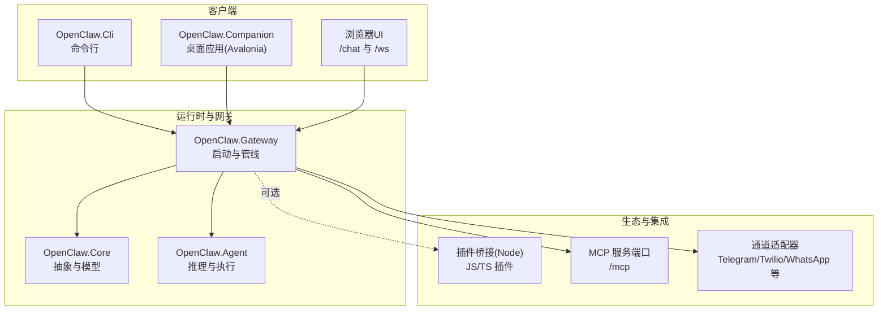
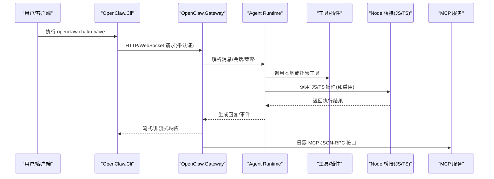
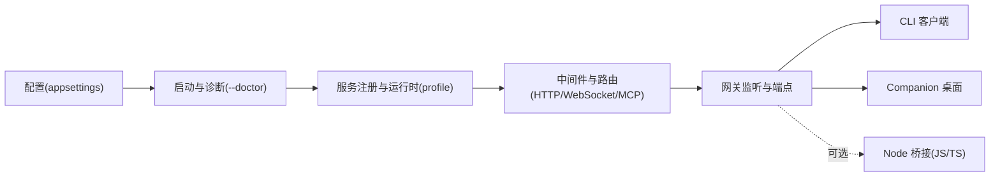

# 快速开始

<cite>
**本文引用的文件**
- [README.md](file://README.md)
- [QUICKSTART.md](file://QUICKSTART.md)
- [docs/QUICKSTART.md](file://docs/QUICKSTART.md)
- [docs/USER_GUIDE.md](file://docs/USER_GUIDE.md)
- [src/OpenClaw.Gateway/Program.cs](file://src/OpenClaw.Gateway/Program.cs)
- [src/OpenClaw.Gateway/appsettings.json](file://src/OpenClaw.Gateway/appsettings.json)
- [src/OpenClaw.Gateway/appsettings.Production.json](file://src/OpenClaw.Gateway/appsettings.Production.json)
- [src/OpenClaw.Cli/Program.cs](file://src/OpenClaw.Cli/Program.cs)
- [src/OpenClaw.Companion/Program.cs](file://src/OpenClaw.Companion/Program.cs)
- [Dockerfile](file://Dockerfile)
- [docker-compose.yml](file://docker-compose.yml)
- [Kingcrab.AppHost/appsettings.json](file://Kingcrab.AppHost/appsettings.json)
- [Kingcrab.AppHost/appsettings.Development.json](file://Kingcrab.AppHost/appsettings.Development.json)
</cite>

## 目录
1. [简介](#简介)
2. [项目结构](#项目结构)
3. [核心组件](#核心组件)
4. [架构总览](#架构总览)
5. [详细组件分析](#详细组件分析)
6. [依赖关系分析](#依赖关系分析)
7. [性能考虑](#性能考虑)
8. [故障排除指南](#故障排除指南)
9. [结论](#结论)
10. [附录](#附录)

## 简介
本指南面向首次接触 OpenClaw.NET 的用户，帮助你在最短时间内完成本地环境准备、API 密钥配置、网关启动与客户端使用，并覆盖 Docker 部署与常见问题排查。你将学会：
- 在本地以最少步骤启动网关并进行交互
- 使用 Web UI、CLI、桌面应用等多种方式体验核心能力
- 配置 API 密钥与运行时模式（AOT/JIT）
- 通过 Docker 进行容器化部署与自动 TLS
- 定位常见问题并进行快速修复

## 项目结构
OpenClaw.NET 采用多项目解决方案，核心模块包括：
- 网关（Gateway）：HTTP/WebSocket/MCP/通道接入与安全策略
- CLI：命令行交互与自动化脚本入口
- Companion：Avalonia 桌面应用
- Core/Agent/Plugins/SkillKit 等：运行时、工具、技能与生态兼容层
- 文档与示例：快速开始、用户指南、安全指南等

图表来源
- [src/OpenClaw.Gateway/Program.cs:1-124](file://src/OpenClaw.Gateway/Program.cs#L1-L124)
- [src/OpenClaw.Cli/Program.cs:1-2129](file://src/OpenClaw.Cli/Program.cs#L1-L2129)
- [src/OpenClaw.Companion/Program.cs:1-22](file://src/OpenClaw.Companion/Program.cs#L1-L22)

章节来源
- [README.md:31-670](file://README.md#L31-L670)
- [docs/QUICKSTART.md:1-166](file://docs/QUICKSTART.md#L1-L166)

## 核心组件
- 网关启动与管线
  - 启动参数解析、配置加载、安全加固与诊断报告
  - 服务注册、运行时配置（AOT/JIT）、MCP/通道/后端/安全中间件装配
  - 监听绑定地址与端口，暴露 HTTP/WebSocket/MCP/管理端点
- CLI 客户端
  - 支持 chat/run/live/tui/insights/setup 等子命令
  - 统一的认证令牌与基础 URL 环境变量支持
- 桌面 Companion
  - Avalonia 跨平台桌面应用，连接本地网关
- 配置系统
  - appsettings.json（默认开发配置）与 appsettings.Production.json（生产安全默认）
  - Dockerfile 与 docker-compose.yml 提供容器化部署与自动 TLS

章节来源
- [src/OpenClaw.Gateway/Program.cs:1-124](file://src/OpenClaw.Gateway/Program.cs#L1-L124)
- [src/OpenClaw.Cli/Program.cs:1-2129](file://src/OpenClaw.Cli/Program.cs#L1-L2129)
- [src/OpenClaw.Companion/Program.cs:1-22](file://src/OpenClaw.Companion/Program.cs#L1-L22)
- [src/OpenClaw.Gateway/appsettings.json:1-908](file://src/OpenClaw.Gateway/appsettings.json#L1-L908)
- [src/OpenClaw.Gateway/appsettings.Production.json:1-65](file://src/OpenClaw.Gateway/appsettings.Production.json#L1-L65)
- [Dockerfile:1-59](file://Dockerfile#L1-L59)
- [docker-compose.yml:1-68](file://docker-compose.yml#L1-L68)

## 架构总览
下图展示了从客户端到网关再到运行时与工具的交互路径，以及可选的插件桥接与 MCP 服务。

图表来源
- [src/OpenClaw.Cli/Program.cs:1-2129](file://src/OpenClaw.Cli/Program.cs#L1-L2129)
- [src/OpenClaw.Gateway/Program.cs:1-124](file://src/OpenClaw.Gateway/Program.cs#L1-L124)

## 详细组件分析

### 环境准备与 .NET SDK 要求
- .NET 10 SDK：用于本地编译与运行
- 可选：Node.js 20+（启用上游 TS/JS 插件桥接时需要）

章节来源
- [docs/QUICKSTART.md:5-9](file://docs/QUICKSTART.md#L5-L9)
- [README.md:198-224](file://README.md#L198-L224)

### API 密钥与运行时模式配置
- 设置模型提供商密钥（推荐使用环境变量 MODEL_PROVIDER_KEY）
- 可选工作空间：OPENCLAW_WORKSPACE
- 运行时模式：OpenClaw__Runtime__Mode=aot/jit/auto
- 生产安全默认：appsettings.Production.json 中对公开绑定做了严格限制（如禁用插件桥、限制工具权限等）

章节来源
- [docs/QUICKSTART.md:12-45](file://docs/QUICKSTART.md#L12-L45)
- [src/OpenClaw.Gateway/appsettings.Production.json:1-65](file://src/OpenClaw.Gateway/appsettings.Production.json#L1-L65)
- [README.md:204-223](file://README.md#L204-L223)

### 网关启动流程（本地与容器）
- 本地启动
  - dotnet run --project src/OpenClaw.Gateway -c Release
  - 建议先运行 --doctor 进行健康检查与兼容性诊断
- 容器启动
  - docker compose up -d openclaw
  - 自动 TLS：docker compose --profile with-tls up -d
  - 环境变量：MODEL_PROVIDER_KEY、OPENCLAW_AUTH_TOKEN、OPENCLAW_MODEL 等
  - 卷挂载：/app/memory（持久化）、/app/workspace（可选）

章节来源
- [docs/QUICKSTART.md:41-58](file://docs/QUICKSTART.md#L41-L58)
- [README.md:405-479](file://README.md#L405-L479)
- [Dockerfile:1-59](file://Dockerfile#L1-L59)
- [docker-compose.yml:1-68](file://docker-compose.yml#L1-L68)

### 客户端使用场景

#### Web UI 交互
- 启动网关后访问 http://127.0.0.1:18789/chat
- 如非回环绑定，需在配置中允许查询字符串令牌或在 UI 中输入认证令牌
- WebChat 内置 Doctor 按钮可查看诊断报告

章节来源
- [docs/QUICKSTART.md:67-94](file://docs/QUICKSTART.md#L67-L94)
- [README.md:277-292](file://README.md#L277-L292)

#### CLI 命令行使用
- openclaw chat：交互式聊天
- openclaw run "<提示>" --file ./README.md：一次性任务
- openclaw live：打开 Gemini Live 会话
- openclaw tui：终端 UI（AOT 构建可能不可用）
- openclaw insights：运营洞察
- openclaw admin posture：管理员姿态检查
- openclaw setup：引导式安装与验证

章节来源
- [src/OpenClaw.Cli/Program.cs:1-2129](file://src/OpenClaw.Cli/Program.cs#L1-L2129)
- [docs/QUICKSTART.md:77-109](file://docs/QUICKSTART.md#L77-L109)

#### 桌面应用启动
- dotnet run --project src/OpenClaw.Companion -c Release
- 自动连接 ws://127.0.0.1:18789/ws

章节来源
- [src/OpenClaw.Companion/Program.cs:1-22](file://src/OpenClaw.Companion/Program.cs#L1-L22)
- [README.md:247-255](file://README.md#L247-L255)

### 配置文件与环境变量
- 默认配置：src/OpenClaw.Gateway/appsettings.json（开发默认值）
- 生产安全默认：src/OpenClaw.Gateway/appsettings.Production.json（公开绑定安全策略）
- 环境变量优先级：ASP.NET Core 双下划线分隔的节名映射
- Dockerfile/Docker Compose 提供了默认环境变量与卷挂载建议

章节来源
- [src/OpenClaw.Gateway/appsettings.json:1-908](file://src/OpenClaw.Gateway/appsettings.json#L1-L908)
- [src/OpenClaw.Gateway/appsettings.Production.json:1-65](file://src/OpenClaw.Gateway/appsettings.Production.json#L1-L65)
- [Dockerfile:43-51](file://Dockerfile#L43-L51)
- [docker-compose.yml:13-31](file://docker-compose.yml#L13-L31)

### 运行时模式（AOT/JIT）
- aot：更小内存占用，适合主流部署；部分动态能力受限
- jit：扩展兼容性，支持 registerChannel/registerCommand/registerProvider/api.on 等
- auto：根据运行时能力自动选择

章节来源
- [docs/QUICKSTART.md:125-158](file://docs/QUICKSTART.md#L125-L158)
- [README.md:190-196](file://README.md#L190-L196)

## 依赖关系分析
- 网关启动依赖
  - 配置解析与校验（含 doctor 模式）
  - 服务注册与运行时配置（AOT/JIT）
  - 安全中间件与通道/后端/工具服务装配
  - 监听与路由映射（HTTP/WebSocket/MCP/A2A）
- 客户端依赖
  - CLI 通过统一的 HTTP/WebSocket 客户端与网关交互
  - Companion 通过 WebSocket 连接网关
- 生态与集成
  - 可选 Node 桥接用于 TS/JS 插件
  - MCP 作为 JSON-RPC 外部集成面

图表来源
- [src/OpenClaw.Gateway/Program.cs:1-124](file://src/OpenClaw.Gateway/Program.cs#L1-L124)
- [src/OpenClaw.Cli/Program.cs:1-2129](file://src/OpenClaw.Cli/Program.cs#L1-L2129)
- [src/OpenClaw.Companion/Program.cs:1-22](file://src/OpenClaw.Companion/Program.cs#L1-L22)

章节来源
- [src/OpenClaw.Gateway/Program.cs:1-124](file://src/OpenClaw.Gateway/Program.cs#L1-L124)

## 性能考虑
- NativeAOT 发行构建体积小、启动快，适合生产部署
- JIT 模式具备更广的插件与动态能力，但内存占用相对更高
- 工具执行超时、并发连接数、每连接速率限制等可通过配置调整
- 生产环境建议启用反向代理与 TLS，合理设置转发头信任与代理列表

## 故障排除指南
- 启动失败（doctor 模式）
  - 使用 --doctor 查看配置与兼容性诊断
  - 检查 MODEL_PROVIDER_KEY、OPENCLAW_AUTH_TOKEN 是否正确设置
  - 非回环绑定需满足生产安全默认项或显式放宽
- 认证问题
  - 非回环绑定需设置 OPENCLAW_AUTH_TOKEN
  - WebChat 使用查询字符串令牌时需开启 AllowQueryStringToken
- 插件桥接问题
  - 确认 Node.js 18+ 已安装且插件桥启用
  - 检查插件路径与加载配置
- Docker 健康检查
  - 使用 docker-compose 健康检查命令定位容器状态
- 日志与可观测性
  - 通过 /health 与 /metrics 端点监控
  - 结构化日志包含会话与工具调用追踪

章节来源
- [docs/QUICKSTART.md:41-58](file://docs/QUICKSTART.md#L41-L58)
- [README.md:277-324](file://README.md#L277-L324)
- [README.md:619-650](file://README.md#L619-L650)
- [Dockerfile:55-58](file://Dockerfile#L55-L58)
- [docker-compose.yml:37-42](file://docker-compose.yml#L37-L42)

## 结论
通过本快速开始指南，你已掌握：
- 从零到运行的完整步骤（环境准备、API 密钥、网关启动、客户端使用）
- 本地与 Docker 两种部署方式
- 多种使用场景（Web UI、CLI、桌面应用）
- 常见问题的定位与解决思路

建议在本地完成体验后，逐步引入生产安全配置与可观测性方案，再考虑公网部署。

## 附录

### 快速开始清单
- 设置 MODEL_PROVIDER_KEY 与可选 OPENCLAW_WORKSPACE
- 选择运行时模式（aot/jit/auto）
- 运行 dotnet run --project src/OpenClaw.Gateway -c Release
- 使用 http://127.0.0.1:18789/chat 或 openclaw chat/run/live
- 需要公网部署时参考生产安全与 TLS 配置

章节来源
- [docs/QUICKSTART.md:10-58](file://docs/QUICKSTART.md#L10-L58)
- [README.md:405-479](file://README.md#L405-L479)