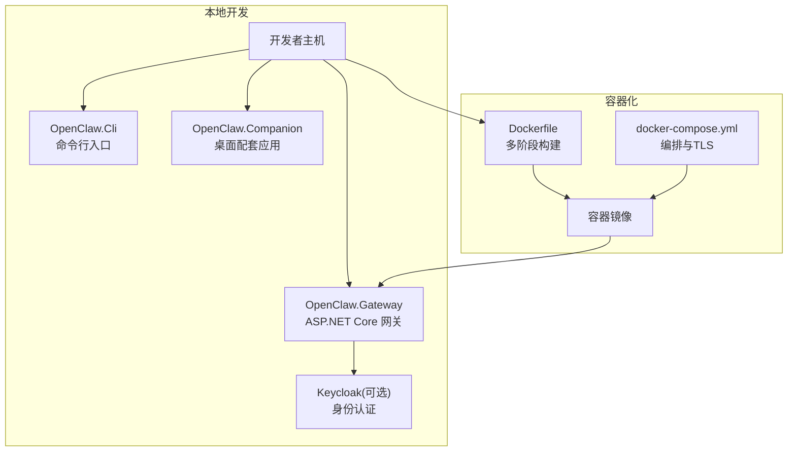
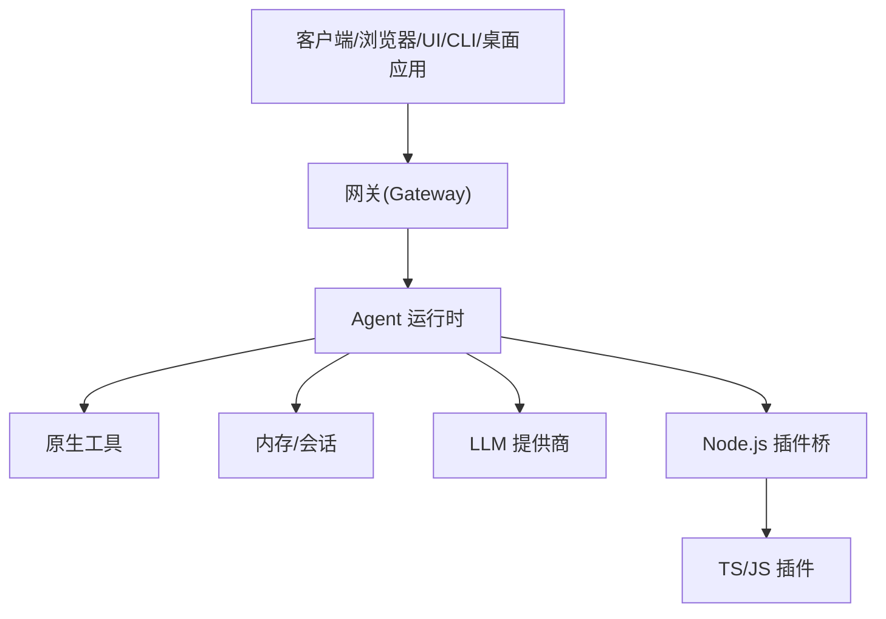
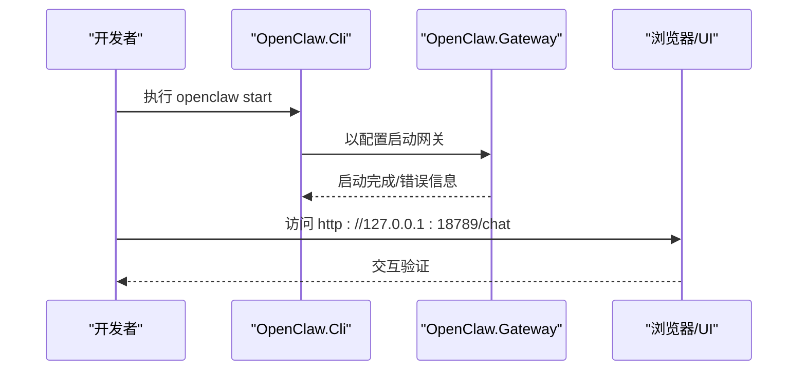
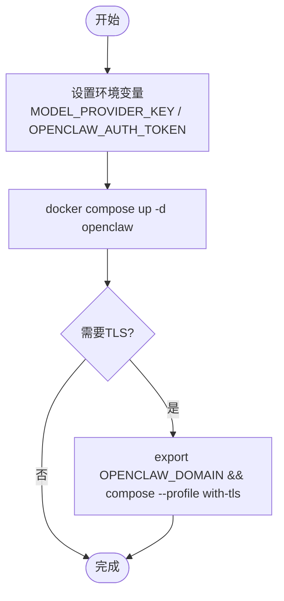
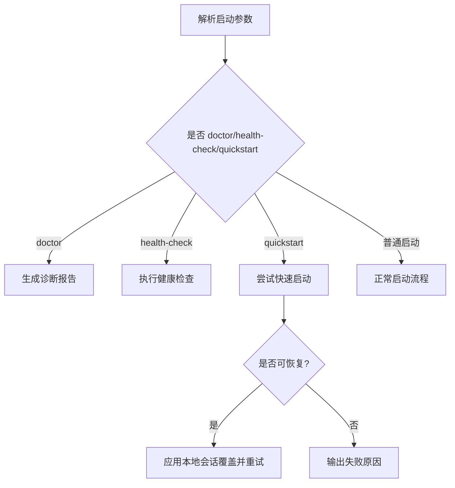
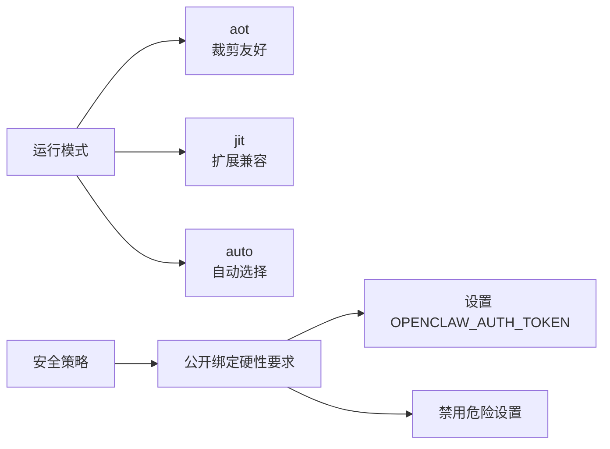
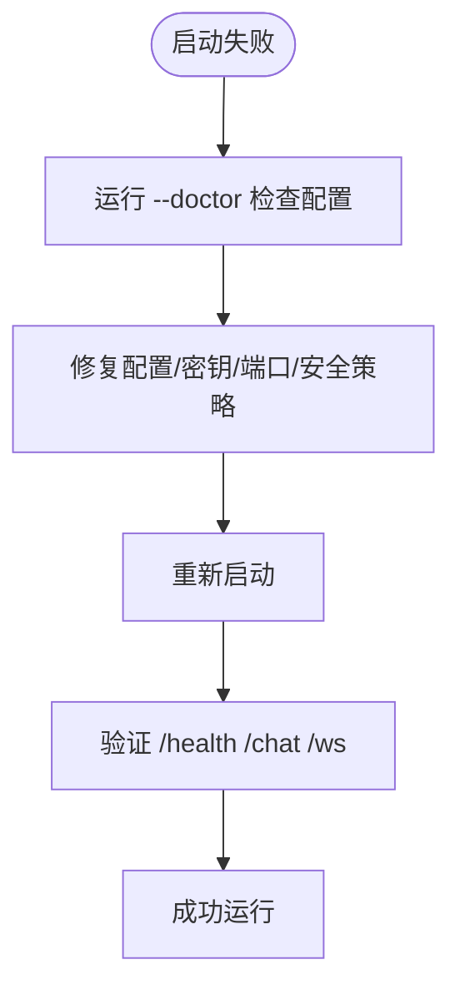

# 快速开始

<cite>
**本文引用的文件**
- [README.md](file://README.md)
- [QUICKSTART.md](file://QUICKSTART.md)
- [docs/QUICKSTART.md](file://docs/QUICKSTART.md)
- [src/OpenClaw.Gateway/Program.cs](file://src/OpenClaw.Gateway/Program.cs)
- [src/OpenClaw.Gateway/appsettings.json](file://src/OpenClaw.Gateway/appsettings.json)
- [src/OpenClaw.Gateway/appsettings.Production.json](file://src/OpenClaw.Gateway/appsettings.Production.json)
- [src/OpenClaw.Cli/Program.cs](file://src/OpenClaw.Cli/Program.cs)
- [src/OpenClaw.Cli/StartCommand.cs](file://src/OpenClaw.Cli/StartCommand.cs)
- [src/OpenClaw.Core/Validation/SetupVerificationService.cs](file://src/OpenClaw.Core/Validation/SetupVerificationService.cs)
- [src/OpenClaw.Gateway/Bootstrap/StartupLaunchOptions.cs](file://src/OpenClaw.Gateway/Bootstrap/StartupLaunchOptions.cs)
- [Dockerfile](file://Dockerfile)
- [docker-compose.yml](file://docker-compose.yml)
- [Kingcrab.AppHost/AppHost.cs](file://Kingcrab.AppHost/AppHost.cs)
- [Kingcrab.AppHost/appsettings.json](file://Kingcrab.AppHost/appsettings.json)
- [Kingcrab.AppHost/appsettings.Development.json](file://Kingcrab.AppHost/appsettings.Development.json)
</cite>

## 目录
1. [简介](#简介)
2. [项目结构](#项目结构)
3. [核心组件](#核心组件)
4. [架构总览](#架构总览)
5. [详细组件分析](#详细组件分析)
6. [依赖关系分析](#依赖关系分析)
7. [性能与运行模式](#性能与运行模式)
8. [故障排查指南](#故障排查指南)
9. [结论](#结论)
10. [附录](#附录)

## 简介
本指南面向首次接触 OpenClaw.NET 的用户，提供从零到运行的完整步骤，涵盖本地开发环境准备、依赖安装、配置设置、首次启动与验证，以及 Docker 部署与常见问题排查。通过最少的步骤，帮助你在本地快速启动网关（Gateway），并通过浏览器 UI、CLI 或桌面配套应用进行交互。

## 项目结构
OpenClaw.NET 采用多项目分层组织，核心运行时与网关位于 src/OpenClaw.Gateway，配套 CLI、桌面应用、通道适配器、工具集等均在该目录下；部署与容器化使用根目录 Dockerfile 与 docker-compose.yml；Aspire 应用宿主用于本地组合 Keycloak 与网关服务。

图表来源
- [src/OpenClaw.Gateway/Program.cs:1-124](file://src/OpenClaw.Gateway/Program.cs#L1-L124)
- [Kingcrab.AppHost/AppHost.cs:1-25](file://Kingcrab.AppHost/AppHost.cs#L1-L25)
- [Dockerfile:1-59](file://Dockerfile#L1-L59)
- [docker-compose.yml:1-68](file://docker-compose.yml#L1-L68)

章节来源
- [README.md:1-670](file://README.md#L1-L670)
- [Kingcrab.AppHost/AppHost.cs:1-25](file://Kingcrab.AppHost/AppHost.cs#L1-L25)

## 核心组件
- 网关（Gateway）：提供 HTTP、WebSocket、OpenAI 兼容接口、MCP、A2A 等能力，负责安全、策略、可观测性与运行时初始化。
- CLI：提供 chat、run、start、setup、admin 等子命令，支持一键引导与自动化。
- 桌面配套应用（Companion）：跨平台 Avalonia 应用，便于本地交互与会话管理。
- 容器镜像与编排：Dockerfile 多阶段构建，docker-compose 提供可选 TLS 反向代理（Caddy）。

章节来源
- [README.md:198-246](file://README.md#L198-L246)
- [src/OpenClaw.Gateway/Program.cs:1-124](file://src/OpenClaw.Gateway/Program.cs#L1-L124)
- [src/OpenClaw.Cli/Program.cs:1-2129](file://src/OpenClaw.Cli/Program.cs#L1-L2129)

## 架构总览
OpenClaw.NET 将启动流程分为“引导（Bootstrap）—组合（Composition）—配置文件（Profiles）—管道与端点（Pipeline/Endpoints）”四个阶段；运行时由网关承载 HTTP/WebSocket/通道等入口，Agent 运行时负责推理、工具执行、记忆与技能加载。

图表来源
- [README.md:145-196](file://README.md#L145-L196)
- [src/OpenClaw.Gateway/Program.cs:47-98](file://src/OpenClaw.Gateway/Program.cs#L47-L98)

章节来源
- [README.md:145-196](file://README.md#L145-L196)

## 详细组件分析

### 组件一：本地首次启动（推荐路径）
- 步骤概览
  1) 设置模型密钥与工作空间（可选）
  2) 选择运行模式（aot/jit/auto）
  3) 使用 doctor 检查配置
  4) 启动网关
  5) 使用浏览器 UI/CLI/桌面应用进行验证
- 关键命令与入口
  - CLI 启动：dotnet run --project src/OpenClaw.Cli -c Release -- start
  - 网关启动：dotnet run --project src/OpenClaw.Gateway -c Release
  - doctor 模式：dotnet run --project src/OpenClaw.Gateway -c Release -- --doctor
- 默认端点
  - Web UI: http://127.0.0.1:18789/chat
  - WebSocket: ws://127.0.0.1:18789/ws
  - 健康检查: http://127.0.0.1:18789/health

图表来源
- [src/OpenClaw.Cli/StartCommand.cs:9-47](file://src/OpenClaw.Cli/StartCommand.cs#L9-L47)
- [src/OpenClaw.Gateway/Program.cs:47-98](file://src/OpenClaw.Gateway/Program.cs#L47-L98)
- [docs/QUICKSTART.md:10-58](file://docs/QUICKSTART.md#L10-L58)

章节来源
- [docs/QUICKSTART.md:10-58](file://docs/QUICKSTART.md#L10-L58)
- [src/OpenClaw.Cli/StartCommand.cs:9-47](file://src/OpenClaw.Cli/StartCommand.cs#L9-L47)
- [src/OpenClaw.Gateway/Program.cs:47-98](file://src/OpenClaw.Gateway/Program.cs#L47-L98)

### 组件二：配置文件与环境变量
- 开发默认配置
  - src/OpenClaw.Gateway/appsettings.json：包含绑定地址、端口、认证令牌、运行时模式、LLM、内存、安全、工具、插件、MCP、通道等默认值。
  - src/OpenClaw.Gateway/appsettings.Production.json：生产环境默认值（如公开绑定、禁用插件桥、限制工具权限等）。
- 环境变量
  - MODEL_PROVIDER_KEY：模型提供商密钥
  - OPENCLAW_AUTH_TOKEN：网关访问令牌（非回环绑定时必需）
  - OPENCLAW_WORKSPACE：工作空间路径（文件工具与技能工作区）
  - OpenClaw__Runtime__Mode：运行模式（aot/jit/auto）
  - OPENCLAW_CONFIG_PATH：外部配置文件路径
- Aspire 应用宿主
  - Kingcrab.AppHost/AppHost.cs：添加 Keycloak 资源与网关、CLI、Companion 项目引用，并设置 UTF-8 编码。

章节来源
- [src/OpenClaw.Gateway/appsettings.json:1-908](file://src/OpenClaw.Gateway/appsettings.json#L1-L908)
- [src/OpenClaw.Gateway/appsettings.Production.json:1-65](file://src/OpenClaw.Gateway/appsettings.Production.json#L1-L65)
- [Kingcrab.AppHost/AppHost.cs:1-25](file://Kingcrab.AppHost/AppHost.cs#L1-L25)
- [Kingcrab.AppHost/appsettings.json:1-10](file://Kingcrab.AppHost/appsettings.json#L1-L10)
- [Kingcrab.AppHost/appsettings.Development.json:1-9](file://Kingcrab.AppHost/appsettings.Development.json#L1-L9)

### 组件三：Docker 部署
- 快速启动
  - 设置 MODEL_PROVIDER_KEY 与 OPENCLAW_AUTH_TOKEN
  - docker compose up -d openclaw
  - 可选启用 TLS：export OPENCLAW_DOMAIN=your.domain && docker compose --profile with-tls up -d
- 构建镜像
  - 多架构构建：docker buildx build --platform linux/amd64,linux/arm64 -t openclaw.net:latest .
- 运行参数
  - -e MODEL_PROVIDER_KEY=...
  - -e OPENCLAW_AUTH_TOKEN=...
  - -v openclaw-memory:/app/memory
  - 可选挂载工作空间：-v ./workspace:/app/workspace

图表来源
- [README.md:405-431](file://README.md#L405-L431)
- [Dockerfile:1-59](file://Dockerfile#L1-L59)
- [docker-compose.yml:1-68](file://docker-compose.yml#L1-L68)

章节来源
- [README.md:405-431](file://README.md#L405-L431)
- [Dockerfile:1-59](file://Dockerfile#L1-L59)
- [docker-compose.yml:1-68](file://docker-compose.yml#L1-L68)

### 组件四：启动选项与恢复机制
- 启动模式
  - --doctor：生成诊断报告
  - --health-check：健康检查
  - --quickstart：交互式快速启动（不与 doctor/health-check/config 同时使用）
- 交互式恢复
  - 当启动失败且满足条件时，系统可提示并自动应用本地会话覆盖项（如端口、提供商、模型、工作空间等），减少重复输入。

图表来源
- [src/OpenClaw.Gateway/Bootstrap/StartupLaunchOptions.cs:57-68](file://src/OpenClaw.Gateway/Bootstrap/StartupLaunchOptions.cs#L57-L68)
- [src/OpenClaw.Gateway/Program.cs:14-40](file://src/OpenClaw.Gateway/Program.cs#L14-L40)

章节来源
- [src/OpenClaw.Gateway/Bootstrap/StartupLaunchOptions.cs:57-68](file://src/OpenClaw.Gateway/Bootstrap/StartupLaunchOptions.cs#L57-L68)
- [src/OpenClaw.Gateway/Program.cs:14-40](file://src/OpenClaw.Gateway/Program.cs#L14-L40)

## 依赖关系分析
- 运行时模式与兼容性
  - aot：裁剪友好、低内存，支持 registerTool/registerService/插件打包技能等
  - jit：扩展兼容，支持 registerChannel/registerCommand/registerProvider/api.on(...) 与动态原生插件
  - auto：根据运行时能力自动选择
- 安全与公开绑定
  - 非回环绑定需设置 OPENCLAW_AUTH_TOKEN
  - 生产默认禁用危险设置（如 AllowShell=false、插件桥 Disabled 等）

图表来源
- [README.md:60-71](file://README.md#L60-L71)
- [README.md:277-313](file://README.md#L277-L313)
- [src/OpenClaw.Gateway/appsettings.Production.json:22-50](file://src/OpenClaw.Gateway/appsettings.Production.json#L22-L50)

章节来源
- [README.md:60-71](file://README.md#L60-L71)
- [README.md:277-313](file://README.md#L277-L313)
- [src/OpenClaw.Gateway/appsettings.Production.json:22-50](file://src/OpenClaw.Gateway/appsettings.Production.json#L22-L50)

## 性能与运行模式
- 运行模式选择建议
  - 本地开发与脚本：优先 aot，稳定、体积小
  - 需要插件桥或动态能力：使用 jit
  - 自动选择：auto，按运行时能力决定
- 生产部署建议
  - 使用 Docker 多架构镜像
  - 反向代理（Caddy/Nginx）+ TLS
  - 严格的安全策略与速率限制

章节来源
- [README.md:198-246](file://README.md#L198-L246)
- [README.md:443-478](file://README.md#L443-L478)
- [README.md:530-581](file://README.md#L530-L581)

## 故障排查指南
- 常见问题与处理
  - 未设置 OPENCLAW_AUTH_TOKEN：当绑定到非回环地址时必须设置
  - 模型密钥无效：检查 MODEL_PROVIDER_KEY 是否正确
  - 端口占用：修改端口或释放占用进程
  - 插件桥不可用：确认 Node.js 版本与网络连通性
  - 工作空间无权限：确保 AllowedReadRoots/AllowedWriteRoots 包含挂载路径
- 诊断与验证
  - 使用 doctor 模式：dotnet run --project src/OpenClaw.Gateway -c Release -- --doctor
  - 使用 SetupVerificationService：通过 CLI admin posture 获取运行态摘要
  - 健康检查：/health 与 /metrics 接口

图表来源
- [src/OpenClaw.Core/Validation/SetupVerificationService.cs:83-164](file://src/OpenClaw.Core/Validation/SetupVerificationService.cs#L83-L164)
- [src/OpenClaw.Gateway/Program.cs:99-123](file://src/OpenClaw.Gateway/Program.cs#L99-L123)

章节来源
- [src/OpenClaw.Core/Validation/SetupVerificationService.cs:83-164](file://src/OpenClaw.Core/Validation/SetupVerificationService.cs#L83-L164)
- [src/OpenClaw.Gateway/Program.cs:99-123](file://src/OpenClaw.Gateway/Program.cs#L99-L123)

## 结论
通过本快速开始指南，你可以在本地快速完成环境准备、配置设置与首次启动，并掌握 Docker 部署与常见问题排查方法。建议先以 aot 模式体验基础功能，再根据需要切换至 jit 以启用更广泛的插件生态；生产部署务必遵循安全与合规要求。

## 附录

### A. 本地开发环境清单
- .NET 10 SDK
- 可选：Node.js 20+（启用 TS/JS 插件桥）
- 文本编辑器或 IDE

章节来源
- [docs/QUICKSTART.md:5-9](file://docs/QUICKSTART.md#L5-L9)

### B. 常用命令速查
- 本地启动网关：dotnet run --project src/OpenClaw.Gateway -c Release
- doctor 模式：dotnet run --project src/OpenClaw.Gateway -c Release -- --doctor
- CLI 交互：dotnet run --project src/OpenClaw.Cli -c Release -- chat
- CLI 一次性任务：dotnet run --project src/OpenClaw.Cli -c Release -- run "<提示词>"
- Docker 启动：docker compose up -d openclaw
- Docker 启用 TLS：export OPENCLAW_DOMAIN=your.domain && docker compose --profile with-tls up -d

章节来源
- [docs/QUICKSTART.md:41-94](file://docs/QUICKSTART.md#L41-L94)
- [README.md:405-431](file://README.md#L405-L431)