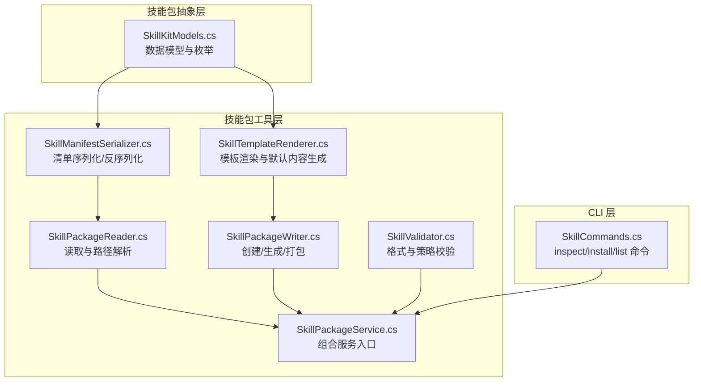
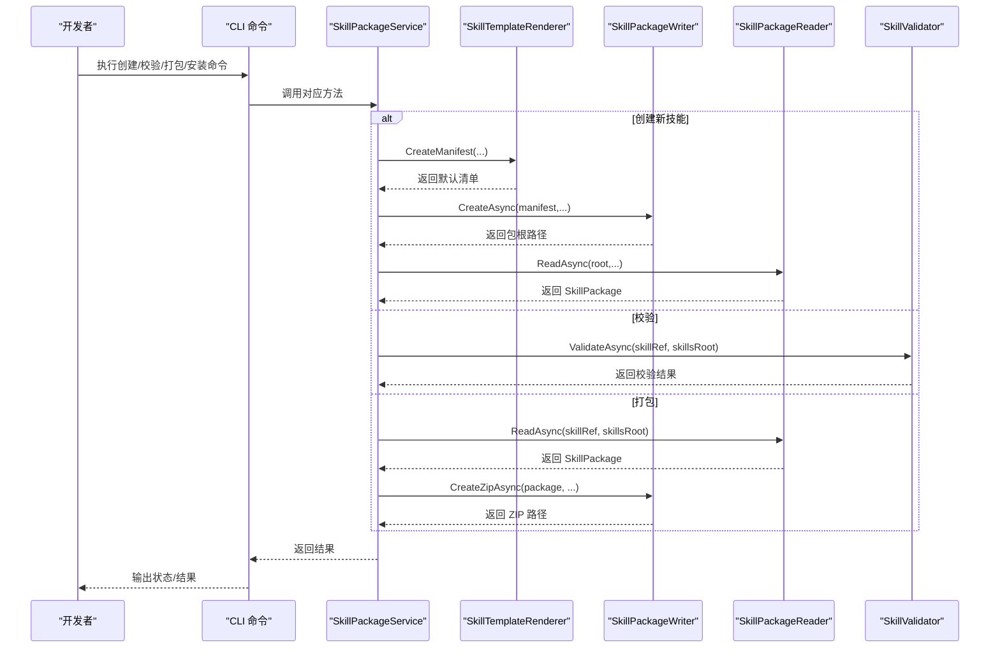
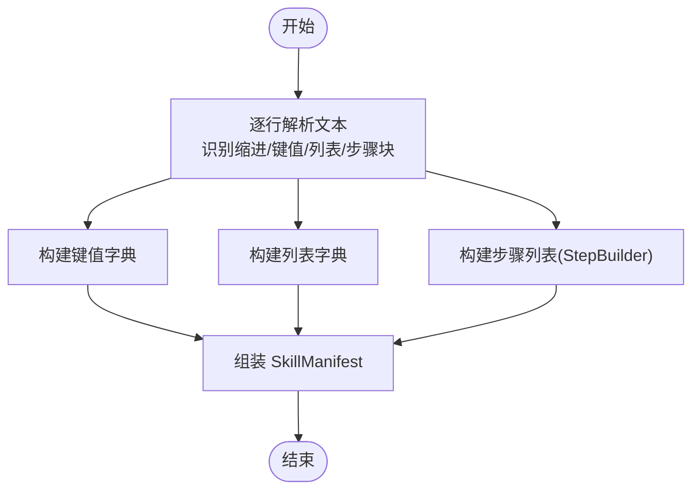
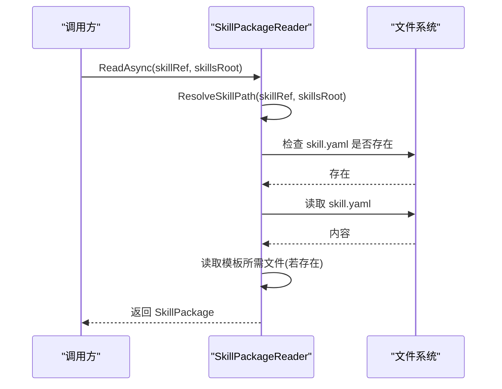
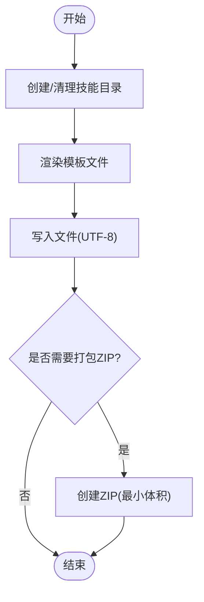
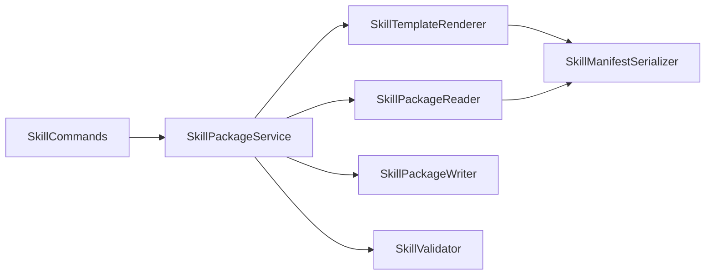

# 技能包格式规范

<cite>
**本文引用的文件**
- [SkillManifestSerializer.cs](file://src/OpenClaw.SkillKit/SkillManifestSerializer.cs)
- [SkillPackageReader.cs](file://src/OpenClaw.SkillKit/SkillPackageReader.cs)
- [SkillPackageWriter.cs](file://src/OpenClaw.SkillKit/SkillPackageWriter.cs)
- [SkillTemplateRenderer.cs](file://src/OpenClaw.SkillKit/SkillTemplateRenderer.cs)
- [SkillValidator.cs](file://src/OpenClaw.SkillKit/SkillValidator.cs)
- [SkillPackageService.cs](file://src/OpenClaw.SkillKit/SkillPackageService.cs)
- [SkillKitModels.cs](file://src/OpenClaw.SkillKit.Abstractions/SkillKitModels.cs)
- [SkillCommands.cs](file://src/OpenClaw.Cli/SkillCommands.cs)
</cite>

## 目录
1. [简介](#简介)
2. [项目结构](#项目结构)
3. [核心组件](#核心组件)
4. [架构总览](#架构总览)
5. [详细组件分析](#详细组件分析)
6. [依赖关系分析](#依赖关系分析)
7. [性能考量](#性能考量)
8. [故障排查指南](#故障排查指南)
9. [结论](#结论)
10. [附录：最佳实践与规范](#附录最佳实践与规范)

## 简介
本文件系统性阐述“技能包”（Skill Package）的格式规范与实现细节，覆盖以下方面：
- 技能包的文件结构与清单（skill.yaml）格式
- 清单的序列化与反序列化机制，包括自定义 YAML 风格文本格式与 JSON Schema 的关系
- 技能包读取器（SkillPackageReader）的解析流程与错误处理
- 技能包写入器（SkillPackageWriter）的生成、打包与压缩策略
- 版本管理与发布流程建议
- 基于仓库中现有实现的可操作最佳实践

## 项目结构
技能包相关能力主要位于 OpenClaw.SkillKit 与 OpenClaw.SkillKit.Abstractions 两个项目中，并通过 CLI 提供安装与检查能力。

图表来源
- [SkillKitModels.cs:1-137](file://src/OpenClaw.SkillKit.Abstractions/SkillKitModels.cs#L1-L137)
- [SkillTemplateRenderer.cs:1-363](file://src/OpenClaw.SkillKit/SkillTemplateRenderer.cs#L1-L363)
- [SkillManifestSerializer.cs:1-308](file://src/OpenClaw.SkillKit/SkillManifestSerializer.cs#L1-L308)
- [SkillPackageReader.cs:1-113](file://src/OpenClaw.SkillKit/SkillPackageReader.cs#L1-L113)
- [SkillPackageWriter.cs:1-77](file://src/OpenClaw.SkillKit/SkillPackageWriter.cs#L1-L77)
- [SkillValidator.cs:1-124](file://src/OpenClaw.SkillKit/SkillValidator.cs#L1-L124)
- [SkillPackageService.cs:1-76](file://src/OpenClaw.SkillKit/SkillPackageService.cs#L1-L76)
- [SkillCommands.cs:1-425](file://src/OpenClaw.Cli/SkillCommands.cs#L1-L425)

章节来源
- [SkillKitModels.cs:1-137](file://src/OpenClaw.SkillKit.Abstractions/SkillKitModels.cs#L1-L137)
- [SkillTemplateRenderer.cs:1-363](file://src/OpenClaw.SkillKit/SkillTemplateRenderer.cs#L1-L363)
- [SkillPackageReader.cs:1-113](file://src/OpenClaw.SkillKit/SkillPackageReader.cs#L1-L113)
- [SkillPackageWriter.cs:1-77](file://src/OpenClaw.SkillKit/SkillPackageWriter.cs#L1-L77)
- [SkillValidator.cs:1-124](file://src/OpenClaw.SkillKit/SkillValidator.cs#L1-L124)
- [SkillPackageService.cs:1-76](file://src/OpenClaw.SkillKit/SkillPackageService.cs#L1-L76)
- [SkillCommands.cs:1-425](file://src/OpenClaw.Cli/SkillCommands.cs#L1-L425)

## 核心组件
- 数据模型与枚举：定义技能清单、工作流步骤类型、包结构等核心数据结构。
- 模板渲染器：根据模板与类别生成默认清单与配套文档内容。
- 清单序列化器：提供 skill.yaml 的读写与自定义 YAML 风格文本格式编解码。
- 包读取器：解析技能包目录、定位清单、收集必要文件。
- 包写入器：创建目录结构、生成缺失文件、打包为 ZIP。
- 包服务：组合上述能力，提供创建、校验、打包、运行规划等高层接口。
- CLI：提供 inspect/install/list 等用户操作。

章节来源
- [SkillKitModels.cs:1-137](file://src/OpenClaw.SkillKit.Abstractions/SkillKitModels.cs#L1-L137)
- [SkillTemplateRenderer.cs:1-363](file://src/OpenClaw.SkillKit/SkillTemplateRenderer.cs#L1-L363)
- [SkillManifestSerializer.cs:1-308](file://src/OpenClaw.SkillKit/SkillManifestSerializer.cs#L1-L308)
- [SkillPackageReader.cs:1-113](file://src/OpenClaw.SkillKit/SkillPackageReader.cs#L1-L113)
- [SkillPackageWriter.cs:1-77](file://src/OpenClaw.SkillKit/SkillPackageWriter.cs#L1-L77)
- [SkillPackageService.cs:1-76](file://src/OpenClaw.SkillKit/SkillPackageService.cs#L1-L76)
- [SkillCommands.cs:1-425](file://src/OpenClaw.Cli/SkillCommands.cs#L1-L425)

## 架构总览
技能包生命周期从“创建/生成”到“校验/打包”，再到“安装/检查”。

图表来源
- [SkillPackageService.cs:1-76](file://src/OpenClaw.SkillKit/SkillPackageService.cs#L1-L76)
- [SkillTemplateRenderer.cs:1-363](file://src/OpenClaw.SkillKit/SkillTemplateRenderer.cs#L1-L363)
- [SkillPackageWriter.cs:1-77](file://src/OpenClaw.SkillKit/SkillPackageWriter.cs#L1-L77)
- [SkillPackageReader.cs:1-113](file://src/OpenClaw.SkillKit/SkillPackageReader.cs#L1-L113)
- [SkillValidator.cs:1-124](file://src/OpenClaw.SkillKit/SkillValidator.cs#L1-L124)
- [SkillCommands.cs:1-425](file://src/OpenClaw.Cli/SkillCommands.cs#L1-L425)

## 详细组件分析

### 技能包文件结构与清单格式
- 必备文件清单（由模板渲染器定义）：
  - skill.yaml：技能清单（YAML 风格文本）
  - intent.md：意图与目标说明
  - expectations.md：期望行为与质量标准
  - workflow.yaml：工作流步骤
  - tools.yaml：工具策略
  - guardrails.md：护栏与禁止事项
  - validation.md：验证规则
  - examples.md：示例输入输出
  - trace.md：生成轨迹与决策记录
- 目录布局：每个技能包为一个独立目录，目录名通常与清单中的 id 对应；支持别名匹配。

章节来源
- [SkillTemplateRenderer.cs:8-19](file://src/OpenClaw.SkillKit/SkillTemplateRenderer.cs#L8-L19)
- [SkillKitModels.cs:73-78](file://src/OpenClaw.SkillKit.Abstractions/SkillKitModels.cs#L73-L78)

### 清单序列化与反序列化（SkillManifestSerializer）
- 序列化（清单 -> 文本）
  - 将 SkillManifest 转换为自定义 YAML 风格文本，包含键值对与列表项，缩进表示层级。
  - 支持对标量值进行转义与引号包裹，确保特殊字符安全。
- 反序列化（文本 -> 清单）
  - 解析逐行文本，识别缩进、键值对、列表项与“步骤”块。
  - 使用 StepBuilder 构建工作流步骤，最终组装为 SkillManifest。
- 步骤类型映射：枚举与字符串互转，保证序列化/反序列化的稳定性。
- 编解码规则：
  - 字符串转义：反斜杠、引号、换行等转义。
  - 解码时去除外层引号并还原转义字符。
- 注意：该实现采用自定义 YAML 风格文本而非 JSON Schema；未在代码中发现 JSON Schema 验证逻辑。

图表来源
- [SkillManifestSerializer.cs:61-159](file://src/OpenClaw.SkillKit/SkillManifestSerializer.cs#L61-L159)

章节来源
- [SkillManifestSerializer.cs:21-59](file://src/OpenClaw.SkillKit/SkillManifestSerializer.cs#L21-L59)
- [SkillManifestSerializer.cs:61-159](file://src/OpenClaw.SkillKit/SkillManifestSerializer.cs#L61-L159)
- [SkillManifestSerializer.cs:197-235](file://src/OpenClaw.SkillKit/SkillManifestSerializer.cs#L197-L235)
- [SkillManifestSerializer.cs:237-255](file://src/OpenClaw.SkillKit/SkillManifestSerializer.cs#L237-L255)

### 技能包读取流程（SkillPackageReader）
- 输入：技能引用（目录或相对路径）与技能根目录
- 关键步骤：
  - 解析技能路径：支持绝对路径、相对路径、基于 skillsRoot 的拼接。
  - 定位 skill.yaml 并读取清单。
  - 收集模板所需文件（若存在），统一读取为 UTF-8 文本。
  - 返回 SkillPackage（包含根路径、清单与文件字典）。
- 错误处理：
  - 文件不存在、IO 异常、权限异常均被捕获并记录警告，跳过该包。
  - 路径解析时防止逃逸包根（相对路径不能指向包根之外）。

图表来源
- [SkillPackageReader.cs:9-31](file://src/OpenClaw.SkillKit/SkillPackageReader.cs#L9-L31)
- [SkillPackageReader.cs:84-97](file://src/OpenClaw.SkillKit/SkillPackageReader.cs#L84-L97)
- [SkillPackageReader.cs:99-111](file://src/OpenClaw.SkillKit/SkillPackageReader.cs#L99-L111)

章节来源
- [SkillPackageReader.cs:9-31](file://src/OpenClaw.SkillKit/SkillPackageReader.cs#L9-L31)
- [SkillPackageReader.cs:33-64](file://src/OpenClaw.SkillKit/SkillPackageReader.cs#L33-L64)
- [SkillPackageReader.cs:84-97](file://src/OpenClaw.SkillKit/SkillPackageReader.cs#L84-L97)
- [SkillPackageReader.cs:99-111](file://src/OpenClaw.SkillKit/SkillPackageReader.cs#L99-L111)

### 技能包写入机制（SkillPackageWriter）
- 创建目录：按清单 id 生成子目录，支持强制覆盖。
- 生成文件：使用模板渲染器生成所有必需文件并写入 UTF-8。
- 生成缺失文件：仅在目标文件不存在时写入（可选强制覆盖）。
- 打包 ZIP：以“技能ID-版本号.zip”命名，使用最小体积压缩模式，仅打包模板所需文件。
- 路径校验：禁止非单段路径段（含分隔符）、防止路径逃逸包根。

图表来源
- [SkillPackageWriter.cs:9-25](file://src/OpenClaw.SkillKit/SkillPackageWriter.cs#L9-L25)
- [SkillPackageWriter.cs:27-37](file://src/OpenClaw.SkillKit/SkillPackageWriter.cs#L27-L37)
- [SkillPackageWriter.cs:39-61](file://src/OpenClaw.SkillKit/SkillPackageWriter.cs#L39-L61)
- [SkillPackageWriter.cs:63-75](file://src/OpenClaw.SkillKit/SkillPackageWriter.cs#L63-L75)

章节来源
- [SkillPackageWriter.cs:9-25](file://src/OpenClaw.SkillKit/SkillPackageWriter.cs#L9-L25)
- [SkillPackageWriter.cs:27-37](file://src/OpenClaw.SkillKit/SkillPackageWriter.cs#L27-L37)
- [SkillPackageWriter.cs:39-61](file://src/OpenClaw.SkillKit/SkillPackageWriter.cs#L39-L61)
- [SkillPackageWriter.cs:63-75](file://src/OpenClaw.SkillKit/SkillPackageWriter.cs#L63-L75)

### 模板与默认内容（SkillTemplateRenderer）
- 默认模板：根据模板名与类别生成默认清单字段（描述、意图、输入/输出、工具策略、护栏、审批策略、验证规则、工作流）。
- 默认工作流：包含输入、推理、生成、验证、人工审批等步骤。
- 追踪文件：生成 trace.md 记录生成信息与待决策点。

章节来源
- [SkillTemplateRenderer.cs:21-57](file://src/OpenClaw.SkillKit/SkillTemplateRenderer.cs#L21-L57)
- [SkillTemplateRenderer.cs:105-115](file://src/OpenClaw.SkillKit/SkillTemplateRenderer.cs#L105-L115)
- [SkillTemplateRenderer.cs:75-103](file://src/OpenClaw.SkillKit/SkillTemplateRenderer.cs#L75-L103)

### 校验与合规（SkillValidator）
- 校验范围：
  - 文件存在性：除 skill.yaml 外的其余模板文件。
  - 清单一致性：id 与目录名或别名匹配。
  - 必填字段：名称、版本、类别、意图结果。
  - 策略冲突：工具允许/禁止集合冲突、审批必需要求与禁止集合冲突。
  - 工作流：至少包含一个步骤。
- 结果：返回 SkillValidationResult，包含严重级别（通过/警告/错误）与问题明细。

章节来源
- [SkillValidator.cs:7-78](file://src/OpenClaw.SkillKit/SkillValidator.cs#L7-L78)
- [SkillValidator.cs:80-98](file://src/OpenClaw.SkillKit/SkillValidator.cs#L80-L98)
- [SkillValidator.cs:100-122](file://src/OpenClaw.SkillKit/SkillValidator.cs#L100-L122)

### 组合服务（SkillPackageService）
- 提供统一入口：创建新技能、列出已安装技能、读取技能包、校验、生成缺失文件、打包、生成评审报告、规划运行。
- 依赖注入：模板渲染器、读取器、写入器、校验器、评审提供者、运行规划器、追踪更新器。

章节来源
- [SkillPackageService.cs:6-27](file://src/OpenClaw.SkillKit/SkillPackageService.cs#L6-L27)
- [SkillPackageService.cs:29-74](file://src/OpenClaw.SkillKit/SkillPackageService.cs#L29-L74)

### CLI 交互（SkillCommands）
- inspect：检查本地或压缩包中的技能包，输出信任度、要求摘要、安装建议等。
- install：安装技能包至工作区或受管目录，支持干运行与路径解析。
- list：列出已安装技能。
- 路径与环境：支持通过环境变量或参数指定 skills 目录。

章节来源
- [SkillCommands.cs:10-28](file://src/OpenClaw.Cli/SkillCommands.cs#L10-L28)
- [SkillCommands.cs:131-143](file://src/OpenClaw.Cli/SkillCommands.cs#L131-L143)
- [SkillCommands.cs:42-92](file://src/OpenClaw.Cli/SkillCommands.cs#L42-L92)
- [SkillCommands.cs:94-129](file://src/OpenClaw.Cli/SkillCommands.cs#L94-L129)
- [SkillCommands.cs:268-284](file://src/OpenClaw.Cli/SkillCommands.cs#L268-L284)

## 依赖关系分析
- 组件耦合：
  - SkillPackageService 组合多个组件，形成高内聚低耦合的服务层。
  - SkillManifestSerializer 与 SkillTemplateRenderer 分别负责清单与内容生成，职责清晰。
  - SkillPackageReader/Writer 与模板渲染器紧密协作，确保文件一致性。
- 外部依赖：
  - 文件系统 IO、UTF-8 文本读写、ZIP 压缩。
  - CLI 依赖 tar/gzip 工具进行压缩包检查（安装流程中）。

图表来源
- [SkillPackageService.cs:6-27](file://src/OpenClaw.SkillKit/SkillPackageService.cs#L6-L27)
- [SkillTemplateRenderer.cs:1-363](file://src/OpenClaw.SkillKit/SkillTemplateRenderer.cs#L1-L363)
- [SkillManifestSerializer.cs:1-308](file://src/OpenClaw.SkillKit/SkillManifestSerializer.cs#L1-L308)
- [SkillPackageReader.cs:1-113](file://src/OpenClaw.SkillKit/SkillPackageReader.cs#L1-L113)
- [SkillPackageWriter.cs:1-77](file://src/OpenClaw.SkillKit/SkillPackageWriter.cs#L1-L77)
- [SkillValidator.cs:1-124](file://src/OpenClaw.SkillKit/SkillValidator.cs#L1-L124)
- [SkillCommands.cs:1-425](file://src/OpenClaw.Cli/SkillCommands.cs#L1-L425)

## 性能考量
- 序列化/反序列化：采用 StringBuilder 与一次性写入，避免频繁分配；字符串转义与解码为 O(n)。
- 文件读写：批量读取模板所需文件，避免重复 IO；ZIP 打包使用最小体积模式。
- 列表校验：使用 HashSet 进行冲突检测，时间复杂度近似 O(n)。
- 建议：
  - 大型技能包建议使用 ZIP 打包分发，减少目录层级与文件数量。
  - 在 CI 中先执行校验再打包，降低失败成本。

## 故障排查指南
- 清单读取失败
  - 现象：抛出文件未找到、IO 异常或数据无效异常。
  - 排查：确认 skill.yaml 存在且可读；检查编码是否为 UTF-8。
  - 参考
    - [SkillPackageReader.cs:13-14](file://src/OpenClaw.SkillKit/SkillPackageReader.cs#L13-L14)
    - [SkillManifestSerializer.cs:15-18](file://src/OpenClaw.SkillKit/SkillManifestSerializer.cs#L15-L18)
- 路径逃逸或非法路径
  - 现象：抛出 InvalidDataException，提示文件名必须相对且不逃逸包根。
  - 排查：检查文件名是否包含路径分隔符或上层引用。
  - 参考
    - [SkillPackageReader.cs:102-108](file://src/OpenClaw.SkillKit/SkillPackageReader.cs#L102-L108)
    - [SkillPackageWriter.cs:67-72](file://src/OpenClaw.SkillKit/SkillPackageWriter.cs#L67-L72)
- 工作流为空或策略冲突
  - 现象：校验报告出现错误或警告。
  - 排查：确保工作流至少包含一个步骤；检查工具策略集合是否有冲突。
  - 参考
    - [SkillValidator.cs:59-62](file://src/OpenClaw.SkillKit/SkillValidator.cs#L59-L62)
    - [SkillValidator.cs:70-75](file://src/OpenClaw.SkillKit/SkillValidator.cs#L70-L75)
- 安装失败
  - 现象：安装时报错或无法复制。
  - 排查：确认目标目录权限、磁盘空间；检查是否包含符号链接或重解析点。
  - 参考
    - [SkillCommands.cs:314-321](file://src/OpenClaw.Cli/SkillCommands.cs#L314-L321)
    - [SkillCommands.cs:72-78](file://src/OpenClaw.Cli/SkillCommands.cs#L72-L78)

章节来源
- [SkillPackageReader.cs:13-14](file://src/OpenClaw.SkillKit/SkillPackageReader.cs#L13-L14)
- [SkillPackageReader.cs:102-108](file://src/OpenClaw.SkillKit/SkillPackageReader.cs#L102-L108)
- [SkillPackageWriter.cs:67-72](file://src/OpenClaw.SkillKit/SkillPackageWriter.cs#L67-L72)
- [SkillValidator.cs:59-75](file://src/OpenClaw.SkillKit/SkillValidator.cs#L59-L75)
- [SkillCommands.cs:314-321](file://src/OpenClaw.Cli/SkillCommands.cs#L314-L321)
- [SkillCommands.cs:72-78](file://src/OpenClaw.Cli/SkillCommands.cs#L72-L78)

## 结论
本规范基于仓库现有实现，明确了技能包的文件结构、清单格式、序列化/反序列化规则、读取/写入流程与校验策略。通过模板渲染器与服务层的组合，实现了从创建、校验、打包到安装的完整闭环。建议在实际落地中遵循路径与命名约束、保持清单字段完备、定期执行校验与评审，以确保技能包的一致性与可维护性。

## 附录：最佳实践与规范
- 目录与命名
  - 技能包目录名应与清单 id 一致；如需多语言/多版本，建议通过别名或子目录区分。
  - 避免在文件名中使用路径分隔符或上层引用，防止路径逃逸。
- 清单完整性
  - 至少包含名称、版本、类别、意图结果、至少一个必填输入/输出、护栏与验证规则。
  - 工具策略不得同时允许与禁止同一工具；审批必需要求不得与禁止集合重叠。
- 工作流设计
  - 明确步骤边界与职责，确保每个步骤有清晰的输入/输出与描述。
- 打包与发布
  - 使用 ZIP 打包发布，文件名为“技能ID-版本号.zip”。
  - 发布前执行校验，确保所有模板文件齐全且策略无冲突。
- 版本管理
  - 严格遵循语义化版本；每次重大变更更新版本号并在 trace.md 中记录。
- 安全与合规
  - 审批必需要求的工具严禁在禁止列表中；涉及外部提交/删除等高风险操作必须经过人工审批。
- CLI 使用
  - 使用 inspect 检查技能包健康状况；install 支持干运行预览；list 查看已安装技能。