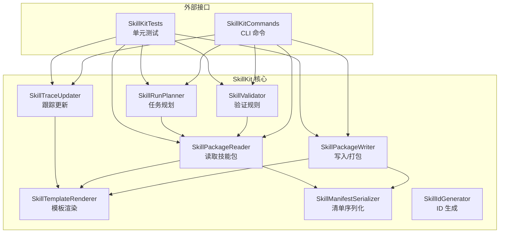
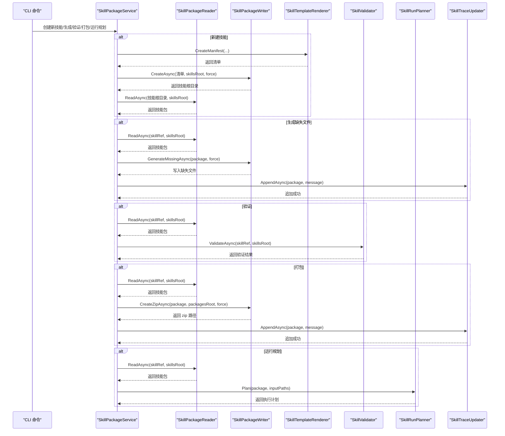
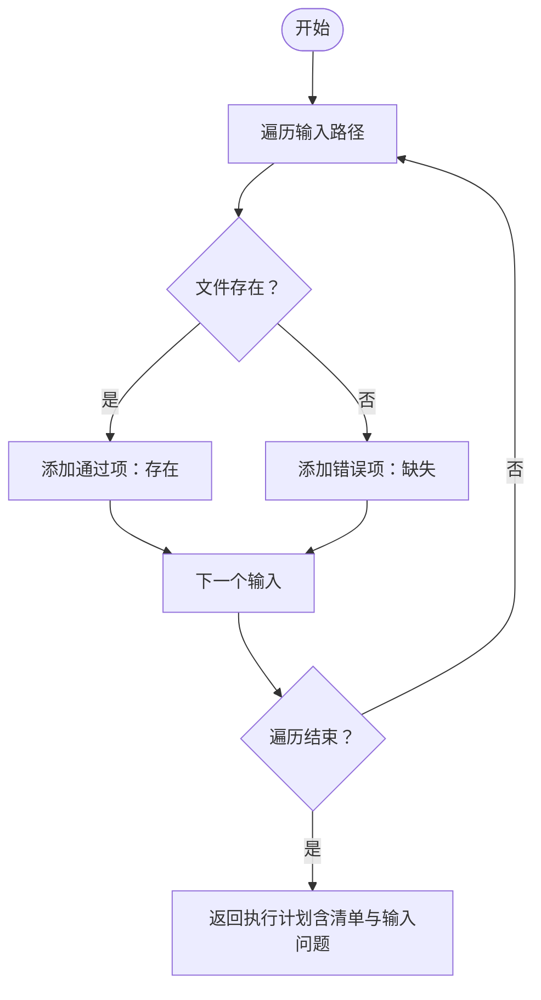
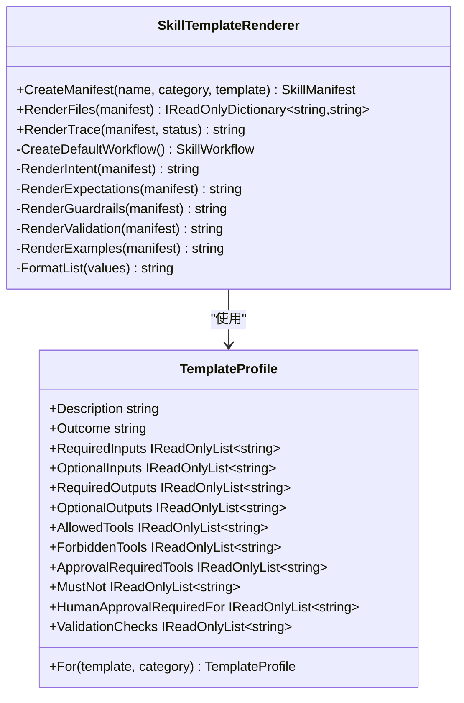
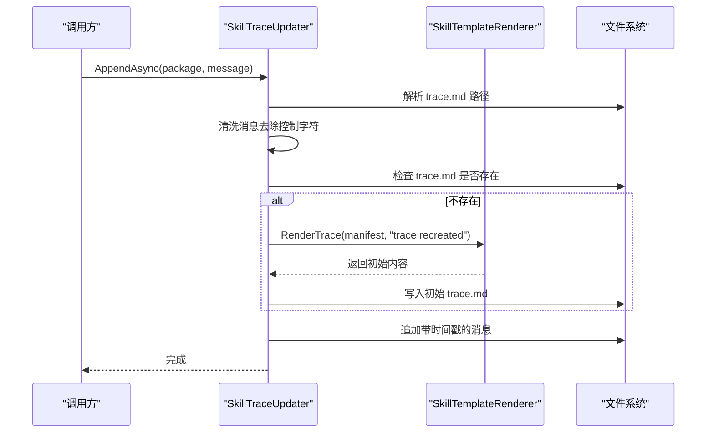
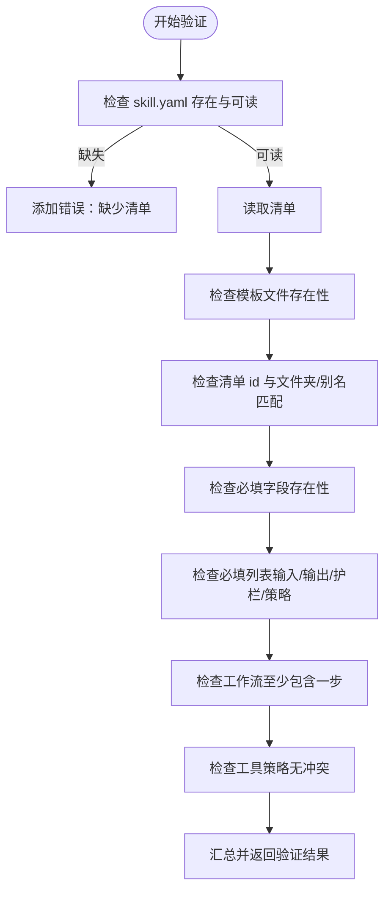
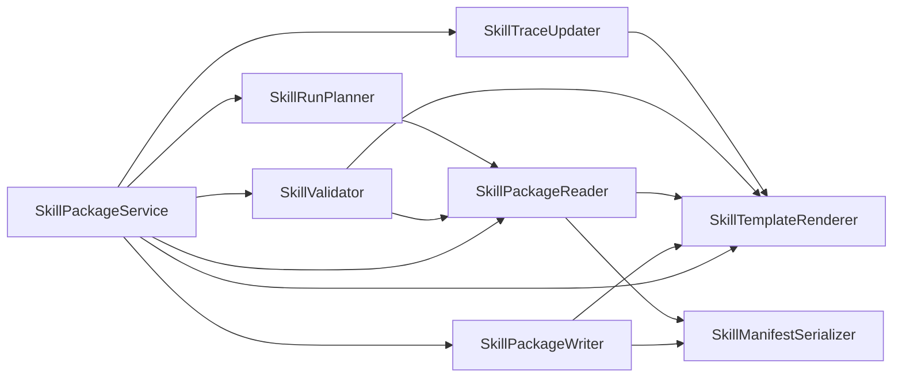

# 技能开发工具

<cite>
**本文引用的文件列表**
- [SkillRunPlanner.cs](file://src/OpenClaw.SkillKit/SkillRunPlanner.cs)
- [SkillTemplateRenderer.cs](file://src/OpenClaw.SkillKit/SkillTemplateRenderer.cs)
- [SkillTraceUpdater.cs](file://src/OpenClaw.SkillKit/SkillTraceUpdater.cs)
- [SkillValidator.cs](file://src/OpenClaw.SkillKit/SkillValidator.cs)
- [SkillPackageService.cs](file://src/OpenClaw.SkillKit/SkillPackageService.cs)
- [SkillPackageReader.cs](file://src/OpenClaw.SkillKit/SkillPackageReader.cs)
- [SkillPackageWriter.cs](file://src/OpenClaw.SkillKit/SkillPackageWriter.cs)
- [SkillManifestSerializer.cs](file://src/OpenClaw.SkillKit/SkillManifestSerializer.cs)
- [SkillKitModels.cs](file://src/OpenClaw.SkillKit.Abstractions/SkillKitModels.cs)
- [SkillIdGenerator.cs](file://src/OpenClaw.SkillKit/SkillIdGenerator.cs)
- [SkillKitCommands.cs](file://src/OpenClaw.Cli/SkillKitCommands.cs)
- [SkillKitTests.cs](file://src/OpenClaw.Tests/SkillKitTests.cs)
</cite>

## 目录
1. [简介](#简介)
2. [项目结构](#项目结构)
3. [核心组件](#核心组件)
4. [架构总览](#架构总览)
5. [详细组件分析](#详细组件分析)
6. [依赖关系分析](#依赖关系分析)
7. [性能与可扩展性](#性能与可扩展性)
8. [使用示例与配置](#使用示例与配置)
9. [故障排除指南](#故障排除指南)
10. [结论](#结论)

## 简介
本技术文档聚焦于技能开发工具（SkillKit）中的四大核心模块：任务规划与执行调度（SkillRunPlanner）、模板渲染引擎（SkillTemplateRenderer）、跟踪更新系统（SkillTraceUpdater）、以及验证规则与质量检查（SkillValidator）。文档将从架构、数据流、处理逻辑、集成点、错误处理与性能特性等维度进行深入解析，并提供使用示例、配置选项与故障排除建议，帮助开发者高效地创建、维护与运行高质量的技能包。

## 项目结构
技能开发工具位于 OpenClaw 代码库的 SkillKit 子系统中，围绕“清单（manifest）+ 模板文件 + 验证 + 追踪”的工作流展开。关键文件分布如下：
- 核心服务与工具：SkillRunPlanner、SkillTemplateRenderer、SkillTraceUpdater、SkillValidator、SkillPackageService、SkillPackageReader、SkillPackageWriter、SkillManifestSerializer、SkillIdGenerator
- 数据模型：SkillKitModels（清单、工作流、策略、验证结果等）
- CLI 命令入口：SkillKitCommands
- 测试用例：SkillKitTests（覆盖创建、生成、验证、打包、追踪等场景）

图表来源
- [SkillRunPlanner.cs:1-25](file://src/OpenClaw.SkillKit/SkillRunPlanner.cs#L1-L25)
- [SkillTemplateRenderer.cs:1-363](file://src/OpenClaw.SkillKit/SkillTemplateRenderer.cs#L1-L363)
- [SkillTraceUpdater.cs:1-31](file://src/OpenClaw.SkillKit/SkillTraceUpdater.cs#L1-L31)
- [SkillValidator.cs:1-124](file://src/OpenClaw.SkillKit/SkillValidator.cs#L1-L124)
- [SkillPackageReader.cs:1-112](file://src/OpenClaw.SkillKit/SkillPackageReader.cs#L1-L112)
- [SkillPackageWriter.cs:1-56](file://src/OpenClaw.SkillKit/SkillPackageWriter.cs#L1-L56)
- [SkillManifestSerializer.cs:1-32](file://src/OpenClaw.SkillKit/SkillManifestSerializer.cs#L1-L32)
- [SkillKitCommands.cs:1-200](file://src/OpenClaw.Cli/SkillKitCommands.cs#L1-L200)
- [SkillKitTests.cs:1-200](file://src/OpenClaw.Tests/SkillKitTests.cs#L1-L200)

章节来源
- [SkillRunPlanner.cs:1-25](file://src/OpenClaw.SkillKit/SkillRunPlanner.cs#L1-L25)
- [SkillTemplateRenderer.cs:1-363](file://src/OpenClaw.SkillKit/SkillTemplateRenderer.cs#L1-L363)
- [SkillTraceUpdater.cs:1-31](file://src/OpenClaw.SkillKit/SkillTraceUpdater.cs#L1-L31)
- [SkillValidator.cs:1-124](file://src/OpenClaw.SkillKit/SkillValidator.cs#L1-L124)
- [SkillPackageReader.cs:1-112](file://src/OpenClaw.SkillKit/SkillPackageReader.cs#L1-L112)
- [SkillPackageWriter.cs:1-56](file://src/OpenClaw.SkillKit/SkillPackageWriter.cs#L1-L56)
- [SkillManifestSerializer.cs:1-32](file://src/OpenClaw.SkillKit/SkillManifestSerializer.cs#L1-L32)
- [SkillKitCommands.cs:1-200](file://src/OpenClaw.Cli/SkillKitCommands.cs#L1-L200)
- [SkillKitTests.cs:1-200](file://src/OpenClaw.Tests/SkillKitTests.cs#L1-L200)

## 核心组件
- 任务规划与执行调度（SkillRunPlanner）：基于输入路径集合生成执行计划，记录输入存在性问题，返回包含清单与输入问题的计划对象。
- 模板渲染引擎（SkillTemplateRenderer）：根据名称、类别与模板类型生成技能清单；渲染标准模板文件（如 skill.yaml、intent.md、workflow.yaml 等），内置多种模板配置（通用、研究、提案、合规、运营、软件）。
- 跟踪更新系统（SkillTraceUpdater）：向 trace.md 追加时间戳与清理后的消息，若文件不存在则先按当前状态重建。
- 验证规则与质量检查（SkillValidator）：校验技能包完整性、清单字段、策略一致性、工作流有效性与工具策略冲突，输出结构化的验证结果。

章节来源
- [SkillRunPlanner.cs:7-23](file://src/OpenClaw.SkillKit/SkillRunPlanner.cs#L7-L23)
- [SkillTemplateRenderer.cs:21-73](file://src/OpenClaw.SkillKit/SkillTemplateRenderer.cs#L21-L73)
- [SkillTraceUpdater.cs:8-29](file://src/OpenClaw.SkillKit/SkillTraceUpdater.cs#L8-L29)
- [SkillValidator.cs:7-78](file://src/OpenClaw.SkillKit/SkillValidator.cs#L7-L78)

## 架构总览
SkillKit 的工作流围绕“清单驱动 + 模板生成 + 验证 + 追踪”展开。CLI 命令通过 SkillPackageService 组合各组件完成新技能创建、生成缺失文件、验证、打包与运行规划等操作。

图表来源
- [SkillPackageService.cs:29-75](file://src/OpenClaw.SkillKit/SkillPackageService.cs#L29-L75)
- [SkillPackageReader.cs:9-31](file://src/OpenClaw.SkillKit/SkillPackageReader.cs#L9-L31)
- [SkillPackageWriter.cs:9-37](file://src/OpenClaw.SkillKit/SkillPackageWriter.cs#L9-L37)
- [SkillTemplateRenderer.cs:21-73](file://src/OpenClaw.SkillKit/SkillTemplateRenderer.cs#L21-L73)
- [SkillValidator.cs:7-78](file://src/OpenClaw.SkillKit/SkillValidator.cs#L7-L78)
- [SkillRunPlanner.cs:7-23](file://src/OpenClaw.SkillKit/SkillRunPlanner.cs#L7-L23)
- [SkillTraceUpdater.cs:8-29](file://src/OpenClaw.SkillKit/SkillTraceUpdater.cs#L8-L29)

## 详细组件分析

### 任务规划与执行调度（SkillRunPlanner）
- 输入：技能包与一组输入路径
- 处理：逐个检查输入路径是否存在，记录存在性问题
- 输出：包含清单、输入路径数组与输入问题列表的执行计划
- 关键点：仅做输入存在性检查，不涉及实际执行；适合在“干跑”阶段评估输入准备情况

图表来源
- [SkillRunPlanner.cs:7-23](file://src/OpenClaw.SkillKit/SkillRunPlanner.cs#L7-L23)

章节来源
- [SkillRunPlanner.cs:7-23](file://src/OpenClaw.SkillKit/SkillRunPlanner.cs#L7-L23)
- [SkillKitCommands.cs:148-173](file://src/OpenClaw.Cli/SkillKitCommands.cs#L148-L173)

### 模板渲染引擎（SkillTemplateRenderer）
- 功能：生成技能清单与标准模板文件内容
- 清单生成：根据名称、类别与模板类型生成标准化清单，填充意图、输入/输出、工具策略、护栏、人工审批、验证策略与默认工作流
- 文件渲染：将清单序列化为 YAML，渲染各模板文件（intent.md、expectations.md、workflow.yaml、tools.yaml、guardrails.md、validation.md、examples.md、trace.md）
- 模板配置：内置通用与多种专业模板（研究、提案、合规、运营、软件），每种模板定义不同的输入/输出、工具策略、护栏与验证检查
- 默认工作流：包含收集输入、分析源材料、草拟输出、验证输出、请求人工审核等步骤

图表来源
- [SkillTemplateRenderer.cs:21-115](file://src/OpenClaw.SkillKit/SkillTemplateRenderer.cs#L21-L115)
- [SkillTemplateRenderer.cs:254-361](file://src/OpenClaw.SkillKit/SkillTemplateRenderer.cs#L254-L361)

章节来源
- [SkillTemplateRenderer.cs:21-115](file://src/OpenClaw.SkillKit/SkillTemplateRenderer.cs#L21-L115)
- [SkillTemplateRenderer.cs:117-244](file://src/OpenClaw.SkillKit/SkillTemplateRenderer.cs#L117-L244)
- [SkillTemplateRenderer.cs:254-361](file://src/OpenClaw.SkillKit/SkillTemplateRenderer.cs#L254-L361)

### 跟踪更新系统（SkillTraceUpdater）
- 功能：向技能包的 trace.md 追加带时间戳的消息
- 安全处理：对控制字符进行清理，避免日志污染
- 自动初始化：若 trace.md 不存在，则先按当前状态重建文件
- 使用场景：记录生成、打包、评审等关键事件，便于审计与排障

图表来源
- [SkillTraceUpdater.cs:8-29](file://src/OpenClaw.SkillKit/SkillTraceUpdater.cs#L8-L29)
- [SkillTemplateRenderer.cs:75-103](file://src/OpenClaw.SkillKit/SkillTemplateRenderer.cs#L75-L103)

章节来源
- [SkillTraceUpdater.cs:8-29](file://src/OpenClaw.SkillKit/SkillTraceUpdater.cs#L8-L29)

### 验证规则与质量检查（SkillValidator）
- 文件完整性：确保 skill.yaml 存在且可读，其他模板文件存在性检查
- 清单一致性：检查清单 id 与文件夹名或别名匹配，必填字段（名称、版本、类别、意图结果）存在性
- 策略与工作流：要求至少一个必填输入/输出、验证检查可为空但会标记警告；工具策略不允许允许与禁止重叠，审批必需要求工具不得被禁止；工作流至少包含一步
- 输出：结构化验证结果，包含严重级别（通过/警告/错误）、区域、消息与文件名

图表来源
- [SkillValidator.cs:7-78](file://src/OpenClaw.SkillKit/SkillValidator.cs#L7-L78)

章节来源
- [SkillValidator.cs:7-78](file://src/OpenClaw.SkillKit/SkillValidator.cs#L7-L78)

## 依赖关系分析
- SkillPackageService 作为组合器，注入并协调渲染、读取、写入、验证、规划与追踪组件
- SkillPackageReader 与 SkillManifestSerializer 协作，负责清单的读取与序列化
- SkillPackageWriter 依赖 SkillTemplateRenderer 生成文件内容
- SkillValidator 依赖 SkillTemplateRenderer.RequiredFiles 与 SkillPackageReader.ResolvePackageFilePath
- SkillRunPlanner 依赖 SkillPackageReader.ResolvePackageFilePath 与清单
- SkillTraceUpdater 依赖 SkillTemplateRenderer 与文件系统

图表来源
- [SkillPackageService.cs:6-27](file://src/OpenClaw.SkillKit/SkillPackageService.cs#L6-L27)
- [SkillPackageReader.cs:16-31](file://src/OpenClaw.SkillKit/SkillPackageReader.cs#L16-L31)
- [SkillPackageWriter.cs:9-37](file://src/OpenClaw.SkillKit/SkillPackageWriter.cs#L9-L37)
- [SkillValidator.cs:31-36](file://src/OpenClaw.SkillKit/SkillValidator.cs#L31-L36)

章节来源
- [SkillPackageService.cs:6-27](file://src/OpenClaw.SkillKit/SkillPackageService.cs#L6-L27)
- [SkillPackageReader.cs:16-31](file://src/OpenClaw.SkillKit/SkillPackageReader.cs#L16-L31)
- [SkillPackageWriter.cs:9-37](file://src/OpenClaw.SkillKit/SkillPackageWriter.cs#L9-L37)
- [SkillValidator.cs:31-36](file://src/OpenClaw.SkillKit/SkillValidator.cs#L31-L36)

## 性能与可扩展性
- 渲染与序列化：模板渲染与清单序列化均为内存内字符串构建，I/O 成本主要来自文件读写；建议批量生成时合并写入以减少磁盘往返
- 验证流程：文件存在性检查与清单读取为 O(n)；工具策略冲突检测通过哈希集合实现，时间复杂度低
- 可扩展点：模板配置可通过新增模板类型扩展；验证规则可按需增加字段与策略检查；追踪格式可扩展以支持更丰富的元数据

[本节为通用性能讨论，无需列出具体文件来源]

## 使用示例与配置

### CLI 使用示例
- 新建技能
  - 命令：openclaw skill new "<技能名称>" [--category <类别>] [--template <模板>] [--output <技能根目录>] [--force]
  - 行为：生成清单与模板文件，返回技能 ID 与路径
- 列表查看
  - 命令：openclaw skill list [--output <技能根目录>]
  - 行为：按 ID 排序输出技能清单
- 验证
  - 命令：openclaw skill validate <技能ID|路径> [--output <技能根目录>]
  - 行为：输出验证结果（通过/失败），按区域分组显示问题
- 生成缺失文件
  - 命令：openclaw skill generate <技能ID|路径> [--output <技能根目录>] [--force]
  - 行为：仅生成缺失文件；强制模式会覆盖已有文件
- 打包
  - 命令：openclaw skill package <技能ID|路径> [--output <技能根目录>] [--package-output <打包目录>] [--force]
  - 行为：生成 zip 包并记录到 trace.md
- 运行规划（干跑）
  - 命令：openclaw skill run <技能ID|路径> --input <路径> [--dry-run] [--output <技能根目录>]
  - 行为：输出执行计划与输入检查结果

章节来源
- [SkillKitCommands.cs:44-173](file://src/OpenClaw.Cli/SkillKitCommands.cs#L44-L173)

### 配置选项
- 技能清单字段
  - id、name、version、category、description、aliases
  - intent.outcome、inputs.required/optional、outputs.required/optional
  - tools.allowed/forbidden/approvalRequired、guardrails.mustNot、humanApproval.requiredFor、validation.checks
  - workflow.steps（至少包含一步）
- 模板类型
  - 通用（generic）与专业模板（research、proposal、compliance、operations、software），每种模板定义不同的输入/输出、工具策略、护栏与验证检查
- 强制模式
  - 在新建与生成时使用 --force 可覆盖已存在文件

章节来源
- [SkillKitModels.cs:3-78](file://src/OpenClaw.SkillKit.Abstractions/SkillKitModels.cs#L3-L78)
- [SkillTemplateRenderer.cs:254-361](file://src/OpenClaw.SkillKit/SkillTemplateRenderer.cs#L254-L361)
- [SkillPackageWriter.cs:9-25](file://src/OpenClaw.SkillKit/SkillPackageWriter.cs#L9-L25)
- [SkillKitCommands.cs:44-67](file://src/OpenClaw.Cli/SkillKitCommands.cs#L44-L67)

## 故障排除指南
- 技能清单缺失
  - 现象：验证失败，提示缺少 skill.yaml 或无法读取
  - 处理：使用 generate 命令恢复缺失文件；必要时使用 --force 强制覆盖
- 模板文件缺失
  - 现象：验证失败，提示特定模板文件缺失
  - 处理：使用 generate 命令生成缺失文件；确认模板文件是否被意外删除
- 工具策略冲突
  - 现象：验证失败，提示允许与禁止工具重叠，或审批必需要求工具被禁止
  - 处理：调整 tools.allowed/forbidden/approvalRequired，确保策略一致
- 工作流无效
  - 现象：验证失败，提示工作流至少包含一步
  - 处理：在清单中添加至少一个工作流步骤
- 文件路径逃逸
  - 现象：读取或写入时抛出异常，提示文件路径逃逸包根
  - 处理：确保所有相对路径均位于包根内，避免 ../ 等相对路径逃逸
- 追踪文件写入失败
  - 现象：追加 trace 失败
  - 处理：检查目标路径权限与磁盘空间；确认文件未被占用

章节来源
- [SkillValidator.cs:13-47](file://src/OpenClaw.SkillKit/SkillValidator.cs#L13-L47)
- [SkillValidator.cs:64-75](file://src/OpenClaw.SkillKit/SkillValidator.cs#L64-L75)
- [SkillPackageReader.cs:99-111](file://src/OpenClaw.SkillKit/SkillPackageReader.cs#L99-L111)
- [SkillKitTests.cs:47-63](file://src/OpenClaw.Tests/SkillKitTests.cs#L47-L63)

## 结论
SkillKit 通过“清单驱动 + 模板化 + 规则化验证 + 追踪”的设计，提供了从技能创建、生成、验证到打包与运行规划的完整开发体验。SkillRunPlanner 提供输入级的执行规划能力；SkillTemplateRenderer 以模板化方式保证技能的一致性与可维护性；SkillTraceUpdater 为审计与排障提供可靠依据；SkillValidator 则通过严格的规则保障技能质量。结合 CLI 命令与测试用例，开发者可以高效地迭代技能包并保持高质量交付。