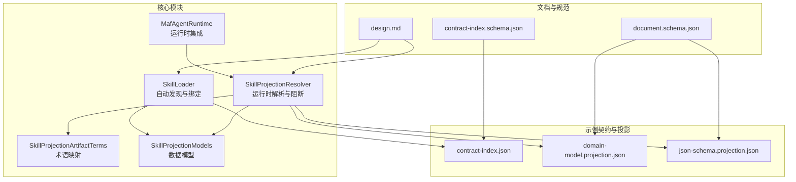
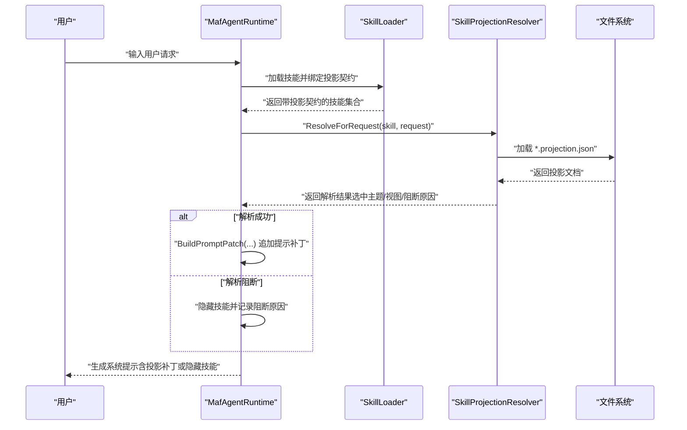
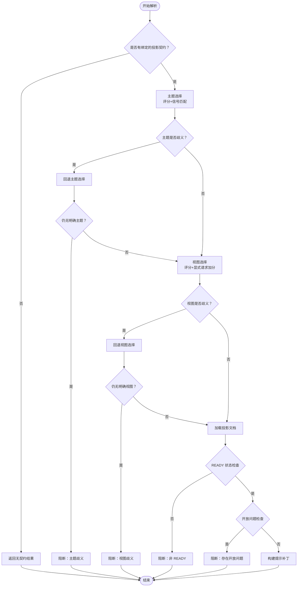
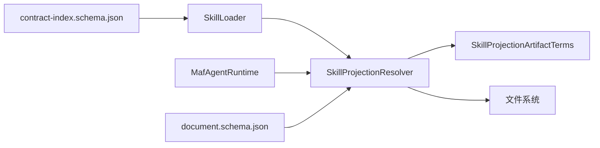

# 技能投影系统

<cite>
**本文引用的文件**
- [SkillProjectionResolver.cs](file://src/OpenClaw.Core/Skills/SkillProjectionResolver.cs)
- [SkillProjectionArtifactTerms.cs](file://src/OpenClaw.Core/Skills/SkillProjectionArtifactTerms.cs)
- [SkillModels.cs](file://src/OpenClaw.Core/Models/SkillProjectionModels.cs)
- [SkillLoader.cs](file://src/OpenClaw.Core/Skills/SkillLoader.cs)
- [MafAgentRuntime.cs](file://src/OpenClaw.Agent/MafAgentRuntime.cs)
- [skill-projection-contracts-design.md](file://docs/skill-projection-contracts-design.md)
- [skill-projection-contract-index.schema.json](file://docs/skill-projection-contract-index.schema.json)
- [skill-projection-document.schema.json](file://docs/skill-projection-document.schema.json)
- [contract-index.json](file://src/OpenClaw.Gateway/skills/software-developer/contracts/projections/ontology_extraction/contract-index.json)
- [skill-loading.domain-model.projection.json](file://src/OpenClaw.Gateway/skills/software-developer/contracts/projections/ontology_extraction/skill-loading/skill-loading.domain-model.projection.json)
- [memory-session.json-schema.projection.json](file://src/OpenClaw.Gateway/skills/software-developer/contracts/projections/ontology_extraction/memory-session/memory-session.json-schema.projection.json)
</cite>

## 目录
1. [简介](#简介)
2. [项目结构](#项目结构)
3. [核心组件](#核心组件)
4. [架构总览](#架构总览)
5. [详细组件分析](#详细组件分析)
6. [依赖关系分析](#依赖关系分析)
7. [性能考虑](#性能考虑)
8. [故障排除指南](#故障排除指南)
9. [结论](#结论)
10. [附录](#附录)

## 简介
技能投影系统是 Kingcrab 技术栈中用于将“本体切片”（ontology slice）转化为可被技能运行时（runtime）直接消费的投影契约（projection contracts）的机制。其核心目标是：
- 将静态的投影资产从“人工阅读材料”转变为“运行时路由与阻断控制面”
- 在每次对话轮次中基于用户请求动态选择主题（topic）与交付视图（target view）
- 通过阻断检查（blocking checks）影响技能可见性，避免不安全或不明确的投影被使用
- 支持多生产者（producer）并存，并在同分情况下通过显式优先级（precedence）稳定决策

该系统围绕以下关键要素构建：
- 投影解析器（SkillProjectionResolver）：负责解析用户请求、选择主题与视图、加载投影文档并执行阻断检查
- 投影契约（Projection Contract Index 与 *.projection.json）：定义主题信号、视图信号、评分维度、默认选择策略与阻断规则
- 投影工件术语系统（SkillProjectionArtifactTerms）：为不同交付视图提供显式的产物术语映射，提升用户显式请求的识别能力
- 领域模型投影（domain-model）、JSON Schema 投影（json-schema）、工作流契约投影（workflow-contract）、提示约束投影（prompt-constraint）
- JSON Schema 规范与验证机制：通过 schema 文件保障契约与投影文档的结构一致性与可验证性

## 项目结构
技能投影系统涉及的代码与文档分布如下：
- 核心解析与模型
  - SkillProjectionResolver.cs：运行时解析器，负责路由选择、阻断检查与提示补丁构建
  - SkillProjectionArtifactTerms.cs：交付视图与产物术语映射
  - SkillProjectionModels.cs：投影契约与投影文档的数据模型
  - SkillLoader.cs：自动发现并绑定投影契约索引
  - MafAgentRuntime.cs：运行时集成点，按轮次动态应用投影补丁或隐藏技能
- 文档与规范
  - skill-projection-contracts-design.md：设计说明与演进历程
  - skill-projection-contract-index.schema.json：投影契约索引的 JSON Schema
  - skill-projection-document.schema.json：投影文档的 JSON Schema
- 示例与样例
  - contract-index.json：示例契约索引
  - skill-loading.domain-model.projection.json：领域模型投影示例
  - memory-session.json-schema.projection.json：JSON Schema 投影示例

**图表来源**
- [SkillLoader.cs](file://src/OpenClaw.Core/Skills/SkillLoader.cs)
- [SkillProjectionResolver.cs](file://src/OpenClaw.Core/Skills/SkillProjectionResolver.cs)
- [SkillProjectionArtifactTerms.cs](file://src/OpenClaw.Core/Skills/SkillProjectionArtifactTerms.cs)
- [SkillModels.cs](file://src/OpenClaw.Core/Models/SkillProjectionModels.cs)
- [MafAgentRuntime.cs](file://src/OpenClaw.Agent/MafAgentRuntime.cs)
- [skill-projection-contract-index.schema.json](file://docs/skill-projection-contract-index.schema.json)
- [skill-projection-document.schema.json](file://docs/skill-projection-document.schema.json)
- [contract-index.json](file://src/OpenClaw.Gateway/skills/software-developer/contracts/projections/ontology_extraction/contract-index.json)
- [skill-loading.domain-model.projection.json](file://src/OpenClaw.Gateway/skills/software-developer/contracts/projections/ontology_extraction/skill-loading/skill-loading.domain-model.projection.json)
- [memory-session.json-schema.projection.json](file://src/OpenClaw.Gateway/skills/software-developer/contracts/projections/ontology_extraction/memory-session/memory-session.json-schema.projection.json)

**章节来源**
- [SkillLoader.cs](file://src/OpenClaw.Core/Skills/SkillLoader.cs)
- [SkillProjectionResolver.cs](file://src/OpenClaw.Core/Skills/SkillProjectionResolver.cs)
- [SkillProjectionArtifactTerms.cs](file://src/OpenClaw.Core/Skills/SkillProjectionArtifactTerms.cs)
- [SkillModels.cs](file://src/OpenClaw.Core/Models/SkillProjectionModels.cs)
- [MafAgentRuntime.cs](file://src/OpenClaw.Agent/MafAgentRuntime.cs)
- [skill-projection-contracts-design.md](file://docs/skill-projection-contracts-design.md)
- [skill-projection-contract-index.schema.json](file://docs/skill-projection-contract-index.schema.json)
- [skill-projection-document.schema.json](file://docs/skill-projection-document.schema.json)
- [contract-index.json](file://src/OpenClaw.Gateway/skills/software-developer/contracts/projections/ontology_extraction/contract-index.json)
- [skill-loading.domain-model.projection.json](file://src/OpenClaw.Gateway/skills/software-developer/contracts/projections/ontology_extraction/skill-loading/skill-loading.domain-model.projection.json)
- [memory-session.json-schema.projection.json](file://src/OpenClaw.Gateway/skills/software-developer/contracts/projections/ontology_extraction/memory-session/memory-session.json-schema.projection.json)

## 核心组件
- 投影解析器（SkillProjectionResolver）
  - 输入：技能定义（含绑定的投影契约集合）、用户请求文本、日志器
  - 输出：技能投影解析结果（包含选中的主题、目标视图、投影文件路径与投影文档；或阻断原因）
  - 关键能力：主题选择、目标视图选择、阻断检查、提示补丁构建
- 投影工件术语系统（SkillProjectionArtifactTerms）
  - 提供不同目标视图（json-schema、workflow-contract、domain-model、prompt-constraint）对应的显式产物术语列表，增强用户显式请求的识别
- 数据模型（SkillProjectionModels）
  - 定义投影契约索引（ProjectionContractIndex）、主题与视图记录（ProjectionTopicRecord、ProjectionViewRecord）、评分维度（ProjectionScoreDimension）、提示投影（ProjectionPromptPayload）、投递工件（ProjectionDeliveryArtifact）等
- 投影契约加载器（SkillLoader）
  - 自动扫描技能目录下的投影契约索引文件，解析并绑定到技能定义中，同时记录发现诊断信息
- 运行时集成（MafAgentRuntime）
  - 在每轮对话中调用解析器，根据解析结果追加投影提示补丁或隐藏技能

**章节来源**
- [SkillProjectionResolver.cs](file://src/OpenClaw.Core/Skills/SkillProjectionResolver.cs)
- [SkillProjectionArtifactTerms.cs](file://src/OpenClaw.Core/Skills/SkillProjectionArtifactTerms.cs)
- [SkillModels.cs](file://src/OpenClaw.Core/Models/SkillProjectionModels.cs)
- [SkillLoader.cs](file://src/OpenClaw.Core/Skills/SkillLoader.cs)
- [MafAgentRuntime.cs](file://src/OpenClaw.Agent/MafAgentRuntime.cs)

## 架构总览
技能投影系统的整体架构由“契约发现与绑定”、“运行时解析与阻断”、“提示补丁注入”三层构成，形成从“静态资产”到“动态路由”的闭环。

**图表来源**
- [MafAgentRuntime.cs](file://src/OpenClaw.Agent/MafAgentRuntime.cs)
- [SkillLoader.cs](file://src/OpenClaw.Core/Skills/SkillLoader.cs)
- [SkillProjectionResolver.cs](file://src/OpenClaw.Core/Skills/SkillProjectionResolver.cs)

## 详细组件分析

### 投影解析器（SkillProjectionResolver）
- 主要职责
  - 解析用户请求，选择主题与目标视图
  - 加载并解析投影文档
  - 执行阻断检查（如非 READY、存在开放问题、文件缺失或解析失败）
  - 构建提示补丁，向系统提示追加投影路由信息
- 解析流程
  - 主题选择：基于主题评分维度与信号匹配，计算每个主题的得分，若前两名差距小于阈值则视为歧义
  - 目标视图选择：在选定主题内进行视图评分，支持显式用户产物请求加分、主题内覆盖奖励、默认视图奖励等
  - 阻断检查：若视图状态非 READY、存在开放问题、文件不存在或解析失败则阻断
  - 结果合并：按分数与生产者优先级排序，处理歧义场景
- 提示补丁构建：将选中的主题、视图、投影源、允许术语、禁止假设、所需澄清、推理路径、来源摘要、投递工件等信息格式化为提示补丁

**图表来源**
- [SkillProjectionResolver.cs](file://src/OpenClaw.Core/Skills/SkillProjectionResolver.cs)

**章节来源**
- [SkillProjectionResolver.cs](file://src/OpenClaw.Core/Skills/SkillProjectionResolver.cs)
- [SkillProjectionArtifactTerms.cs](file://src/OpenClaw.Core/Skills/SkillProjectionArtifactTerms.cs)

### 投影工件术语系统
- 作用：为不同目标视图提供显式产物术语映射，帮助解析器在用户显式请求“JSON Schema”“工作流契约”“领域模型”“提示约束”等时给予额外加分
- 支持的视图键：json-schema、workflow-contract、domain-model、prompt-constraint
- 术语映射：针对每种视图返回一组稳定的关键词集合，确保用户表达的一致性与稳定性

**章节来源**
- [SkillProjectionArtifactTerms.cs](file://src/OpenClaw.Core/Skills/SkillProjectionArtifactTerms.cs)

### 领域模型投影（domain-model）
- 目标：为软件开发者提供稳定的领域模型与提示策略契约，避免重复推导本体语义
- 关键点：概念映射（concept_mappings）、关系映射（relation_mappings）、约束映射（constraint_mappings）、提示投影（prompt_projection）、投递工件（delivery_artifacts）
- 示例：skill-loading.domain-model.projection.json 展示了如何将本体切片映射到 C# 领域模型与提示策略

**章节来源**
- [skill-loading.domain-model.projection.json](file://src/OpenClaw.Gateway/skills/software-developer/contracts/projections/ontology_extraction/skill-loading/skill-loading.domain-model.projection.json)

### JSON Schema 投影（json-schema）
- 目标：为内存/会话配置、持久化负载与保留请求验证提供 JSON Schema 合约
- 关键点：将概念、关系与约束映射到 JSON Schema 定义，确保运行时验证与可审计性
- 示例：memory-session.json-schema.projection.json 展示了如何生成可复用的 JSON Schema 定义与依赖规则

**章节来源**
- [memory-session.json-schema.projection.json](file://src/OpenClaw.Gateway/skills/software-developer/contracts/projections/ontology_extraction/memory-session/memory-session.json-schema.projection.json)

### 工作流契约投影（workflow-contract）
- 目标：在请求强调执行流程、步骤顺序、网关条件时，优先选择工作流契约投影
- 关键点：通过主题内覆盖奖励与显式请求加分，引导解析器在合适场景选择工作流视图

**章节来源**
- [contract-index.json](file://src/OpenClaw.Gateway/skills/software-developer/contracts/projections/ontology_extraction/contract-index.json)

### 提示约束投影（prompt-constraint）
- 目标：在请求偏向指导、策略或审查语言而非可执行工件时，优先选择提示约束投影
- 关键点：通过显式请求加分与默认视图奖励，确保在“指导性”需求场景下提供合适的提示约束

**章节来源**
- [contract-index.json](file://src/OpenClaw.Gateway/skills/software-developer/contracts/projections/ontology_extraction/contract-index.json)

### 投影契约的设计原则与 JSON Schema 规范
- 设计原则
  - 最小接线：将“主题选择 -> 目标视图选择 -> 投影加载 -> 阻断检查”接入现有运行时，避免在重载阶段静态固化
  - 多生产者并存：支持同一技能消费多个生产者的投影契约，并在同分场景下通过生产者优先级稳定决策
  - 明确阻断：当无法安全选择路由时，必须阻断或隐藏技能，而非伪造投影
- JSON Schema 规范
  - 契约索引 schema：定义 producer_skill、producer_priority、topic_scoring、target_view_scoring、topics 等字段
  - 投影文档 schema：定义 mapping_policy、prompt_projection、delivery_artifacts、dropped_items、open_questions 等字段
  - 验证建议：先用编辑器诊断，再检查 $schema 路径，最后在具备工具时进行显式 schema 校验

**章节来源**
- [skill-projection-contracts-design.md](file://docs/skill-projection-contracts-design.md)
- [skill-projection-contract-index.schema.json](file://docs/skill-projection-contract-index.schema.json)
- [skill-projection-document.schema.json](file://docs/skill-projection-document.schema.json)

## 依赖关系分析
- 组件耦合
  - SkillLoader 与 SkillProjectionResolver：Loader 负责绑定契约元数据，Resolver 负责运行时解析
  - SkillProjectionResolver 与 SkillProjectionArtifactTerms：Resolver 依赖术语映射增强显式请求识别
  - MafAgentRuntime 与 SkillProjectionResolver：Runtime 在每轮对话中调用解析器并应用结果
- 外部依赖
  - JSON Schema：契约索引与投影文档通过 $schema 字段引用官方 schema，确保结构一致性
  - 文件系统：Resolver 通过根路径与视图路径组合定位投影文件

**图表来源**
- [SkillLoader.cs](file://src/OpenClaw.Core/Skills/SkillLoader.cs)
- [SkillProjectionResolver.cs](file://src/OpenClaw.Core/Skills/SkillProjectionResolver.cs)
- [SkillProjectionArtifactTerms.cs](file://src/OpenClaw.Core/Skills/SkillProjectionArtifactTerms.cs)
- [MafAgentRuntime.cs](file://src/OpenClaw.Agent/MafAgentRuntime.cs)
- [skill-projection-contract-index.schema.json](file://docs/skill-projection-contract-index.schema.json)
- [skill-projection-document.schema.json](file://docs/skill-projection-document.schema.json)

**章节来源**
- [SkillLoader.cs](file://src/OpenClaw.Core/Skills/SkillLoader.cs)
- [SkillProjectionResolver.cs](file://src/OpenClaw.Core/Skills/SkillProjectionResolver.cs)
- [SkillProjectionArtifactTerms.cs](file://src/OpenClaw.Core/Skills/SkillProjectionArtifactTerms.cs)
- [MafAgentRuntime.cs](file://src/OpenClaw.Agent/MafAgentRuntime.cs)
- [skill-projection-contract-index.schema.json](file://docs/skill-projection-contract-index.schema.json)
- [skill-projection-document.schema.json](file://docs/skill-projection-document.schema.json)

## 性能考虑
- 评分与匹配复杂度
  - 主题与视图评分基于信号匹配，时间复杂度与请求文本长度、信号列表长度线性相关
  - 建议：保持信号列表简洁、避免冗余匹配；对高频请求可缓存标准化后的请求文本
- 文件 I/O
  - 投影文件加载为一次性操作，建议在运行时避免频繁重复解析；可通过缓存已解析文档降低开销
- 阻断检查
  - 非 READY、开放问题、文件缺失与解析失败的阻断检查为短路判断，成本较低
- 日志与诊断
  - 在调试模式下启用详细日志有助于定位歧义与回退路径，但需注意日志量对性能的影响

## 故障排除指南
- 常见阻断原因
  - 主题歧义：前两名主题得分差距过小，解析器返回歧义阻断
  - 视图歧义：选定主题内前两名视图得分差距过小，解析器返回歧义阻断
  - 非 READY：目标视图状态非 READY，解析器阻断
  - 开放问题：投影文档包含开放问题，且阻断策略要求阻断
  - 文件缺失或解析失败：投影文件不存在或 JSON 解析异常
- 排查步骤
  - 检查契约索引与投影文档的 $schema 路径是否正确
  - 使用编辑器进行 JSON 语法与字段校验
  - 在运行时查看 MafAgentRuntime 的阻断记录，确认技能被隐藏的原因
  - 验证 SkillProjectionArtifactTerms 的术语映射是否覆盖用户显式请求
- 建议
  - 为常用主题与视图提供清晰的信号与覆盖奖励，减少歧义
  - 在契约索引中设置合理的回退顺序（fallback_order_by_target_view），提高成功率
  - 对多生产者场景，合理设置生产者优先级，避免同分导致的歧义

**章节来源**
- [SkillProjectionResolver.cs](file://src/OpenClaw.Core/Skills/SkillProjectionResolver.cs)
- [MafAgentRuntime.cs](file://src/OpenClaw.Agent/MafAgentRuntime.cs)
- [skill-projection-contracts-design.md](file://docs/skill-projection-contracts-design.md)

## 结论
技能投影系统通过将“静态投影资产”转化为“运行时路由与阻断控制面”，实现了从“文档化约束”到“真实运行时闭环”的关键演进。其核心在于：
- 基于请求信号的主题与视图评分机制
- 多生产者并存与优先级稳定决策
- 明确的阻断检查与提示补丁注入
- JSON Schema 规范与验证保障

该系统不仅提升了技能选择的准确性与安全性，也为未来扩展（如诊断可观测性、Schema 明文化、生产者策略扩展等）奠定了坚实基础。

## 附录
- 配置选项
  - 技能加载配置（SkillsConfig）：启用/禁用技能系统、额外目录、捆绑技能、托管技能、工作区技能、热重载等
  - 投影选择策略（ProjectionSelectionPolicy）：优先 READY、阻断开放问题、回退视图顺序、多视图分辨率提示
- 运行时集成点
  - MafAgentRuntime.ResolveSkillsForTurn：每轮对话中调用解析器并应用结果
- 示例与样例
  - contract-index.json：示例契约索引，定义主题与视图信号、评分维度与默认策略
  - *.projection.json：示例投影文档，包含映射策略、提示投影、投递工件与开放问题

**章节来源**
- [SkillLoader.cs](file://src/OpenClaw.Core/Skills/SkillLoader.cs)
- [SkillProjectionResolver.cs](file://src/OpenClaw.Core/Skills/SkillProjectionResolver.cs)
- [contract-index.json](file://src/OpenClaw.Gateway/skills/software-developer/contracts/projections/ontology_extraction/contract-index.json)
- [skill-loading.domain-model.projection.json](file://src/OpenClaw.Gateway/skills/software-developer/contracts/projections/ontology_extraction/skill-loading/skill-loading.domain-model.projection.json)
- [memory-session.json-schema.projection.json](file://src/OpenClaw.Gateway/skills/software-developer/contracts/projections/ontology_extraction/memory-session/memory-session.json-schema.projection.json)