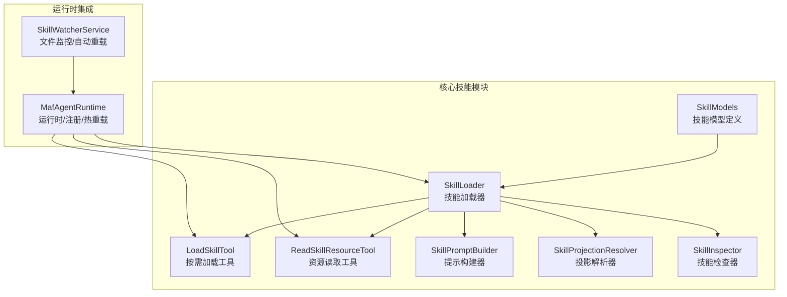
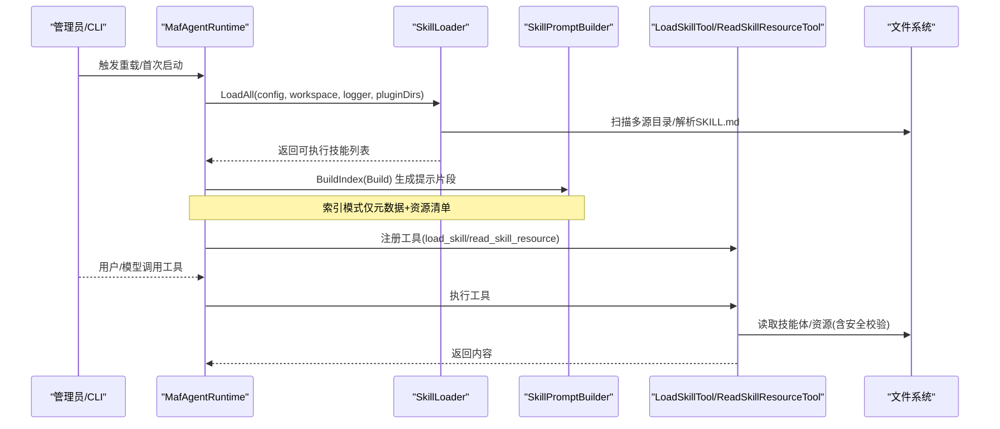
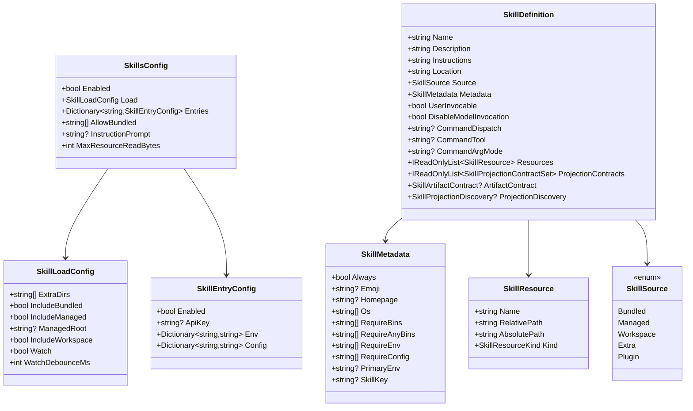
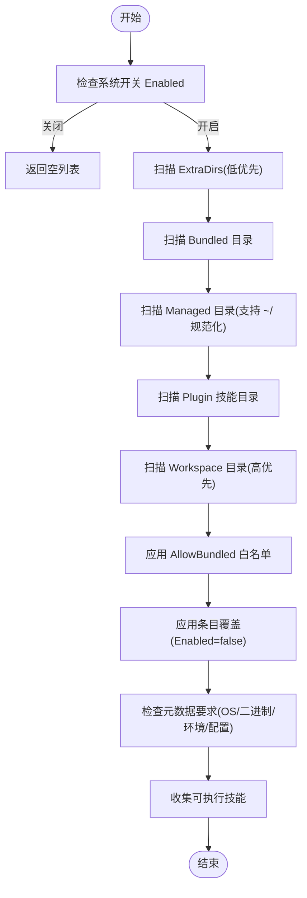
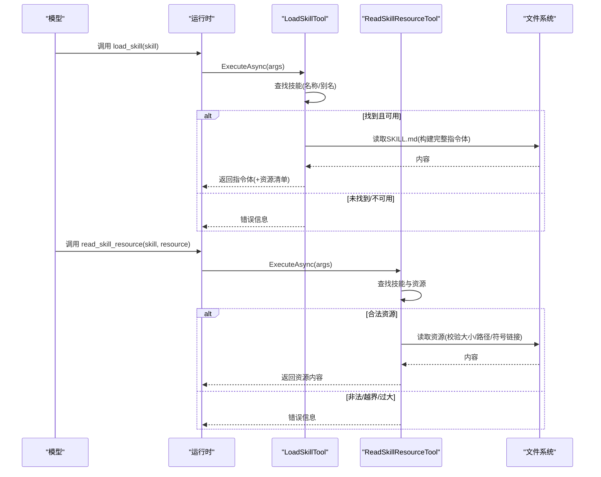
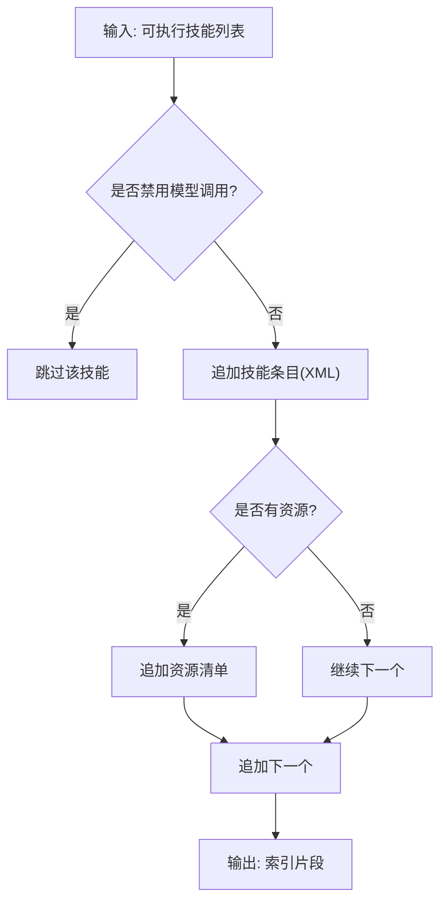
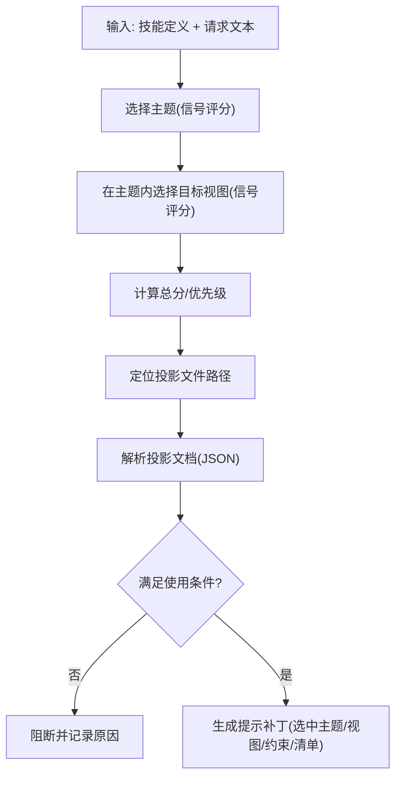
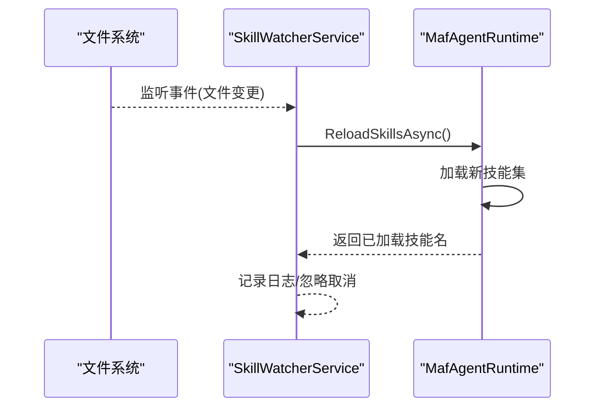
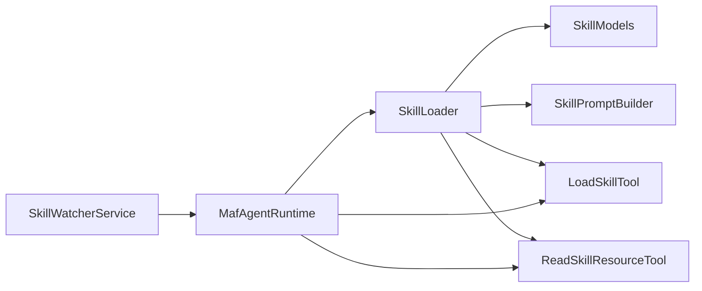

# 技能架构设计

<cite>
**本文引用的文件**
- [SkillModels.cs](file://src/OpenClaw.Core/Skills/SkillModels.cs)
- [SkillLoader.cs](file://src/OpenClaw.Core/Skills/SkillLoader.cs)
- [LoadSkillTool.cs](file://src/OpenClaw.Core/Skills/LoadSkillTool.cs)
- [ReadSkillResourceTool.cs](file://src/OpenClaw.Core/Skills/ReadSkillResourceTool.cs)
- [SkillPromptBuilder.cs](file://src/OpenClaw.Core/Skills/SkillPromptBuilder.cs)
- [SkillInspector.cs](file://src/OpenClaw.Core/Skills/SkillInspector.cs)
- [SkillProjectionResolver.cs](file://src/OpenClaw.Core/Skills/SkillProjectionResolver.cs)
- [MafAgentRuntime.cs](file://src/OpenClaw.Agent/MafAgentRuntime.cs)
- [SkillWatcherService.cs](file://src/OpenClaw.Gateway/SkillWatcherService.cs)
</cite>

## 目录
1. [简介](#简介)
2. [项目结构](#项目结构)
3. [核心组件](#核心组件)
4. [架构总览](#架构总览)
5. [详细组件分析](#详细组件分析)
6. [依赖关系分析](#依赖关系分析)
7. [性能考量](#性能考量)
8. [故障排查指南](#故障排查指南)
9. [结论](#结论)
10. [附录](#附录)

## 简介
本技术文档围绕技能系统的设计与实现，系统性阐述技能架构的整体思路、技能模型定义、技能加载与注册机制、工具链（按需加载与资源读取）、提示构建与投影解析等关键能力。重点覆盖以下方面：
- 技能模型：技能配置、元数据、资源清单与来源类型
- 加载策略：多源扫描、优先级覆盖、条件过滤与缓存优化
- 注册与生命周期：运行时热重载、文件监控与变更触发
- 进阶能力：投影解析、提示补丁生成与安全校验
- 错误处理与可观测性：日志、异常与边界保护

## 项目结构
技能系统位于 OpenClaw.Core 的 Skills 命名空间内，围绕“模型 + 加载器 + 工具 + 提示构建 + 投影解析”的分层组织，配合 Agent/Gateway 层完成注册与生命周期管理。

**图示来源**
- [SkillModels.cs:8-214](file://src/OpenClaw.Core/Skills/SkillModels.cs#L8-L214)
- [SkillLoader.cs:11-552](file://src/OpenClaw.Core/Skills/SkillLoader.cs#L11-L552)
- [LoadSkillTool.cs:17-165](file://src/OpenClaw.Core/Skills/LoadSkillTool.cs#L17-L165)
- [ReadSkillResourceTool.cs:21-340](file://src/OpenClaw.Core/Skills/ReadSkillResourceTool.cs#L21-L340)
- [SkillPromptBuilder.cs:9-354](file://src/OpenClaw.Core/Skills/SkillPromptBuilder.cs#L9-L354)
- [SkillProjectionResolver.cs:10-613](file://src/OpenClaw.Core/Skills/SkillProjectionResolver.cs#L10-L613)
- [MafAgentRuntime.cs:180-201](file://src/OpenClaw.Agent/MafAgentRuntime.cs#L180-L201)
- [SkillWatcherService.cs:240-257](file://src/OpenClaw.Gateway/SkillWatcherService.cs#L240-L257)

**章节来源**
- [SkillModels.cs:1-214](file://src/OpenClaw.Core/Skills/SkillModels.cs#L1-L214)
- [SkillLoader.cs:11-109](file://src/OpenClaw.Core/Skills/SkillLoader.cs#L11-L109)
- [SkillPromptBuilder.cs:9-145](file://src/OpenClaw.Core/Skills/SkillPromptBuilder.cs#L9-L145)
- [MafAgentRuntime.cs:180-201](file://src/OpenClaw.Agent/MafAgentRuntime.cs#L180-L201)

## 核心组件
- 技能配置与模型
  - SkillsConfig：顶层开关、加载策略、条目覆盖、提示模板与资源读取上限
  - SkillLoadConfig：额外目录、是否包含内置/托管/工作区/插件技能、文件监控与去抖参数
  - SkillEntryConfig：按技能键覆盖启用、环境变量注入与自定义配置
  - SkillDefinition：技能名称、描述、指令正文、来源、元数据、可用户调用性、命令派发、资源清单与投影契约
  - SkillMetadata：always、emoji、homepage、OS过滤、二进制/环境/配置要求、主环境变量与技能键
  - SkillResource：资源名、相对路径、绝对路径与种类（参考/脚本）
  - SkillSource：来源枚举（内置/托管/工作区/额外/插件）

- 加载器
  - 多源扫描与优先级覆盖（额外目录最低、工作区最高）
  - 条件过滤：allowBundled白名单、条目禁用、元数据要求（OS/二进制/环境/配置）
  - 资源发现：references/scripts 子目录扫描，仅列出不加载
  - 缓存优化：PATH二进制查找缓存，避免重复扫描

- 工具
  - load_skill：按需加载单个技能完整指令体，支持返回资源清单
  - read_skill_resource：按需读取单个辅助资源，带路径合法性与大小限制

- 提示构建
  - 索引模式：仅元数据+资源清单，配合工具按需拉取
  - 全量模式：索引+每个技能的完整指令体
  - 成本估算：提供字符成本估算方法，便于预算控制

- 投影解析（Kingcrab扩展）
  - 基于请求文本选择主题与目标视图，输出投影文档与提示补丁
  - 支持阻断策略、优先级与回退顺序

**章节来源**
- [SkillModels.cs:8-214](file://src/OpenClaw.Core/Skills/SkillModels.cs#L8-L214)
- [SkillLoader.cs:17-109](file://src/OpenClaw.Core/Skills/SkillLoader.cs#L17-L109)
- [LoadSkillTool.cs:17-75](file://src/OpenClaw.Core/Skills/LoadSkillTool.cs#L17-L75)
- [ReadSkillResourceTool.cs:21-128](file://src/OpenClaw.Core/Skills/ReadSkillResourceTool.cs#L21-L128)
- [SkillPromptBuilder.cs:9-145](file://src/OpenClaw.Core/Skills/SkillPromptBuilder.cs#L9-L145)
- [SkillProjectionResolver.cs:10-67](file://src/OpenClaw.Core/Skills/SkillProjectionResolver.cs#L10-L67)

## 架构总览
技能系统采用“模型驱动 + 按需加载 + 安全约束”的设计，通过加载器统一收集与筛选技能，再由提示构建器输出给模型；模型通过工具按需拉取技能体或资源，确保提示长度可控与资源访问安全。

**图示来源**
- [MafAgentRuntime.cs:180-201](file://src/OpenClaw.Agent/MafAgentRuntime.cs#L180-L201)
- [SkillLoader.cs:17-109](file://src/OpenClaw.Core/Skills/SkillLoader.cs#L17-L109)
- [SkillPromptBuilder.cs:110-145](file://src/OpenClaw.Core/Skills/SkillPromptBuilder.cs#L110-L145)
- [LoadSkillTool.cs:43-75](file://src/OpenClaw.Core/Skills/LoadSkillTool.cs#L43-L75)
- [ReadSkillResourceTool.cs:52-128](file://src/OpenClaw.Core/Skills/ReadSkillResourceTool.cs#L52-L128)

## 详细组件分析

### 技能模型与数据结构
技能系统以强类型的模型描述技能的元数据、来源与资源，保证跨模块的一致性与可维护性。

**图示来源**
- [SkillModels.cs:8-214](file://src/OpenClaw.Core/Skills/SkillModels.cs#L8-L214)

**章节来源**
- [SkillModels.cs:8-214](file://src/OpenClaw.Core/Skills/SkillModels.cs#L8-L214)

### 技能加载器与注册机制
SkillLoader 负责从多源目录扫描、解析、过滤并生成可执行技能集合；随后由运行时注册工具与提示片段。

**图示来源**
- [SkillLoader.cs:17-109](file://src/OpenClaw.Core/Skills/SkillLoader.cs#L17-L109)

**章节来源**
- [SkillLoader.cs:17-109](file://src/OpenClaw.Core/Skills/SkillLoader.cs#L17-L109)
- [SkillLoader.cs:111-155](file://src/OpenClaw.Core/Skills/SkillLoader.cs#L111-L155)
- [SkillLoader.cs:160-208](file://src/OpenClaw.Core/Skills/SkillLoader.cs#L160-L208)
- [SkillLoader.cs:213-323](file://src/OpenClaw.Core/Skills/SkillLoader.cs#L213-L323)
- [SkillLoader.cs:329-384](file://src/OpenClaw.Core/Skills/SkillLoader.cs#L329-L384)
- [SkillLoader.cs:390-436](file://src/OpenClaw.Core/Skills/SkillLoader.cs#L390-L436)
- [SkillLoader.cs:441-493](file://src/OpenClaw.Core/Skills/SkillLoader.cs#L441-L493)
- [SkillLoader.cs:506-536](file://src/OpenClaw.Core/Skills/SkillLoader.cs#L506-L536)

### 按需加载与资源读取工具
- load_skill：根据技能名精确匹配或别名匹配，返回技能完整指令体，必要时附带资源清单
- read_skill_resource：严格校验路径范围、大小限制与符号链接风险，拒绝跨技能路径与绝对路径

**图示来源**
- [LoadSkillTool.cs:43-75](file://src/OpenClaw.Core/Skills/LoadSkillTool.cs#L43-L75)
- [ReadSkillResourceTool.cs:52-128](file://src/OpenClaw.Core/Skills/ReadSkillResourceTool.cs#L52-L128)

**章节来源**
- [LoadSkillTool.cs:17-165](file://src/OpenClaw.Core/Skills/LoadSkillTool.cs#L17-L165)
- [ReadSkillResourceTool.cs:21-340](file://src/OpenClaw.Core/Skills/ReadSkillResourceTool.cs#L21-L340)

### 提示构建与成本估算
- 索引模式：仅输出技能元数据与资源清单，模型通过工具按需拉取
- 全量模式：输出索引+每个技能的完整指令体
- 成本估算：提供估算方法，便于预算控制与调试

**图示来源**
- [SkillPromptBuilder.cs:110-145](file://src/OpenClaw.Core/Skills/SkillPromptBuilder.cs#L110-L145)
- [SkillPromptBuilder.cs:168-196](file://src/OpenClaw.Core/Skills/SkillPromptBuilder.cs#L168-L196)

**章节来源**
- [SkillPromptBuilder.cs:9-354](file://src/OpenClaw.Core/Skills/SkillPromptBuilder.cs#L9-L354)

### 投影解析与提示补丁
- 主题与目标视图选择：基于信号权重与阈值评分，支持默认/回退策略
- 投影文档装载与校验：映射策略、提示投影、交付制品与开放问题
- 提示补丁生成：输出选中的主题、视图、约束与清单项

**图示来源**
- [SkillProjectionResolver.cs:12-67](file://src/OpenClaw.Core/Skills/SkillProjectionResolver.cs#L12-L67)
- [SkillProjectionResolver.cs:110-218](file://src/OpenClaw.Core/Skills/SkillProjectionResolver.cs#L110-L218)
- [SkillProjectionResolver.cs:399-452](file://src/OpenClaw.Core/Skills/SkillProjectionResolver.cs#L399-L452)
- [SkillProjectionResolver.cs:69-99](file://src/OpenClaw.Core/Skills/SkillProjectionResolver.cs#L69-L99)

**章节来源**
- [SkillProjectionResolver.cs:10-613](file://src/OpenClaw.Core/Skills/SkillProjectionResolver.cs#L10-L613)

### 生命周期管理与热重载
- 运行时重载：MafAgentRuntime 在收到重载请求后重新加载技能并更新工具注册
- 文件监控：SkillWatcherService 监控技能目录变化，触发运行时重载
- 热更新：通过工具提供者函数注入最新技能集，支持动态变更

**图示来源**
- [SkillWatcherService.cs:240-257](file://src/OpenClaw.Gateway/SkillWatcherService.cs#L240-L257)
- [MafAgentRuntime.cs:180-201](file://src/OpenClaw.Agent/MafAgentRuntime.cs#L180-L201)

**章节来源**
- [MafAgentRuntime.cs:180-201](file://src/OpenClaw.Agent/MafAgentRuntime.cs#L180-L201)
- [SkillWatcherService.cs:240-257](file://src/OpenClaw.Gateway/SkillWatcherService.cs#L240-L257)

## 依赖关系分析
- 组件耦合
  - SkillLoader 与 SkillModels：强依赖模型定义
  - LoadSkillTool/ReadSkillResourceTool 依赖 SkillLoader 的结果与提示构建器
  - MafAgentRuntime 依赖 SkillLoader 与工具注册
  - SkillWatcherService 依赖运行时重载接口
- 外部依赖
  - 文件系统：扫描、枚举、读取
  - 日志：统一记录加载、过滤与错误信息
  - 并发容器：PATH二进制查找缓存

**图示来源**
- [SkillLoader.cs:11-552](file://src/OpenClaw.Core/Skills/SkillLoader.cs#L11-L552)
- [SkillModels.cs:8-214](file://src/OpenClaw.Core/Skills/SkillModels.cs#L8-L214)
- [SkillPromptBuilder.cs:9-354](file://src/OpenClaw.Core/Skills/SkillPromptBuilder.cs#L9-L354)
- [LoadSkillTool.cs:17-165](file://src/OpenClaw.Core/Skills/LoadSkillTool.cs#L17-L165)
- [ReadSkillResourceTool.cs:21-340](file://src/OpenClaw.Core/Skills/ReadSkillResourceTool.cs#L21-L340)
- [MafAgentRuntime.cs:180-201](file://src/OpenClaw.Agent/MafAgentRuntime.cs#L180-L201)
- [SkillWatcherService.cs:240-257](file://src/OpenClaw.Gateway/SkillWatcherService.cs#L240-L257)

**章节来源**
- [SkillLoader.cs:11-552](file://src/OpenClaw.Core/Skills/SkillLoader.cs#L11-L552)
- [MafAgentRuntime.cs:180-201](file://src/OpenClaw.Agent/MafAgentRuntime.cs#L180-L201)

## 性能考量
- 加载阶段
  - 多源扫描：按优先级合并，高优先覆盖低优先，避免重复加载
  - 缓存优化：PATH二进制查找缓存减少IO
  - 资源扫描：仅枚举不读取，降低内存占用
- 提示构建
  - 索引模式显著降低提示长度，配合工具按需拉取
  - 成本估算方法用于预算控制与调试
- 工具执行
  - read_skill_resource 限制最大读取字节数，防止大文件冲击
  - 路径合法性与符号链接检测，避免越权与异常开销

[本节为通用性能建议，无需特定文件来源]

## 故障排查指南
- 加载失败
  - 检查 Enabled 开关与 AllowBundled 白名单
  - 核对条目覆盖（Enabled=false）与技能键别名
  - 查看元数据要求（OS/二进制/环境/配置）是否满足
- 资源读取错误
  - 确认资源路径在技能根下，拒绝跨技能与绝对路径
  - 检查文件大小是否超过 MaxResourceReadBytes
  - 排查符号链接与重解析点导致的路径异常
- 工具调用异常
  - load_skill：确认技能名存在且未禁用模型调用
  - read_skill_resource：确认资源在技能的资源清单中
- 运行时重载
  - 监控日志中“Reloaded N skills”与警告
  - 关注取消与异常路径，确保服务健康

**章节来源**
- [SkillLoader.cs:74-109](file://src/OpenClaw.Core/Skills/SkillLoader.cs#L74-L109)
- [ReadSkillResourceTool.cs:100-128](file://src/OpenClaw.Core/Skills/ReadSkillResourceTool.cs#L100-L128)
- [SkillWatcherService.cs:240-257](file://src/OpenClaw.Gateway/SkillWatcherService.cs#L240-L257)

## 结论
技能系统通过清晰的模型定义、稳健的加载策略与严格的工具安全约束，实现了可扩展、可演进、可观察的技能生态。结合索引模式与投影解析，既能控制提示成本，又能针对具体场景进行精细化引导。运行时热重载与文件监控进一步提升了开发与运维效率。

[本节为总结性内容，无需特定文件来源]

## 附录
- 技能检查器：用于本地包检查与诊断
- 投影术语：为特定视图识别显式请求术语

**章节来源**
- [SkillInspector.cs:6-110](file://src/OpenClaw.Core/Skills/SkillInspector.cs#L6-L110)
- [SkillProjectionResolver.cs:496-498](file://src/OpenClaw.Core/Skills/SkillProjectionResolver.cs#L496-L498)