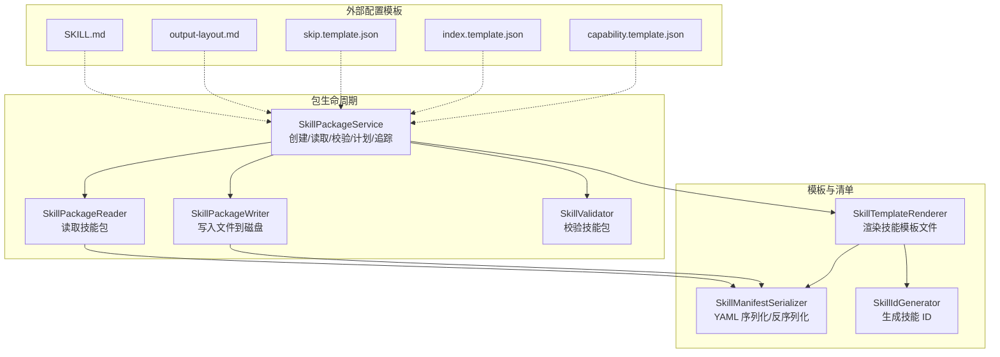
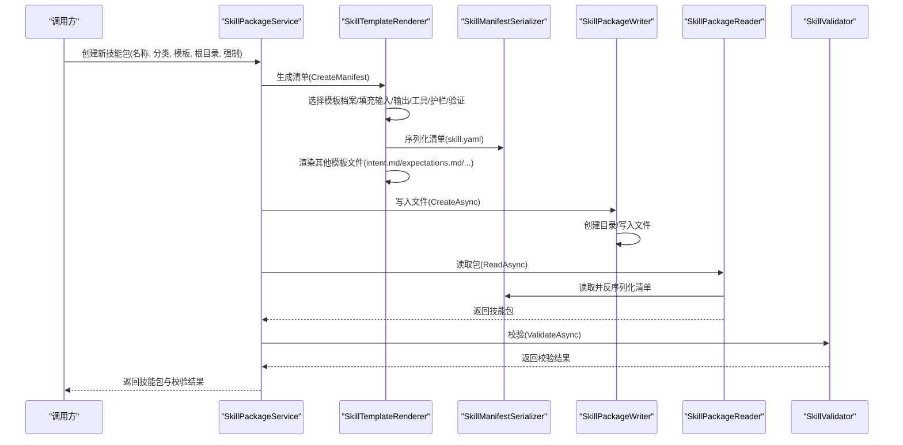
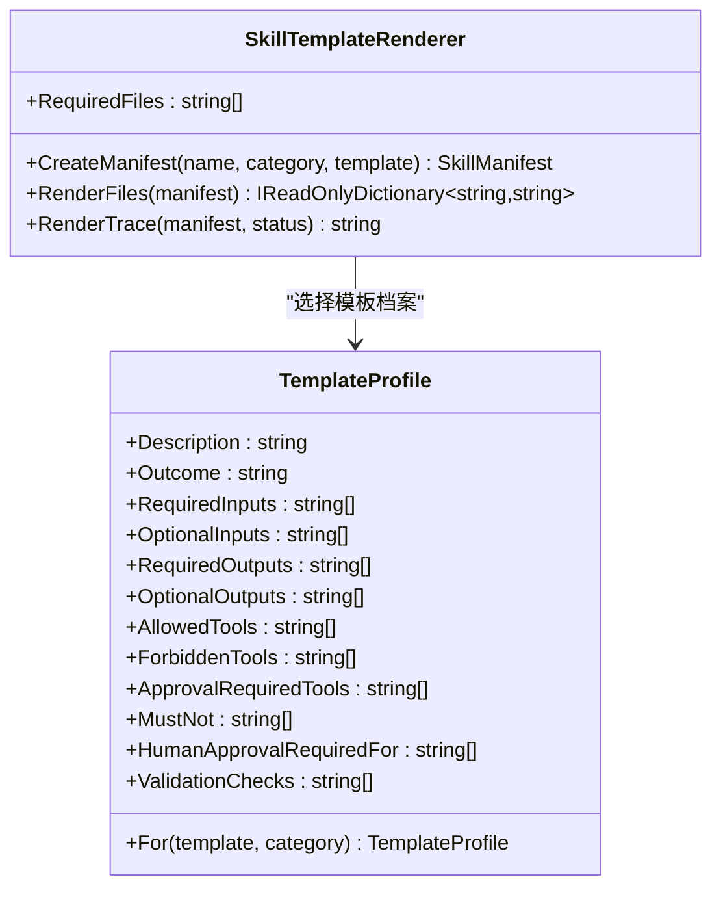
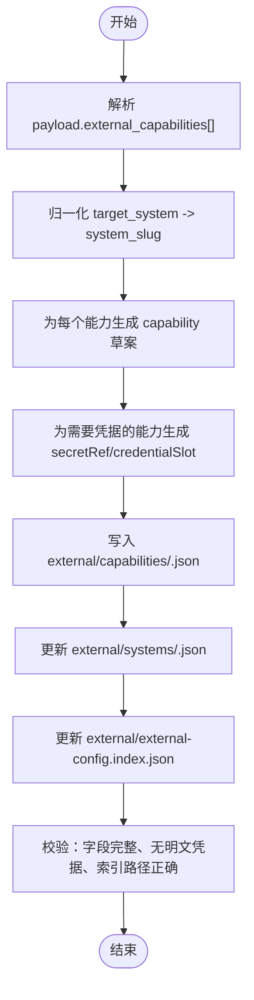
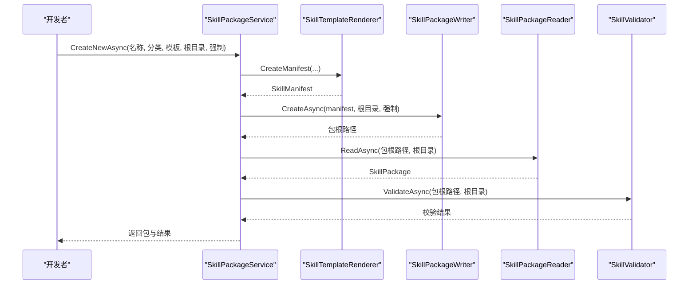
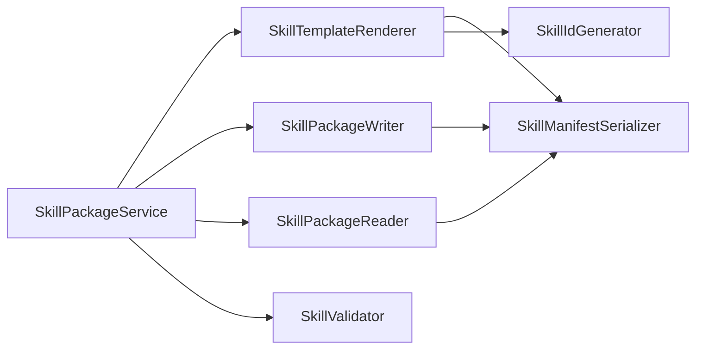

# 技能模板系统

<cite>
**本文引用的文件**
- [SkillTemplateRenderer.cs](file://src/OpenClaw.SkillKit/SkillTemplateRenderer.cs)
- [SkillPackageService.cs](file://src/OpenClaw.SkillKit/SkillPackageService.cs)
- [SkillPackageWriter.cs](file://src/OpenClaw.SkillKit/SkillPackageWriter.cs)
- [SkillPackageReader.cs](file://src/OpenClaw.SkillKit/SkillPackageReader.cs)
- [SkillValidator.cs](file://src/OpenClaw.SkillKit/SkillValidator.cs)
- [SkillManifestSerializer.cs](file://src/OpenClaw.SkillKit/SkillManifestSerializer.cs)
- [SkillIdGenerator.cs](file://src/OpenClaw.SkillKit/SkillIdGenerator.cs)
- [SkillKitModels.cs](file://src/OpenClaw.SkillKit.Abstractions/SkillKitModels.cs)
- [capability.template.json](file://src/OpenClaw.Plugins.EmploymentCoachWorkflow/skills/external-config/templates/capability.template.json)
- [index.template.json](file://src/OpenClaw.Plugins.EmploymentCoachWorkflow/skills/external-config/templates/index.template.json)
- [skip.template.json](file://src/OpenClaw.Plugins.EmploymentCoachWorkflow/skills/external-config/templates/skip.template.json)
- [output-layout.md](file://src/OpenClaw.Plugins.EmploymentCoachWorkflow/skills/external-config/references/output-layout.md)
- [SKILL.md](file://src/OpenClaw.Plugins.EmploymentCoachWorkflow/skills/external-config/SKILL.md)
- [SkillPromptBuilder.cs](file://src/OpenClaw.Core/Skills/SkillPromptBuilder.cs)
</cite>

## 目录
1. [简介](#简介)
2. [项目结构](#项目结构)
3. [核心组件](#核心组件)
4. [架构总览](#架构总览)
5. [详细组件分析](#详细组件分析)
6. [依赖关系分析](#依赖关系分析)
7. [性能考量](#性能考量)
8. [故障排查指南](#故障排查指南)
9. [结论](#结论)
10. [附录](#附录)

## 简介
本技术文档围绕“技能模板系统”展开，系统由模板渲染引擎、模板语法与变量系统、模板文件集合以及配套工具链组成。其目标是：
- 提供标准化的技能模板，快速生成符合规范的技能包（含清单、意图、期望、工作流、工具策略、护栏、验证、示例与追踪等文件）。
- 支持外部系统集成的模板（如 capability、index、skip），用于生成外部配置索引与能力声明，确保安全与合规。
- 提供模板变量替换、条件渲染与循环处理的机制说明，并给出最佳实践、复用策略与版本管理建议。

## 项目结构
技能模板系统主要位于以下模块与文件中：
- 渲染与工具链：SkillKit（模板渲染、清单序列化、包读写、校验、运行计划与追踪）
- 模板文件：external-config 模板（capability、index、skip）
- 外部配置输出布局与执行流程参考文档
- 核心模型：SkillKit.Abstractions（清单、工作流步骤、验证结果等）

图表来源
- [SkillTemplateRenderer.cs:1-363](file://src/OpenClaw.SkillKit/SkillTemplateRenderer.cs#L1-L363)
- [SkillPackageService.cs:1-36](file://src/OpenClaw.SkillKit/SkillPackageService.cs#L1-L36)
- [SkillPackageWriter.cs:1-30](file://src/OpenClaw.SkillKit/SkillPackageWriter.cs#L1-L30)
- [SkillPackageReader.cs:1-113](file://src/OpenClaw.SkillKit/SkillPackageReader.cs#L1-L113)
- [SkillValidator.cs:1-124](file://src/OpenClaw.SkillKit/SkillValidator.cs#L1-L124)
- [SkillManifestSerializer.cs:1-32](file://src/OpenClaw.SkillKit/SkillManifestSerializer.cs#L1-L32)
- [SkillIdGenerator.cs:1-62](file://src/OpenClaw.SkillKit/SkillIdGenerator.cs#L1-L62)
- [capability.template.json:1-39](file://src/OpenClaw.Plugins.EmploymentCoachWorkflow/skills/external-config/templates/capability.template.json#L1-L39)
- [index.template.json:1-40](file://src/OpenClaw.Plugins.EmploymentCoachWorkflow/skills/external-config/templates/index.template.json#L1-L40)
- [skip.template.json:1-14](file://src/OpenClaw.Plugins.EmploymentCoachWorkflow/skills/external-config/templates/skip.template.json#L1-L14)
- [output-layout.md:1-128](file://src/OpenClaw.Plugins.EmploymentCoachWorkflow/skills/external-config/references/output-layout.md#L1-L128)
- [SKILL.md:134-206](file://src/OpenClaw.Plugins.EmploymentCoachWorkflow/skills/external-config/SKILL.md#L134-L206)

章节来源
- [SkillTemplateRenderer.cs:1-363](file://src/OpenClaw.SkillKit/SkillTemplateRenderer.cs#L1-L363)
- [SkillPackageService.cs:1-36](file://src/OpenClaw.SkillKit/SkillPackageService.cs#L1-L36)
- [SkillPackageWriter.cs:1-30](file://src/OpenClaw.SkillKit/SkillPackageWriter.cs#L1-L30)
- [SkillPackageReader.cs:1-113](file://src/OpenClaw.SkillKit/SkillPackageReader.cs#L1-L113)
- [SkillValidator.cs:1-124](file://src/OpenClaw.SkillKit/SkillValidator.cs#L1-L124)
- [SkillManifestSerializer.cs:1-32](file://src/OpenClaw.SkillKit/SkillManifestSerializer.cs#L1-L32)
- [SkillIdGenerator.cs:1-62](file://src/OpenClaw.SkillKit/SkillIdGenerator.cs#L1-L62)
- [capability.template.json:1-39](file://src/OpenClaw.Plugins.EmploymentCoachWorkflow/skills/external-config/templates/capability.template.json#L1-L39)
- [index.template.json:1-40](file://src/OpenClaw.Plugins.EmploymentCoachWorkflow/skills/external-config/templates/index.template.json#L1-L40)
- [skip.template.json:1-14](file://src/OpenClaw.Plugins.EmploymentCoachWorkflow/skills/external-config/templates/skip.template.json#L1-L14)
- [output-layout.md:1-128](file://src/OpenClaw.Plugins.EmploymentCoachWorkflow/skills/external-config/references/output-layout.md#L1-L128)
- [SKILL.md:134-206](file://src/OpenClaw.Plugins.EmploymentCoachWorkflow/skills/external-config/SKILL.md#L134-L206)

## 核心组件
- 模板渲染器（SkillTemplateRenderer）
  - 负责根据模板类别/分类生成技能清单（SkillManifest），并渲染一组标准文件（如 intent.md、expectations.md、workflow.yaml、tools.yaml、guardrails.md、validation.md、examples.md、trace.md）。
  - 内置多种模板档案（通用、研究、提案、合规、运营、软件），按模板名或分类选择默认输入/输出、工具策略、护栏、审批要求与验证检查。
- 清单序列化器（SkillManifestSerializer）
  - 将 SkillManifest 序列化为 YAML 文本，同时支持从 YAML 读取还原为对象。
- 技能包服务（SkillPackageService）
  - 组合渲染、写入、读取、校验、运行计划与追踪更新等能力，提供创建新技能包的统一入口。
- 技能包写入器（SkillPackageWriter）
  - 将渲染后的文件写入磁盘，确保目录存在、覆盖行为受控。
- 技能包读取器（SkillPackageReader）
  - 从磁盘读取技能包，解析清单并收集已存在的模板文件。
- 校验器（SkillValidator）
  - 对技能包进行完整性与一致性校验，包括清单关键字段、工作流步骤、工具策略冲突等。
- ID 生成器（SkillIdGenerator）
  - 将用户提供的技能名称规范化为稳定的 ID，便于目录命名与引用。
- 外部配置模板（capability/index/skip）
  - 用于生成 external-config 目录下的能力声明、系统聚合与索引文件，遵循安全与合规约束。

章节来源
- [SkillTemplateRenderer.cs:21-57](file://src/OpenClaw.SkillKit/SkillTemplateRenderer.cs#L21-L57)
- [SkillManifestSerializer.cs:21-32](file://src/OpenClaw.SkillKit/SkillManifestSerializer.cs#L21-L32)
- [SkillPackageService.cs:29-34](file://src/OpenClaw.SkillKit/SkillPackageService.cs#L29-L34)
- [SkillPackageWriter.cs:9-25](file://src/OpenClaw.SkillKit/SkillPackageWriter.cs#L9-L25)
- [SkillPackageReader.cs:9-31](file://src/OpenClaw.SkillKit/SkillPackageReader.cs#L9-L31)
- [SkillValidator.cs:7-78](file://src/OpenClaw.SkillKit/SkillValidator.cs#L7-L78)
- [SkillIdGenerator.cs:8-29](file://src/OpenClaw.SkillKit/SkillIdGenerator.cs#L8-L29)
- [capability.template.json:1-39](file://src/OpenClaw.Plugins.EmploymentCoachWorkflow/skills/external-config/templates/capability.template.json#L1-L39)
- [index.template.json:1-40](file://src/OpenClaw.Plugins.EmploymentCoachWorkflow/skills/external-config/templates/index.template.json#L1-L40)
- [skip.template.json:1-14](file://src/OpenClaw.Plugins.EmploymentCoachWorkflow/skills/external-config/templates/skip.template.json#L1-L14)

## 架构总览
模板系统采用“清单驱动 + 文件渲染 + 包管理”的分层架构：
- 上层：SkillPackageService 提供统一 API，协调渲染、写入、读取与校验。
- 中层：SkillTemplateRenderer 负责模板选择与文件渲染；SkillManifestSerializer 负责清单的 YAML 序列化。
- 下层：SkillPackageWriter/Reader 负责文件系统操作；SkillValidator 负责规则校验；SkillIdGenerator 负责命名规范。

图表来源
- [SkillPackageService.cs:29-34](file://src/OpenClaw.SkillKit/SkillPackageService.cs#L29-L34)
- [SkillTemplateRenderer.cs:21-73](file://src/OpenClaw.SkillKit/SkillTemplateRenderer.cs#L21-L73)
- [SkillManifestSerializer.cs:8-19](file://src/OpenClaw.SkillKit/SkillManifestSerializer.cs#L8-L19)
- [SkillPackageWriter.cs:9-25](file://src/OpenClaw.SkillKit/SkillPackageWriter.cs#L9-L25)
- [SkillPackageReader.cs:9-31](file://src/OpenClaw.SkillKit/SkillPackageReader.cs#L9-L31)
- [SkillValidator.cs:7-78](file://src/OpenClaw.SkillKit/SkillValidator.cs#L7-L78)

## 详细组件分析

### 模板渲染引擎（SkillTemplateRenderer）
- 模板选择与变量系统
  - 根据模板名与分类选择模板档案（Generic/Research/Proposal/Compliance/Operations/Software），自动填充输入/输出、工具策略、护栏、审批要求与验证检查。
  - 渲染函数使用字符串插值方式，将清单字段注入到各模板文件中（例如在 intent.md 中注入 Outcome、Required Inputs、Expected Outputs 等）。
- 文件渲染清单
  - 必需文件集合：skill.yaml、intent.md、expectations.md、workflow.yaml、tools.yaml、guardrails.md、validation.md、examples.md、trace.md。
  - RenderFiles 返回字典，键为文件名，值为渲染后的文本。
- 追踪文件（trace.md）
  - 记录技能 ID、名称、版本、生成文件清单、开放决策、验证状态与运行历史占位。
- 默认工作流
  - 包含收集输入、分析源材料、草拟输出、验证输出、请求人工审核等步骤。

图表来源
- [SkillTemplateRenderer.cs:8-57](file://src/OpenClaw.SkillKit/SkillTemplateRenderer.cs#L8-L57)
- [SkillTemplateRenderer.cs:254-361](file://src/OpenClaw.SkillKit/SkillTemplateRenderer.cs#L254-L361)

章节来源
- [SkillTemplateRenderer.cs:21-103](file://src/OpenClaw.SkillKit/SkillTemplateRenderer.cs#L21-L103)
- [SkillTemplateRenderer.cs:59-73](file://src/OpenClaw.SkillKit/SkillTemplateRenderer.cs#L59-L73)
- [SkillTemplateRenderer.cs:75-103](file://src/OpenClaw.SkillKit/SkillTemplateRenderer.cs#L75-L103)
- [SkillTemplateRenderer.cs:105-115](file://src/OpenClaw.SkillKit/SkillTemplateRenderer.cs#L105-L115)
- [SkillTemplateRenderer.cs:254-361](file://src/OpenClaw.SkillKit/SkillTemplateRenderer.cs#L254-L361)

### 外部配置模板（capability/index/skip）
- capability.template.json
  - 描述单个外部系统能力，包含 schemaVersion、artifactType、todoId、kind、category、objective、targetSystem、integrationMethods、linkedSkills、auth（含 secretRef/credentialSlot/bindingStatus/value）、fields（required/mapping）、acceptance、sourceDigest、status、validation 等字段。
  - 用于生成 external/capabilities/<handoff-id>.json。
- index.template.json
  - 描述外部配置索引，包含 generatedFrom（sourceDispatchTarget/todoIds）、systems（系统聚合）、capabilities（能力清单）、skips（跳过记录）、validation 摘要等。
  - 用于生成 external/external-config.index.json。
- skip.template.json
  - 描述跳过外部系统的记录，包含 kind: skip、reason、sourceDigest、status、validation 等字段。
  - 用于生成 external/capabilities/<handoff-id>.json 中的 skip 条目。
- 输出布局与执行流程
  - 参考 output-layout.md 与 SKILL.md，明确 external/ 目录结构、文件路径规范、安全红线与质量自检要点。

图表来源
- [capability.template.json:1-39](file://src/OpenClaw.Plugins.EmploymentCoachWorkflow/skills/external-config/templates/capability.template.json#L1-L39)
- [index.template.json:1-40](file://src/OpenClaw.Plugins.EmploymentCoachWorkflow/skills/external-config/templates/index.template.json#L1-L40)
- [skip.template.json:1-14](file://src/OpenClaw.Plugins.EmploymentCoachWorkflow/skills/external-config/templates/skip.template.json#L1-L14)
- [output-layout.md:1-128](file://src/OpenClaw.Plugins.EmploymentCoachWorkflow/skills/external-config/references/output-layout.md#L1-L128)
- [SKILL.md:134-206](file://src/OpenClaw.Plugins.EmploymentCoachWorkflow/skills/external-config/SKILL.md#L134-L206)

章节来源
- [capability.template.json:1-39](file://src/OpenClaw.Plugins.EmploymentCoachWorkflow/skills/external-config/templates/capability.template.json#L1-L39)
- [index.template.json:1-40](file://src/OpenClaw.Plugins.EmploymentCoachWorkflow/skills/external-config/templates/index.template.json#L1-L40)
- [skip.template.json:1-14](file://src/OpenClaw.Plugins.EmploymentCoachWorkflow/skills/external-config/templates/skip.template.json#L1-L14)
- [output-layout.md:1-128](file://src/OpenClaw.Plugins.EmploymentCoachWorkflow/skills/external-config/references/output-layout.md#L1-L128)
- [SKILL.md:134-206](file://src/OpenClaw.Plugins.EmploymentCoachWorkflow/skills/external-config/SKILL.md#L134-L206)

### 模板语法与变量系统
- 技能模板语法
  - 使用字符串插值将清单字段注入到各模板文件中，如在 intent.md 中注入 Outcome、Required Inputs、Expected Outputs；在 examples.md 中注入示例输入与输出大纲。
- 外部配置模板语法
  - JSON 结构化模板，字段名即“变量名”。渲染时依据输入数据（如 Handoff todo、target_system、linked_skills 等）填充对应字段。
- 变量替换机制
  - 技能模板：由 SkillTemplateRenderer 的渲染函数负责将清单字段替换到模板文本中。
  - 外部配置模板：由业务逻辑将输入数据映射到 capability/index/skip 的 JSON 字段。
- 条件渲染与循环处理
  - 条件渲染：当清单中某些字段为空时，渲染函数会输出“未指定”占位语句；当存在资源时，索引构建器会插入资源相关片段。
  - 循环处理：对清单中的输入/输出、工具、护栏、验证检查等列表进行格式化输出；对外部配置模板，逐项生成 capability 条目并合并到系统与索引。

章节来源
- [SkillTemplateRenderer.cs:117-244](file://src/OpenClaw.SkillKit/SkillTemplateRenderer.cs#L117-L244)
- [SkillPromptBuilder.cs:110-125](file://src/OpenClaw.Core/Skills/SkillPromptBuilder.cs#L110-L125)
- [SkillPromptBuilder.cs:73-109](file://src/OpenClaw.Core/Skills/SkillPromptBuilder.cs#L73-L109)

### 技能包生命周期与工具链
- 创建新技能包
  - 通过 SkillPackageService.CreateNewAsync 完成：渲染清单与模板文件 → 写入磁盘 → 读取包 → 校验。
- 读取与列举
  - SkillPackageReader.ReadAsync 读取清单与已存在模板文件；ListAsync 枚举 skillsRoot 下的技能包并尝试读取。
- 校验规则
  - 必备文件齐全、清单关键字段非空、工作流至少一步、工具策略无冲突（Allowed 与 Forbidden 无交集、Approval-required 不得在 Forbidden 中）。
- 运行计划与追踪
  - 由 SkillRunPlanner 与 SkillTraceUpdater 协同维护（在服务中注入），用于后续运行期追踪与优化。

图表来源
- [SkillPackageService.cs:29-34](file://src/OpenClaw.SkillKit/SkillPackageService.cs#L29-L34)
- [SkillPackageWriter.cs:9-25](file://src/OpenClaw.SkillKit/SkillPackageWriter.cs#L9-L25)
- [SkillPackageReader.cs:9-31](file://src/OpenClaw.SkillKit/SkillPackageReader.cs#L9-L31)
- [SkillValidator.cs:7-78](file://src/OpenClaw.SkillKit/SkillValidator.cs#L7-L78)

章节来源
- [SkillPackageService.cs:15-34](file://src/OpenClaw.SkillKit/SkillPackageService.cs#L15-L34)
- [SkillPackageWriter.cs:9-30](file://src/OpenClaw.SkillKit/SkillPackageWriter.cs#L9-L30)
- [SkillPackageReader.cs:9-64](file://src/OpenClaw.SkillKit/SkillPackageReader.cs#L9-L64)
- [SkillValidator.cs:7-78](file://src/OpenClaw.SkillKit/SkillValidator.cs#L7-L78)

### 数据模型与序列化
- 核心模型
  - SkillManifest、SkillInputs/SkillOutputs、SkillToolPolicy、SkillGuardrails、SkillHumanApprovalPolicy、SkillValidationPolicy、SkillWorkflow、SkillWorkflowStep 等。
- YAML 序列化
  - SkillManifestSerializer 提供 Serialize/Deserialize 与异步读写方法，保证清单在文件系统中的持久化与一致性。

章节来源
- [SkillKitModels.cs:3-78](file://src/OpenClaw.SkillKit.Abstractions/SkillKitModels.cs#L3-L78)
- [SkillManifestSerializer.cs:21-32](file://src/OpenClaw.SkillKit/SkillManifestSerializer.cs#L21-L32)

## 依赖关系分析
- 组件耦合
  - SkillPackageService 组合依赖 SkillTemplateRenderer、SkillPackageWriter、SkillPackageReader、SkillValidator，形成高内聚低耦合的包管理闭环。
  - SkillTemplateRenderer 依赖 SkillManifestSerializer 与 SkillIdGenerator，负责清单生成与文件渲染。
  - 外部配置模板独立于核心渲染器，但遵循相同的输出布局与安全规范。
- 外部依赖
  - 文件系统 IO、UTF-8 文本读写、清单 YAML 解析。
- 潜在循环依赖
  - 未发现循环依赖；各组件职责清晰，通过抽象接口与数据模型传递信息。

图表来源
- [SkillPackageService.cs:6-26](file://src/OpenClaw.SkillKit/SkillPackageService.cs#L6-L26)
- [SkillTemplateRenderer.cs:21-57](file://src/OpenClaw.SkillKit/SkillTemplateRenderer.cs#L21-L57)
- [SkillManifestSerializer.cs:8-19](file://src/OpenClaw.SkillKit/SkillManifestSerializer.cs#L8-L19)
- [SkillIdGenerator.cs:8-29](file://src/OpenClaw.SkillKit/SkillIdGenerator.cs#L8-L29)
- [SkillPackageWriter.cs:7-22](file://src/OpenClaw.SkillKit/SkillPackageWriter.cs#L7-L22)
- [SkillPackageReader.cs:9-31](file://src/OpenClaw.SkillKit/SkillPackageReader.cs#L9-L31)

章节来源
- [SkillPackageService.cs:6-26](file://src/OpenClaw.SkillKit/SkillPackageService.cs#L6-L26)
- [SkillTemplateRenderer.cs:21-57](file://src/OpenClaw.SkillKit/SkillTemplateRenderer.cs#L21-L57)
- [SkillManifestSerializer.cs:8-19](file://src/OpenClaw.SkillKit/SkillManifestSerializer.cs#L8-L19)
- [SkillIdGenerator.cs:8-29](file://src/OpenClaw.SkillKit/SkillIdGenerator.cs#L8-L29)
- [SkillPackageWriter.cs:7-22](file://src/OpenClaw.SkillKit/SkillPackageWriter.cs#L7-L22)
- [SkillPackageReader.cs:9-31](file://src/OpenClaw.SkillKit/SkillPackageReader.cs#L9-L31)

## 性能考量
- 渲染与序列化
  - 渲染过程为内存字符串拼接，复杂度与清单字段数量线性相关；建议在批量创建时并发控制写入频率，避免频繁 IO。
- 文件系统操作
  - 写入与读取均采用 UTF-8 文本读写，建议在大文件场景下使用异步 API 并合理设置缓冲区大小。
- 校验开销
  - 校验器对必备文件、清单字段与策略冲突进行检查，整体开销较小；可在 CI 中作为预检步骤，减少下游失败概率。

## 故障排查指南
- 常见问题与定位
  - 缺失必备文件：校验器会报告缺失文件；检查 RenderFiles 生成的文件集合是否完整。
  - 清单字段为空：Name/Version/Category/Intent.Outcome/Required Inputs/Required Outputs/Guardrails 等为空会导致错误或警告；检查模板档案与清单生成逻辑。
  - 工作流为空：至少需要一个步骤；检查默认工作流或手动配置。
  - 工具策略冲突：Allowed 与 Forbidden 有交集，或 Approval-required 在 Forbidden 中；修正策略后重新渲染。
  - 目录不匹配：包根目录名与清单 ID/别名不一致；修正目录名或清单 ID。
- 安全与合规（外部配置）
  - 不在产物中写入真实凭据值；auth.value 必须为 null 或省略；严格遵循 output-layout.md 的路径与字段规范。
  - 跳过外部系统时使用 skip.kind 并生成相应记录；索引文件中的路径必须为相对路径。

章节来源
- [SkillValidator.cs:13-78](file://src/OpenClaw.SkillKit/SkillValidator.cs#L13-L78)
- [output-layout.md:1-128](file://src/OpenClaw.Plugins.EmploymentCoachWorkflow/skills/external-config/references/output-layout.md#L1-L128)
- [SKILL.md:178-186](file://src/OpenClaw.Plugins.EmploymentCoachWorkflow/skills/external-config/SKILL.md#L178-L186)

## 结论
技能模板系统通过“清单驱动 + 文件渲染 + 包管理”的架构，提供了标准化、可扩展、可校验的技能包生成与维护能力。结合外部配置模板，系统能够安全地生成外部系统能力与索引，满足合规与审计需求。建议在团队内推广模板复用与版本管理策略，持续完善校验规则与最佳实践。

## 附录

### 模板开发最佳实践
- 明确模板类别与分类：根据业务场景选择合适的模板档案，确保输入/输出、工具策略与护栏匹配实际风险。
- 保持清单关键字段完整：Name、Version、Category、Intent.Outcome、Required Inputs/Outputs、Guardrails、Validation.Checks 等。
- 规范工作流设计：至少包含收集输入、分析、草拟、验证、人工审核等关键步骤。
- 工具策略无冲突：Allowed 与 Forbidden 互斥，Approval-required 不得在 Forbidden 中。
- 外部配置安全：不写入真实凭据；使用 secretRef/credentialSlot；路径使用相对路径；遵循 output-layout.md。

### 模板复用策略
- 模板档案复用：通过模板名或分类选择通用/特定领域的模板档案，减少重复配置。
- 清单继承与覆盖：在具体技能中仅覆盖差异字段，保持通用字段来自模板档案。
- 外部配置复用：同一 target_system 的多条 capability 合并至同一 system 文件，提升可维护性。

### 模板版本管理
- 清单版本：在 skill.yaml 中维护版本号，变更时递增版本并更新 trace.md。
- 外部配置版本：在 capability/index/skip 中使用 schemaVersion 字段标识结构版本。
- 变更追踪：通过 trace.md 记录生成文件清单、开放决策与验证状态，便于回溯。

### 开发示例与调试技巧
- 示例路径
  - 技能模板渲染示例：参见清单生成与文件渲染流程。
  - 外部配置模板示例：参见 capability/index/skip 模板与输出布局。
- 调试技巧
  - 使用 SkillPackageReader.ReadAsync 读取包并核对文件内容。
  - 使用 SkillValidator.ValidateAsync 获取详细校验结果，定位缺失字段或策略冲突。
  - 在 CI 中加入校验步骤，提前暴露问题。

章节来源
- [SkillTemplateRenderer.cs:21-73](file://src/OpenClaw.SkillKit/SkillTemplateRenderer.cs#L21-L73)
- [SkillPackageReader.cs:9-31](file://src/OpenClaw.SkillKit/SkillPackageReader.cs#L9-L31)
- [SkillValidator.cs:7-78](file://src/OpenClaw.SkillKit/SkillValidator.cs#L7-L78)
- [capability.template.json:1-39](file://src/OpenClaw.Plugins.EmploymentCoachWorkflow/skills/external-config/templates/capability.template.json#L1-L39)
- [index.template.json:1-40](file://src/OpenClaw.Plugins.EmploymentCoachWorkflow/skills/external-config/templates/index.template.json#L1-L40)
- [skip.template.json:1-14](file://src/OpenClaw.Plugins.EmploymentCoachWorkflow/skills/external-config/templates/skip.template.json#L1-L14)
- [output-layout.md:1-128](file://src/OpenClaw.Plugins.EmploymentCoachWorkflow/skills/external-config/references/output-layout.md#L1-L128)