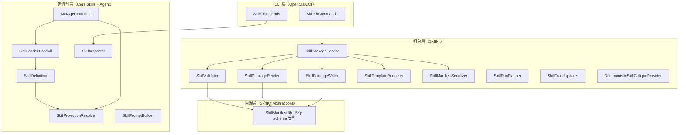
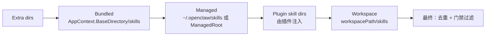

# 技能系统

<cite>
**本文引用的主要源码**
- [src/OpenClaw.SkillKit.Abstractions/SkillKitModels.cs](file://src/OpenClaw.SkillKit.Abstractions/SkillKitModels.cs)
- [src/OpenClaw.SkillKit/](file://src/OpenClaw.SkillKit/)（SkillPackageService / SkillPackageReader / SkillPackageWriter / SkillValidator / SkillTemplateRenderer / SkillManifestSerializer / SkillIdGenerator / SkillRunPlanner / SkillTraceUpdater / DeterministicSkillCritiqueProvider）
- [src/OpenClaw.Core/Skills/](file://src/OpenClaw.Core/Skills/)（SkillLoader / SkillModels / SkillInspector / SkillProjectionResolver / SkillPromptBuilder / LoadSkillTool / ReadSkillResourceTool / SkillProjectionArtifactTerms）
- [src/OpenClaw.Cli/SkillKitCommands.cs](file://src/OpenClaw.Cli/SkillKitCommands.cs)
- [src/OpenClaw.Cli/SkillCommands.cs](file://src/OpenClaw.Cli/SkillCommands.cs)
- [src/OpenClaw.Agent/MafAgentRuntime.cs](file://src/OpenClaw.Agent/MafAgentRuntime.cs)
</cite>

## 目录

1. [简介](#简介)
2. [模块边界与项目结构](#模块边界与项目结构)
3. [核心概念分层](#核心概念分层)
4. [Skill 目录布局](#skill-目录布局)
5. [SkillKit Manifest Schema](#skillkit-manifest-schema)
6. [CLI 命令族](#cli-命令族)
7. [运行时加载与发现](#运行时加载与发现)
8. [Runtime 接线（MafAgentRuntime）](#runtime-接线mafagentruntime)
9. [与本体切片的关系](#与本体切片的关系)
10. [当前实现状态](#当前实现状态)
11. [细分主题文档](#细分主题文档)
12. [扩展阅读](#扩展阅读)

---

## 简介

技能系统（Skill System）是 kingcrab/OpenClaw.NET 中一条贯穿**离线打包 → CLI 治理 → 运行时加载 → Prompt 注入**的产品主线。一个 Skill 是一份可分发的目录或 ZIP 包，承载 LLM 在特定任务领域的能力扩展（系统提示、参考资料、辅助脚本、工具策略、本体投影契约）。本仓库通过四个层次协同实现：

- **抽象层**（`OpenClaw.SkillKit.Abstractions`）：定义打包/校验所需的 manifest 模型类型
- **打包层**（`OpenClaw.SkillKit`）：提供模板渲染、序列化、校验、打包、运行规划等服务
- **CLI 层**（`OpenClaw.Cli`）：暴露 `openclaw skill *` 子命令族
- **运行时层**（`OpenClaw.Core.Skills` + `OpenClaw.Agent.MafAgentRuntime`）：扫描磁盘、解析 SKILL.md、绑定 Projection 契约、注入 Agent

> 与"插件（Plugin）"对比：技能是**资料 + 行为指令**驱动，插件是**代码可执行单元**驱动。两者可在同一仓库共存，且插件可通过 `pluginSkillDirs` 向 SkillLoader 提供额外的打包技能。

---

## 模块边界与项目结构



| 项目 | 职责 | 关键导出 |
|---|---|---|
| `OpenClaw.SkillKit.Abstractions` | manifest schema | `SkillManifest`、`SkillIntent`、`SkillInputs/Outputs`、`SkillToolPolicy`、`SkillGuardrails`、`SkillHumanApprovalPolicy`、`SkillValidationPolicy`、`SkillWorkflow`、`SkillPackage`、`SkillValidationResult`、`SkillRunPlan` 等 15 类 |
| `OpenClaw.SkillKit` | 打包/校验服务（`sealed class`） | `SkillPackageService`、`SkillPackageReader`、`SkillPackageWriter`、`SkillValidator`、`SkillTemplateRenderer`、`SkillManifestSerializer`、`SkillRunPlanner`、`SkillTraceUpdater`、`DeterministicSkillCritiqueProvider` |
| `OpenClaw.Cli` | 命令行入口 | [SkillKitCommands.cs](file://src/OpenClaw.Cli/SkillKitCommands.cs)、[SkillCommands.cs](file://src/OpenClaw.Cli/SkillCommands.cs) |
| `OpenClaw.Core.Skills` | 运行时模型与扫描器 | `SkillLoader`、`SkillDefinition`、`SkillsConfig`、`SkillProjectionResolver`、`SkillInspector`、`SkillPromptBuilder` |

---

## 核心概念分层

| 概念 | 实体形态 | 关键类型 |
|---|---|---|
| **Skill 包**（离线分发） | ZIP 或目录 + `manifest.json` + `SKILL.md` + `references/` + `scripts/` + `contracts/` | [SkillPackage](file://src/OpenClaw.SkillKit.Abstractions/SkillKitModels.cs) |
| **Manifest**（声明） | `manifest.json` 中的 schema 化字段 | [SkillManifest](file://src/OpenClaw.SkillKit.Abstractions/SkillKitModels.cs) |
| **运行期定义**（已加载） | 内存对象，包含 instructions / Resources / ProjectionContracts | [SkillDefinition](file://src/OpenClaw.Core/Skills/SkillModels.cs#L89-L135) |
| **Projection 契约**（per-request） | `<skill>/contracts/projections/<producer>/contract-index.json` + `*.projection.json` | [SkillProjectionContractSet](file://src/OpenClaw.Core/Models/SkillProjectionModels.cs) |

---

## Skill 目录布局

标准 skill 目录如下（以 `src/OpenClaw.Gateway/skills/software-developer/` 为参考）：

```
<skill-name>/
├── SKILL.md                    # 主入口：YAML frontmatter + Markdown 指令
├── manifest.json               # （可选）SkillKit 打包后的 schema 化 manifest
├── references/                 # 参考资料（progressive disclosure level 3）
│   └── *.md
├── scripts/                    # 辅助脚本（可执行）
│   └── *
└── contracts/
    ├── artifacts.json          # （可选）machine-readable 工件契约
    └── projections/<producer>/
        ├── contract-index.json # 路由入口
        └── *.projection.json   # 4 视图：domain-model / json-schema / prompt-constraint / workflow-contract
```

### SKILL.md frontmatter 关键字段

由 [SkillMetadata](file://src/OpenClaw.Core/Skills/SkillModels.cs#L182-L213) 解析：

| 字段 | 用途 |
|---|---|
| `Always` | true 时绕过 requirement 门禁 |
| `Os` / `RequireBins` / `RequireAnyBins` | OS 与可执行二进制存在性门禁 |
| `RequireEnv` / `RequireConfig` | 环境变量 / 配置项门禁 |
| `PrimaryEnv` / `SkillKey` | 与 `skills.entries.*` 配置桥接 |
| `Emoji` / `Homepage` | UI 展示 |

### references/ 与 scripts/

通过 [SkillResource](file://src/OpenClaw.Core/Skills/SkillModels.cs#L164-L177) 表达，仅在 prompt 中**列出索引**，按需加载（Anthropic-style progressive disclosure level 3）。`SkillResourceKind` 区分 `Reference`（只读资料）与 `Script`（可执行）。

---

## SkillKit Manifest Schema

[SkillKitModels.cs](file://src/OpenClaw.SkillKit.Abstractions/SkillKitModels.cs) 定义了 15 个 sealed class，构成 `manifest.json` 的完整 schema：

| 顶层字段 | 类型 | 说明 |
|---|---|---|
| `Id` / `Name` / `Version` / `Category` / `Description` / `Aliases` | 标识与展示 | 包基础元信息 |
| `Intent` | [SkillIntent](file://src/OpenClaw.SkillKit.Abstractions/SkillKitModels.cs#L21) | `Outcome` 描述任务结果 |
| `Inputs` / `Outputs` | [SkillInputs](file://src/OpenClaw.SkillKit.Abstractions/SkillKitModels.cs#L26) / [SkillOutputs](file://src/OpenClaw.SkillKit.Abstractions/SkillKitModels.cs#L32) | `Required` / `Optional` 列表 |
| `Tools` | [SkillToolPolicy](file://src/OpenClaw.SkillKit.Abstractions/SkillKitModels.cs#L38) | 允许/禁用的工具列表 |
| `Guardrails` | [SkillGuardrails](file://src/OpenClaw.SkillKit.Abstractions/SkillKitModels.cs#L45) | 安全护栏 |
| `HumanApproval` | [SkillHumanApprovalPolicy](file://src/OpenClaw.SkillKit.Abstractions/SkillKitModels.cs#L50) | 人审策略 |
| `Validation` | [SkillValidationPolicy](file://src/OpenClaw.SkillKit.Abstractions/SkillKitModels.cs#L55) | 自检策略 |
| `Workflow` | [SkillWorkflow](file://src/OpenClaw.SkillKit.Abstractions/SkillKitModels.cs#L60) | `SkillWorkflowStep` 序列 |

打包/校验/还原由 [SkillManifestSerializer](file://src/OpenClaw.SkillKit/SkillManifestSerializer.cs)、[SkillValidator](file://src/OpenClaw.SkillKit/SkillValidator.cs)、[SkillPackageReader](file://src/OpenClaw.SkillKit/SkillPackageReader.cs) / [Writer](file://src/OpenClaw.SkillKit/SkillPackageWriter.cs) 协同完成；批评/打分由 [DeterministicSkillCritiqueProvider](file://src/OpenClaw.SkillKit/DeterministicSkillCritiqueProvider.cs) 提供。

---

## CLI 命令族

入口：[SkillKitCommands.cs](file://src/OpenClaw.Cli/SkillKitCommands.cs)（包打包视角）、[SkillCommands.cs](file://src/OpenClaw.Cli/SkillCommands.cs)（已加载 skill 视角）。

```bash
openclaw skill new <name> [--category <c>] [--template <t>] [--output <path>] [--force]
openclaw skill list [--output <path>]
openclaw skill validate <skill-id|path> [--output <path>]
openclaw skill critique <skill-id|path> [--output <path>]
openclaw skill generate <skill-id|path> [--output <path>] [--force]
openclaw skill package <skill-id|path> [--output <path>] [--package-output <path>] [--force]
openclaw skill run <skill-id|path> --input <path> [--dry-run] [--output <path>]
```

| 子命令 | 行为 | 调用链 |
|---|---|---|
| `new` | 用 `SkillTemplateRenderer` 生成模板目录 | `SkillKitCommands` → `SkillPackageService.CreateAsync` |
| `list` | 列出磁盘已发现的 skill | `SkillCommands` → `SkillInspector` |
| `validate` | 校验 manifest 与目录结构 | → `SkillValidator` → `SkillValidationResult` |
| `critique` | 给出确定性打分/改进建议 | → `DeterministicSkillCritiqueProvider` |
| `generate` | 由 manifest 反向生成 SKILL.md | → `SkillTemplateRenderer` |
| `package` | 打 ZIP 包 | → `SkillPackageWriter` |
| `run` | 规划执行（含 `--dry-run`） | → `SkillRunPlanner` → `SkillRunPlan` |

---

## 运行时加载与发现

### 加载入口

[SkillLoader.LoadAll](file://src/OpenClaw.Core/Skills/SkillLoader.cs#L18) 是唯一加载入口，扫描多源目录并按以下优先级合并（高优先级覆盖低优先级，键为 skill name）：



[SkillSource](file://src/OpenClaw.Core/Skills/SkillModels.cs#L140-L147) 枚举：`Bundled` / `Managed` / `Workspace` / `Extra` / `Plugin`。

### 门禁过滤

加载完成后按以下顺序过滤（[SkillLoader.cs#L75-L100](file://src/OpenClaw.Core/Skills/SkillLoader.cs#L75-L100)）：

1. `AllowBundled` 白名单（仅作用于 Bundled 源）
2. `skills.entries.<key>.Enabled` 配置开关
3. requirement gating（`Os` / `RequireBins` / `RequireEnv` 等，`Always=true` 可绕过）

### Projection 契约自动发现

每个 skill 目录加载时由 [TryLoadProjectionContracts](file://src/OpenClaw.Core/Skills/SkillLoader.cs#L418-L525) 递归扫描 `contracts/projections/**/contract-index.json`，结果通过 [SkillProjectionContractSet](file://src/OpenClaw.Core/Models/SkillProjectionModels.cs) 列表写入 `SkillDefinition.ProjectionContracts`，发现状态由 `SkillProjectionDiscovery` 暴露（5 种：`none` / `bound` / `partial` / `parse-failed` / `enumeration-failed`）。详见 [本体切片](../本体切片/本体切片.md)。

### 配置入口

[SkillsConfig](file://src/OpenClaw.Core/Skills/SkillModels.cs#L8-L40) 控制：

| 字段 | 默认 | 用途 |
|---|---|---|
| `Enabled` | `true` | 总开关 |
| `Load.IncludeBundled / IncludeManaged / IncludeWorkspace` | `true` | 源开关 |
| `Load.ExtraDirs` / `Load.ManagedRoot` | — | 自定义目录 |
| `Load.Watch` / `Load.WatchDebounceMs` | `false` / `250ms` | 热重载（kingcrab 扩展） |
| `MaxResourceReadBytes` | `256 * 1024` | references/ 单文件读上限 |
| `AllowBundled` | `[]` | Bundled 白名单 |
| `Entries[skillKey]` | — | per-skill 开关与凭证桥接 |

---

## Runtime 接线（MafAgentRuntime）

[MafAgentRuntime.cs](file://src/OpenClaw.Agent/MafAgentRuntime.cs) 中持有的核心成员：

| 成员 | 行号 | 作用 |
|---|---|---|
| `_skillsConfig` | [#L32](file://src/OpenClaw.Agent/MafAgentRuntime.cs#L32) | 加载配置 |
| `_pluginSkillDirs` | [#L34](file://src/OpenClaw.Agent/MafAgentRuntime.cs#L34) | 插件注入的额外 skill 目录 |
| `_loadedSkills` / `_loadedSkillNames` | [#L52-L53](file://src/OpenClaw.Agent/MafAgentRuntime.cs#L52-L53) | 当前已加载 |
| `LoadedSkills` / `LoadedSkillNames` | [#L122-L153](file://src/OpenClaw.Agent/MafAgentRuntime.cs#L122-L153) | 对外公开 |
| `SkillsReloaded` 事件 | [#L155](file://src/OpenClaw.Agent/MafAgentRuntime.cs#L155) | 热重载通知 |
| `ReloadSkillsAsync` | [#L181](file://src/OpenClaw.Agent/MafAgentRuntime.cs#L181) | 显式重载入口 |
| Projection 接线 | [#L1032-L1043](file://src/OpenClaw.Agent/MafAgentRuntime.cs#L1032-L1043) | 调用 `SkillProjectionResolver` |

Prompt 注入由 [SkillPromptBuilder](file://src/OpenClaw.Core/Skills/SkillPromptBuilder.cs) 完成；模型按需读取由 [LoadSkillTool](file://src/OpenClaw.Core/Skills/LoadSkillTool.cs) / [ReadSkillResourceTool](file://src/OpenClaw.Core/Skills/ReadSkillResourceTool.cs) 提供 tool。

---

## 与本体切片的关系

技能系统是**容器**，本体切片是**容器内的一种载荷**：

| 维度 | 技能系统 | 本体切片 |
|---|---|---|
| 关注点 | 离线打包 + 运行时加载 + Prompt 注入 | per-request 任务域语义裁决 |
| 静态产物 | `SKILL.md` / `manifest.json` / `references/` / `scripts/` | `*.slice.json` / `*.projection.json` |
| 静态校验 | `SkillValidator`（结构完整性、字段约束） | `scripts/validate-*.py`（schema + 业务规则） |
| 运行时实体 | `SkillDefinition` | `SkillProjectionContractSet` 绑定到 `SkillDefinition` |
| 解析器 | `SkillLoader` / `SkillPromptBuilder` | `SkillProjectionResolver`（`ResolveForRequest` / `BuildPromptPatch`） |

详见 [本体切片](../本体切片/本体切片.md)。

---

## 当前实现状态

| 能力 | 状态 | 位置 |
|---|---|---|
| Manifest schema（15 sealed class） | ✅ 已落地 | `SkillKit.Abstractions/SkillKitModels.cs` |
| 打包 / 解包 / 校验 / 模板渲染 | ✅ 已落地 | `SkillKit/Skill{PackageService,Reader,Writer,Validator,TemplateRenderer,ManifestSerializer}.cs` |
| 确定性批评 / Run 规划 / Trace 更新 | ✅ 已落地 | `DeterministicSkillCritiqueProvider` / `SkillRunPlanner` / `SkillTraceUpdater` |
| CLI 7 子命令 | ✅ 已落地 | `OpenClaw.Cli/Skill{Kit,}Commands.cs` |
| 多源加载（5 种 SkillSource） | ✅ 已落地 | [SkillLoader.cs#L18-L73](file://src/OpenClaw.Core/Skills/SkillLoader.cs#L18-L73) |
| 门禁过滤（OS / bin / env / config） | ✅ 已落地 | [SkillLoader.cs#L75-L100](file://src/OpenClaw.Core/Skills/SkillLoader.cs#L75-L100) |
| references/ + scripts/ progressive disclosure | ✅ 已落地 | `SkillResource` + `LoadSkillTool` / `ReadSkillResourceTool` |
| Projection 契约自动发现 | ✅ 已落地（commit `42caa44`） | [SkillLoader.cs#L302](file://src/OpenClaw.Core/Skills/SkillLoader.cs#L302) + [#L418-L525](file://src/OpenClaw.Core/Skills/SkillLoader.cs#L418-L525) |
| Runtime 接线（MafAgentRuntime） | ✅ 已落地 | [#L1032-L1043](file://src/OpenClaw.Agent/MafAgentRuntime.cs#L1032-L1043) |
| 热重载（`Watch` / `ReloadSkillsAsync`） | ✅ 已落地 | `SkillsConfig.Load.Watch` + `MafAgentRuntime.ReloadSkillsAsync` |
| 端到端回归测试 | ✅ 已落地 | `OpenClaw.Tests/SkillTests.cs`、`MafAgentRuntimeTests.cs` |

---

## 细分主题文档

本目录在主文档之外提供 5 篇深度细化文档，分别从架构、包格式、开发工具链、投影系统、模板系统五个维度展开。本文负责给出统一抽象与交叉索引，下列文档承担每个子领域的详尽实现剖析、性能考量与故障排查指南。

| 子主题 | 文档 | 核心覆盖 | 关键源码 |
|---|---|---|---|
| 技能架构设计 | [技能架构设计.md](./技能架构设计.md) | 模型 + 加载器 + 工具链 + 提示构建 + 投影解析的分层组织、运行时注册与生命周期、可观测性与边界保护 | [SkillModels.cs](file://src/OpenClaw.Core/Skills/SkillModels.cs) / [SkillLoader.cs](file://src/OpenClaw.Core/Skills/SkillLoader.cs) / [LoadSkillTool.cs](file://src/OpenClaw.Core/Skills/LoadSkillTool.cs) / [ReadSkillResourceTool.cs](file://src/OpenClaw.Core/Skills/ReadSkillResourceTool.cs) / [MafAgentRuntime.cs](file://src/OpenClaw.Agent/MafAgentRuntime.cs) / [SkillWatcherService.cs](file://src/OpenClaw.Gateway/SkillWatcherService.cs) |
| 技能包格式规范 | [技能包格式规范.md](./技能包格式规范.md) | `skill.yaml` 清单格式、自定义 YAML/JSON Schema 关系、`SkillPackageReader/Writer` 解析与打包流程、版本管理 | [SkillManifestSerializer.cs](file://src/OpenClaw.SkillKit/SkillManifestSerializer.cs) / [SkillPackageReader.cs](file://src/OpenClaw.SkillKit/SkillPackageReader.cs) / [SkillPackageWriter.cs](file://src/OpenClaw.SkillKit/SkillPackageWriter.cs) / [SkillKitModels.cs](file://src/OpenClaw.SkillKit.Abstractions/SkillKitModels.cs) |
| 技能开发工具 | [技能开发工具.md](./技能开发工具.md) | `SkillRunPlanner` 任务规划与调度、`SkillTraceUpdater` 跟踪更新、`SkillValidator` 验证规则、SkillKit CLI 测试覆盖 | [SkillRunPlanner.cs](file://src/OpenClaw.SkillKit/SkillRunPlanner.cs) / [SkillTraceUpdater.cs](file://src/OpenClaw.SkillKit/SkillTraceUpdater.cs) / [SkillValidator.cs](file://src/OpenClaw.SkillKit/SkillValidator.cs) / [SkillIdGenerator.cs](file://src/OpenClaw.SkillKit/SkillIdGenerator.cs) / [SkillKitCommands.cs](file://src/OpenClaw.Cli/SkillKitCommands.cs) |
| 技能投影系统 | [技能投影系统.md](./技能投影系统.md) | 投影契约结构（contract-index + projection 文档）、主题/视图选择、阻断检查、`SkillProjectionArtifactTerms` 术语映射 | [SkillProjectionResolver.cs](file://src/OpenClaw.Core/Skills/SkillProjectionResolver.cs) / [SkillProjectionArtifactTerms.cs](file://src/OpenClaw.Core/Skills/SkillProjectionArtifactTerms.cs) / [SkillProjectionModels.cs](file://src/OpenClaw.Core/Models/SkillProjectionModels.cs) / [skill-projection-contracts-design.md](file://docs/skill-projection-contracts-design.md) |
| 技能模板系统 | [技能模板系统.md](./技能模板系统.md) | `SkillTemplateRenderer` 内置模板类别、外部集成模板（capability/index/skip）、模板变量替换、复用与版本管理 | [SkillTemplateRenderer.cs](file://src/OpenClaw.SkillKit/SkillTemplateRenderer.cs) / [SkillPackageService.cs](file://src/OpenClaw.SkillKit/SkillPackageService.cs) / 外部模板示例：[capability.template.json](file://src/OpenClaw.Plugins.EmploymentCoachWorkflow/skills/external-config/templates/capability.template.json) |

> 阅读建议：先阅读本主文档建立全局视图，再按需深入对应子主题。所有子主题文档共享同一套 `cite` / `## 项目结构` / `## 核心组件` / `## 详细组件分析` / `## 故障排查指南` 的 RepoWiki 标准结构，便于横向对照。

---

## 扩展阅读

- 上一层导航：[项目概述 / 核心功能特性](../项目概述/核心功能特性.md)
- 命令视角细化：[命令行工具 / 插件和技能命令](../命令行工具/插件和技能命令.md)
- 接口视角细化：[核心抽象和基础服务 / 核心接口设计](../核心抽象和基础服务/核心接口设计.md)
- Per-request 语义裁决：[本体切片](../本体切片/本体切片.md)
- 设计稿：[docs/skill-projection-contracts-design.md](file://docs/skill-projection-contracts-design.md) / [docs/skillloader-loadall-analysis.md](file://docs/skillloader-loadall-analysis.md)
- 实例 skill：[`src/OpenClaw.Gateway/skills/`](file://src/OpenClaw.Gateway/skills/)（`software-developer` / `data-analyst` / `email-triage` 等 8 个 skill）
