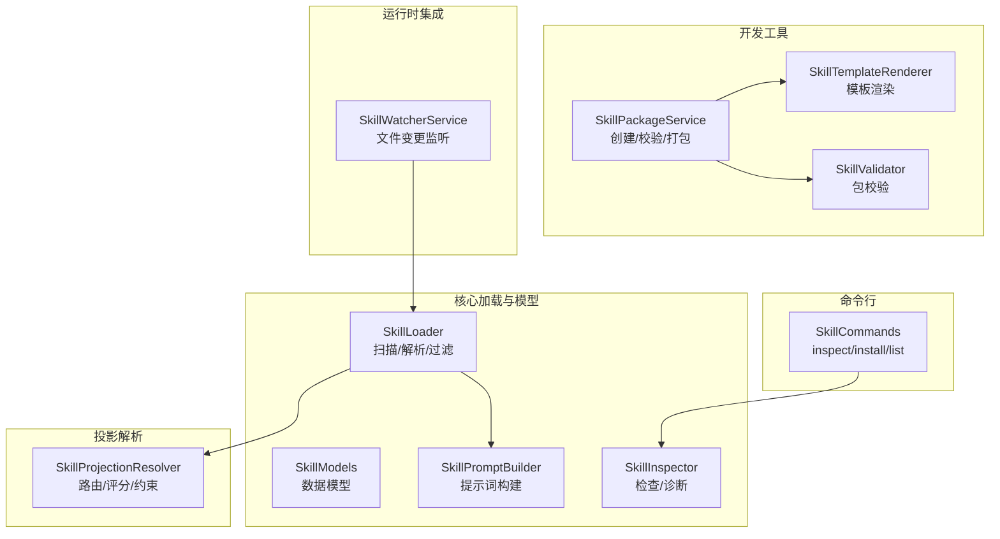
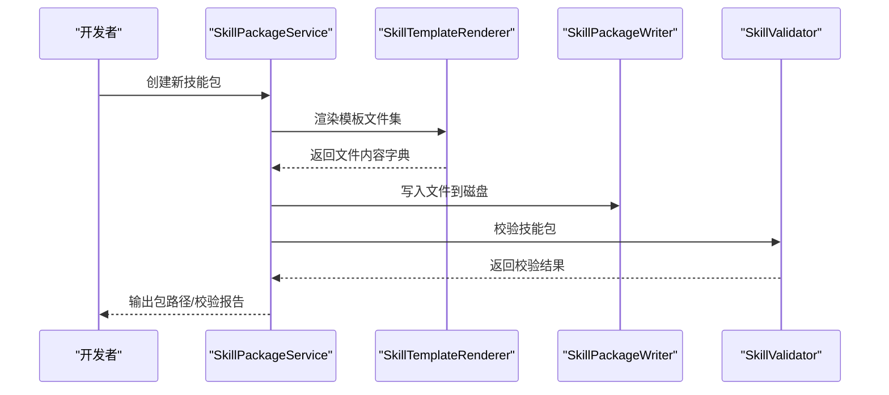
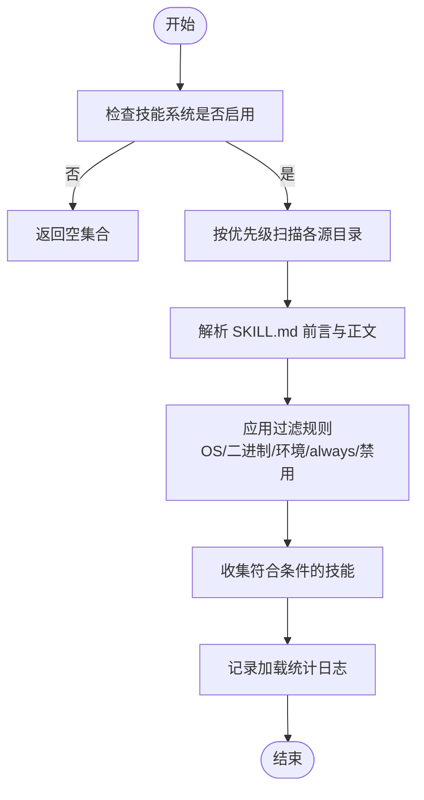
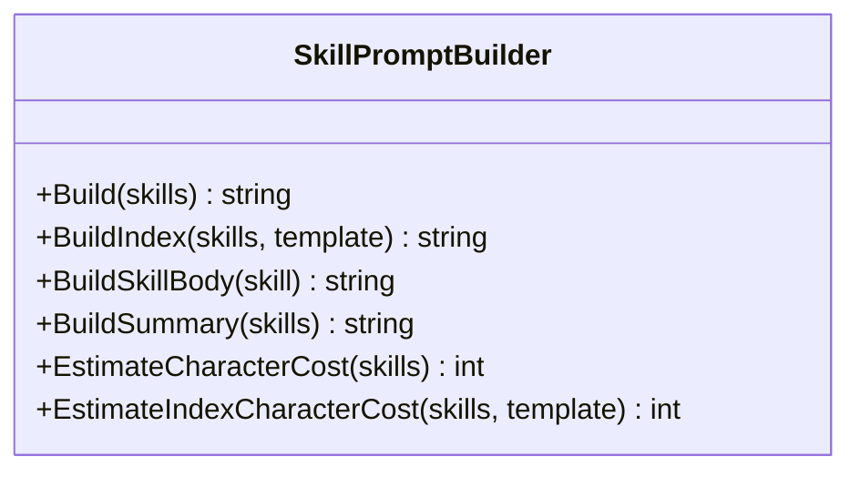
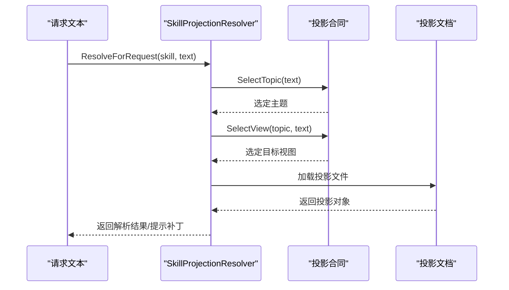
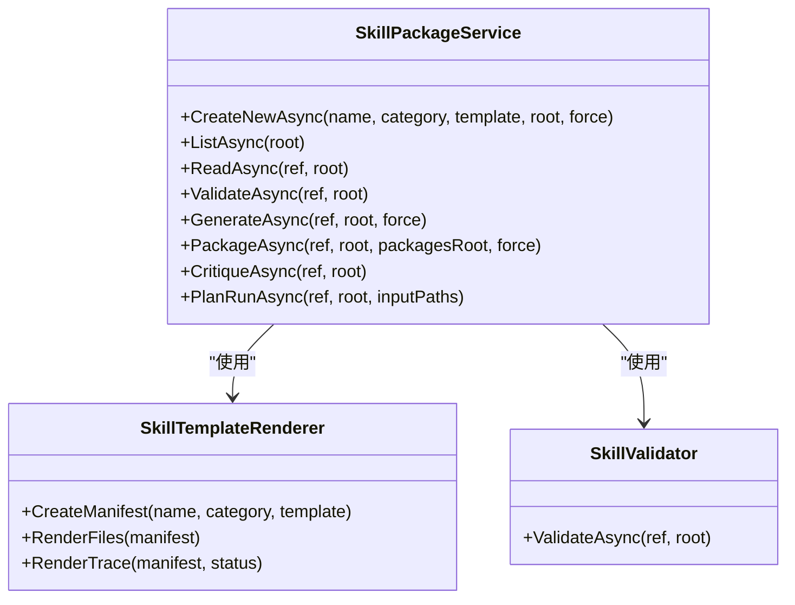
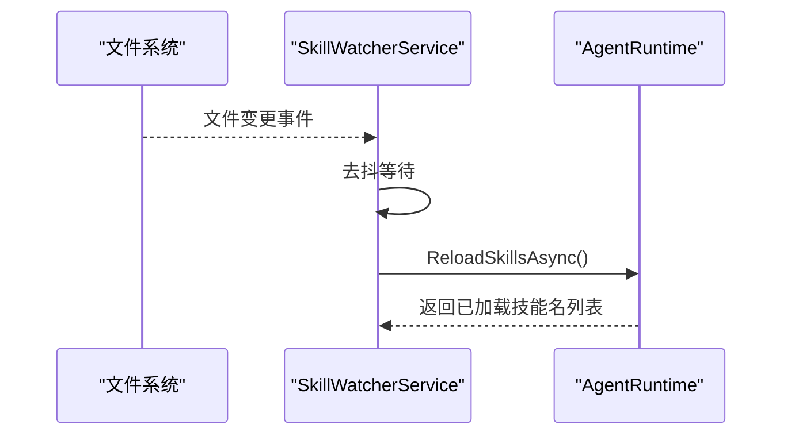
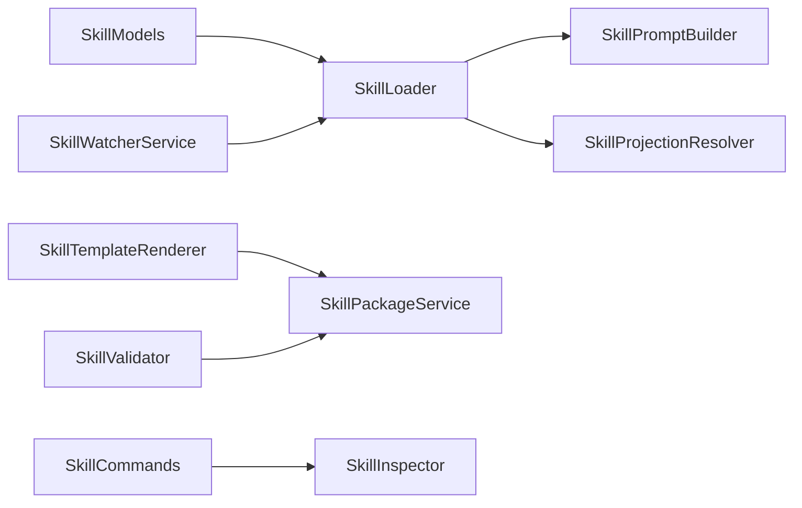

# 技能系统

<cite>
**本文档引用的文件**
- [SkillLoader.cs](file://src/OpenClaw.Core/Skills/SkillLoader.cs)
- [SkillModels.cs](file://src/OpenClaw.Core/Skills/SkillModels.cs)
- [SkillInspector.cs](file://src/OpenClaw.Core/Skills/SkillInspector.cs)
- [SkillPromptBuilder.cs](file://src/OpenClaw.Core/Skills/SkillPromptBuilder.cs)
- [SkillProjectionResolver.cs](file://src/OpenClaw.Core/Skills/SkillProjectionResolver.cs)
- [SkillPackageService.cs](file://src/OpenClaw.SkillKit/SkillPackageService.cs)
- [SkillTemplateRenderer.cs](file://src/OpenClaw.SkillKit/SkillTemplateRenderer.cs)
- [SkillValidator.cs](file://src/OpenClaw.SkillKit/SkillValidator.cs)
- [SkillCommands.cs](file://src/OpenClaw.Cli/SkillCommands.cs)
- [SkillWatcherService.cs](file://src/OpenClaw.Gateway/SkillWatcherService.cs)
- [skill-projection-contract-index.schema.json](file://docs/skill-projection-contract-index.schema.json)
- [skill-projection-document.schema.json](file://docs/skill-projection-document.schema.json)
- [README.md](file://README.md)
- [QUICKSTART.md](file://QUICKSTART.md)
</cite>

## 目录
1. [简介](#简介)
2. [项目结构](#项目结构)
3. [核心组件](#核心组件)
4. [架构总览](#架构总览)
5. [详细组件分析](#详细组件分析)
6. [依赖关系分析](#依赖关系分析)
7. [性能考量](#性能考量)
8. [故障排查指南](#故障排查指南)
9. [结论](#结论)
10. [附录](#附录)

## 简介
本文件面向技能系统的技术文档，覆盖技能架构设计、技能包格式、技能加载机制与技能开发工具链。重点解释技能模板系统、技能验证流程与技能投影机制，并提供技能开发示例、模板使用与最佳实践，以及技能包发布与管理指南。

## 项目结构
技能系统由以下层次组成：
- 核心加载与模型层：负责扫描、解析、过滤与构建技能索引，生成提示词片段。
- 技能投影解析层：基于请求文本选择合适的投影路由，产出提示补丁与交付物清单。
- 开发工具层：提供模板渲染、包生成、校验与发布能力。
- 运行时集成层：在网关中实现热重载监听与技能重新加载。
- 命令行工具：提供技能检查、安装与列表等运维能力。

图表来源
- [SkillLoader.cs:11-109](file://src/OpenClaw.Core/Skills/SkillLoader.cs#L11-L109)
- [SkillModels.cs:8-214](file://src/OpenClaw.Core/Skills/SkillModels.cs#L8-L214)
- [SkillPromptBuilder.cs:9-145](file://src/OpenClaw.Core/Skills/SkillPromptBuilder.cs#L9-L145)
- [SkillProjectionResolver.cs:10-67](file://src/OpenClaw.Core/Skills/SkillProjectionResolver.cs#L10-L67)
- [SkillPackageService.cs:6-76](file://src/OpenClaw.SkillKit/SkillPackageService.cs#L6-L76)
- [SkillTemplateRenderer.cs:6-57](file://src/OpenClaw.SkillKit/SkillTemplateRenderer.cs#L6-L57)
- [SkillValidator.cs:5-78](file://src/OpenClaw.SkillKit/SkillValidator.cs#L5-L78)
- [SkillWatcherService.cs:7-37](file://src/OpenClaw.Gateway/SkillWatcherService.cs#L7-L37)
- [SkillCommands.cs:6-28](file://src/OpenClaw.Cli/SkillCommands.cs#L6-L28)

章节来源
- [README.md:31-40](file://README.md#L31-L40)
- [QUICKSTART.md:1-190](file://QUICKSTART.md#L1-L190)

## 核心组件
- 技能加载器（SkillLoader）：从多源目录扫描 SKILL.md，解析前言元数据与正文，按优先级与要求过滤，输出可执行的技能定义集合。
- 技能模型（SkillModels）：定义配置、技能定义、元数据、资源类型与来源枚举等数据结构。
- 提示词构建器（SkillPromptBuilder）：生成面向模型的技能索引与指令片段，支持渐进披露与成本估算。
- 技能投影解析器（SkillProjectionResolver）：根据请求内容匹配投影合同，选择主题与目标视图，生成提示补丁与交付物清单。
- 技能包服务（SkillPackageService）：封装模板渲染、包生成、校验与打包流程。
- 模板渲染器（SkillTemplateRenderer）：提供多种模板类别，生成标准技能包文件集。
- 技能校验器（SkillValidator）：对技能包进行完整性与策略一致性检查。
- 技能观察者（SkillWatcherService）：监听 SKILL.md 变更，触发运行时热重载。
- 技能命令（SkillCommands）：CLI 子命令，支持检查、安装与列出技能包。

章节来源
- [SkillLoader.cs:11-109](file://src/OpenClaw.Core/Skills/SkillLoader.cs#L11-L109)
- [SkillModels.cs:86-214](file://src/OpenClaw.Core/Skills/SkillModels.cs#L86-L214)
- [SkillPromptBuilder.cs:9-145](file://src/OpenClaw.Core/Skills/SkillPromptBuilder.cs#L9-L145)
- [SkillProjectionResolver.cs:10-67](file://src/OpenClaw.Core/Skills/SkillProjectionResolver.cs#L10-L67)
- [SkillPackageService.cs:6-76](file://src/OpenClaw.SkillKit/SkillPackageService.cs#L6-L76)
- [SkillTemplateRenderer.cs:6-57](file://src/OpenClaw.SkillKit/SkillTemplateRenderer.cs#L6-L57)
- [SkillValidator.cs:5-78](file://src/OpenClaw.SkillKit/SkillValidator.cs#L5-L78)
- [SkillWatcherService.cs:7-37](file://src/OpenClaw.Gateway/SkillWatcherService.cs#L7-L37)
- [SkillCommands.cs:6-28](file://src/OpenClaw.Cli/SkillCommands.cs#L6-L28)

## 架构总览
技能系统采用“声明式技能包 + 渐进披露提示 + 投影路由”的架构：
- 声明式技能包：以 SKILL.md 为入口，前言块描述元数据与调用方式，正文承载技能说明。
- 渐进披露提示：通过提示词构建器仅暴露 L1 元数据与 L3 资源清单，按需拉取 L2 正文与 L3 资源。
- 投影路由：基于请求信号与评分维度，自动选择最合适的投影视图，确保术语映射与假设约束一致。

图表来源
- [SkillPackageService.cs:29-34](file://src/OpenClaw.SkillKit/SkillPackageService.cs#L29-L34)
- [SkillTemplateRenderer.cs:59-73](file://src/OpenClaw.SkillKit/SkillTemplateRenderer.cs#L59-L73)
- [SkillValidator.cs:7-78](file://src/OpenClaw.SkillKit/SkillValidator.cs#L7-L78)

## 详细组件分析

### 技能加载与过滤（SkillLoader）
- 多源扫描：Extra > Bundled > Managed > Plugin > Workspace，高优先级覆盖低优先级。
- 解析规则：识别 SKILL.md 的 YAML 风格前言块，解析元数据与正文；支持占位符替换与辅助资源扫描。
- 过滤条件：OS 白名单、二进制存在性、环境变量与配置注入、always 标记与 per-skill 禁用开关。
- 性能优化：缓存 PATH 查找结果，避免重复 I/O。

图表来源
- [SkillLoader.cs:17-109](file://src/OpenClaw.Core/Skills/SkillLoader.cs#L17-L109)
- [SkillLoader.cs:160-208](file://src/OpenClaw.Core/Skills/SkillLoader.cs#L160-L208)
- [SkillLoader.cs:213-323](file://src/OpenClaw.Core/Skills/SkillLoader.cs#L213-L323)
- [SkillLoader.cs:441-493](file://src/OpenClaw.Core/Skills/SkillLoader.cs#L441-L493)

章节来源
- [SkillLoader.cs:17-109](file://src/OpenClaw.Core/Skills/SkillLoader.cs#L17-L109)
- [SkillLoader.cs:160-208](file://src/OpenClaw.Core/Skills/SkillLoader.cs#L160-L208)
- [SkillLoader.cs:213-323](file://src/OpenClaw.Core/Skills/SkillLoader.cs#L213-L323)
- [SkillLoader.cs:441-493](file://src/OpenClaw.Core/Skills/SkillLoader.cs#L441-L493)

### 技能提示词构建（SkillPromptBuilder）
- 索引模式：仅输出 L1 元数据与 L3 资源清单，配合工具按需拉取正文与资源。
- 完整模式：输出索引与每个技能的完整正文，适合一次性注入但会增加 token 成本。
- 模板定制：支持自定义模板，必须包含 {skills} 占位符，可选 {load_instruction} 与 {resource_instruction}。
- 成本估算：提供估算函数，帮助评估不同注入策略的 token 成本。

图表来源
- [SkillPromptBuilder.cs:9-145](file://src/OpenClaw.Core/Skills/SkillPromptBuilder.cs#L9-L145)
- [SkillPromptBuilder.cs:168-196](file://src/OpenClaw.Core/Skills/SkillPromptBuilder.cs#L168-L196)

章节来源
- [SkillPromptBuilder.cs:20-63](file://src/OpenClaw.Core/Skills/SkillPromptBuilder.cs#L20-L63)
- [SkillPromptBuilder.cs:110-145](file://src/OpenClaw.Core/Skills/SkillPromptBuilder.cs#L110-L145)
- [SkillPromptBuilder.cs:228-298](file://src/OpenClaw.Core/Skills/SkillPromptBuilder.cs#L228-L298)

### 技能投影解析（SkillProjectionResolver）
- 主题选择：基于请求中的意图信号、显式产物信号与关键词匹配，计算得分并选择最佳主题。
- 视图选择：在主题内按目标视图的信号与偏好排序，考虑就绪状态与阈值。
- 合同加载：定位并解析投影文档，应用映射策略与假设约束。
- 结果输出：生成提示补丁与交付物清单，必要时阻断并给出原因。

图表来源
- [SkillProjectionResolver.cs:12-67](file://src/OpenClaw.Core/Skills/SkillProjectionResolver.cs#L12-L67)
- [SkillProjectionResolver.cs:220-346](file://src/OpenClaw.Core/Skills/SkillProjectionResolver.cs#L220-L346)
- [SkillProjectionResolver.cs:399-452](file://src/OpenClaw.Core/Skills/SkillProjectionResolver.cs#L399-L452)

章节来源
- [SkillProjectionResolver.cs:12-67](file://src/OpenClaw.Core/Skills/SkillProjectionResolver.cs#L12-L67)
- [SkillProjectionResolver.cs:220-346](file://src/OpenClaw.Core/Skills/SkillProjectionResolver.cs#L220-L346)
- [SkillProjectionResolver.cs:399-452](file://src/OpenClaw.Core/Skills/SkillProjectionResolver.cs#L399-L452)
- [skill-projection-contract-index.schema.json:1-315](file://docs/skill-projection-contract-index.schema.json#L1-L315)
- [skill-projection-document.schema.json:1-200](file://docs/skill-projection-document.schema.json#L1-L200)

### 技能包开发工具链（SkillKit）
- 包服务：统一编排模板渲染、文件写入、缺失文件生成、校验与打包。
- 模板渲染：内置多种模板类别（研究、提案、合规、运营、软件），自动生成标准文件集。
- 校验逻辑：检查必需文件、清单字段、工作流步骤、工具策略冲突等。

图表来源
- [SkillPackageService.cs:6-76](file://src/OpenClaw.SkillKit/SkillPackageService.cs#L6-L76)
- [SkillTemplateRenderer.cs:21-57](file://src/OpenClaw.SkillKit/SkillTemplateRenderer.cs#L21-L57)
- [SkillValidator.cs:7-78](file://src/OpenClaw.SkillKit/SkillValidator.cs#L7-L78)

章节来源
- [SkillPackageService.cs:15-76](file://src/OpenClaw.SkillKit/SkillPackageService.cs#L15-L76)
- [SkillTemplateRenderer.cs:21-57](file://src/OpenClaw.SkillKit/SkillTemplateRenderer.cs#L21-L57)
- [SkillValidator.cs:7-78](file://src/OpenClaw.SkillKit/SkillValidator.cs#L7-L78)

### 运行时热重载（SkillWatcherService）
- 监听范围：根据配置与插件技能目录确定监控根路径。
- 事件处理：捕获 SKILL.md 的变更/新建/删除/重命名事件，去抖后触发重新加载。
- 重新加载：通知 AgentRuntime 执行技能重载，记录成功数量或错误日志。

图表来源
- [SkillWatcherService.cs:39-89](file://src/OpenClaw.Gateway/SkillWatcherService.cs#L39-L89)
- [SkillWatcherService.cs:193-255](file://src/OpenClaw.Gateway/SkillWatcherService.cs#L193-L255)

章节来源
- [SkillWatcherService.cs:39-89](file://src/OpenClaw.Gateway/SkillWatcherService.cs#L39-L89)
- [SkillWatcherService.cs:193-255](file://src/OpenClaw.Gateway/SkillWatcherService.cs#L193-L255)

### 命令行运维（SkillCommands）
- inspect：检查本地或压缩包中的技能包，输出信任级别、要求摘要与安装建议。
- install：安装技能包到托管或工作区目录，支持干运行与目标路径推断。
- list：列出已安装技能，按名称排序并显示来源与路径。

章节来源
- [SkillCommands.cs:30-143](file://src/OpenClaw.Cli/SkillCommands.cs#L30-L143)
- [SkillCommands.cs:145-187](file://src/OpenClaw.Cli/SkillCommands.cs#L145-L187)
- [SkillCommands.cs:94-129](file://src/OpenClaw.Cli/SkillCommands.cs#L94-L129)

## 依赖关系分析
- 组件耦合
  - SkillLoader 依赖 SkillModels 的数据结构与枚举，用于解析与过滤。
  - SkillPromptBuilder 依赖 SkillLoader 的技能集合，生成提示词。
  - SkillProjectionResolver 依赖投影索引与文档的 JSON Schema，解析路由与约束。
  - SkillPackageService 组合 SkillTemplateRenderer 与 SkillValidator，形成开发流水线。
  - SkillWatcherService 与 AgentRuntime 交互，驱动热重载。
  - SkillCommands 依赖 SkillInspector 与文件系统操作，提供运维能力。
- 外部依赖
  - JSON Schema 文档用于投影合同与投影文档的结构约束与校验。
  - CLI 与网关通过环境变量与配置文件控制技能加载行为。

图表来源
- [SkillModels.cs:86-214](file://src/OpenClaw.Core/Skills/SkillModels.cs#L86-L214)
- [SkillLoader.cs:11-109](file://src/OpenClaw.Core/Skills/SkillLoader.cs#L11-L109)
- [SkillPromptBuilder.cs:9-145](file://src/OpenClaw.Core/Skills/SkillPromptBuilder.cs#L9-L145)
- [SkillProjectionResolver.cs:10-67](file://src/OpenClaw.Core/Skills/SkillProjectionResolver.cs#L10-L67)
- [SkillTemplateRenderer.cs:6-57](file://src/OpenClaw.SkillKit/SkillTemplateRenderer.cs#L6-L57)
- [SkillValidator.cs:5-78](file://src/OpenClaw.SkillKit/SkillValidator.cs#L5-L78)
- [SkillWatcherService.cs:7-37](file://src/OpenClaw.Gateway/SkillWatcherService.cs#L7-L37)
- [SkillCommands.cs:6-28](file://src/OpenClaw.Cli/SkillCommands.cs#L6-L28)

## 性能考量
- 加载性能
  - 使用 PATH 缓存减少重复查找，降低 I/O 开销。
  - 优先级覆盖避免重复解析相同技能。
- 提示词成本
  - 渐进披露模式显著降低 token 成本，仅在需要时拉取正文与资源。
  - 提供成本估算函数，便于预估与调优。
- 投影解析
  - 评分维度与阈值控制歧义与回退路径，提升稳定性与性能。
- 热重载
  - 去抖机制减少频繁触发，合并多次变更后再执行重载。

## 故障排查指南
- 技能未被加载
  - 检查 SkillsConfig 的 Enabled、Load 选项与 AllowBundled 列表。
  - 确认 OS、二进制、环境变量与配置项满足要求。
  - 查看日志中的跳过原因（如不满足要求、禁用等）。
- 提示词过大
  - 切换到渐进披露模式，仅注入索引与资源清单。
  - 使用成本估算函数评估不同策略。
- 投影路由失败
  - 检查投影索引与文档的 JSON Schema 是否正确。
  - 关注阻断原因（如非 READY 状态、开放问题、未找到文件等）。
- 包校验失败
  - 按照校验器输出逐项修正：缺少文件、清单字段、策略冲突等。
- 热重载无效
  - 确认监控根路径与 Watch 配置。
  - 检查文件变更事件是否触发，以及 AgentRuntime 重载接口是否可用。

章节来源
- [SkillLoader.cs:74-103](file://src/OpenClaw.Core/Skills/SkillLoader.cs#L74-L103)
- [SkillPromptBuilder.cs:228-298](file://src/OpenClaw.Core/Skills/SkillPromptBuilder.cs#L228-L298)
- [SkillProjectionResolver.cs:154-204](file://src/OpenClaw.Core/Skills/SkillProjectionResolver.cs#L154-L204)
- [SkillValidator.cs:13-78](file://src/OpenClaw.SkillKit/SkillValidator.cs#L13-L78)
- [SkillWatcherService.cs:193-255](file://src/OpenClaw.Gateway/SkillWatcherService.cs#L193-L255)

## 结论
技能系统通过声明式技能包、渐进披露提示与投影路由，实现了可扩展、可控且可审计的技能生态。开发工具链提供从模板到校验再到发布的全生命周期支持，运行时热重载保障了迭代效率。结合严格的验证与成本估算，可在生产环境中安全地部署与维护技能体系。

## 附录

### 技能包格式与模板使用
- 技能包结构
  - 必需文件：skill.yaml、intent.md、expectations.md、workflow.yaml、tools.yaml、guardrails.md、validation.md、examples.md、trace.md。
  - 模板类别：研究、提案、合规、运营、软件等，自动填充输入/输出、工具策略与验证规则。
- 模板渲染
  - 根据模板与分类生成清单与文档骨架，开发者在此基础上完善细节。
- 包校验
  - 检查文件完整性、清单字段、工作流步骤与策略一致性，输出问题清单。

章节来源
- [SkillTemplateRenderer.cs:8-19](file://src/OpenClaw.SkillKit/SkillTemplateRenderer.cs#L8-L19)
- [SkillTemplateRenderer.cs:21-57](file://src/OpenClaw.SkillKit/SkillTemplateRenderer.cs#L21-L57)
- [SkillValidator.cs:7-78](file://src/OpenClaw.SkillKit/SkillValidator.cs#L7-L78)

### 技能开发示例与最佳实践
- 示例场景
  - 研究类技能：从讨论记录提取痛点、需求与机会，输出结构化洞察简报。
  - 合规类技能：对照政策与要求生成审查清单与风险摘要。
  - 运营类技能：制定可执行的任务计划，明确依赖、风险与审批点。
- 最佳实践
  - 明确意图与预期输出，严格定义输入与约束。
  - 使用工具策略与守卫规则，避免越权或不可控操作。
  - 在 trace.md 中记录决策与验证状态，便于审计与复盘。
  - 采用渐进披露提示，降低 token 成本并提升响应速度。

章节来源
- [SkillTemplateRenderer.cs:268-361](file://src/OpenClaw.SkillKit/SkillTemplateRenderer.cs#L268-L361)
- [SkillPromptBuilder.cs:228-298](file://src/OpenClaw.Core/Skills/SkillPromptBuilder.cs#L228-L298)

### 技能包发布与管理
- 发布流程
  - 使用 SkillPackageService 的 CreateNewAsync 生成包，ValidateAsync 校验，PackageAsync 打包。
  - 生成确定性评审报告（critique.md），记录 trace 与决策。
- 管理运维
  - 使用 CLI 的 skills 子命令 inspect/install/list 管理技能包。
  - 在托管或工作区目录安装技能包，支持干运行与目标路径推断。
  - 通过热重载服务实现文件变更后的自动重载。

章节来源
- [SkillPackageService.cs:29-58](file://src/OpenClaw.SkillKit/SkillPackageService.cs#L29-L58)
- [SkillCommands.cs:30-143](file://src/OpenClaw.Cli/SkillCommands.cs#L30-L143)
- [SkillWatcherService.cs:39-89](file://src/OpenClaw.Gateway/SkillWatcherService.cs#L39-L89)