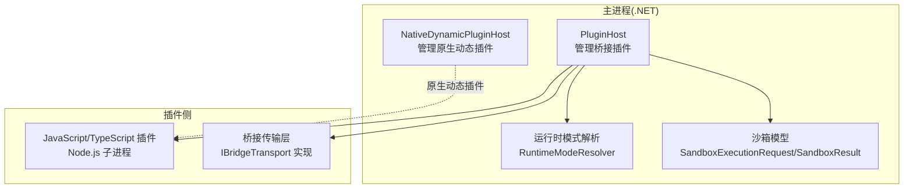
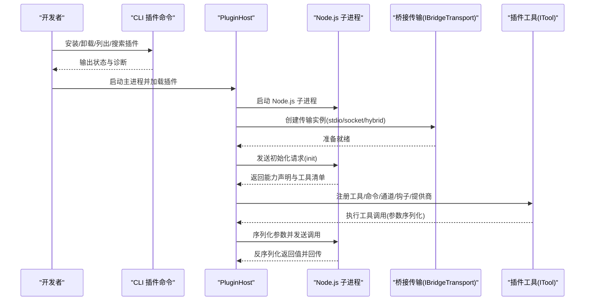
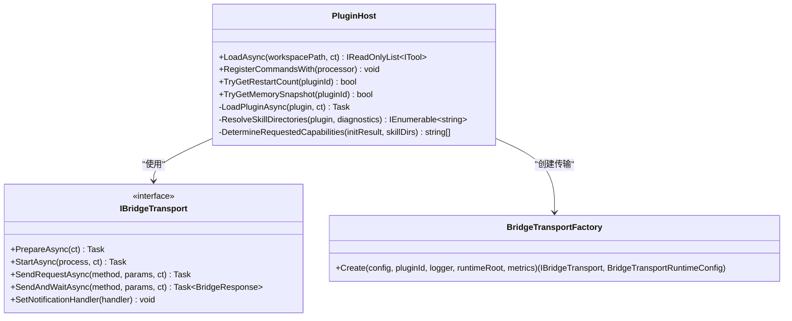
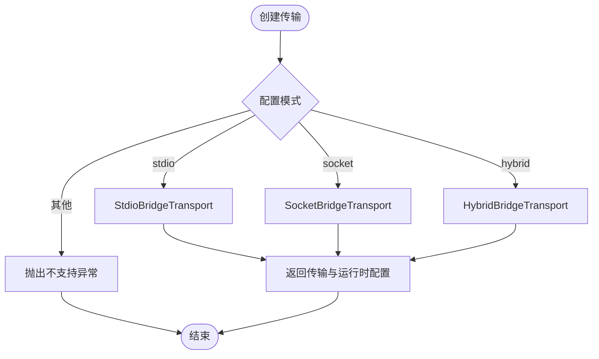
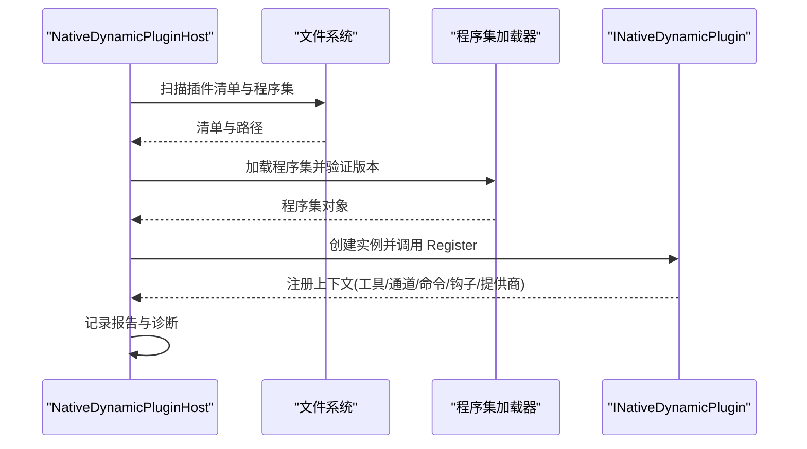
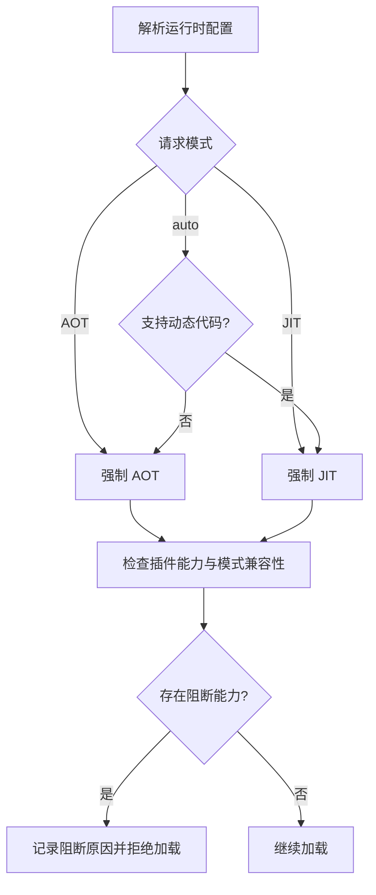
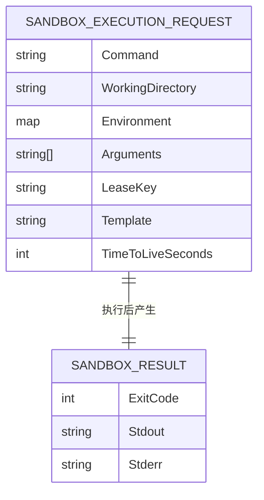
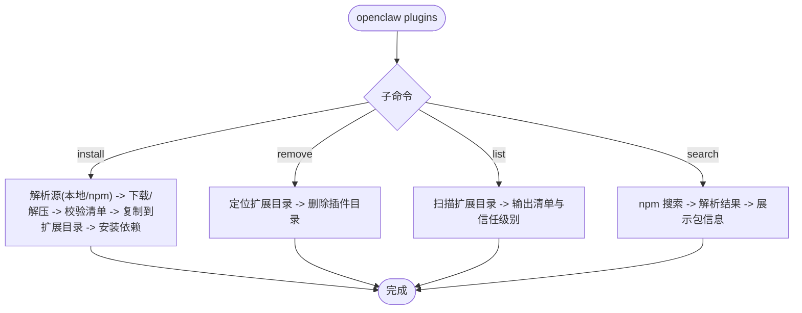
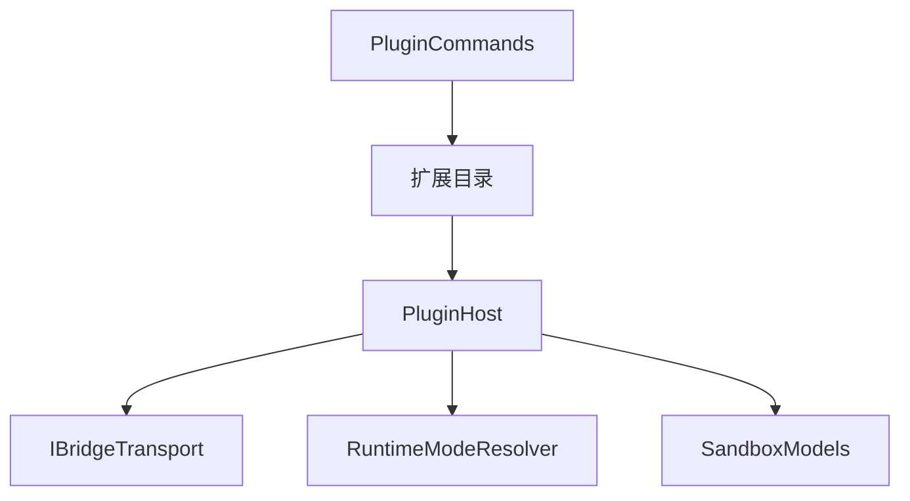

# JavaScript 插件开发

<cite>
**本文档引用的文件**
- [PluginHost.cs](file://src/OpenClaw.Agent/Plugins/PluginHost.cs)
- [NativeDynamicPluginHost.cs](file://src/OpenClaw.Agent/Plugins/NativeDynamicPluginHost.cs)
- [IBridgeTransport.cs](file://src/OpenClaw.Agent/Plugins/IBridgeTransport.cs)
- [BridgeTransportFactory.cs](file://src/OpenClaw.Agent/Plugins/BridgeTransportFactory.cs)
- [PluginCommands.cs](file://src/OpenClaw.Cli/PluginCommands.cs)
- [RuntimeModels.cs](file://src/OpenClaw.Core/Models/RuntimeModels.cs)
- [SandboxModels.cs](file://src/OpenClaw.Core/Models/SandboxModels.cs)
- [ITool.cs](file://src/OpenClaw.Core/Abstractions/ITool.cs)
- [EmploymentCoachWorkflowPlugin.cs](file://src/OpenClaw.Plugins.EmploymentCoachWorkflow/EmploymentCoachWorkflowPlugin.cs)
- [openclaw.native-plugin.json](file://src/OpenClaw.Plugins.EmploymentCoachWorkflow/openclaw.native-plugin.json)
</cite>

## 目录
1. [简介](#简介)
2. [项目结构](#项目结构)
3. [核心组件](#核心组件)
4. [架构总览](#架构总览)
5. [详细组件分析](#详细组件分析)
6. [依赖关系分析](#依赖关系分析)
7. [性能考虑](#性能考虑)
8. [故障排除指南](#故障排除指南)
9. [结论](#结论)
10. [附录](#附录)

## 简介
本文件面向 JavaScript/TypeScript 插件开发者，系统性阐述 OpenClaw 中 JavaScript 插件的开发流程、Node.js 桥接机制与运行时环境、与 .NET 主进程的通信方式、数据序列化与反序列化、沙箱与安全限制、生命周期管理、错误处理与性能监控，以及开发环境搭建、调试方法与部署流程。文档同时覆盖与 OpenSandbox 工具沙箱的集成思路与最佳实践。

## 项目结构
OpenClaw 将插件系统分为两类：
- Node.js 桥接插件：通过 Node.js 子进程运行，由 .NET 的 PluginHost 管理生命周期与通信。
- 原生动态插件（.NET）：在 .NET 进程内加载，用于需要直接访问 .NET 能力的场景；与 JS 插件不同，不涉及 Node.js 桥接。

**图表来源**
- [PluginHost.cs:14-550](file://src/OpenClaw.Agent/Plugins/PluginHost.cs#L14-L550)
- [NativeDynamicPluginHost.cs:19-908](file://src/OpenClaw.Agent/Plugins/NativeDynamicPluginHost.cs#L19-L908)
- [RuntimeModels.cs:29-69](file://src/OpenClaw.Core/Models/RuntimeModels.cs#L29-L69)
- [SandboxModels.cs:10-28](file://src/OpenClaw.Core/Models/SandboxModels.cs#L10-L28)

**章节来源**
- [PluginHost.cs:14-550](file://src/OpenClaw.Agent/Plugins/PluginHost.cs#L14-L550)
- [NativeDynamicPluginHost.cs:19-908](file://src/OpenClaw.Agent/Plugins/NativeDynamicPluginHost.cs#L19-L908)
- [RuntimeModels.cs:11-69](file://src/OpenClaw.Core/Models/RuntimeModels.cs#L11-L69)
- [SandboxModels.cs:10-28](file://src/OpenClaw.Core/Models/SandboxModels.cs#L10-L28)

## 核心组件
- PluginHost：负责发现、过滤、加载桥接型 JavaScript 插件，建立与 Node.js 子进程的通信通道，注册工具、命令、通道适配器、事件钩子与提供商。
- IBridgeTransport 及其实现：抽象桥接传输层，支持 stdio、socket、hybrid 三种模式，确保主进程与插件进程间可靠通信。
- BridgeTransportFactory：根据配置选择并创建合适的传输实例，处理跨平台路径与认证令牌。
- RuntimeModeResolver：解析运行时模式（AOT/JIT），决定插件能力可用性与兼容性。
- SandboxExecutionRequest/SandboxResult：定义沙箱执行请求与结果的数据结构，支撑工具沙箱化执行。
- PluginCommands：CLI 插件管理命令，支持从 npm/ClawHub 安装、卸载、列出与搜索插件。

**章节来源**
- [PluginHost.cs:14-550](file://src/OpenClaw.Agent/Plugins/PluginHost.cs#L14-L550)
- [IBridgeTransport.cs:10-18](file://src/OpenClaw.Agent/Plugins/IBridgeTransport.cs#L10-L18)
- [BridgeTransportFactory.cs:7-147](file://src/OpenClaw.Agent/Plugins/BridgeTransportFactory.cs#L7-L147)
- [RuntimeModels.cs:29-69](file://src/OpenClaw.Core/Models/RuntimeModels.cs#L29-L69)
- [SandboxModels.cs:10-28](file://src/OpenClaw.Core/Models/SandboxModels.cs#L10-L28)
- [PluginCommands.cs:14-792](file://src/OpenClaw.Cli/PluginCommands.cs#L14-L792)

## 架构总览
下图展示 JavaScript 插件从安装到运行的端到端流程，包括 CLI 管理、主进程加载、Node.js 桥接与通信、以及可选的 OpenSandbox 工具沙箱集成。

**图表来源**
- [PluginCommands.cs:39-159](file://src/OpenClaw.Cli/PluginCommands.cs#L39-L159)
- [PluginHost.cs:95-396](file://src/OpenClaw.Agent/Plugins/PluginHost.cs#L95-L396)
- [IBridgeTransport.cs:10-18](file://src/OpenClaw.Agent/Plugins/IBridgeTransport.cs#L10-L18)
- [BridgeTransportFactory.cs:11-45](file://src/OpenClaw.Agent/Plugins/BridgeTransportFactory.cs#L11-L45)

## 详细组件分析

### 组件一：Node.js 桥接插件宿主（PluginHost）
- 职责
  - 发现与过滤插件（支持允许/拒绝列表、启用状态、容量限制）。
  - 为每个插件启动独立的 Node.js 子进程。
  - 建立桥接传输（stdio/socket/hybrid），进行请求/响应与通知分发。
  - 注册插件提供的工具、命令、通道适配器、事件钩子与提供商。
  - 收集加载报告与诊断信息，支持健康检查与重启统计。
- 关键点
  - 运行时模式兼容性：若插件声明的能力在当前运行模式下不可用，会记录阻塞原因并拒绝加载。
  - 命令注册：将插件命令注册到聊天命令处理器，支持动态命令执行。
  - 通知路由：根据通知中的 channelId 将通道消息与认证事件路由到对应适配器。
  - 内存快照与重启计数：提供查询接口以辅助诊断与运维。

**图表来源**
- [PluginHost.cs:14-550](file://src/OpenClaw.Agent/Plugins/PluginHost.cs#L14-L550)
- [IBridgeTransport.cs:10-18](file://src/OpenClaw.Agent/Plugins/IBridgeTransport.cs#L10-L18)
- [BridgeTransportFactory.cs:7-147](file://src/OpenClaw.Agent/Plugins/BridgeTransportFactory.cs#L7-L147)

**章节来源**
- [PluginHost.cs:95-396](file://src/OpenClaw.Agent/Plugins/PluginHost.cs#L95-L396)

### 组件二：桥接传输层（IBridgeTransport 与工厂）
- 职责
  - 抽象主进程与插件进程间的通信协议，屏蔽底层传输差异。
  - 工厂根据配置选择 stdio、socket 或 hybrid 模式，并生成运行时配置（含套接字路径、认证令牌等）。
- 平台适配
  - Windows 使用命名管道路径；类 Unix 系统使用临时目录下的 socket 文件。
  - 自动计算认证令牌，保障本地 IPC 安全。
- 运行时配置
  - 包含传输模式、套接字路径、目录所有权与安全模式等，便于诊断与排障。

**图表来源**
- [BridgeTransportFactory.cs:11-55](file://src/OpenClaw.Agent/Plugins/BridgeTransportFactory.cs#L11-L55)
- [IBridgeTransport.cs:10-18](file://src/OpenClaw.Agent/Plugins/IBridgeTransport.cs#L10-L18)

**章节来源**
- [BridgeTransportFactory.cs:11-147](file://src/OpenClaw.Agent/Plugins/BridgeTransportFactory.cs#L11-L147)
- [IBridgeTransport.cs:10-18](file://src/OpenClaw.Agent/Plugins/IBridgeTransport.cs#L10-L18)

### 组件三：原生动态插件宿主（NativeDynamicPluginHost）
- 适用场景
  - 需要直接访问 .NET 能力的插件（非 JavaScript/TypeScript）。
- 关键特性
  - 在 JIT 限定边界内加载插件程序集，避免 AOT 环境下的不兼容。
  - 解析插件清单、验证兼容性、收集诊断信息。
  - 注册工具、通道适配器、命令、事件钩子、提供商与技能根目录。
  - 提供内存快照与重启次数查询接口。

**图表来源**
- [NativeDynamicPluginHost.cs:210-345](file://src/OpenClaw.Agent/Plugins/NativeDynamicPluginHost.cs#L210-L345)

**章节来源**
- [NativeDynamicPluginHost.cs:210-345](file://src/OpenClaw.Agent/Plugins/NativeDynamicPluginHost.cs#L210-L345)

### 组件四：运行时模式与能力策略
- 运行时模式
  - 支持自动、AOT、JIT 三种模式，依据是否支持动态代码决定有效模式。
- 能力策略
  - 当插件声明的能力在当前模式下不可用时，记录阻塞原因并拒绝加载。
  - 对于仅在 JIT 下可用的能力（如某些动态特性），会在报告中明确提示。

**图表来源**
- [RuntimeModels.cs:29-59](file://src/OpenClaw.Core/Models/RuntimeModels.cs#L29-L59)

**章节来源**
- [RuntimeModels.cs:29-59](file://src/OpenClaw.Core/Models/RuntimeModels.cs#L29-L59)

### 组件五：沙箱与 OpenSandbox 集成
- 沙箱模型
  - SandboxExecutionRequest：定义命令、工作目录、环境变量、参数、租约密钥、模板与 TTL。
  - SandboxResult：封装退出码、标准输出与标准错误。
- 集成建议
  - 工具执行前，将命令与参数封装为请求对象，交由沙箱服务执行。
  - 通过 TTL 控制生命周期，通过租约密钥与模板控制资源隔离。
  - 结合日志与指标对沙箱执行进行监控与审计。

**图表来源**
- [SandboxModels.cs:10-28](file://src/OpenClaw.Core/Models/SandboxModels.cs#L10-L28)

**章节来源**
- [SandboxModels.cs:10-28](file://src/OpenClaw.Core/Models/SandboxModels.cs#L10-L28)

### 组件六：CLI 插件管理
- 功能
  - 安装：支持从 npm/ClawHub 或本地路径安装，自动解析入口文件与清单。
  - 卸载：删除扩展目录中的插件。
  - 列表：扫描扩展目录，输出已安装插件清单与信任级别。
  - 搜索：在 npm 上搜索 OpenClaw 相关包。
- 安全与信任
  - 通过清单与结构化表面声明评估信任级别（第一方、上游兼容、不受信）。
  - 安装前进行兼容性检查，阻止存在错误的插件进入生产环境。

**图表来源**
- [PluginCommands.cs:18-364](file://src/OpenClaw.Cli/PluginCommands.cs#L18-L364)

**章节来源**
- [PluginCommands.cs:18-364](file://src/OpenClaw.Cli/PluginCommands.cs#L18-L364)

## 依赖关系分析
- 组件耦合
  - PluginHost 依赖 IBridgeTransport 与 BridgeTransportFactory，形成松耦合的传输抽象。
  - 运行时模式解析与能力策略贯穿插件发现与加载阶段，影响加载决策。
  - CLI 与主进程通过扩展目录共享插件资产，实现安装与发现的解耦。
- 外部依赖
  - Node.js 运行时用于执行 JavaScript/TypeScript 插件。
  - npm/ClawHub 作为插件分发渠道。
  - OpenSandbox 作为工具执行的沙箱后端。

**图表来源**
- [PluginCommands.cs:368-382](file://src/OpenClaw.Cli/PluginCommands.cs#L368-L382)
- [PluginHost.cs:14-550](file://src/OpenClaw.Agent/Plugins/PluginHost.cs#L14-L550)
- [RuntimeModels.cs:29-69](file://src/OpenClaw.Core/Models/RuntimeModels.cs#L29-L69)
- [SandboxModels.cs:10-28](file://src/OpenClaw.Core/Models/SandboxModels.cs#L10-L28)

**章节来源**
- [PluginCommands.cs:368-382](file://src/OpenClaw.Cli/PluginCommands.cs#L368-L382)
- [PluginHost.cs:14-550](file://src/OpenClaw.Agent/Plugins/PluginHost.cs#L14-L550)
- [RuntimeModels.cs:29-69](file://src/OpenClaw.Core/Models/RuntimeModels.cs#L29-L69)
- [SandboxModels.cs:10-28](file://src/OpenClaw.Core/Models/SandboxModels.cs#L10-L28)

## 性能考虑
- 传输模式选择
  - stdio：简单但吞吐有限；适合轻量交互。
  - socket/hybrid：更适合高并发与长连接场景，降低进程间切换开销。
- 运行时模式
  - 在支持 JIT 的环境中优先使用 JIT，以发挥动态能力；否则退化为 AOT。
- 资源隔离与超时
  - 使用沙箱 TTL 与租约控制资源占用时间，防止泄漏。
- 日志与指标
  - 通过运行时指标与诊断报告监控插件健康状况与性能瓶颈。

## 故障排除指南
- 插件未加载或被阻断
  - 检查运行时模式与插件声明能力的兼容性，查看加载报告中的阻断原因。
- 传输失败
  - 确认传输模式配置正确，检查套接字路径与权限（Windows 管道或 Unix socket）。
- 命令执行异常
  - 查看命令执行返回的错误消息，确认参数序列化与反序列化是否正确。
- OpenSandbox 执行失败
  - 检查命令、工作目录、环境变量与模板配置，关注退出码与标准错误输出。

**章节来源**
- [PluginHost.cs:212-272](file://src/OpenClaw.Agent/Plugins/PluginHost.cs#L212-L272)
- [BridgeTransportFactory.cs:42-45](file://src/OpenClaw.Agent/Plugins/BridgeTransportFactory.cs#L42-L45)
- [SandboxModels.cs:21-28](file://src/OpenClaw.Core/Models/SandboxModels.cs#L21-L28)

## 结论
OpenClaw 的 JavaScript 插件体系通过清晰的桥接机制与运行时策略，实现了与 .NET 主进程的稳定通信与能力扩展。借助 CLI 管理工具、传输抽象与沙箱模型，开发者可以高效地构建、部署与运维插件。遵循本文档的开发规范与最佳实践，可在保证安全性与性能的前提下快速迭代插件功能。

## 附录

### 开发环境搭建
- 安装 Node.js 与 npm（满足插件运行需求）。
- 克隆仓库并安装 .NET SDK，确保能够编译与运行主进程。
- 使用 CLI 安装/卸载插件，验证扩展目录结构与清单文件。

**章节来源**
- [PluginCommands.cs:39-159](file://src/OpenClaw.Cli/PluginCommands.cs#L39-L159)

### 调试方法
- 启用详细日志，观察插件发现、加载与命令执行过程。
- 使用传输工厂的日志参数，定位通信问题。
- 通过内存快照与重启计数接口排查稳定性问题。

**章节来源**
- [PluginHost.cs:500-522](file://src/OpenClaw.Agent/Plugins/PluginHost.cs#L500-L522)
- [BridgeTransportFactory.cs:11-45](file://src/OpenClaw.Agent/Plugins/BridgeTransportFactory.cs#L11-L45)

### 部署流程
- 在 CI/CD 中打包插件，发布至 npm/ClawHub。
- 在目标环境使用 CLI 安装插件，确保扩展目录权限正确。
- 启动主进程并验证工具、命令、通道与提供商均已注册。

**章节来源**
- [PluginCommands.cs:18-364](file://src/OpenClaw.Cli/PluginCommands.cs#L18-L364)
- [PluginHost.cs:95-179](file://src/OpenClaw.Agent/Plugins/PluginHost.cs#L95-L179)

### 最佳实践
- 明确插件清单与能力声明，避免在 AOT 模式下使用仅 JIT 支持的功能。
- 使用结构化表面（channels/providers/skills/configSchema）提升可信度与可维护性。
- 对工具参数进行严格校验，采用沙箱执行敏感操作。
- 通过诊断报告与运行时指标持续监控插件健康状况。

**章节来源**
- [PluginHost.cs:181-396](file://src/OpenClaw.Agent/Plugins/PluginHost.cs#L181-L396)
- [RuntimeModels.cs:29-59](file://src/OpenClaw.Core/Models/RuntimeModels.cs#L29-L59)
- [SandboxModels.cs:10-28](file://src/OpenClaw.Core/Models/SandboxModels.cs#L10-L28)