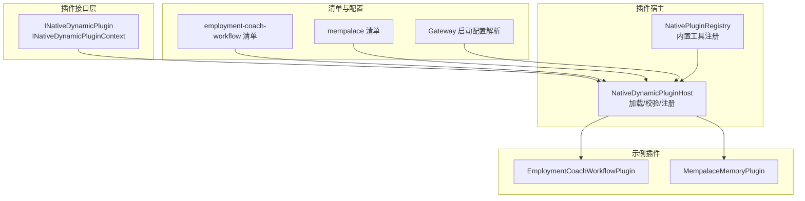
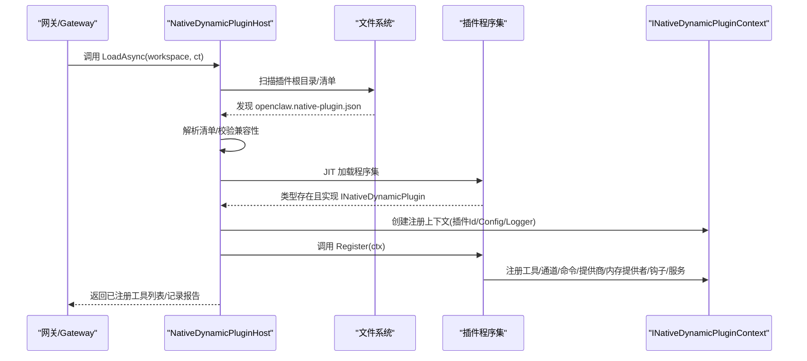
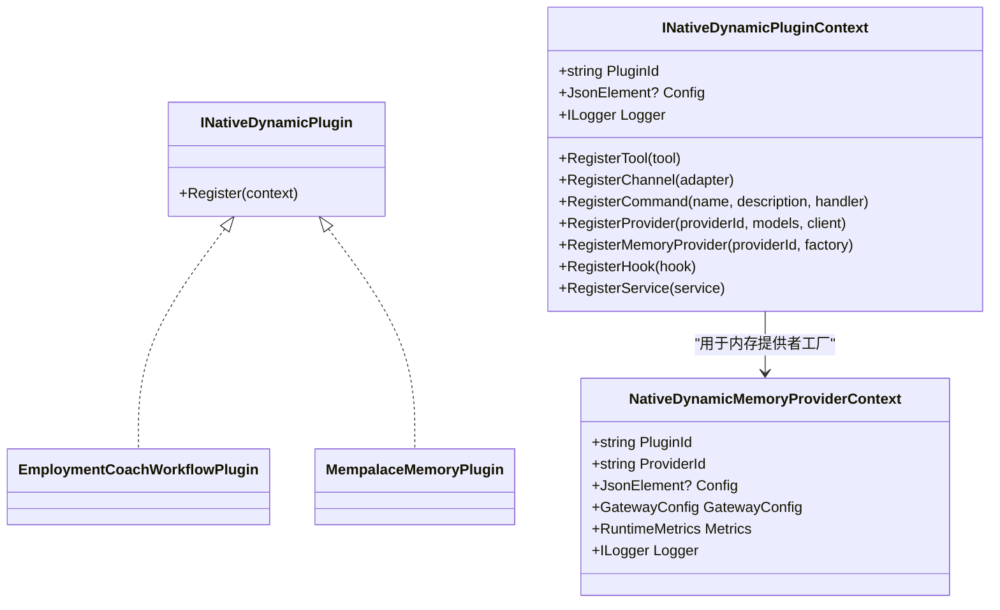
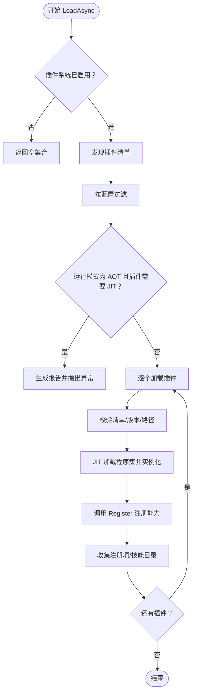
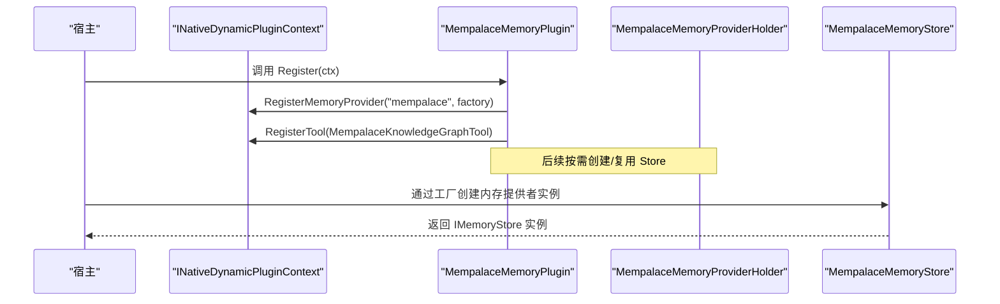
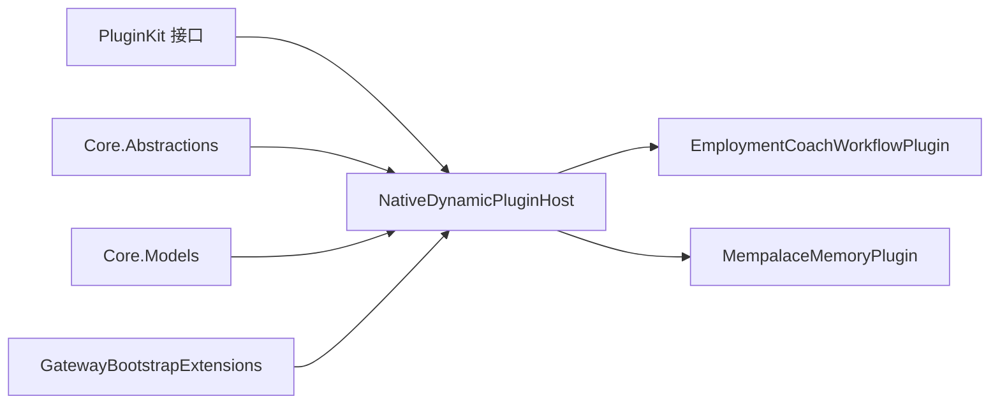
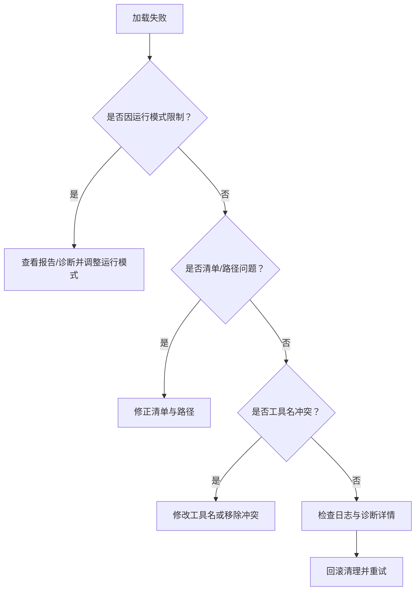

# 原生插件开发

<cite>
**本文引用的文件**
- [INativeDynamicPlugin.cs](file://src/OpenClaw.PluginKit/INativeDynamicPlugin.cs)
- [NativeDynamicPluginHost.cs](file://src/OpenClaw.Agent/Plugins/NativeDynamicPluginHost.cs)
- [NativePluginRegistry.cs](file://src/OpenClaw.Agent/Plugins/NativePluginRegistry.cs)
- [EmploymentCoachWorkflowPlugin.cs](file://src/OpenClaw.Plugins.EmploymentCoachWorkflow/EmploymentCoachWorkflowPlugin.cs)
- [openclaw.native-plugin.json（就业教练工作流）](file://src/OpenClaw.Plugins.EmploymentCoachWorkflow/openclaw.native-plugin.json)
- [MempalaceMemoryPlugin.cs](file://src/OpenClaw.Plugins.Mempalace/MempalaceMemoryPlugin.cs)
- [MempalaceMemoryStore.cs](file://src/OpenClaw.Plugins.Mempalace/MempalaceMemoryStore.cs)
- [openclaw.native-plugin.json（Mempalace 内存插件）](file://src/OpenClaw.Plugins.Mempalace/openclaw.native-plugin.json)
- [GatewayBootstrapExtensions.cs](file://src/OpenClaw.Gateway/Bootstrap/GatewayBootstrapExtensions.cs)
- [COMPATIBILITY.md](file://docs/COMPATIBILITY.md)
- [NativeDynamicPluginHostTests.cs](file://src/OpenClaw.Tests/NativeDynamicPluginHostTests.cs)
- [CoreServicesExtensionsTests.cs](file://src/OpenClaw.Tests/CoreServicesExtensionsTests.cs)
</cite>

## 目录
1. [简介](#简介)
2. [项目结构](#项目结构)
3. [核心组件](#核心组件)
4. [架构总览](#架构总览)
5. [详细组件分析](#详细组件分析)
6. [依赖关系分析](#依赖关系分析)
7. [性能考虑](#性能考虑)
8. [故障排查指南](#故障排查指南)
9. [结论](#结论)
10. [附录：开发步骤与最佳实践](#附录开发步骤与最佳实践)

## 简介
本文件面向原生 .NET 插件开发者，系统性阐述 INativeDynamicPlugin 接口的使用方法、Register 方法的实现要点、插件上下文 INativeDynamicPluginContext 的获取与使用，并结合 EmploymentCoachWorkflowPlugin 与 MempalaceMemoryPlugin 的实际实现，讲解插件生命周期管理、资源清理、错误处理、性能优化与安全注意事项。文档同时提供从零到一的完整开发步骤、调试技巧与常见问题排查路径。

## 项目结构
原生动态插件体系由以下关键部分组成：
- 插件接口与上下文定义：位于 PluginKit，定义 INativeDynamicPlugin 与 INativeDynamicPluginContext。
- 插件宿主加载器：位于 Agent 层，负责发现、校验、加载与注册插件能力。
- 具体插件示例：EmploymentCoachWorkflowPlugin（技能型工作流）、MempalaceMemoryPlugin（内存提供者+工具）。
- 配置与清单：每个插件通过 openclaw.native-plugin.json 暴露元数据与入口类型。
- 运行时兼容性与诊断：通过测试用例与文档明确 AOT/JIT 边界、能力声明与错误报告。

图示来源
- [INativeDynamicPlugin.cs:11-46](file://src/OpenClaw.PluginKit/INativeDynamicPlugin.cs#L11-L46)
- [NativeDynamicPluginHost.cs:19-63](file://src/OpenClaw.Agent/Plugins/NativeDynamicPluginHost.cs#L19-L63)
- [NativePluginRegistry.cs:13-72](file://src/OpenClaw.Agent/Plugins/NativePluginRegistry.cs#L13-L72)
- [EmploymentCoachWorkflowPlugin.cs:5-10](file://src/OpenClaw.Plugins.EmploymentCoachWorkflow/EmploymentCoachWorkflowPlugin.cs#L5-L10)
- [MempalaceMemoryPlugin.cs:6-19](file://src/OpenClaw.Plugins.Mempalace/MempalaceMemoryPlugin.cs#L6-L19)
- [openclaw.native-plugin.json（就业教练工作流）:1-11](file://src/OpenClaw.Plugins.EmploymentCoachWorkflow/openclaw.native-plugin.json#L1-L11)
- [openclaw.native-plugin.json（Mempalace 内存插件）:1-10](file://src/OpenClaw.Plugins.Mempalace/openclaw.native-plugin.json#L1-L10)
- [GatewayBootstrapExtensions.cs:267-307](file://src/OpenClaw.Gateway/Bootstrap/GatewayBootstrapExtensions.cs#L267-L307)

章节来源
- [INativeDynamicPlugin.cs:11-46](file://src/OpenClaw.PluginKit/INativeDynamicPlugin.cs#L11-L46)
- [NativeDynamicPluginHost.cs:19-63](file://src/OpenClaw.Agent/Plugins/NativeDynamicPluginHost.cs#L19-L63)
- [NativePluginRegistry.cs:13-72](file://src/OpenClaw.Agent/Plugins/NativePluginRegistry.cs#L13-L72)
- [openclaw.native-plugin.json（就业教练工作流）:1-11](file://src/OpenClaw.Plugins.EmploymentCoachWorkflow/openclaw.native-plugin.json#L1-L11)
- [openclaw.native-plugin.json（Mempalace 内存插件）:1-10](file://src/OpenClaw.Plugins.Mempalace/openclaw.native-plugin.json#L1-L10)
- [GatewayBootstrapExtensions.cs:267-307](file://src/OpenClaw.Gateway/Bootstrap/GatewayBootstrapExtensions.cs#L267-L307)

## 核心组件
- INativeDynamicPlugin：插件必须实现的接口，提供 Register 方法用于在上下文中注册各类能力。
- INativeDynamicPluginContext：插件注册上下文，提供插件标识、配置、日志、以及注册工具、通道、命令、模型提供商、内存提供者、钩子、服务的能力。
- NativeDynamicPluginHost：负责扫描插件目录、解析清单、校验兼容性、JIT 加载、实例化插件并收集注册项。
- NativePluginRegistry：管理内置 C# 工具的注册与偏好策略，与桥接插件形成统一工具视图。
- 示例插件：
  - EmploymentCoachWorkflowPlugin：声明“skills”能力，用于工作流/技能扩展。
  - MempalaceMemoryPlugin：注册内存提供者与知识图谱工具，展示上下文配置与工厂模式。

章节来源
- [INativeDynamicPlugin.cs:11-46](file://src/OpenClaw.PluginKit/INativeDynamicPlugin.cs#L11-L46)
- [NativeDynamicPluginHost.cs:64-169](file://src/OpenClaw.Agent/Plugins/NativeDynamicPluginHost.cs#L64-L169)
- [NativePluginRegistry.cs:13-104](file://src/OpenClaw.Agent/Plugins/NativePluginRegistry.cs#L13-L104)
- [EmploymentCoachWorkflowPlugin.cs:5-10](file://src/OpenClaw.Plugins.EmploymentCoachWorkflow/EmploymentCoachWorkflowPlugin.cs#L5-L10)
- [MempalaceMemoryPlugin.cs:6-19](file://src/OpenClaw.Plugins.Mempalace/MempalaceMemoryPlugin.cs#L6-L19)

## 架构总览
下图展示了原生动态插件从发现到注册的关键流程，包括能力声明、运行时模式限制、配置注入与注册项收集。

图示来源
- [NativeDynamicPluginHost.cs:64-169](file://src/OpenClaw.Agent/Plugins/NativeDynamicPluginHost.cs#L64-L169)
- [openclaw.native-plugin.json（就业教练工作流）:1-11](file://src/OpenClaw.Plugins.EmploymentCoachWorkflow/openclaw.native-plugin.json#L1-L11)
- [openclaw.native-plugin.json（Mempalace 内存插件）:1-10](file://src/OpenClaw.Plugins.Mempalace/openclaw.native-plugin.json#L1-L10)

章节来源
- [NativeDynamicPluginHost.cs:64-169](file://src/OpenClaw.Agent/Plugins/NativeDynamicPluginHost.cs#L64-L169)

## 详细组件分析

### 接口与上下文：INativeDynamicPlugin 与 INativeDynamicPluginContext
- INativeDynamicPlugin.Register：插件在此方法中调用上下文提供的注册 API，完成能力暴露。
- INativeDynamicPluginContext：
  - 基础信息：PluginId、Config、Logger。
  - 能力注册：RegisterTool、RegisterChannel、RegisterCommand、RegisterProvider、RegisterMemoryProvider、RegisterHook、RegisterService。
- NativeDynamicMemoryProviderContext：内存提供者工厂参数，包含插件Id、ProviderId、Config、GatewayConfig、RuntimeMetrics、Logger。

图示来源
- [INativeDynamicPlugin.cs:11-46](file://src/OpenClaw.PluginKit/INativeDynamicPlugin.cs#L11-L46)
- [EmploymentCoachWorkflowPlugin.cs:5-10](file://src/OpenClaw.Plugins.EmploymentCoachWorkflow/EmploymentCoachWorkflowPlugin.cs#L5-L10)
- [MempalaceMemoryPlugin.cs:6-19](file://src/OpenClaw.Plugins.Mempalace/MempalaceMemoryPlugin.cs#L6-L19)

章节来源
- [INativeDynamicPlugin.cs:11-46](file://src/OpenClaw.PluginKit/INativeDynamicPlugin.cs#L11-L46)

### 宿主加载器：NativeDynamicPluginHost
- 发现与过滤：支持多路径扫描、允许/拒绝列表、按启用条目过滤。
- 运行时模式限制：当有效运行模式为 AOT 时，要求 JIT-only 的能力将被阻止并生成诊断报告。
- 加载与校验：验证插件清单、程序集路径、最小宿主版本、插件 API 版本兼容性。
- 实例化与注册：反射加载类型、构造注册上下文、调用 Register、收集工具/通道/命令/提供商/内存提供者/钩子/服务/技能目录。
- 生命周期与清理：失败回滚、服务停止、适配器释放、加载上下文卸载。

图示来源
- [NativeDynamicPluginHost.cs:64-169](file://src/OpenClaw.Agent/Plugins/NativeDynamicPluginHost.cs#L64-L169)
- [NativeDynamicPluginHost.cs:210-345](file://src/OpenClaw.Agent/Plugins/NativeDynamicPluginHost.cs#L210-L345)
- [NativeDynamicPluginHost.cs:469-505](file://src/OpenClaw.Agent/Plugins/NativeDynamicPluginHost.cs#L469-L505)
- [NativeDynamicPluginHost.cs:700-782](file://src/OpenClaw.Agent/Plugins/NativeDynamicPluginHost.cs#L700-L782)

章节来源
- [NativeDynamicPluginHost.cs:64-169](file://src/OpenClaw.Agent/Plugins/NativeDynamicPluginHost.cs#L64-L169)
- [NativeDynamicPluginHost.cs:210-345](file://src/OpenClaw.Agent/Plugins/NativeDynamicPluginHost.cs#L210-L345)
- [NativeDynamicPluginHost.cs:469-505](file://src/OpenClaw.Agent/Plugins/NativeDynamicPluginHost.cs#L469-L505)
- [NativeDynamicPluginHost.cs:700-782](file://src/OpenClaw.Agent/Plugins/NativeDynamicPluginHost.cs#L700-L782)

### 示例插件：EmploymentCoachWorkflowPlugin
- 角色：技能型工作流插件，声明 capabilities 为 skills，支持通过清单中的 skills 字段引入技能目录。
- 实现要点：在 Register 中可注册命令、工具或钩子以扩展工作流能力；当前示例为空实现，便于演示清单与能力声明。

章节来源
- [EmploymentCoachWorkflowPlugin.cs:5-10](file://src/OpenClaw.Plugins.EmploymentCoachWorkflow/EmploymentCoachWorkflowPlugin.cs#L5-L10)
- [openclaw.native-plugin.json（就业教练工作流）:1-11](file://src/OpenClaw.Plugins.EmploymentCoachWorkflow/openclaw.native-plugin.json#L1-L11)

### 示例插件：MempalaceMemoryPlugin
- 角色：内存提供者与工具插件，注册名为 “mempalace” 的内存提供者工厂，并注册一个知识图谱工具。
- 关键点：
  - 使用 NativeDynamicMemoryProviderContext 获取 GatewayConfig 与 RuntimeMetrics，构建内存存储。
  - 提供线程安全的单例持有者，避免重复初始化。
  - 工具在运行时检查内存提供者是否激活，否则返回错误提示。

图示来源
- [MempalaceMemoryPlugin.cs:6-19](file://src/OpenClaw.Plugins.Mempalace/MempalaceMemoryPlugin.cs#L6-L19)
- [MempalaceMemoryPlugin.cs:21-40](file://src/OpenClaw.Plugins.Mempalace/MempalaceMemoryPlugin.cs#L21-L40)
- [MempalaceMemoryStore.cs:33-57](file://src/OpenClaw.Plugins.Mempalace/MempalaceMemoryStore.cs#L33-L57)

章节来源
- [MempalaceMemoryPlugin.cs:6-19](file://src/OpenClaw.Plugins.Mempalace/MempalaceMemoryPlugin.cs#L6-L19)
- [MempalaceMemoryPlugin.cs:21-40](file://src/OpenClaw.Plugins.Mempalace/MempalaceMemoryPlugin.cs#L21-L40)
- [MempalaceMemoryStore.cs:33-57](file://src/OpenClaw.Plugins.Mempalace/MempalaceMemoryStore.cs#L33-L57)

### 内存提供者工厂与工具集成
- 工厂模式：通过 RegisterMemoryProvider 提供的工厂函数接收 NativeDynamicMemoryProviderContext，按需创建 IMemoryStore 实例。
- 工具集成：工具在执行前检查内存提供者状态，确保只在可用时进行操作。
- 存储实现：MempalaceMemoryStore 实现多种内存接口，封装会话存储、向量检索、知识图谱等能力，并提供异步释放。

章节来源
- [MempalaceMemoryPlugin.cs:10-19](file://src/OpenClaw.Plugins.Mempalace/MempalaceMemoryPlugin.cs#L10-L19)
- [MempalaceMemoryStore.cs:15-57](file://src/OpenClaw.Plugins.Mempalace/MempalaceMemoryStore.cs#L15-L57)
- [MempalaceMemoryStore.cs:202-221](file://src/OpenClaw.Plugins.Mempalace/MempalaceMemoryStore.cs#L202-L221)

## 依赖关系分析
- 插件接口层依赖 Core 抽象与模型，确保跨模块一致的工具、通道、内存接口契约。
- 宿主依赖 Microsoft.Extensions.AI 与日志框架，提供聊天客户端与可观测性。
- 示例插件依赖 PluginKit 接口与 Core 抽象，实现具体能力。
- 配置解析：GatewayBootstrapExtensions 将 IConfigurationSection 转换为 JsonElement，注入插件上下文 Config。

图示来源
- [INativeDynamicPlugin.cs:1-8](file://src/OpenClaw.PluginKit/INativeDynamicPlugin.cs#L1-L8)
- [NativeDynamicPluginHost.cs:1-12](file://src/OpenClaw.Agent/Plugins/NativeDynamicPluginHost.cs#L1-L12)
- [GatewayBootstrapExtensions.cs:267-307](file://src/OpenClaw.Gateway/Bootstrap/GatewayBootstrapExtensions.cs#L267-L307)

章节来源
- [INativeDynamicPlugin.cs:1-8](file://src/OpenClaw.PluginKit/INativeDynamicPlugin.cs#L1-L8)
- [NativeDynamicPluginHost.cs:1-12](file://src/OpenClaw.Agent/Plugins/NativeDynamicPluginHost.cs#L1-L12)
- [GatewayBootstrapExtensions.cs:267-307](file://src/OpenClaw.Gateway/Bootstrap/GatewayBootstrapExtensions.cs#L267-L307)

## 性能考虑
- 内存提供者延迟初始化与单例缓存：示例插件通过持有者在首次请求时创建存储实例，避免不必要的资源占用。
- 并发控制：使用锁与信号量保护共享资源访问，降低竞争风险。
- 向量化检索与候选裁剪：内存搜索根据配置裁剪候选数量，平衡精度与性能。
- 异步释放：实现 IAsyncDisposable，确保后台资源（如数据库连接、知识图谱）及时释放。
- 日志与指标：通过 RuntimeMetrics 与 Logger 记录关键指标，辅助性能分析与问题定位。

章节来源
- [MempalaceMemoryPlugin.cs:21-40](file://src/OpenClaw.Plugins.Mempalace/MempalaceMemoryPlugin.cs#L21-L40)
- [MempalaceMemoryStore.cs:29-31](file://src/OpenClaw.Plugins.Mempalace/MempalaceMemoryStore.cs#L29-L31)
- [MempalaceMemoryStore.cs:137-176](file://src/OpenClaw.Plugins.Mempalace/MempalaceMemoryStore.cs#L137-L176)
- [MempalaceMemoryStore.cs:202-221](file://src/OpenClaw.Plugins.Mempalace/MempalaceMemoryStore.cs#L202-L221)

## 故障排查指南
- AOT/JIT 模式限制：当运行模式为 AOT 且插件声明 JIT-only 能力时，加载将被阻止并生成明确诊断。请确认运行模式与插件能力匹配。
- 清单与路径问题：清单或程序集路径超出插件根目录将产生诊断并拒绝加载，确保清单与程序集位于同一根目录内。
- 重复工具名冲突：后注册的同名工具会被跳过并记录警告，优先保留先注册的工具。
- 失败回滚：加载失败时，宿主会尽力停止已启动的服务、卸载加载上下文并回退到之前的状态。
- 无动态内存提供者：若未注册任何动态内存提供者，系统将抛出明确异常，提示需注册内存提供者。

图示来源
- [NativeDynamicPluginHost.cs:87-130](file://src/OpenClaw.Agent/Plugins/NativeDynamicPluginHost.cs#L87-L130)
- [NativeDynamicPluginHost.cs:520-649](file://src/OpenClaw.Agent/Plugins/NativeDynamicPluginHost.cs#L520-L649)
- [NativeDynamicPluginHost.cs:252-268](file://src/OpenClaw.Agent/Plugins/NativeDynamicPluginHost.cs#L252-L268)
- [NativeDynamicPluginHostTests.cs:100-123](file://src/OpenClaw.Tests/NativeDynamicPluginHostTests.cs#L100-L123)
- [CoreServicesExtensionsTests.cs:343-366](file://src/OpenClaw.Tests/CoreServicesExtensionsTests.cs#L343-L366)

章节来源
- [NativeDynamicPluginHost.cs:87-130](file://src/OpenClaw.Agent/Plugins/NativeDynamicPluginHost.cs#L87-L130)
- [NativeDynamicPluginHost.cs:520-649](file://src/OpenClaw.Agent/Plugins/NativeDynamicPluginHost.cs#L520-L649)
- [NativeDynamicPluginHost.cs:252-268](file://src/OpenClaw.Agent/Plugins/NativeDynamicPluginHost.cs#L252-L268)
- [NativeDynamicPluginHostTests.cs:100-123](file://src/OpenClaw.Tests/NativeDynamicPluginHostTests.cs#L100-L123)
- [CoreServicesExtensionsTests.cs:343-366](file://src/OpenClaw.Tests/CoreServicesExtensionsTests.cs#L343-L366)

## 结论
原生动态插件体系通过清晰的接口契约与严格的宿主加载流程，实现了能力声明、运行时模式约束、配置注入与注册项收集的闭环。示例插件展示了如何基于上下文注册内存提供者与工具，并通过工厂模式与持有者实现资源的高效管理。遵循本文的开发步骤、性能与安全建议，可快速构建稳定、可维护的原生插件。

## 附录：开发步骤与最佳实践

### 开发步骤
1. 定义插件类并实现 INativeDynamicPlugin：
   - 在 Register 中调用上下文的注册 API，暴露所需能力。
   - 参考路径：[EmploymentCoachWorkflowPlugin.cs:5-10](file://src/OpenClaw.Plugins.EmploymentCoachWorkflow/EmploymentCoachWorkflowPlugin.cs#L5-L10)、[MempalaceMemoryPlugin.cs:6-19](file://src/OpenClaw.Plugins.Mempalace/MempalaceMemoryPlugin.cs#L6-L19)
2. 编写 openclaw.native-plugin.json：
   - 指定 id、name、version、assemblyPath、typeName、capabilities、jitOnly 等字段。
   - 参考路径：[就业教练工作流清单:1-11](file://src/OpenClaw.Plugins.EmploymentCoachWorkflow/openclaw.native-plugin.json#L1-L11)、[Mempalace 清单:1-10](file://src/OpenClaw.Plugins.Mempalace/openclaw.native-plugin.json#L1-L10)
3. 配置与启动：
   - 在网关配置中启用插件加载路径与条目配置，确保 Config 被正确解析为 JsonElement。
   - 参考路径：[GatewayBootstrapExtensions.cs:267-307](file://src/OpenClaw.Gateway/Bootstrap/GatewayBootstrapExtensions.cs#L267-L307)
4. 运行与验证：
   - 启动宿主加载插件，检查 Reports 与日志，确认能力已注册。
   - 参考路径：[NativeDynamicPluginHost.cs:64-169](file://src/OpenClaw.Agent/Plugins/NativeDynamicPluginHost.cs#L64-L169)

### 最佳实践
- 能力声明与运行模式匹配：声明 jitOnly 或需要 JIT 的能力时，确保运行模式为 JIT。
- 清单与路径安全：保证清单与程序集均位于插件根目录内，避免越界路径。
- 工具命名唯一：避免与已有工具同名，防止冲突与覆盖。
- 资源生命周期管理：实现 IAsyncDisposable/IDisposable，确保服务停止与资源释放。
- 配置健壮性：对 Config 进行必要校验与默认值处理，避免空引用。
- 错误诊断：利用宿主生成的诊断报告与日志，快速定位问题。

### 调试技巧
- 查看加载报告：关注 Reports 列表中的 Loaded、Error、Diagnostics 字段。
- 运行模式诊断：当出现 JIT 模式相关错误时，检查 EffectiveRuntimeMode 与 BlockedByRuntimeMode。
- 路径与清单校验：确认清单解析成功、程序集路径存在且在根目录内。
- 工具冲突排查：当工具名重复时，优先保留先注册的工具，检查日志中的警告。

章节来源
- [INativeDynamicPlugin.cs:11-46](file://src/OpenClaw.PluginKit/INativeDynamicPlugin.cs#L11-L46)
- [NativeDynamicPluginHost.cs:64-169](file://src/OpenClaw.Agent/Plugins/NativeDynamicPluginHost.cs#L64-L169)
- [openclaw.native-plugin.json（就业教练工作流）:1-11](file://src/OpenClaw.Plugins.EmploymentCoachWorkflow/openclaw.native-plugin.json#L1-L11)
- [openclaw.native-plugin.json（Mempalace 内存插件）:1-10](file://src/OpenClaw.Plugins.Mempalace/openclaw.native-plugin.json#L1-L10)
- [GatewayBootstrapExtensions.cs:267-307](file://src/OpenClaw.Gateway/Bootstrap/GatewayBootstrapExtensions.cs#L267-L307)
- [COMPATIBILITY.md:72-103](file://docs/COMPATIBILITY.md#L72-L103)