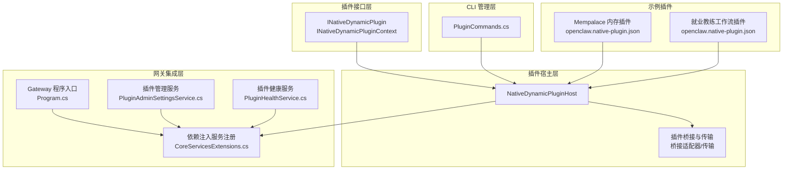
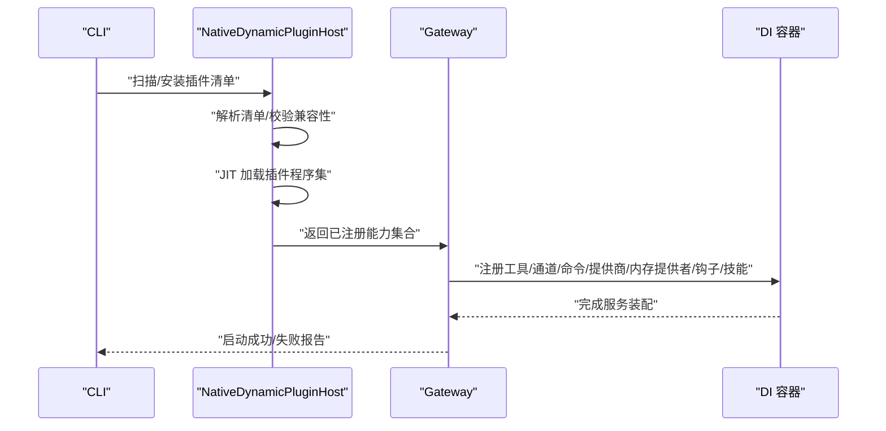
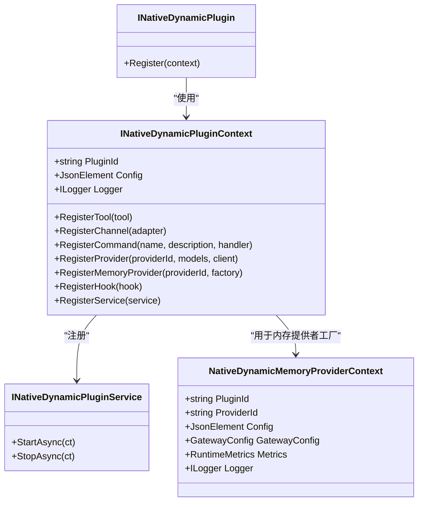
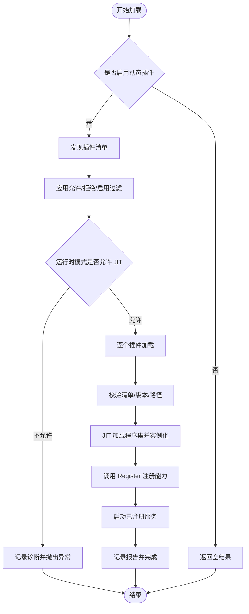
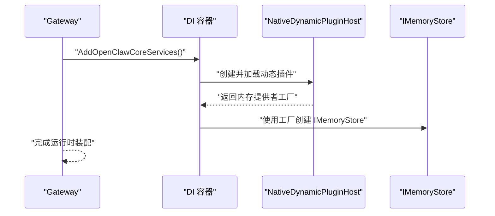
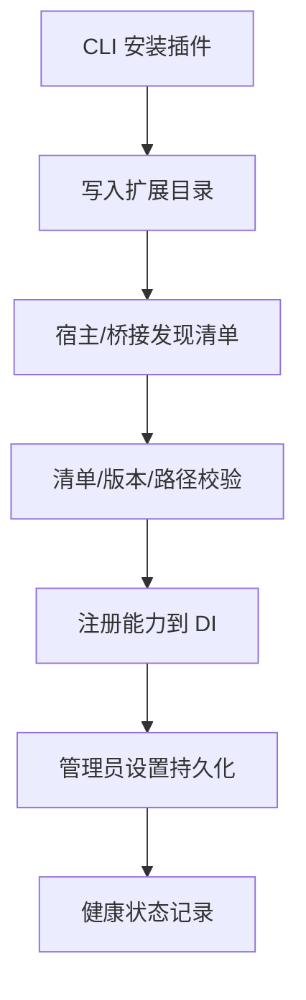
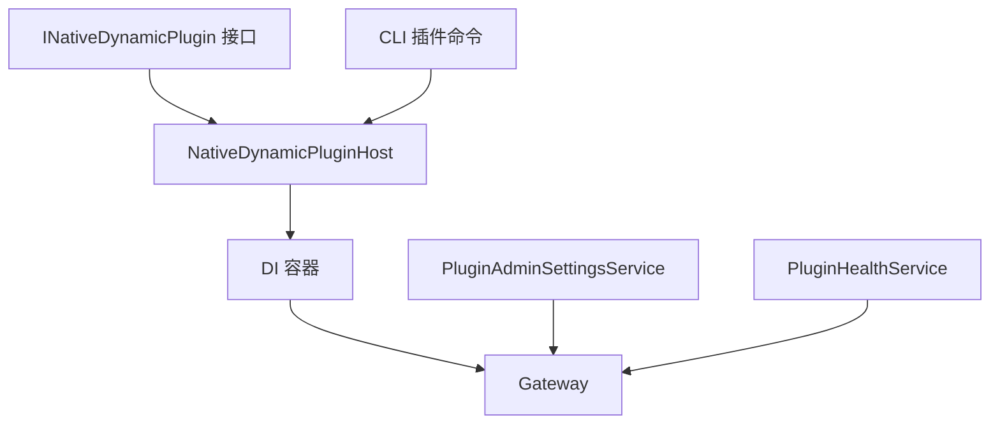

# 插件架构设计

<cite>
**本文档引用的文件**
- [INativeDynamicPlugin.cs](file://src/OpenClaw.PluginKit/INativeDynamicPlugin.cs)
- [NativeDynamicPluginHost.cs](file://src/OpenClaw.Agent/Plugins/NativeDynamicPluginHost.cs)
- [CoreServicesExtensions.cs](file://src/OpenClaw.Gateway/Composition/CoreServicesExtensions.cs)
- [Program.cs](file://src/OpenClaw.Gateway/Program.cs)
- [PluginCommands.cs](file://src/OpenClaw.Cli/PluginCommands.cs)
- [openclaw.native-plugin.json（Mempalace）](file://src/OpenClaw.Plugins.Mempalace/openclaw.native-plugin.json)
- [openclaw.native-plugin.json（就业教练工作流）](file://src/OpenClaw.Plugins.EmploymentCoachWorkflow/openclaw.native-plugin.json)
- [PluginAdminSettingsService.cs](file://src/OpenClaw.Gateway/PluginAdminSettingsService.cs)
- [PluginHealthService.cs](file://src/OpenClaw.Gateway/PluginHealthService.cs)
- [CoreServicesExtensionsTests.cs](file://src/OpenClaw.Tests/CoreServicesExtensionsTests.cs)
- [NativeDynamicPluginHostTests.cs](file://src/OpenClaw.Tests/NativeDynamicPluginHostTests.cs)
</cite>

## 目录
1. [简介](#简介)
2. [项目结构](#项目结构)
3. [核心组件](#核心组件)
4. [架构总览](#架构总览)
5. [详细组件分析](#详细组件分析)
6. [依赖关系分析](#依赖关系分析)
7. [性能考虑](#性能考虑)
8. [故障排除指南](#故障排除指南)
9. [结论](#结论)
10. [附录](#附录)

## 简介
本文件面向插件架构设计，系统性阐述 OpenClaw 的插件系统：包括 INativeDynamicPlugin 接口设计理念、插件生命周期管理、与网关服务的集成方式、插件注册流程、动态加载机制、依赖注入配置、以及对原生 .NET 插件与 JavaScript 插件的统一管理策略。文档同时提供架构图、组件关系说明、扩展点设计与最佳实践。

## 项目结构
插件系统横跨多个项目：
- OpenClaw.PluginKit：定义插件接口与上下文契约
- OpenClaw.Agent：实现原生动态插件主机与桥接能力
- OpenClaw.Gateway：在运行时装配并集成插件能力
- OpenClaw.Cli：提供插件安装、卸载、搜索、列出等管理命令
- 具体插件示例：Mempalace 内存插件、就业教练工作流插件等

**图表来源**
- [INativeDynamicPlugin.cs:11-46](file://src/OpenClaw.PluginKit/INativeDynamicPlugin.cs#L11-L46)
- [NativeDynamicPluginHost.cs:19-62](file://src/OpenClaw.Agent/Plugins/NativeDynamicPluginHost.cs#L19-L62)
- [CoreServicesExtensions.cs:38-249](file://src/OpenClaw.Gateway/Composition/CoreServicesExtensions.cs#L38-L249)
- [Program.cs:42-98](file://src/OpenClaw.Gateway/Program.cs#L42-L98)
- [PluginCommands.cs:14-37](file://src/OpenClaw.Cli/PluginCommands.cs#L14-L37)
- [openclaw.native-plugin.json（Mempalace）:1-10](file://src/OpenClaw.Plugins.Mempalace/openclaw.native-plugin.json#L1-L10)
- [openclaw.native-plugin.json（就业教练工作流）:1-11](file://src/OpenClaw.Plugins.EmploymentCoachWorkflow/openclaw.native-plugin.json#L1-L11)

**章节来源**
- [Program.cs:42-98](file://src/OpenClaw.Gateway/Program.cs#L42-L98)
- [CoreServicesExtensions.cs:38-249](file://src/OpenClaw.Gateway/Composition/CoreServicesExtensions.cs#L38-L249)

## 核心组件
- INativeDynamicPlugin 及上下文：定义插件注册入口与能力声明
- NativeDynamicPluginHost：负责发现、验证、加载、启动原生动态插件，并维护其生命周期
- 网关服务集成：通过依赖注入在启动阶段装配插件能力（工具、通道、命令、模型提供商、内存提供者、钩子、技能）
- CLI 插件管理：提供安装、卸载、搜索、列举插件的能力
- 健康与管理员设置：持久化插件启用状态、配置与禁用原因

**章节来源**
- [INativeDynamicPlugin.cs:11-46](file://src/OpenClaw.PluginKit/INativeDynamicPlugin.cs#L11-L46)
- [NativeDynamicPluginHost.cs:19-62](file://src/OpenClaw.Agent/Plugins/NativeDynamicPluginHost.cs#L19-L62)
- [PluginCommands.cs:14-37](file://src/OpenClaw.Cli/PluginCommands.cs#L14-L37)
- [PluginAdminSettingsService.cs:81-108](file://src/OpenClaw.Gateway/PluginAdminSettingsService.cs#L81-L108)
- [PluginHealthService.cs:339-379](file://src/OpenClaw.Gateway/PluginHealthService.cs#L339-L379)

## 架构总览
插件系统采用“接口定义 + 动态加载 + 运行时装配”的分层架构：
- 接口层：通过 INativeDynamicPlugin 约定插件能力边界
- 宿主层：NativeDynamicPluginHost 负责插件发现、兼容性校验、JIT 加载、生命周期管理
- 集成层：Gateway 在启动时解析配置，将插件能力注入到运行时服务中
- 管理层：CLI 提供插件全生命周期管理；管理员设置与健康服务保障运行期可控性

**图表来源**
- [PluginCommands.cs:39-62](file://src/OpenClaw.Cli/PluginCommands.cs#L39-L62)
- [NativeDynamicPluginHost.cs:64-169](file://src/OpenClaw.Agent/Plugins/NativeDynamicPluginHost.cs#L64-L169)
- [CoreServicesExtensions.cs:333-380](file://src/OpenClaw.Gateway/Composition/CoreServicesExtensions.cs#L333-L380)

## 详细组件分析

### INativeDynamicPlugin 接口与上下文设计
- 设计理念
  - 以最小接口暴露能力：插件通过 Register 方法接收上下文，按需注册工具、通道、命令、模型提供商、内存提供者、钩子和服务
  - 明确职责分离：上下文仅提供只读配置、日志与注册方法，避免插件直接访问宿主内部细节
  - 生命周期服务：通过 INativeDynamicPluginService 支持插件内托管服务的异步启停
- 关键能力
  - 工具注册：RegisterTool
  - 通道注册：RegisterChannel
  - 命令注册：RegisterCommand
  - 模型提供商注册：RegisterProvider
  - 内存提供者工厂注册：RegisterMemoryProvider
  - 钩子注册：RegisterHook
  - 自定义服务注册：RegisterService

**图表来源**
- [INativeDynamicPlugin.cs:11-46](file://src/OpenClaw.PluginKit/INativeDynamicPlugin.cs#L11-L46)

**章节来源**
- [INativeDynamicPlugin.cs:11-46](file://src/OpenClaw.PluginKit/INativeDynamicPlugin.cs#L11-L46)

### NativeDynamicPluginHost：动态加载与生命周期管理
- 发现与过滤
  - 支持从多路径扫描、工作区目录与全局目录发现插件清单
  - 基于允许/拒绝列表与启用状态进行过滤
- 兼容性校验
  - 最低宿主版本、插件 API 版本匹配
  - 插件清单完整性与路径合法性检查
- 动态加载
  - 使用专用的 NativeDynamicPluginLoadContext 实现程序集隔离与卸载
  - JIT 模式下实例化插件类型并调用 Register
- 能力收集与回滚
  - 注册期间若发生异常，自动清理已启动的服务与已注册能力
- 生命周期
  - 启动：遍历已注册服务并调用 StartAsync
  - 停止：在 DisposeAsync 中依次 StopAsync 并卸载程序集

**图表来源**
- [NativeDynamicPluginHost.cs:64-169](file://src/OpenClaw.Agent/Plugins/NativeDynamicPluginHost.cs#L64-L169)
- [NativeDynamicPluginHost.cs:210-370](file://src/OpenClaw.Agent/Plugins/NativeDynamicPluginHost.cs#L210-L370)

**章节来源**
- [NativeDynamicPluginHost.cs:64-169](file://src/OpenClaw.Agent/Plugins/NativeDynamicPluginHost.cs#L64-L169)
- [NativeDynamicPluginHost.cs:210-370](file://src/OpenClaw.Agent/Plugins/NativeDynamicPluginHost.cs#L210-L370)
- [NativeDynamicPluginHost.cs:372-378](file://src/OpenClaw.Agent/Plugins/NativeDynamicPluginHost.cs#L372-L378)
- [NativeDynamicPluginHost.cs:656-698](file://src/OpenClaw.Agent/Plugins/NativeDynamicPluginHost.cs#L656-L698)

### 与网关服务的集成
- 启动装配
  - Gateway 在构建服务时调用 AddOpenClawCoreServices，其中包含内存提供者的动态装配逻辑
  - 当选择 mempalace 内存提供者时，会创建 NativeDynamicPluginHost 并加载内存提供者工厂
- 能力注入
  - 已注册的工具、通道、命令、提供商、钩子、技能根目录等被注入到运行时服务中
- 运行时模式控制
  - 若运行时处于 AOT 模式且插件声明需要 JIT，则加载失败并记录诊断

**图表来源**
- [CoreServicesExtensions.cs:295-380](file://src/OpenClaw.Gateway/Composition/CoreServicesExtensions.cs#L295-L380)

**章节来源**
- [CoreServicesExtensions.cs:295-380](file://src/OpenClaw.Gateway/Composition/CoreServicesExtensions.cs#L295-L380)

### 插件注册流程与依赖注入配置
- 清单与能力声明
  - 原生插件通过 openclaw.native-plugin.json 声明 ID、版本、入口程序集、类型名、能力与技能目录
- CLI 安装与发现
  - CLI 支持从 npm/ClawHub 或本地源安装插件，写入扩展目录后由桥接或宿主发现
- 管理员设置与健康状态
  - PluginAdminSettingsService 提供插件条目的增删改查与持久化
  - PluginHealthService 维护插件阻断列表与状态文件

**图表来源**
- [PluginCommands.cs:39-154](file://src/OpenClaw.Cli/PluginCommands.cs#L39-L154)
- [openclaw.native-plugin.json（Mempalace）:1-10](file://src/OpenClaw.Plugins.Mempalace/openclaw.native-plugin.json#L1-L10)
- [openclaw.native-plugin.json（就业教练工作流）:1-11](file://src/OpenClaw.Plugins.EmploymentCoachWorkflow/openclaw.native-plugin.json#L1-L11)
- [PluginAdminSettingsService.cs:92-108](file://src/OpenClaw.Gateway/PluginAdminSettingsService.cs#L92-L108)
- [PluginHealthService.cs:346-379](file://src/OpenClaw.Gateway/PluginHealthService.cs#L346-L379)

**章节来源**
- [PluginCommands.cs:39-154](file://src/OpenClaw.Cli/PluginCommands.cs#L39-L154)
- [openclaw.native-plugin.json（Mempalace）:1-10](file://src/OpenClaw.Plugins.Mempalace/openclaw.native-plugin.json#L1-L10)
- [openclaw.native-plugin.json（就业教练工作流）:1-11](file://src/OpenClaw.Plugins.EmploymentCoachWorkflow/openclaw.native-plugin.json#L1-L11)
- [PluginAdminSettingsService.cs:92-108](file://src/OpenClaw.Gateway/PluginAdminSettingsService.cs#L92-L108)
- [PluginHealthService.cs:346-379](file://src/OpenClaw.Gateway/PluginHealthService.cs#L346-L379)

### 原生 .NET 插件与 JavaScript 插件的统一管理
- 原生动态插件（.NET）
  - 通过 INativeDynamicPlugin 接口与 NativeDynamicPluginHost 动态加载
  - 严格遵循 JIT-only 能力声明与运行时模式约束
- JavaScript 插件（桥接）
  - 通过 CLI 安装至扩展目录，由桥接层发现与管理
  - 支持结构化清单与能力声明，具备信任级别与兼容性诊断
- 统一管理
  - CLI 提供一致的安装/卸载/搜索/列举命令
  - 管理员设置与健康服务对两类插件均适用

**章节来源**
- [PluginCommands.cs:14-37](file://src/OpenClaw.Cli/PluginCommands.cs#L14-L37)
- [NativeDynamicPluginHost.cs:210-370](file://src/OpenClaw.Agent/Plugins/NativeDynamicPluginHost.cs#L210-L370)

## 依赖关系分析
- 组件耦合
  - INativeDynamicPlugin 与 NativeDynamicPluginHost 之间为弱耦合：通过接口与上下文交互
  - Gateway 对插件能力的依赖通过 DI 容器集中管理，降低直接耦合
- 外部依赖
  - CLI 依赖 npm 与文件系统进行插件安装与发现
  - 网关依赖运行时配置与健康服务进行插件治理

**图表来源**
- [INativeDynamicPlugin.cs:11-46](file://src/OpenClaw.PluginKit/INativeDynamicPlugin.cs#L11-L46)
- [NativeDynamicPluginHost.cs:19-62](file://src/OpenClaw.Agent/Plugins/NativeDynamicPluginHost.cs#L19-L62)
- [CoreServicesExtensions.cs:38-249](file://src/OpenClaw.Gateway/Composition/CoreServicesExtensions.cs#L38-L249)
- [PluginCommands.cs:14-37](file://src/OpenClaw.Cli/PluginCommands.cs#L14-L37)
- [PluginAdminSettingsService.cs:81-108](file://src/OpenClaw.Gateway/PluginAdminSettingsService.cs#L81-L108)
- [PluginHealthService.cs:339-379](file://src/OpenClaw.Gateway/PluginHealthService.cs#L339-L379)

**章节来源**
- [CoreServicesExtensions.cs:38-249](file://src/OpenClaw.Gateway/Composition/CoreServicesExtensions.cs#L38-L249)

## 性能考虑
- 动态加载成本
  - JIT 加载与反射实例化存在开销，建议在插件数量与复杂度可控的前提下使用
- 内存与资源
  - 程序集隔离加载占用额外内存，应确保在插件停止时正确释放
- 启动时间
  - 插件发现与校验可能影响启动时间，建议合理配置扫描路径与启用列表

## 故障排除指南
- 常见问题与诊断
  - AOT 模式下启用 JIT-only 插件：加载失败并提示需要 JIT 模式
  - 插件清单无效或重复 ID：记录诊断并跳过加载
  - 程序集路径越界或不存在：拒绝加载并给出明确错误码
  - 工具名称冲突：首个注册生效，后续重复名称被跳过并记录警告
- 排障步骤
  - 查看插件加载报告与诊断日志
  - 检查运行时模式与插件能力声明是否匹配
  - 校验插件清单路径与依赖完整性
  - 通过管理员设置临时禁用可疑插件并观察系统行为

**章节来源**
- [NativeDynamicPluginHost.cs:87-130](file://src/OpenClaw.Agent/Plugins/NativeDynamicPluginHost.cs#L87-L130)
- [NativeDynamicPluginHost.cs:520-649](file://src/OpenClaw.Agent/Plugins/NativeDynamicPluginHost.cs#L520-L649)
- [NativeDynamicPluginHost.cs:254-268](file://src/OpenClaw.Agent/Plugins/NativeDynamicPluginHost.cs#L254-L268)
- [CoreServicesExtensionsTests.cs:249-282](file://src/OpenClaw.Tests/CoreServicesExtensionsTests.cs#L249-L282)
- [NativeDynamicPluginHostTests.cs:100-203](file://src/OpenClaw.Tests/NativeDynamicPluginHostTests.cs#L100-L203)

## 结论
该插件架构以清晰的接口契约与严格的运行时约束为基础，实现了原生 .NET 插件的动态加载与统一管理，并通过 CLI 与网关服务形成完整的生命周期闭环。通过能力声明、兼容性校验与诊断日志，系统在灵活性与安全性之间取得平衡，适合在生产环境中演进与扩展。

## 附录
- 最佳实践
  - 明确插件能力边界，尽量使用最小权限上下文
  - 在清单中完整声明能力与配置模式，便于安装时验证
  - 将插件置于受控路径，避免越界解析
  - 利用管理员设置与健康服务进行运行期治理
  - 在 AOT 模式下避免声明 JIT-only 能力，或确保运行时模式满足要求