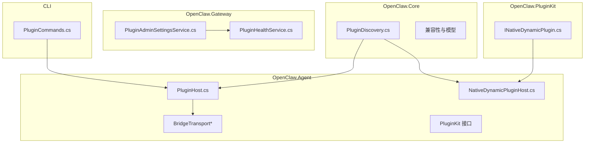
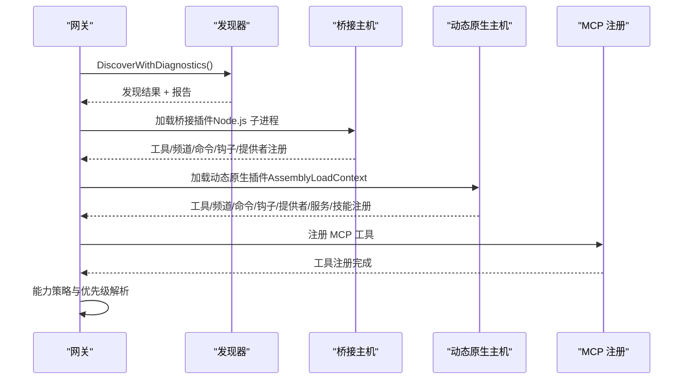
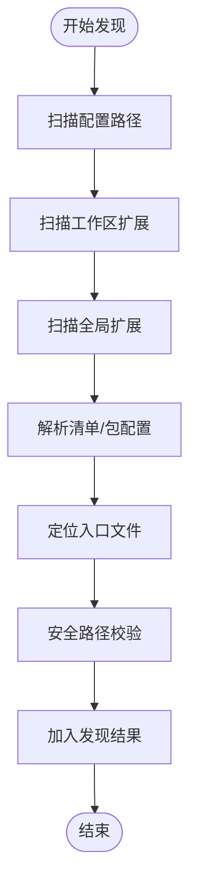
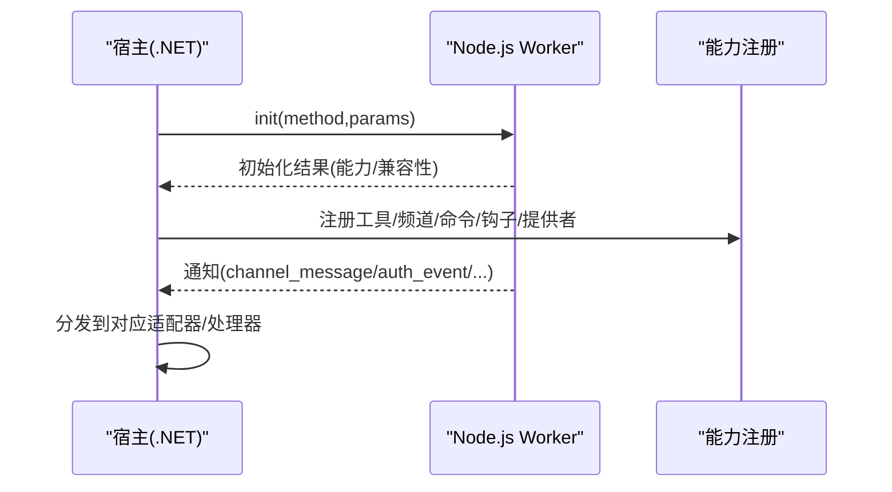
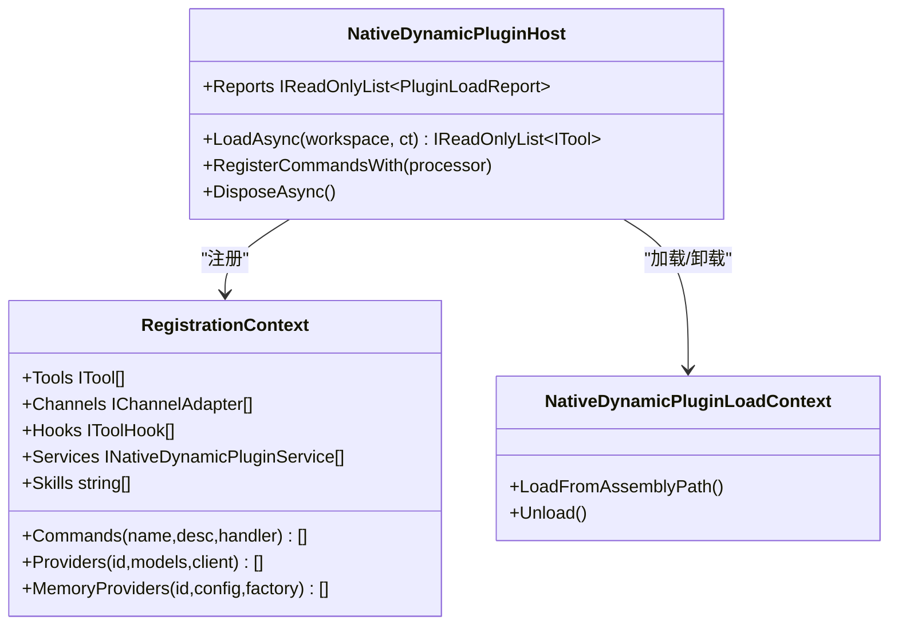
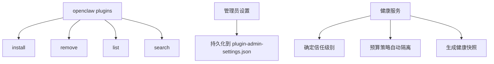
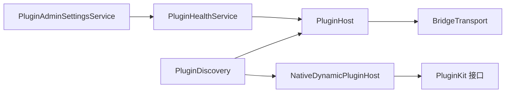

# 插件生态系统

<cite>
**本文档引用的文件**
- [INativeDynamicPlugin.cs](file://src/OpenClaw.PluginKit/INativeDynamicPlugin.cs)
- [PluginAdminSettingsService.cs](file://src/OpenClaw.Gateway/PluginAdminSettingsService.cs)
- [PluginHealthService.cs](file://src/OpenClaw.Gateway/PluginHealthService.cs)
- [PluginCommands.cs](file://src/OpenClaw.Cli/PluginCommands.cs)
- [openclaw-plugin-system-analysis.md](file://docs/openclaw-plugin-system-analysis.md)
- [NativeDynamicPluginHost.cs](file://src/OpenClaw.Agent/Plugins/NativeDynamicPluginHost.cs)
- [PluginHost.cs](file://src/OpenClaw.Agent/Plugins/PluginHost.cs)
- [PluginDiscovery.cs](file://src/OpenClaw.Core/Plugins/PluginDiscovery.cs)
- [employment-coach-workflow.json](file://src/OpenClaw.Plugins.EmploymentCoachWorkflow/openclaw.native-plugin.json)
- [mempalace-memory.json](file://src/OpenClaw.Plugins.Mempalace/openclaw.native-plugin.json)
- [BridgeProcessLaunchSpec.cs](file://src/OpenClaw.Agent/Plugins/BridgeProcessLaunchSpec.cs)
</cite>

## 目录
1. [简介](#简介)
2. [项目结构](#项目结构)
3. [核心组件](#核心组件)
4. [架构总览](#架构总览)
5. [详细组件分析](#详细组件分析)
6. [依赖关系分析](#依赖关系分析)
7. [性能考虑](#性能考虑)
8. [故障排查指南](#故障排查指南)
9. [结论](#结论)
10. [附录](#附录)

## 简介
本文件系统性阐述 OpenClaw 插件生态体系的设计与实现，涵盖原生插件、JavaScript/TypeScript 插件、动态原生插件以及 MCP 服务器插件的发现、加载、生命周期与运行时策略。文档重点说明：
- 插件架构与四大来源的协作机制
- 发现与过滤策略、兼容性校验与诊断
- 动态原生插件的进程内加载与热重载能力
- Node.js 桥接的 JS/TS 插件系统与传输层
- 插件管理 CLI、健康状态与管理员设置
- 版本兼容性、AOT/JIT 门控与预算策略
- 开发指南、最佳实践与性能优化建议

## 项目结构
OpenClaw 插件系统横跨三个核心项目：
- OpenClaw.Core：插件发现算法、验证逻辑与基础模型
- OpenClaw.Agent：宿主编排、桥接传输、原生注册表与动态加载
- OpenClaw.PluginKit：动态 .NET 插件的公共 SDK

**图表来源**
- [PluginDiscovery.cs:11-63](file://src/OpenClaw.Core/Plugins/PluginDiscovery.cs#L11-L63)
- [PluginHost.cs:14-54](file://src/OpenClaw.Agent/Plugins/PluginHost.cs#L14-L54)
- [NativeDynamicPluginHost.cs:19-51](file://src/OpenClaw.Agent/Plugins/NativeDynamicPluginHost.cs#L19-L51)
- [INativeDynamicPlugin.cs:11-29](file://src/OpenClaw.PluginKit/INativeDynamicPlugin.cs#L11-L29)
- [PluginAdminSettingsService.cs:8-24](file://src/OpenClaw.Gateway/PluginAdminSettingsService.cs#L8-L24)
- [PluginHealthService.cs:9-31](file://src/OpenClaw.Gateway/PluginHealthService.cs#L9-L31)
- [PluginCommands.cs:14-37](file://src/OpenClaw.Cli/PluginCommands.cs#L14-L37)

**章节来源**
- [openclaw-plugin-system-analysis.md:1-439](file://docs/openclaw-plugin-system-analysis.md#L1-L439)

## 核心组件
- 插件发现与过滤：统一从配置路径、工作区、全局目录扫描，支持清单与包配置两种入口，严格的安全路径解析与符号链接防护。
- 插件加载与编排：桥接插件通过 Node.js 子进程承载，动态原生插件在进程内加载，MCP 服务器通过标准协议接入。
- 运行时策略：AOT/JIT 门控、能力策略与优先级解析，确保在不同运行模式下的安全与一致性。
- 管理与可观测：CLI 插件管理、健康状态与管理员设置持久化，支持自动预算策略与手动审查。

**章节来源**
- [PluginDiscovery.cs:22-63](file://src/OpenClaw.Core/Plugins/PluginDiscovery.cs#L22-L63)
- [PluginHost.cs:95-179](file://src/OpenClaw.Agent/Plugins/PluginHost.cs#L95-L179)
- [NativeDynamicPluginHost.cs:64-169](file://src/OpenClaw.Agent/Plugins/NativeDynamicPluginHost.cs#L64-L169)
- [PluginHealthService.cs:33-56](file://src/OpenClaw.Gateway/PluginHealthService.cs#L33-L56)
- [PluginAdminSettingsService.cs:70-108](file://src/OpenClaw.Gateway/PluginAdminSettingsService.cs#L70-L108)

## 架构总览
OpenClaw 插件系统采用“多来源 + 统一编排”的设计，四大来源协同工作：
- Bridge 插件（TS/JS）：通过 Node.js 子进程运行，支持工具、频道、命令、提供者、钩子、技能等能力
- 原生插件副本（C#）：进程内工具能力，与动态原生插件互为补充
- 动态原生插件（.NET）：进程内加载，支持热重载，能力更丰富（含服务、内存提供者、技能）
- MCP 服务器：标准化工具接入，支持 AOT/JIT

**图表来源**
- [openclaw-plugin-system-analysis.md:408-417](file://docs/openclaw-plugin-system-analysis.md#L408-L417)
- [PluginHost.cs:95-179](file://src/OpenClaw.Agent/Plugins/PluginHost.cs#L95-L179)
- [NativeDynamicPluginHost.cs:64-169](file://src/OpenClaw.Agent/Plugins/NativeDynamicPluginHost.cs#L64-L169)

## 详细组件分析

### 插件发现与安全路径解析
- 多源扫描：配置路径 → 工作区扩展 → 全局扩展 → 打包资源
- 入口解析：openclaw.plugin.json、package.json openclaw.extensions、index.ts/js/mjs、单文件入口
- 安全校验：符号链接解析与逃逸防护，确保入口与技能目录位于插件根目录内

**图表来源**
- [PluginDiscovery.cs:28-63](file://src/OpenClaw.Core/Plugins/PluginDiscovery.cs#L28-L63)
- [PluginDiscovery.cs:183-286](file://src/OpenClaw.Core/Plugins/PluginDiscovery.cs#L183-L286)
- [PluginDiscovery.cs:433-501](file://src/OpenClaw.Core/Plugins/PluginDiscovery.cs#L433-L501)

**章节来源**
- [PluginDiscovery.cs:11-632](file://src/OpenClaw.Core/Plugins/PluginDiscovery.cs#L11-L632)

### Bridge 插件加载与传输层
- 进程模型：.NET 宿主（JSON-RPC 客户端）与 Node.js Worker（独立进程）
- 传输协议：基于 stdio 的 JSON-RPC 变体，请求/响应与通知分离
- 能力注册：工具、频道、命令、钩子、提供者、技能目录
- 运行时模式：Bridge 插件不受 AOT 限制，可在 JIT/AOT 下运行

**图表来源**
- [PluginHost.cs:181-396](file://src/OpenClaw.Agent/Plugins/PluginHost.cs#L181-L396)
- [openclaw-plugin-system-analysis.md:249-333](file://docs/openclaw-plugin-system-analysis.md#L249-L333)

**章节来源**
- [PluginHost.cs:14-550](file://src/OpenClaw.Agent/Plugins/PluginHost.cs#L14-L550)

### 动态原生插件加载与热重载
- 程序集加载：AssemblyLoadContext，支持卸载与热重载
- 兼容性校验：最低宿主版本、插件 API 版本、PluginKit 引用检查
- 能力注册：工具、频道、命令、钩子、提供者、服务、技能目录
- AOT 门控：动态原生插件仅在 JIT 模式下允许

**图表来源**
- [NativeDynamicPluginHost.cs:19-63](file://src/OpenClaw.Agent/Plugins/NativeDynamicPluginHost.cs#L19-L63)
- [INativeDynamicPlugin.cs:11-46](file://src/OpenClaw.PluginKit/INativeDynamicPlugin.cs#L11-L46)

**章节来源**
- [NativeDynamicPluginHost.cs:210-345](file://src/OpenClaw.Agent/Plugins/NativeDynamicPluginHost.cs#L210-L345)
- [INativeDynamicPlugin.cs:11-46](file://src/OpenClaw.PluginKit/INativeDynamicPlugin.cs#L11-L46)

### 插件管理 CLI 与健康状态
- CLI 插件命令：install/remove/list/search，支持 npm/ClawHub 与本地路径
- 管理员设置：持久化插件启用/禁用、隔离与审查状态
- 健康状态：信任级别、兼容性摘要、重启次数、内存快照、预算策略自动隔离

**图表来源**
- [PluginCommands.cs:14-37](file://src/OpenClaw.Cli/PluginCommands.cs#L14-L37)
- [PluginAdminSettingsService.cs:8-33](file://src/OpenClaw.Gateway/PluginAdminSettingsService.cs#L8-L33)
- [PluginHealthService.cs:9-31](file://src/OpenClaw.Gateway/PluginHealthService.cs#L9-L31)

**章节来源**
- [PluginCommands.cs:14-792](file://src/OpenClaw.Cli/PluginCommands.cs#L14-L792)
- [PluginAdminSettingsService.cs:8-138](file://src/OpenClaw.Gateway/PluginAdminSettingsService.cs#L8-L138)
- [PluginHealthService.cs:9-449](file://src/OpenClaw.Gateway/PluginHealthService.cs#L9-L449)

### 插件清单与示例
- 原生动态插件清单字段：id/name/version/minHostVersion/pluginApiVersion/assemblyPath/typeName/capabilities/skills/jitOnly
- 示例清单：就业教练工作流、MemPalace 记忆提供者

**章节来源**
- [employment-coach-workflow.json:1-11](file://src/OpenClaw.Plugins.EmploymentCoachWorkflow/openclaw.native-plugin.json#L1-L11)
- [mempalace-memory.json:1-10](file://src/OpenClaw.Plugins.Mempalace/openclaw.native-plugin.json#L1-L10)

## 依赖关系分析
- 组件耦合
  - PluginDiscovery 为所有来源提供统一的发现与过滤能力
  - PluginHost 与 NativeDynamicPluginHost 分别承载桥接与动态原生插件的生命周期
  - PluginHealthService 与 PluginAdminSettingsService 提供运行期治理与持久化
- 外部依赖
  - Node.js 运行时（桥接插件）
  - AssemblyLoadContext（动态原生插件）
  - JSON-RPC 传输（桥接插件）

**图表来源**
- [PluginDiscovery.cs:11-63](file://src/OpenClaw.Core/Plugins/PluginDiscovery.cs#L11-L63)
- [PluginHost.cs:14-54](file://src/OpenClaw.Agent/Plugins/PluginHost.cs#L14-L54)
- [NativeDynamicPluginHost.cs:19-51](file://src/OpenClaw.Agent/Plugins/NativeDynamicPluginHost.cs#L19-L51)
- [PluginHealthService.cs:9-31](file://src/OpenClaw.Gateway/PluginHealthService.cs#L9-L31)
- [PluginAdminSettingsService.cs:8-24](file://src/OpenClaw.Gateway/PluginAdminSettingsService.cs#L8-L24)

**章节来源**
- [openclaw-plugin-system-analysis.md:418-439](file://docs/openclaw-plugin-system-analysis.md#L418-L439)

## 性能考虑
- 启动成本
  - Bridge 插件：Node.js 进程生成（约 100–300ms）
  - 动态原生插件：程序集加载（约 10–50ms）
  - MCP 服务器：进程生成（约 100–500ms）
- 传输开销
  - Bridge 插件使用 stdio JSON-RPC，高吞吐场景可考虑 socket 传输
- 运行时模式
  - AOT 模式下动态原生插件被禁止，Bridge 插件仍可用
- 预算与隔离
  - 健康服务支持重启次数、内存上限、兼容性错误数的预算策略，自动隔离违规插件

[本节为通用指导，无需特定文件引用]

## 故障排查指南
- 发现与加载失败
  - 检查清单与入口文件是否存在且位于插件根目录内
  - 查看兼容性诊断与加载报告中的错误码
- 运行时模式问题
  - AOT 模式下动态原生插件无法加载，需切换 JIT 或移除相关能力声明
- 健康状态异常
  - 查看信任级别与兼容性摘要，确认是否因预算策略被自动隔离
  - 检查重启次数与内存快照，定位资源瓶颈
- 管理员设置
  - 确认插件启用/禁用与审查状态，必要时更新持久化设置

**章节来源**
- [PluginHost.cs:181-396](file://src/OpenClaw.Agent/Plugins/PluginHost.cs#L181-L396)
- [NativeDynamicPluginHost.cs:210-345](file://src/OpenClaw.Agent/Plugins/NativeDynamicPluginHost.cs#L210-L345)
- [PluginHealthService.cs:33-56](file://src/OpenClaw.Gateway/PluginHealthService.cs#L33-L56)
- [PluginAdminSettingsService.cs:70-108](file://src/OpenClaw.Gateway/PluginAdminSettingsService.cs#L70-L108)

## 结论
OpenClaw 插件系统通过“多来源 + 统一编排 + 运行时门控 + 可观测治理”的设计，在保证安全性与可维护性的同时，提供了灵活的扩展能力。开发者可根据场景选择桥接插件（Node.js）或动态原生插件（.NET），并利用 CLI 与健康服务实现高效的插件生命周期管理。

[本节为总结性内容，无需特定文件引用]

## 附录

### 开发指南与最佳实践
- 选择合适的扩展方式
  - 需要外部运行时或快速原型：优先选择 Bridge 插件（TS/JS）
  - 需要深度集成与高性能：选择动态原生插件（.NET），注意 JIT 限制
- 清单与入口
  - 使用 openclaw.plugin.json 或 package.json openclaw.extensions 声明能力与入口
  - 入口文件必须位于插件根目录内，避免符号链接逃逸
- 能力声明与优先级
  - 明确声明所需能力（tools/channels/commands/hooks/providers/services/skills/memory），避免 AOT 模式下的能力缺失
  - 合理设置 Plugins:Prefer 与 Overrides，避免工具名称冲突
- 配置与安全
  - 使用环境变量与受控配置，避免硬编码敏感信息
  - 启用管理员审查与预算策略，降低风险

**章节来源**
- [openclaw-plugin-system-analysis.md:15-439](file://docs/openclaw-plugin-system-analysis.md#L15-L439)
- [PluginHost.cs:398-419](file://src/OpenClaw.Agent/Plugins/PluginHost.cs#L398-L419)
- [NativeDynamicPluginHost.cs:438-449](file://src/OpenClaw.Agent/Plugins/NativeDynamicPluginHost.cs#L438-L449)

### API 接口说明（动态原生插件）
- INativeDynamicPlugin：插件入口接口，通过 Register 注册能力
- INativeDynamicPluginContext：注册上下文，支持工具、频道、命令、提供者、钩子、服务、技能目录注册
- INativeDynamicPluginService：服务生命周期（StartAsync/StopAsync）

**章节来源**
- [INativeDynamicPlugin.cs:11-46](file://src/OpenClaw.PluginKit/INativeDynamicPlugin.cs#L11-L46)

### 插件开发示例
- 原生动态插件示例清单
  - 就业教练工作流：声明 skills 能力，JIT 限定
  - MemPalace 记忆提供者：声明 memory/tools 能力，JIT 限定

**章节来源**
- [employment-coach-workflow.json:1-11](file://src/OpenClaw.Plugins.EmploymentCoachWorkflow/openclaw.native-plugin.json#L1-L11)
- [mempalace-memory.json:1-10](file://src/OpenClaw.Plugins.Mempalace/openclaw.native-plugin.json#L1-L10)

### 测试方法
- 单元测试与回归测试：覆盖发现、过滤、加载、诊断与健康状态
- 场景化测试：验证不同运行时模式（AOT/JIT）下的行为差异
- 性能基准：测量启动时间、内存占用与工具调用延迟

[本节为通用指导，无需特定文件引用]