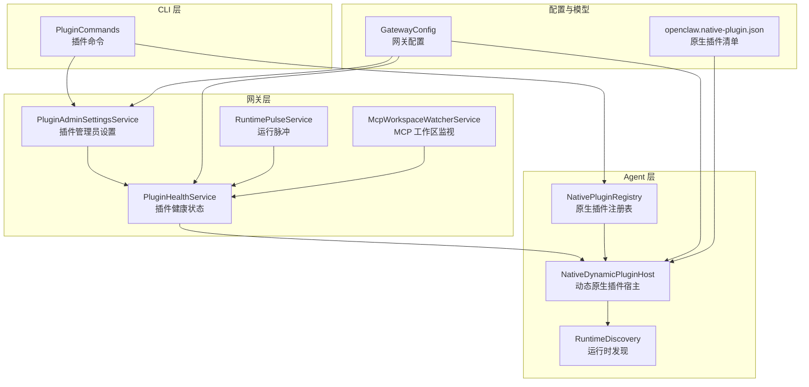
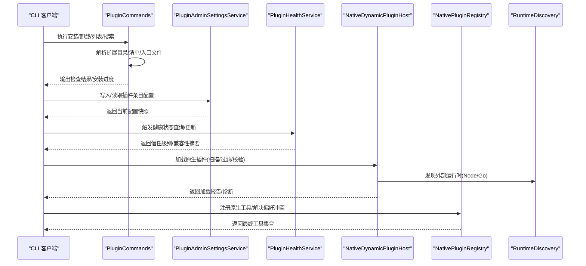
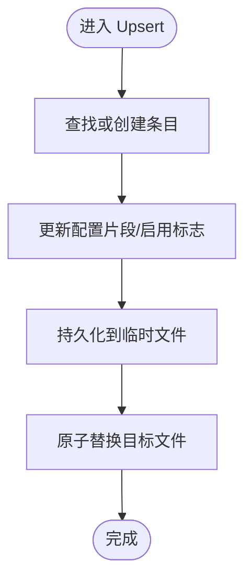
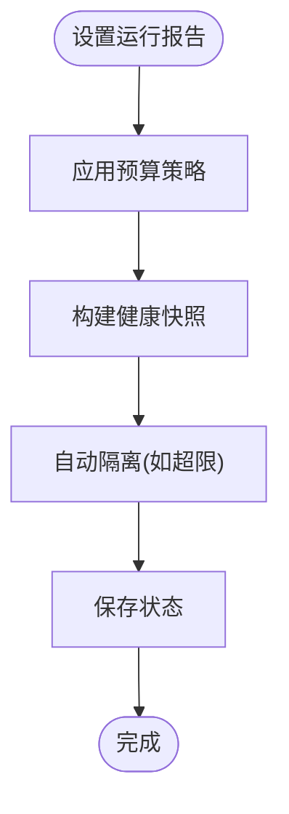
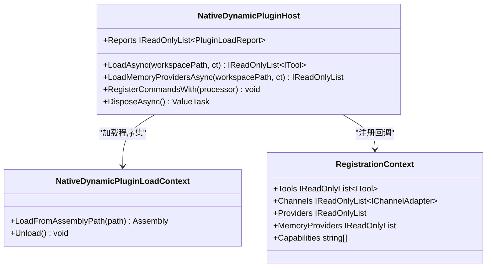
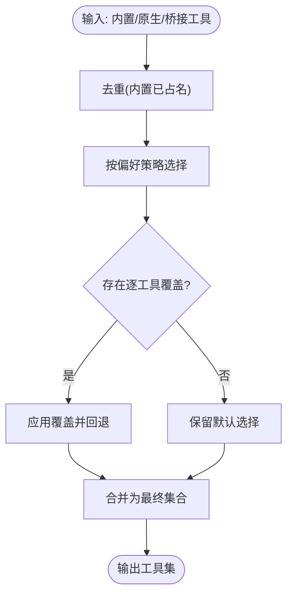
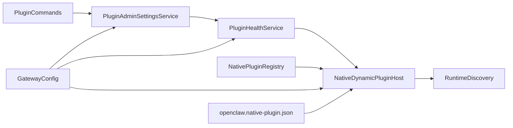

# 插件管理

<cite>
**本文引用的文件**
- [PluginAdminSettingsService.cs](file://src/OpenClaw.Gateway/PluginAdminSettingsService.cs)
- [PluginHealthService.cs](file://src/OpenClaw.Gateway/PluginHealthService.cs)
- [NativeDynamicPluginHost.cs](file://src/OpenClaw.Agent/Plugins/NativeDynamicPluginHost.cs)
- [RuntimeDiscovery.cs](file://src/OpenClaw.Agent/Plugins/RuntimeDiscovery.cs)
- [NativePluginRegistry.cs](file://src/OpenClaw.Agent/Plugins/NativePluginRegistry.cs)
- [PluginCommands.cs](file://src/OpenClaw.Cli/PluginCommands.cs)
- [GatewayConfig.cs](file://src/OpenClaw.Core/Models/GatewayConfig.cs)
- [openclaw.native-plugin.json](file://src/OpenClaw.Plugins.EmploymentCoachWorkflow/openclaw.native-plugin.json)
- [CoreServicesExtensions.cs](file://src/OpenClaw.Gateway/Composition/CoreServicesExtensions.cs)
- [RuntimePulseService.cs](file://src/OpenClaw.Gateway/RuntimePulseService.cs)
- [McpWorkspaceWatcherService.cs](file://src/OpenClaw.Gateway/McpWorkspaceWatcherService.cs)
- [PluginBridgeIntegrationTests.cs](file://src/OpenClaw.Tests/PluginBridgeIntegrationTests.cs)
- [SocketBridgeTransportTests.cs](file://src/OpenClaw.Tests/SocketBridgeTransportTests.cs)
- [PluginCommandsTests.cs](file://src/OpenClaw.Tests/PluginCommandsTests.cs)
</cite>

## 目录
1. [简介](#简介)
2. [项目结构](#项目结构)
3. [核心组件](#核心组件)
4. [架构总览](#架构总览)
5. [详细组件分析](#详细组件分析)
6. [依赖关系分析](#依赖关系分析)
7. [性能考量](#性能考量)
8. [故障排除指南](#故障排除指南)
9. [结论](#结论)
10. [附录](#附录)

## 简介
本技术文档围绕插件管理系统，系统性阐述插件的注册、发现、加载与卸载机制，覆盖配置管理、版本控制、依赖解析、启用/禁用与热重载、故障恢复策略，以及与网关服务的集成、生命周期协调、API 接口、配置项与监控指标。目标是帮助开发者与运维人员在不深入源码的前提下，也能高效理解并正确使用插件体系。

## 项目结构
插件管理涉及多个子系统协同工作：
- CLI 插件命令：负责安装、卸载、列出、搜索插件，以及安装时的兼容性检查与信任评估。
- 网关侧服务：负责插件配置持久化、运行态健康状态记录、预算策略触发自动隔离、与运行时遥测对接。
- Agent 侧插件宿主：负责动态原生插件（.NET）的发现、过滤、加载、能力声明与资源释放。
- 运行时工具：负责桥接型插件（Node/Go 等）的进程/传输层管理与重启策略。
- 配置模型：集中定义插件相关配置结构，贯穿 CLI、网关与 Agent 各层。

图表来源
- [PluginCommands.cs:18-792](file://src/OpenClaw.Cli/PluginCommands.cs#L18-L792)
- [PluginAdminSettingsService.cs:17-138](file://src/OpenClaw.Gateway/PluginAdminSettingsService.cs#L17-L138)
- [PluginHealthService.cs:23-449](file://src/OpenClaw.Gateway/PluginHealthService.cs#L23-L449)
- [NativeDynamicPluginHost.cs:39-908](file://src/OpenClaw.Agent/Plugins/NativeDynamicPluginHost.cs#L39-L908)
- [NativePluginRegistry.cs:13-265](file://src/OpenClaw.Agent/Plugins/NativePluginRegistry.cs#L13-L265)
- [RuntimeDiscovery.cs:8-115](file://src/OpenClaw.Agent/Plugins/RuntimeDiscovery.cs#L8-L115)
- [GatewayConfig.cs:9-80](file://src/OpenClaw.Core/Models/GatewayConfig.cs#L9-L80)
- [openclaw.native-plugin.json:1-11](file://src/OpenClaw.Plugins.EmploymentCoachWorkflow/openclaw.native-plugin.json#L1-L11)
- [RuntimePulseService.cs:775-811](file://src/OpenClaw.Gateway/RuntimePulseService.cs#L775-L811)
- [McpWorkspaceWatcherService.cs:66-104](file://src/OpenClaw.Gateway/McpWorkspaceWatcherService.cs#L66-L104)

章节来源
- [PluginCommands.cs:18-792](file://src/OpenClaw.Cli/PluginCommands.cs#L18-L792)
- [PluginAdminSettingsService.cs:17-138](file://src/OpenClaw.Gateway/PluginAdminSettingsService.cs#L17-L138)
- [PluginHealthService.cs:23-449](file://src/OpenClaw.Gateway/PluginHealthService.cs#L23-L449)
- [NativeDynamicPluginHost.cs:39-908](file://src/OpenClaw.Agent/Plugins/NativeDynamicPluginHost.cs#L39-L908)
- [NativePluginRegistry.cs:13-265](file://src/OpenClaw.Agent/Plugins/NativePluginRegistry.cs#L13-L265)
- [RuntimeDiscovery.cs:8-115](file://src/OpenClaw.Agent/Plugins/RuntimeDiscovery.cs#L8-L115)
- [GatewayConfig.cs:9-80](file://src/OpenClaw.Core/Models/GatewayConfig.cs#L9-L80)
- [openclaw.native-plugin.json:1-11](file://src/OpenClaw.Plugins.EmploymentCoachWorkflow/openclaw.native-plugin.json#L1-L11)
- [RuntimePulseService.cs:775-811](file://src/OpenClaw.Gateway/RuntimePulseService.cs#L775-L811)
- [McpWorkspaceWatcherService.cs:66-104](file://src/OpenClaw.Gateway/McpWorkspaceWatcherService.cs#L66-L104)

## 核心组件
- 插件管理员设置服务：负责插件条目的持久化与读取，支持按插件 ID 查询、更新启用状态与配置片段。
- 插件健康服务：负责记录与查询插件的运行态状态、信任级别、兼容性诊断、重启次数与内存快照等；支持基于预算策略的自动隔离。
- 动态原生插件宿主：负责扫描、发现、过滤、加载原生（.NET）插件，校验清单与 API 版本，收集能力声明与诊断信息，管理生命周期与资源回收。
- 原生插件注册表：构建内置/原生工具集合，处理重复工具名冲突，支持偏好策略选择（原生 vs 桥接）。
- 运行时发现：辅助定位 Node.js、Go 等外部运行时可执行文件路径。
- CLI 插件命令：提供安装/卸载/列表/搜索功能，执行安装前的兼容性检查与信任评估。
- 网关配置：集中定义插件相关配置结构，包括允许/拒绝列表、条目配置、槽位策略、偏好与预算等。
- 原生插件清单：描述 .NET 插件的入口程序集、类型、能力与技能目录等元数据。

章节来源
- [PluginAdminSettingsService.cs:17-138](file://src/OpenClaw.Gateway/PluginAdminSettingsService.cs#L17-L138)
- [PluginHealthService.cs:23-449](file://src/OpenClaw.Gateway/PluginHealthService.cs#L23-L449)
- [NativeDynamicPluginHost.cs:39-908](file://src/OpenClaw.Agent/Plugins/NativeDynamicPluginHost.cs#L39-L908)
- [NativePluginRegistry.cs:13-265](file://src/OpenClaw.Agent/Plugins/NativePluginRegistry.cs#L13-L265)
- [RuntimeDiscovery.cs:8-115](file://src/OpenClaw.Agent/Plugins/RuntimeDiscovery.cs#L8-L115)
- [PluginCommands.cs:18-792](file://src/OpenClaw.Cli/PluginCommands.cs#L18-L792)
- [GatewayConfig.cs:9-80](file://src/OpenClaw.Core/Models/GatewayConfig.cs#L9-L80)
- [openclaw.native-plugin.json:1-11](file://src/OpenClaw.Plugins.EmploymentCoachWorkflow/openclaw.native-plugin.json#L1-L11)

## 架构总览
下图展示从 CLI 到网关再到 Agent 的完整插件生命周期流：

图表来源
- [PluginCommands.cs:18-792](file://src/OpenClaw.Cli/PluginCommands.cs#L18-L792)
- [PluginAdminSettingsService.cs:70-129](file://src/OpenClaw.Gateway/PluginAdminSettingsService.cs#L70-L129)
- [PluginHealthService.cs:58-158](file://src/OpenClaw.Gateway/PluginHealthService.cs#L58-L158)
- [NativeDynamicPluginHost.cs:64-169](file://src/OpenClaw.Agent/Plugins/NativeDynamicPluginHost.cs#L64-L169)
- [NativePluginRegistry.cs:137-233](file://src/OpenClaw.Agent/Plugins/NativePluginRegistry.cs#L137-L233)
- [RuntimeDiscovery.cs:14-84](file://src/OpenClaw.Agent/Plugins/RuntimeDiscovery.cs#L14-L84)

## 详细组件分析

### 插件管理员设置服务（持久化与快照）
- 职责
  - 将插件启用状态与配置片段持久化到存储路径下的 JSON 文件中。
  - 提供按插件 ID 查询、更新、快照导出等能力。
  - 使用互斥锁保证并发安全。
- 关键点
  - 存储路径由网关配置中的存储根路径决定，确保绝对路径一致性。
  - 更新采用先写临时文件再原子替换的方式，降低损坏风险。
  - 克隆返回避免外部修改影响内部状态。
- 并发与错误
  - 内部使用锁保护；持久化失败会记录警告并抛出异常。

图表来源
- [PluginAdminSettingsService.cs:92-129](file://src/OpenClaw.Gateway/PluginAdminSettingsService.cs#L92-L129)

章节来源
- [PluginAdminSettingsService.cs:17-138](file://src/OpenClaw.Gateway/PluginAdminSettingsService.cs#L17-L138)

### 插件健康服务（运行态监控与自动隔离）
- 职责
  - 维护插件操作态（禁用/隔离/审核）与状态缓存。
  - 汇总加载报告、诊断、重启次数、内存快照等，生成健康快照。
  - 基于预算策略对桥接型插件进行自动隔离。
- 关键点
  - 支持两类运行时遥测源（桥接与原生动态），用于获取重启计数与内存快照。
  - 自动隔离规则：重启次数超限、工作集超限、兼容性错误超限。
  - 信任级别与兼容性状态综合诊断结果计算得出。
- 可观测性
  - 记录健康快照与诊断日志，便于审计与排障。

图表来源
- [PluginHealthService.cs:44-291](file://src/OpenClaw.Gateway/PluginHealthService.cs#L44-L291)

章节来源
- [PluginHealthService.cs:23-449](file://src/OpenClaw.Gateway/PluginHealthService.cs#L23-L449)

### 动态原生插件宿主（.NET 插件加载）
- 职责
  - 扫描原生插件清单，过滤允许/拒绝与条目启用状态。
  - 在 JIT 模式下加载插件，校验最小宿主版本与插件 API 版本。
  - 收集工具、通道适配器、钩子、命令、提供商、内存提供者与技能目录等能力声明。
  - 处理加载失败的清理与回滚。
- 关键点
  - AOT 模式下禁止动态原生插件，直接生成阻断报告。
  - 支持黑名单（操作态）拦截插件加载。
  - 报告中包含诊断、能力声明与技能目录解析结果。
- 生命周期
  - 提供注册与注销、命令注册、重启计数与内存快照查询接口。

图表来源
- [NativeDynamicPluginHost.cs:39-908](file://src/OpenClaw.Agent/Plugins/NativeDynamicPluginHost.cs#L39-L908)

章节来源
- [NativeDynamicPluginHost.cs:64-908](file://src/OpenClaw.Agent/Plugins/NativeDynamicPluginHost.cs#L64-L908)

### 原生插件注册表（工具偏好与冲突处理）
- 职责
  - 构建内置/原生工具集合，处理重复名称冲突并记录警告。
  - 根据配置偏好（prefer=native/bridge）与逐工具覆盖（overrides）选择最终工具集。
- 关键点
  - 偏好策略与覆盖优先级明确，输出去重后的工具集合。
  - 记录每个工具对应的插件 ID，便于追踪来源。

图表来源
- [NativePluginRegistry.cs:137-233](file://src/OpenClaw.Agent/Plugins/NativePluginRegistry.cs#L137-L233)

章节来源
- [NativePluginRegistry.cs:13-265](file://src/OpenClaw.Agent/Plugins/NativePluginRegistry.cs#L13-L265)

### 运行时发现（Node/Go 等）
- 职责
  - 在不同平台下通过 PATH 或常见安装路径定位 Node.js 可执行文件。
  - 通用可执行文件查找工具。
- 关键点
  - 跨平台支持（Windows/Linux/macOS）。
  - 支持通配符路径展开以匹配版本化安装目录。

章节来源
- [RuntimeDiscovery.cs:8-115](file://src/OpenClaw.Agent/Plugins/RuntimeDiscovery.cs#L8-L115)

### CLI 插件命令（安装/卸载/列表/搜索）
- 职责
  - 安装：支持从 npm/ClawHub 或本地路径安装，下载 tarball、解压、校验清单与入口文件、打印信任与兼容性摘要、可选 dry-run。
  - 卸载：删除扩展目录中的插件包并提示重启网关。
  - 列表：扫描扩展目录，解析清单，输出插件信息与信任级别。
  - 搜索：调用 npm search 获取匹配包列表。
- 关键点
  - 安装前的兼容性检查与信任评估，包含技能目录合法性、配置模式校验等。
  - 支持全局与工作区扩展目录，环境变量 OPENCLAW_WORKSPACE 控制工作区路径。

章节来源
- [PluginCommands.cs:18-792](file://src/OpenClaw.Cli/PluginCommands.cs#L18-L792)

### 网关配置（插件相关）
- 职责
  - 定义插件相关配置结构，包括允许/拒绝列表、条目配置、槽位策略、偏好与预算等。
  - 作为 CLI、网关与 Agent 间共享的配置契约。
- 关键点
  - 条目配置支持启用开关与任意 JSON 配置片段。
  - 槽位策略用于同一类能力（如 memory）的唯一性约束。
  - 预算策略用于桥接型插件的自动隔离。

章节来源
- [GatewayConfig.cs:9-80](file://src/OpenClaw.Core/Models/GatewayConfig.cs#L9-L80)

### 原生插件清单（.NET 插件）
- 职责
  - 描述 .NET 插件的入口程序集、类型、能力与技能目录等元数据。
- 关键点
  - 必填字段：id、assemblyPath、typeName。
  - 可选字段：capabilities、skills、jitOnly 等。

章节来源
- [openclaw.native-plugin.json:1-11](file://src/OpenClaw.Plugins.EmploymentCoachWorkflow/openclaw.native-plugin.json#L1-L11)

### 网关集成与生命周期协调
- 职责
  - 在网关启动阶段注入动态原生插件宿主，处理启动失败时的资源清理。
  - 通过健康服务与运行脉冲服务实现运行态可观测性。
  - 通过 MCP 工作区监视服务触发热重载。
- 关键点
  - 启动失败时主动释放动态宿主，避免资源泄漏。
  - 健康服务根据预算策略自动隔离问题插件。
  - MCP 工作区监视器在配置变更时触发重载循环。

章节来源
- [CoreServicesExtensions.cs:363-400](file://src/OpenClaw.Gateway/Composition/CoreServicesExtensions.cs#L363-L400)
- [RuntimePulseService.cs:775-811](file://src/OpenClaw.Gateway/RuntimePulseService.cs#L775-L811)
- [McpWorkspaceWatcherService.cs:66-104](file://src/OpenClaw.Gateway/McpWorkspaceWatcherService.cs#L66-L104)

## 依赖关系分析
- 组件耦合
  - CLI 与网关：CLI 通过扩展目录影响网关发现与加载；网关通过健康服务与管理员设置服务影响运行态。
  - 网关与 Agent：网关配置与健康服务驱动 Agent 的动态原生插件宿主加载与资源管理。
  - Agent 内部：原生插件注册表与动态原生插件宿主协作，RuntimeDiscovery 为桥接型插件提供运行时定位。
- 外部依赖
  - npm/tar 等外部工具用于安装与解压。
  - Node.js/Go 等外部运行时用于桥接型插件。
- 循环依赖
  - 未见直接循环依赖；各层职责清晰，通过配置与报告进行解耦。

图表来源
- [PluginCommands.cs:18-792](file://src/OpenClaw.Cli/PluginCommands.cs#L18-L792)
- [PluginAdminSettingsService.cs:17-138](file://src/OpenClaw.Gateway/PluginAdminSettingsService.cs#L17-L138)
- [PluginHealthService.cs:23-449](file://src/OpenClaw.Gateway/PluginHealthService.cs#L23-L449)
- [NativeDynamicPluginHost.cs:39-908](file://src/OpenClaw.Agent/Plugins/NativeDynamicPluginHost.cs#L39-L908)
- [NativePluginRegistry.cs:13-265](file://src/OpenClaw.Agent/Plugins/NativePluginRegistry.cs#L13-L265)
- [RuntimeDiscovery.cs:8-115](file://src/OpenClaw.Agent/Plugins/RuntimeDiscovery.cs#L8-L115)
- [GatewayConfig.cs:9-80](file://src/OpenClaw.Core/Models/GatewayConfig.cs#L9-L80)
- [openclaw.native-plugin.json:1-11](file://src/OpenClaw.Plugins.EmploymentCoachWorkflow/openclaw.native-plugin.json#L1-L11)

## 性能考量
- 加载性能
  - 动态原生插件在 JIT 模式下加载，AOT 模式下直接阻断，避免不必要的开销。
  - 插件清单解析与能力声明收集在加载阶段一次性完成，后续复用报告与快照。
- 资源管理
  - 加载失败时进行清理，避免残留程序集上下文与已启动的服务实例。
  - 通过预算策略限制重启次数与内存占用，防止资源耗尽。
- I/O 与并发
  - 管理员设置服务与健康状态服务均使用互斥锁保护，避免竞态。
  - CLI 安装过程采用临时文件写入后原子替换，减少文件损坏风险。

## 故障排除指南
- 安装失败
  - 检查安装前的兼容性检查与信任评估结果，关注技能目录合法性与配置模式校验。
  - 若为 npm 安装，确认网络可达与 npm 可执行文件可用。
- 加载失败
  - 查看动态原生插件加载报告与诊断，关注最小宿主版本与插件 API 版本是否匹配。
  - 检查程序集路径是否位于插件根目录内，避免越界访问。
- 运行时异常
  - 通过健康服务查看重启次数与内存快照，结合预算策略判断是否被自动隔离。
  - 检查桥接型插件传输层（stdio/socket/hybrid）认证与连接状态。
- 热重载无效
  - 确认 MCP 工作区监视器已启动并触发重载循环。
  - 检查工作区文件是否存在且符合预期格式。

章节来源
- [PluginCommands.cs:511-792](file://src/OpenClaw.Cli/PluginCommands.cs#L511-L792)
- [NativeDynamicPluginHost.cs:210-370](file://src/OpenClaw.Agent/Plugins/NativeDynamicPluginHost.cs#L210-L370)
- [PluginHealthService.cs:293-318](file://src/OpenClaw.Gateway/PluginHealthService.cs#L293-L318)
- [SocketBridgeTransportTests.cs:14-50](file://src/OpenClaw.Tests/SocketBridgeTransportTests.cs#L14-L50)
- [McpWorkspaceWatcherService.cs:66-104](file://src/OpenClaw.Gateway/McpWorkspaceWatcherService.cs#L66-L104)

## 结论
该插件管理体系通过 CLI、网关与 Agent 的分层协作，实现了从安装、发现、加载到运行态监控与自动隔离的全生命周期闭环。其设计强调安全性（AOT/JIT 边界、黑名单与预算策略）、可观测性（诊断与健康快照）与可维护性（配置契约与原子持久化）。遵循本文最佳实践与故障排除建议，可在生产环境中稳定地扩展与演进插件生态。

## 附录

### API 接口与配置选项
- CLI 插件命令
  - 安装：支持 npm 包与本地路径安装，支持 dry-run。
  - 卸载：删除扩展目录中的插件包。
  - 列表：扫描扩展目录并输出插件信息与信任级别。
  - 搜索：调用 npm search 获取匹配包列表。
- 管理员设置服务
  - 获取快照、按 ID 查询、插入/更新条目（启用状态与配置片段）。
- 健康服务
  - 设置/查询禁用、隔离、审核状态；列出健康快照；设置运行报告与遥测源。
- 动态原生插件宿主
  - 加载插件、加载内存提供者、注册命令、报告与诊断、生命周期管理。
- 原生插件注册表
  - 注册工具、解决偏好与覆盖、处理重复名称冲突。

章节来源
- [PluginCommands.cs:18-792](file://src/OpenClaw.Cli/PluginCommands.cs#L18-L792)
- [PluginAdminSettingsService.cs:70-129](file://src/OpenClaw.Gateway/PluginAdminSettingsService.cs#L70-L129)
- [PluginHealthService.cs:160-189](file://src/OpenClaw.Gateway/PluginHealthService.cs#L160-L189)
- [NativeDynamicPluginHost.cs:64-169](file://src/OpenClaw.Agent/Plugins/NativeDynamicPluginHost.cs#L64-L169)
- [NativePluginRegistry.cs:137-233](file://src/OpenClaw.Agent/Plugins/NativePluginRegistry.cs#L137-L233)

### 监控指标
- 运行时指标
  - 插件桥接认证失败次数、重启尝试与失败次数、活动会话数、熔断器状态等。
- 健康服务指标
  - 重启次数、内存快照（工作集/私有内存）、兼容性诊断统计。
- 建议
  - 结合运行脉冲服务与健康快照定期巡检，建立阈值告警与自动隔离联动。

章节来源
- [RuntimePulseService.cs:775-811](file://src/OpenClaw.Gateway/RuntimePulseService.cs#L775-L811)
- [PluginHealthService.cs:320-336](file://src/OpenClaw.Gateway/PluginHealthService.cs#L320-L336)
- [ObservabilityTests.cs:105-204](file://src/OpenClaw.Tests/ObservabilityTests.cs#L105-L204)