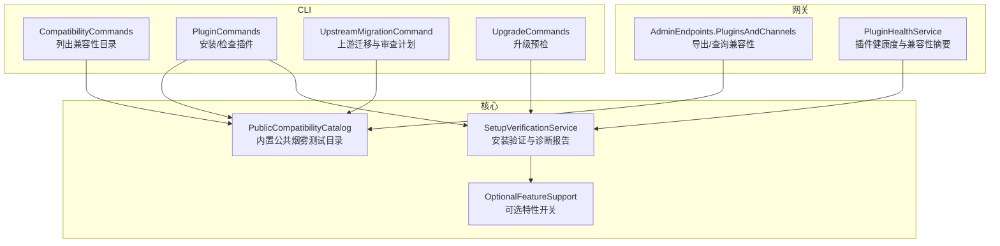
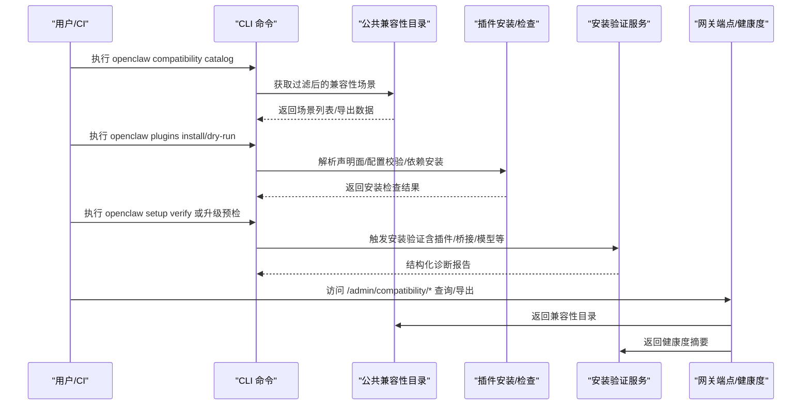
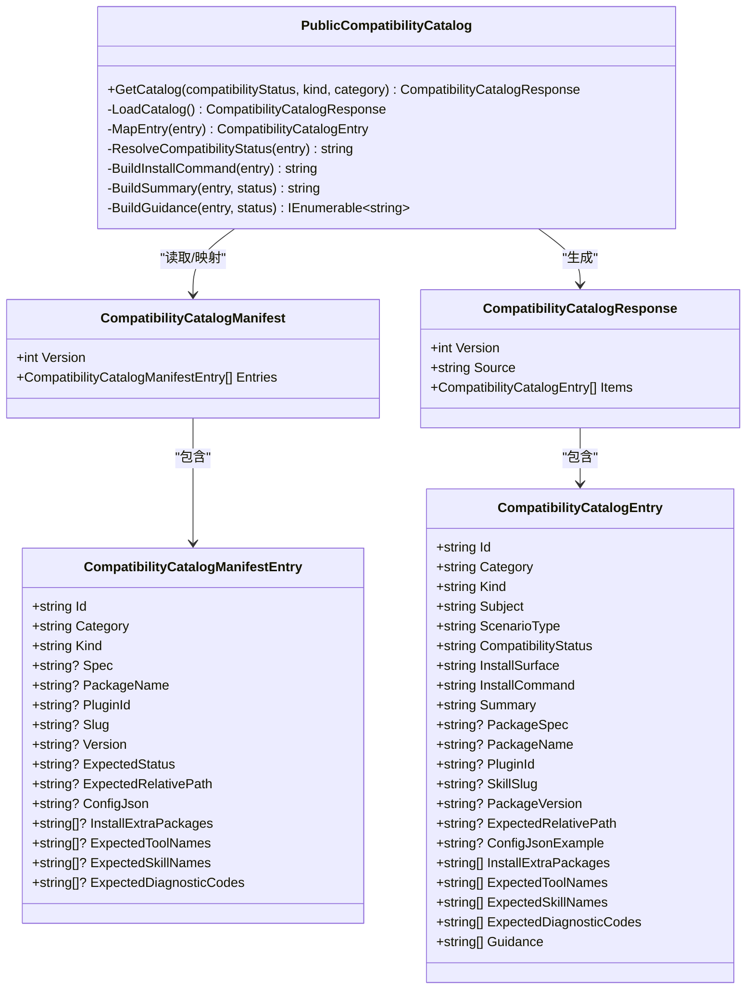
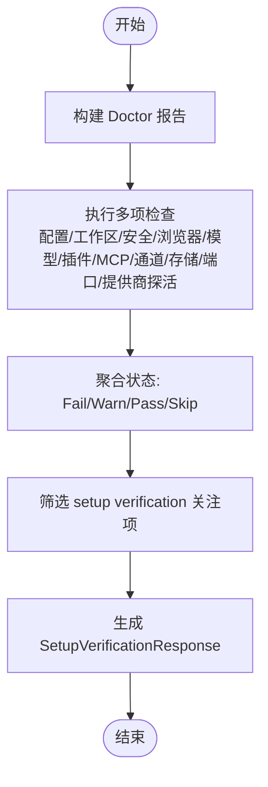
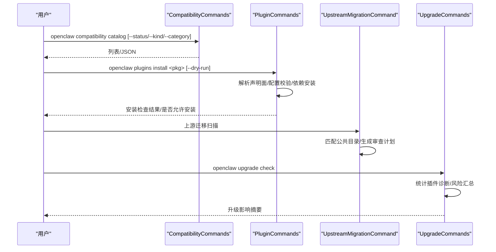
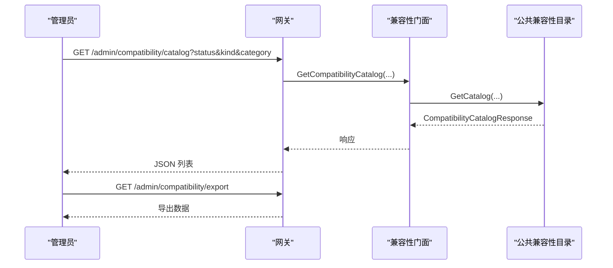
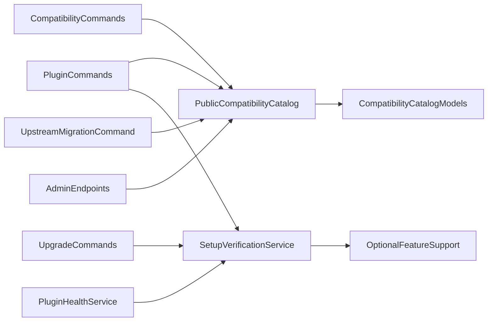

# 版本兼容性

<cite>
**本文引用的文件**
- [PublicCompatibilityCatalog.cs](file://src/OpenClaw.Core/Compatibility/PublicCompatibilityCatalog.cs)
- [SetupVerificationService.cs](file://src/OpenClaw.Core/Validation/SetupVerificationService.cs)
- [CompatibilityCatalogModels.cs](file://src/OpenClaw.Core/Models/CompatibilityCatalogModels.cs)
- [COMPATIBILITY.md](file://docs/COMPATIBILITY.md)
- [CompatibilityCommands.cs](file://src/OpenClaw.Cli/CompatibilityCommands.cs)
- [PluginCommands.cs](file://src/OpenClaw.Cli/PluginCommands.cs)
- [UpstreamMigrationCommand.cs](file://src/OpenClaw.Cli/UpstreamMigrationCommand.cs)
- [AdminEndpoints.PluginsAndChannels.cs](file://src/OpenClaw.Gateway/Endpoints/AdminEndpoints.PluginsAndChannels.cs)
- [PluginHealthService.cs](file://src/OpenClaw.Gateway/PluginHealthService.cs)
- [OptionalFeatureSupport.cs](file://src/OpenClaw.Gateway/Bootstrap/OptionalFeatureSupport.cs)
- [CompatibilityCatalogTests.cs](file://src/OpenClaw.Tests/CompatibilityCatalogTests.cs)
- [PluginBridgeIntegrationTests.cs](file://src/OpenClaw.Tests/PluginBridgeIntegrationTests.cs)
- [UpgradeCommands.cs](file://src/OpenClaw.Cli/UpgradeCommands.cs)
</cite>

## 目录
1. [简介](#简介)
2. [项目结构](#项目结构)
3. [核心组件](#核心组件)
4. [架构总览](#架构总览)
5. [详细组件分析](#详细组件分析)
6. [依赖关系分析](#依赖关系分析)
7. [性能考量](#性能考量)
8. [故障排查指南](#故障排查指南)
9. [结论](#结论)
10. [附录](#附录)

## 简介
本文件面向插件版本兼容性，系统化阐述 OpenClaw.NET 的兼容性策略、向后兼容性保障、API 变更处理机制，以及公共兼容性目录（PublicCompatibilityCatalog）的作用、可选特性支持（OptionalFeatureSupport）与安装验证服务（SetupVerificationService）的验证机制。文档还覆盖插件版本与 .NET 运行时模式、桥接能力矩阵、第三方依赖（如 Node.js、jiti）的兼容性要求，并提供兼容性检查流程、版本冲突解决与升级迁移策略、最佳实践、测试方法与问题诊断指南。

## 项目结构
围绕“插件版本兼容性”的关键模块分布如下：
- 核心兼容性模型与目录：CompatibilityCatalogModels、PublicCompatibilityCatalog
- 安装与验证：CompatibilityCommands、PluginCommands、SetupVerificationService
- 网关端点与健康度：AdminEndpoints.PluginsAndChannels、PluginHealthService
- 可选特性开关：OptionalFeatureSupport
- 升级与上游迁移：UpgradeCommands、UpstreamMigrationCommand
- 文档与测试：COMPATIBILITY.md、CompatibilityCatalogTests、PluginBridgeIntegrationTests

**图表来源**
- [CompatibilityCommands.cs:1-107](file://src/OpenClaw.Cli/CompatibilityCommands.cs#L1-L107)
- [PluginCommands.cs:1-200](file://src/OpenClaw.Cli/PluginCommands.cs#L1-L200)
- [UpstreamMigrationCommand.cs:327-491](file://src/OpenClaw.Cli/UpstreamMigrationCommand.cs#L327-L491)
- [UpgradeCommands.cs:188-362](file://src/OpenClaw.Cli/UpgradeCommands.cs#L188-L362)
- [PublicCompatibilityCatalog.cs:1-222](file://src/OpenClaw.Core/Compatibility/PublicCompatibilityCatalog.cs#L1-L222)
- [SetupVerificationService.cs:1-800](file://src/OpenClaw.Core/Validation/SetupVerificationService.cs#L1-L800)
- [AdminEndpoints.PluginsAndChannels.cs:118-148](file://src/OpenClaw.Gateway/Endpoints/AdminEndpoints.PluginsAndChannels.cs#L118-L148)
- [PluginHealthService.cs:408-436](file://src/OpenClaw.Gateway/PluginHealthService.cs#L408-L436)
- [OptionalFeatureSupport.cs:1-17](file://src/OpenClaw.Gateway/Bootstrap/OptionalFeatureSupport.cs#L1-L17)

**章节来源**
- [PublicCompatibilityCatalog.cs:1-222](file://src/OpenClaw.Core/Compatibility/PublicCompatibilityCatalog.cs#L1-L222)
- [SetupVerificationService.cs:1-800](file://src/OpenClaw.Core/Validation/SetupVerificationService.cs#L1-L800)
- [CompatibilityCommands.cs:1-107](file://src/OpenClaw.Cli/CompatibilityCommands.cs#L1-L107)
- [PluginCommands.cs:1-200](file://src/OpenClaw.Cli/PluginCommands.cs#L1-L200)
- [UpstreamMigrationCommand.cs:327-491](file://src/OpenClaw.Cli/UpstreamMigrationCommand.cs#L327-L491)
- [AdminEndpoints.PluginsAndChannels.cs:118-148](file://src/OpenClaw.Gateway/Endpoints/AdminEndpoints.PluginsAndChannels.cs#L118-L148)
- [PluginHealthService.cs:408-436](file://src/OpenClaw.Gateway/PluginHealthService.cs#L408-L436)
- [OptionalFeatureSupport.cs:1-17](file://src/OpenClaw.Gateway/Bootstrap/OptionalFeatureSupport.cs#L1-L17)
- [COMPATIBILITY.md:1-131](file://docs/COMPATIBILITY.md#L1-L131)

## 核心组件
- 公共兼容性目录（PublicCompatibilityCatalog）
  - 内嵌“公共烟雾测试”清单，提供固定版本的插件/技能场景，用于回归与演示兼容性。
  - 支持按状态、类型、分类过滤，生成统一响应模型，包含安装命令、预期工具/技能、诊断码与指导建议。
- 安装验证服务（SetupVerificationService）
  - 覆盖配置、工作区、安全基线、浏览器能力、操作员就绪、模型医生、插件运行时与依赖、MCP/通道/存储等多维检查。
  - 输出结构化报告，支持渲染文本版诊断结果。
- CLI 命令
  - 兼容性目录命令：列出/筛选公共兼容性场景。
  - 插件命令：从 npm/ClawHub 安装、本地安装、检查插件声明面与配置校验。
  - 上游迁移命令：扫描本地插件，结合公共目录进行信任级别与安装建议评估。
  - 升级命令：升级前预检插件兼容性与风险提示。
- 网关端点与健康度
  - 管理端点暴露兼容性目录与导出接口。
  - 插件健康服务汇总插件声明面与兼容性诊断，输出可信度等级。
- 可选特性支持（OptionalFeatureSupport）
  - 提供编译期可选特性开关（如 OpenSandbox），影响运行时能力与兼容性边界。

**章节来源**
- [PublicCompatibilityCatalog.cs:1-222](file://src/OpenClaw.Core/Compatibility/PublicCompatibilityCatalog.cs#L1-L222)
- [CompatibilityCatalogModels.cs:1-34](file://src/OpenClaw.Core/Models/CompatibilityCatalogModels.cs#L1-L34)
- [SetupVerificationService.cs:1-800](file://src/OpenClaw.Core/Validation/SetupVerificationService.cs#L1-L800)
- [CompatibilityCommands.cs:1-107](file://src/OpenClaw.Cli/CompatibilityCommands.cs#L1-L107)
- [PluginCommands.cs:1-200](file://src/OpenClaw.Cli/PluginCommands.cs#L1-L200)
- [UpstreamMigrationCommand.cs:327-491](file://src/OpenClaw.Cli/UpstreamMigrationCommand.cs#L327-L491)
- [UpgradeCommands.cs:188-362](file://src/OpenClaw.Cli/UpgradeCommands.cs#L188-L362)
- [AdminEndpoints.PluginsAndChannels.cs:118-148](file://src/OpenClaw.Gateway/Endpoints/AdminEndpoints.PluginsAndChannels.cs#L118-L148)
- [PluginHealthService.cs:408-436](file://src/OpenClaw.Gateway/PluginHealthService.cs#L408-L436)
- [OptionalFeatureSupport.cs:1-17](file://src/OpenClaw.Gateway/Bootstrap/OptionalFeatureSupport.cs#L1-L17)

## 架构总览
下图展示“公共兼容性目录 + 安装验证 + CLI/网关”的整体交互，体现从“声明到安装再到验证”的闭环。

**图表来源**
- [CompatibilityCommands.cs:1-107](file://src/OpenClaw.Cli/CompatibilityCommands.cs#L1-L107)
- [PublicCompatibilityCatalog.cs:1-222](file://src/OpenClaw.Core/Compatibility/PublicCompatibilityCatalog.cs#L1-L222)
- [PluginCommands.cs:1-200](file://src/OpenClaw.Cli/PluginCommands.cs#L1-L200)
- [SetupVerificationService.cs:1-800](file://src/OpenClaw.Core/Validation/SetupVerificationService.cs#L1-L800)
- [AdminEndpoints.PluginsAndChannels.cs:118-148](file://src/OpenClaw.Gateway/Endpoints/AdminEndpoints.PluginsAndChannels.cs#L118-L148)
- [PluginHealthService.cs:408-436](file://src/OpenClaw.Gateway/PluginHealthService.cs#L408-L436)

## 详细组件分析

### 公共兼容性目录（PublicCompatibilityCatalog）
- 数据来源与加载
  - 通过程序集内嵌资源加载“公共烟雾测试”清单，反序列化为清单模型，再映射为对外响应模型。
- 场景构建与映射
  - 自动推断兼容性状态、安装表面（npm/clawhub）、主题（slug/package/plugin id）、场景类型（正向/负向）。
  - 生成安装命令、摘要、指导建议与诊断码集合。
- 过滤与排序
  - 支持按兼容性状态、类型、分类过滤；按状态、主题、ID 排序。
- 错误与约束
  - 对缺失必要字段（如技能 slug、期望状态）抛出明确异常，确保目录一致性。

**图表来源**
- [PublicCompatibilityCatalog.cs:1-222](file://src/OpenClaw.Core/Compatibility/PublicCompatibilityCatalog.cs#L1-L222)
- [CompatibilityCatalogModels.cs:1-34](file://src/OpenClaw.Core/Models/CompatibilityCatalogModels.cs#L1-L34)

**章节来源**
- [PublicCompatibilityCatalog.cs:1-222](file://src/OpenClaw.Core/Compatibility/PublicCompatibilityCatalog.cs#L1-L222)
- [CompatibilityCatalogModels.cs:1-34](file://src/OpenClaw.Core/Models/CompatibilityCatalogModels.cs#L1-L34)
- [CompatibilityCatalogTests.cs:1-85](file://src/OpenClaw.Tests/CompatibilityCatalogTests.cs#L1-L85)

### 安装验证服务（SetupVerificationService）
- 验证范围
  - 运行时模式、配置静态校验、有效配置源、提示缓存兼容性、模型配置一致性、工作区就绪、文件系统根策略、安全基线、浏览器能力、操作员就绪、模型医生、插件运行时与依赖、MCP/通道/存储/端口可用性、提供商探活。
- 输出与渲染
  - 生成 Doctor 报告，支持文本渲染；仅选取“setup verification”关注的检查项生成最终响应。
- 关键检查逻辑
  - 动态原生插件需 JIT 模式；桥接插件需 Node.js 可用；公共绑定需满足安全基线；模型配置一致性与提示缓存方言匹配；工作区路径存在且绝对路径；提供商凭据与网络可达性。

**图表来源**
- [SetupVerificationService.cs:83-164](file://src/OpenClaw.Core/Validation/SetupVerificationService.cs#L83-L164)
- [SetupVerificationService.cs:166-199](file://src/OpenClaw.Core/Validation/SetupVerificationService.cs#L166-L199)

**章节来源**
- [SetupVerificationService.cs:1-800](file://src/OpenClaw.Core/Validation/SetupVerificationService.cs#L1-L800)

### CLI：兼容性目录与插件安装/检查
- 兼容性目录命令
  - 支持按状态、类型、分类筛选，输出 JSON 或人类可读格式。
- 插件安装/检查
  - 从 npm/ClawHub 下载并解包，执行“安装前检查”：解析声明面（工具/服务/通道/命令/提供者/技能）、配置 schema 校验、路径包含性校验、诊断收集与信任级别判定。
  - 支持本地路径安装与“干跑”模式，先验证再复制。
- 上游迁移
  - 扫描本地 openclaw.plugin.json，结合公共兼容性目录映射状态，生成“审查计划”（subject、packageSpec、status、guidance）。
- 升级预检
  - 统计插件诊断严重程度，汇总 MCP/自定义加载路径/额外技能目录等风险点，给出升级影响摘要与后续动作。

**图表来源**
- [CompatibilityCommands.cs:1-107](file://src/OpenClaw.Cli/CompatibilityCommands.cs#L1-L107)
- [PluginCommands.cs:1-200](file://src/OpenClaw.Cli/PluginCommands.cs#L1-L200)
- [UpstreamMigrationCommand.cs:327-491](file://src/OpenClaw.Cli/UpstreamMigrationCommand.cs#L327-L491)
- [UpgradeCommands.cs:188-362](file://src/OpenClaw.Cli/UpgradeCommands.cs#L188-L362)

**章节来源**
- [CompatibilityCommands.cs:1-107](file://src/OpenClaw.Cli/CompatibilityCommands.cs#L1-L107)
- [PluginCommands.cs:1-200](file://src/OpenClaw.Cli/PluginCommands.cs#L1-L200)
- [UpstreamMigrationCommand.cs:327-491](file://src/OpenClaw.Cli/UpstreamMigrationCommand.cs#L327-L491)
- [UpgradeCommands.cs:188-362](file://src/OpenClaw.Cli/UpgradeCommands.cs#L188-L362)

### 网关端点与插件健康度
- 管理端点
  - 提供 /admin/compatibility/catalog 与 /admin/compatibility/export，供管理员查询与导出兼容性目录。
- 插件健康度
  - 基于插件声明面与兼容性诊断，输出“上游兼容/未受信/未知”等状态，辅助运维决策。

**图表来源**
- [AdminEndpoints.PluginsAndChannels.cs:118-148](file://src/OpenClaw.Gateway/Endpoints/AdminEndpoints.PluginsAndChannels.cs#L118-L148)
- [PublicCompatibilityCatalog.cs:1-222](file://src/OpenClaw.Core/Compatibility/PublicCompatibilityCatalog.cs#L1-L222)

**章节来源**
- [AdminEndpoints.PluginsAndChannels.cs:118-148](file://src/OpenClaw.Gateway/Endpoints/AdminEndpoints.PluginsAndChannels.cs#L118-L148)
- [PluginHealthService.cs:408-436](file://src/OpenClaw.Gateway/PluginHealthService.cs#L408-L436)

### 可选特性支持（OptionalFeatureSupport）
- 提供编译期条件编译的可选特性开关（如 OpenSandbox），在运行时反映为能力边界，影响兼容性判断与部署形态。

**章节来源**
- [OptionalFeatureSupport.cs:1-17](file://src/OpenClaw.Gateway/Bootstrap/OptionalFeatureSupport.cs#L1-L17)

## 依赖关系分析
- 组件耦合
  - PublicCompatibilityCatalog 与 CompatibilityCatalogModels 强耦合，负责数据模型与映射。
  - SetupVerificationService 依赖配置、策略、模型医生、提供商探活、文件系统与网络探测等外部能力。
  - CLI 命令依赖公共目录与验证服务，形成“声明 → 安装 → 验证”的闭环。
  - 网关端点依赖公共目录与健康度服务，提供管理界面能力。
- 外部依赖
  - Node.js：桥接插件运行时依赖。
  - jiti：TypeScript 插件在 AOT/JIT 下的可选依赖。
  - .NET 运行时模式：AOT/JIT 对桥接能力有严格限制。

**图表来源**
- [PublicCompatibilityCatalog.cs:1-222](file://src/OpenClaw.Core/Compatibility/PublicCompatibilityCatalog.cs#L1-L222)
- [CompatibilityCatalogModels.cs:1-34](file://src/OpenClaw.Core/Models/CompatibilityCatalogModels.cs#L1-L34)
- [PluginCommands.cs:1-200](file://src/OpenClaw.Cli/PluginCommands.cs#L1-L200)
- [SetupVerificationService.cs:1-800](file://src/OpenClaw.Core/Validation/SetupVerificationService.cs#L1-L800)
- [CompatibilityCommands.cs:1-107](file://src/OpenClaw.Cli/CompatibilityCommands.cs#L1-L107)
- [UpstreamMigrationCommand.cs:327-491](file://src/OpenClaw.Cli/UpstreamMigrationCommand.cs#L327-L491)
- [UpgradeCommands.cs:188-362](file://src/OpenClaw.Cli/UpgradeCommands.cs#L188-L362)
- [AdminEndpoints.PluginsAndChannels.cs:118-148](file://src/OpenClaw.Gateway/Endpoints/AdminEndpoints.PluginsAndChannels.cs#L118-L148)
- [PluginHealthService.cs:408-436](file://src/OpenClaw.Gateway/PluginHealthService.cs#L408-L436)
- [OptionalFeatureSupport.cs:1-17](file://src/OpenClaw.Gateway/Bootstrap/OptionalFeatureSupport.cs#L1-L17)

**章节来源**
- [COMPATIBILITY.md:1-131](file://docs/COMPATIBILITY.md#L1-L131)

## 性能考量
- 公共兼容性目录为内嵌资源，加载成本低，过滤与映射为内存操作，开销可忽略。
- 安装验证涉及文件系统、网络探测与模型医生计算，建议在离线或受限环境使用“跳过提供商探活”选项以减少等待。
- CLI 安装流程包含 npm pack/tar 解压与依赖安装，建议在稳定网络与充足磁盘空间环境下执行。

## 故障排查指南
- 插件安装失败
  - 使用“干跑”模式先行检查声明面与配置 schema 合规性，定位错误码（如 unsupported_schema_keyword、config_* 等）。
  - 若为桥接插件，确认 Node.js 可用；若为 TypeScript 插件，确认 jiti 在依赖树中。
- 公共绑定安全基线
  - 公共绑定需设置认证令牌、启用请求者匹配审批、Canvas 仅在允许时开放、信任转发头、对 shell 工具强制沙箱。
- 模型与提示缓存
  - 不同提供商对提示缓存方言与 keep-warm 支持不同，需显式设置方言或禁用不支持的设置。
- 插件健康度
  - “上游兼容”表示声明面与兼容性检查均通过；“未受信”表示声明面存在但有阻塞错误；“未知”表示未暴露结构化能力声明。
- 升级预检
  - 若 MCP/自定义加载路径/额外技能目录被使用，升级为高风险，建议立即重新运行安装验证。

**章节来源**
- [SetupVerificationService.cs:1-800](file://src/OpenClaw.Core/Validation/SetupVerificationService.cs#L1-L800)
- [PluginCommands.cs:514-675](file://src/OpenClaw.Cli/PluginCommands.cs#L514-L675)
- [PluginBridgeIntegrationTests.cs:406-476](file://src/OpenClaw.Tests/PluginBridgeIntegrationTests.cs#L406-L476)
- [PluginHealthService.cs:408-436](file://src/OpenClaw.Gateway/PluginHealthService.cs#L408-L436)
- [UpgradeCommands.cs:188-362](file://src/OpenClaw.Cli/UpgradeCommands.cs#L188-L362)

## 结论
OpenClaw.NET 将“公共烟雾测试目录 + 安装验证 + CLI/网关能力”整合为一套完整的插件版本兼容性体系：以 AOT/JIT 运行时模式为边界，明确桥接能力矩阵，通过严格的声明面与配置 schema 校验、路径包含性约束与结构化诊断，实现“可验证、可迁移、可治理”的插件生态。OptionalFeatureSupport 与网关端点进一步增强了部署灵活性与可观测性。

## 附录

### 版本兼容性策略与最佳实践
- 明确运行时模式：AOT 优先、JIT 扩展；桥接能力以文档为准。
- 使用公共兼容性目录作为“金标准”，在安装前进行干跑检查。
- 保持插件声明面清晰、配置 schema 精简、路径包含性合规。
- 对公共绑定实施严格安全基线，避免默认宽松配置。

**章节来源**
- [COMPATIBILITY.md:1-131](file://docs/COMPATIBILITY.md#L1-L131)

### API 变更处理机制
- 不支持的桥接 API：初始化阶段即失败并返回明确诊断码（如 unsupported_cli_registration、unsupported_gateway_method）。
- 配置 schema：仅支持子集关键字，不支持的关键字直接拒绝。
- 运行时模式：JIT-only 能力在 AOT 模式下拒绝加载。

**章节来源**
- [COMPATIBILITY.md:31-103](file://docs/COMPATIBILITY.md#L31-L103)

### 兼容性检查流程
- 声明面检查：工具/服务/通道/命令/提供者/技能/配置 schema。
- 路径包含性：入口文件、技能目录、原生动态插件程序集路径必须在插件根内。
- 运行时与依赖：动态原生插件需 JIT；桥接插件需 Node.js；TypeScript 需 jiti。
- 安全与模型：公共绑定安全基线、模型配置一致性、提示缓存方言匹配。

**章节来源**
- [PluginCommands.cs:514-675](file://src/OpenClaw.Cli/PluginCommands.cs#L514-L675)
- [SetupVerificationService.cs:1-800](file://src/OpenClaw.Core/Validation/SetupVerificationService.cs#L1-L800)
- [COMPATIBILITY.md:1-131](file://docs/COMPATIBILITY.md#L1-L131)

### 版本冲突解决与升级迁移策略
- 冲突识别：基于公共兼容性目录映射与安装检查结果，确定“受信/部分/不受信”状态。
- 迁移策略：优先采用公共烟雾测试中的固定版本；对本地插件生成审查计划，按建议修复后再升级。
- 升级预检：统计插件诊断严重程度，识别 MCP/自定义加载路径/额外技能目录等风险点，给出后续动作。

**章节来源**
- [UpstreamMigrationCommand.cs:327-491](file://src/OpenClaw.Cli/UpstreamMigrationCommand.cs#L327-L491)
- [UpgradeCommands.cs:188-362](file://src/OpenClaw.Cli/UpgradeCommands.cs#L188-L362)

### 测试方法
- 公共兼容性目录：验证固定场景加载、过滤与指导建议生成。
- 插件桥接集成：覆盖 JS/TS 加载、jiti 成功/失败、注册 API、AOT/JIT 能力门控、配置 schema oneOf 等。
- 原生动态插件：覆盖 JIT 模式加载、生命周期、技能加载、AOT 拒绝等。

**章节来源**
- [CompatibilityCatalogTests.cs:1-85](file://src/OpenClaw.Tests/CompatibilityCatalogTests.cs#L1-L85)
- [PluginBridgeIntegrationTests.cs:406-476](file://src/OpenClaw.Tests/PluginBridgeIntegrationTests.cs#L406-L476)
- [COMPATIBILITY.md:105-131](file://docs/COMPATIBILITY.md#L105-L131)