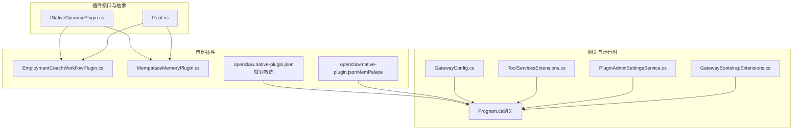
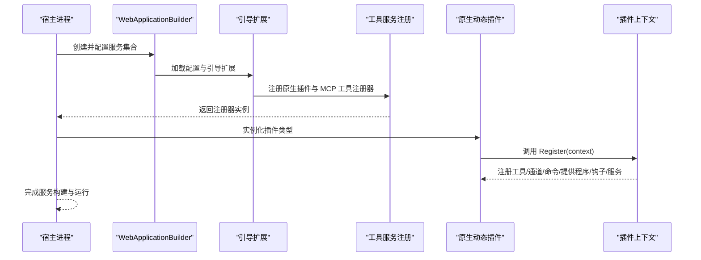
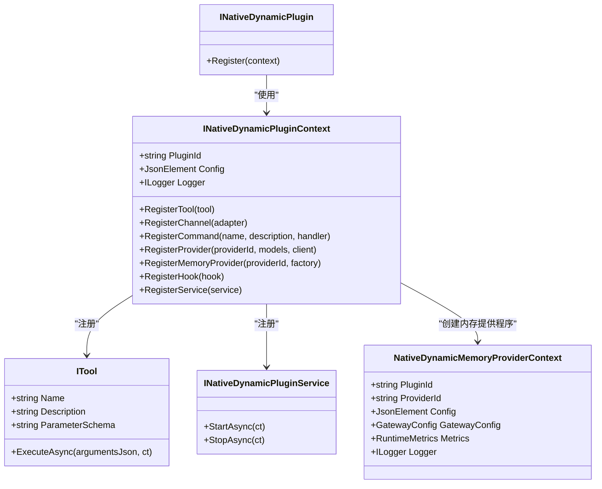
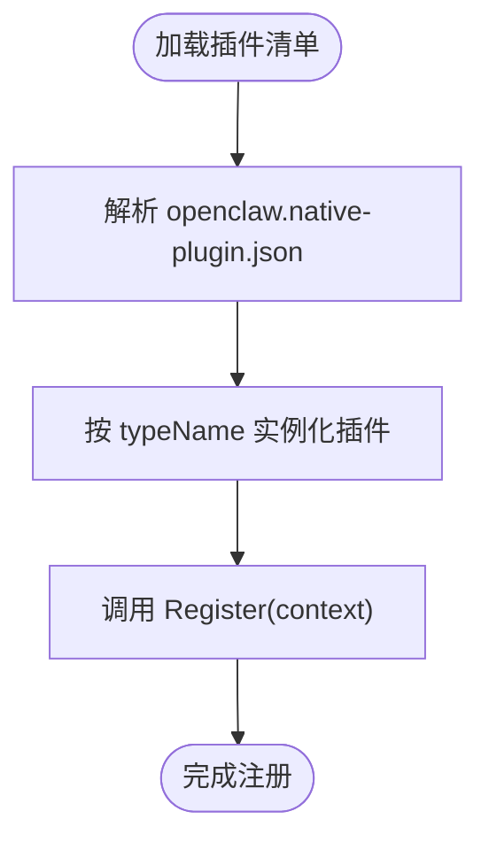
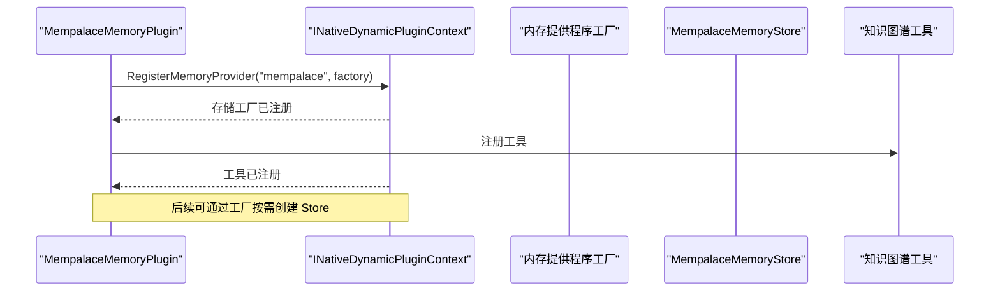
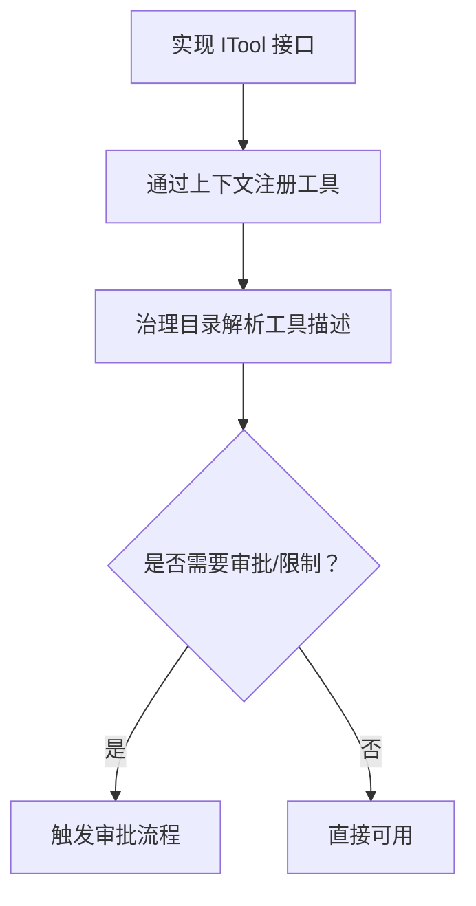
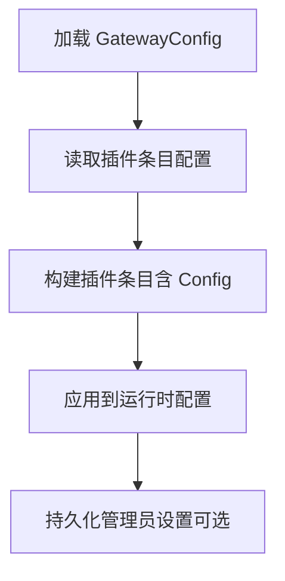
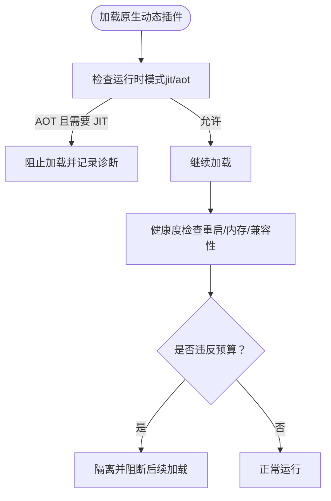
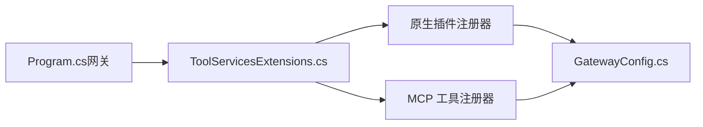

# .NET 原生插件开发

<cite>
**本文引用的文件**
- [INativeDynamicPlugin.cs](file://src/OpenClaw.PluginKit/INativeDynamicPlugin.cs)
- [EmploymentCoachWorkflowPlugin.cs](file://src/OpenClaw.Plugins.EmploymentCoachWorkflow/EmploymentCoachWorkflowPlugin.cs)
- [openclaw.native-plugin.json（就业教练工作流）](file://src/OpenClaw.Plugins.EmploymentCoachWorkflow/openclaw.native-plugin.json)
- [MempalaceMemoryPlugin.cs](file://src/OpenClaw.Plugins.Mempalace/MempalaceMemoryPlugin.cs)
- [openclaw.native-plugin.json（MemPalace 内存提供程序）](file://src/OpenClaw.Plugins.Mempalace/openclaw.native-plugin.json)
- [ITool.cs](file://src/OpenClaw.Core/Abstractions/ITool.cs)
- [GatewayConfig.cs](file://src/OpenClaw.Core/Models/GatewayConfig.cs)
- [Program.cs（网关）](file://src/OpenClaw.Gateway/Program.cs)
- [ToolServicesExtensions.cs](file://src/OpenClaw.Gateway/Composition/ToolServicesExtensions.cs)
- [PluginAdminSettingsService.cs](file://src/OpenClaw.Gateway/PluginAdminSettingsService.cs)
- [GatewayBootstrapExtensions.cs](file://src/OpenClaw.Gateway/Bootstrap/GatewayBootstrapExtensions.cs)
- [NativeDynamicPluginHostTests.cs](file://src/OpenClaw.Tests/NativeDynamicPluginHostTests.cs)
- [CoreServicesExtensionsTests.cs](file://src/OpenClaw.Tests/CoreServicesExtensionsTests.cs)
- [PluginHealthService.cs](file://src/OpenClaw.Gateway/PluginHealthService.cs)
- [ToolGovernanceDescriptorCatalog.cs](file://src/OpenClaw.Core/Governance/ToolGovernanceDescriptorCatalog.cs)
</cite>

## 目录
1. [简介](#简介)
2. [项目结构](#项目结构)
3. [核心组件](#核心组件)
4. [架构总览](#架构总览)
5. [详细组件分析](#详细组件分析)
6. [依赖关系分析](#依赖关系分析)
7. [性能考量](#性能考量)
8. [故障排查指南](#故障排查指南)
9. [结论](#结论)
10. [附录](#附录)

## 简介
本指南面向 .NET 原生插件开发者，围绕 INativeDynamicPlugin 接口与插件上下文，系统讲解插件的实现、注册机制、工具注册、通道适配器、命令处理器、提供程序（内存/模型）注册、配置管理、日志与错误处理、调试技巧以及打包分发与版本管理策略。文档以仓库中的真实实现为依据，辅以架构图与时序图帮助理解。

## 项目结构
本项目采用多项目分层组织，原生插件能力由 PluginKit 提供接口定义，具体插件在各自工程中实现，网关侧通过启动流程加载并注册插件能力。

**图表来源**
- [INativeDynamicPlugin.cs:11-46](file://src/OpenClaw.PluginKit/INativeDynamicPlugin.cs#L11-L46)
- [ITool.cs:6-16](file://src/OpenClaw.Core/Abstractions/ITool.cs#L6-L16)
- [EmploymentCoachWorkflowPlugin.cs:5-10](file://src/OpenClaw.Plugins.EmploymentCoachWorkflow/EmploymentCoachWorkflowPlugin.cs#L5-L10)
- [MempalaceMemoryPlugin.cs:6-42](file://src/OpenClaw.Plugins.Mempalace/MempalaceMemoryPlugin.cs#L6-L42)
- [openclaw.native-plugin.json（就业教练工作流）:1-11](file://src/OpenClaw.Plugins.EmploymentCoachWorkflow/openclaw.native-plugin.json#L1-L11)
- [openclaw.native-plugin.json（MemPalace 内存提供程序）:1-10](file://src/OpenClaw.Plugins.Mempalace/openclaw.native-plugin.json#L1-L10)
- [Program.cs（网关）:47-98](file://src/OpenClaw.Gateway/Program.cs#L47-L98)
- [GatewayConfig.cs:9-80](file://src/OpenClaw.Core/Models/GatewayConfig.cs#L9-L80)
- [ToolServicesExtensions.cs:6-22](file://src/OpenClaw.Gateway/Composition/ToolServicesExtensions.cs#L6-L22)
- [PluginAdminSettingsService.cs:8-137](file://src/OpenClaw.Gateway/PluginAdminSettingsService.cs#L8-L137)
- [GatewayBootstrapExtensions.cs:267-307](file://src/OpenClaw.Gateway/Bootstrap/GatewayBootstrapExtensions.cs#L267-L307)

**章节来源**
- [Program.cs（网关）:47-98](file://src/OpenClaw.Gateway/Program.cs#L47-L98)
- [GatewayConfig.cs:9-80](file://src/OpenClaw.Core/Models/GatewayConfig.cs#L9-L80)

## 核心组件
- INativeDynamicPlugin：插件入口接口，插件实现该接口并在 Register 中完成所有能力注册。
- INativeDynamicPluginContext：插件上下文，提供插件标识、配置、日志，以及注册工具、通道、命令、提供程序、钩子和服务的能力。
- INativeDynamicPluginService：可选服务生命周期接口，支持 StartAsync/StopAsync。
- NativeDynamicMemoryProviderContext：动态内存提供程序上下文，包含插件/网关配置、指标、日志等。
- ITool：最小化工具接口，保持 AOT 友好。

**章节来源**
- [INativeDynamicPlugin.cs:11-46](file://src/OpenClaw.PluginKit/INativeDynamicPlugin.cs#L11-L46)
- [ITool.cs:6-16](file://src/OpenClaw.Core/Abstractions/ITool.cs#L6-L16)

## 架构总览
下图展示从网关启动到插件加载与能力注册的整体流程。

**图表来源**
- [Program.cs（网关）:47-98](file://src/OpenClaw.Gateway/Program.cs#L47-L98)
- [ToolServicesExtensions.cs:6-22](file://src/OpenClaw.Gateway/Composition/ToolServicesExtensions.cs#L6-L22)
- [INativeDynamicPlugin.cs:11-29](file://src/OpenClaw.PluginKit/INativeDynamicPlugin.cs#L11-L29)

## 详细组件分析

### INativeDynamicPlugin 接口与上下文
- 插件实现 INativeDynamicPlugin，重写 Register 方法，在其中通过上下文注册各类能力。
- 上下文提供：
  - 基本信息：PluginId、Config、Logger
  - 能力注册：RegisterTool、RegisterChannel、RegisterCommand、RegisterProvider、RegisterMemoryProvider、RegisterHook、RegisterService

**图表来源**
- [INativeDynamicPlugin.cs:11-46](file://src/OpenClaw.PluginKit/INativeDynamicPlugin.cs#L11-L46)
- [ITool.cs:6-16](file://src/OpenClaw.Core/Abstractions/ITool.cs#L6-L16)

**章节来源**
- [INativeDynamicPlugin.cs:11-46](file://src/OpenClaw.PluginKit/INativeDynamicPlugin.cs#L11-L46)

### 示例插件：就业教练工作流
- 实现 INativeDynamicPlugin，当前 Register 为空，可在此注册技能或命令等能力。
- 对应插件清单包含 id、name、version、assemblyPath、typeName、capabilities、jitOnly 等字段。

**图表来源**
- [EmploymentCoachWorkflowPlugin.cs:5-10](file://src/OpenClaw.Plugins.EmploymentCoachWorkflow/EmploymentCoachWorkflowPlugin.cs#L5-L10)
- [openclaw.native-plugin.json（就业教练工作流）:1-11](file://src/OpenClaw.Plugins.EmploymentCoachWorkflow/openclaw.native-plugin.json#L1-L11)

**章节来源**
- [EmploymentCoachWorkflowPlugin.cs:5-10](file://src/OpenClaw.Plugins.EmploymentCoachWorkflow/EmploymentCoachWorkflowPlugin.cs#L5-L10)
- [openclaw.native-plugin.json（就业教练工作流）:1-11](file://src/OpenClaw.Plugins.EmploymentCoachWorkflow/openclaw.native-plugin.json#L1-L11)

### 示例插件：MemPalace 内存提供程序
- 在 Register 中注册内存提供程序工厂与工具，展示如何基于上下文创建内存存储并对外暴露工具。
- 使用 NativeDynamicMemoryProviderContext 获取 GatewayConfig、Metrics、Logger 等运行时信息。

**图表来源**
- [MempalaceMemoryPlugin.cs:6-42](file://src/OpenClaw.Plugins.Mempalace/MempalaceMemoryPlugin.cs#L6-L42)
- [INativeDynamicPlugin.cs:25-26](file://src/OpenClaw.PluginKit/INativeDynamicPlugin.cs#L25-L26)

**章节来源**
- [MempalaceMemoryPlugin.cs:6-42](file://src/OpenClaw.Plugins.Mempalace/MempalaceMemoryPlugin.cs#L6-L42)

### 工具注册与治理
- 工具需实现 ITool 接口，具备名称、描述、参数模式与执行方法。
- 治理目录会根据工具名生成治理描述，支持审批与风险级别评估。

**图表来源**
- [ITool.cs:6-16](file://src/OpenClaw.Core/Abstractions/ITool.cs#L6-L16)
- [ToolGovernanceDescriptorCatalog.cs:5-68](file://src/OpenClaw.Core/Governance/ToolGovernanceDescriptorCatalog.cs#L5-L68)

**章节来源**
- [ITool.cs:6-16](file://src/OpenClaw.Core/Abstractions/ITool.cs#L6-L16)
- [ToolGovernanceDescriptorCatalog.cs:5-68](file://src/OpenClaw.Core/Governance/ToolGovernanceDescriptorCatalog.cs#L5-L68)

### 配置管理与插件清单
- 插件清单文件（openclaw.native-plugin.json）用于声明插件元数据与加载信息。
- 网关启动时读取配置，构建插件条目，支持启用/禁用与传入插件配置。

**图表来源**
- [GatewayBootstrapExtensions.cs:267-307](file://src/OpenClaw.Gateway/Bootstrap/GatewayBootstrapExtensions.cs#L267-L307)
- [PluginAdminSettingsService.cs:35-137](file://src/OpenClaw.Gateway/PluginAdminSettingsService.cs#L35-L137)

**章节来源**
- [GatewayBootstrapExtensions.cs:267-307](file://src/OpenClaw.Gateway/Bootstrap/GatewayBootstrapExtensions.cs#L267-L307)
- [PluginAdminSettingsService.cs:35-137](file://src/OpenClaw.Gateway/PluginAdminSettingsService.cs#L35-L137)

### 运行时模式与能力限制
- 测试覆盖了在 AOT 模式下禁止 JIT 能力的场景，若插件请求的能力仅支持 JIT，则会被阻止加载并记录诊断信息。
- 插件健康服务会基于重启次数、内存占用与兼容性错误数进行预算校验与隔离。

**图表来源**
- [NativeDynamicPluginHostTests.cs:100-123](file://src/OpenClaw.Tests/NativeDynamicPluginHostTests.cs#L100-L123)
- [PluginHealthService.cs:306-340](file://src/OpenClaw.Gateway/PluginHealthService.cs#L306-L340)

**章节来源**
- [NativeDynamicPluginHostTests.cs:100-123](file://src/OpenClaw.Tests/NativeDynamicPluginHostTests.cs#L100-L123)
- [PluginHealthService.cs:306-340](file://src/OpenClaw.Gateway/PluginHealthService.cs#L306-L340)

## 依赖关系分析
- 网关启动阶段通过扩展方法注册原生插件与 MCP 工具注册器，形成插件生态的装配点。
- 插件通过上下文向网关注册能力，形成松耦合的扩展机制。

**图表来源**
- [Program.cs（网关）:67-72](file://src/OpenClaw.Gateway/Program.cs#L67-L72)
- [ToolServicesExtensions.cs:6-22](file://src/OpenClaw.Gateway/Composition/ToolServicesExtensions.cs#L6-L22)
- [GatewayConfig.cs:9-80](file://src/OpenClaw.Core/Models/GatewayConfig.cs#L9-L80)

**章节来源**
- [Program.cs（网关）:67-72](file://src/OpenClaw.Gateway/Program.cs#L67-L72)
- [ToolServicesExtensions.cs:6-22](file://src/OpenClaw.Gateway/Composition/ToolServicesExtensions.cs#L6-L22)

## 性能考量
- 动态内存提供程序工厂应避免重复创建，示例中通过锁与惰性初始化确保线程安全与资源复用。
- 工具执行建议控制超时与并发，结合网关配置中的工具超时与并行执行策略。
- 插件健康服务对重启次数、内存占用与兼容性错误进行预算约束，防止资源耗尽与稳定性问题。

**章节来源**
- [MempalaceMemoryPlugin.cs:21-40](file://src/OpenClaw.Plugins.Mempalace/MempalaceMemoryPlugin.cs#L21-L40)
- [GatewayConfig.cs:412-457](file://src/OpenClaw.Core/Models/GatewayConfig.cs#L412-L457)
- [PluginHealthService.cs:306-340](file://src/OpenClaw.Gateway/PluginHealthService.cs#L306-L340)

## 故障排查指南
- 启动失败与恢复：网关在首次启动异常时尝试交互式恢复或输出诊断信息，便于定位配置与环境问题。
- 插件未加载：检查插件清单路径、类型名、能力与运行时模式匹配情况；查看加载报告与诊断信息。
- 内存提供程序未注册：确认已通过 RegisterMemoryProvider 注册并正确传递上下文；确保在需要时才创建存储实例。
- 治理与审批：若工具被拒绝，检查治理目录与审批策略，必要时调整工具动作描述与风险等级。

**章节来源**
- [Program.cs（网关）:99-122](file://src/OpenClaw.Gateway/Program.cs#L99-L122)
- [NativeDynamicPluginHostTests.cs:100-123](file://src/OpenClaw.Tests/NativeDynamicPluginHostTests.cs#L100-L123)
- [CoreServicesExtensionsTests.cs:343-383](file://src/OpenClaw.Tests/CoreServicesExtensionsTests.cs#L343-L383)
- [ToolGovernanceDescriptorCatalog.cs:5-68](file://src/OpenClaw.Core/Governance/ToolGovernanceDescriptorCatalog.cs#L5-L68)

## 结论
通过 INativeDynamicPlugin 与上下文，插件可以灵活注册工具、通道、命令与提供程序，并受网关统一配置与治理。遵循清单规范、运行时模式要求与健康度预算，可获得稳定可靠的原生插件生态。

## 附录

### 开发步骤与最佳实践
- 实现 INativeDynamicPlugin 并在 Register 中完成能力注册。
- 使用 ITool 定义工具契约，保持参数模式与执行逻辑清晰。
- 在插件清单中声明 id/name/version/assemblyPath/typeName/capabilities/jitOnly。
- 通过 GatewayConfig 与插件条目配置传递插件配置。
- 使用日志记录关键事件与错误，配合健康服务进行监控与隔离。
- 遵循 AOT/JIT 运行时模式限制，避免在不支持的模式下注册受限能力。

**章节来源**
- [INativeDynamicPlugin.cs:11-46](file://src/OpenClaw.PluginKit/INativeDynamicPlugin.cs#L11-L46)
- [ITool.cs:6-16](file://src/OpenClaw.Core/Abstractions/ITool.cs#L6-L16)
- [openclaw.native-plugin.json（就业教练工作流）:1-11](file://src/OpenClaw.Plugins.EmploymentCoachWorkflow/openclaw.native-plugin.json#L1-L11)
- [openclaw.native-plugin.json（MemPalace 内存提供程序）:1-10](file://src/OpenClaw.Plugins.Mempalace/openclaw.native-plugin.json#L1-L10)
- [GatewayConfig.cs:9-80](file://src/OpenClaw.Core/Models/GatewayConfig.cs#L9-L80)
- [PluginHealthService.cs:306-340](file://src/OpenClaw.Gateway/PluginHealthService.cs#L306-L340)