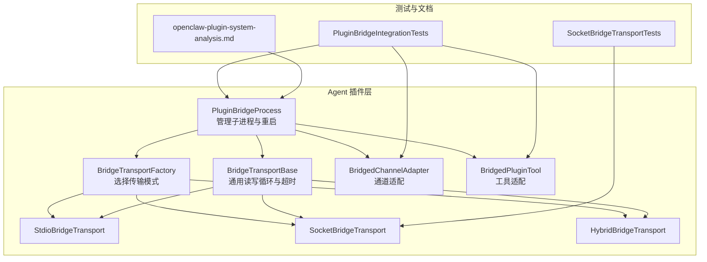
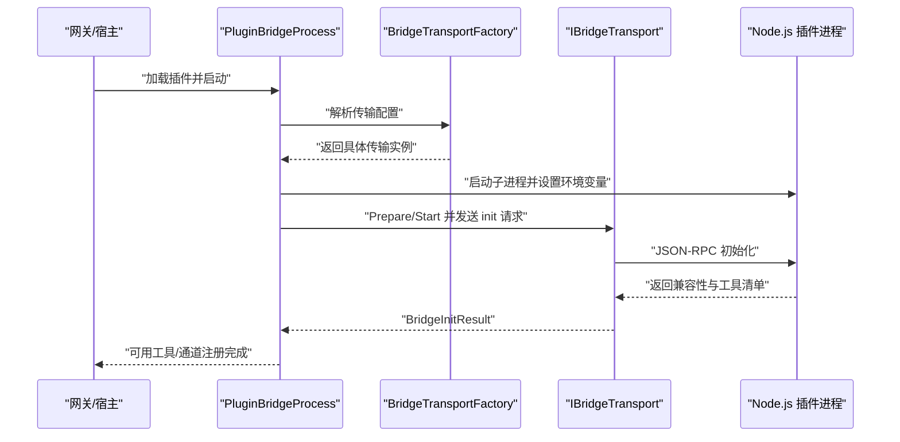
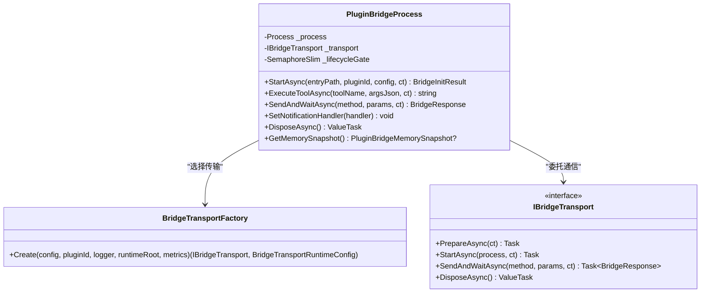
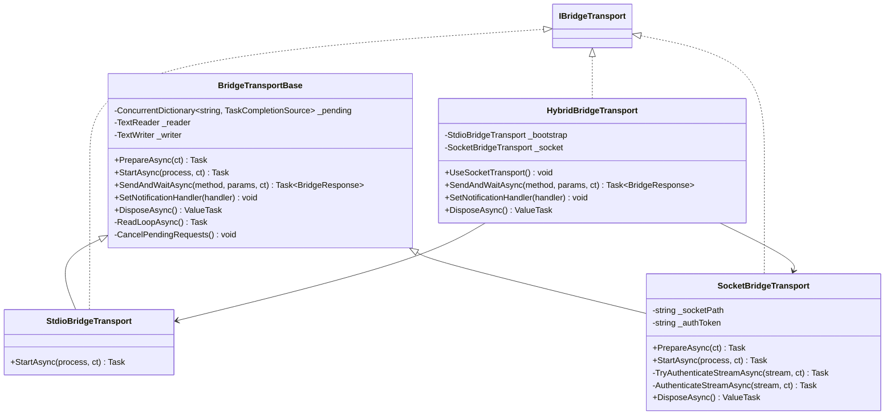
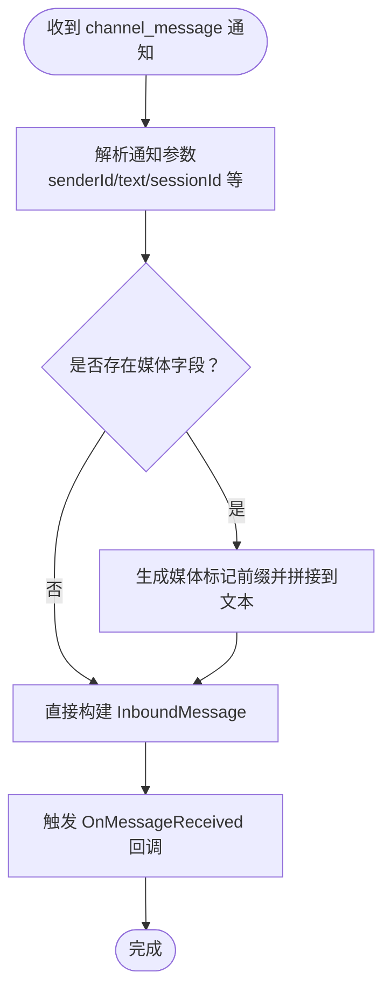
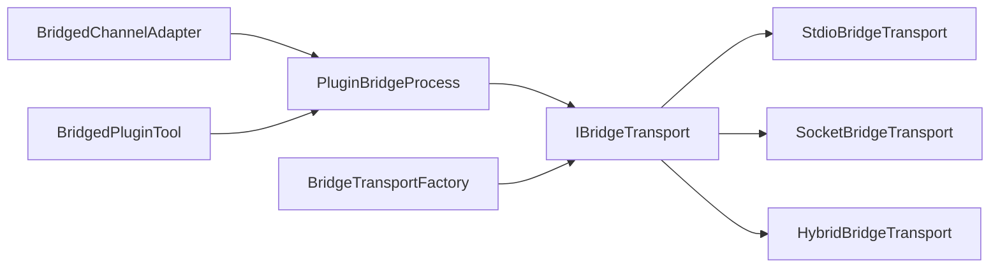

# JS/TS 插件桥接

<cite>
**本文引用的文件**
- [PluginBridgeProcess.cs](file://src/OpenClaw.Agent/Plugins/PluginBridgeProcess.cs)
- [BridgeTransportBase.cs](file://src/OpenClaw.Agent/Plugins/BridgeTransportBase.cs)
- [StdioBridgeTransport.cs](file://src/OpenClaw.Agent/Plugins/StdioBridgeTransport.cs)
- [SocketBridgeTransport.cs](file://src/OpenClaw.Agent/Plugins/SocketBridgeTransport.cs)
- [HybridBridgeTransport.cs](file://src/OpenClaw.Agent/Plugins/HybridBridgeTransport.cs)
- [BridgeTransportFactory.cs](file://src/OpenClaw.Agent/Plugins/BridgeTransportFactory.cs)
- [BridgedChannelAdapter.cs](file://src/OpenClaw.Agent/Plugins/BridgedChannelAdapter.cs)
- [BridgedPluginTool.cs](file://src/OpenClaw.Agent/Plugins/BridgedPluginTool.cs)
- [PluginBridgeIntegrationTests.cs](file://src/OpenClaw.Tests/PluginBridgeIntegrationTests.cs)
- [SocketBridgeTransportTests.cs](file://src/OpenClaw.Tests/SocketBridgeTransportTests.cs)
- [openclaw-plugin-system-analysis.md](file://docs/openclaw-plugin-system-analysis.md)
- [McpModels.cs](file://src/OpenClaw.Client/McpModels.cs)
- [OpenClawHttpClient.cs](file://src/OpenClaw.Client/OpenClawHttpClient.cs)
</cite>

## 目录
1. [简介](#简介)
2. [项目结构](#项目结构)
3. [核心组件](#核心组件)
4. [架构总览](#架构总览)
5. [详细组件分析](#详细组件分析)
6. [依赖关系分析](#依赖关系分析)
7. [性能考虑](#性能考虑)
8. [故障排查指南](#故障排查指南)
9. [结论](#结论)
10. [附录](#附录)

## 简介
本技术文档面向 JS/TS 插件开发者与平台集成工程师，系统性阐述 OpenClaw 中基于 Node.js 的插件桥接体系：包括桥接器架构、JSON-RPC 通信协议、进程间通信（IPC）机制、消息序列化与反序列化流程、插件生命周期管理、错误传播与超时处理策略，并提供开发模板、调试方法与性能优化建议。文档同时给出端到端的集成示例与最佳实践。

## 项目结构
围绕 JS/TS 插件桥接的关键目录与文件：
- Agent 层插件桥接实现：负责启动 Node.js 子进程、选择传输模式、封装 JSON-RPC 请求/响应、适配通道与工具。
- 测试用例：覆盖桥接内存测量、传输模式切换、认证失败、重启与退出恢复等场景。
- 文档：描述协议格式、Worker 入口模式与传输配置。

**图表来源**
- [PluginBridgeProcess.cs:16-478](file://src/OpenClaw.Agent/Plugins/PluginBridgeProcess.cs#L16-L478)
- [BridgeTransportFactory.cs:7-147](file://src/OpenClaw.Agent/Plugins/BridgeTransportFactory.cs#L7-L147)
- [StdioBridgeTransport.cs:9-25](file://src/OpenClaw.Agent/Plugins/StdioBridgeTransport.cs#L9-L25)
- [SocketBridgeTransport.cs:15-292](file://src/OpenClaw.Agent/Plugins/SocketBridgeTransport.cs#L15-L292)
- [HybridBridgeTransport.cs:12-91](file://src/OpenClaw.Agent/Plugins/HybridBridgeTransport.cs#L12-L91)
- [BridgeTransportBase.cs:10-149](file://src/OpenClaw.Agent/Plugins/BridgeTransportBase.cs#L10-L149)
- [BridgedChannelAdapter.cs:13-380](file://src/OpenClaw.Agent/Plugins/BridgedChannelAdapter.cs#L13-L380)
- [BridgedPluginTool.cs:10-41](file://src/OpenClaw.Agent/Plugins/BridgedPluginTool.cs#L10-L41)
- [PluginBridgeIntegrationTests.cs:745-1790](file://src/OpenClaw.Tests/PluginBridgeIntegrationTests.cs#L745-L1790)
- [SocketBridgeTransportTests.cs:11-78](file://src/OpenClaw.Tests/SocketBridgeTransportTests.cs#L11-L78)
- [openclaw-plugin-system-analysis.md:273-330](file://docs/openclaw-plugin-system-analysis.md#L273-L330)

**章节来源**
- [PluginBridgeProcess.cs:16-478](file://src/OpenClaw.Agent/Plugins/PluginBridgeProcess.cs#L16-L478)
- [BridgeTransportFactory.cs:7-147](file://src/OpenClaw.Agent/Plugins/BridgeTransportFactory.cs#L7-L147)
- [openclaw-plugin-system-analysis.md:273-330](file://docs/openclaw-plugin-system-analysis.md#L273-L330)

## 核心组件
- 插件桥接进程管理器：负责 Node.js 子进程生命周期、自动重启、日志转发、内存快照与安全退出。
- 传输层抽象：统一 JSON-RPC 读写循环、请求 ID 分配、超时与取消、通知分发。
- 传输工厂：根据配置选择 stdio、socket 或 hybrid 模式；在 Unix/Windows 上分别使用域套接字/命名管道，并内置认证令牌。
- 通道适配器：将插件注册的通道映射为平台统一接口，支持消息收发、打字指示、已读回执、反应表情等。
- 工具适配器：将插件注册的工具映射为平台可执行的 ITool，参数通过 JSON 序列化传递。
- 测试与文档：验证桥接行为、传输认证、重启与退出恢复、协议格式一致性。

**章节来源**
- [PluginBridgeProcess.cs:16-478](file://src/OpenClaw.Agent/Plugins/PluginBridgeProcess.cs#L16-L478)
- [BridgeTransportBase.cs:10-149](file://src/OpenClaw.Agent/Plugins/BridgeTransportBase.cs#L10-L149)
- [BridgeTransportFactory.cs:7-147](file://src/OpenClaw.Agent/Plugins/BridgeTransportFactory.cs#L7-L147)
- [BridgedChannelAdapter.cs:13-380](file://src/OpenClaw.Agent/Plugins/BridgedChannelAdapter.cs#L13-L380)
- [BridgedPluginTool.cs:10-41](file://src/OpenClaw.Agent/Plugins/BridgedPluginTool.cs#L10-L41)
- [PluginBridgeIntegrationTests.cs:745-1790](file://src/OpenClaw.Tests/PluginBridgeIntegrationTests.cs#L745-L1790)
- [SocketBridgeTransportTests.cs:11-78](file://src/OpenClaw.Tests/SocketBridgeTransportTests.cs#L11-L78)

## 架构总览
桥接系统采用“网关侧进程 + Node.js 插件进程”的双进程模型，通过 JSON-RPC 在标准输入输出或本地 IPC（Unix 域套接字/Windows 命名管道）之间进行双向通信。传输层在初始化阶段完成认证与握手，随后进入稳定态的请求/响应与通知分发。

**图表来源**
- [PluginBridgeProcess.cs:271-313](file://src/OpenClaw.Agent/Plugins/PluginBridgeProcess.cs#L271-L313)
- [BridgeTransportFactory.cs:11-45](file://src/OpenClaw.Agent/Plugins/BridgeTransportFactory.cs#L11-L45)
- [BridgeTransportBase.cs:43-75](file://src/OpenClaw.Agent/Plugins/BridgeTransportBase.cs#L43-L75)
- [openclaw-plugin-system-analysis.md:273-330](file://docs/openclaw-plugin-system-analysis.md#L273-L330)

## 详细组件分析

### 组件一：插件桥接进程管理器（PluginBridgeProcess）
职责与特性：
- 启动/停止 Node.js 子进程，转发 stderr 到宿主日志。
- 负责传输层选择与生命周期管理，包含准备、启动、监控退出、自动重启与资源清理。
- 提供工具执行、通用请求发送与等待、通知处理器设置。
- 支持外部进程启动规范（自定义可执行文件、工作目录、环境变量）。
- 提供内存快照能力，便于性能观测与回归测试。

**图表来源**
- [PluginBridgeProcess.cs:16-478](file://src/OpenClaw.Agent/Plugins/PluginBridgeProcess.cs#L16-L478)
- [BridgeTransportFactory.cs:7-147](file://src/OpenClaw.Agent/Plugins/BridgeTransportFactory.cs#L7-L147)

**章节来源**
- [PluginBridgeProcess.cs:91-355](file://src/OpenClaw.Agent/Plugins/PluginBridgeProcess.cs#L91-L355)

### 组件二：传输层抽象与实现（BridgeTransportBase、Stdio、Socket、Hybrid）
职责与特性：
- 统一 JSON-RPC 协议：分配请求 ID、超时控制（默认 60 秒）、取消处理、通知与响应分流。
- 读循环：逐行读取 JSON 行，解析后分派至 pending 完成器或通知处理器。
- Stdio：直接使用子进程标准输入输出流。
- Socket：Unix 域套接字（类 Unix）或 Windows 命名管道；连接后进行一次性认证，要求客户端发送包含固定令牌的认证行。
- Hybrid：启动阶段使用 stdio，稳定后切换到 socket；若 socket 失败则回退到 stdio。

**图表来源**
- [BridgeTransportBase.cs:10-149](file://src/OpenClaw.Agent/Plugins/BridgeTransportBase.cs#L10-L149)
- [StdioBridgeTransport.cs:9-25](file://src/OpenClaw.Agent/Plugins/StdioBridgeTransport.cs#L9-L25)
- [SocketBridgeTransport.cs:15-292](file://src/OpenClaw.Agent/Plugins/SocketBridgeTransport.cs#L15-L292)
- [HybridBridgeTransport.cs:12-91](file://src/OpenClaw.Agent/Plugins/HybridBridgeTransport.cs#L12-L91)

**章节来源**
- [BridgeTransportBase.cs:43-136](file://src/OpenClaw.Agent/Plugins/BridgeTransportBase.cs#L43-L136)
- [StdioBridgeTransport.cs:16-23](file://src/OpenClaw.Agent/Plugins/StdioBridgeTransport.cs#L16-L23)
- [SocketBridgeTransport.cs:91-137](file://src/OpenClaw.Agent/Plugins/SocketBridgeTransport.cs#L91-L137)
- [HybridBridgeTransport.cs:65-83](file://src/OpenClaw.Agent/Plugins/HybridBridgeTransport.cs#L65-L83)

### 组件三：通道适配器（BridgedChannelAdapter）
职责与特性：
- 将插件注册的通道映射为平台统一接口，支持启动/停止、消息收发、打字指示、已读回执、反应表情等。
- 内部处理媒体标记转换，将媒体信息转为标记前缀文本以兼容下游流水线。
- 认证事件（如二维码登录）通过通知分发。

**图表来源**
- [BridgedChannelAdapter.cs:214-300](file://src/OpenClaw.Agent/Plugins/BridgedChannelAdapter.cs#L214-L300)

**章节来源**
- [BridgedChannelAdapter.cs:46-347](file://src/OpenClaw.Agent/Plugins/BridgedChannelAdapter.cs#L46-L347)

### 组件四：工具适配器（BridgedPluginTool）
职责与特性：
- 将插件注册的工具映射为平台 ITool 接口，参数通过 JSON 序列化传递，结果字符串返回。
- 执行时委托 PluginBridgeProcess 发送 JSON-RPC execute 请求并等待响应。

**章节来源**
- [BridgedPluginTool.cs:35-39](file://src/OpenClaw.Agent/Plugins/BridgedPluginTool.cs#L35-L39)

### 组件五：传输工厂（BridgeTransportFactory）
职责与特性：
- 解析配置，标准化模式（stdio/socket/hybrid），在 Unix/Windows 上生成合适的 socket 路径与认证令牌。
- 为 socket 模式创建临时目录并限制权限，确保本地 IPC 安全。

**章节来源**
- [BridgeTransportFactory.cs:11-102](file://src/OpenClaw.Agent/Plugins/BridgeTransportFactory.cs#L11-L102)

## 依赖关系分析
- 组件耦合与内聚：
  - PluginBridgeProcess 对外仅依赖 IBridgeTransport 接口，耦合度低，内聚于进程生命周期与 JSON-RPC 调用。
  - 传输层均继承自 BridgeTransportBase，共享读循环、超时与通知处理逻辑，降低重复。
- 外部依赖：
  - Node.js 可执行文件发现与启动参数注入。
  - 本地 IPC（Unix 套接字/Windows 命名管道）与认证令牌。
- 潜在循环依赖：
  - 无直接循环；传输层通过工厂创建，避免运行期循环。

**图表来源**
- [PluginBridgeProcess.cs:271-313](file://src/OpenClaw.Agent/Plugins/PluginBridgeProcess.cs#L271-L313)
- [BridgeTransportFactory.cs:11-45](file://src/OpenClaw.Agent/Plugins/BridgeTransportFactory.cs#L11-L45)
- [BridgedChannelAdapter.cs:13-44](file://src/OpenClaw.Agent/Plugins/BridgedChannelAdapter.cs#L13-L44)
- [BridgedPluginTool.cs:10-41](file://src/OpenClaw.Agent/Plugins/BridgedPluginTool.cs#L10-L41)

**章节来源**
- [PluginBridgeProcess.cs:271-313](file://src/OpenClaw.Agent/Plugins/PluginBridgeProcess.cs#L271-L313)
- [BridgeTransportFactory.cs:11-45](file://src/OpenClaw.Agent/Plugins/BridgeTransportFactory.cs#L11-L45)

## 性能考虑
- 进程与内存：
  - 通过内存快照对比宿主与子进程的 WorkingSet 与 PrivateMemory，评估插件引入的额外开销。
  - 测试用例展示了在不同传输模式下的内存测量流程。
- 传输模式选择：
  - hybrid 模式在稳定态使用 socket，减少 stdio 的阻塞风险；socket 认证失败会自动回退到 stdio。
- 超时与取消：
  - 传输层默认 60 秒超时，支持取消令牌；工具执行路径也具备超时保护。
- 日志与可观测性：
  - 子进程 stderr 重定向到宿主日志；传输层记录异常与认证失败指标。

**章节来源**
- [PluginBridgeIntegrationTests.cs:785-829](file://src/OpenClaw.Tests/PluginBridgeIntegrationTests.cs#L785-L829)
- [HybridBridgeTransport.cs:65-83](file://src/OpenClaw.Agent/Plugins/HybridBridgeTransport.cs#L65-L83)
- [BridgeTransportBase.cs:67-70](file://src/OpenClaw.Agent/Plugins/BridgeTransportBase.cs#L67-L70)
- [SocketBridgeTransport.cs:185-257](file://src/OpenClaw.Agent/Plugins/SocketBridgeTransport.cs#L185-L257)

## 故障排查指南
- 传输认证失败：
  - Socket/Named Pipe 客户端必须在连接后立即发送包含正确令牌的认证行；失败将被拒绝并记录指标。
- 进程意外退出：
  - 监控线程检测到退出后会尝试重启；若多次失败，记录错误日志并增加失败计数。
- 通知与响应乱序：
  - 传输层通过请求 ID 匹配响应，确保并发请求不混淆；异常 JSON 将被记录并忽略。
- 超时与取消：
  - 默认超时 60 秒；可通过上层传入取消令牌中断等待。
- 单元测试辅助：
  - 提供针对 socket 认证失败与目录清理的测试用例，便于定位问题。

**章节来源**
- [SocketBridgeTransportTests.cs:14-50](file://src/OpenClaw.Tests/SocketBridgeTransportTests.cs#L14-L50)
- [PluginBridgeProcess.cs:402-420](file://src/OpenClaw.Agent/Plugins/PluginBridgeProcess.cs#L402-L420)
- [BridgeTransportBase.cs:106-136](file://src/OpenClaw.Agent/Plugins/BridgeTransportBase.cs#L106-L136)

## 结论
该 JS/TS 插件桥接系统以清晰的进程边界与传输抽象实现了跨语言扩展能力：通过 JSON-RPC 与本地 IPC，既保证了协议一致性，又兼顾了性能与安全性。工厂化传输选择与自动重启机制提升了鲁棒性；通道与工具适配器将插件能力无缝接入平台生态。配合完善的测试与可观测性，开发者可以快速构建、调试与优化插件。

## 附录

### JSON-RPC 通信协议与消息格式
- 请求/响应：
  - 请求包含 id、method、params 字段；响应包含 id、result、error。
- 通知：
  - 通知包含 notification 字段与 params 载荷。
- 示例（来自文档）：
  - 请求封包：包含 id、method、params。
  - 响应封包：包含 id、result、error。
  - 通知封包：包含 notification、params。

**章节来源**
- [openclaw-plugin-system-analysis.md:273-290](file://docs/openclaw-plugin-system-analysis.md#L273-L290)

### 开发者模板与集成步骤
- 插件入口与协议：
  - 将 console.log 重定向到 stderr；导入协议方法与插件引擎；定义 init/channel_start/channel_send/shutdown 等方法分发；进入 stdio JSON-RPC 循环。
- 传输配置：
  - 支持 stdio、socket、hybrid 三种模式；socket 模式需正确设置认证令牌。
- 工具与通道注册：
  - 使用 api.registerTool 与 api.registerChannel 注册能力；工具参数遵循 JSON Schema。
- 生命周期：
  - init 返回兼容性与工具清单；channel_start 返回 selfId/selfIds；channel_stop 触发停止；shutdown 触发优雅退出。

**章节来源**
- [openclaw-plugin-system-analysis.md:294-330](file://docs/openclaw-plugin-system-analysis.md#L294-L330)

### 调试方法
- 启用详细日志：观察子进程 stderr 输出与传输层警告。
- 使用测试用例：参考插件桥接集成测试与 socket 认证测试，定位问题场景。
- 性能观测：利用内存快照对比宿主与子进程内存占用。

**章节来源**
- [PluginBridgeIntegrationTests.cs:785-829](file://src/OpenClaw.Tests/PluginBridgeIntegrationTests.cs#L785-L829)
- [SocketBridgeTransportTests.cs:14-50](file://src/OpenClaw.Tests/SocketBridgeTransportTests.cs#L14-L50)

### 性能优化建议
- 优先使用 hybrid 模式：启动阶段 stdio，稳定后 socket，降低阻塞与上下文切换。
- 控制工具参数大小：避免过大的 JSON 参数导致序列化/反序列化开销。
- 合理设置超时：根据工具复杂度调整等待时间，避免长时间阻塞。
- 传输认证：确保 socket 认证令牌正确下发，减少失败重连成本。

**章节来源**
- [HybridBridgeTransport.cs:65-83](file://src/OpenClaw.Agent/Plugins/HybridBridgeTransport.cs#L65-L83)
- [BridgeTransportBase.cs:67-70](file://src/OpenClaw.Agent/Plugins/BridgeTransportBase.cs#L67-L70)

### MCP 客户端集成参考
- 客户端通过 HTTP 发送 JSON-RPC 请求，支持 SSE 响应；对错误进行统一处理。
- 客户端模型包含能力声明、工具定义、资源列表等。

**章节来源**
- [OpenClawHttpClient.cs:262-1328](file://src/OpenClaw.Client/OpenClawHttpClient.cs#L262-L1328)
- [McpModels.cs:49-97](file://src/OpenClaw.Client/McpModels.cs#L49-L97)