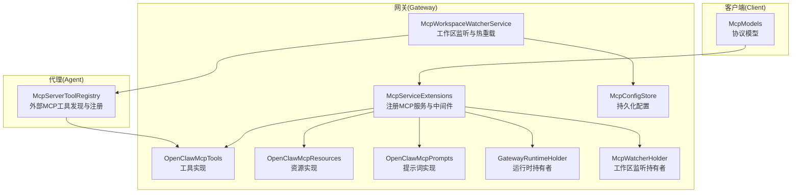
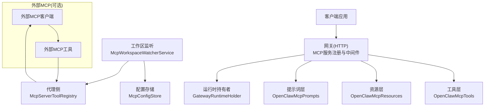
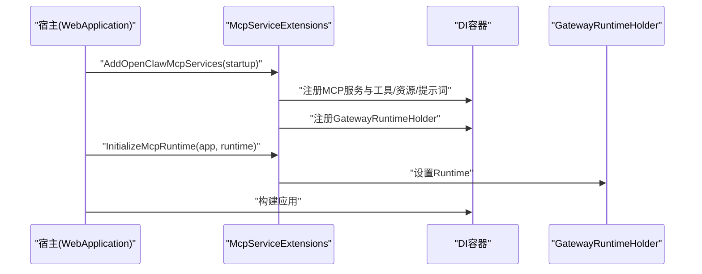
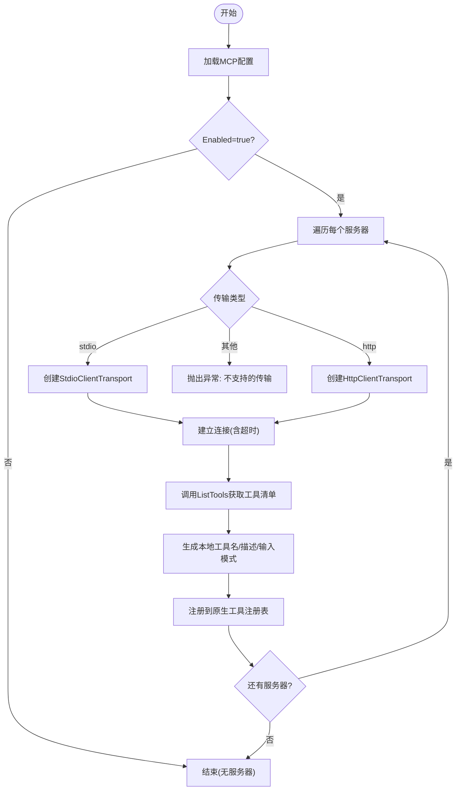
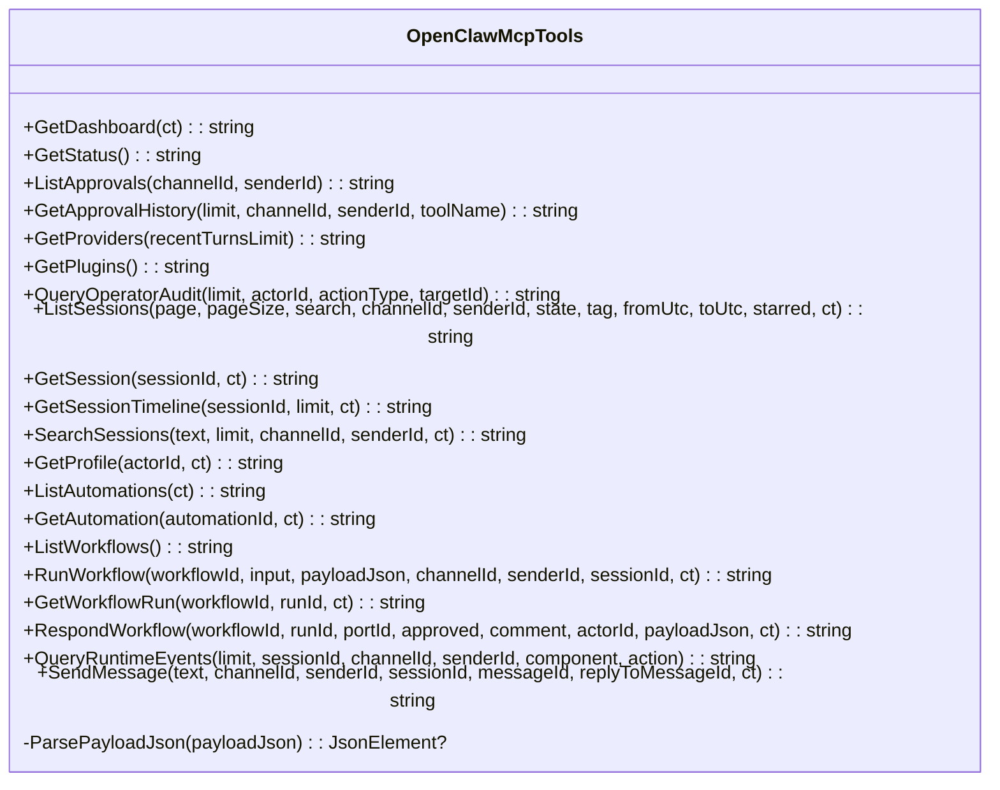
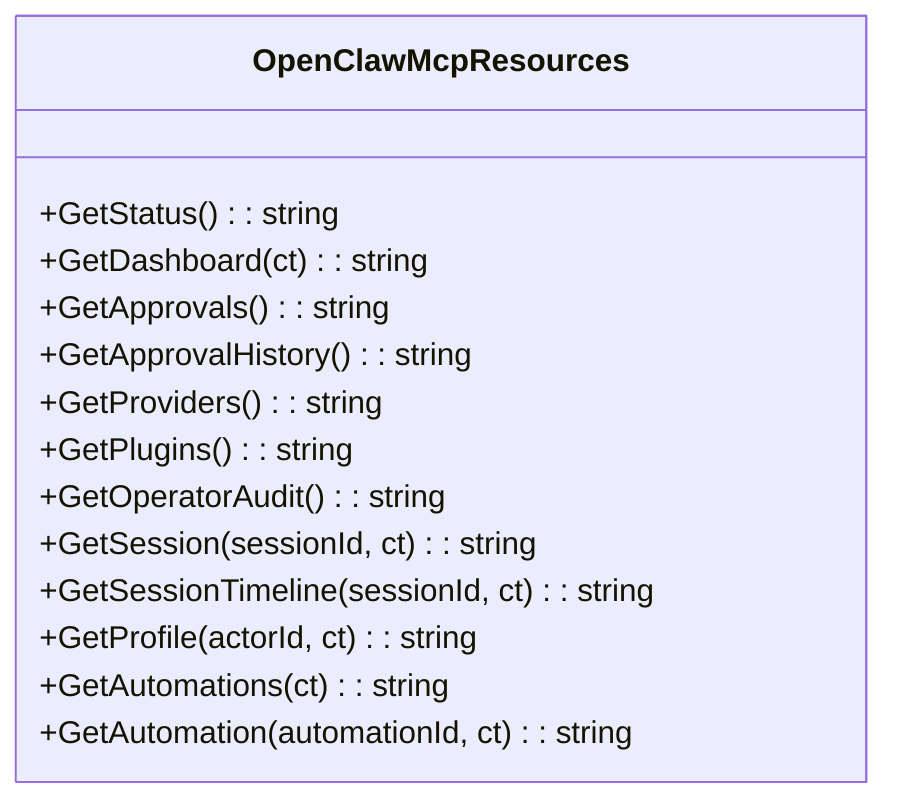
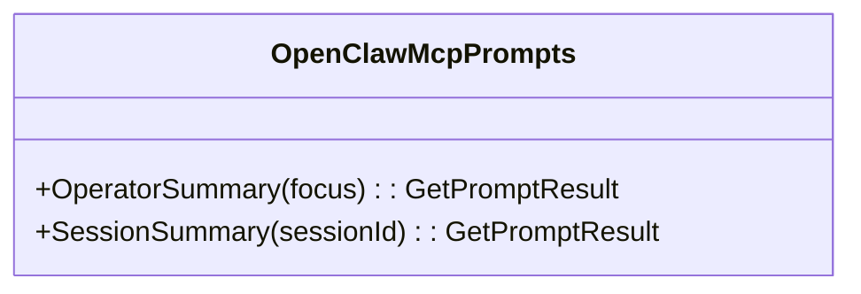
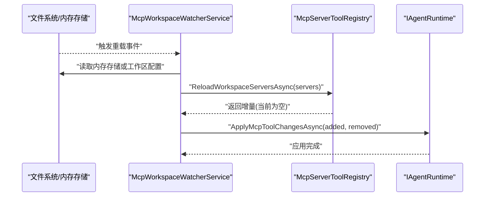
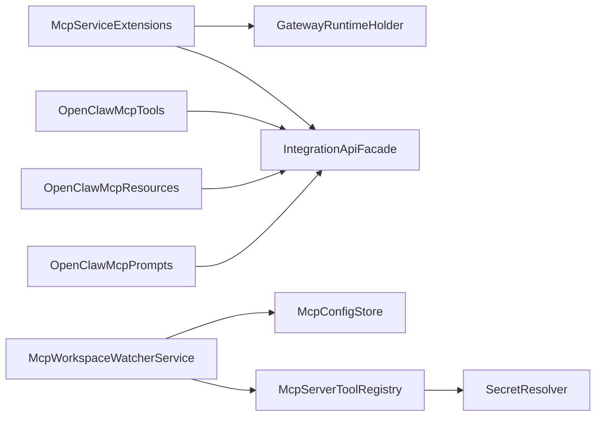

# MCP 服务器

<cite>
**本文引用的文件**
- [McpServiceExtensions.cs](file://src/OpenClaw.Gateway/Mcp/McpServiceExtensions.cs)
- [OpenClawMcpTools.cs](file://src/OpenClaw.Gateway/Mcp/OpenClawMcpTools.cs)
- [OpenClawMcpResources.cs](file://src/OpenClaw.Gateway/Mcp/OpenClawMcpResources.cs)
- [OpenClawMcpPrompts.cs](file://src/OpenClaw.Gateway/Mcp/OpenClawMcpPrompts.cs)
- [GatewayRuntimeHolder.cs](file://src/OpenClaw.Gateway/Mcp/GatewayRuntimeHolder.cs)
- [McpWatcherHolder.cs](file://src/OpenClaw.Gateway/Mcp/McpWatcherHolder.cs)
- [McpWorkspaceWatcherService.cs](file://src/OpenClaw.Gateway/McpWorkspaceWatcherService.cs)
- [McpConfigStore.cs](file://src/OpenClaw.Gateway/Mcp/McpConfigStore.cs)
- [McpServerToolRegistry.cs](file://src/OpenClaw.Agent/Plugins/McpServerToolRegistry.cs)
- [McpModels.cs](file://src/OpenClaw.Client/McpModels.cs)
</cite>

## 目录
1. [简介](#简介)
2. [项目结构](#项目结构)
3. [核心组件](#核心组件)
4. [架构总览](#架构总览)
5. [组件详解](#组件详解)
6. [依赖关系分析](#依赖关系分析)
7. [性能与可扩展性](#性能与可扩展性)
8. [部署与运维指南](#部署与运维指南)
9. [客户端集成示例](#客户端集成示例)
10. [故障排除](#故障排除)
11. [结论](#结论)

## 简介
本文件面向 MCP（Model Context Protocol）服务器在 OpenClaw 中的集成与使用，系统化阐述以下主题：
- MCP 协议实现原理与在本项目中的落地方式
- 服务器启动流程、工具注册机制与连接管理
- 配置项与热重载策略、消息路由与错误处理
- MCP 工具开发规范、协议实现要点、安全控制与性能优化
- 部署指南、客户端集成步骤与常见问题排查

## 项目结构
围绕 MCP 的相关代码主要分布在以下模块：
- 网关侧（Gateway）：MCP 服务注册、HTTP 传输、工具/资源/提示词桥接、运行时持有者、工作区监听与配置存储
- 客户端侧（Client）：MCP 协议模型定义（请求/响应、能力、工具/资源/提示词结构）
- 代理侧（Agent）：从外部 MCP 服务器发现并注册为本地工具的注册器

**图表来源**
- [McpServiceExtensions.cs:11-91](file://src/OpenClaw.Gateway/Mcp/McpServiceExtensions.cs#L11-L91)
- [OpenClawMcpTools.cs:14-319](file://src/OpenClaw.Gateway/Mcp/OpenClawMcpTools.cs#L14-L319)
- [OpenClawMcpResources.cs:9-116](file://src/OpenClaw.Gateway/Mcp/OpenClawMcpResources.cs#L9-L116)
- [OpenClawMcpPrompts.cs:12-71](file://src/OpenClaw.Gateway/Mcp/OpenClawMcpPrompts.cs#L12-L71)
- [GatewayRuntimeHolder.cs:10-21](file://src/OpenClaw.Gateway/Mcp/GatewayRuntimeHolder.cs#L10-L21)
- [McpWatcherHolder.cs:7-11](file://src/OpenClaw.Gateway/Mcp/McpWatcherHolder.cs#L7-L11)
- [McpWorkspaceWatcherService.cs:20-221](file://src/OpenClaw.Gateway/McpWorkspaceWatcherService.cs#L20-L221)
- [McpConfigStore.cs:11-110](file://src/OpenClaw.Gateway/Mcp/McpConfigStore.cs#L11-L110)
- [McpServerToolRegistry.cs:16-369](file://src/OpenClaw.Agent/Plugins/McpServerToolRegistry.cs#L16-L369)
- [McpModels.cs:1-187](file://src/OpenClaw.Client/McpModels.cs#L1-L187)

**章节来源**
- [McpServiceExtensions.cs:11-91](file://src/OpenClaw.Gateway/Mcp/McpServiceExtensions.cs#L11-L91)
- [McpWorkspaceWatcherService.cs:20-221](file://src/OpenClaw.Gateway/McpWorkspaceWatcherService.cs#L20-L221)
- [McpServerToolRegistry.cs:16-369](file://src/OpenClaw.Agent/Plugins/McpServerToolRegistry.cs#L16-L369)

## 核心组件
- MCP 服务注册与中间件
  - 在服务注册阶段添加官方 MCP 服务器基础设施，并通过 HTTP 无状态传输启用工具、资源与提示词能力；同时注入运行时持有者以桥接网关运行时。
  - 提供轻量级中间件，对 /mcp 路径进行基于令牌的授权与速率限制。
- 工具实现（OpenClawMcpTools）
  - 基于 IntegrationApiFacade 暴露一系列工具，覆盖仪表盘、状态、审批、审计、会话、自动化、工作流、消息发送等能力，名称保留 openclaw.* 前缀以兼容既有客户端。
- 资源实现（OpenClawMcpResources）
  - 通过 URI 模板暴露只读资源快照，如状态、仪表盘、待审批、历史、提供商、插件、操作员审计、会话详情与时间线、用户画像、自动化列表与详情。
- 提示词实现（OpenClawMcpPrompts）
  - 提供模板化提示词，引导模型按顺序调用资源与工具，完成运营摘要与会话摘要等任务。
- 运行时持有者（GatewayRuntimeHolder）
  - 在容器构建后填充 GatewayAppRuntime，确保 MCP 处理链路可访问网关运行时。
- 工作区监听与热重载（McpWorkspaceWatcherService + McpConfigStore）
  - 监听工作区 .kingcrab/mcp.json 或内存数据卷中的 mcp.json，支持无重启热重载外部 MCP 服务器配置；优先读取内存存储配置，回退到工作区文件。
- 外部 MCP 工具注册（McpServerToolRegistry）
  - 发现外部 MCP 服务器工具，将其包装为本地工具并注册到原生工具注册表；支持 stdio 与 http 两种传输方式，支持环境变量与头部的密钥解析。

**章节来源**
- [McpServiceExtensions.cs:20-91](file://src/OpenClaw.Gateway/Mcp/McpServiceExtensions.cs#L20-L91)
- [OpenClawMcpTools.cs:14-319](file://src/OpenClaw.Gateway/Mcp/OpenClawMcpTools.cs#L14-L319)
- [OpenClawMcpResources.cs:9-116](file://src/OpenClaw.Gateway/Mcp/OpenClawMcpResources.cs#L9-L116)
- [OpenClawMcpPrompts.cs:12-71](file://src/OpenClaw.Gateway/Mcp/OpenClawMcpPrompts.cs#L12-L71)
- [GatewayRuntimeHolder.cs:10-21](file://src/OpenClaw.Gateway/Mcp/GatewayRuntimeHolder.cs#L10-L21)
- [McpWorkspaceWatcherService.cs:20-221](file://src/OpenClaw.Gateway/McpWorkspaceWatcherService.cs#L20-L221)
- [McpConfigStore.cs:11-110](file://src/OpenClaw.Gateway/Mcp/McpConfigStore.cs#L11-L110)
- [McpServerToolRegistry.cs:16-369](file://src/OpenClaw.Agent/Plugins/McpServerToolRegistry.cs#L16-L369)

## 架构总览
下图展示 MCP 在 OpenClaw 中的端到端架构：网关侧注册 MCP 服务、桥接运行时；客户端通过 HTTP 与工具/资源/提示词交互；代理侧可从外部 MCP 服务器发现并注册工具；工作区监听负责配置热重载。

**图表来源**
- [McpServiceExtensions.cs:20-91](file://src/OpenClaw.Gateway/Mcp/McpServiceExtensions.cs#L20-L91)
- [OpenClawMcpTools.cs:14-319](file://src/OpenClaw.Gateway/Mcp/OpenClawMcpTools.cs#L14-L319)
- [OpenClawMcpResources.cs:9-116](file://src/OpenClaw.Gateway/Mcp/OpenClawMcpResources.cs#L9-L116)
- [OpenClawMcpPrompts.cs:12-71](file://src/OpenClaw.Gateway/Mcp/OpenClawMcpPrompts.cs#L12-L71)
- [GatewayRuntimeHolder.cs:10-21](file://src/OpenClaw.Gateway/Mcp/GatewayRuntimeHolder.cs#L10-L21)
- [McpWorkspaceWatcherService.cs:20-221](file://src/OpenClaw.Gateway/McpWorkspaceWatcherService.cs#L20-L221)
- [McpConfigStore.cs:11-110](file://src/OpenClaw.Gateway/Mcp/McpConfigStore.cs#L11-L110)
- [McpServerToolRegistry.cs:16-369](file://src/OpenClaw.Agent/Plugins/McpServerToolRegistry.cs#L16-L369)

## 组件详解

### 网关 MCP 服务注册与中间件
- 服务注册
  - 使用官方 MCP ASP.NET Core 扩展注册服务器，设置 ServerInfo，启用 HTTP 无状态传输，绑定工具/资源/提示词类型。
  - 注入 GatewayRuntimeHolder 与 IntegrationApiFacade，用于后续工具/资源实现访问网关运行时与 API。
- 初始化运行时
  - 在应用构建完成后，通过 InitializeMcpRuntime 将 GatewayAppRuntime 写入 GatewayRuntimeHolder。
- 授权与限流中间件
  - 对 /mcp 路径执行统一授权校验与 IP 粒度的速率限制，复用网关其他端点的安全策略。

**图表来源**
- [McpServiceExtensions.cs:20-56](file://src/OpenClaw.Gateway/Mcp/McpServiceExtensions.cs#L20-L56)

**章节来源**
- [McpServiceExtensions.cs:20-91](file://src/OpenClaw.Gateway/Mcp/McpServiceExtensions.cs#L20-L91)
- [GatewayRuntimeHolder.cs:10-21](file://src/OpenClaw.Gateway/Mcp/GatewayRuntimeHolder.cs#L10-L21)

### 工具注册与连接管理（外部 MCP）
- 配置加载
  - 支持从工作区 .kingcrab/mcp.json 或内存存储 mcp.json 加载服务器配置；支持 Enabled 控制与单个服务器禁用。
- 连接建立
  - 支持 stdio 与 http 两种传输；http 传输支持自定义头部与额外请求头；stdio 传输支持命令、参数、工作目录与环境变量。
- 工具发现与命名
  - 通过 ListTools 获取远程工具清单，生成本地工具名（可带前缀），拼接描述信息，保留输入模式。
- 错误处理与清理
  - 建立失败时释放已建立的客户端；支持超时控制；环境变量/头部值支持以 env: 前缀引用未设置变量时报错。
- 注册与热重载
  - 将发现的工具注册到原生工具注册表；当前构建不支持运行时热替换，返回空增量，监听服务保持为无操作。

**图表来源**
- [McpServerToolRegistry.cs:78-138](file://src/OpenClaw.Agent/Plugins/McpServerToolRegistry.cs#L78-L138)
- [McpServerToolRegistry.cs:225-246](file://src/OpenClaw.Agent/Plugins/McpServerToolRegistry.cs#L225-L246)

**章节来源**
- [McpServerToolRegistry.cs:16-369](file://src/OpenClaw.Agent/Plugins/McpServerToolRegistry.cs#L16-L369)

### 工具实现（OpenClawMcpTools）
- 功能范围
  - 仪表盘快照、运行时状态、待审批列表、审批历史、提供商快照、插件健康、操作员审计、会话列表/详情/时间线、会话检索、用户画像、自动化列表/详情、工作流运行与查询、工作流响应、运行时事件查询、消息入队。
- 参数与返回
  - 工具方法标注为只读或可写；参数使用 Description 片段；返回值序列化为 JSON 字符串，使用 CoreJsonContext 指定的响应类型上下文。
- 错误处理
  - 对不存在的会话、画像等实体抛出 KeyNotFoundException；payloadJson 参数要求合法 JSON，否则抛出 ArgumentException。

**图表来源**
- [OpenClawMcpTools.cs:14-319](file://src/OpenClaw.Gateway/Mcp/OpenClawMcpTools.cs#L14-L319)

**章节来源**
- [OpenClawMcpTools.cs:14-319](file://src/OpenClaw.Gateway/Mcp/OpenClawMcpTools.cs#L14-L319)

### 资源实现（OpenClawMcpResources）
- 资源类型
  - 通过 UriTemplate 定义资源路径，如 openclaw://status、openclaw://dashboard、openclaw://sessions/{sessionId} 等。
- 访问控制
  - 仅提供只读快照，避免直接写入；对不存在的会话/画像抛出 KeyNotFoundException。
- 返回格式
  - JSON 序列化，使用 CoreJsonContext 指定的响应类型上下文。

**图表来源**
- [OpenClawMcpResources.cs:9-116](file://src/OpenClaw.Gateway/Mcp/OpenClawMcpResources.cs#L9-L116)

**章节来源**
- [OpenClawMcpResources.cs:9-116](file://src/OpenClaw.Gateway/Mcp/OpenClawMcpResources.cs#L9-L116)

### 提示词实现（OpenClawMcpPrompts）
- 类型
  - 基于模板的提示词，不执行 I/O，输出预组合的消息序列，指导模型有效使用资源与工具。
- 场景
  - 运营商摘要（可聚焦 providers/approvals/plugins 等）与会话摘要（结合资源与工具）。

**图表来源**
- [OpenClawMcpPrompts.cs:12-71](file://src/OpenClaw.Gateway/Mcp/OpenClawMcpPrompts.cs#L12-L71)

**章节来源**
- [OpenClawMcpPrompts.cs:12-71](file://src/OpenClaw.Gateway/Mcp/OpenClawMcpPrompts.cs#L12-L71)

### 工作区监听与热重载
- 配置来源优先级
  - 内存存储配置（由管理员 API 写入，可靠于容器） > 工作区文件（手动编辑/遗留路径）。
- 热重载流程
  - 通过通道去抖动合并快速事件；读取配置后调用注册器的 ReloadWorkspaceServersAsync（当前返回空增量）；最终通过 AgentRuntime.ApplyMcpToolChangesAsync 应用变更。
- 异常处理
  - 监听循环捕获未处理异常并记录日志，保证服务稳定性。

**图表来源**
- [McpWorkspaceWatcherService.cs:85-151](file://src/OpenClaw.Gateway/McpWorkspaceWatcherService.cs#L85-L151)
- [McpServerToolRegistry.cs:357-367](file://src/OpenClaw.Agent/Plugins/McpServerToolRegistry.cs#L357-L367)

**章节来源**
- [McpWorkspaceWatcherService.cs:20-221](file://src/OpenClaw.Gateway/McpWorkspaceWatcherService.cs#L20-L221)
- [McpConfigStore.cs:11-110](file://src/OpenClaw.Gateway/Mcp/McpConfigStore.cs#L11-L110)
- [McpServerToolRegistry.cs:357-367](file://src/OpenClaw.Agent/Plugins/McpServerToolRegistry.cs#L357-L367)

### 客户端协议模型
- 请求/响应
  - JSON-RPC 2.0 结构，包含 id、method、params/result/error 等字段。
- 初始化
  - 客户端信息与能力声明，服务端返回协议版本、能力与服务器信息。
- 工具/资源/提示词
  - 工具定义与调用、资源模板与读取、提示词列表与获取。

```mermaid
classDiagram
class McpJsonRpcRequest {
+string jsonrpc
+string id
+string method
+JsonElement params
}
class McpJsonRpcResponse {
+string jsonrpc
+JsonElement id
+JsonElement result
+McpJsonRpcError error
}
class McpInitializeRequest {
+string protocolVersion
+McpClientCapabilities capabilities
+McpClientInfo clientInfo
}
class McpInitializeResult {
+string protocolVersion
+McpCapabilities capabilities
+McpServerInfo serverInfo
}
class McpCallToolRequest {
+string name
+JsonElement arguments
}
class McpToolDefinition {
+string name
+string description
+JsonElement inputSchema
}
class McpResourceDefinition {
+string uri
+string name
+string description
+string mimeType
}
class McpPromptDefinition {
+string name
+string description
+McpPromptArgumentDefinition[] arguments
}
```

**图表来源**
- [McpModels.cs:5-187](file://src/OpenClaw.Client/McpModels.cs#L5-L187)

**章节来源**
- [McpModels.cs:1-187](file://src/OpenClaw.Client/McpModels.cs#L1-L187)

## 依赖关系分析
- 组件耦合
  - McpServiceExtensions 与 GatewayRuntimeHolder 强耦合，确保运行时可用；与 IntegrationApiFacade 解耦，便于工具/资源实现复用。
  - OpenClawMcpTools/ Resources/Prompts 依赖 IntegrationApiFacade，形成清晰的边界。
  - McpWorkspaceWatcherService 依赖 McpConfigStore 与 McpServerToolRegistry，实现配置与工具的解耦。
  - McpServerToolRegistry 依赖外部 MCP 客户端与 SecretResolver，负责传输与安全。
- 外部依赖
  - 使用官方 ModelContextProtocol.AspNetCore 扩展；使用 System.Text.Json 进行序列化；使用 System.Threading.Channels 实现去抖动。

**图表来源**
- [McpServiceExtensions.cs:20-56](file://src/OpenClaw.Gateway/Mcp/McpServiceExtensions.cs#L20-L56)
- [OpenClawMcpTools.cs:14-319](file://src/OpenClaw.Gateway/Mcp/OpenClawMcpTools.cs#L14-L319)
- [OpenClawMcpResources.cs:9-116](file://src/OpenClaw.Gateway/Mcp/OpenClawMcpResources.cs#L9-L116)
- [OpenClawMcpPrompts.cs:12-71](file://src/OpenClaw.Gateway/Mcp/OpenClawMcpPrompts.cs#L12-L71)
- [McpWorkspaceWatcherService.cs:20-221](file://src/OpenClaw.Gateway/McpWorkspaceWatcherService.cs#L20-L221)
- [McpConfigStore.cs:11-110](file://src/OpenClaw.Gateway/Mcp/McpConfigStore.cs#L11-L110)
- [McpServerToolRegistry.cs:16-369](file://src/OpenClaw.Agent/Plugins/McpServerToolRegistry.cs#L16-L369)

**章节来源**
- [McpServiceExtensions.cs:20-91](file://src/OpenClaw.Gateway/Mcp/McpServiceExtensions.cs#L20-L91)
- [McpWorkspaceWatcherService.cs:20-221](file://src/OpenClaw.Gateway/McpWorkspaceWatcherService.cs#L20-L221)
- [McpServerToolRegistry.cs:16-369](file://src/OpenClaw.Agent/Plugins/McpServerToolRegistry.cs#L16-L369)

## 性能与可扩展性
- 传输与并发
  - HTTP 无状态传输适合水平扩展；工具/资源/提示词实现均为纯计算+序列化，I/O 由 IntegrationApiFacade 承担。
- 速率限制
  - /mcp 路径采用 IP 粒度的速率限制，防止滥用。
- 去抖动与热重载
  - 使用有界通道（丢弃最老）合并快速文件事件，降低重复加载开销。
- 可扩展点
  - 新增工具/资源/提示词：在对应类中添加新方法，遵循现有命名与参数约定。
  - 新增外部 MCP 服务器：在工作区配置中新增条目，支持 stdio/http 与环境变量/头部解析。

[本节为通用建议，无需特定文件来源]

## 部署与运维指南
- 启用 MCP 服务
  - 在服务注册阶段调用 AddOpenClawMcpServices(startup)，随后在应用构建后调用 InitializeMcpRuntime(app, runtime)。
  - 在 UseOpenClawMcpAuth 中启用授权与限流中间件。
- 配置 MCP 服务器
  - 在工作区 .kingcrab/mcp.json 或内存存储 mcp.json 中定义服务器列表；Enabled 控制整体开关；单个服务器可单独禁用。
  - 支持 stdio（命令、参数、工作目录、环境变量）与 http（URL、头部）两种传输。
- 热重载
  - 修改配置后，工作区监听自动触发重载；内存存储配置优先，容器内更可靠。
- 安全
  - /mcp 路径强制授权与限流；环境变量/头部值支持 env: 前缀引用，未设置时抛错，避免静默失败。

**章节来源**
- [McpServiceExtensions.cs:20-91](file://src/OpenClaw.Gateway/Mcp/McpServiceExtensions.cs#L20-L91)
- [McpWorkspaceWatcherService.cs:20-221](file://src/OpenClaw.Gateway/McpWorkspaceWatcherService.cs#L20-L221)
- [McpConfigStore.cs:11-110](file://src/OpenClaw.Gateway/Mcp/McpConfigStore.cs#L11-L110)
- [McpServerToolRegistry.cs:225-290](file://src/OpenClaw.Agent/Plugins/McpServerToolRegistry.cs#L225-L290)

## 客户端集成示例
- 初始化
  - 发送初始化请求，声明客户端信息与能力，接收服务端能力与服务器信息。
- 列出工具/资源/提示词
  - 调用相应列表接口，获取可用工具、资源与提示词清单。
- 调用工具
  - 传入工具名与参数（JSON Schema 描述），接收文本内容结果或错误标记。
- 读取资源
  - 使用资源 URI 模板读取快照，按 MIME 类型解析内容。
- 获取提示词
  - 按名称获取提示词，得到消息序列以引导模型行为。

**章节来源**
- [McpModels.cs:27-187](file://src/OpenClaw.Client/McpModels.cs#L27-L187)

## 故障排除
- 401 未授权
  - 检查 /mcp 路径的授权策略与绑定地址；确认令牌与来源 IP 是否受限。
- 429 请求过多
  - 观察速率限制阈值与来源 IP；适当降频或调整限流策略。
- 外部 MCP 服务器连接失败
  - 检查传输类型与端点/命令参数；确认环境变量/头部值解析是否成功；查看超时设置。
- 工具/资源不存在
  - 工具/资源实现对不存在的实体抛出 KeyNotFoundException；确认输入参数（如会话 ID、画像 ID）正确。
- 配置解析失败
  - 工作区监听与配置存储对 JSON 解析失败会记录警告；检查配置文件语法与 Enabled 开关。

**章节来源**
- [McpServiceExtensions.cs:66-88](file://src/OpenClaw.Gateway/Mcp/McpServiceExtensions.cs#L66-L88)
- [McpWorkspaceWatcherService.cs:105-208](file://src/OpenClaw.Gateway/McpWorkspaceWatcherService.cs#L105-L208)
- [McpConfigStore.cs:53-89](file://src/OpenClaw.Gateway/Mcp/McpConfigStore.cs#L53-L89)
- [OpenClawMcpTools.cs:120-138](file://src/OpenClaw.Gateway/Mcp/OpenClawMcpTools.cs#L120-L138)
- [OpenClawMcpResources.cs:67-96](file://src/OpenClaw.Gateway/Mcp/OpenClawMcpResources.cs#L67-L96)

## 结论
OpenClaw 中的 MCP 服务器通过官方扩展与清晰的分层设计，实现了工具、资源、提示词的统一接入，并提供了工作区配置的热重载能力。配合严格的授权与限流策略、健壮的错误处理与可扩展的注册机制，既满足了生产环境的稳定性需求，也为外部 MCP 服务器的集成提供了便利。建议在部署时优先使用内存存储配置，结合工作区监听实现平滑热更新；在开发工具时遵循现有命名与参数约定，确保一致的用户体验与安全边界。