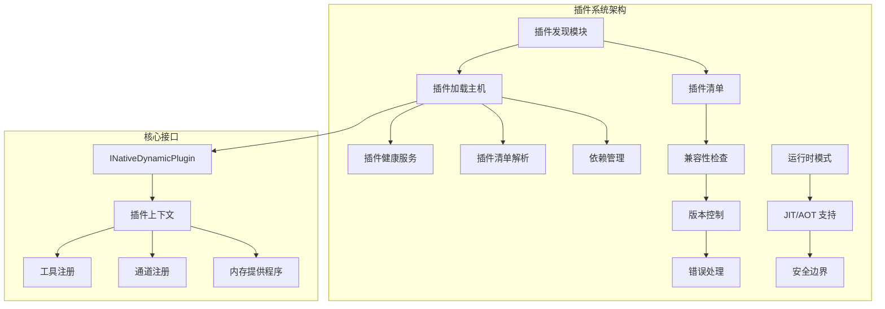
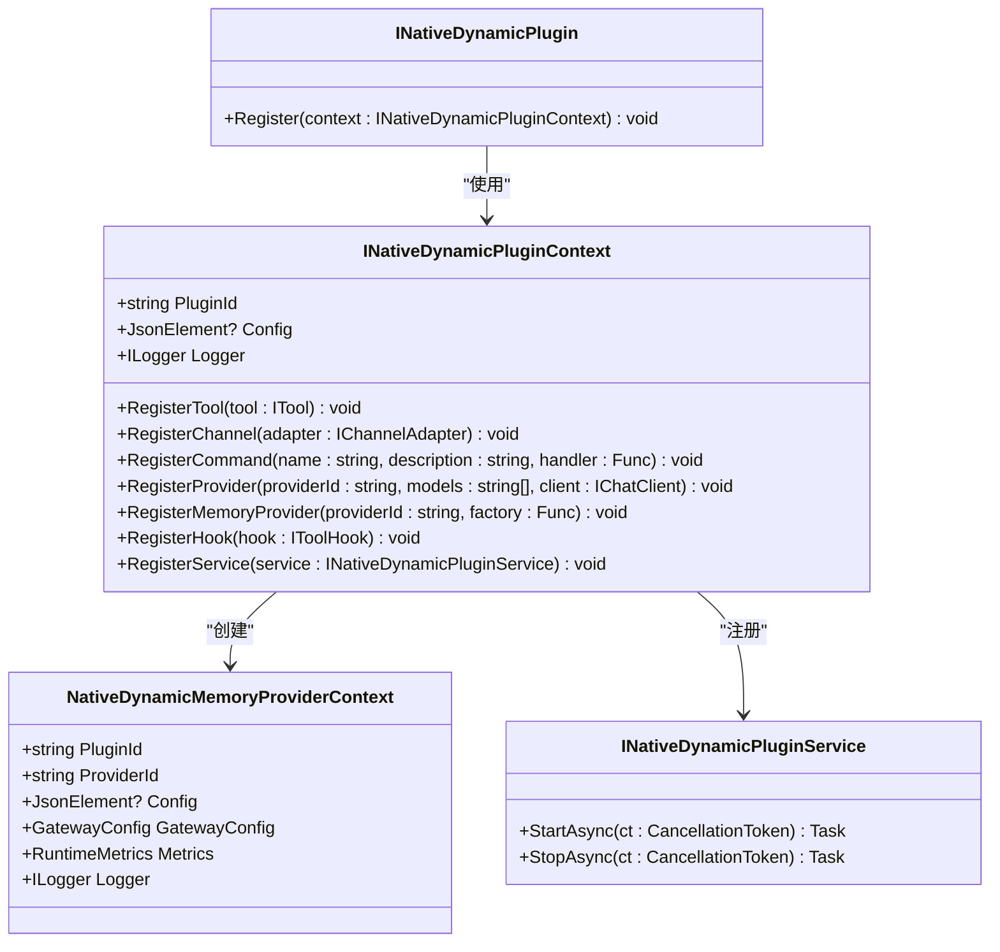
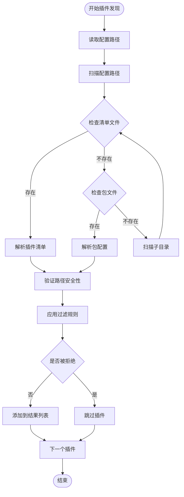
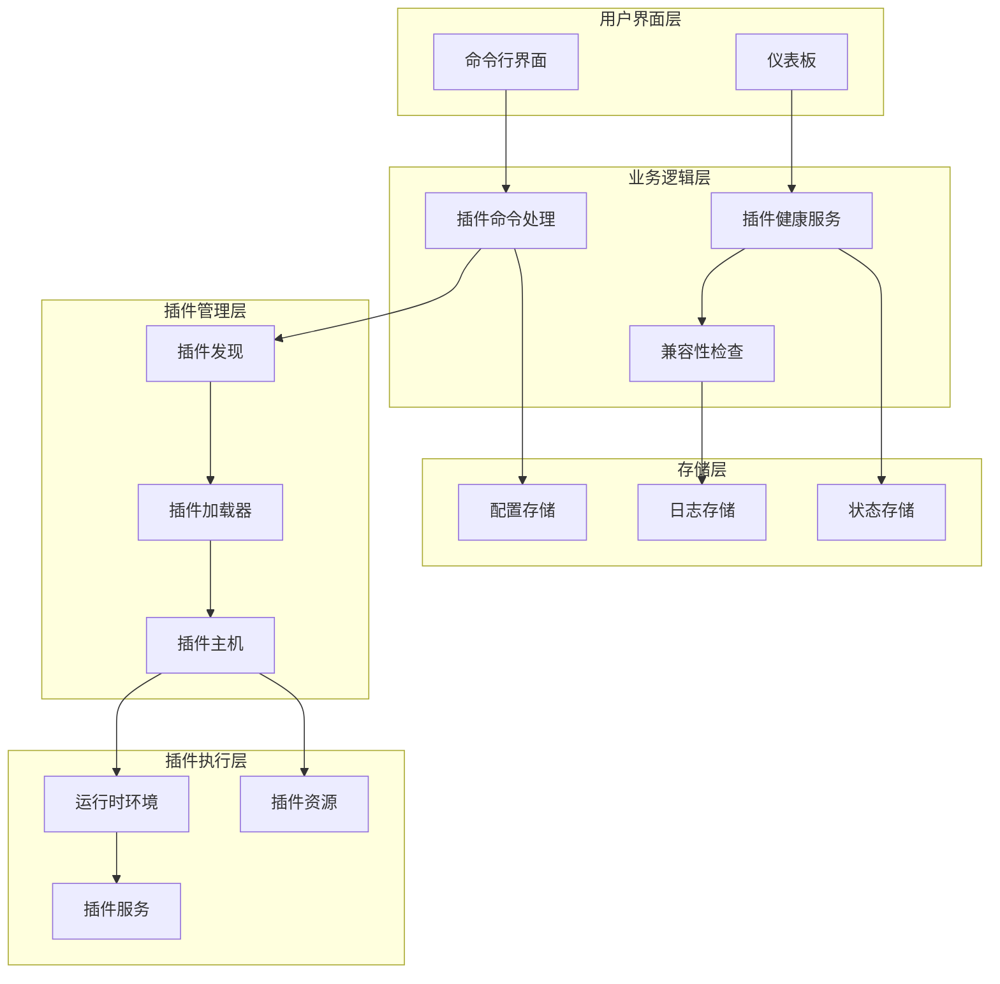
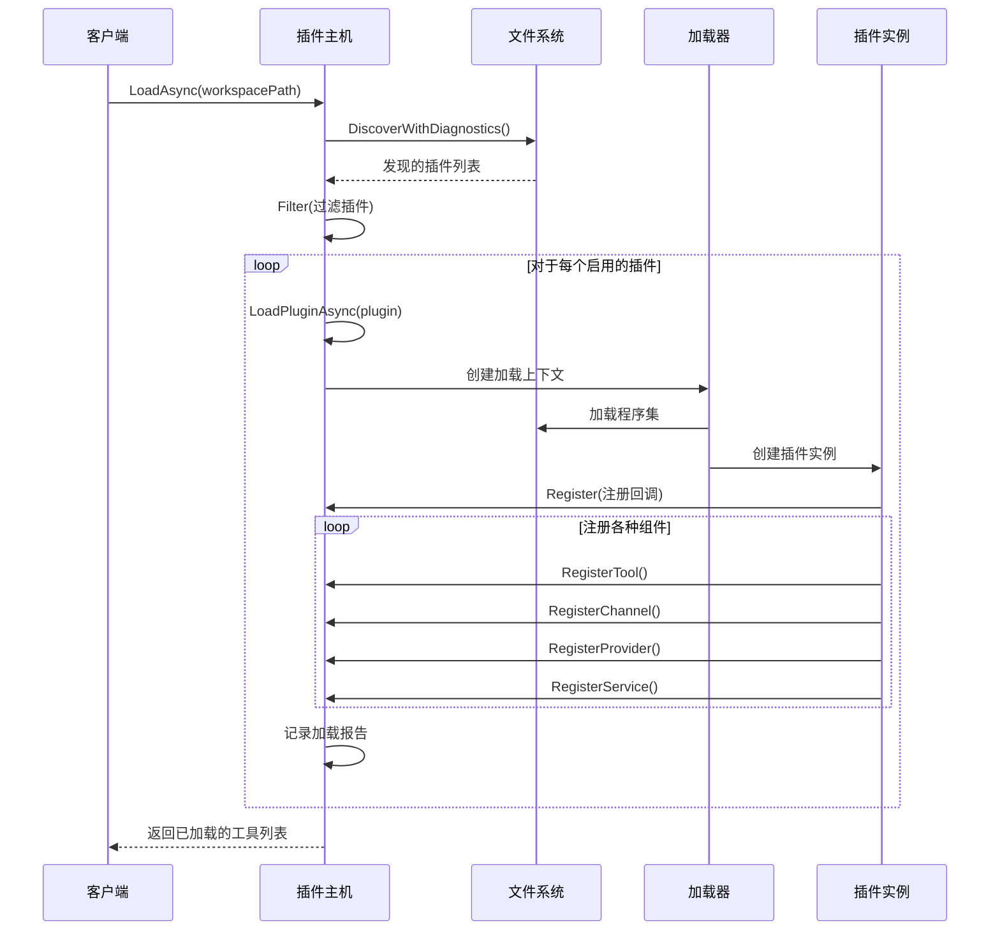
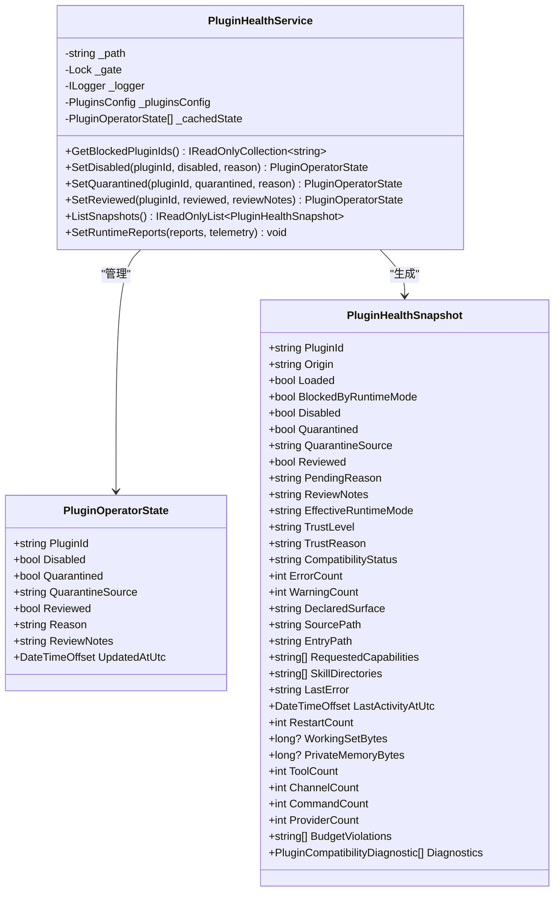
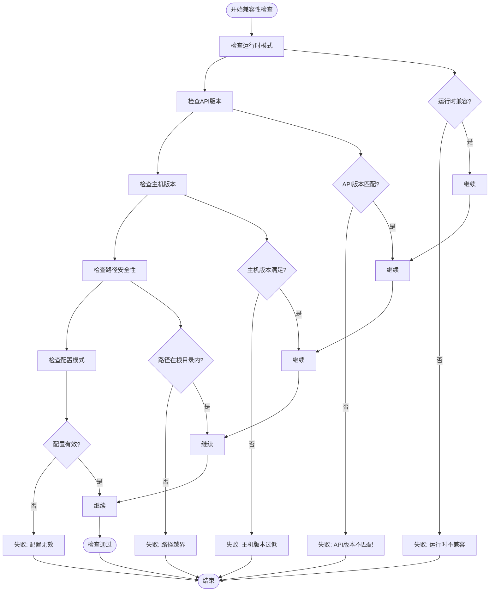
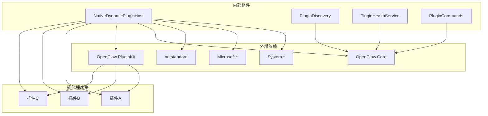
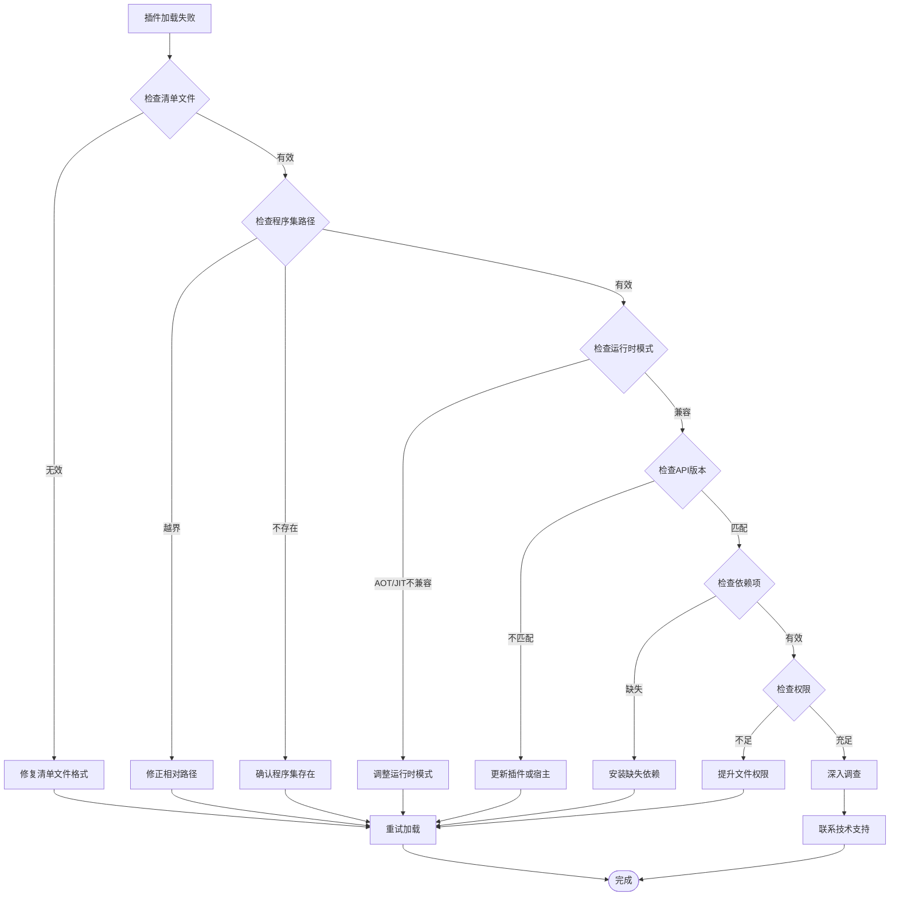

# 动态插件加载机制

<cite>
**本文档引用的文件**
- [INativeDynamicPlugin.cs](file://src/OpenClaw.PluginKit/INativeDynamicPlugin.cs)
- [NativeDynamicPluginHost.cs](file://src/OpenClaw.Agent/Plugins/NativeDynamicPluginHost.cs)
- [PluginDiscovery.cs](file://src/OpenClaw.Core/Plugins/PluginDiscovery.cs)
- [PluginHealthService.cs](file://src/OpenClaw.Gateway/PluginHealthService.cs)
- [PluginCommands.cs](file://src/OpenClaw.Cli/PluginCommands.cs)
- [PublicCompatibilityCatalog.cs](file://src/OpenClaw.Core/Compatibility/PublicCompatibilityCatalog.cs)
- [RuntimeModels.cs](file://src/OpenClaw.Core/Models/RuntimeModels.cs)
- [COMPATIBILITY.md](file://docs/COMPATIBILITY.md)
</cite>

## 目录
1. [简介](#简介)
2. [项目结构](#项目结构)
3. [核心组件](#核心组件)
4. [架构概览](#架构概览)
5. [详细组件分析](#详细组件分析)
6. [依赖关系分析](#依赖关系分析)
7. [性能考虑](#性能考虑)
8. [故障排除指南](#故障排除指南)
9. [结论](#结论)
10. [附录](#附录)

## 简介

动态插件加载机制是 OpenClaw 平台的核心功能之一，它允许在运行时动态发现、加载、初始化和卸载插件。该机制支持两种主要类型的插件：动态原生插件（Native Dynamic Plugins）和传统桥接插件（Bridge Plugins）。

动态插件系统提供了强大的扩展能力，包括工具注册、通道适配器、命令处理器、内存提供程序、工具钩子和服务等。系统通过严格的版本控制、兼容性检查和安全验证确保插件的安全性和稳定性。

## 项目结构

动态插件加载机制涉及多个关键模块，每个模块都有特定的职责：

**图表来源**
- [NativeDynamicPluginHost.cs:1-908](file://src/OpenClaw.Agent/Plugins/NativeDynamicPluginHost.cs#L1-L908)
- [INativeDynamicPlugin.cs:1-46](file://src/OpenClaw.PluginKit/INativeDynamicPlugin.cs#L1-L46)

**章节来源**
- [NativeDynamicPluginHost.cs:1-908](file://src/OpenClaw.Agent/Plugins/NativeDynamicPluginHost.cs#L1-L908)
- [INativeDynamicPlugin.cs:1-46](file://src/OpenClaw.PluginKit/INativeDynamicPlugin.cs#L1-L46)

## 核心组件

### 插件接口定义

插件系统基于清晰的接口定义，确保插件与宿主之间的松耦合：

**图表来源**
- [INativeDynamicPlugin.cs:11-46](file://src/OpenClaw.PluginKit/INativeDynamicPlugin.cs#L11-L46)

### 插件发现与过滤

插件发现模块负责扫描文件系统并识别有效的插件：

**图表来源**
- [PluginDiscovery.cs:22-105](file://src/OpenClaw.Core/Plugins/PluginDiscovery.cs#L22-L105)

**章节来源**
- [PluginDiscovery.cs:1-632](file://src/OpenClaw.Core/Plugins/PluginDiscovery.cs#L1-L632)
- [INativeDynamicPlugin.cs:1-46](file://src/OpenClaw.PluginKit/INativeDynamicPlugin.cs#L1-L46)

## 架构概览

动态插件加载机制采用分层架构设计，确保各组件职责明确且相互独立：

**图表来源**
- [PluginHealthService.cs:1-449](file://src/OpenClaw.Gateway/PluginHealthService.cs#L1-L449)
- [NativeDynamicPluginHost.cs:1-908](file://src/OpenClaw.Agent/Plugins/NativeDynamicPluginHost.cs#L1-L908)

## 详细组件分析

### 原生动态插件主机

原生动态插件主机是整个插件系统的核心组件，负责管理插件的完整生命周期：

**图表来源**
- [NativeDynamicPluginHost.cs:64-169](file://src/OpenClaw.Agent/Plugins/NativeDynamicPluginHost.cs#L64-L169)
- [NativeDynamicPluginHost.cs:210-345](file://src/OpenClaw.Agent/Plugins/NativeDynamicPluginHost.cs#L210-L345)

#### 插件加载流程详解

插件加载过程包含多个阶段的安全检查和验证：

1. **发现阶段**：扫描配置路径、工作区和全局目录
2. **过滤阶段**：应用允许/拒绝列表和启用状态
3. **兼容性检查**：验证运行时模式和API版本
4. **加载阶段**：创建隔离的程序集加载上下文
5. **注册阶段**：调用插件的 Register 方法
6. **初始化阶段**：启动插件服务

**章节来源**
- [NativeDynamicPluginHost.cs:1-908](file://src/OpenClaw.Agent/Plugins/NativeDynamicPluginHost.cs#L1-L908)

### 插件健康监控

插件健康服务提供全面的监控和管理功能：

**图表来源**
- [PluginHealthService.cs:9-449](file://src/OpenClaw.Gateway/PluginHealthService.cs#L9-L449)

**章节来源**
- [PluginHealthService.cs:1-449](file://src/OpenClaw.Gateway/PluginHealthService.cs#L1-L449)

### 兼容性检查系统

兼容性检查系统确保插件与当前运行环境的兼容性：

**图表来源**
- [NativeDynamicPluginHost.cs:700-811](file://src/OpenClaw.Agent/Plugins/NativeDynamicPluginHost.cs#L700-L811)

**章节来源**
- [NativeDynamicPluginHost.cs:700-811](file://src/OpenClaw.Agent/Plugins/NativeDynamicPluginHost.cs#L700-L811)

## 依赖关系分析

插件系统中的依赖关系复杂但有序：

**图表来源**
- [NativeDynamicPluginHost.cs:882-906](file://src/OpenClaw.Agent/Plugins/NativeDynamicPluginHost.cs#L882-L906)

### 版本控制和兼容性策略

系统采用多层版本控制策略：

1. **插件API版本控制**：确保插件与宿主的API兼容
2. **主机版本要求**：插件声明的最低主机版本
3. **插件套件版本控制**：防止不兼容的插件套件版本
4. **运行时模式兼容性**：JIT-only功能的AOT模式限制

**章节来源**
- [NativeDynamicPluginHost.cs:700-811](file://src/OpenClaw.Agent/Plugins/NativeDynamicPluginHost.cs#L700-L811)

## 性能考虑

动态插件加载机制在设计时充分考虑了性能优化：

### 内存管理
- 使用可卸载的程序集加载上下文
- 实现插件资源的及时释放
- 支持插件的热重载和卸载

### 并发处理
- 插件健康服务使用锁机制保证线程安全
- 异步加载避免阻塞主线程
- 批量操作减少系统调用开销

### 缓存策略
- 插件状态缓存减少磁盘I/O
- 兼容性检查结果缓存
- 路径解析结果缓存

## 故障排除指南

### 常见问题诊断

### 调试技巧

1. **启用详细日志**：查看插件加载过程中的详细信息
2. **使用诊断报告**：分析插件兼容性诊断信息
3. **检查路径解析**：验证插件根目录和相对路径的正确性
4. **验证运行时配置**：确认JIT/AOT模式设置正确
5. **审查依赖关系**：检查插件引用的程序集版本

**章节来源**
- [COMPATIBILITY.md:72-103](file://docs/COMPATIBILITY.md#L72-L103)

## 结论

动态插件加载机制通过精心设计的架构和严格的验证流程，为 OpenClaw 平台提供了强大而安全的扩展能力。系统不仅支持多种插件类型，还提供了完善的监控、管理和故障排除功能。

关键优势包括：
- **安全性**：严格的路径验证和运行时模式检查
- **可维护性**：清晰的接口定义和模块化设计
- **可观测性**：全面的健康监控和诊断报告
- **可扩展性**：灵活的插件注册机制和生命周期管理

该机制为开发者提供了丰富的扩展点，同时确保了系统的稳定性和安全性。

## 附录

### 配置选项参考

| 配置项 | 类型 | 默认值 | 描述 |
|--------|------|--------|------|
| Enabled | bool | false | 是否启用动态插件系统 |
| Load.Paths | string[] | [] | 插件加载路径列表 |
| Allow | string[] | [] | 允许的插件ID列表 |
| Deny | string[] | [] | 拒绝的插件ID列表 |
| Entries | Dictionary | {} | 单个插件的详细配置 |

### 性能基准

- **插件发现**：通常在几毫秒到几百毫秒之间
- **插件加载**：取决于插件大小和依赖数量
- **内存占用**：每个插件约占用几MB到几十MB
- **并发支持**：支持同时加载多个插件

### 最佳实践

1. **安全第一**：始终验证插件来源和完整性
2. **版本管理**：定期更新插件和宿主版本
3. **监控告警**：建立插件健康监控机制
4. **备份恢复**：定期备份插件配置和状态
5. **测试验证**：在生产环境部署前进行充分测试