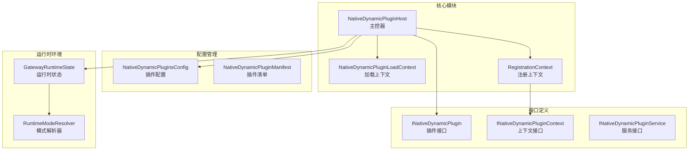
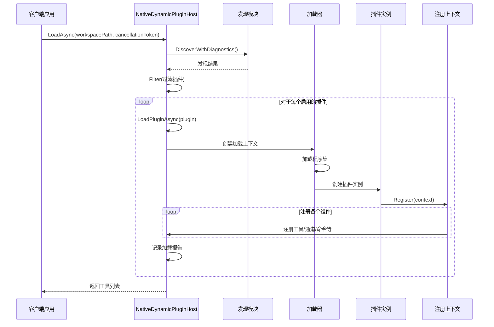
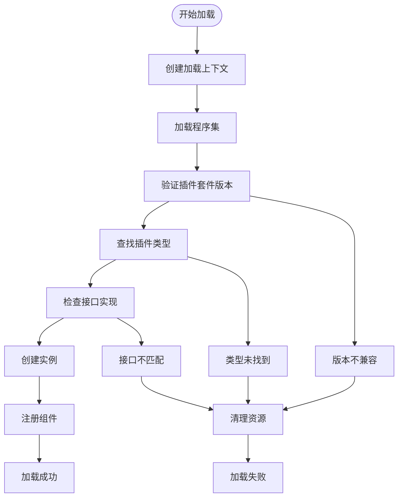
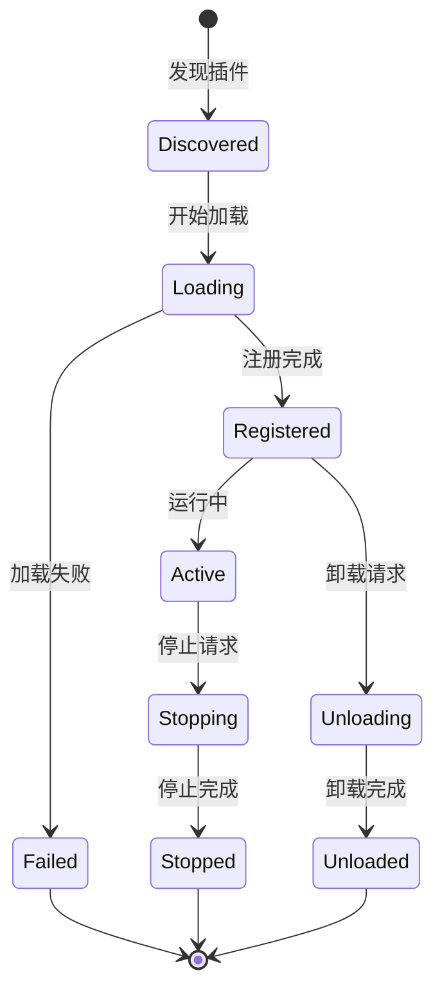
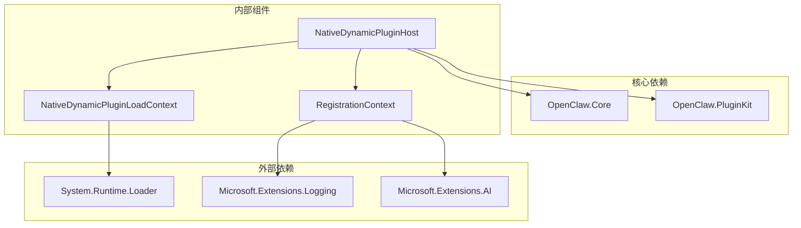
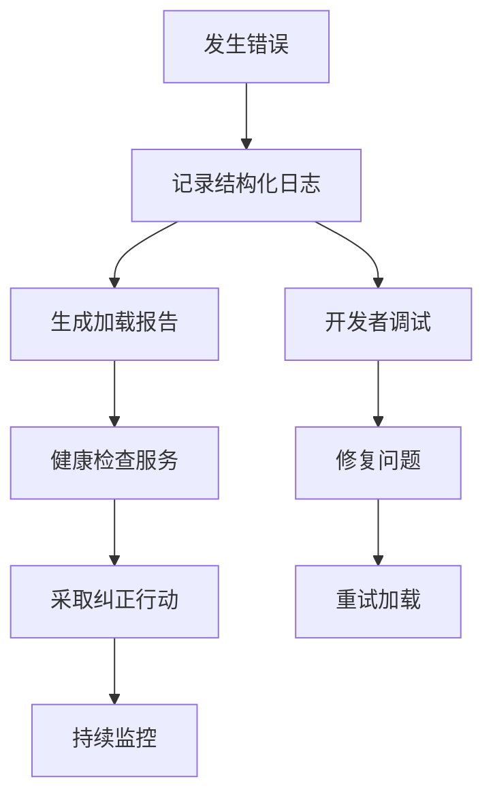

# JIT 动态加载机制

<cite>
**本文档引用的文件**
- [NativeDynamicPluginHost.cs](file://src/OpenClaw.Agent/Plugins/NativeDynamicPluginHost.cs)
- [INativeDynamicPlugin.cs](file://src/OpenClaw.PluginKit/INativeDynamicPlugin.cs)
- [NativeDynamicPluginHostTests.cs](file://src/OpenClaw.Tests/NativeDynamicPluginHostTests.cs)
- [COMPATIBILITY.md](file://docs/COMPATIBILITY.md)
- [RuntimeModels.cs](file://src/OpenClaw.Core/Models/RuntimeModels.cs)
- [PluginHealthService.cs](file://src/OpenClaw.Gateway/PluginHealthService.cs)
</cite>

## 目录
1. [简介](#简介)
2. [项目结构](#项目结构)
3. [核心组件](#核心组件)
4. [架构概览](#架构概览)
5. [详细组件分析](#详细组件分析)
6. [依赖关系分析](#依赖关系分析)
7. [性能考虑](#性能考虑)
8. [故障排除指南](#故障排除指南)
9. [结论](#结论)
10. [附录](#附录)

## 简介

JIT 动态加载机制是 OpenClaw 平台中用于在运行时动态加载和管理原生 .NET 插件的核心系统。该机制通过 `NativeDynamicPluginHost` 类实现了完整的插件生命周期管理，包括动态程序集加载、类型发现、依赖解析和资源清理。

该系统专为 JIT（Just-In-Time）运行时模式设计，提供了安全的动态代码执行能力，同时确保与 AOT（Ahead-Of-Time）模式的兼容性。通过严格的路径约束和版本兼容性检查，系统能够在保证安全性的同时提供灵活的插件扩展能力。

## 项目结构

JIT 动态加载机制主要分布在以下关键模块中：

**图表来源**
- [NativeDynamicPluginHost.cs:19-908](file://src/OpenClaw.Agent/Plugins/NativeDynamicPluginHost.cs#L19-L908)
- [INativeDynamicPlugin.cs:11-46](file://src/OpenClaw.PluginKit/INativeDynamicPlugin.cs#L11-L46)

**章节来源**
- [NativeDynamicPluginHost.cs:19-908](file://src/OpenClaw.Agent/Plugins/NativeDynamicPluginHost.cs#L19-L908)
- [INativeDynamicPlugin.cs:11-46](file://src/OpenClaw.PluginKit/INativeDynamicPlugin.cs#L11-L46)

## 核心组件

### NativeDynamicPluginHost 主控器

`NativeDynamicPluginHost` 是整个 JIT 动态加载系统的核心控制器，负责协调所有插件加载和管理操作。该类实现了 `IAsyncDisposable` 和 `IPluginRuntimeTelemetrySource` 接口，提供异步资源管理和遥测数据收集功能。

**主要职责：**
- 插件发现和验证
- 动态程序集加载
- 生命周期管理
- 资源清理和卸载
- 错误处理和诊断报告

**关键属性：**
- `Tools`: 已加载的工具集合
- `ChannelAdapters`: 通道适配器列表
- `Reports`: 加载报告集合
- `MemoryProviderRegistrations`: 内存提供者注册信息

### NativeDynamicPluginLoadContext 加载上下文

这是一个可回收的 `AssemblyLoadContext` 实现，专门用于动态加载插件程序集。该上下文具有以下特性：

- **隔离性**: 每个插件使用独立的加载上下文
- **可回收性**: 支持程序集的卸载和内存回收
- **依赖解析**: 自动解析和加载插件依赖项
- **安全边界**: 限制可访问的系统程序集

### RegistrationContext 注册上下文

插件注册上下文负责收集插件声明的所有组件和服务。它实现了 `INativeDynamicPluginContext` 接口，提供统一的注册方法：

- `RegisterTool()`: 注册工具组件
- `RegisterChannel()`: 注册通道适配器
- `RegisterCommand()`: 注册命令处理器
- `RegisterProvider()`: 注册 AI 提供者
- `RegisterMemoryProvider()`: 注册内存提供者
- `RegisterHook()`: 注册工具钩子
- `RegisterService()`: 注册后台服务

**章节来源**
- [NativeDynamicPluginHost.cs:39-62](file://src/OpenClaw.Agent/Plugins/NativeDynamicPluginHost.cs#L39-L62)
- [NativeDynamicPluginHost.cs:882-906](file://src/OpenClaw.Agent/Plugins/NativeDynamicPluginHost.cs#L882-L906)
- [INativeDynamicPlugin.cs:16-29](file://src/OpenClaw.PluginKit/INativeDynamicPlugin.cs#L16-L29)

## 架构概览

JIT 动态加载机制采用分层架构设计，确保了系统的模块化和可维护性：

**图表来源**
- [NativeDynamicPluginHost.cs:64-169](file://src/OpenClaw.Agent/Plugins/NativeDynamicPluginHost.cs#L64-L169)
- [NativeDynamicPluginHost.cs:210-345](file://src/OpenClaw.Agent/Plugins/NativeDynamicPluginHost.cs#L210-L345)

## 详细组件分析

### 动态程序集加载机制

动态程序集加载是 JIT 机制的核心功能，通过 `NativeDynamicPluginLoadContext` 实现：

**图表来源**
- [NativeDynamicPluginHost.cs:230-244](file://src/OpenClaw.Agent/Plugins/NativeDynamicPluginHost.cs#L230-L244)
- [NativeDynamicPluginHost.cs:785-811](file://src/OpenClaw.Agent/Plugins/NativeDynamicPluginHost.cs#L785-L811)

### 类型发现和验证流程

系统实现了多层验证机制来确保插件的兼容性和安全性：

1. **清单验证**: 验证 `openclaw.native-plugin.json` 清单文件的有效性
2. **路径约束**: 确保所有路径都在插件根目录内
3. **版本兼容**: 检查插件 API 版本与宿主版本的兼容性
4. **依赖解析**: 自动解析和验证插件依赖项

### 依赖解析机制

依赖解析通过 `AssemblyDependencyResolver` 实现，支持以下解析规则：

- **系统程序集**: 直接从当前应用程序域获取
- **宿主程序集**: 优先使用宿主已加载的版本
- **插件依赖**: 从插件目录解析依赖项
- **外部程序集**: 严格限制访问范围

### 生命周期管理

插件生命周期管理包括多个阶段：

**图表来源**
- [NativeDynamicPluginHost.cs:656-698](file://src/OpenClaw.Agent/Plugins/NativeDynamicPluginHost.cs#L656-L698)
- [NativeDynamicPluginHost.cs:353-370](file://src/OpenClaw.Agent/Plugins/NativeDynamicPluginHost.cs#L353-L370)

**章节来源**
- [NativeDynamicPluginHost.cs:210-345](file://src/OpenClaw.Agent/Plugins/NativeDynamicPluginHost.cs#L210-L345)
- [NativeDynamicPluginHost.cs:656-698](file://src/OpenClaw.Agent/Plugins/NativeDynamicPluginHost.cs#L656-L698)

## 依赖关系分析

JIT 动态加载机制的依赖关系体现了清晰的分层架构：

**图表来源**
- [NativeDynamicPluginHost.cs:1-14](file://src/OpenClaw.Agent/Plugins/NativeDynamicPluginHost.cs#L1-L14)
- [INativeDynamicPlugin.cs:1-8](file://src/OpenClaw.PluginKit/INativeDynamicPlugin.cs#L1-L8)

**章节来源**
- [NativeDynamicPluginHost.cs:1-14](file://src/OpenClaw.Agent/Plugins/NativeDynamicPluginHost.cs#L1-L14)
- [INativeDynamicPlugin.cs:1-8](file://src/OpenClaw.PluginKit/INativeDynamicPlugin.cs#L1-L8)

## 性能考虑

### 内存管理优化

JIT 动态加载机制采用了多项内存管理策略：

1. **程序集卸载**: 使用可回收的 `AssemblyLoadContext` 确保程序集可以被完全卸载
2. **增量加载**: 支持增量加载模式，避免重复加载相同组件
3. **资源池化**: 对常用对象进行池化管理，减少 GC 压力
4. **延迟初始化**: 插件组件按需初始化，避免不必要的资源消耗

### 并发处理优化

系统支持并发插件加载，通过以下机制保证线程安全：

- **原子操作**: 关键状态变更使用原子操作
- **锁粒度控制**: 最小化锁的持有时间
- **异步处理**: 充分利用异步 I/O 减少阻塞

### 缓存策略

为了提高性能，系统实现了多层次缓存：

- **插件清单缓存**: 缓存已验证的插件清单信息
- **类型信息缓存**: 缓存反射类型信息以避免重复解析
- **依赖图缓存**: 缓存依赖关系图以加速后续解析

## 故障排除指南

### 常见错误类型和解决方案

| 错误类型 | 触发条件 | 解决方案 |
|---------|---------|---------|
| JIT 模式要求 | AOT 模式下尝试加载动态插件 | 切换到 JIT 模式或禁用动态插件 |
| 路径越界 | 插件程序集路径超出根目录 | 修正插件路径配置 |
| 版本不兼容 | 插件 API 版本与宿主不匹配 | 更新插件或宿主版本 |
| 类型未找到 | 插件类型名称错误 | 检查插件清单中的类型定义 |
| 依赖缺失 | 插件依赖项未找到 | 安装缺失的依赖程序集 |

### 调试和诊断

系统提供了丰富的诊断信息和日志记录：

**图表来源**
- [NativeDynamicPluginHost.cs:171-188](file://src/OpenClaw.Agent/Plugins/NativeDynamicPluginHost.cs#L171-L188)
- [PluginHealthService.cs:67-436](file://src/OpenClaw.Gateway/PluginHealthService.cs#L67-L436)

**章节来源**
- [NativeDynamicPluginHost.cs:171-188](file://src/OpenClaw.Agent/Plugins/NativeDynamicPluginHost.cs#L171-L188)
- [PluginHealthService.cs:67-436](file://src/OpenClaw.Gateway/PluginHealthService.cs#L67-L436)

## 结论

JIT 动态加载机制通过精心设计的架构和严格的实现，成功地在保证安全性的同时提供了强大的插件扩展能力。该系统的关键优势包括：

1. **安全性**: 通过路径约束和版本检查确保运行时安全
2. **灵活性**: 支持多种插件类型和动态加载模式
3. **可观测性**: 完整的诊断和监控能力
4. **性能**: 优化的内存管理和并发处理机制

该机制为 OpenClaw 平台的插件生态奠定了坚实的基础，支持从简单工具到复杂 AI 服务的各种插件类型。

## 附录

### 配置选项

| 配置项 | 类型 | 默认值 | 描述 |
|-------|------|--------|------|
| Enabled | bool | false | 是否启用动态插件系统 |
| Load.Paths | string[] | [] | 插件搜索路径列表 |
| Deny | string[] | [] | 禁用的插件 ID 列表 |
| Allow | string[] | [] | 允许的插件 ID 列表 |
| Entries | Dictionary | {} | 单个插件的详细配置 |

### 性能监控指标

- **加载时间**: 插件加载的总耗时
- **内存使用**: 插件使用的内存峰值
- **错误率**: 插件加载失败的比例
- **重启次数**: 插件异常重启的频率
- **依赖解析时间**: 依赖项解析的耗时

### 安全最佳实践

1. **最小权限原则**: 为插件分配必要的最小权限
2. **定期更新**: 及时更新插件和宿主版本
3. **监控告警**: 建立完善的监控和告警机制
4. **沙箱隔离**: 在可能的情况下使用进程级隔离