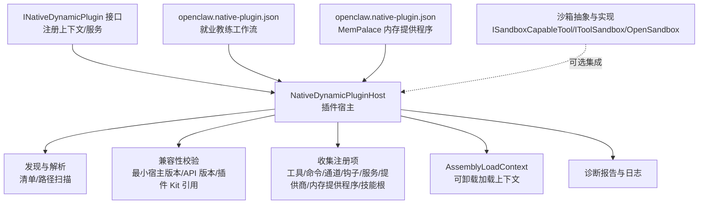
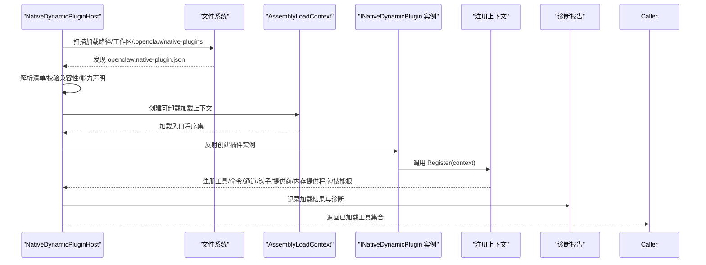
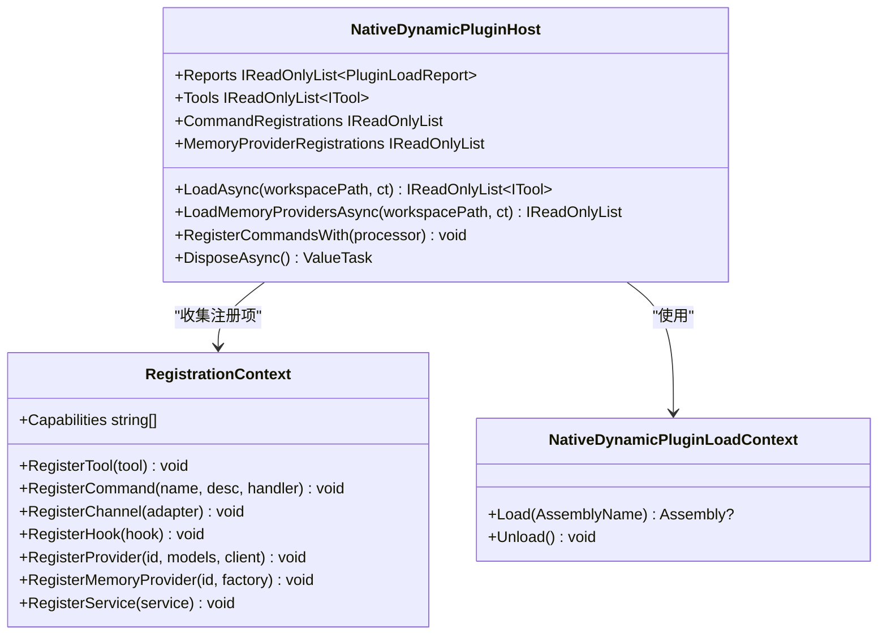
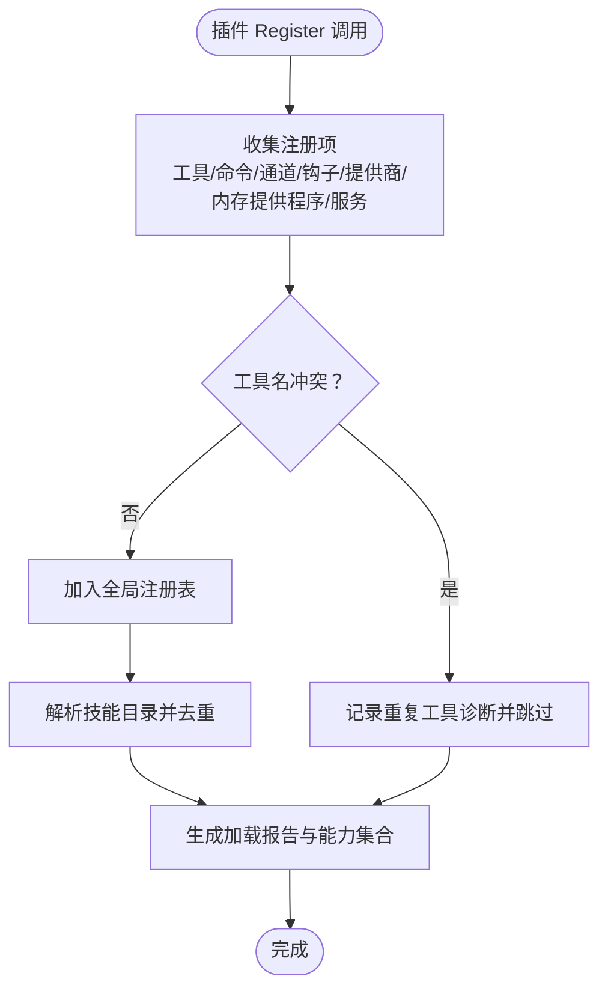
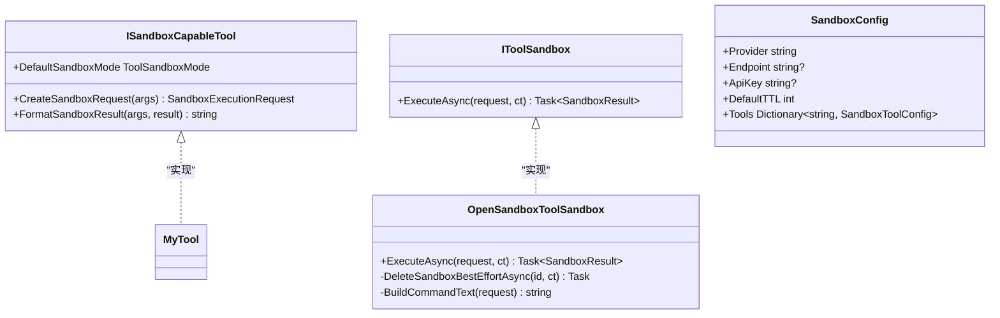
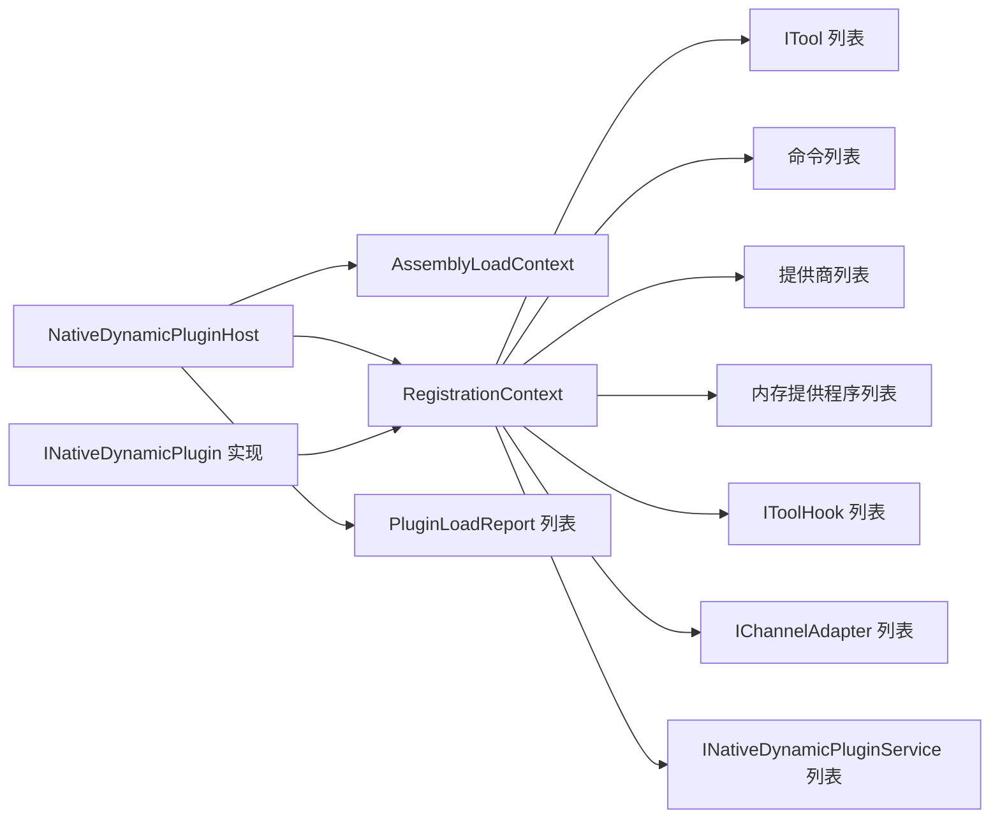

# 原生插件

<cite>
**本文引用的文件**   
- [NativeDynamicPluginHost.cs](file://src/OpenClaw.Agent/Plugins/NativeDynamicPluginHost.cs)
- [INativeDynamicPlugin.cs](file://src/OpenClaw.PluginKit/INativeDynamicPlugin.cs)
- [openclaw.native-plugin.json（就业教练工作流）](file://src/OpenClaw.Plugins.EmploymentCoachWorkflow/openclaw.native-plugin.json)
- [openclaw.native-plugin.json（MemPalace 内存提供程序）](file://src/OpenClaw.Plugins.Mempalace/openclaw.native-plugin.json)
- [NativeDynamicPluginHostTests.cs](file://src/OpenClaw.Tests/NativeDynamicPluginHostTests.cs)
- [PluginCommands.cs](file://src/OpenClaw.Cli/PluginCommands.cs)
- [ISandboxCapableTool.cs](file://src/OpenClaw.Core/Abstractions/ISandboxCapableTool.cs)
- [OpenSandboxToolSandbox.cs](file://src/OpenClawNet.Sandbox.OpenSandbox/OpenSandboxToolSandbox.cs)
- [SandboxModels.cs](file://src/OpenClaw.Core/Models/SandboxModels.cs)
- [SandboxConfig.cs](file://src/OpenClaw.Core/Models/SandboxConfig.cs)
- [IToolSandbox.cs](file://src/OpenClaw.Core/Abstractions/IToolSandbox.cs)
- [README.md（就业教练工作流插件）](file://src/OpenClaw.Plugins.EmploymentCoachWorkflow/README.md)
</cite>

## 目录
1. [简介](#简介)
2. [项目结构](#项目结构)
3. [核心组件](#核心组件)
4. [架构总览](#架构总览)
5. [详细组件分析](#详细组件分析)
6. [依赖关系分析](#依赖关系分析)
7. [性能考虑](#性能考虑)
8. [故障排查指南](#故障排查指南)
9. [结论](#结论)
10. [附录](#附录)

## 简介
本文件面向原生插件系统，聚焦于 .NET 原生插件的即时编译（JIT）动态加载机制、NativeDynamicPluginHost 的实现原理与性能优化策略，以及插件接口规范、能力声明机制、工具实现模式与安全沙箱隔离。文档同时覆盖原生插件的开发框架、编译流程、依赖管理与版本兼容性处理，并提供开发示例、调试方法与性能调优建议。

## 项目结构
原生插件系统由以下关键模块组成：
- 插件宿主：负责发现、校验、加载与卸载原生插件，维护生命周期与注册项。
- 插件接口：定义插件注册上下文与能力声明，约束插件实现。
- 插件清单：以 JSON 形式描述插件元数据、入口类型、能力与技能目录等。
- 沙箱集成：为工具执行提供可选的安全隔离与资源控制。
- CLI 工具：辅助插件打包与运行环境准备（如 Node 生态的 jiti 支持）。

图示来源
- [NativeDynamicPluginHost.cs:1-908](file://src/OpenClaw.Agent/Plugins/NativeDynamicPluginHost.cs#L1-L908)
- [INativeDynamicPlugin.cs:1-46](file://src/OpenClaw.PluginKit/INativeDynamicPlugin.cs#L1-L46)
- [openclaw.native-plugin.json（就业教练工作流）:1-11](file://src/OpenClaw.Plugins.EmploymentCoachWorkflow/openclaw.native-plugin.json#L1-L11)
- [openclaw.native-plugin.json（MemPalace 内存提供程序）:1-10](file://src/OpenClaw.Plugins.Mempalace/openclaw.native-plugin.json#L1-L10)
- [ISandboxCapableTool.cs:1-13](file://src/OpenClaw.Core/Abstractions/ISandboxCapableTool.cs#L1-L13)
- [IToolSandbox.cs:1-11](file://src/OpenClaw.Core/Abstractions/IToolSandbox.cs#L1-L11)
- [OpenSandboxToolSandbox.cs:354-386](file://src/OpenClawNet.Sandbox.OpenSandbox/OpenSandboxToolSandbox.cs#L354-L386)

章节来源
- [NativeDynamicPluginHost.cs:1-908](file://src/OpenClaw.Agent/Plugins/NativeDynamicPluginHost.cs#L1-L908)
- [INativeDynamicPlugin.cs:1-46](file://src/OpenClaw.PluginKit/INativeDynamicPlugin.cs#L1-L46)
- [openclaw.native-plugin.json（就业教练工作流）:1-11](file://src/OpenClaw.Plugins.EmploymentCoachWorkflow/openclaw.native-plugin.json#L1-L11)
- [openclaw.native-plugin.json（MemPalace 内存提供程序）:1-10](file://src/OpenClaw.Plugins.Mempalace/openclaw.native-plugin.json#L1-L10)

## 核心组件
- NativeDynamicPluginHost：原生插件宿主，负责发现、过滤、校验、加载与卸载插件；维护工具、命令、通道适配器、钩子、提供商、内存提供程序与技能根目录等注册项；生成结构化诊断报告；在 JIT 模式下运行，AOT 模式下拒绝动态加载。
- INativeDynamicPlugin 与注册上下文：定义插件注册接口与上下文，插件通过上下文注册各类能力与服务。
- 清单与能力声明：通过 openclaw.native-plugin.json 声明插件 ID、名称、版本、入口程序集与类型、能力列表、技能目录与仅 JIT 标记等。
- AssemblyLoadContext：可卸载的加载上下文，确保插件加载与卸载时的内存与资源回收。
- 沙箱能力：ISandboxCapableTool/IToolSandbox/OpenSandbox 实现为工具执行提供可选的安全隔离与资源控制。

章节来源
- [NativeDynamicPluginHost.cs:19-63](file://src/OpenClaw.Agent/Plugins/NativeDynamicPluginHost.cs#L19-L63)
- [INativeDynamicPlugin.cs:11-46](file://src/OpenClaw.PluginKit/INativeDynamicPlugin.cs#L11-L46)
- [openclaw.native-plugin.json（就业教练工作流）:1-11](file://src/OpenClaw.Plugins.EmploymentCoachWorkflow/openclaw.native-plugin.json#L1-L11)
- [openclaw.native-plugin.json（MemPalace 内存提供程序）:1-10](file://src/OpenClaw.Plugins.Mempalace/openclaw.native-plugin.json#L1-L10)
- [ISandboxCapableTool.cs:1-13](file://src/OpenClaw.Core/Abstractions/ISandboxCapableTool.cs#L1-L13)
- [IToolSandbox.cs:1-11](file://src/OpenClaw.Core/Abstractions/IToolSandbox.cs#L1-L11)
- [OpenSandboxToolSandbox.cs:354-386](file://src/OpenClawNet.Sandbox.OpenSandbox/OpenSandboxToolSandbox.cs#L354-L386)

## 架构总览
原生插件系统采用“清单驱动 + 注册上下文 + 可卸载加载”的架构，确保在 JIT 运行时动态加载原生 .NET 插件，同时在 AOT 模式下进行严格限制与诊断提示。

图示来源
- [NativeDynamicPluginHost.cs:64-169](file://src/OpenClaw.Agent/Plugins/NativeDynamicPluginHost.cs#L64-L169)
- [NativeDynamicPluginHost.cs:210-345](file://src/OpenClaw.Agent/Plugins/NativeDynamicPluginHost.cs#L210-L345)
- [INativeDynamicPlugin.cs:13](file://src/OpenClaw.PluginKit/INativeDynamicPlugin.cs#L13)

## 详细组件分析

### NativeDynamicPluginHost：JIT 动态加载与能力管理
- 发现与过滤
  - 支持从多个路径扫描清单，支持工作区与用户目录下的默认路径。
  - 过滤逻辑基于允许/拒绝列表与条目级启用状态。
- 兼容性校验
  - 最小宿主版本与插件 API 版本校验，确保主从版本兼容。
  - 插件对 OpenClaw.PluginKit 的引用版本校验，避免跨主版本不兼容。
- 运行时模式限制
  - 在 AOT 模式下直接拒绝动态加载，生成明确的诊断与报告。
- 加载与注册
  - 使用可卸载的 AssemblyLoadContext 加载插件程序集。
  - 通过反射创建插件实例并调用 Register，收集工具、命令、通道、钩子、提供商、内存提供程序与技能根目录。
  - 对重复工具名等冲突进行诊断与跳过。
- 卸载与清理
  - 有序停止服务、卸载程序集、释放资源，保证宿主稳定性。

图示来源
- [NativeDynamicPluginHost.cs:19-63](file://src/OpenClaw.Agent/Plugins/NativeDynamicPluginHost.cs#L19-L63)
- [NativeDynamicPluginHost.cs:819-874](file://src/OpenClaw.Agent/Plugins/NativeDynamicPluginHost.cs#L819-L874)
- [NativeDynamicPluginHost.cs:882-906](file://src/OpenClaw.Agent/Plugins/NativeDynamicPluginHost.cs#L882-L906)

章节来源
- [NativeDynamicPluginHost.cs:64-169](file://src/OpenClaw.Agent/Plugins/NativeDynamicPluginHost.cs#L64-L169)
- [NativeDynamicPluginHost.cs:210-345](file://src/OpenClaw.Agent/Plugins/NativeDynamicPluginHost.cs#L210-L345)
- [NativeDynamicPluginHost.cs:451-467](file://src/OpenClaw.Agent/Plugins/NativeDynamicPluginHost.cs#L451-L467)
- [NativeDynamicPluginHost.cs:507-649](file://src/OpenClaw.Agent/Plugins/NativeDynamicPluginHost.cs#L507-L649)
- [NativeDynamicPluginHost.cs:700-811](file://src/OpenClaw.Agent/Plugins/NativeDynamicPluginHost.cs#L700-L811)

### 插件接口规范与能力声明机制
- INativeDynamicPlugin：插件必须实现的注册入口，接收注册上下文。
- 注册上下文能力：
  - 工具、命令、通道适配器、钩子、提供商、内存提供程序、服务等。
  - 能力声明自动从注册行为推导，如注册工具即声明“工具”能力。
- 清单能力与技能：
  - 清单中显式声明 capabilities 与 skills 数组，宿主据此生成最终能力集合。
  - 报告中记录请求能力与实际加载能力，便于诊断。

图示来源
- [INativeDynamicPlugin.cs:16-29](file://src/OpenClaw.PluginKit/INativeDynamicPlugin.cs#L16-L29)
- [NativeDynamicPluginHost.cs:252-286](file://src/OpenClaw.Agent/Plugins/NativeDynamicPluginHost.cs#L252-L286)
- [NativeDynamicPluginHost.cs:398-449](file://src/OpenClaw.Agent/Plugins/NativeDynamicPluginHost.cs#L398-L449)

章节来源
- [INativeDynamicPlugin.cs:11-46](file://src/OpenClaw.PluginKit/INativeDynamicPlugin.cs#L11-L46)
- [NativeDynamicPluginHost.cs:252-304](file://src/OpenClaw.Agent/Plugins/NativeDynamicPluginHost.cs#L252-L304)
- [NativeDynamicPluginHost.cs:438-449](file://src/OpenClaw.Agent/Plugins/NativeDynamicPluginHost.cs#L438-L449)

### 安全沙箱隔离与工具实现模式
- ISandboxCapableTool：工具可声明默认沙箱模式（关闭/优先/强制），并提供沙箱请求构造与结果格式化。
- IToolSandbox：抽象沙箱执行接口，统一工具在沙箱中的执行方式。
- OpenSandbox 集成：通过 HTTP 客户端与远端沙箱服务交互，支持租期、模板与 TTL 等配置。
- SandboxConfig：集中管理沙箱提供者、端点、密钥、默认 TTL 与按工具的覆盖配置。

图示来源
- [ISandboxCapableTool.cs:1-13](file://src/OpenClaw.Core/Abstractions/ISandboxCapableTool.cs#L1-L13)
- [IToolSandbox.cs:1-11](file://src/OpenClaw.Core/Abstractions/IToolSandbox.cs#L1-L11)
- [OpenSandboxToolSandbox.cs:354-386](file://src/OpenClawNet.Sandbox.OpenSandbox/OpenSandboxToolSandbox.cs#L354-L386)
- [SandboxConfig.cs:1-47](file://src/OpenClaw.Core/Models/SandboxConfig.cs#L1-L47)

章节来源
- [ISandboxCapableTool.cs:1-13](file://src/OpenClaw.Core/Abstractions/ISandboxCapableTool.cs#L1-L13)
- [IToolSandbox.cs:1-11](file://src/OpenClaw.Core/Abstractions/IToolSandbox.cs#L1-L11)
- [OpenSandboxToolSandbox.cs:354-386](file://src/OpenClawNet.Sandbox.OpenSandbox/OpenSandboxToolSandbox.cs#L354-L386)
- [SandboxConfig.cs:1-47](file://src/OpenClaw.Core/Models/SandboxConfig.cs#L1-L47)

### 开发框架、编译流程与依赖管理
- 清单与入口
  - 插件以 openclaw.native-plugin.json 描述元数据与入口类型，支持相对路径与技能目录声明。
- 编译与打包
  - 将插件项目构建产物输出到插件目录，确保清单与程序集在同一目录或相对路径正确。
  - 参考就业教练工作流插件的 README，说明如何构建与配置加载路径。
- 依赖管理
  - 插件需引用与宿主兼容的 OpenClaw.PluginKit 版本，主版本一致方可加载。
  - 运行时仅允许加载到宿主域内的受控程序集，其他依赖通过依赖解析器定位。

章节来源
- [openclaw.native-plugin.json（就业教练工作流）:1-11](file://src/OpenClaw.Plugins.EmploymentCoachWorkflow/openclaw.native-plugin.json#L1-L11)
- [openclaw.native-plugin.json（MemPalace 内存提供程序）:1-10](file://src/OpenClaw.Plugins.Mempalace/openclaw.native-plugin.json#L1-L10)
- [README.md（就业教练工作流插件）:13-42](file://src/OpenClaw.Plugins.EmploymentCoachWorkflow/README.md#L13-L42)
- [NativeDynamicPluginHost.cs:785-811](file://src/OpenClaw.Agent/Plugins/NativeDynamicPluginHost.cs#L785-L811)

### 版本兼容性处理
- 最小宿主版本：插件可声明 MinHostVersion，宿主版本低于要求则拒绝加载并记录诊断。
- 插件 API 版本：插件清单可声明 PluginApiVersion，主从主版本不一致则拒绝加载。
- 插件 Kit 版本：检查插件对 OpenClaw.PluginKit 的引用主版本，防止跨主版本不兼容。

章节来源
- [NativeDynamicPluginHost.cs:700-811](file://src/OpenClaw.Agent/Plugins/NativeDynamicPluginHost.cs#L700-L811)

### 性能优化策略
- 可卸载加载上下文：插件卸载后释放内存与句柄，降低长期运行的内存压力。
- 结构化诊断与日志：通过报告与结构化日志快速定位问题，减少无效重试与回退成本。
- 能力与注册去重：避免重复工具名与重复技能根目录，减少后续处理开销。
- AOT 拒绝：在 AOT 模式下提前拒绝动态加载，避免 JIT 失败带来的额外开销。

章节来源
- [NativeDynamicPluginHost.cs:656-698](file://src/OpenClaw.Agent/Plugins/NativeDynamicPluginHost.cs#L656-L698)
- [NativeDynamicPluginHost.cs:171-188](file://src/OpenClaw.Agent/Plugins/NativeDynamicPluginHost.cs#L171-L188)
- [NativeDynamicPluginHost.cs:254-267](file://src/OpenClaw.Agent/Plugins/NativeDynamicPluginHost.cs#L254-L267)
- [NativeDynamicPluginHost.cs:281-283](file://src/OpenClaw.Agent/Plugins/NativeDynamicPluginHost.cs#L281-L283)

## 依赖关系分析
- 组件耦合
  - NativeDynamicPluginHost 与 AssemblyLoadContext、注册上下文强耦合，但通过接口与清单解耦插件实现。
  - 插件通过 INativeDynamicPlugin 与注册上下文对接，避免直接依赖宿主内部细节。
- 外部依赖
  - 运行时仅加载受控系统程序集与宿主域内程序集，其他依赖通过依赖解析器定位。
- 循环依赖
  - 未见循环依赖迹象；宿主负责单向收集与注册。

图示来源
- [NativeDynamicPluginHost.cs:19-63](file://src/OpenClaw.Agent/Plugins/NativeDynamicPluginHost.cs#L19-L63)
- [NativeDynamicPluginHost.cs:819-874](file://src/OpenClaw.Agent/Plugins/NativeDynamicPluginHost.cs#L819-L874)
- [INativeDynamicPlugin.cs:11-46](file://src/OpenClaw.PluginKit/INativeDynamicPlugin.cs#L11-L46)

章节来源
- [NativeDynamicPluginHost.cs:19-63](file://src/OpenClaw.Agent/Plugins/NativeDynamicPluginHost.cs#L19-L63)
- [NativeDynamicPluginHost.cs:819-874](file://src/OpenClaw.Agent/Plugins/NativeDynamicPluginHost.cs#L819-L874)

## 性能考虑
- JIT 与 AOT 的选择：原生插件仅在 JIT 模式下加载，AOT 模式下直接拒绝，避免运行时失败与回退成本。
- 加载上下文回收：卸载时释放程序集与服务，降低长期运行的内存占用。
- 并发与取消：加载过程支持取消令牌，避免长时间阻塞。
- 诊断与日志：结构化诊断有助于快速定位瓶颈，减少无效尝试。

## 故障排查指南
- AOT 模式加载失败
  - 现象：抛出异常并报告需要 JIT 模式。
  - 处理：切换到 JIT 模式或移除原生插件配置。
  - 参考：测试用例验证 AOT 拒绝行为与报告内容。
- 程序集路径越界
  - 现象：诊断代码 assembly_outside_root，拒绝加载。
  - 处理：确保 assemblyPath 在插件根目录内或使用相对路径。
- 重复工具名
  - 现象：警告重复工具名并跳过注册。
  - 处理：修改插件工具名或避免重复注册。
- 技能目录越界
  - 现象：诊断 skill_dir_outside_root，记录错误。
  - 处理：确保 skills 目录位于插件根目录内。
- 插件 Kit 主版本不匹配
  - 现象：诊断 pluginkit_major_version_mismatch，拒绝加载。
  - 处理：升级/降级插件以匹配宿主主版本。

章节来源
- [NativeDynamicPluginHostTests.cs:95-123](file://src/OpenClaw.Tests/NativeDynamicPluginHostTests.cs#L95-L123)
- [NativeDynamicPluginHostTests.cs:161-193](file://src/OpenClaw.Tests/NativeDynamicPluginHostTests.cs#L161-L193)
- [NativeDynamicPluginHost.cs:112-124](file://src/OpenClaw.Agent/Plugins/NativeDynamicPluginHost.cs#L112-L124)
- [NativeDynamicPluginHost.cs:581-602](file://src/OpenClaw.Agent/Plugins/NativeDynamicPluginHost.cs#L581-L602)
- [NativeDynamicPluginHost.cs:408-430](file://src/OpenClaw.Agent/Plugins/NativeDynamicPluginHost.cs#L408-L430)
- [NativeDynamicPluginHost.cs:800-808](file://src/OpenClaw.Agent/Plugins/NativeDynamicPluginHost.cs#L800-L808)

## 结论
原生插件系统通过清单驱动、注册上下文与可卸载加载上下文，实现了在 JIT 模式下的高效、可控与可回收的原生插件加载。配合能力声明、结构化诊断与沙箱抽象，系统在功能扩展、安全性与性能之间取得平衡。AOT 模式下的严格限制进一步保障了生产环境的稳定性。

## 附录
- 开发示例
  - 就业教练工作流插件：展示如何打包技能与配置加载路径。
  - MemPalace 内存提供程序：展示如何注册内存提供程序。
- 调试方法
  - 查看 Reports 中的诊断代码与消息，结合结构化日志定位问题。
  - 使用测试用例中的断言与场景作为参考。
- 性能调优
  - 合理拆分插件，减少一次性加载数量。
  - 使用可选沙箱模式，按需启用 OpenSandbox 以隔离高风险工具。

章节来源
- [README.md（就业教练工作流插件）:13-42](file://src/OpenClaw.Plugins.EmploymentCoachWorkflow/README.md#L13-L42)
- [openclaw.native-plugin.json（就业教练工作流）:1-11](file://src/OpenClaw.Plugins.EmploymentCoachWorkflow/openclaw.native-plugin.json#L1-L11)
- [openclaw.native-plugin.json（MemPalace 内存提供程序）:1-10](file://src/OpenClaw.Plugins.Mempalace/openclaw.native-plugin.json#L1-L10)
- [NativeDynamicPluginHostTests.cs:71-92](file://src/OpenClaw.Tests/NativeDynamicPluginHostTests.cs#L71-L92)