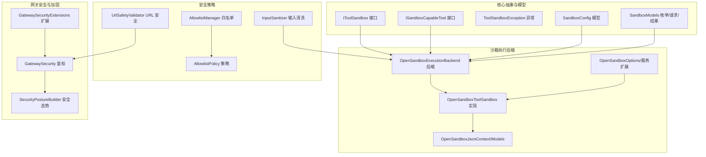
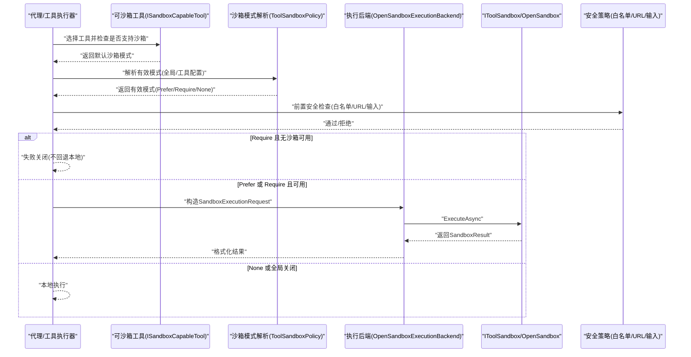
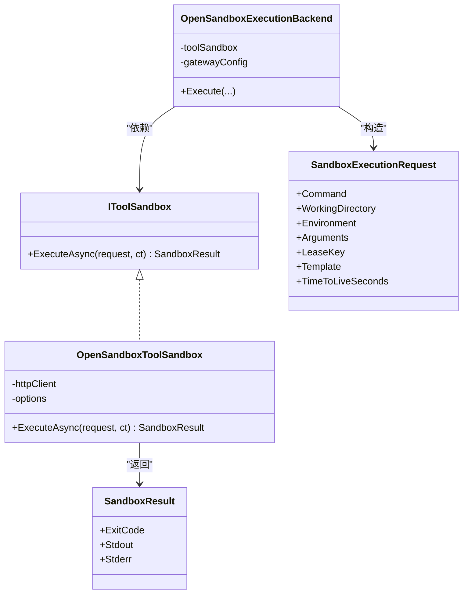
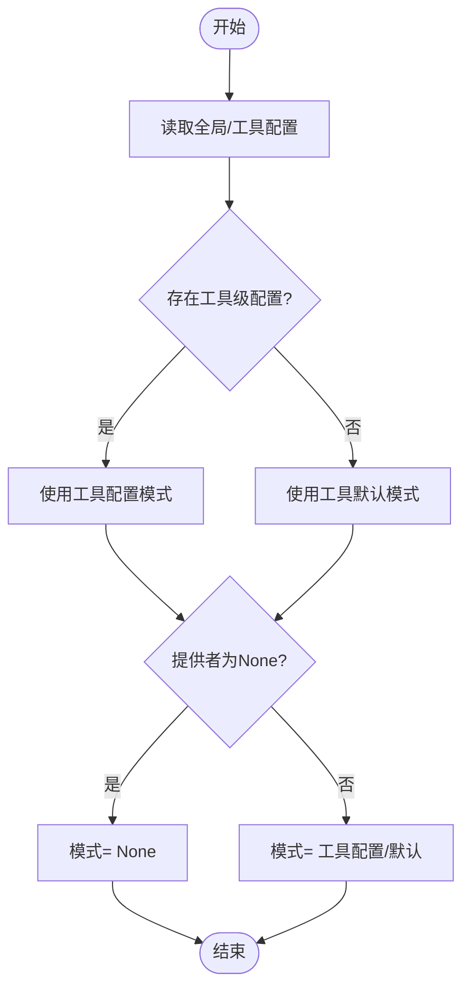
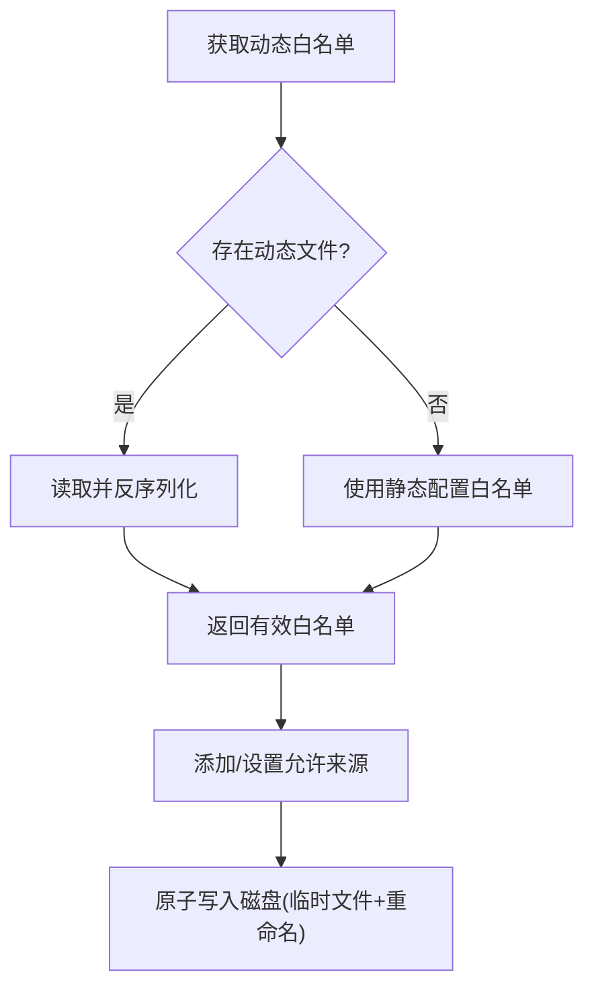
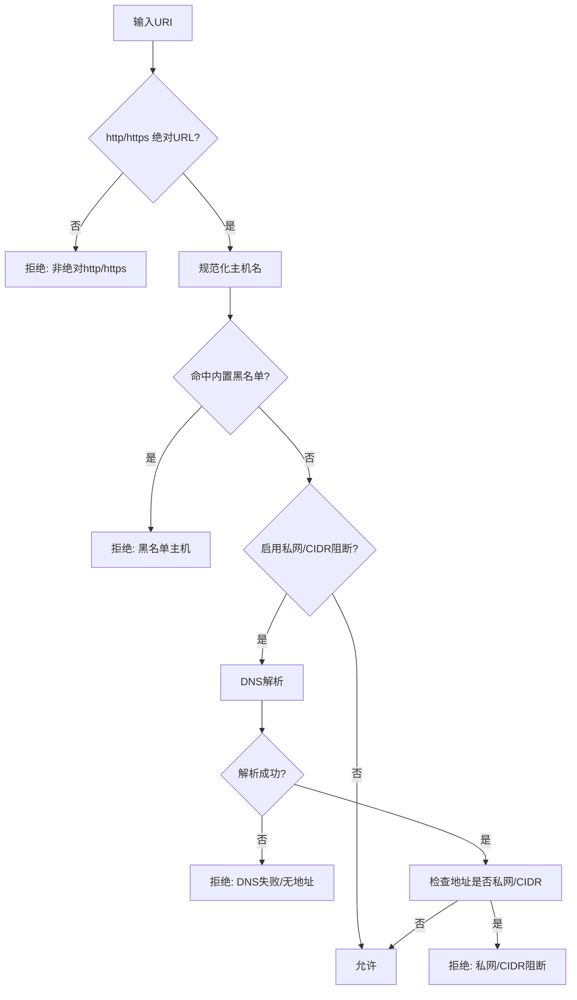
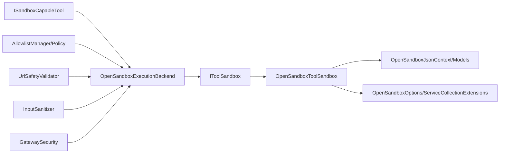

# 安全隔离机制

<cite>
**本文引用的文件**
- [sandboxing.md](file://docs/sandboxing.md)
- [IToolSandbox.cs](file://src/OpenClaw.Core/Abstractions/IToolSandbox.cs)
- [ISandboxCapableTool.cs](file://src/OpenClaw.Core/Abstractions/ISandboxCapableTool.cs)
- [ToolSandboxException.cs](file://src/OpenClaw.Core/Abstractions/ToolSandboxException.cs)
- [SandboxConfig.cs](file://src/OpenClaw.Core/Models/SandboxConfig.cs)
- [SandboxModels.cs](file://src/OpenClaw.Core/Models/SandboxModels.cs)
- [OpenSandboxExecutionBackend.cs](file://src/OpenClaw.Agent/Execution/OpenSandboxExecutionBackend.cs)
- [OpenSandboxToolSandbox.cs](file://src/OpenClawNet.Sandbox.OpenSandbox/OpenSandboxToolSandbox.cs)
- [OpenSandboxJsonContext.cs](file://src/OpenClawNet.Sandbox.OpenSandbox/OpenSandboxJsonContext.cs)
- [OpenSandboxJsonModels.cs](file://src/OpenClawNet.Sandbox.OpenSandbox/OpenSandboxJsonModels.cs)
- [OpenSandboxOptions.cs](file://src/OpenClawNet.Sandbox.OpenSandbox/OpenSandboxOptions.cs)
- [OpenSandboxServiceCollectionExtensions.cs](file://src/OpenClawNet.Sandbox.OpenSandbox/OpenSandboxServiceCollectionExtensions.cs)
- [AllowlistManager.cs](file://src/OpenClaw.Core\Security\AllowlistManager.cs)
- [AllowlistPolicy.cs](file://src/OpenClaw.Core\Security\AllowlistPolicy.cs)
- [UrlSafetyValidator.cs](file://src/OpenClaw.Core\Security\UrlSafetyValidator.cs)
- [InputSanitizer.cs](file://src/OpenClaw.Core\Security\InputSanitizer.cs)
- [GatewaySecurity.cs](file://src/OpenClaw.Gateway\GatewaySecurity.cs)
- [SecurityPostureBuilder.cs](file://src/OpenClaw.Gateway\SecurityPostureBuilder.cs)
- [GatewaySecurityExtensions.cs](file://src/OpenClaw.Gateway\Extensions\GatewaySecurityExtensions.cs)
- [GatewaySecurityHardeningTests.cs](file://src/OpenClaw.Tests\GatewaySecurityHardeningTests.cs)
- [OpenSandboxToolSandboxTests.cs](file://src/OpenClaw.Tests\OpenSandboxToolSandboxTests.cs)
- [SandboxToolContractTests.cs](file://src/OpenClaw.Tests\SandboxToolContractTests.cs)
- [build-opensandbox-image.ps1](file://scripts/build-opensandbox-image.ps1)
</cite>

## 目录
1. [引言](#引言)
2. [项目结构](#项目结构)
3. [核心组件](#核心组件)
4. [架构总览](#架构总览)
5. [详细组件分析](#详细组件分析)
6. [依赖关系分析](#依赖关系分析)
7. [性能考量](#性能考量)
8. [故障排查指南](#故障排查指南)
9. [结论](#结论)
10. [附录](#附录)

## 引言
本文件面向原生插件安全隔离机制，系统阐述插件沙箱的实现原理、权限边界控制与资源访问限制，以及插件与宿主应用在进程、内存与网络层面的隔离策略。文档覆盖安全策略配置、白名单管理、URL 安全验证与输入验证机制，并提供安全审计日志、异常处理与故障恢复的实现细节，最后给出安全漏洞防护、渗透测试方法与合规建议。

## 项目结构
围绕“安全隔离”主题，相关代码主要分布在以下模块：
- 核心抽象与模型：定义沙箱接口、工具沙箱模式、执行请求与结果等
- 沙箱执行后端：对接外部 OpenSandbox 提供的远程容器执行能力
- 安全策略：白名单、URL 安全验证、输入清洗与网关认证鉴权
- 网关安全与加固：绑定地址分类、令牌校验、HMAC 校验、安全态势构建
- 文档与脚本：沙箱化运行说明、镜像构建脚本

图表来源
- [IToolSandbox.cs:1-12](file://src/OpenClaw.Core/Abstractions/IToolSandbox.cs#L1-L12)
- [ISandboxCapableTool.cs:1-14](file://src/OpenClaw.Core/Abstractions/ISandboxCapableTool.cs#L1-L14)
- [ToolSandboxException.cs:1-29](file://src/OpenClaw.Core/Abstractions/ToolSandboxException.cs#L1-L29)
- [SandboxConfig.cs:1-168](file://src/OpenClaw.Core/Models/SandboxConfig.cs#L1-L168)
- [SandboxModels.cs:1-28](file://src/OpenClaw.Core/Models/SandboxModels.cs#L1-L28)
- [OpenSandboxExecutionBackend.cs](file://src/OpenClaw.Agent/Execution/OpenSandboxExecutionBackend.cs)
- [OpenSandboxToolSandbox.cs](file://src/OpenClawNet.Sandbox.OpenSandbox/OpenSandboxToolSandbox.cs)
- [OpenSandboxJsonContext.cs](file://src/OpenClawNet.Sandbox.OpenSandbox/OpenSandboxJsonContext.cs)
- [OpenSandboxJsonModels.cs](file://src/OpenClawNet.Sandbox.OpenSandbox/OpenSandboxJsonModels.cs)
- [OpenSandboxOptions.cs](file://src/OpenClawNet.Sandbox.OpenSandbox/OpenSandboxOptions.cs)
- [OpenSandboxServiceCollectionExtensions.cs](file://src/OpenClawNet.Sandbox.OpenSandbox/OpenSandboxServiceCollectionExtensions.cs)
- [AllowlistManager.cs:1-126](file://src/OpenClaw.Core\Security\AllowlistManager.cs#L1-L126)
- [AllowlistPolicy.cs:1-43](file://src/OpenClaw.Core\Security\AllowlistPolicy.cs#L1-L43)
- [UrlSafetyValidator.cs:1-219](file://src/OpenClaw.Core\Security\UrlSafetyValidator.cs#L1-L219)
- [InputSanitizer.cs:1-84](file://src/OpenClaw.Core\Security\InputSanitizer.cs#L1-L84)
- [GatewaySecurity.cs:1-109](file://src/OpenClaw.Gateway\GatewaySecurity.cs#L1-L109)
- [SecurityPostureBuilder.cs](file://src/OpenClaw.Gateway\SecurityPostureBuilder.cs)
- [GatewaySecurityExtensions.cs](file://src/OpenClaw.Gateway\Extensions\GatewaySecurityExtensions.cs)

章节来源
- [sandboxing.md:1-264](file://docs/sandboxing.md#L1-L264)

## 核心组件
- 工具沙箱接口与异常
  - IToolSandbox：定义异步执行沙箱请求的统一入口
  - ISandboxCapableTool：声明工具具备沙箱能力、默认模式、构造沙箱请求与格式化结果
  - ToolSandboxException 及其派生：对沙箱不可用或执行失败进行语义化异常表达
- 沙箱配置与模式解析
  - SandboxConfig：全局提供者、端点、密钥、默认 TTL、按工具的模式与模板配置
  - SandboxModels：ToolSandboxMode（None/Prefer/Require）、执行请求与结果
  - ToolSandboxPolicy：解析工具级/默认沙箱模式、模板与 TTL、内置候选工具枚举
- OpenSandbox 集成
  - OpenSandboxExecutionBackend：将高风险原生工具路由到 OpenSandbox
  - OpenSandboxToolSandbox：具体实现，使用 HttpClient 与源生成 JSON 上下文
  - OpenSandboxOptions/服务扩展：注册与配置 OpenSandbox 服务

章节来源
- [IToolSandbox.cs:1-12](file://src/OpenClaw.Core/Abstractions/IToolSandbox.cs#L1-L12)
- [ISandboxCapableTool.cs:1-14](file://src/OpenClaw.Core/Abstractions/ISandboxCapableTool.cs#L1-L14)
- [ToolSandboxException.cs:1-29](file://src/OpenClaw.Core/Abstractions/ToolSandboxException.cs#L1-L29)
- [SandboxConfig.cs:1-168](file://src/OpenClaw.Core/Models/SandboxConfig.cs#L1-L168)
- [SandboxModels.cs:1-28](file://src/OpenClaw.Core/Models/SandboxModels.cs#L1-L28)
- [OpenSandboxExecutionBackend.cs](file://src/OpenClaw.Agent/Execution/OpenSandboxExecutionBackend.cs)
- [OpenSandboxToolSandbox.cs](file://src/OpenClawNet.Sandbox.OpenSandbox/OpenSandboxToolSandbox.cs)
- [OpenSandboxOptions.cs](file://src/OpenClawNet.Sandbox.OpenSandbox/OpenSandboxOptions.cs)
- [OpenSandboxServiceCollectionExtensions.cs](file://src/OpenClawNet.Sandbox.OpenSandbox/OpenSandboxServiceCollectionExtensions.cs)

## 架构总览
下图展示从工具选择到沙箱执行的关键流程，以及安全策略在不同阶段的介入点。

图表来源
- [sandboxing.md:9-22](file://docs/sandboxing.md#L9-L22)
- [ISandboxCapableTool.cs:1-14](file://src/OpenClaw.Core/Abstractions/ISandboxCapableTool.cs#L1-L14)
- [SandboxConfig.cs:86-122](file://src/OpenClaw.Core/Models/SandboxConfig.cs#L86-L122)
- [OpenSandboxExecutionBackend.cs](file://src/OpenClaw.Agent/Execution/OpenSandboxExecutionBackend.cs)
- [IToolSandbox.cs:1-12](file://src/OpenClaw.Core/Abstractions/IToolSandbox.cs#L1-L12)
- [UrlSafetyValidator.cs:1-219](file://src/OpenClaw.Core\Security\UrlSafetyValidator.cs#L1-L219)
- [AllowlistManager.cs:1-126](file://src/OpenClaw.Core\Security\AllowlistManager.cs#L1-L126)
- [InputSanitizer.cs:1-84](file://src/OpenClaw.Core\Security\InputSanitizer.cs#L1-L84)

## 详细组件分析

### 沙箱执行后端与 OpenSandbox 集成
- OpenSandboxExecutionBackend：负责将高风险原生工具（如 shell/code_exec/browser）路由至外部沙箱执行；根据工具默认模式与配置决定是否走沙箱
- OpenSandboxToolSandbox：实现 IToolSandbox，通过 HTTP 与 OpenSandbox 交互，使用源生成 JSON 上下文进行序列化/反序列化，避免反射开销
- 配置与生命周期：通过 OpenSandboxOptions 注册，服务扩展中完成依赖注入与选项绑定

图表来源
- [IToolSandbox.cs:1-12](file://src/OpenClaw.Core/Abstractions/IToolSandbox.cs#L1-L12)
- [OpenSandboxToolSandbox.cs](file://src/OpenClawNet.Sandbox.OpenSandbox/OpenSandboxToolSandbox.cs)
- [OpenSandboxExecutionBackend.cs](file://src/OpenClaw.Agent/Execution/OpenSandboxExecutionBackend.cs)
- [SandboxModels.cs:10-28](file://src/OpenClaw.Core/Models/SandboxModels.cs#L10-L28)

章节来源
- [sandboxing.md:23-53](file://docs/sandboxing.md#L23-L53)
- [OpenSandboxExecutionBackend.cs](file://src/OpenClaw.Agent/Execution/OpenSandboxExecutionBackend.cs)
- [OpenSandboxToolSandbox.cs](file://src/OpenClawNet.Sandbox.OpenSandbox/OpenSandboxToolSandbox.cs)
- [OpenSandboxJsonContext.cs](file://src/OpenClawNet.Sandbox.OpenSandbox/OpenSandboxJsonContext.cs)
- [OpenSandboxJsonModels.cs](file://src/OpenClawNet.Sandbox.OpenSandbox/OpenSandboxJsonModels.cs)
- [OpenSandboxOptions.cs](file://src/OpenClawNet.Sandbox.OpenSandbox/OpenSandboxOptions.cs)
- [OpenSandboxServiceCollectionExtensions.cs](file://src/OpenClawNet.Sandbox.OpenSandbox/OpenSandboxServiceCollectionExtensions.cs)

### 沙箱模式解析与配置
- 模式来源优先级：工具级配置 > 工具默认 > 全局提供者开关
- 模式语义：
  - None：不使用沙箱
  - Prefer：可用时走沙箱，否则回退本地
  - Require：必须走沙箱，不可回退
- 模板与 TTL：模板映射到容器镜像，TTL 控制租期；支持按工具覆盖
- 内置候选：根据功能开关枚举内置高风险工具候选

图表来源
- [SandboxConfig.cs:86-122](file://src/OpenClaw.Core/Models/SandboxConfig.cs#L86-L122)
- [SandboxConfig.cs:153-166](file://src/OpenClaw.Core/Models/SandboxConfig.cs#L153-L166)

章节来源
- [sandboxing.md:55-141](file://docs/sandboxing.md#L55-L141)
- [SandboxConfig.cs:1-168](file://src/OpenClaw.Core/Models/SandboxConfig.cs#L1-L168)
- [SandboxModels.cs:1-28](file://src/OpenClaw.Core/Models/SandboxModels.cs#L1-L28)

### 白名单管理与通道访问控制
- 动态白名单：允许运行时写入磁盘文件，路径基于存储根目录与通道 ID，带原子落盘与并发锁
- 效果合并：动态文件优先于静态配置；空白名单在“传统语义”下视为放行
- 支持通配符与 glob 匹配，严格与传统两种语义

图表来源
- [AllowlistManager.cs:32-84](file://src/OpenClaw.Core\Security\AllowlistManager.cs#L32-L84)
- [AllowlistManager.cs:117-124](file://src/OpenClaw.Core\Security\AllowlistManager.cs#L117-L124)
- [AllowlistPolicy.cs:18-40](file://src/OpenClaw.Core\Security\AllowlistPolicy.cs#L18-L40)

章节来源
- [AllowlistManager.cs:1-126](file://src/OpenClaw.Core\Security\AllowlistManager.cs#L1-L126)
- [AllowlistPolicy.cs:1-43](file://src/OpenClaw.Core\Security\AllowlistPolicy.cs#L1-L43)

### URL 安全验证
- 仅允许绝对 http/https URL
- 内置黑名单主机（如 localhost/metadata 等）
- 可选阻止私有网络目标与阻断特定 CIDR
- DNS 解析失败与无地址返回拒绝
- 地址匹配采用 CIDR 规则与非公网地址判定

图表来源
- [UrlSafetyValidator.cs:27-58](file://src/OpenClaw.Core\Security\UrlSafetyValidator.cs#L27-L58)
- [UrlSafetyValidator.cs:60-111](file://src/OpenClaw.Core\Security\UrlSafetyValidator.cs#L60-L111)
- [UrlSafetyValidator.cs:113-135](file://src/OpenClaw.Core\Security\UrlSafetyValidator.cs#L113-L135)
- [UrlSafetyValidator.cs:140-217](file://src/OpenClaw.Core\Security\UrlSafetyValidator.cs#L140-L217)

章节来源
- [UrlSafetyValidator.cs:1-219](file://src/OpenClaw.Core\Security\UrlSafetyValidator.cs#L1-L219)

### 输入验证与清洗
- Shell 元字符检测：禁止分号、管道、重定向、美元、括号、尖括号、换行等
- CRLF 剥离：防止 IMAP/SMTP 协议注入
- 记忆键名校验：禁止路径穿越与空字符
- IMAP 文件夹名校验：禁止控制字符

章节来源
- [InputSanitizer.cs:1-84](file://src/OpenClaw.Core\Security\InputSanitizer.cs#L1-L84)

### 网关安全与鉴权
- 绑定地址分类：区分环回与非环回绑定
- Bearer Token 获取与校验：支持查询字符串令牌（可配置），固定时间比较防时序攻击
- HMAC-SHA256 校验：支持 sha256= 前缀，十六进制解码与常量时间比较
- 安全态势构建：结合绑定地址、令牌有效性、URL 安全策略等形成安全评估

章节来源
- [GatewaySecurity.cs:1-109](file://src/OpenClaw.Gateway\GatewaySecurity.cs#L1-L109)
- [SecurityPostureBuilder.cs](file://src/OpenClaw.Gateway\SecurityPostureBuilder.cs)
- [GatewaySecurityExtensions.cs](file://src/OpenClaw.Gateway\Extensions\GatewaySecurityExtensions.cs)

### 运维与构建
- OpenSandbox 集成需在构建时开启特性开关，测试亦同
- 提供构建脚本以生成包含 OpenSandbox 的网关镜像，支持多平台与推送/加载模式

章节来源
- [sandboxing.md:39-53](file://docs/sandboxing.md#L39-L53)
- [build-opensandbox-image.ps1:1-264](file://scripts/build-opensandbox-image.ps1#L1-L264)

## 依赖关系分析
- 松耦合设计：工具通过 ISandboxCapableTool 声明能力，执行器只依赖 IToolSandbox 抽象
- 外部集成：OpenSandboxToolSandbox 依赖 HTTP 与 JSON 序列化，不引入第三方 SDK
- 安全策略解耦：白名单、URL 安全、输入清洗独立于执行层，便于替换与扩展

图表来源
- [ISandboxCapableTool.cs:1-14](file://src/OpenClaw.Core/Abstractions/ISandboxCapableTool.cs#L1-L14)
- [OpenSandboxExecutionBackend.cs](file://src/OpenClaw.Agent/Execution/OpenSandboxExecutionBackend.cs)
- [IToolSandbox.cs:1-12](file://src/OpenClaw.Core/Abstractions/IToolSandbox.cs#L1-L12)
- [OpenSandboxToolSandbox.cs](file://src/OpenClawNet.Sandbox.OpenSandbox/OpenSandboxToolSandbox.cs)
- [OpenSandboxJsonContext.cs](file://src/OpenClawNet.Sandbox.OpenSandbox/OpenSandboxJsonContext.cs)
- [OpenSandboxJsonModels.cs](file://src/OpenClawNet.Sandbox.OpenSandbox/OpenSandboxJsonModels.cs)
- [OpenSandboxOptions.cs](file://src/OpenClawNet.Sandbox.OpenSandbox/OpenSandboxOptions.cs)
- [OpenSandboxServiceCollectionExtensions.cs](file://src/OpenClawNet.Sandbox.OpenSandbox/OpenSandboxServiceCollectionExtensions.cs)
- [AllowlistManager.cs:1-126](file://src/OpenClaw.Core\Security\AllowlistManager.cs#L1-L126)
- [AllowlistPolicy.cs:1-43](file://src/OpenClaw.Core\Security\AllowlistPolicy.cs#L1-L43)
- [UrlSafetyValidator.cs:1-219](file://src/OpenClaw.Core\Security\UrlSafetyValidator.cs#L1-L219)
- [InputSanitizer.cs:1-84](file://src/OpenClaw.Core\Security\InputSanitizer.cs#L1-L84)
- [GatewaySecurity.cs:1-109](file://src/OpenClaw.Gateway\GatewaySecurity.cs#L1-L109)

## 性能考量
- 源生成 JSON：减少反射与装箱，提升序列化/反序列化性能
- 并发与原子写入：白名单动态更新使用并发锁与临时文件，降低竞争条件与 IO 开销
- DNS 解析：URL 安全验证在必要时才进行 DNS 解析，避免不必要的网络调用
- 模式解析：常量时间复杂度的字符串比较与快速拒绝逻辑，降低 CPU 占用

## 故障排查指南
- 沙箱不可用
  - 症状：Require 模式下失败关闭
  - 排查：确认全局提供者配置、端点可达性、API 密钥、租期 TTL 设置
  - 参考：[SandboxConfig.cs:1-168](file://src/OpenClaw.Core/Models/SandboxConfig.cs#L1-L168)
- OpenSandbox 集成问题
  - 症状：HTTP 请求失败、JSON 序列化异常
  - 排查：核对服务扩展注册、选项绑定、上下文类型、容器镜像模板
  - 参考：[OpenSandboxServiceCollectionExtensions.cs](file://src/OpenClawNet.Sandbox.OpenSandbox/OpenSandboxServiceCollectionExtensions.cs)
- 白名单写入失败
  - 症状：动态文件未更新或损坏
  - 排查：检查存储目录权限、并发锁状态、临时文件清理
  - 参考：[AllowlistManager.cs:53-84](file://src/OpenClaw.Core\Security\AllowlistManager.cs#L53-L84)
- URL 被阻断
  - 症状：访问被拒绝
  - 排查：检查内置黑名单、私网阻断策略、CIDR 列表、DNS 解析结果
  - 参考：[UrlSafetyValidator.cs:1-219](file://src/OpenClaw.Core\Security\UrlSafetyValidator.cs#L1-L219)
- 输入触发安全拦截
  - 症状：参数被拒绝
  - 排查：检查元字符、CRLF、路径穿越、控制字符
  - 参考：[InputSanitizer.cs:1-84](file://src/OpenClaw.Core\Security\InputSanitizer.cs#L1-L84)
- 网关鉴权失败
  - 症状：令牌无效或签名不匹配
  - 排查：确认令牌来源、前缀、长度、HMAC 签名格式与常量时间比较
  - 参考：[GatewaySecurity.cs:1-109](file://src/OpenClaw.Gateway\GatewaySecurity.cs#L1-L109)

章节来源
- [OpenSandboxToolSandboxTests.cs](file://src/OpenClaw.Tests\OpenSandboxToolSandboxTests.cs)
- [SandboxToolContractTests.cs](file://src/OpenClaw.Tests\SandboxToolContractTests.cs)
- [GatewaySecurityHardeningTests.cs](file://src/OpenClaw.Tests\GatewaySecurityHardeningTests.cs)

## 结论
该安全隔离机制通过“工具声明能力 + 执行器抽象 + 外部沙箱”的分层设计，在进程与网络层面显著降低原生插件对宿主的风险暴露。配合白名单、URL 安全与输入清洗等多层防御，以及严格的鉴权与安全态势构建，形成完整的安全闭环。建议在生产环境启用 Require 模式与私网阻断策略，并定期审查日志与策略配置。

## 附录
- 安全审计日志
  - 建议在 IToolSandbox 实现与执行后端记录沙箱请求、响应与错误信息，包含工具名、会话 ID、租期键、退出码、标准输出/错误等
  - 在网关层记录鉴权事件、URL 安全策略决策与白名单变更
- 异常处理与故障恢复
  - 对沙箱不可用场景提供明确异常类型与回退策略（Prefer 模式）
  - 对磁盘写入失败进行临时文件清理与告警
- 渗透测试与合规
  - 测试要点：沙箱逃逸、私网访问绕过、令牌伪造/HMAC 篡改、白名单滥用、输入注入
  - 合规建议：最小权限原则、租期 TTL 最小化、镜像来源可信、API 密钥轮换、日志保留与审计追踪