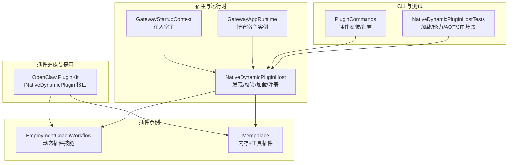
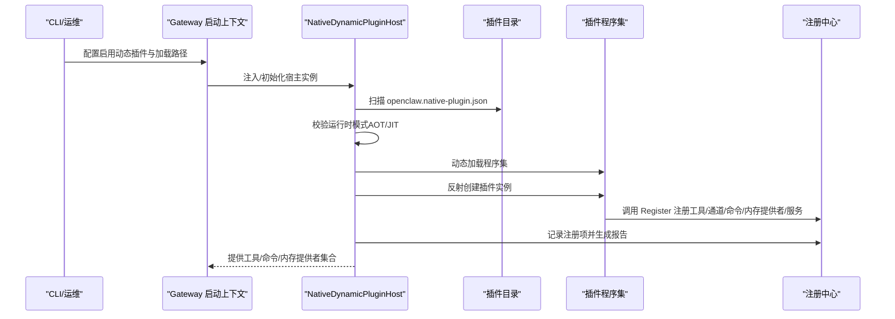
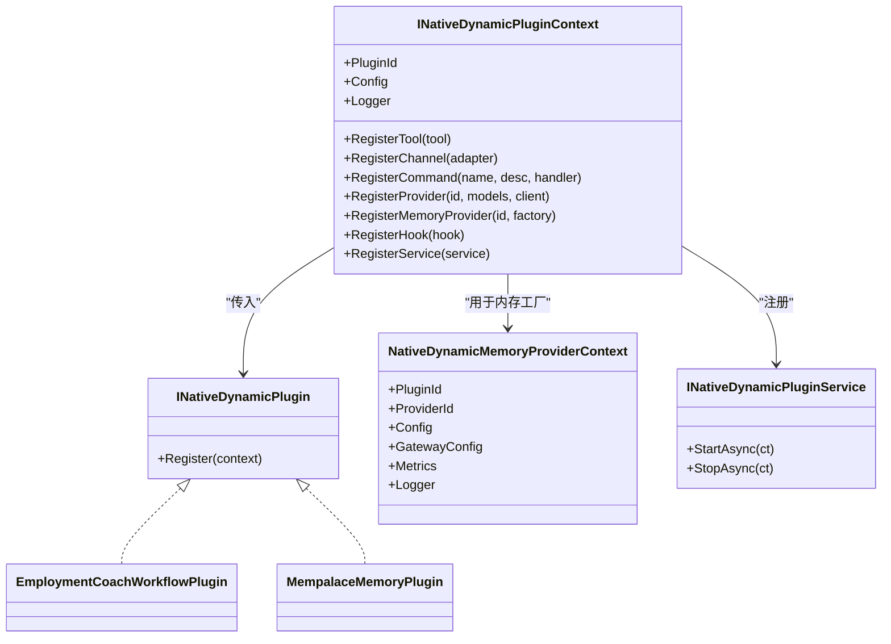
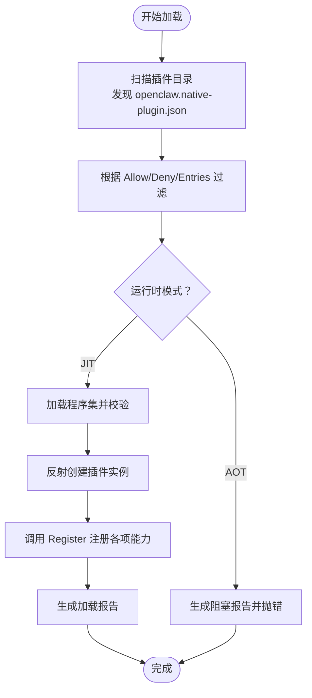
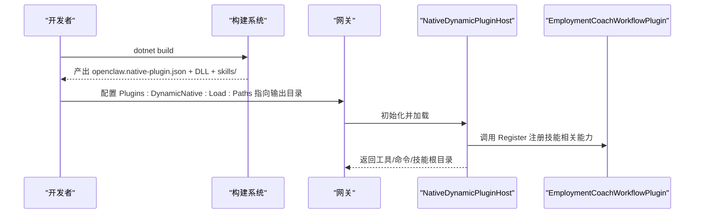
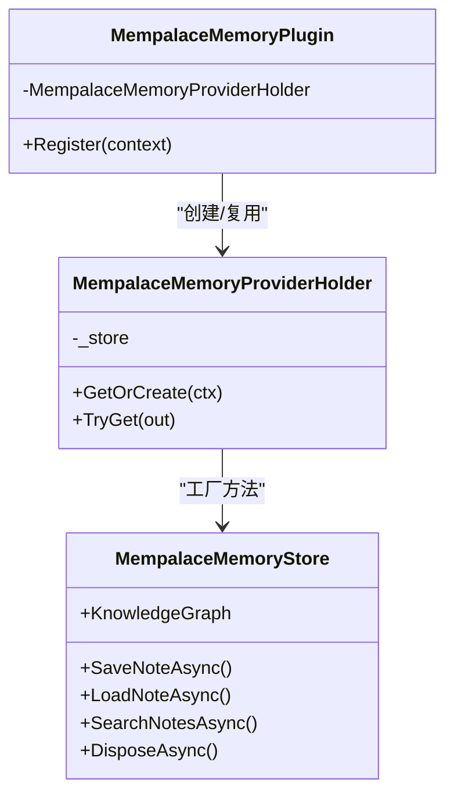
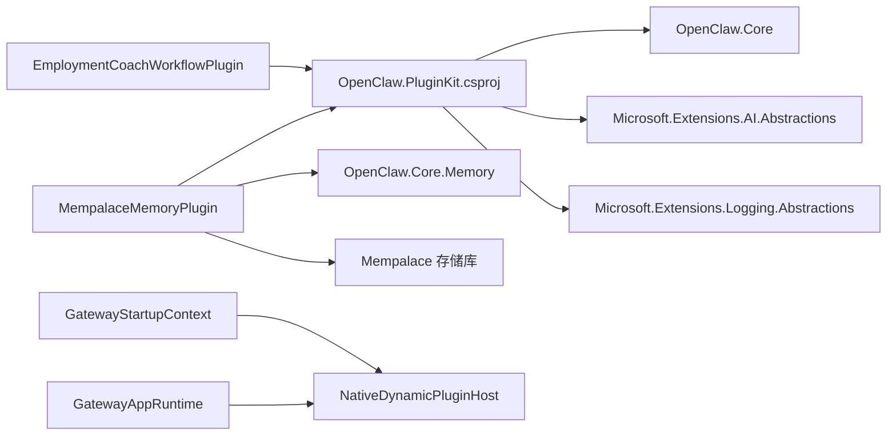

# 开发框架

<cite>
**本文引用的文件**
- [OpenClaw.PluginKit.csproj](file://src/OpenClaw.PluginKit/OpenClaw.PluginKit.csproj)
- [INativeDynamicPlugin.cs](file://src/OpenClaw.PluginKit/INativeDynamicPlugin.cs)
- [EmploymentCoachWorkflowPlugin.cs](file://src/OpenClaw.Plugins.EmploymentCoachWorkflow/EmploymentCoachWorkflowPlugin.cs)
- [openclaw.native-plugin.json（就业教练工作流）](file://src/OpenClaw.Plugins.EmploymentCoachWorkflow/openclaw.native-plugin.json)
- [README.md（就业教练工作流）](file://src/OpenClaw.Plugins.EmploymentCoachWorkflow/README.md)
- [MempalaceMemoryPlugin.cs](file://src/OpenClaw.Plugins.Mempalace/MempalaceMemoryPlugin.cs)
- [MempalaceMemoryStore.cs](file://src/OpenClaw.Plugins.Mempalace/MempalaceMemoryStore.cs)
- [openclaw.native-plugin.json（Mempalace 内存插件）](file://src/OpenClaw.Plugins.Mempalace/openclaw.native-plugin.json)
- [NativeDynamicPluginHost.cs](file://src/OpenClaw.Agent/Plugins/NativeDynamicPluginHost.cs)
- [NativeDynamicPluginHostTests.cs](file://src/OpenClaw.Tests/NativeDynamicPluginHostTests.cs)
- [MempalaceMemoryStoreTests.cs](file://src/OpenClaw.Tests/MempalaceMemoryStoreTests.cs)
- [PluginCommands.cs](file://src/OpenClaw.Cli/PluginCommands.cs)
- [GatewayStartupContext.cs](file://src/OpenClaw.Gateway/Bootstrap/GatewayStartupContext.cs)
- [GatewayAppRuntime.cs](file://src/OpenClaw.Gateway/Composition/GatewayAppRuntime.cs)
</cite>

## 目录
1. [简介](#简介)
2. [项目结构](#项目结构)
3. [核心组件](#核心组件)
4. [架构总览](#架构总览)
5. [详细组件分析](#详细组件分析)
6. [依赖关系分析](#依赖关系分析)
7. [性能考虑](#性能考虑)
8. [故障排查指南](#故障排查指南)
9. [结论](#结论)
10. [附录](#附录)

## 简介
本开发指南面向原生插件开发者，系统讲解 OpenClaw.NET 的原生动态插件体系：从项目模板与 NuGet 依赖、构建配置，到插件创建、清单与能力声明、运行时加载与注册、调试与测试，再到打包发布与持续集成实践。文档以 EmploymentCoachWorkflow 与 Mempalace 两个真实插件为例，帮助你快速上手并掌握完整的开发工作流。

## 项目结构
原生插件开发围绕以下关键模块展开：
- 插件抽象与接口层：位于 PluginKit，定义插件生命周期与注册上下文。
- 原生动态插件宿主：在 Agent/Gateway 中发现、校验、加载并注册插件。
- 示例插件：EmploymentCoachWorkflow（技能型动态插件）、Mempalace（内存与工具型动态插件）。
- CLI 工具：提供插件安装与本地部署辅助命令。
- 测试用例：覆盖宿主加载、能力限制、内存提供者注册等场景。

图表来源
- [INativeDynamicPlugin.cs:11-46](file://src/OpenClaw.PluginKit/INativeDynamicPlugin.cs#L11-L46)
- [NativeDynamicPluginHost.cs:19-907](file://src/OpenClaw.Agent/Plugins/NativeDynamicPluginHost.cs#L19-L907)
- [GatewayStartupContext.cs:13-13](file://src/OpenClaw.Gateway/Bootstrap/GatewayStartupContext.cs#L13-L13)
- [GatewayAppRuntime.cs:57-57](file://src/OpenClaw.Gateway/Composition/GatewayAppRuntime.cs#L57-L57)
- [PluginCommands.cs:135-167](file://src/OpenClaw.Cli/PluginCommands.cs#L135-L167)
- [NativeDynamicPluginHostTests.cs:31-92](file://src/OpenClaw.Tests/NativeDynamicPluginHostTests.cs#L31-L92)

章节来源
- [OpenClaw.PluginKit.csproj:1-15](file://src/OpenClaw.PluginKit/OpenClaw.PluginKit.csproj#L1-L15)
- [INativeDynamicPlugin.cs:11-46](file://src/OpenClaw.PluginKit/INativeDynamicPlugin.cs#L11-L46)
- [NativeDynamicPluginHost.cs:19-907](file://src/OpenClaw.Agent/Plugins/NativeDynamicPluginHost.cs#L19-L907)

## 核心组件
- 插件接口与上下文
  - INativeDynamicPlugin：插件入口，通过 Register 方法接收 INativeDynamicPluginContext 完成注册。
  - INativeDynamicPluginContext：提供插件 ID、配置、日志；支持注册工具、通道、命令、模型提供商、内存提供者、钩子与服务。
  - NativeDynamicMemoryProviderContext：内存提供者工厂上下文，包含网关配置、指标、日志等。
  - INativeDynamicPluginService：可选的长生命周期服务，支持异步启动/停止。
- 原生动态插件宿主
  - 发现与扫描：按配置路径扫描 openclaw.native-plugin.json。
  - 运行时模式校验：AOT 模式下拒绝动态插件；JIT 模式允许。
  - 类型加载与校验：验证插件类型实现接口、引用兼容的 PluginKit 版本。
  - 注册与回滚：成功注册后统计报告；失败则清理已注册资源。
  - 技能目录解析：支持声明 skills 目录，自动纳入技能加载范围。
- 示例插件
  - EmploymentCoachWorkflow：声明“skills”能力，打包技能资源，要求 JIT 模式。
  - Mempalace：注册内存提供者与工具，支持知识图谱查询与内存读写。

章节来源
- [INativeDynamicPlugin.cs:11-46](file://src/OpenClaw.PluginKit/INativeDynamicPlugin.cs#L11-L46)
- [NativeDynamicPluginHost.cs:64-378](file://src/OpenClaw.Agent/Plugins/NativeDynamicPluginHost.cs#L64-L378)
- [openclaw.native-plugin.json（就业教练工作流）:1-11](file://src/OpenClaw.Plugins.EmploymentCoachWorkflow/openclaw.native-plugin.json#L1-L11)
- [openclaw.native-plugin.json（Mempalace 内存插件）:1-10](file://src/OpenClaw.Plugins.Mempalace/openclaw.native-plugin.json#L1-L10)

## 架构总览
原生动态插件的运行时架构如下：

图表来源
- [GatewayStartupContext.cs:13-13](file://src/OpenClaw.Gateway/Bootstrap/GatewayStartupContext.cs#L13-L13)
- [GatewayAppRuntime.cs:57-57](file://src/OpenClaw.Gateway/Composition/GatewayAppRuntime.cs#L57-L57)
- [NativeDynamicPluginHost.cs:64-378](file://src/OpenClaw.Agent/Plugins/NativeDynamicPluginHost.cs#L64-L378)
- [PluginCommands.cs:135-167](file://src/OpenClaw.Cli/PluginCommands.cs#L135-L167)

## 详细组件分析

### 组件一：插件接口与上下文（PluginKit）
- 设计要点
  - 通过 Register 统一入口，隔离宿主与插件实现。
  - 上下文提供工具、通道、命令、模型/内存提供者、钩子、服务等注册能力。
  - 内存提供者上下文封装网关配置与运行指标，便于插件按需初始化。
- 复杂度与性能
  - 注册操作为 O(n)（n 为注册项数量），无额外 IO。
  - 内存提供者工厂延迟创建，避免不必要的初始化开销。

图表来源
- [INativeDynamicPlugin.cs:11-46](file://src/OpenClaw.PluginKit/INativeDynamicPlugin.cs#L11-L46)
- [EmploymentCoachWorkflowPlugin.cs:5-10](file://src/OpenClaw.Plugins.EmploymentCoachWorkflow/EmploymentCoachWorkflowPlugin.cs#L5-L10)
- [MempalaceMemoryPlugin.cs:6-19](file://src/OpenClaw.Plugins.Mempalace/MempalaceMemoryPlugin.cs#L6-L19)

章节来源
- [INativeDynamicPlugin.cs:11-46](file://src/OpenClaw.PluginKit/INativeDynamicPlugin.cs#L11-L46)

### 组件二：原生动态插件宿主（NativeDynamicPluginHost）
- 关键流程
  - 加载：扫描、过滤、校验、反射加载、实例化、调用 Register。
  - 注册：收集工具、通道、命令、模型/内存提供者、钩子、服务。
  - 报告：记录诊断、能力、统计与错误。
  - 回滚：失败时撤销已注册项并释放资源。
- 运行时模式
  - AOT 模式禁止动态插件，直接抛出异常并生成阻塞报告。
  - JIT 模式允许加载，但要求插件声明 jitOnly 或具备相应能力。
- 技能目录
  - 支持在清单中声明 skills 目录，自动纳入技能根目录列表。

图表来源
- [NativeDynamicPluginHost.cs:64-378](file://src/OpenClaw.Agent/Plugins/NativeDynamicPluginHost.cs#L64-L378)
- [NativeDynamicPluginHostTests.cs:94-123](file://src/OpenClaw.Tests/NativeDynamicPluginHostTests.cs#L94-L123)

章节来源
- [NativeDynamicPluginHost.cs:64-378](file://src/OpenClaw.Agent/Plugins/NativeDynamicPluginHost.cs#L64-L378)
- [NativeDynamicPluginHostTests.cs:31-92](file://src/OpenClaw.Tests/NativeDynamicPluginHostTests.cs#L31-L92)

### 组件三：示例插件一——EmploymentCoachWorkflow
- 能力与清单
  - 清单声明 capabilities 为 skills，并包含 skills 目录，打包技能资源。
  - 要求 JIT 模式运行。
- 使用方式
  - 构建输出目录作为动态插件目录，或直接打包该目录。
  - 在网关配置中启用动态插件并指定加载路径与条目。

图表来源
- [README.md（就业教练工作流）:13-42](file://src/OpenClaw.Plugins.EmploymentCoachWorkflow/README.md#L13-L42)
- [openclaw.native-plugin.json（就业教练工作流）:1-11](file://src/OpenClaw.Plugins.EmploymentCoachWorkflow/openclaw.native-plugin.json#L1-L11)
- [EmploymentCoachWorkflowPlugin.cs:5-10](file://src/OpenClaw.Plugins.EmploymentCoachWorkflow/EmploymentCoachWorkflowPlugin.cs#L5-L10)

章节来源
- [README.md（就业教练工作流）:1-42](file://src/OpenClaw.Plugins.EmploymentCoachWorkflow/README.md#L1-L42)
- [openclaw.native-plugin.json（就业教练工作流）:1-11](file://src/OpenClaw.Plugins.EmploymentCoachWorkflow/openclaw.native-plugin.json#L1-L11)
- [EmploymentCoachWorkflowPlugin.cs:5-10](file://src/OpenClaw.Plugins.EmploymentCoachWorkflow/EmploymentCoachWorkflowPlugin.cs#L5-L10)

### 组件四：示例插件二——Mempalace
- 能力与注册
  - 注册内存提供者：基于上下文创建内存存储实例。
  - 注册工具：提供知识图谱查询工具，依赖内存提供者状态。
- 存储实现
  - MempalaceMemoryStore 实现多接口，统一管理会话、记忆、知识图谱与嵌入检索。
  - 支持并发安全的集合获取与资源释放。
- 使用方式
  - 将插件目录加入动态插件加载路径，网关启动后自动注册内存提供者与工具。

图表来源
- [MempalaceMemoryPlugin.cs:6-42](file://src/OpenClaw.Plugins.Mempalace/MempalaceMemoryPlugin.cs#L6-L42)
- [MempalaceMemoryStore.cs:15-374](file://src/OpenClaw.Plugins.Mempalace/MempalaceMemoryStore.cs#L15-L374)

章节来源
- [MempalaceMemoryPlugin.cs:6-42](file://src/OpenClaw.Plugins.Mempalace/MempalaceMemoryPlugin.cs#L6-L42)
- [MempalaceMemoryStore.cs:15-374](file://src/OpenClaw.Plugins.Mempalace/MempalaceMemoryStore.cs#L15-L374)

## 依赖关系分析
- 插件 Kit 依赖
  - PluginKit 引用 OpenClaw.Core，并引入 Microsoft.Extensions.AI.Abstractions 与 Microsoft.Extensions.Logging.Abstractions。
- 插件实现依赖
  - Mempalace 插件依赖 OpenClaw.Core.Memory 与外部 MemPalace 库。
- 运行时集成
  - GatewayStartupContext 与 GatewayAppRuntime 持有 NativeDynamicPluginHost 实例，确保启动阶段可用。

图表来源
- [OpenClaw.PluginKit.csproj:9-13](file://src/OpenClaw.PluginKit/OpenClaw.PluginKit.csproj#L9-L13)
- [MempalaceMemoryPlugin.cs:1-2](file://src/OpenClaw.Plugins.Mempalace/MempalaceMemoryPlugin.cs#L1-L2)
- [GatewayStartupContext.cs:13-13](file://src/OpenClaw.Gateway/Bootstrap/GatewayStartupContext.cs#L13-L13)
- [GatewayAppRuntime.cs:57-57](file://src/OpenClaw.Gateway/Composition/GatewayAppRuntime.cs#L57-L57)

章节来源
- [OpenClaw.PluginKit.csproj:1-15](file://src/OpenClaw.PluginKit/OpenClaw.PluginKit.csproj#L1-L15)
- [MempalaceMemoryPlugin.cs:1-2](file://src/OpenClaw.Plugins.Mempalace/MempalaceMemoryPlugin.cs#L1-L2)
- [GatewayStartupContext.cs:13-13](file://src/OpenClaw.Gateway/Bootstrap/GatewayStartupContext.cs#L13-L13)
- [GatewayAppRuntime.cs:57-57](file://src/OpenClaw.Gateway/Composition/GatewayAppRuntime.cs#L57-L57)

## 性能考虑
- JIT 与 AOT
  - 动态插件仅在 JIT 模式下加载；AOT 模式会直接阻断并报错，避免运行期编译风险。
- 内存提供者延迟初始化
  - MempalaceMemoryPlugin 使用持有者模式延迟创建存储实例，减少启动开销。
- 并发与资源释放
  - 存储实现采用信号量与异步释放，确保高并发下的稳定性与资源回收。
- 技能目录与注册
  - 宿主仅在声明 skills 时扩展技能根目录，避免无效扫描。

章节来源
- [NativeDynamicPluginHost.cs:87-130](file://src/OpenClaw.Agent/Plugins/NativeDynamicPluginHost.cs#L87-L130)
- [MempalaceMemoryPlugin.cs:21-40](file://src/OpenClaw.Plugins.Mempalace/MempalaceMemoryPlugin.cs#L21-L40)
- [MempalaceMemoryStore.cs:202-220](file://src/OpenClaw.Plugins.Mempalace/MempalaceMemoryStore.cs#L202-L220)

## 故障排查指南
- AOT 模式加载失败
  - 现象：启动时报错提示需要 JIT 模式。
  - 原因：动态插件能力被 AOT 模式阻断。
  - 处理：切换到 JIT 模式或移除动态插件能力声明。
- 程序集路径越界
  - 现象：加载失败并报告 assembly_outside_root。
  - 原因：assemblyPath 指向插件根目录之外。
  - 处理：将 DLL 放入插件目录内，或修正清单中的相对路径。
- 重复工具名冲突
  - 现象：注册阶段出现重复工具名警告。
  - 原因：多个插件注册同名工具。
  - 处理：调整工具名称或避免重复注册。
- 内存提供者未激活
  - 现象：工具返回错误提示内存提供者未激活。
  - 原因：未正确设置网关内存提供者或插件未注册。
  - 处理：检查网关配置与插件注册逻辑。

章节来源
- [NativeDynamicPluginHostTests.cs:94-123](file://src/OpenClaw.Tests/NativeDynamicPluginHostTests.cs#L94-L123)
- [NativeDynamicPluginHostTests.cs:160-193](file://src/OpenClaw.Tests/NativeDynamicPluginHostTests.cs#L160-L193)
- [MempalaceMemoryStoreTests.cs:38-67](file://src/OpenClaw.Tests/MempalaceMemoryStoreTests.cs#L38-L67)

## 结论
通过 PluginKit 的统一接口与 NativeDynamicPluginHost 的严格加载机制，OpenClaw.NET 为原生插件提供了安全、灵活且高性能的扩展能力。结合 EmploymentCoachWorkflow 与 Mempalace 的实践，你可以快速构建技能型与功能型插件，并在 JIT 模式下稳定运行。建议在开发过程中重视清单声明、能力约束与运行时模式匹配，确保插件在生产环境中的可靠性与可维护性。

## 附录

### A. 开发环境搭建与调试
- 环境要求
  - .NET SDK（示例项目目标框架为 net10.0）。
  - 网关运行时（JIT 模式）以加载动态插件。
- 调试技巧
  - 在插件 Register 中添加日志，观察宿主加载与注册过程。
  - 使用测试用例思路构造最小化插件包，逐步定位问题。

章节来源
- [README.md（就业教练工作流）:13-17](file://src/OpenClaw.Plugins.EmploymentCoachWorkflow/README.md#L13-L17)

### B. 单元测试与集成测试
- 测试要点
  - 加载与能力：验证 JIT 模式下加载成功、AOT 模式被阻断。
  - 注册项：确认工具、命令、内存提供者、钩子、服务均正确注册。
  - 资源清理：插件释放后内存提供者注册应清空。
- 示例参考
  - NativeDynamicPluginHostTests：覆盖加载、能力、AOT/JIT、路径越界等场景。
  - MempalaceMemoryStoreTests：验证内存提供者与工具协作。

章节来源
- [NativeDynamicPluginHostTests.cs:31-92](file://src/OpenClaw.Tests/NativeDynamicPluginHostTests.cs#L31-L92)
- [NativeDynamicPluginHostTests.cs:94-123](file://src/OpenClaw.Tests/NativeDynamicPluginHostTests.cs#L94-L123)
- [NativeDynamicPluginHostTests.cs:125-158](file://src/OpenClaw.Tests/NativeDynamicPluginHostTests.cs#L125-L158)
- [NativeDynamicPluginHostTests.cs:160-193](file://src/OpenClaw.Tests/NativeDynamicPluginHostTests.cs#L160-L193)
- [MempalaceMemoryStoreTests.cs:38-67](file://src/OpenClaw.Tests/MempalaceMemoryStoreTests.cs#L38-L67)

### C. 持续集成配置建议
- 构建与打包
  - 在 CI 中执行 dotnet build，复制 openclaw.native-plugin.json 与 DLL 到输出目录。
  - 对于技能型插件，确保 skills 目录随构建产物一并打包。
- 运行时模式
  - 在 AOT 分支禁用动态插件；在 JIT 分支启用动态插件并进行端到端测试。
- 安全与合规
  - 校验 assemblyPath 不越界，避免加载外部程序集。
  - 对外发布前进行回归测试，覆盖工具、命令、内存提供者与技能加载。

章节来源
- [PluginCommands.cs:135-167](file://src/OpenClaw.Cli/PluginCommands.cs#L135-L167)
- [NativeDynamicPluginHost.cs:398-436](file://src/OpenClaw.Agent/Plugins/NativeDynamicPluginHost.cs#L398-L436)