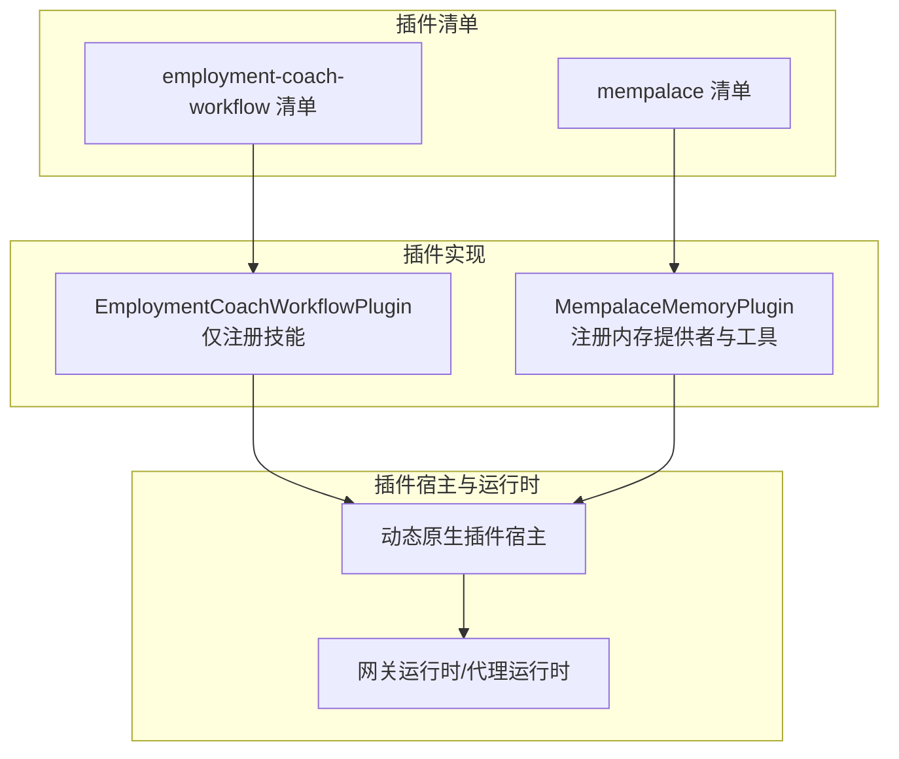
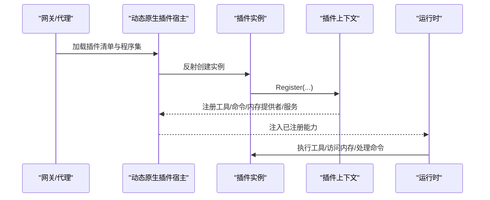
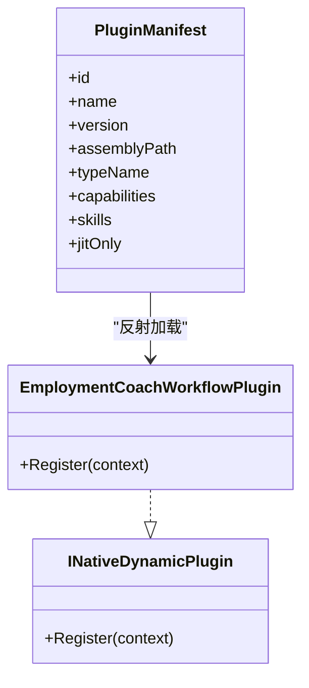
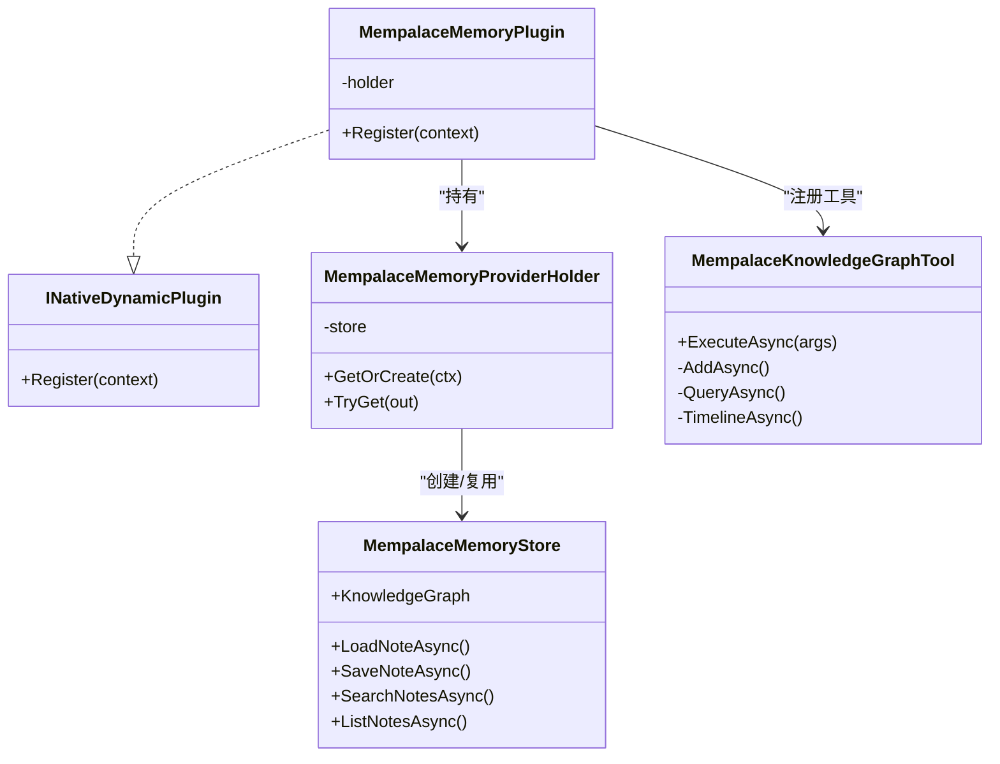
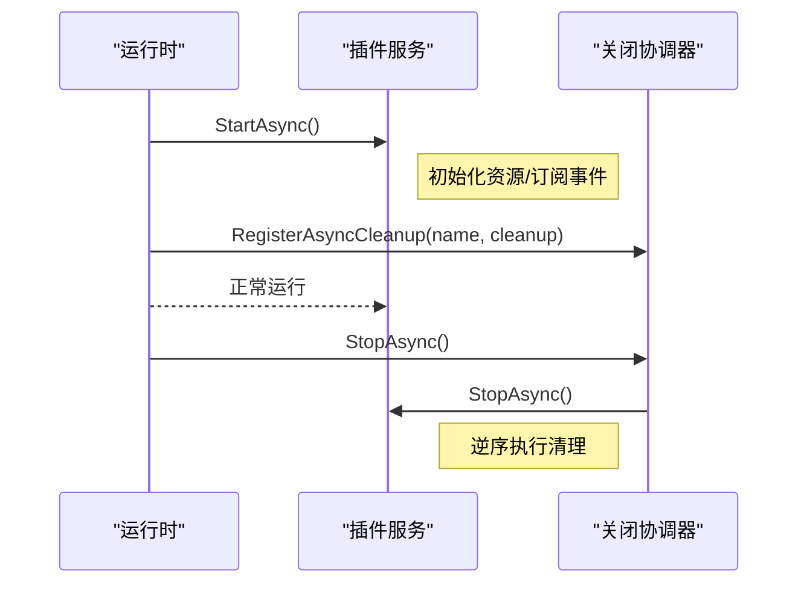
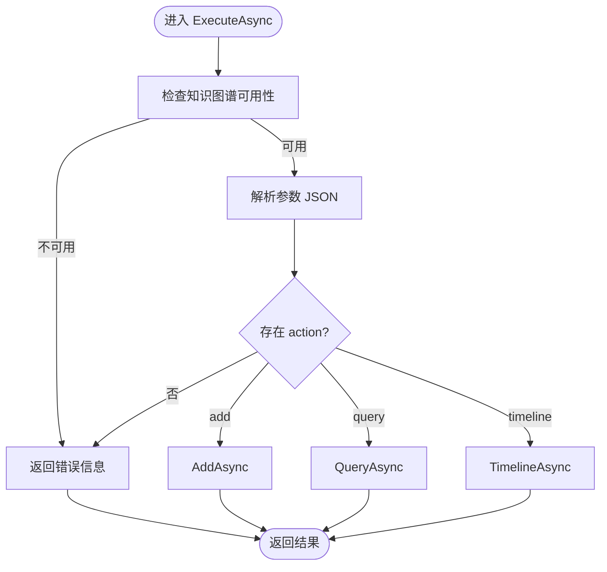

# 插件开发流程

<cite>
**本文引用的文件**   
- [EmploymentCoachWorkflowPlugin.cs](file://src/OpenClaw.Plugins.EmploymentCoachWorkflow/EmploymentCoachWorkflowPlugin.cs)
- [openclaw.native-plugin.json（就业教练工作流）](file://src/OpenClaw.Plugins.EmploymentCoachWorkflow/openclaw.native-plugin.json)
- [README.md（就业教练工作流）](file://src/OpenClaw.Plugins.EmploymentCoachWorkflow/README.md)
- [MempalaceMemoryPlugin.cs](file://src/OpenClaw.Plugins.Mempalace/MempalaceMemoryPlugin.cs)
- [MempalaceMemoryStore.cs](file://src/OpenClaw.Plugins.Mempalace/MempalaceMemoryStore.cs)
- [MempalaceKnowledgeGraphTool.cs](file://src/OpenClaw.Plugins.Mempalace/Tools/MempalaceKnowledgeGraphTool.cs)
- [openclaw.native-plugin.json（Mempalace）](file://src/OpenClaw.Plugins.Mempalace/openclaw.native-plugin.json)
- [INativeDynamicPlugin.cs](file://src/OpenClaw.PluginKit/INativeDynamicPlugin.cs)
- [NativeDynamicPluginHostTests.cs](file://src/OpenClaw.Tests/NativeDynamicPluginHostTests.cs)
- [CoreServicesExtensionsTests.cs](file://src/OpenClaw.Tests/CoreServicesExtensionsTests.cs)
- [GatewayRuntimeLifecycleTests.cs](file://src/OpenClaw.Tests/GatewayRuntimeLifecycleTests.cs)
- [GatewayRuntimeShutdownCoordinator.cs](file://src/OpenClaw.Gateway/Pipeline/GatewayRuntimeShutdownCoordinator.cs)
- [MafAgentRuntime.cs](file://src/OpenClaw.Agent/MafAgentRuntime.cs)
- [MemoryGetTool.cs](file://src/OpenClaw.Agent/Tools/MemoryGetTool.cs)
- [ProjectMemoryTool.cs](file://src/OpenClaw.Agent/Tools/ProjectMemoryTool.cs)
- [PaymentPluginRegistration.cs](file://src/OpenClaw.Plugins.Payment/PaymentPluginRegistration.cs)
</cite>

## 目录
1. [简介](#简介)
2. [项目结构](#项目结构)
3. [核心组件](#核心组件)
4. [架构总览](#架构总览)
5. [详细组件分析](#详细组件分析)
6. [依赖关系分析](#依赖关系分析)
7. [性能考量](#性能考量)
8. [故障排查指南](#故障排查指南)
9. [结论](#结论)
10. [附录](#附录)

## 简介
本指南面向原生插件开发者，覆盖从需求分析到插件发布的完整开发周期。文档以 EmploymentCoachWorkflow 和 Mempalace 两类插件为例，系统讲解插件功能设计、接口定义、实现编码与集成测试的关键步骤，并深入说明插件上下文的使用方法、工具注册机制、事件与生命周期管理以及状态维护策略。同时提供调试技巧与最佳实践，帮助开发者高效构建高质量的动态原生插件。

## 项目结构
OpenClaw 的插件体系由“插件清单 + 插件实现 + 插件宿主”三部分组成：
- 插件清单：以 openclaw.native-plugin.json 描述插件元数据、能力与入口类型。
- 插件实现：实现 INativeDynamicPlugin 接口，在 Register 方法中通过上下文注册工具、内存提供者、命令等。
- 插件宿主：负责加载、校验、运行插件并管理其生命周期。

图示来源
- [openclaw.native-plugin.json（就业教练工作流）:1-11](file://src/OpenClaw.Plugins.EmploymentCoachWorkflow/openclaw.native-plugin.json#L1-L11)
- [openclaw.native-plugin.json（Mempalace）:1-10](file://src/OpenClaw.Plugins.Mempalace/openclaw.native-plugin.json#L1-L10)
- [EmploymentCoachWorkflowPlugin.cs:1-11](file://src/OpenClaw.Plugins.EmploymentCoachWorkflow/EmploymentCoachWorkflowPlugin.cs#L1-L11)
- [MempalaceMemoryPlugin.cs:1-43](file://src/OpenClaw.Plugins.Mempalace/MempalaceMemoryPlugin.cs#L1-L43)

章节来源
- [openclaw.native-plugin.json（就业教练工作流）:1-11](file://src/OpenClaw.Plugins.EmploymentCoachWorkflow/openclaw.native-plugin.json#L1-L11)
- [openclaw.native-plugin.json（Mempalace）:1-10](file://src/OpenClaw.Plugins.Mempalace/openclaw.native-plugin.json#L1-L10)
- [EmploymentCoachWorkflowPlugin.cs:1-11](file://src/OpenClaw.Plugins.EmploymentCoachWorkflow/EmploymentCoachWorkflowPlugin.cs#L1-L11)
- [MempalaceMemoryPlugin.cs:1-43](file://src/OpenClaw.Plugins.Mempalace/MempalaceMemoryPlugin.cs#L1-L43)

## 核心组件
- 动态原生插件接口与上下文
  - INativeDynamicPlugin：插件入口，实现 Register 方法完成注册。
  - INativeDynamicPluginContext：提供注册工具、通道、命令、模型提供者、内存提供者、钩子与服务的能力。
  - NativeDynamicMemoryProviderContext：内存提供者的上下文参数，包含网关配置、指标与日志器。
  - INativeDynamicPluginService：可选的服务接口，支持异步启动/停止。

- 插件清单字段
  - id/name/version：标识信息
  - assemblyPath/typeName：程序集与类型全名
  - capabilities：能力列表（如 skills、tools、memory、commands 等）
  - jitOnly：是否仅在 JIT 模式下允许加载
  - skills：当包含 skills 能力时，需提供技能目录

章节来源
- [INativeDynamicPlugin.cs:1-46](file://src/OpenClaw.PluginKit/INativeDynamicPlugin.cs#L1-L46)
- [openclaw.native-plugin.json（就业教练工作流）:1-11](file://src/OpenClaw.Plugins.EmploymentCoachWorkflow/openclaw.native-plugin.json#L1-L11)
- [openclaw.native-plugin.json（Mempalace）:1-10](file://src/OpenClaw.Plugins.Mempalace/openclaw.native-plugin.json#L1-L10)

## 架构总览
动态原生插件的运行链路如下：
- 网关或代理启动时，读取插件清单，按路径加载插件程序集。
- 实例化插件类型，调用 Register，向上下文注册所需能力。
- 宿主根据能力类型，将工具、命令、内存提供者等注入到运行时。
- 运行时在执行过程中调用插件提供的能力（如工具执行、知识图谱查询、会话/记忆操作）。

图示来源
- [INativeDynamicPlugin.cs:16-29](file://src/OpenClaw.PluginKit/INativeDynamicPlugin.cs#L16-L29)
- [MempalaceMemoryPlugin.cs:8-19](file://src/OpenClaw.Plugins.Mempalace/MempalaceMemoryPlugin.cs#L8-L19)
- [EmploymentCoachWorkflowPlugin.cs:7-9](file://src/OpenClaw.Plugins.EmploymentCoachWorkflow/EmploymentCoachWorkflowPlugin.cs#L7-L9)

## 详细组件分析

### 组件A：就业教练工作流插件（技能型）
- 设计要点
  - 该插件不直接注册工具或内存提供者，而是打包一组技能并通过清单声明 skills 能力。
  - 适合“纯技能分发”的场景，便于统一管理与版本控制。

- 关键实现
  - 插件类实现 INativeDynamicPlugin，Register 中留空或按需扩展。
  - 清单声明 capabilities 包含 skills，并提供 skills 目录映射。

- 集成测试要点
  - 使用动态原生插件宿主加载后，验证技能被发现并可被加载。
  - 在 AOT 模式下，若 jitOnly 为真，则应被拒绝加载。

图示来源
- [EmploymentCoachWorkflowPlugin.cs:5-10](file://src/OpenClaw.Plugins.EmploymentCoachWorkflow/EmploymentCoachWorkflowPlugin.cs#L5-L10)
- [openclaw.native-plugin.json（就业教练工作流）:1-11](file://src/OpenClaw.Plugins.EmploymentCoachWorkflow/openclaw.native-plugin.json#L1-L11)

章节来源
- [EmploymentCoachWorkflowPlugin.cs:1-11](file://src/OpenClaw.Plugins.EmploymentCoachWorkflow/EmploymentCoachWorkflowPlugin.cs#L1-L11)
- [openclaw.native-plugin.json（就业教练工作流）:1-11](file://src/OpenClaw.Plugins.EmploymentCoachWorkflow/openclaw.native-plugin.json#L1-L11)
- [README.md（就业教练工作流）:1-42](file://src/OpenClaw.Plugins.EmploymentCoachWorkflow/README.md#L1-L42)
- [NativeDynamicPluginHostTests.cs:41-92](file://src/OpenClaw.Tests/NativeDynamicPluginHostTests.cs#L41-L92)

### 组件B：Mempalace 内存插件（工具+内存型）
- 设计要点
  - 提供内存提供者（IMemoryStore），并注册知识图谱工具，支持对时间性三元组进行增删查与时间线查询。
  - 使用持有者模式延迟初始化内存存储，避免不必要的资源占用。

- 关键实现
  - Register：注册内存提供者与工具；工具通过回调函数判断内存提供者是否可用。
  - 内存提供者持有者：线程安全地缓存内存存储实例。
  - 内存存储：实现多接口（会话、记忆检索、知识图谱等），封装嵌入与集合管理。
  - 工具：参数校验、JSON 解析、实体格式校验、ISO 时间解析与结果序列化。

图示来源
- [MempalaceMemoryPlugin.cs:6-42](file://src/OpenClaw.Plugins.Mempalace/MempalaceMemoryPlugin.cs#L6-L42)
- [MempalaceMemoryStore.cs:15-374](file://src/OpenClaw.Plugins.Mempalace/MempalaceMemoryStore.cs#L15-L374)
- [MempalaceKnowledgeGraphTool.cs:8-214](file://src/OpenClaw.Plugins.Mempalace/Tools/MempalaceKnowledgeGraphTool.cs#L8-L214)

章节来源
- [MempalaceMemoryPlugin.cs:1-43](file://src/OpenClaw.Plugins.Mempalace/MempalaceMemoryPlugin.cs#L1-L43)
- [MempalaceMemoryStore.cs:1-374](file://src/OpenClaw.Plugins.Mempalace/MempalaceMemoryStore.cs#L1-L374)
- [MempalaceKnowledgeGraphTool.cs:1-214](file://src/OpenClaw.Plugins.Mempalace/Tools/MempalaceKnowledgeGraphTool.cs#L1-L214)
- [openclaw.native-plugin.json（Mempalace）:1-10](file://src/OpenClaw.Plugins.Mempalace/openclaw.native-plugin.json#L1-L10)

### 组件C：工具注册与上下文使用
- 上下文能力
  - RegisterTool：注册 ITool 实现。
  - RegisterCommand：注册命令处理器，支持命令路由与执行。
  - RegisterMemoryProvider：注册内存提供者工厂，按需创建 IMemoryStore。
  - RegisterHook/Service：注册钩子与可选服务，参与生命周期管理。

- 示例路径
  - 插件上下文接口定义：[INativeDynamicPlugin.cs:16-29](file://src/OpenClaw.PluginKit/INativeDynamicPlugin.cs#L16-L29)
  - Mempalace 注册内存提供者与工具：[MempalaceMemoryPlugin.cs:8-19](file://src/OpenClaw.Plugins.Mempalace/MempalaceMemoryPlugin.cs#L8-L19)

章节来源
- [INativeDynamicPlugin.cs:16-29](file://src/OpenClaw.PluginKit/INativeDynamicPlugin.cs#L16-L29)
- [MempalaceMemoryPlugin.cs:8-19](file://src/OpenClaw.Plugins.Mempalace/MempalaceMemoryPlugin.cs#L8-L19)

### 组件D：事件处理与生命周期管理
- 生命周期
  - 插件服务实现 INativeDynamicPluginService，支持 StartAsync/StopAsync。
  - 网关运行时关闭协调器负责逆序执行清理逻辑，确保资源有序释放。

- 示例路径
  - 插件服务接口：[INativeDynamicPlugin.cs:41-45](file://src/OpenClaw.PluginKit/INativeDynamicPlugin.cs#L41-L45)
  - 运行时关闭协调器：[GatewayRuntimeShutdownCoordinator.cs:1-38](file://src/OpenClaw.Gateway/Pipeline/GatewayRuntimeShutdownCoordinator.cs#L1-L38)
  - 代理运行时加载工具与技能：[MafAgentRuntime.cs:109-161](file://src/OpenClaw.Agent/MafAgentRuntime.cs#L109-L161)

图示来源
- [INativeDynamicPlugin.cs:41-45](file://src/OpenClaw.PluginKit/INativeDynamicPlugin.cs#L41-L45)
- [GatewayRuntimeShutdownCoordinator.cs:1-38](file://src/OpenClaw.Gateway/Pipeline/GatewayRuntimeShutdownCoordinator.cs#L1-L38)
- [MafAgentRuntime.cs:109-161](file://src/OpenClaw.Agent/MafAgentRuntime.cs#L109-L161)

章节来源
- [GatewayRuntimeShutdownCoordinator.cs:1-38](file://src/OpenClaw.Gateway/Pipeline/GatewayRuntimeShutdownCoordinator.cs#L1-L38)
- [MafAgentRuntime.cs:109-161](file://src/OpenClaw.Agent/MafAgentRuntime.cs#L109-L161)

### 组件E：复杂逻辑组件（知识图谱工具）
- 参数与行为
  - 支持 action: add/query/timeline
  - add：要求 subject/predicate/object，可选 valid_from/at
  - query：支持按三元组模式与 at 查询
  - timeline：按实体与时间范围列出事件

- 处理流程

图示来源
- [MempalaceKnowledgeGraphTool.cs:45-67](file://src/OpenClaw.Plugins.Mempalace/Tools/MempalaceKnowledgeGraphTool.cs#L45-L67)

章节来源
- [MempalaceKnowledgeGraphTool.cs:1-214](file://src/OpenClaw.Plugins.Mempalace/Tools/MempalaceKnowledgeGraphTool.cs#L1-L214)

## 依赖关系分析
- 插件与运行时的耦合
  - 插件通过上下文接口与运行时解耦，仅在 Register 阶段建立契约。
  - 内存提供者通过工厂模式延迟创建，降低启动成本。
  - 工具通过回调判断依赖状态，避免强耦合。

- 测试与验证
  - 动态原生插件宿主测试覆盖：AOT 拒绝、路径越界拒绝、内存提供者注册清理、命令注册与执行、技能发现等。
  - 运行时测试覆盖：无动态内存提供者时抛出异常，确保配置正确。

图示来源
- [NativeDynamicPluginHostTests.cs:41-234](file://src/OpenClaw.Tests/NativeDynamicPluginHostTests.cs#L41-L234)
- [CoreServicesExtensionsTests.cs:343-383](file://src/OpenClaw.Tests/CoreServicesExtensionsTests.cs#L343-L383)

章节来源
- [NativeDynamicPluginHostTests.cs:41-234](file://src/OpenClaw.Tests/NativeDynamicPluginHostTests.cs#L41-L234)
- [CoreServicesExtensionsTests.cs:343-383](file://src/OpenClaw.Tests/CoreServicesExtensionsTests.cs#L343-L383)

## 性能考量
- 延迟初始化与缓存
  - 内存提供者持有者使用锁与延迟初始化，避免重复创建昂贵对象。
- 并发与资源保护
  - 使用信号量与锁保护共享资源，防止并发冲突。
- 搜索与嵌入
  - 对检索结果限制候选数量与返回条数，避免过载。
- 生命周期清理
  - 通过关闭协调器统一释放资源，避免泄漏。

章节来源
- [MempalaceMemoryPlugin.cs:21-40](file://src/OpenClaw.Plugins.Mempalace/MempalaceMemoryPlugin.cs#L21-L40)
- [MempalaceMemoryStore.cs:29-31](file://src/OpenClaw.Plugins.Mempalace/MempalaceMemoryStore.cs#L29-L31)
- [MempalaceMemoryStore.cs:134-141](file://src/OpenClaw.Plugins.Mempalace/MempalaceMemoryStore.cs#L134-L141)
- [GatewayRuntimeShutdownCoordinator.cs:1-38](file://src/OpenClaw.Gateway/Pipeline/GatewayRuntimeShutdownCoordinator.cs#L1-L38)

## 故障排查指南
- AOT 模式下无法加载动态原生插件
  - 现象：加载时报错，诊断包含“需要 JIT 模式”。
  - 排查：确认插件清单 jitOnly 为 true，且运行时处于 JIT 模式。
  - 参考：[NativeDynamicPluginHostTests.cs:95-123](file://src/OpenClaw.Tests/NativeDynamicPluginHostTests.cs#L95-L123)

- 插件程序集路径越界
  - 现象：加载失败，诊断包含“程序集必须位于根目录内”。
  - 排查：将插件目录置于允许加载路径范围内，避免 ../ 路径。
  - 参考：[NativeDynamicPluginHostTests.cs:161-193](file://src/OpenClaw.Tests/NativeDynamicPluginHostTests.cs#L161-L193)

- 缺少动态内存提供者
  - 现象：运行时获取内存存储时报错，提示未注册任何动态原生内存提供者。
  - 排查：确认插件已注册内存提供者，且网关配置启用动态原生插件。
  - 参考：[CoreServicesExtensionsTests.cs:343-383](file://src/OpenClaw.Tests/CoreServicesExtensionsTests.cs#L343-L383)

- 工具参数错误
  - 现象：工具执行返回错误信息。
  - 排查：核对参数 JSON 结构、必填项与格式（如实体类型:id、ISO 时间）。
  - 参考：[MempalaceKnowledgeGraphTool.cs:159-198](file://src/OpenClaw.Plugins.Mempalace/Tools/MempalaceKnowledgeGraphTool.cs#L159-L198)

- 插件服务未清理
  - 现象：关闭时资源未释放。
  - 排查：确保插件服务实现了 StartAsync/StopAsync，并在运行时注册了清理回调。
  - 参考：[GatewayRuntimeLifecycleTests.cs:31-44](file://src/OpenClaw.Tests/GatewayRuntimeLifecycleTests.cs#L31-L44), [GatewayRuntimeShutdownCoordinator.cs:37-38](file://src/OpenClaw.Gateway/Pipeline/GatewayRuntimeShutdownCoordinator.cs#L37-L38)

章节来源
- [NativeDynamicPluginHostTests.cs:95-193](file://src/OpenClaw.Tests/NativeDynamicPluginHostTests.cs#L95-L193)
- [CoreServicesExtensionsTests.cs:343-383](file://src/OpenClaw.Tests/CoreServicesExtensionsTests.cs#L343-L383)
- [MempalaceKnowledgeGraphTool.cs:159-198](file://src/OpenClaw.Plugins.Mempalace/Tools/MempalaceKnowledgeGraphTool.cs#L159-L198)
- [GatewayRuntimeLifecycleTests.cs:31-44](file://src/OpenClaw.Tests/GatewayRuntimeLifecycleTests.cs#L31-L44)
- [GatewayRuntimeShutdownCoordinator.cs:37-38](file://src/OpenClaw.Gateway/Pipeline/GatewayRuntimeShutdownCoordinator.cs#L37-L38)

## 结论
通过标准化的插件清单、清晰的上下文注册接口与严格的生命周期管理，OpenClaw 的原生插件体系实现了高内聚、低耦合的扩展能力。开发者可依据本文档的流程与示例，快速完成从需求到发布的全链路开发，并结合测试与故障排查指南保障质量与稳定性。

## 附录
- 开发步骤建议
  - 需求分析：明确插件目标、能力边界与依赖。
  - 清单编写：完善 openclaw.native-plugin.json 字段，选择合适的能力与 jitOnly。
  - 接口实现：实现 INativeDynamicPlugin，按需注册工具/命令/内存提供者/服务。
  - 编码规范：遵循参数校验、异常处理、并发安全与资源释放。
  - 集成测试：覆盖加载、命令/工具执行、AOT/JIT 场景、路径安全与生命周期。
  - 发布与配置：提供网关配置示例，确保路径与启用开关正确。

- 示例参考
  - 技能型插件：[EmploymentCoachWorkflowPlugin.cs:1-11](file://src/OpenClaw.Plugins.EmploymentCoachWorkflow/EmploymentCoachWorkflowPlugin.cs#L1-L11), [openclaw.native-plugin.json（就业教练工作流）:1-11](file://src/OpenClaw.Plugins.EmploymentCoachWorkflow/openclaw.native-plugin.json#L1-L11), [README.md（就业教练工作流）:1-42](file://src/OpenClaw.Plugins.EmploymentCoachWorkflow/README.md#L1-L42)
  - 工具+内存型插件：[MempalaceMemoryPlugin.cs:1-43](file://src/OpenClaw.Plugins.Mempalace/MempalaceMemoryPlugin.cs#L1-L43), [MempalaceMemoryStore.cs:1-374](file://src/OpenClaw.Plugins.Mempalace/MempalaceMemoryStore.cs#L1-L374), [MempalaceKnowledgeGraphTool.cs:1-214](file://src/OpenClaw.Plugins.Mempalace/Tools/MempalaceKnowledgeGraphTool.cs#L1-L214), [openclaw.native-plugin.json（Mempalace）:1-10](file://src/OpenClaw.Plugins.Mempalace/openclaw.native-plugin.json#L1-L10)
  - 上下文与服务：[INativeDynamicPlugin.cs:1-46](file://src/OpenClaw.PluginKit/INativeDynamicPlugin.cs#L1-L46)
  - 测试与运行时：[NativeDynamicPluginHostTests.cs:41-234](file://src/OpenClaw.Tests/NativeDynamicPluginHostTests.cs#L41-L234), [CoreServicesExtensionsTests.cs:343-383](file://src/OpenClaw.Tests/CoreServicesExtensionsTests.cs#L343-L383), [GatewayRuntimeShutdownCoordinator.cs:1-38](file://src/OpenClaw.Gateway/Pipeline/GatewayRuntimeShutdownCoordinator.cs#L1-L38), [MafAgentRuntime.cs:109-161](file://src/OpenClaw.Agent/MafAgentRuntime.cs#L109-L161)
  - 记忆工具参考：[MemoryGetTool.cs:1-36](file://src/OpenClaw.Agent/Tools/MemoryGetTool.cs#L1-L36), [ProjectMemoryTool.cs:36-72](file://src/OpenClaw.Agent/Tools/ProjectMemoryTool.cs#L36-L72)
  - 其他插件示例：[PaymentPluginRegistration.cs:1-14](file://src/OpenClaw.Plugins.Payment/PaymentPluginRegistration.cs#L1-L14)