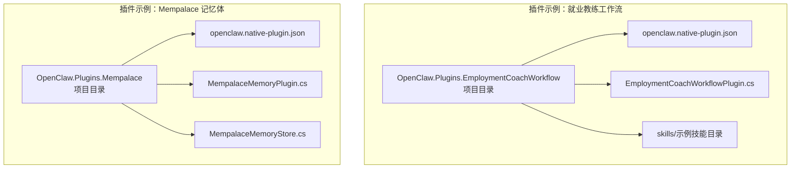
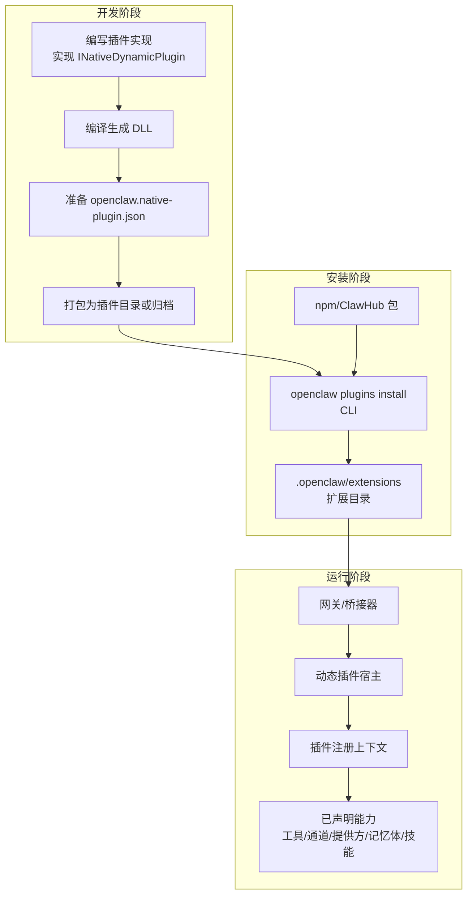
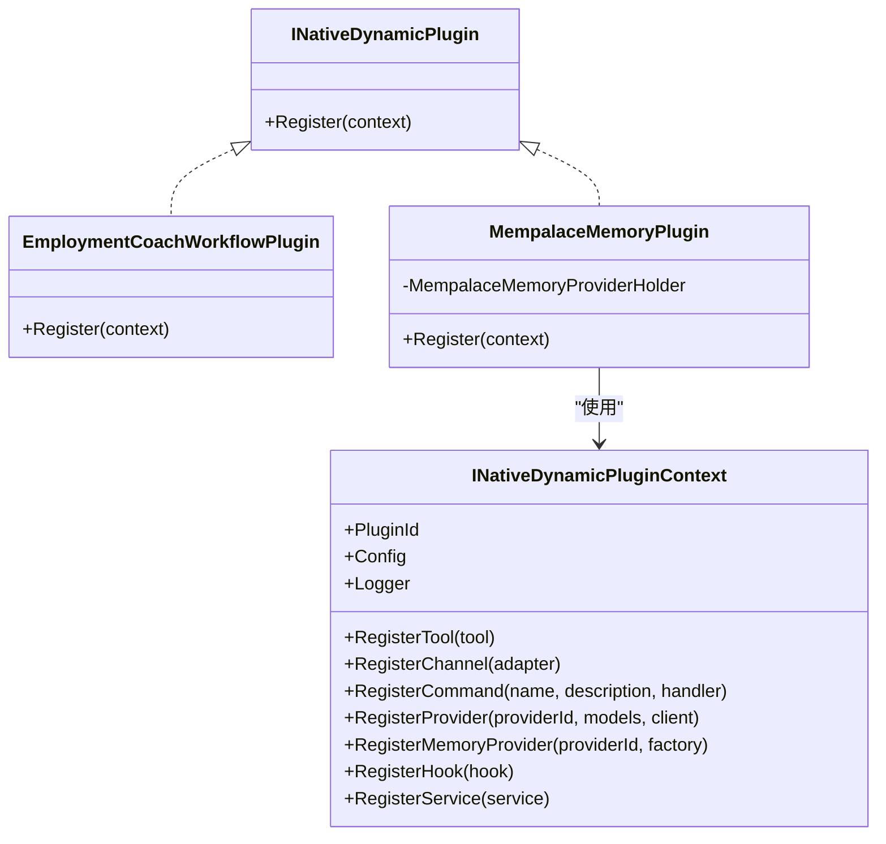
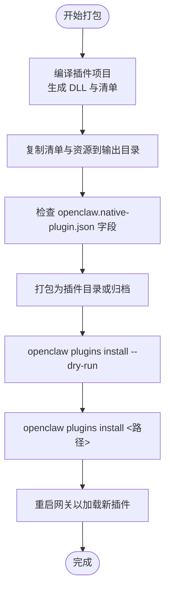
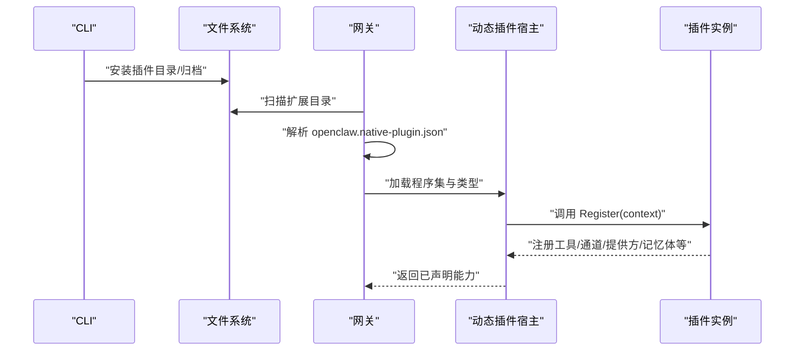
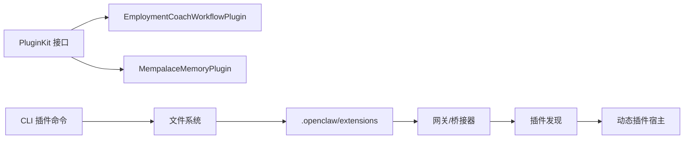

# 插件打包与部署

<cite>
**本文档引用的文件**
- [openclaw.native-plugin.json（就业教练工作流）](file://src/OpenClaw.Plugins.EmploymentCoachWorkflow/openclaw.native-plugin.json)
- [openclaw.native-plugin.json（Mempalace 记忆体）](file://src/OpenClaw.Plugins.Mempalace/openclaw.native-plugin.json)
- [EmploymentCoachWorkflowPlugin.cs](file://src/OpenClaw.Plugins.EmploymentCoachWorkflow/EmploymentCoachWorkflowPlugin.cs)
- [MempalaceMemoryPlugin.cs](file://src/OpenClaw.Plugins.Mempalace/MempalaceMemoryPlugin.cs)
- [INativeDynamicPlugin.cs](file://src/OpenClaw.PluginKit/INativeDynamicPlugin.cs)
- [PluginCommands.cs](file://src/OpenClaw.Cli/PluginCommands.cs)
- [PluginDiscovery.cs](file://src/OpenClaw.Core/Plugins/PluginDiscovery.cs)
- [PluginAdminSettingsService.cs](file://src/OpenClaw.Gateway/PluginAdminSettingsService.cs)
- [README.md（就业教练工作流）](file://src/OpenClaw.Plugins.EmploymentCoachWorkflow/README.md)
- [MempalaceMemoryStore.cs](file://src/OpenClaw.Plugins.Mempalace/MempalaceMemoryStore.cs)
- [COMPATIBILITY.md](file://docs/COMPATIBILITY.md)
</cite>

## 目录
1. [简介](#简介)
2. [项目结构](#项目结构)
3. [核心组件](#核心组件)
4. [架构总览](#架构总览)
5. [详细组件分析](#详细组件分析)
6. [依赖关系分析](#依赖关系分析)
7. [性能考量](#性能考量)
8. [故障排查指南](#故障排查指南)
9. [结论](#结论)
10. [附录](#附录)

## 简介
本指南面向原生插件开发者，系统讲解如何在 OpenClaw 中完成插件的打包、部署与运行时加载。内容覆盖：
- 插件包结构与配置文件规范
- openclaw.native-plugin.json 的字段定义与校验规则
- 打包流程：从编译到生成可分发包
- 安装、卸载与版本管理操作
- 运行时加载机制与权限控制
- 以 EmploymentCoachWorkflow 与 Mempalace 为例的实际配置与部署步骤

## 项目结构
OpenClaw 原生插件位于独立的项目中，每个插件包含：
- 插件实现程序集（.dll）
- 插件清单 openclaw.native-plugin.json
- 可选的技能目录（skills/）等资源

图表来源
- [openclaw.native-plugin.json（就业教练工作流）:1-11](file://src/OpenClaw.Plugins.EmploymentCoachWorkflow/openclaw.native-plugin.json#L1-L11)
- [openclaw.native-plugin.json（Mempalace 记忆体）:1-10](file://src/OpenClaw.Plugins.Mempalace/openclaw.native-plugin.json#L1-L10)
- [EmploymentCoachWorkflowPlugin.cs:1-11](file://src/OpenClaw.Plugins.EmploymentCoachWorkflow/EmploymentCoachWorkflowPlugin.cs#L1-L11)
- [MempalaceMemoryPlugin.cs:1-43](file://src/OpenClaw.Plugins.Mempalace/MempalaceMemoryPlugin.cs#L1-L43)
- [MempalaceMemoryStore.cs:1-374](file://src/OpenClaw.Plugins.Mempalace/MempalaceMemoryStore.cs#L1-L374)

章节来源
- [openclaw.native-plugin.json（就业教练工作流）:1-11](file://src/OpenClaw.Plugins.EmploymentCoachWorkflow/openclaw.native-plugin.json#L1-L11)
- [openclaw.native-plugin.json（Mempalace 记忆体）:1-10](file://src/OpenClaw.Plugins.Mempalace/openclaw.native-plugin.json#L1-L10)
- [README.md（就业教练工作流）:1-42](file://src/OpenClaw.Plugins.EmploymentCoachWorkflow/README.md#L1-L42)

## 核心组件
- 插件接口与上下文
  - INativeDynamicPlugin：插件入口，通过 Register 注册工具、通道、命令、模型提供方、内存提供方、钩子和服务。
  - INativeDynamicPluginContext：插件上下文，提供日志、配置、注册能力。
- 插件发现与加载
  - PluginDiscovery：扫描标准路径与自定义路径，解析 openclaw.plugin.json 或 package.json 的 openclaw.extensions，定位入口文件。
- CLI 插件管理
  - PluginCommands：支持从 npm/ClawHub 或本地源安装、卸载、列出、搜索插件；支持 --dry-run 预检。
- 网关插件管理
  - PluginAdminSettingsService：持久化插件启用状态与配置。

章节来源
- [INativeDynamicPlugin.cs:1-46](file://src/OpenClaw.PluginKit/INativeDynamicPlugin.cs#L1-L46)
- [PluginDiscovery.cs:1-632](file://src/OpenClaw.Core/Plugins/PluginDiscovery.cs#L1-L632)
- [PluginCommands.cs:1-792](file://src/OpenClaw.Cli/PluginCommands.cs#L1-L792)
- [PluginAdminSettingsService.cs:1-138](file://src/OpenClaw.Gateway/PluginAdminSettingsService.cs#L1-L138)

## 架构总览
OpenClaw 插件系统采用“清单驱动 + 动态加载”的模式。插件包内含 openclaw.native-plugin.json 指定程序集与类型，运行时由网关或桥接器加载并调用插件的 Register 方法完成能力注册。

图表来源
- [INativeDynamicPlugin.cs:1-46](file://src/OpenClaw.PluginKit/INativeDynamicPlugin.cs#L1-L46)
- [PluginCommands.cs:1-792](file://src/OpenClaw.Cli/PluginCommands.cs#L1-L792)
- [PluginDiscovery.cs:1-632](file://src/OpenClaw.Core/Plugins/PluginDiscovery.cs#L1-L632)

## 详细组件分析

### openclaw.native-plugin.json 清单规范
openclaw.native-plugin.json 是原生插件的元数据与装配描述文件。以下字段均来自 EmploymentCoachWorkflow 与 Mempalace 示例：

- id
  - 类型：字符串
  - 必填：是
  - 作用：插件唯一标识，用于启用/禁用与配置映射
  - 示例值：employment-coach-workflow、openclaw-mempalace-memory
- name
  - 类型：字符串
  - 必填：否
  - 作用：人类可读名称
- version
  - 类型：字符串
  - 必填：否
  - 作用：语义化版本号
- assemblyPath
  - 类型：字符串
  - 必填：是
  - 作用：相对插件根目录的托管程序集路径（.dll）
- typeName
  - 类型：字符串
  - 必填：是
  - 作用：程序集内插件类型的完全限定名（含程序集名）
- capabilities
  - 类型：字符串数组
  - 必填：否
  - 取值示例：["skills"]、["memory","tools"]
  - 作用：声明插件具备的能力集合
- skills
  - 类型：字符串数组
  - 必填：否
  - 作用：声明包含的技能目录（仅当 capabilities 包含 "skills" 时有效）
- jitOnly
  - 类型：布尔
  - 必填：否
  - 作用：是否仅支持 JIT 运行时模式（动态代码执行）

清单字段校验与限制
- 字段存在性与类型：必须符合 JSON Schema 支持的子集（见兼容性文档）
- 路径合法性：清单与程序集路径不得越出插件根目录
- 能力声明一致性：skills 字段需与 capabilities 中的 "skills" 对应
- 运行时模式：声明为 jitOnly 的插件在 AOT 模式下会被阻止加载

章节来源
- [openclaw.native-plugin.json（就业教练工作流）:1-11](file://src/OpenClaw.Plugins.EmploymentCoachWorkflow/openclaw.native-plugin.json#L1-L11)
- [openclaw.native-plugin.json（Mempalace 记忆体）:1-10](file://src/OpenClaw.Plugins.Mempalace/openclaw.native-plugin.json#L1-L10)
- [COMPATIBILITY.md:72-103](file://docs/COMPATIBILITY.md#L72-L103)

### 插件实现与注册
插件类需实现 INativeDynamicPlugin，并在 Register 中通过上下文注册所需能力。示例要点：
- 就业教练工作流插件：声明为动态原生插件，示例中注册为空（可扩展为技能/工具等）
- Mempalace 插件：注册内存提供方与工具，使用内存提供方持有者确保线程安全与延迟初始化

图表来源
- [INativeDynamicPlugin.cs:1-46](file://src/OpenClaw.PluginKit/INativeDynamicPlugin.cs#L1-L46)
- [EmploymentCoachWorkflowPlugin.cs:1-11](file://src/OpenClaw.Plugins.EmploymentCoachWorkflow/EmploymentCoachWorkflowPlugin.cs#L1-L11)
- [MempalaceMemoryPlugin.cs:1-43](file://src/OpenClaw.Plugins.Mempalace/MempalaceMemoryPlugin.cs#L1-L43)

章节来源
- [INativeDynamicPlugin.cs:1-46](file://src/OpenClaw.PluginKit/INativeDynamicPlugin.cs#L1-L46)
- [EmploymentCoachWorkflowPlugin.cs:1-11](file://src/OpenClaw.Plugins.EmploymentCoachWorkflow/EmploymentCoachWorkflowPlugin.cs#L1-L11)
- [MempalaceMemoryPlugin.cs:1-43](file://src/OpenClaw.Plugins.Mempalace/MempalaceMemoryPlugin.cs#L1-L43)

### 插件打包流程（从编译到包文件）
以 EmploymentCoachWorkflow 为例（Mempalace 同理）：
1. 编译
   - 使用 dotnet build 编译插件项目，生成 DLL 与清单文件
   - 清单与 skills/ 等资源会复制到输出目录
2. 准备插件包
   - 将输出目录作为插件目录，或将其打包为归档（如 .tgz）
   - 确保 openclaw.native-plugin.json 与程序集在同一目录
3. 验证
   - 使用 openclaw plugins list 检查插件是否被识别
   - 使用 openclaw plugins install --dry-run 预检能力与信任级别

图表来源
- [README.md（就业教练工作流）:13-42](file://src/OpenClaw.Plugins.EmploymentCoachWorkflow/README.md#L13-L42)
- [PluginCommands.cs:39-159](file://src/OpenClaw.Cli/PluginCommands.cs#L39-L159)

章节来源
- [README.md（就业教练工作流）:13-42](file://src/OpenClaw.Plugins.EmploymentCoachWorkflow/README.md#L13-L42)
- [PluginCommands.cs:39-159](file://src/OpenClaw.Cli/PluginCommands.cs#L39-L159)

### 安装、卸载与版本管理
- 安装
  - 从 npm/ClawHub：openclaw plugins install <包名>
  - 从本地目录：openclaw plugins install ./my-plugin
  - 从本地归档：openclaw plugins install ./my-plugin.tgz
  - 预检：openclaw plugins install <spec> --dry-run
- 卸载
  - openclaw plugins remove <插件名>
- 列表与搜索
  - openclaw plugins list
  - openclaw plugins search <关键词>
- 版本管理
  - 通过不同版本的包名或归档进行切换
  - 注意：安装新版本会替换旧版本目录（若同名）

章节来源
- [PluginCommands.cs:18-37](file://src/OpenClaw.Cli/PluginCommands.cs#L18-L37)
- [PluginCommands.cs:39-159](file://src/OpenClaw.Cli/PluginCommands.cs#L39-L159)
- [PluginCommands.cs:244-273](file://src/OpenClaw.Cli/PluginCommands.cs#L244-L273)
- [PluginCommands.cs:275-317](file://src/OpenClaw.Cli/PluginCommands.cs#L275-L317)
- [PluginCommands.cs:319-364](file://src/OpenClaw.Cli/PluginCommands.cs#L319-L364)

### 运行时加载与权限配置
- 加载机制
  - 网关启动时扫描插件目录（含扩展目录），解析清单并定位入口文件
  - 依据清单中的 assemblyPath 与 typeName 加载托管程序集与类型
  - 调用插件的 Register 方法完成能力注册
- 权限与信任
  - CLI 在安装前对插件进行兼容性检查与信任级别判定
  - 未声明结构化表面（channels/providers/skills/config_schema）的插件被视为“未受信任”
- JIT 与 AOT
  - 声明为 jitOnly 的插件在 AOT 模式下会被阻止加载
  - 网关需正确设置运行时模式以满足插件需求

图表来源
- [PluginDiscovery.cs:183-286](file://src/OpenClaw.Core/Plugins/PluginDiscovery.cs#L183-L286)
- [PluginCommands.cs:511-660](file://src/OpenClaw.Cli/PluginCommands.cs#L511-L660)
- [INativeDynamicPlugin.cs:11-29](file://src/OpenClaw.PluginKit/INativeDynamicPlugin.cs#L11-L29)

章节来源
- [PluginDiscovery.cs:18-63](file://src/OpenClaw.Core/Plugins/PluginDiscovery.cs#L18-L63)
- [PluginDiscovery.cs:183-286](file://src/OpenClaw.Core/Plugins/PluginDiscovery.cs#L183-L286)
- [PluginCommands.cs:511-660](file://src/OpenClaw.Cli/PluginCommands.cs#L511-L660)
- [COMPATIBILITY.md:72-103](file://docs/COMPATIBILITY.md#L72-L103)

### EmploymentCoachWorkflow 插件打包与部署示例
- 清单要点
  - id/name/version/assemblyPath/typeName/capabilities/skills/jitOnly
- 构建与启用
  - 编译后将输出目录加入 Plugins:DynamicNative:Load:Paths
  - 在 Plugins:DynamicNative:Entries 中启用该插件
- 运行时要求
  - 由于声明为 jitOnly，需确保网关处于 JIT 模式

章节来源
- [openclaw.native-plugin.json（就业教练工作流）:1-11](file://src/OpenClaw.Plugins.EmploymentCoachWorkflow/openclaw.native-plugin.json#L1-L11)
- [README.md（就业教练工作流）:13-42](file://src/OpenClaw.Plugins.EmploymentCoachWorkflow/README.md#L13-L42)

### Mempalace 插件打包与部署示例
- 清单要点
  - id/name/version/assemblyPath/typeName/capabilities/jitOnly
  - capabilities 包含 "memory" 与 "tools"
- 实现要点
  - Register 中注册内存提供方与知识图谱工具
  - 内存提供方持有者负责延迟初始化与线程安全
- 运行时要求
  - 由于声明为 jitOnly，需确保网关处于 JIT 模式

章节来源
- [openclaw.native-plugin.json（Mempalace 记忆体）:1-10](file://src/OpenClaw.Plugins.Mempalace/openclaw.native-plugin.json#L1-L10)
- [MempalaceMemoryPlugin.cs:1-43](file://src/OpenClaw.Plugins.Mempalace/MempalaceMemoryPlugin.cs#L1-L43)
- [MempalaceMemoryStore.cs:1-374](file://src/OpenClaw.Plugins.Mempalace/MempalaceMemoryStore.cs#L1-L374)

## 依赖关系分析
- 组件耦合
  - 插件实现依赖 PluginKit 接口
  - CLI 依赖插件发现与安装逻辑
  - 网关依赖插件发现与运行时加载
- 外部依赖
  - npm/ClawHub 用于在线安装
  - 文件系统用于扩展目录与插件包存储

图表来源
- [INativeDynamicPlugin.cs:1-46](file://src/OpenClaw.PluginKit/INativeDynamicPlugin.cs#L1-L46)
- [PluginCommands.cs:1-792](file://src/OpenClaw.Cli/PluginCommands.cs#L1-L792)
- [PluginDiscovery.cs:1-632](file://src/OpenClaw.Core/Plugins/PluginDiscovery.cs#L1-L632)

章节来源
- [INativeDynamicPlugin.cs:1-46](file://src/OpenClaw.PluginKit/INativeDynamicPlugin.cs#L1-L46)
- [PluginCommands.cs:1-792](file://src/OpenClaw.Cli/PluginCommands.cs#L1-L792)
- [PluginDiscovery.cs:1-632](file://src/OpenClaw.Core/Plugins/PluginDiscovery.cs#L1-L632)

## 性能考量
- 插件加载性能
  - 尽量减少插件数量与复杂度，避免在 Register 中执行重任务
  - 使用懒加载策略（如 MempalaceMemoryProviderHolder）降低初始化开销
- 存储与检索
  - 记忆体插件建议合理设置嵌入维度与候选上限，平衡精度与性能
- 运行时模式
  - JIT 模式适合需要动态代码执行的场景；AOT 模式更利于生产环境稳定性

## 故障排查指南
- 安装失败
  - 检查 openclaw.native-plugin.json 是否存在且格式正确
  - 使用 --dry-run 查看兼容性诊断与信任级别
- 加载失败
  - 确认 assemblyPath 与 typeName 正确
  - 确认插件根目录未越界（路径解析与符号链接处理）
- 运行时错误
  - 若声明为 jitOnly，确认网关运行于 JIT 模式
  - 检查插件注册的服务与工具是否冲突或缺失

章节来源
- [PluginCommands.cs:511-660](file://src/OpenClaw.Cli/PluginCommands.cs#L511-L660)
- [PluginDiscovery.cs:503-533](file://src/OpenClaw.Core/Plugins/PluginDiscovery.cs#L503-L533)
- [COMPATIBILITY.md:72-103](file://docs/COMPATIBILITY.md#L72-L103)

## 结论
通过遵循 openclaw.native-plugin.json 的规范、使用 CLI 进行安装与预检、并在网关层面正确配置运行时模式与启用项，可以稳定地完成原生插件的打包与部署。EmploymentCoachWorkflow 与 Mempalace 提供了清晰的实践范例，开发者可据此快速上手并扩展更多能力。

## 附录

### openclaw.native-plugin.json 字段对照表
- id：插件唯一标识
- name：显示名称
- version：版本号
- assemblyPath：托管程序集路径
- typeName：插件类型全名
- capabilities：能力列表（如 skills/memory/tools/…）
- skills：技能目录（当 capabilities 包含 skills 时）
- jitOnly：是否仅支持 JIT

章节来源
- [openclaw.native-plugin.json（就业教练工作流）:1-11](file://src/OpenClaw.Plugins.EmploymentCoachWorkflow/openclaw.native-plugin.json#L1-L11)
- [openclaw.native-plugin.json（Mempalace 记忆体）:1-10](file://src/OpenClaw.Plugins.Mempalace/openclaw.native-plugin.json#L1-L10)