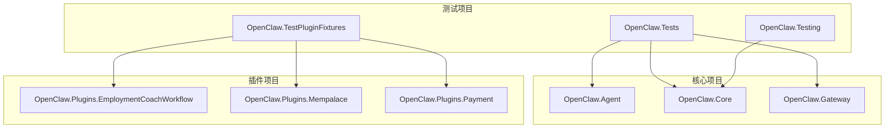
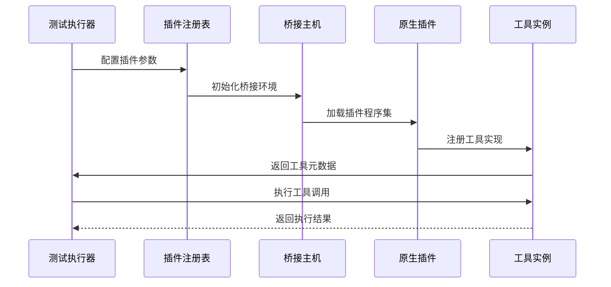
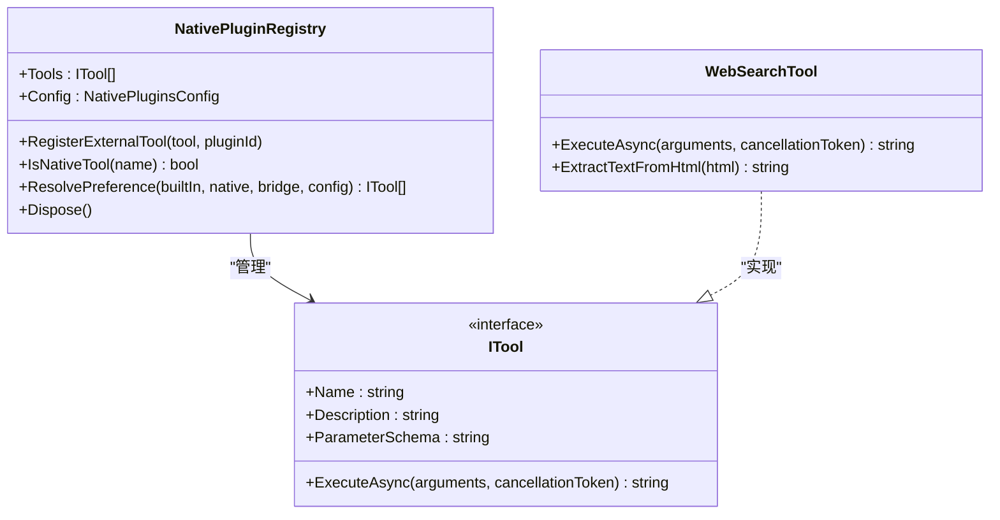
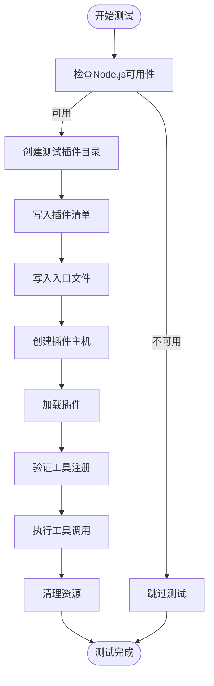
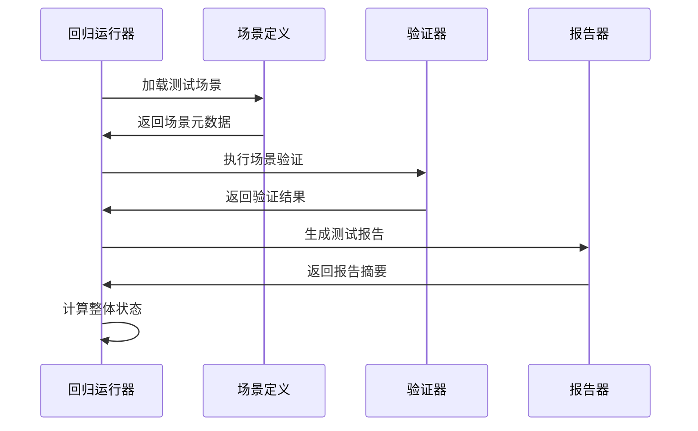
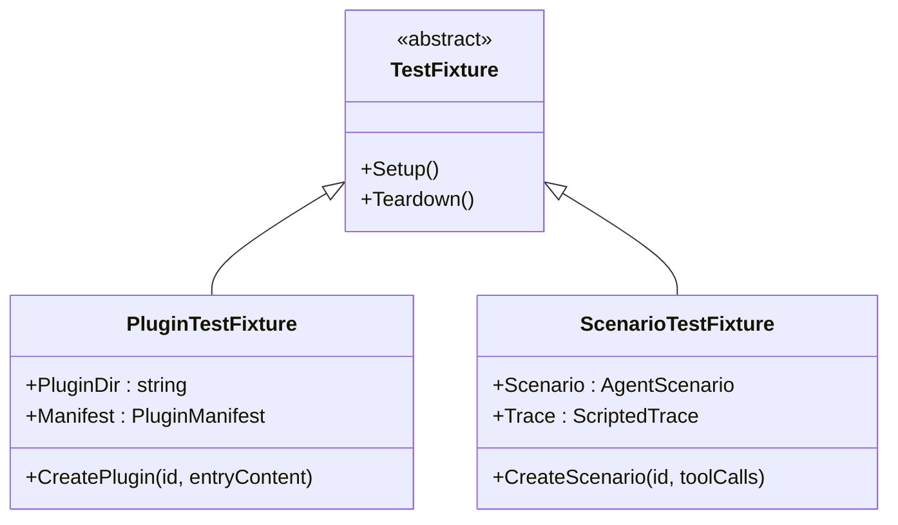
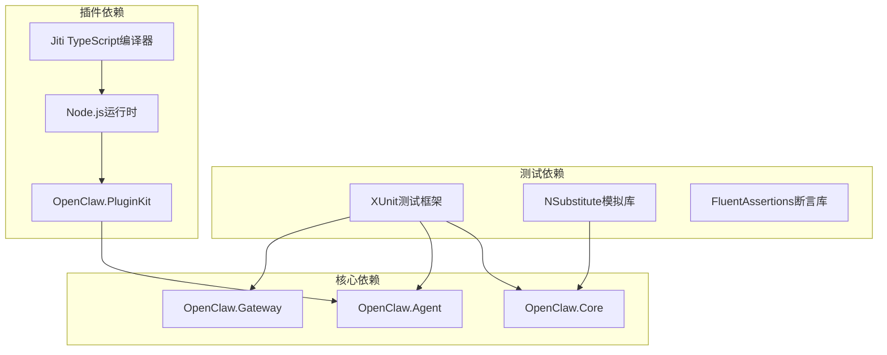

# 插件测试策略

<cite>
**本文档引用的文件**
- [NativePluginTests.cs](file://src/OpenClaw.Tests/NativePluginTests.cs)
- [PluginTests.cs](file://src/OpenClaw.Tests/PluginTests.cs)
- [PluginBridgeIntegrationTests.cs](file://src/OpenClaw.Tests/PluginBridgeIntegrationTests.cs)
- [HarnessRegressionTests.cs](file://src/OpenClaw.Tests/HarnessRegressionTests.cs)
- [HarnessRegressionRunner.cs](file://src/OpenClaw.Testing/HarnessRegressionRunner.cs)
- [ScenarioHarness.cs](file://src/OpenClaw.Testing/ScenarioHarness.cs)
- [FixturePlugins.cs](file://src/OpenClaw.TestPluginFixtures/FixturePlugins.cs)
- [AgentScenarioHarnessTests.cs](file://src/OpenClaw.Tests/AgentScenarioHarnessTests.cs)
- [Directory.Build.props](file://Directory.Build.props)
- [.github/PULL_REQUEST_TEMPLATE.md](file://.github/PULL_REQUEST_TEMPLATE.md)
</cite>

## 目录
1. [引言](#引言)
2. [项目结构](#项目结构)
3. [核心组件](#核心组件)
4. [架构概览](#架构概览)
5. [详细组件分析](#详细组件分析)
6. [依赖关系分析](#依赖关系分析)
7. [性能考虑](#性能考虑)
8. [故障排除指南](#故障排除指南)
9. [结论](#结论)
10. [附录](#附录)

## 引言

本指南为原生插件开发提供全面的测试策略，涵盖单元测试、集成测试和端到端测试的实施方法。基于现有插件测试案例，展示如何编写有效的测试用例来验证插件功能，包括测试环境搭建、测试数据准备和模拟对象的使用。文档还包含测试覆盖率要求、性能测试方法和回归测试策略，并提供测试工具链配置和持续集成中的测试自动化实践。

## 项目结构

该项目采用多项目结构，测试相关的核心模块包括：

**图表来源**
- [NativePluginTests.cs:1-953](file://src/OpenClaw.Tests/NativePluginTests.cs#L1-L953)
- [PluginTests.cs:1-394](file://src/OpenClaw.Tests/PluginTests.cs#L1-L394)

**章节来源**
- [NativePluginTests.cs:1-953](file://src/OpenClaw.Tests/NativePluginTests.cs#L1-L953)
- [PluginTests.cs:1-394](file://src/OpenClaw.Tests/PluginTests.cs#L1-L394)

## 核心组件

### 测试框架与配置

项目使用XUnit作为主要测试框架，配合NSubstitute进行模拟对象管理。构建系统配置支持.NET 10.0，启用严格警告处理和可空引用类型检查。

### 插件测试基础设施

测试系统包含三个核心层次：

1. **原生插件测试**：验证本地编译的C#插件
2. **桥接插件测试**：验证JavaScript/TypeScript插件通过Node.js桥接
3. **综合回归测试**：端到端场景驱动的测试执行

**章节来源**
- [Directory.Build.props:1-41](file://Directory.Build.props#L1-L41)
- [FixturePlugins.cs:1-80](file://src/OpenClaw.TestPluginFixtures/FixturePlugins.cs#L1-L80)

## 架构概览

**图表来源**
- [PluginBridgeIntegrationTests.cs:1-1931](file://src/OpenClaw.Tests/PluginBridgeIntegrationTests.cs#L1-L1931)
- [NativePluginTests.cs:1-953](file://src/OpenClaw.Tests/NativePluginTests.cs#L1-L953)

## 详细组件分析

### 原生插件测试策略

原生插件测试专注于验证C#编写的插件功能，包括工具注册、配置解析和资源管理。

#### 插件注册表测试

**图表来源**
- [NativePluginTests.cs:9-244](file://src/OpenClaw.Tests/NativePluginTests.cs#L9-L244)

**章节来源**
- [NativePluginTests.cs:9-244](file://src/OpenClaw.Tests/NativePluginTests.cs#L9-L244)

#### 工具执行测试模式

测试覆盖以下关键场景：

1. **配置驱动的功能启用**：验证不同配置组合下的工具注册行为
2. **参数验证和错误处理**：确保输入参数的正确性和错误消息的准确性
3. **资源生命周期管理**：测试工具和资源的正确释放
4. **安全策略验证**：验证危险操作的防护机制

**章节来源**
- [NativePluginTests.cs:367-772](file://src/OpenClaw.Tests/NativePluginTests.cs#L367-L772)

### 桥接插件测试策略

桥接插件测试验证JavaScript/TypeScript插件通过Node.js桥接的完整流程。

#### 插件发现与加载

**图表来源**
- [PluginBridgeIntegrationTests.cs:38-127](file://src/OpenClaw.Tests/PluginBridgeIntegrationTests.cs#L38-L127)

**章节来源**
- [PluginBridgeIntegrationTests.cs:1-1931](file://src/OpenClaw.Tests/PluginBridgeIntegrationTests.cs#L1-L1931)

#### 配置验证测试

测试确保插件配置在桥接启动前得到验证：

- **JSON Schema验证**：验证配置结构的正确性
- **枚举值约束**：确保配置值在允许范围内
- **必需字段检查**：验证必需配置项的存在
- **错误报告**：提供结构化的诊断信息

**章节来源**
- [PluginBridgeIntegrationTests.cs:400-575](file://src/OpenClaw.Tests/PluginBridgeIntegrationTests.cs#L400-L575)

### 回归测试框架

回归测试框架提供端到端的场景驱动测试执行能力。

#### 场景执行流水线

**图表来源**
- [HarnessRegressionRunner.cs:18-68](file://src/OpenClaw.Testing/HarnessRegressionRunner.cs#L18-L68)

**章节来源**
- [HarnessRegressionRunner.cs:1-383](file://src/OpenClaw.Testing/HarnessRegressionRunner.cs#L1-L383)

#### 场景质量门禁

场景测试包含多个质量门禁检查：

- **重复ID检测**：防止场景ID重复
- **高风险场景验证**：确保高风险场景声明适当的验证器
- **脚本完整性**：验证场景必须包含脚本化轨迹
- **工具调用约束**：检查工具使用的限制条件

**章节来源**
- [AgentScenarioHarnessTests.cs:20-46](file://src/OpenClaw.Tests/AgentScenarioHarnessTests.cs#L20-L46)

### 测试数据与模拟对象

#### 测试夹具设计

测试夹具提供可重用的测试基础设施：

**图表来源**
- [FixturePlugins.cs:8-80](file://src/OpenClaw.TestPluginFixtures/FixturePlugins.cs#L8-L80)

**章节来源**
- [FixturePlugins.cs:1-80](file://src/OpenClaw.TestPluginFixtures/FixturePlugins.cs#L1-L80)

## 依赖关系分析

**图表来源**
- [PluginBridgeIntegrationTests.cs:1-1931](file://src/OpenClaw.Tests/PluginBridgeIntegrationTests.cs#L1-L1931)
- [NativePluginTests.cs:1-953](file://src/OpenClaw.Tests/NativePluginTests.cs#L1-L953)

**章节来源**
- [PluginBridgeIntegrationTests.cs:1-1931](file://src/OpenClaw.Tests/PluginBridgeIntegrationTests.cs#L1-L1931)
- [NativePluginTests.cs:1-953](file://src/OpenClaw.Tests/NativePluginTests.cs#L1-L953)

## 性能考虑

### 内存使用监控

测试框架包含内存使用监控功能，用于评估插件对系统资源的影响：

- **进程内存快照**：捕获宿主进程和子进程的内存使用情况
- **垃圾回收协调**：在测量前后强制垃圾回收以获得稳定结果
- **阈值验证**：确保插件内存使用在合理范围内

**章节来源**
- [PluginBridgeIntegrationTests.cs:38-93](file://src/OpenClaw.Tests/PluginBridgeIntegrationTests.cs#L38-L93)

### 并发测试控制

测试集合定义确保某些测试的串行执行，避免资源竞争：

- **环境变量集合**：控制环境变量相关的测试顺序
- **动态提供者集合**：管理提供者的并发访问
- **测试隔离**：确保测试间的独立性

**章节来源**
- [PluginBridgeIntegrationTests.cs:20-36](file://src/OpenClaw.Tests/PluginBridgeIntegrationTests.cs#L20-L36)

## 故障排除指南

### 常见问题诊断

#### 插件加载失败

当插件无法加载时，检查以下方面：

1. **Node.js环境**：确认Node.js版本兼容性
2. **Jiti依赖**：验证TypeScript编译器可用性
3. **文件权限**：检查插件文件的读取权限
4. **路径格式**：验证Windows绝对路径的正确处理

**章节来源**
- [PluginBridgeIntegrationTests.cs:258-289](file://src/OpenClaw.Tests/PluginBridgeIntegrationTests.cs#L258-L289)

#### 配置验证错误

配置验证失败通常由以下原因引起：

- **JSON Schema不匹配**：检查配置结构是否符合定义
- **必需字段缺失**：确认所有必需配置项都已设置
- **枚举值无效**：验证配置值在允许列表中
- **额外属性**：移除不允许的配置项

**章节来源**
- [PluginBridgeIntegrationTests.cs:465-502](file://src/OpenClaw.Tests/PluginBridgeIntegrationTests.cs#L465-L502)

### 调试技巧

1. **启用详细日志**：增加测试输出的详细程度
2. **临时文件检查**：查看测试过程中创建的临时文件
3. **网络连接测试**：验证外部服务的可达性
4. **权限验证**：确认测试用户具有必要的系统权限

## 结论

本测试策略指南提供了原生插件开发的全面测试方法论。通过结合单元测试、集成测试和端到端测试，可以确保插件的质量和可靠性。测试框架的设计考虑了性能监控、资源管理和错误处理等关键方面，为插件开发提供了坚实的基础。

建议在实际项目中：
- 建立完整的测试金字塔，从单元测试到端到端测试逐层覆盖
- 实施持续集成，自动执行测试套件
- 定期审查测试覆盖率，重点关注边界条件和异常路径
- 建立性能基线，监控插件对系统资源的影响

## 附录

### 测试覆盖率要求

根据项目配置，建议的测试覆盖率目标：
- **单元测试**：至少80%的代码行覆盖率
- **集成测试**：关键业务流程100%覆盖
- **端到端测试**：核心用户场景100%覆盖
- **回归测试**：所有已知问题的回归保护

### 持续集成配置

测试自动化实践包括：
- 自动化测试执行和报告生成
- 失败测试的自动重试机制
- 性能回归检测和警报
- 测试结果的存储和历史对比

**章节来源**
- [.github/PULL_REQUEST_TEMPLATE.md:23-47](file://.github/PULL_REQUEST_TEMPLATE.md#L23-L47)