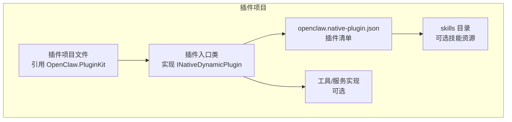
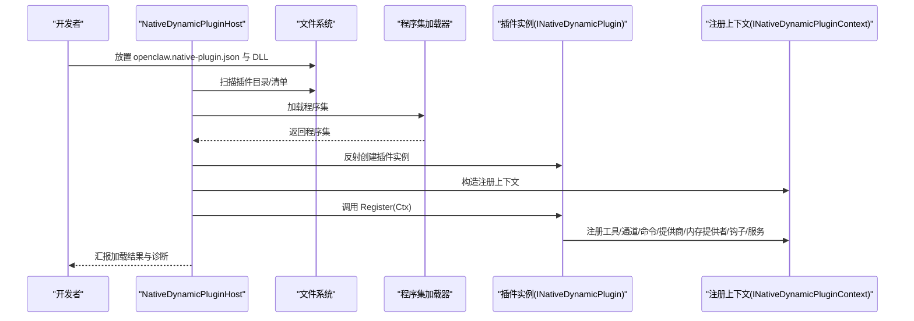
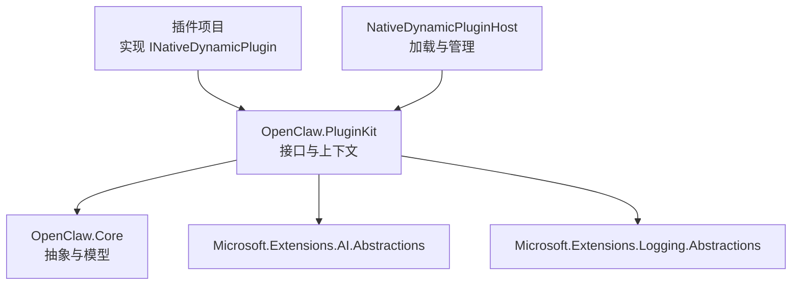

# 插件项目创建

<cite>
**本文档引用的文件**
- [INativeDynamicPlugin.cs](file://src/OpenClaw.PluginKit/INativeDynamicPlugin.cs)
- [OpenClaw.PluginKit.csproj](file://src/OpenClaw.PluginKit/OpenClaw.PluginKit.csproj)
- [EmploymentCoachWorkflowPlugin.cs](file://src/OpenClaw.Plugins.EmploymentCoachWorkflow/EmploymentCoachWorkflowPlugin.cs)
- [openclaw.native-plugin.json](file://src/OpenClaw.Plugins.EmploymentCoachWorkflow/openclaw.native-plugin.json)
- [MempalaceMemoryPlugin.cs](file://src/OpenClaw.Plugins.Mempalace/MempalaceMemoryPlugin.cs)
- [FixturePlugins.cs](file://src/OpenClaw.TestPluginFixtures/FixturePlugins.cs)
- [NativeDynamicPluginHost.cs](file://src/OpenClaw.Agent/Plugins/NativeDynamicPluginHost.cs)
- [PluginCommands.cs](file://src/OpenClaw.Cli/PluginCommands.cs)
- [README.md](file://README.md)
- [QUICKSTART.md](file://QUICKSTART.md)
</cite>

## 目录
1. [简介](#简介)
2. [项目结构](#项目结构)
3. [核心组件](#核心组件)
4. [架构总览](#架构总览)
5. [详细组件分析](#详细组件分析)
6. [依赖关系分析](#依赖关系分析)
7. [性能考虑](#性能考虑)
8. [故障排除指南](#故障排除指南)
9. [结论](#结论)
10. [附录](#附录)

## 简介
本指南面向希望在 OpenClaw.NET 中创建“原生动态插件”（Native Dynamic Plugin）的开发者。原生动态插件是运行在网关进程内的 .NET 插件，通过 JIT 仅模式加载，支持在扩展兼容性运行时（jit）中注册工具、通道、命令、模型提供商、内存提供者、钩子与服务等能力。本指南将覆盖：
- 如何基于 OpenClaw.PluginKit 创建新项目
- 项目模板选择、NuGet 包引用与基础配置
- 实现 INativeDynamicPlugin 接口与 Register 方法的使用
- 完整的项目创建流程：从 dotnet new 到项目结构配置
- 插件项目的基本结构示例与命名约定
- 开发环境要求、SDK 版本兼容性与最佳实践

## 项目结构
原生动态插件项目遵循以下典型结构：
- 项目文件：声明对 OpenClaw.PluginKit 的引用
- 插件入口类：实现 INativeDynamicPlugin 接口
- 插件清单：openclaw.native-plugin.json，描述插件元数据、入口类型与能力
- 可选：技能目录（skills），用于打包技能资源
- 可选：其他工具或服务实现

图表来源
- [INativeDynamicPlugin.cs:11-29](file://src/OpenClaw.PluginKit/INativeDynamicPlugin.cs#L11-L29)
- [openclaw.native-plugin.json:1-11](file://src/OpenClaw.Plugins.EmploymentCoachWorkflow/openclaw.native-plugin.json#L1-L11)

章节来源
- [INativeDynamicPlugin.cs:11-29](file://src/OpenClaw.PluginKit/INativeDynamicPlugin.cs#L11-L29)
- [openclaw.native-plugin.json:1-11](file://src/OpenClaw.Plugins.EmploymentCoachWorkflow/openclaw.native-plugin.json#L1-L11)

## 核心组件
- INativeDynamicPlugin 接口：定义插件生命周期中的注册点，通过 Register 方法向上下文注册各类能力。
- INativeDynamicPluginContext：提供访问插件标识、配置、日志器以及注册工具、通道、命令、提供商、内存提供者、钩子和服务的能力。
- INativeDynamicPluginService：可选的服务接口，允许插件在加载后启动/停止自定义服务。
- NativeDynamicMemoryProviderContext：用于内存提供者的工厂方法参数，包含插件 ID、提供商 ID、配置、网关配置、指标与日志器。

章节来源
- [INativeDynamicPlugin.cs:11-46](file://src/OpenClaw.PluginKit/INativeDynamicPlugin.cs#L11-L46)

## 架构总览
原生动态插件通过 NativeDynamicPluginHost 在网关进程中加载与管理。加载流程概览如下：

图表来源
- [NativeDynamicPluginHost.cs:210-305](file://src/OpenClaw.Agent/Plugins/NativeDynamicPluginHost.cs#L210-L305)
- [openclaw.native-plugin.json:1-11](file://src/OpenClaw.Plugins.EmploymentCoachWorkflow/openclaw.native-plugin.json#L1-L11)

章节来源
- [NativeDynamicPluginHost.cs:64-169](file://src/OpenClaw.Agent/Plugins/NativeDynamicPluginHost.cs#L64-L169)

## 详细组件分析

### INativeDynamicPlugin 接口与 Register 方法
- Register 方法是插件能力注册的唯一入口。上下文对象提供以下注册能力：
  - RegisterTool：注册工具
  - RegisterChannel：注册通道适配器
  - RegisterCommand：注册命令处理器
  - RegisterProvider：注册模型提供商
  - RegisterMemoryProvider：注册内存提供者工厂
  - RegisterHook：注册工具钩子
  - RegisterService：注册可启动/停止的服务
- 上下文还提供插件标识、配置与日志器，便于插件按需读取配置并记录日志。

章节来源
- [INativeDynamicPlugin.cs:16-29](file://src/OpenClaw.PluginKit/INativeDynamicPlugin.cs#L16-L29)

### 插件清单 openclaw.native-plugin.json
清单文件用于描述插件元数据与入口信息，关键字段包括：
- id/name/version：插件标识、显示名称与版本
- assemblyPath/typeName：程序集路径与入口类型全名
- capabilities/skills/jitOnly：声明插件能力、技能目录与是否仅 JIT 模式可用
- 可选：minHostVersion/pluginApiVersion 等版本约束

章节来源
- [openclaw.native-plugin.json:1-11](file://src/OpenClaw.Plugins.EmploymentCoachWorkflow/openclaw.native-plugin.json#L1-L11)

### 示例：EmploymentCoachWorkflowPlugin
该示例展示了最小化实现：实现 INativeDynamicPlugin 并在 Register 中留空（可用于占位或后续扩展）。

章节来源
- [EmploymentCoachWorkflowPlugin.cs:5-10](file://src/OpenClaw.Plugins.EmploymentCoachWorkflow/EmploymentCoachWorkflowPlugin.cs#L5-L10)

### 示例：MempalaceMemoryPlugin
该示例展示了如何在 Register 中：
- 注册内存提供者工厂
- 注册工具以使用内存存储
- 使用内部持有者确保线程安全与单例

章节来源
- [MempalaceMemoryPlugin.cs:6-19](file://src/OpenClaw.Plugins.Mempalace/MempalaceMemoryPlugin.cs#L6-L19)

### 示例：FixturePlugins（工具与命令）
该示例展示了：
- 注册工具与命令
- 从配置读取参数并注册内存提供者
- 注册可启动/停止的服务

章节来源
- [FixturePlugins.cs:8-33](file://src/OpenClaw.TestPluginFixtures/FixturePlugins.cs#L8-L33)

### 原生动态插件宿主 NativeDynamicPluginHost
- 发现与过滤：扫描插件目录，解析清单，校验重复 ID、程序集路径合法性与兼容性
- 运行时模式：在 AOT 模式下拒绝 JIT 仅能力的插件；在 JIT 模式下加载
- 加载与注册：反射创建插件实例，调用 Register，收集诊断并保留已注册项
- 清理与释放：插件卸载时停止服务、释放通道适配器与内存提供者注册

章节来源
- [NativeDynamicPluginHost.cs:469-649](file://src/OpenClaw.Agent/Plugins/NativeDynamicPluginHost.cs#L469-L649)
- [NativeDynamicPluginHost.cs:210-305](file://src/OpenClaw.Agent/Plugins/NativeDynamicPluginHost.cs#L210-L305)
- [NativeDynamicPluginHost.cs:656-698](file://src/OpenClaw.Agent/Plugins/NativeDynamicPluginHost.cs#L656-L698)

## 依赖关系分析
- 插件项目依赖 OpenClaw.PluginKit，后者再依赖 OpenClaw.Core 与 Microsoft.Extensions.AI.Abstractions、Microsoft.Extensions.Logging.Abstractions
- 插件清单声明入口类型与程序集路径，宿主通过反射加载并验证兼容性

图表来源
- [OpenClaw.PluginKit.csproj:9-13](file://src/OpenClaw.PluginKit/OpenClaw.PluginKit.csproj#L9-L13)
- [INativeDynamicPlugin.cs:1-8](file://src/OpenClaw.PluginKit/INativeDynamicPlugin.cs#L1-L8)
- [NativeDynamicPluginHost.cs:1-12](file://src/OpenClaw.Agent/Plugins/NativeDynamicPluginHost.cs#L1-L12)

章节来源
- [OpenClaw.PluginKit.csproj:1-15](file://src/OpenClaw.PluginKit/OpenClaw.PluginKit.csproj#L1-L15)

## 性能考虑
- JIT 仅模式：原生动态插件仅在 JIT 模式下加载，避免 AOT 环境下的动态代码限制
- 服务生命周期：通过 INativeDynamicPluginService 启动/停止服务，确保资源正确回收
- 内存提供者：使用工厂模式延迟创建与共享，减少不必要的初始化开销
- 诊断与日志：宿主会输出结构化诊断日志，便于定位性能瓶颈与兼容性问题

## 故障排除指南
常见问题与排查要点：
- 程序集路径不在插件根目录内：宿主会报告“assembly_outside_root”，请确保 assemblyPath 解析到插件根目录内
- 程序集不存在：宿主会报告“assembly_not_found”，请检查程序集路径与构建产物
- 最低宿主版本不满足：宿主会报告“host_version_too_old”，请升级网关版本
- 插件 API 版本不匹配：宿主会报告“plugin_api_version_mismatch”，请保持 OpenClaw.PluginKit 版本一致
- AOT 模式下加载失败：宿主会报告“jit_mode_required”，请切换到 JIT 模式或移除 JIT 仅能力
- 重复插件 ID：宿主会报告“duplicate_plugin_id”，请修改插件 ID 避免冲突

章节来源
- [NativeDynamicPluginHost.cs:520-649](file://src/OpenClaw.Agent/Plugins/NativeDynamicPluginHost.cs#L520-L649)
- [NativeDynamicPluginHost.cs:700-782](file://src/OpenClaw.Agent/Plugins/NativeDynamicPluginHost.cs#L700-L782)

## 结论
通过 OpenClaw.PluginKit，开发者可以快速创建原生动态插件并在 JIT 模式下注册丰富的运行时能力。遵循清单规范、正确的项目结构与命名约定，并结合宿主提供的诊断日志，能够高效完成插件开发与集成。

## 附录

### 开发环境要求与 SDK 兼容性
- .NET SDK：建议使用 .NET 10（与仓库中使用的 SDK 版本一致）
- 运行时模式：若需要原生动态插件与扩展桥接能力，请使用 JIT 模式
- Node.js：如需 JS/TS 插件桥接，建议安装 Node.js 20+

章节来源
- [QUICKSTART.md:5-9](file://QUICKSTART.md#L5-L9)
- [README.md:325-342](file://README.md#L325-L342)

### 项目模板与创建流程（从 dotnet new 到配置）
- 创建项目：使用任意 .NET 类库模板创建插件项目
- 引用包：添加对 OpenClaw.PluginKit 的项目引用或包引用
- 实现接口：创建实现 INativeDynamicPlugin 的入口类
- 编写清单：在项目根目录创建 openclaw.native-plugin.json，填写 id/name/version、assemblyPath、typeName、capabilities 等
- 技能目录：如需打包技能，创建 skills 子目录并放置 SKILL.md
- 构建与部署：构建项目生成 DLL，将 DLL 与清单复制到网关的插件目录（例如 ~/.openclaw/native-plugins 或工作区目录）

章节来源
- [INativeDynamicPlugin.cs:11-29](file://src/OpenClaw.PluginKit/INativeDynamicPlugin.cs#L11-L29)
- [openclaw.native-plugin.json:1-11](file://src/OpenClaw.Plugins.EmploymentCoachWorkflow/openclaw.native-plugin.json#L1-L11)

### INativeDynamicPluginContext 能力一览
- 工具注册：RegisterTool(ITool)
- 通道注册：RegisterChannel(IChannelAdapter)
- 命令注册：RegisterCommand(string name, string description, Func<string, CancellationToken, Task<string>> handler)
- 提供商注册：RegisterProvider(string providerId, string[] models, IChatClient)
- 内存提供者注册：RegisterMemoryProvider(string providerId, Func<NativeDynamicMemoryProviderContext, IMemoryStore> factory)
- 钩子注册：RegisterHook(IToolHook)
- 服务注册：RegisterService(INativeDynamicPluginService)

章节来源
- [INativeDynamicPlugin.cs:22-28](file://src/OpenClaw.PluginKit/INativeDynamicPlugin.cs#L22-L28)

### 命名约定与清单字段建议
- 插件 ID：使用短横线分隔的小写标识，避免特殊字符
- 程序集路径：相对路径指向项目输出的 DLL
- 入口类型：完整类型名（含程序集名）
- 能力声明：根据实际注册的能力填写 capabilities，如 ["tools","commands","memory","providers","channels"]
- 技能目录：skills 字段指向相对路径，确保路径在插件根目录内

章节来源
- [openclaw.native-plugin.json:1-11](file://src/OpenClaw.Plugins.EmploymentCoachWorkflow/openclaw.native-plugin.json#L1-L11)
- [NativeDynamicPluginHost.cs:398-436](file://src/OpenClaw.Agent/Plugins/NativeDynamicPluginHost.cs#L398-L436)

### CLI 插件管理（参考）
- 安装/卸载/列出/搜索插件：通过 CLI 的 plugins 子命令进行管理
- 扩展目录：默认位于用户主目录下的 ~/.openclaw/extensions（可通过 --global 切换）

章节来源
- [PluginCommands.cs:18-37](file://src/OpenClaw.Cli/PluginCommands.cs#L18-L37)
- [PluginCommands.cs:368-382](file://src/OpenClaw.Cli/PluginCommands.cs#L368-L382)