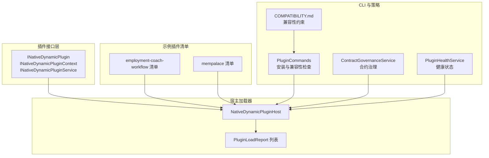
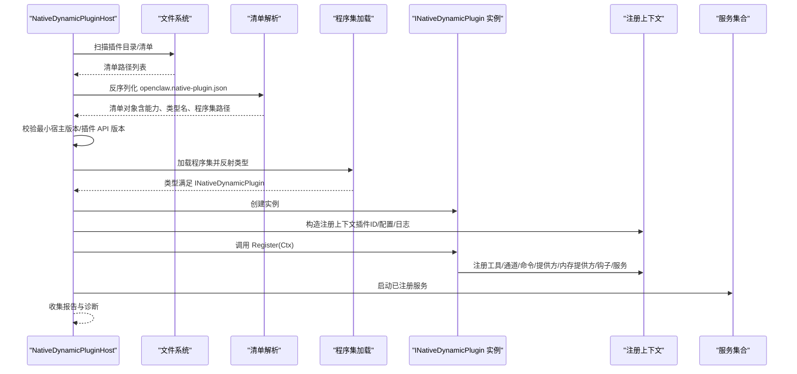
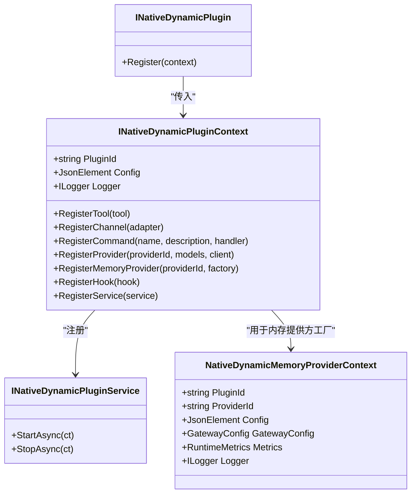
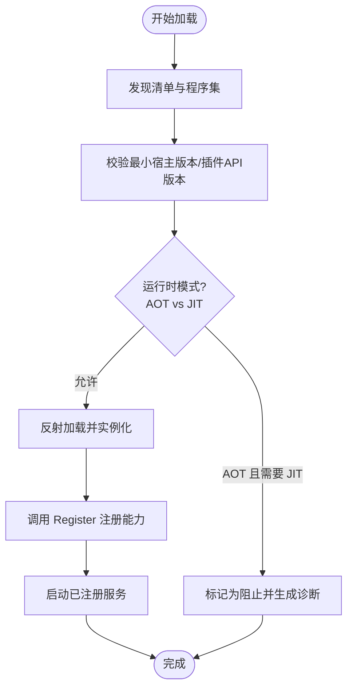
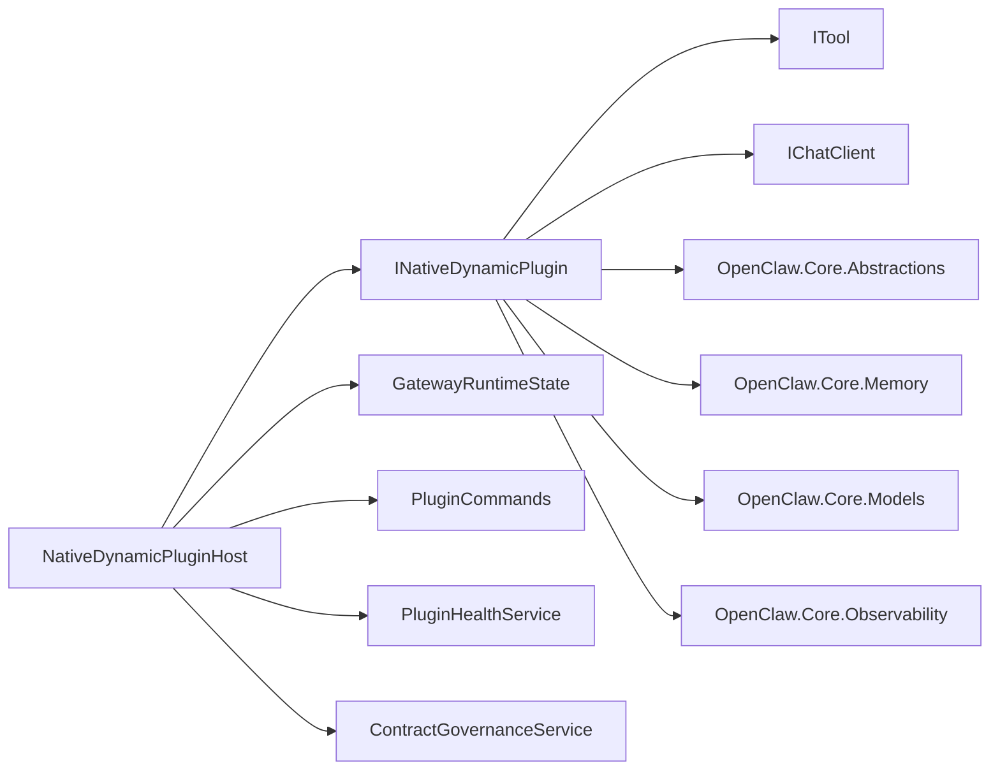

# 插件接口规范

<cite>
**本文引用的文件**
- [INativeDynamicPlugin.cs](file://src/OpenClaw.PluginKit/INativeDynamicPlugin.cs)
- [NativeDynamicPluginHost.cs](file://src/OpenClaw.Agent/Plugins/NativeDynamicPluginHost.cs)
- [openclaw.native-plugin.json（就业教练工作流）](file://src/OpenClaw.Plugins.EmploymentCoachWorkflow/openclaw.native-plugin.json)
- [openclaw.native-plugin.json（MemPalace 记忆体）](file://src/OpenClaw.Plugins.Mempalace/openclaw.native-plugin.json)
- [PluginCommands.cs](file://src/OpenClaw.Cli/PluginCommands.cs)
- [COMPATIBILITY.md](file://docs/COMPATIBILITY.md)
- [PluginBridgeIntegrationTests.cs](file://src/OpenClaw.Tests/PluginBridgeIntegrationTests.cs)
- [NativeDynamicPluginHostTests.cs](file://src/OpenClaw.Tests/NativeDynamicPluginHostTests.cs)
- [CoreServicesExtensionsTests.cs](file://src/OpenClaw.Tests/CoreServicesExtensionsTests.cs)
- [ContractGovernanceService.cs](file://src/OpenClaw.Gateway/ContractGovernanceService.cs)
- [PluginHealthService.cs](file://src/OpenClaw.Gateway/PluginHealthService.cs)
- [MemoryGetTool.cs](file://src/OpenClaw.Agent/Tools/MemoryGetTool.cs)
</cite>

## 目录
1. [简介](#简介)
2. [项目结构](#项目结构)
3. [核心组件](#核心组件)
4. [架构总览](#架构总览)
5. [详细组件分析](#详细组件分析)
6. [依赖关系分析](#依赖关系分析)
7. [性能考虑](#性能考虑)
8. [故障排查指南](#故障排查指南)
9. [结论](#结论)
10. [附录](#附录)

## 简介
本文件面向原生动态插件接口规范，系统阐述 INativeDynamicPlugin 接口的设计理念、方法签名与参数规范；解释插件生命周期回调、事件订阅机制与异步处理模式；覆盖插件注册流程、能力声明格式与元数据规范；并提供接口实现的最佳实践、错误处理策略与性能优化建议。同时，文档涵盖接口版本兼容性、向后兼容性保证与升级迁移指南，帮助开发者在不同运行时模式（如 JIT/AOT）下安全地扩展系统能力。

## 项目结构
围绕原生动态插件体系，仓库中关键位置如下：
- 接口定义：OpenClaw.PluginKit 提供 INativeDynamicPlugin 及上下文接口
- 宿主加载器：OpenClaw.Agent.Plugins 的 NativeDynamicPluginHost 负责发现、校验、装配与生命周期管理
- 示例插件清单：EmploymentCoachWorkflow 与 Mempalace 插件展示能力声明与 JIT 限定
- CLI 安装与兼容性检查：OpenClaw.Cli 的 PluginCommands 对插件进行安装前检查与信任级别判定
- 兼容性与策略：COMPATIBILITY.md、ContractGovernanceService、PluginHealthService 等提供运行时约束与健康状态管理
- 测试用例：NativeDynamicPluginHostTests、PluginBridgeIntegrationTests、CoreServicesExtensionsTests 等验证行为边界与兼容性

图表来源
- [INativeDynamicPlugin.cs:11-46](file://src/OpenClaw.PluginKit/INativeDynamicPlugin.cs#L11-L46)
- [NativeDynamicPluginHost.cs:19-62](file://src/OpenClaw.Agent/Plugins/NativeDynamicPluginHost.cs#L19-L62)
- [openclaw.native-plugin.json（就业教练工作流）:1-11](file://src/OpenClaw.Plugins.EmploymentCoachWorkflow/openclaw.native-plugin.json#L1-L11)
- [openclaw.native-plugin.json（MemPalace 记忆体）:1-10](file://src/OpenClaw.Plugins.Mempalace/openclaw.native-plugin.json#L1-L10)
- [PluginCommands.cs:569-729](file://src/OpenClaw.Cli/PluginCommands.cs#L569-L729)
- [COMPATIBILITY.md:72-103](file://docs/COMPATIBILITY.md#L72-L103)
- [ContractGovernanceService.cs:68-103](file://src/OpenClaw.Gateway/ContractGovernanceService.cs#L68-L103)
- [PluginHealthService.cs:408-436](file://src/OpenClaw.Gateway/PluginHealthService.cs#L408-L436)

章节来源
- [INativeDynamicPlugin.cs:11-46](file://src/OpenClaw.PluginKit/INativeDynamicPlugin.cs#L11-L46)
- [NativeDynamicPluginHost.cs:19-62](file://src/OpenClaw.Agent/Plugins/NativeDynamicPluginHost.cs#L19-L62)
- [openclaw.native-plugin.json（就业教练工作流）:1-11](file://src/OpenClaw.Plugins.EmploymentCoachWorkflow/openclaw.native-plugin.json#L1-L11)
- [openclaw.native-plugin.json（MemPalace 记忆体）:1-10](file://src/OpenClaw.Plugins.Mempalace/openclaw.native-plugin.json#L1-L10)
- [PluginCommands.cs:569-729](file://src/OpenClaw.Cli/PluginCommands.cs#L569-L729)
- [COMPATIBILITY.md:72-103](file://docs/COMPATIBILITY.md#L72-L103)

## 核心组件
- INativeDynamicPlugin：插件入口接口，提供 Register 方法，接收 INativeDynamicPluginContext 上下文，用于声明式注册工具、通道、命令、模型提供方、内存提供方、钩子与服务。
- INativeDynamicPluginContext：插件注册上下文，包含插件标识、配置、日志器以及一系列 Register* 方法，支持能力声明与资源注册。
- INativeDynamicPluginService：可选的服务接口，允许插件在宿主中启动/停止，实现长生命周期资源管理。
- NativeDynamicMemoryProviderContext：内存提供方工厂上下文，包含插件标识、提供方标识、配置、网关配置、运行指标与日志器等。
- NativeDynamicPluginHost：原生动态插件宿主，负责清单发现、兼容性校验、类型加载、实例化、注册、服务启动与清理、技能目录解析、报告生成与诊断输出。

章节来源
- [INativeDynamicPlugin.cs:11-46](file://src/OpenClaw.PluginKit/INativeDynamicPlugin.cs#L11-L46)
- [NativeDynamicPluginHost.cs:19-62](file://src/OpenClaw.Agent/Plugins/NativeDynamicPluginHost.cs#L19-L62)

## 架构总览
原生动态插件体系采用“清单驱动 + 类型反射 + 注册上下文”的架构。宿主根据 openclaw.native-plugin.json 发现插件，校验最小宿主版本与插件 API 版本，加载程序集并实例化插件类型，调用 Register 将能力注册到系统。插件可声明能力（如 skills、memory、tools 等），并在 AOT/JIT 运行时模式下受策略约束。

图表来源
- [NativeDynamicPluginHost.cs:64-169](file://src/OpenClaw.Agent/Plugins/NativeDynamicPluginHost.cs#L64-L169)
- [NativeDynamicPluginHost.cs:210-345](file://src/OpenClaw.Agent/Plugins/NativeDynamicPluginHost.cs#L210-L345)
- [INativeDynamicPlugin.cs:13](file://src/OpenClaw.PluginKit/INativeDynamicPlugin.cs#L13)

章节来源
- [NativeDynamicPluginHost.cs:64-169](file://src/OpenClaw.Agent/Plugins/NativeDynamicPluginHost.cs#L64-L169)
- [NativeDynamicPluginHost.cs:210-345](file://src/OpenClaw.Agent/Plugins/NativeDynamicPluginHost.cs#L210-L345)

## 详细组件分析

### 接口与上下文设计
- INativeDynamicPlugin.Register(context)：插件唯一入口，通过上下文完成所有能力注册。
- INativeDynamicPluginContext：提供以下注册能力
  - RegisterTool：注册工具，名称冲突时按“先到先得”策略跳过重复项，并产生诊断告警
  - RegisterChannel：注册通道适配器
  - RegisterCommand：注册命令处理器（名称、描述、异步处理函数）
  - RegisterProvider：注册模型提供方（提供方ID、模型数组、聊天客户端）
  - RegisterMemoryProvider：注册内存提供方工厂（基于 NativeDynamicMemoryProviderContext）
  - RegisterHook：注册工具钩子
  - RegisterService：注册可启动/停止的服务
- INativeDynamicPluginService：StartAsync/StopAsync 生命周期钩子，用于长连接、后台任务或资源释放
- NativeDynamicMemoryProviderContext：提供插件/提供方/配置/GatewayConfig/RuntimeMetrics/Logger 等上下文信息，用于内存提供方工厂创建 IMemoryStore

图表来源
- [INativeDynamicPlugin.cs:11-46](file://src/OpenClaw.PluginKit/INativeDynamicPlugin.cs#L11-L46)

章节来源
- [INativeDynamicPlugin.cs:11-46](file://src/OpenClaw.PluginKit/INativeDynamicPlugin.cs#L11-L46)

### 清单与能力声明
- 清单文件：openclaw.native-plugin.json
- 必填字段
  - id：插件唯一标识
  - name：显示名称
  - version：版本号
  - assemblyPath：相对或绝对的程序集路径（必须位于插件根目录内）
  - typeName：实现 INativeDynamicPlugin 的类型全名
- 可选字段
  - capabilities：能力数组，如 ["skills"]、["memory","tools"]
  - skills：技能目录数组（相对路径，必须位于插件根目录内）
  - jitOnly：布尔值，限制仅在 JIT 模式下启用
  - minHostVersion：最小宿主版本
  - pluginApiVersion：插件 API 版本（主版本需与宿主匹配）
- 示例
  - 就业教练工作流：声明 capabilities 为 ["skills"]，并包含 skills 数组
  - MemPalace：声明 capabilities 为 ["memory","tools"]，并设置 jitOnly=true

章节来源
- [openclaw.native-plugin.json（就业教练工作流）:1-11](file://src/OpenClaw.Plugins.EmploymentCoachWorkflow/openclaw.native-plugin.json#L1-L11)
- [openclaw.native-plugin.json（MemPalace 记忆体）:1-10](file://src/OpenClaw.Plugins.Mempalace/openclaw.native-plugin.json#L1-L10)

### 宿主加载与生命周期
- 发现阶段
  - 支持从配置路径、工作区隐藏目录与用户目录扫描清单
  - 解析清单、去重、校验程序集路径是否位于根目录内
- 兼容性校验
  - 最小宿主版本与插件 API 版本校验（主版本一致）
  - AOT 模式下拒绝需要 JIT 的能力
- 实例化与注册
  - 反射加载程序集与类型，确保实现 INativeDynamicPlugin
  - 调用 Register 并收集注册结果
  - 启动已注册服务（StartAsync）
- 错误处理与回滚
  - 失败时清理已注册资源与加载上下文
  - 生成结构化诊断并记录日志
- 释放与清理
  - 停止服务（StopAsync）、卸载程序集、释放通道与内部集合

图表来源
- [NativeDynamicPluginHost.cs:64-169](file://src/OpenClaw.Agent/Plugins/NativeDynamicPluginHost.cs#L64-L169)
- [NativeDynamicPluginHost.cs:210-345](file://src/OpenClaw.Agent/Plugins/NativeDynamicPluginHost.cs#L210-L345)

章节来源
- [NativeDynamicPluginHost.cs:64-169](file://src/OpenClaw.Agent/Plugins/NativeDynamicPluginHost.cs#L64-L169)
- [NativeDynamicPluginHost.cs:210-345](file://src/OpenClaw.Agent/Plugins/NativeDynamicPluginHost.cs#L210-L345)

### 事件订阅与命令机制
- 命令注册：通过 RegisterCommand(name, description, handler) 注册动态命令，宿主将其注入到聊天命令处理器中
- 工具钩子：通过 RegisterHook 注册钩子，拦截工具执行前后逻辑
- 通道适配器：通过 RegisterChannel 注册跨渠道适配器，实现消息桥接与事件分发

章节来源
- [INativeDynamicPlugin.cs:22-28](file://src/OpenClaw.PluginKit/INativeDynamicPlugin.cs#L22-L28)
- [NativeDynamicPluginHost.cs:190-194](file://src/OpenClaw.Agent/Plugins/NativeDynamicPluginHost.cs#L190-L194)

### 异步处理与并发
- 插件注册上下文中的命令处理器与服务均采用异步模式（Func<string, CancellationToken, Task<string>>、StartAsync/StopAsync）
- 宿主在加载过程中支持取消令牌传递，确保在取消时能及时清理资源
- 工具执行与内存提供方工厂创建均支持异步操作，便于与外部系统交互

章节来源
- [INativeDynamicPlugin.cs:24-28](file://src/OpenClaw.PluginKit/INativeDynamicPlugin.cs#L24-L28)
- [INativeDynamicPlugin.cs:43-44](file://src/OpenClaw.PluginKit/INativeDynamicPlugin.cs#L43-L44)
- [NativeDynamicPluginHost.cs:306-330](file://src/OpenClaw.Agent/Plugins/NativeDynamicPluginHost.cs#L306-L330)

### 内存提供方与工具集成
- 内存提供方：通过 RegisterMemoryProvider 注册工厂，宿主持有 NativeDynamicMemoryProviderContext，用于创建 IMemoryStore
- 工具示例：MemoryGetTool 展示了如何从 IMemoryStore 中检索内容，体现插件与核心存储系统的集成方式

章节来源
- [INativeDynamicPlugin.cs:26](file://src/OpenClaw.PluginKit/INativeDynamicPlugin.cs#L26)
- [MemoryGetTool.cs:18-36](file://src/OpenClaw.Agent/Tools/MemoryGetTool.cs#L18-L36)

## 依赖关系分析
- 接口依赖
  - INativeDynamicPlugin 依赖 Microsoft.Extensions.AI 的 ITool、IChatClient
  - 依赖 OpenClaw.Core.Abstractions、OpenClaw.Core.Memory、OpenClaw.Core.Models、OpenClaw.Core.Observability
- 宿主依赖
  - 反射加载程序集并校验兼容性
  - 与运行时状态（GatewayRuntimeState）交互，决定是否允许 JIT-only 能力
  - 与 CLI、健康服务、合约治理服务协同，形成端到端的插件生命周期管理

图表来源
- [INativeDynamicPlugin.cs:1-8](file://src/OpenClaw.PluginKit/INativeDynamicPlugin.cs#L1-L8)
- [NativeDynamicPluginHost.cs:19-12](file://src/OpenClaw.Agent/Plugins/NativeDynamicPluginHost.cs#L19-L12)

章节来源
- [INativeDynamicPlugin.cs:1-8](file://src/OpenClaw.PluginKit/INativeDynamicPlugin.cs#L1-L8)
- [NativeDynamicPluginHost.cs:19-12](file://src/OpenClaw.Agent/Plugins/NativeDynamicPluginHost.cs#L19-L12)

## 性能考虑
- 程序集加载与反射：尽量避免在热路径重复反射，合理缓存类型与实例
- 工具命名冲突：优先使用稳定的工具名称，减少因重复导致的告警与回退
- 服务生命周期：将耗时初始化放入 StartAsync，确保在加载阶段完成，避免首次调用抖动
- 内存提供方：工厂创建应轻量，延迟初始化昂贵资源
- 日志与诊断：结构化日志有助于快速定位问题，但应避免高频写入

## 故障排查指南
- AOT 模式下启用 JIT-only 能力
  - 现象：加载时报错并标记为阻止，诊断代码为 jit_mode_required
  - 处理：将插件能力调整为 AOT 兼容，或切换到 JIT 模式
- 程序集路径越界
  - 现象：诊断 code 为 assembly_outside_root
  - 处理：确保 assemblyPath 在插件根目录内
- 清单重复 ID
  - 现象：诊断 code 为 duplicate_plugin_id
  - 处理：修正插件 ID 或删除重复插件
- 最小宿主版本不满足
  - 现象：诊断 code 为 host_version_too_old
  - 处理：升级宿主版本至满足 minHostVersion
- 插件 API 版本不匹配
  - 现象：诊断 code 为 plugin_api_version_mismatch
  - 处理：确保插件 API 主版本与宿主一致
- 配置校验失败
  - 现象：configSchema 校验失败，如 unsupported_schema_keyword
  - 处理：遵循支持的 schema 子集，移除不支持的关键字
- 工具名称冲突
  - 现象：诊断 code 为 duplicate_tool_name
  - 处理：修改工具名称或避免重复注册

章节来源
- [NativeDynamicPluginHost.cs:87-130](file://src/OpenClaw.Agent/Plugins/NativeDynamicPluginHost.cs#L87-L130)
- [NativeDynamicPluginHost.cs:520-649](file://src/OpenClaw.Agent/Plugins/NativeDynamicPluginHost.cs#L520-L649)
- [COMPATIBILITY.md:72-103](file://docs/COMPATIBILITY.md#L72-L103)
- [PluginBridgeIntegrationTests.cs:406-476](file://src/OpenClaw.Tests/PluginBridgeIntegrationTests.cs#L406-L476)

## 结论
INativeDynamicPlugin 通过声明式注册与严格的运行时约束，提供了安全、可控且可扩展的原生动态插件能力。结合清单驱动、兼容性校验与结构化诊断，开发者可以在 JIT/AOT 环境中稳定地实现工具、通道、命令、模型提供方与内存提供方等能力，并通过服务接口管理长生命周期资源。遵循本文的最佳实践与故障排查指南，可显著提升插件质量与系统稳定性。

## 附录

### 版本兼容性与升级迁移
- 主版本一致性：插件 API 版本主版本需与宿主一致，否则加载失败
- 最小宿主版本：插件可声明 minHostVersion，宿主版本低于要求时拒绝加载
- 升级建议
  - 在开发阶段锁定兼容的宿主版本范围
  - 逐步迁移插件 API 至新主版本，并在测试环境验证
  - 使用兼容性检查工具与诊断报告，提前发现潜在问题

章节来源
- [NativeDynamicPluginHost.cs:700-782](file://src/OpenClaw.Agent/Plugins/NativeDynamicPluginHost.cs#L700-L782)
- [COMPATIBILITY.md:72-103](file://docs/COMPATIBILITY.md#L72-L103)

### 运行时模式与能力策略
- AOT 模式：禁止 JIT-only 能力，加载前即被阻止并生成诊断
- JIT 模式：允许全部能力，包括内存提供方与工具
- 合约治理：根据工具可用性与 JIT 兼容性进行授权与警告

章节来源
- [NativeDynamicPluginHostTests.cs:100-123](file://src/OpenClaw.Tests/NativeDynamicPluginHostTests.cs#L100-L123)
- [ContractGovernanceService.cs:68-103](file://src/OpenClaw.Gateway/ContractGovernanceService.cs#L68-L103)