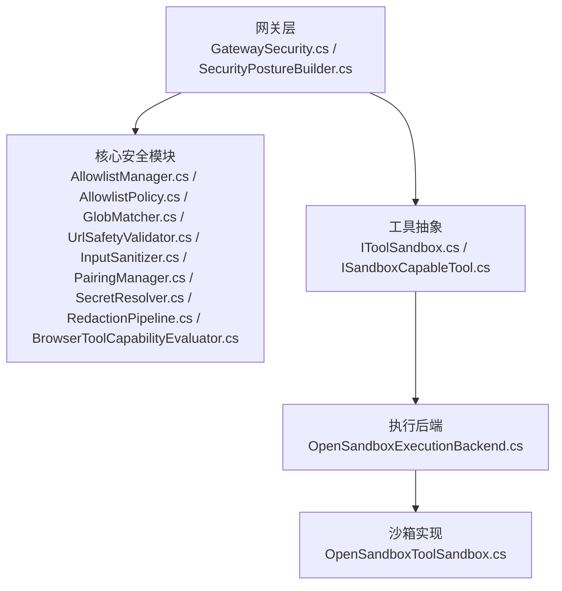
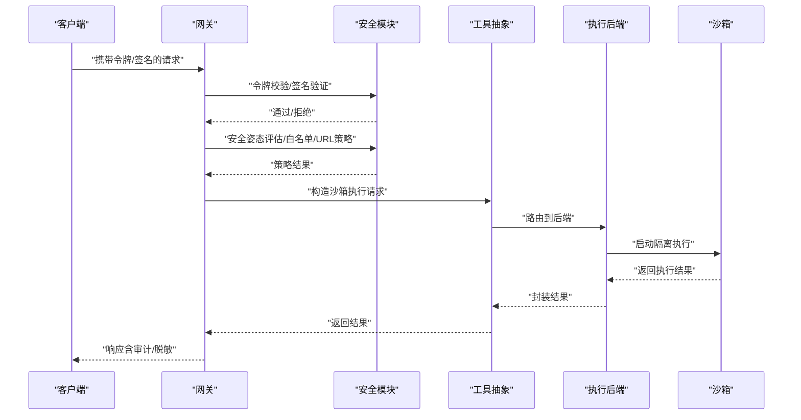
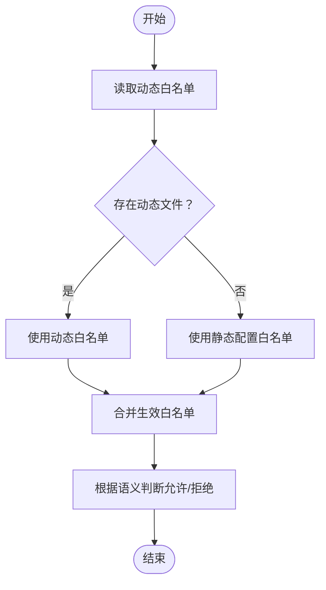
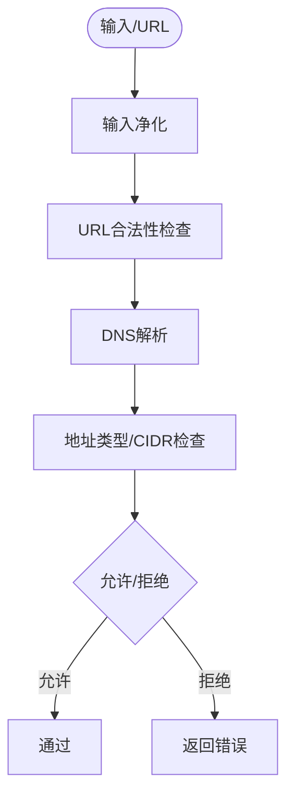
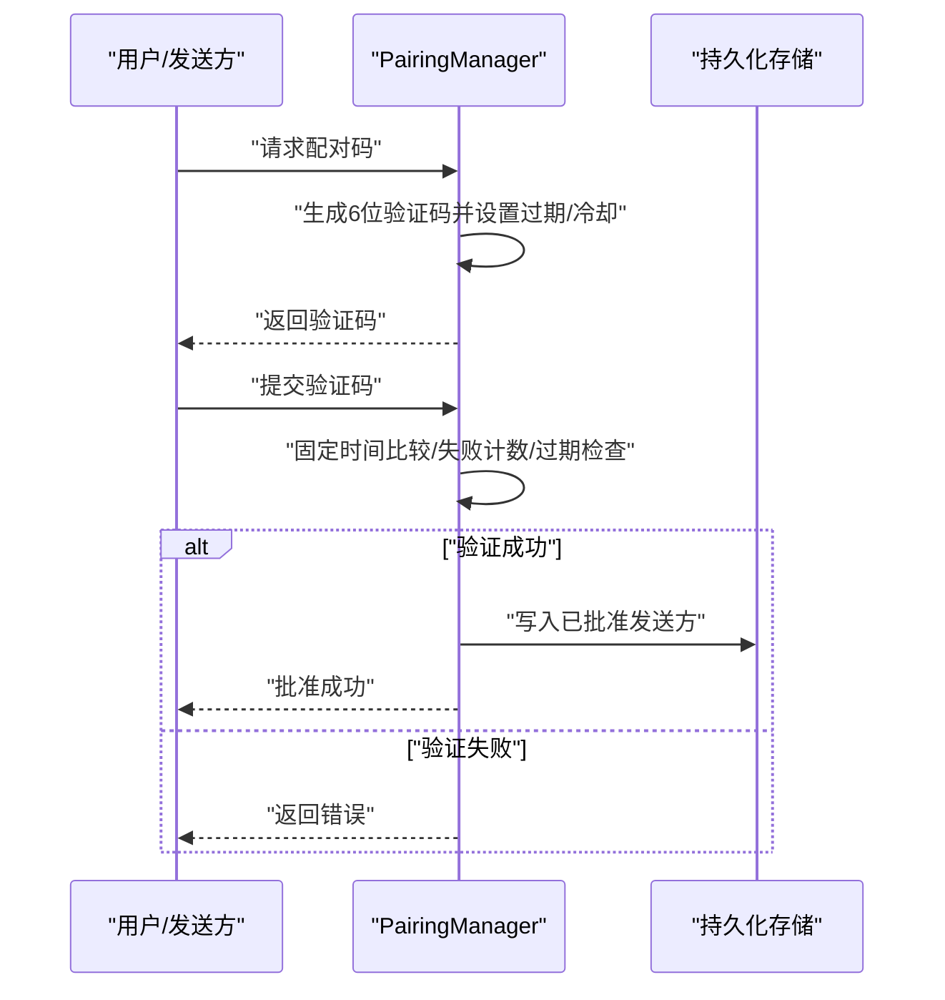
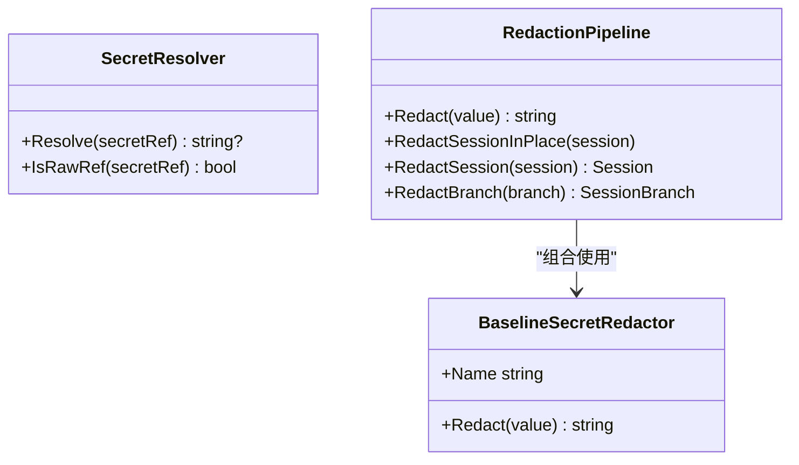
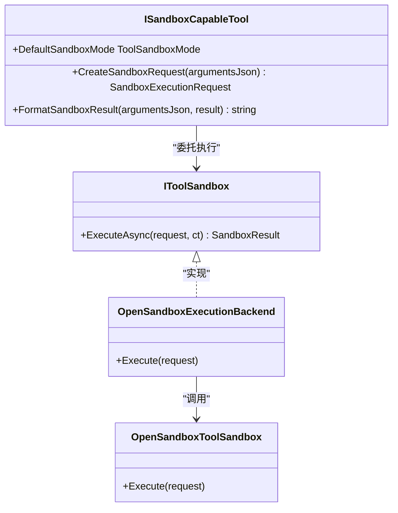
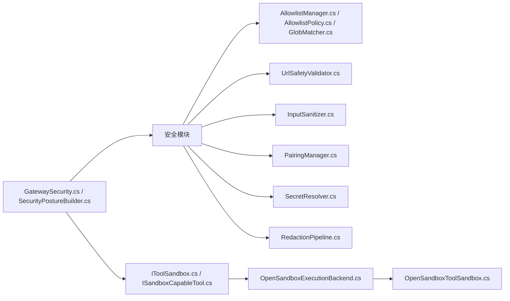

# 插件安全控制

<cite>
**本文引用的文件**
- [AllowlistManager.cs](file://src/OpenClaw.Core/security/AllowlistManager.cs)
- [AllowlistPolicy.cs](file://src/OpenClaw.Core/security/AllowlistPolicy.cs)
- [GlobMatcher.cs](file://src/OpenClaw.Core/security/GlobMatcher.cs)
- [InputSanitizer.cs](file://src/OpenClaw.Core/security/InputSanitizer.cs)
- [UrlSafetyValidator.cs](file://src/OpenClaw.Core/security/UrlSafetyValidator.cs)
- [PairingManager.cs](file://src/OpenClaw.Core/security/PairingManager.cs)
- [SecretResolver.cs](file://src/OpenClaw.Core/security/SecretResolver.cs)
- [RedactionPipeline.cs](file://src/OpenClaw.Core/security/RedactionPipeline.cs)
- [BrowserToolCapabilityEvaluator.cs](file://src/OpenClaw.Core/security/BrowserToolCapabilityEvaluator.cs)
- [IToolSandbox.cs](file://src/OpenClaw.Core/abstractions/IToolSandbox.cs)
- [ISandboxCapableTool.cs](file://src/OpenClaw.Core/abstractions/ISandboxCapableTool.cs)
- [OpenSandboxExecutionBackend.cs](file://src/OpenClaw.Agent/execution/OpenSandboxExecutionBackend.cs)
- [OpenSandboxToolSandbox.cs](file://src/OpenClawNet.Sandbox.OpenSandbox/OpenSandboxToolSandbox.cs)
- [GatewaySecurity.cs](file://src/OpenClaw.Gateway/GatewaySecurity.cs)
- [SecurityPostureBuilder.cs](file://src/OpenClaw.Gateway/SecurityPostureBuilder.cs)
</cite>

## 目录
1. [引言](#引言)
2. [项目结构](#项目结构)
3. [核心组件](#核心组件)
4. [架构总览](#架构总览)
5. [详细组件分析](#详细组件分析)
6. [依赖关系分析](#依赖关系分析)
7. [性能考量](#性能考量)
8. [故障排查指南](#故障排查指南)
9. [结论](#结论)
10. [附录](#附录)

## 引言
本文件面向插件安全控制系统，聚焦于权限管理、访问控制、沙箱机制、安全策略配置、白名单管理、资源限制与行为监控，并覆盖安全审计、威胁检测与异常处理。文档同时提供安全配置最佳实践、漏洞防护建议与合规性指导，并给出安全测试方法、渗透测试要点与应急响应流程。

## 项目结构
本项目围绕“网关层”“核心安全模块”“工具与插件执行后端”“沙箱实现”等维度组织，形成从请求入口到工具执行再到隔离运行的闭环安全体系。

图示来源
- [GatewaySecurity.cs:1-109](file://src/OpenClaw.Gateway/GatewaySecurity.cs#L1-L109)
- [SecurityPostureBuilder.cs:1-169](file://src/OpenClaw.Gateway/SecurityPostureBuilder.cs#L1-L169)
- [AllowlistManager.cs:1-126](file://src/OpenClaw.Core/security/AllowlistManager.cs#L1-L126)
- [AllowlistPolicy.cs:1-43](file://src/OpenClaw.Core/security/AllowlistPolicy.cs#L1-L43)
- [GlobMatcher.cs:1-89](file://src/OpenClaw.Core/security/GlobMatcher.cs#L1-L89)
- [UrlSafetyValidator.cs:1-219](file://src/OpenClaw.Core/security/UrlSafetyValidator.cs#L1-L219)
- [InputSanitizer.cs:1-84](file://src/OpenClaw.Core/security/InputSanitizer.cs#L1-L84)
- [PairingManager.cs:1-211](file://src/OpenClaw.Core/security/PairingManager.cs#L1-L211)
- [SecretResolver.cs:1-66](file://src/OpenClaw.Core/security/SecretResolver.cs#L1-L66)
- [RedactionPipeline.cs:1-131](file://src/OpenClaw.Core/security/RedactionPipeline.cs#L1-L131)
- [BrowserToolCapabilityEvaluator.cs:1-61](file://src/OpenClaw.Core/security/BrowserToolCapabilityEvaluator.cs#L1-L61)
- [IToolSandbox.cs:1-12](file://src/OpenClaw.Core/abstractions/IToolSandbox.cs#L1-L12)
- [ISandboxCapableTool.cs:1-14](file://src/OpenClaw.Core/abstractions/ISandboxCapableTool.cs#L1-L14)
- [OpenSandboxExecutionBackend.cs](file://src/OpenClaw.Agent/execution/OpenSandboxExecutionBackend.cs)
- [OpenSandboxToolSandbox.cs](file://src/OpenClawNet.Sandbox.OpenSandbox/OpenSandboxToolSandbox.cs)

章节来源
- [GatewaySecurity.cs:1-109](file://src/OpenClaw.Gateway/GatewaySecurity.cs#L1-L109)
- [SecurityPostureBuilder.cs:1-169](file://src/OpenClaw.Gateway/SecurityPostureBuilder.cs#L1-L169)

## 核心组件
- 白名单与访问控制：通过动态/静态组合的通道级白名单、通配符匹配与严格/传统语义判定，实现对来源与目标的细粒度控制。
- 输入净化与URL安全：针对注入风险进行输入校验与清理；对HTTP(S) URL进行DNS解析、私有网络与CIDR阻断检查。
- 配对与授权：基于一次性验证码的直连消息配对流程，支持固定时间比较与失败冷却，持久化已批准发送方列表。
- 秘密值解析：统一的密钥引用解析策略，支持环境变量、原始字面量与回退逻辑，避免明文硬编码。
- 敏感数据脱敏：会话与工具调用结果的链式脱敏流水线，内置基础敏感信息识别规则。
- 浏览器工具能力评估：结合本地执行能力与后端可用性，评估浏览器工具是否可注册与启用。
- 沙箱与执行：工具抽象定义执行契约，OpenSandbox执行后端与沙箱实现提供隔离执行环境。

章节来源
- [AllowlistManager.cs:1-126](file://src/OpenClaw.Core/security/AllowlistManager.cs#L1-L126)
- [AllowlistPolicy.cs:1-43](file://src/OpenClaw.Core/security/AllowlistPolicy.cs#L1-L43)
- [GlobMatcher.cs:1-89](file://src/OpenClaw.Core/security/GlobMatcher.cs#L1-L89)
- [InputSanitizer.cs:1-84](file://src/OpenClaw.Core/security/InputSanitizer.cs#L1-L84)
- [UrlSafetyValidator.cs:1-219](file://src/OpenClaw.Core/security/UrlSafetyValidator.cs#L1-L219)
- [PairingManager.cs:1-211](file://src/OpenClaw.Core/security/PairingManager.cs#L1-L211)
- [SecretResolver.cs:1-66](file://src/OpenClaw.Core/security/SecretResolver.cs#L1-L66)
- [RedactionPipeline.cs:1-131](file://src/OpenClaw.Core/security/RedactionPipeline.cs#L1-L131)
- [BrowserToolCapabilityEvaluator.cs:1-61](file://src/OpenClaw.Core/security/BrowserToolCapabilityEvaluator.cs#L1-L61)
- [IToolSandbox.cs:1-12](file://src/OpenClaw.Core/abstractions/IToolSandbox.cs#L1-L12)
- [ISandboxCapableTool.cs:1-14](file://src/OpenClaw.Core/abstractions/ISandboxCapableTool.cs#L1-L14)

## 架构总览
下图展示从网关到工具执行与沙箱的端到端安全路径，包括令牌校验、安全姿态评估、白名单与URL策略、配对授权、秘密解析与脱敏等环节。

图示来源
- [GatewaySecurity.cs:1-109](file://src/OpenClaw.Gateway/GatewaySecurity.cs#L1-L109)
- [SecurityPostureBuilder.cs:1-169](file://src/OpenClaw.Gateway/SecurityPostureBuilder.cs#L1-L169)
- [AllowlistManager.cs:1-126](file://src/OpenClaw.Core/security/AllowlistManager.cs#L1-L126)
- [UrlSafetyValidator.cs:1-219](file://src/OpenClaw.Core/security/UrlSafetyValidator.cs#L1-L219)
- [IToolSandbox.cs:1-12](file://src/OpenClaw.Core/abstractions/IToolSandbox.cs#L1-L12)
- [OpenSandboxExecutionBackend.cs](file://src/OpenClaw.Agent/execution/OpenSandboxExecutionBackend.cs)
- [OpenSandboxToolSandbox.cs](file://src/OpenClawNet.Sandbox.OpenSandbox/OpenSandboxToolSandbox.cs)

## 详细组件分析

### 白名单管理与访问控制
- 动态/静态白名单优先级：动态文件优先于静态配置，支持按通道独立维护。
- 通配符与严格语义：支持“*”匹配与glob模式，允许在严格与传统两种语义间切换。
- 并发安全：使用锁与原子写入，确保并发更新时的数据一致性与原子替换。
- 路径安全：动态白名单文件名经安全化处理，防止目录穿越。

图示来源
- [AllowlistManager.cs:32-51](file://src/OpenClaw.Core/security/AllowlistManager.cs#L32-L51)
- [AllowlistPolicy.cs:11-41](file://src/OpenClaw.Core/security/AllowlistPolicy.cs#L11-L41)
- [GlobMatcher.cs:68-86](file://src/OpenClaw.Core/security/GlobMatcher.cs#L68-L86)

章节来源
- [AllowlistManager.cs:1-126](file://src/OpenClaw.Core/security/AllowlistManager.cs#L1-L126)
- [AllowlistPolicy.cs:1-43](file://src/OpenClaw.Core/security/AllowlistPolicy.cs#L1-L43)
- [GlobMatcher.cs:1-89](file://src/OpenClaw.Core/security/GlobMatcher.cs#L1-L89)

### 输入净化与URL安全策略
- 注入防护：检测并阻止shell元字符、CRLF注入、路径遍历与控制字符等。
- URL安全：仅允许绝对http(s) URL，内置主机阻断清单，支持私有网络阻断与CIDR阻断，DNS解析失败即拒绝。
- 工具错误格式化：统一输出策略错误信息，便于前端与审计记录。

图示来源
- [InputSanitizer.cs:24-82](file://src/OpenClaw.Core/security/InputSanitizer.cs#L24-L82)
- [UrlSafetyValidator.cs:27-135](file://src/OpenClaw.Core/security/UrlSafetyValidator.cs#L27-L135)

章节来源
- [InputSanitizer.cs:1-84](file://src/OpenClaw.Core/security/InputSanitizer.cs#L1-L84)
- [UrlSafetyValidator.cs:1-219](file://src/OpenClaw.Core/security/UrlSafetyValidator.cs#L1-L219)

### 配对与授权流程
- 一次性验证码生成与过期管理，失败次数与冷却时间限制，固定时间比较防时序攻击。
- 已批准发送方持久化存储，支持管理员手动批准与撤销。
- 安全姿态构建器在公共绑定场景下提示缺失令牌、未签名webhook、未配置沙箱等风险。

图示来源
- [PairingManager.cs:53-124](file://src/OpenClaw.Core/security/PairingManager.cs#L53-L124)
- [SecurityPostureBuilder.cs:27-97](file://src/OpenClaw.Gateway/SecurityPostureBuilder.cs#L27-L97)

章节来源
- [PairingManager.cs:1-211](file://src/OpenClaw.Core/security/PairingManager.cs#L1-L211)
- [SecurityPostureBuilder.cs:1-169](file://src/OpenClaw.Gateway/SecurityPostureBuilder.cs#L1-L169)

### 秘密值解析与脱敏
- 统一解析策略：支持env:、raw:与裸字符串回退，日志提示潜在风险。
- 脱敏流水线：链式应用多个脱敏器，对会话历史、工具调用参数与结果进行脱敏。
- 基线规则：识别Authorization Bearer、OpenAI密钥、API Key字段等常见敏感信息。

图示来源
- [SecretResolver.cs:24-61](file://src/OpenClaw.Core/security/SecretResolver.cs#L24-L61)
- [RedactionPipeline.cs:21-131](file://src/OpenClaw.Core/security/RedactionPipeline.cs#L21-L131)

章节来源
- [SecretResolver.cs:1-66](file://src/OpenClaw.Core/security/SecretResolver.cs#L1-L66)
- [RedactionPipeline.cs:1-131](file://src/OpenClaw.Core/security/RedactionPipeline.cs#L1-L131)

### 浏览器工具能力评估
- 综合配置开关、本地执行能力与非本地执行后端可用性，评估浏览器工具是否可注册与启用。
- 对于仅后端可用或本地不可用的情况，提供明确原因，便于运维决策。

章节来源
- [BrowserToolCapabilityEvaluator.cs:1-61](file://src/OpenClaw.Core/security/BrowserToolCapabilityEvaluator.cs#L1-L61)

### 沙箱与执行后端
- 工具抽象：定义沙箱执行契约与默认沙箱模式，工具负责构造执行请求与格式化结果。
- 执行后端：将工具请求路由至OpenSandbox执行后端，由沙箱实现提供隔离执行环境。

图示来源
- [IToolSandbox.cs:1-12](file://src/OpenClaw.Core/abstractions/IToolSandbox.cs#L1-L12)
- [ISandboxCapableTool.cs:1-14](file://src/OpenClaw.Core/abstractions/ISandboxCapableTool.cs#L1-L14)
- [OpenSandboxExecutionBackend.cs](file://src/OpenClaw.Agent/execution/OpenSandboxExecutionBackend.cs)
- [OpenSandboxToolSandbox.cs](file://src/OpenClawNet.Sandbox.OpenSandbox/OpenSandboxToolSandbox.cs)

章节来源
- [IToolSandbox.cs:1-12](file://src/OpenClaw.Core/abstractions/IToolSandbox.cs#L1-L12)
- [ISandboxCapableTool.cs:1-14](file://src/OpenClaw.Core/abstractions/ISandboxCapableTool.cs#L1-L14)
- [OpenSandboxExecutionBackend.cs](file://src/OpenClaw.Agent/execution/OpenSandboxExecutionBackend.cs)
- [OpenSandboxToolSandbox.cs](file://src/OpenClawNet.Sandbox.OpenSandbox/OpenSandboxToolSandbox.cs)

## 依赖关系分析
- 网关层依赖安全模块进行令牌/签名验证与安全姿态评估；同时依赖工具抽象与执行后端完成工具调度。
- 安全模块内部通过白名单、URL策略、输入净化、配对与秘密解析等相互协作，形成纵深防御。
- 沙箱与执行后端作为隔离边界，承接来自工具抽象的请求，降低工具侧风险对宿主的影响。

图示来源
- [GatewaySecurity.cs:1-109](file://src/OpenClaw.Gateway/GatewaySecurity.cs#L1-L109)
- [SecurityPostureBuilder.cs:1-169](file://src/OpenClaw.Gateway/SecurityPostureBuilder.cs#L1-L169)
- [AllowlistManager.cs:1-126](file://src/OpenClaw.Core/security/AllowlistManager.cs#L1-L126)
- [AllowlistPolicy.cs:1-43](file://src/OpenClaw.Core/security/AllowlistPolicy.cs#L1-L43)
- [GlobMatcher.cs:1-89](file://src/OpenClaw.Core/security/GlobMatcher.cs#L1-L89)
- [UrlSafetyValidator.cs:1-219](file://src/OpenClaw.Core/security/UrlSafetyValidator.cs#L1-L219)
- [InputSanitizer.cs:1-84](file://src/OpenClaw.Core/security/InputSanitizer.cs#L1-L84)
- [PairingManager.cs:1-211](file://src/OpenClaw.Core/security/PairingManager.cs#L1-L211)
- [SecretResolver.cs:1-66](file://src/OpenClaw.Core/security/SecretResolver.cs#L1-L66)
- [RedactionPipeline.cs:1-131](file://src/OpenClaw.Core/security/RedactionPipeline.cs#L1-L131)
- [IToolSandbox.cs:1-12](file://src/OpenClaw.Core/abstractions/IToolSandbox.cs#L1-L12)
- [ISandboxCapableTool.cs:1-14](file://src/OpenClaw.Core/abstractions/ISandboxCapableTool.cs#L1-L14)
- [OpenSandboxExecutionBackend.cs](file://src/OpenClaw.Agent/execution/OpenSandboxExecutionBackend.cs)
- [OpenSandboxToolSandbox.cs](file://src/OpenClawNet.Sandbox.OpenSandbox/OpenSandboxToolSandbox.cs)

## 性能考量
- 字符串匹配与通配符：使用Span与快速路径优化，避免Split分配，提升白名单与glob匹配性能。
- DNS解析：异步解析与失败短路，减少阻塞；对无地址与解析异常进行快速拒绝。
- 固定时间比较：令牌与验证码比较采用常量时间算法，避免时序侧信道。
- 原子写入与并发锁：动态白名单与批准列表采用临时文件+原子替换，降低锁持有时间。

## 故障排查指南
- 白名单不生效
  - 检查动态文件是否存在且JSON格式正确；确认动态文件优先级高于静态配置。
  - 校验通配符模式与比较方式，必要时切换严格语义。
- URL被阻断
  - 检查是否为绝对http(s) URL；核对内置阻断主机与自定义阻断清单。
  - 若涉及私有网络或CIDR，请确认策略配置与DNS解析结果。
- 配对失败
  - 核对验证码是否过期、失败次数是否超过阈值、冷却时间是否生效。
  - 使用固定时间比较接口进行调试，避免因长度差异导致的时序泄漏。
- 秘密解析问题
  - 确认secret引用前缀（env:/raw:），或使用裸字符串回退策略。
  - 在生产环境避免使用raw:，并确保环境变量已正确注入。
- 脱敏不彻底
  - 检查脱敏流水线顺序与正则规则，必要时扩展自定义脱敏器。
- 沙箱执行异常
  - 确认工具默认沙箱模式与执行后端可用性；检查OpenSandbox配置与版本兼容性。

章节来源
- [AllowlistManager.cs:32-84](file://src/OpenClaw.Core/security/AllowlistManager.cs#L32-L84)
- [AllowlistPolicy.cs:18-41](file://src/OpenClaw.Core/security/AllowlistPolicy.cs#L18-L41)
- [UrlSafetyValidator.cs:27-135](file://src/OpenClaw.Core/security/UrlSafetyValidator.cs#L27-L135)
- [PairingManager.cs:70-124](file://src/OpenClaw.Core/security/PairingManager.cs#L70-L124)
- [SecretResolver.cs:24-54](file://src/OpenClaw.Core/security/SecretResolver.cs#L24-L54)
- [RedactionPipeline.cs:30-94](file://src/OpenClaw.Core/security/RedactionPipeline.cs#L30-L94)
- [OpenSandboxExecutionBackend.cs](file://src/OpenClaw.Agent/execution/OpenSandboxExecutionBackend.cs)
- [OpenSandboxToolSandbox.cs](file://src/OpenClawNet.Sandbox.OpenSandbox/OpenSandboxToolSandbox.cs)

## 结论
本系统通过多层安全控制（白名单、URL策略、输入净化、配对授权、秘密解析与脱敏）与强隔离的沙箱执行后端，构建了从入口到工具执行的完整安全闭环。建议在公共绑定场景下强制启用令牌与签名验证、配置OpenSandbox、完善审批与审计，并持续进行安全测试与渗透评估以保持安全态势稳定。

## 附录

### 安全配置最佳实践
- 公共绑定
  - 配置认证令牌并在网关层启用固定时间令牌比较。
  - 启用webhook签名验证（Twilio、Telegram、Teams、Slack、Discord）。
  - 禁止在公共绑定暴露未沙箱化的shell与process工具。
  - 替换所有raw:密钥引用为env:，避免明文泄露。
- 审批与治理
  - 明确工具审批要求与审批所需工具清单，避免“无名单即全量放行”的风险。
  - 对第三方桥接插件采取最小权限原则，必要时禁用。
- 沙箱与资源限制
  - 为shell、code_exec、browser等高危工具配置OpenSandbox。
  - 设置进程/内存/时间片等资源限制，启用超时与重试上限。
- 日志与审计
  - 开启工具调用审计与会话脱敏输出，定期审查异常与失败事件。

### 漏洞防护与合规性指导
- 注入与命令执行
  - 使用输入净化与URL安全策略，禁止shell元字符与CRLF注入。
  - 严格限制文件系统访问与路径遍历，必要时采用只读根目录策略。
- 认证与授权
  - 使用Bearer令牌与固定时间比较；对webhook使用HMAC签名验证。
  - 实施最小权限与职责分离，定期轮换密钥与令牌。
- 数据保护
  - 对敏感字段进行脱敏，遵循“可见即泄露”的原则。
  - 传输加密与TLS终止点可信配置，确保cookie Secure属性有效。

### 安全测试方法与渗透测试
- 单元测试
  - 白名单匹配、URL阻断、输入净化、配对流程、固定时间比较等关键逻辑。
- 集成测试
  - 端到端请求流，验证网关安全策略、工具执行与沙箱隔离。
- 渗透测试
  - 模拟越权访问、命令注入、SSRF、时序攻击与密钥泄露尝试。
  - 验证公共绑定下的风险缓解措施有效性。

### 应急响应流程
- 快速处置
  - 立即禁用受影响插件或工具，撤销可疑批准，回收令牌与密钥。
- 调查与取证
  - 审计日志与脱敏后的会话快照，定位攻击入口与影响范围。
- 修复与加固
  - 修补配置缺陷，升级沙箱版本，补充白名单与URL阻断规则。
- 复盘与改进
  - 更新应急预案，加强培训与演练，完善自动化告警与封禁策略。