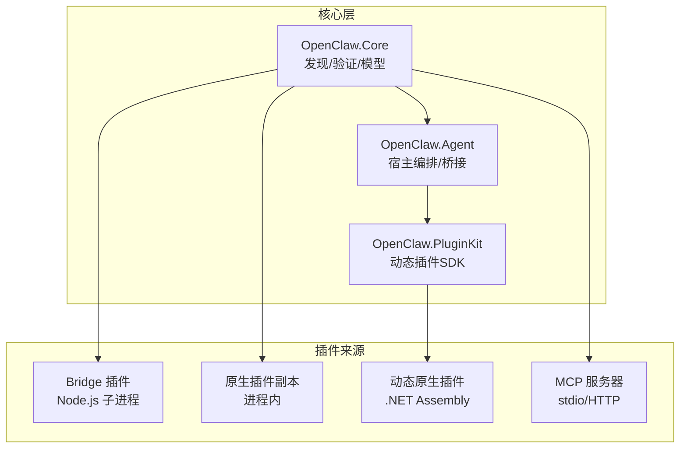
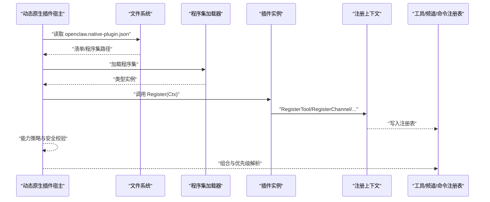
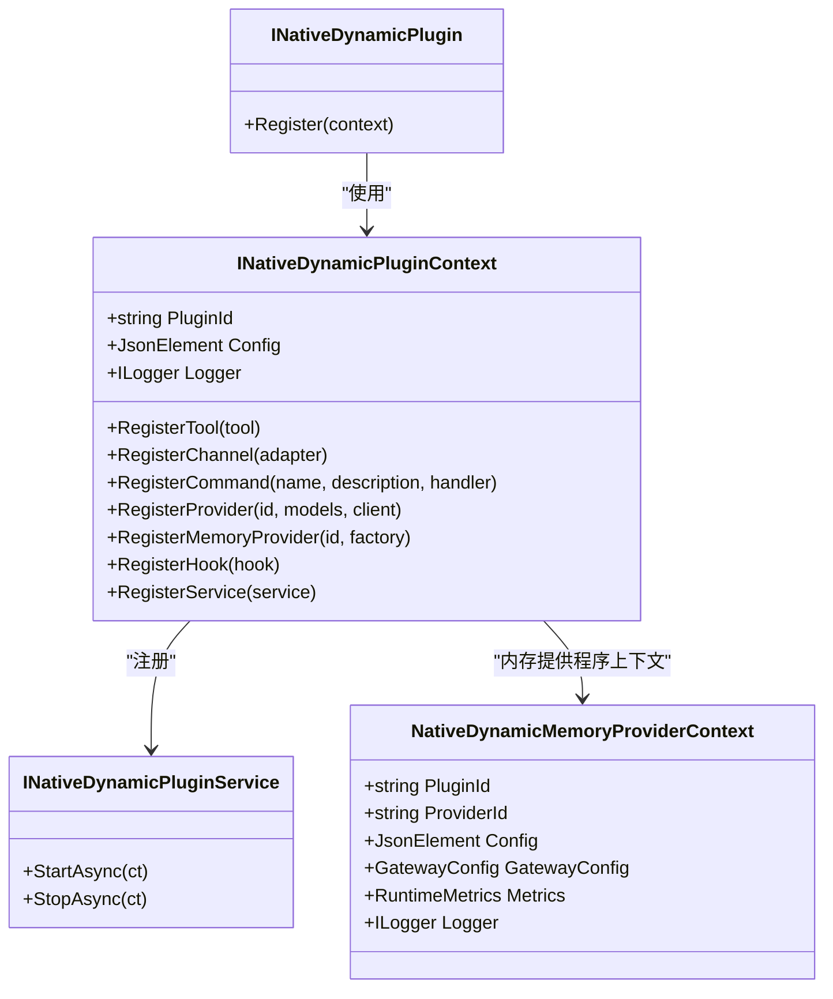
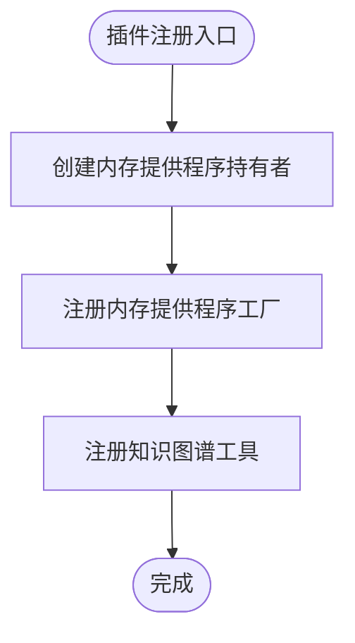
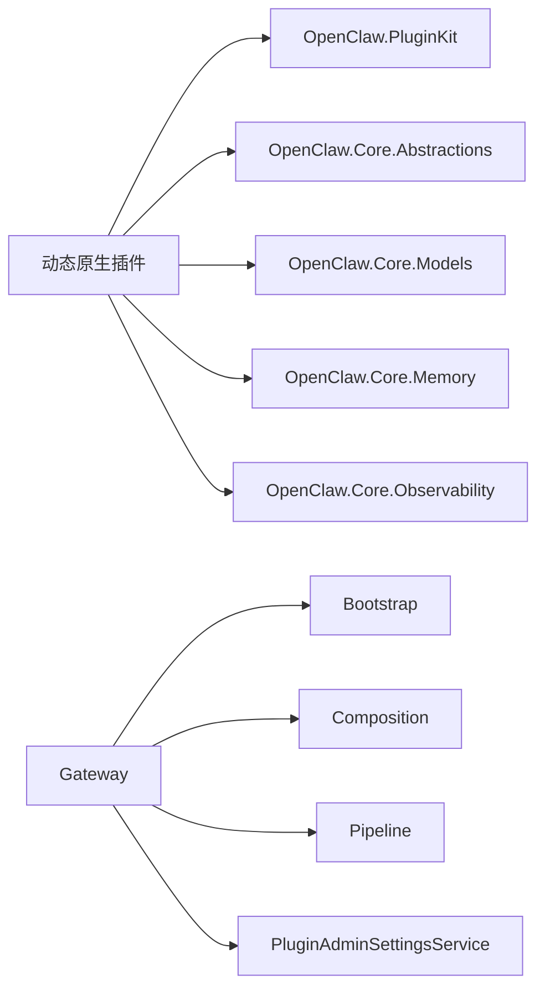

# 插件开发指南

<cite>
**本文引用的文件**
- [INativeDynamicPlugin.cs](file://src/OpenClaw.PluginKit/INativeDynamicPlugin.cs)
- [EmploymentCoachWorkflowPlugin.cs](file://src/OpenClaw.Plugins.EmploymentCoachWorkflow/EmploymentCoachWorkflowPlugin.cs)
- [openclaw.native-plugin.json（就业教练工作流）](file://src/OpenClaw.Plugins.EmploymentCoachWorkflow/openclaw.native-plugin.json)
- [MempalaceMemoryPlugin.cs](file://src/OpenClaw.Plugins.Mempalace/MempalaceMemoryPlugin.cs)
- [openclaw.native-plugin.json（MemPalace 内存提供程序）](file://src/OpenClaw.Plugins.Mempalace/openclaw.native-plugin.json)
- [Program.cs（网关）](file://src/OpenClaw.Gateway/Program.cs)
- [openclaw-plugin-system-analysis.md](file://docs/openclaw-plugin-system-analysis.md)
- [NativeDynamicPluginHostTests.cs](file://src/OpenClaw.Tests/NativeDynamicPluginHostTests.cs)
- [README.md](file://README.md)
- [PluginAdminSettingsService.cs](file://src/OpenClaw.Gateway/PluginAdminSettingsService.cs)
- [ContractGovernanceTests.cs](file://src/OpenClaw.Tests/ContractGovernanceTests.cs)
</cite>

## 目录
1. [简介](#简介)
2. [项目结构](#项目结构)
3. [核心组件](#核心组件)
4. [架构总览](#架构总览)
5. [详细组件分析](#详细组件分析)
6. [依赖关系分析](#依赖关系分析)
7. [性能考量](#性能考量)
8. [故障排查指南](#故障排查指南)
9. [结论](#结论)
10. [附录](#附录)

## 简介
本指南面向希望在 OpenClaw.NET 平台上开发插件的工程师，系统阐述从开发环境搭建、项目模板使用、接口实现规范到测试策略的全流程。文档重点覆盖三类插件的开发要点与最佳实践：
- 工具插件：通过注册 ITool 实现具体动作能力
- 通道插件：通过 IChannelAdapter 实现消息通道接入
- 提供程序插件：通过 IChatClient 注册 AI 提供商与模型

同时，文档给出插件打包发布、版本管理、兼容性测试与性能优化的实操建议，并结合仓库中的真实示例（动态原生插件、内存提供程序插件等）进行深入解析。

## 项目结构
OpenClaw.NET 将插件系统分为三层：
- OpenClaw.Core：负责数据模型、发现算法与验证逻辑
- OpenClaw.Agent：负责宿主编排、桥接传输与原生注册表
- OpenClaw.PluginKit：提供动态 .NET 插件的公共 SDK 接口

插件来源与能力矩阵（节选）：
- Bridge 插件（TS/JS）：通过 Node.js 子进程运行，支持工具、频道、命令、提供者、钩子、技能
- 原生插件副本（C#）：进程内，支持工具
- 动态原生插件（.NET）：进程内，支持工具、频道、命令、提供者、钩子、服务、技能
- MCP 服务器：进程边界，标准传输，支持工具

图表来源
- [openclaw-plugin-system-analysis.md:15-24](file://docs/openclaw-plugin-system-analysis.md#L15-L24)

章节来源
- [openclaw-plugin-system-analysis.md:1-200](file://docs/openclaw-plugin-system-analysis.md#L1-L200)

## 核心组件
- 动态原生插件接口族
  - INativeDynamicPlugin：插件入口，实现 Register 方法
  - INativeDynamicPluginContext：注册上下文，提供工具、频道、命令、提供程序、内存提供程序、钩子、服务等注册能力
  - INativeDynamicPluginService：生命周期服务，支持 StartAsync/StopAsync
  - NativeDynamicMemoryProviderContext：内存提供程序上下文，包含插件标识、配置、网关配置、指标与日志器

- 网关启动与插件组合
  - Program.cs：网关启动流程，加载配置、构建服务、初始化运行时、映射端点与 MCP
  - PluginAdminSettingsService：插件条目配置的增删改查与持久化

- 测试与兼容性
  - NativeDynamicPluginHostTests：动态原生插件加载、AOT/JIT 限制、装配路径安全、技能加载、服务生命周期等测试
  - ContractGovernanceTests：合约预检与运行时模式校验

章节来源
- [INativeDynamicPlugin.cs:11-46](file://src/OpenClaw.PluginKit/INativeDynamicPlugin.cs#L11-L46)
- [Program.cs:47-98](file://src/OpenClaw.Gateway/Program.cs#L47-L98)
- [PluginAdminSettingsService.cs:81-121](file://src/OpenClaw.Gateway/PluginAdminSettingsService.cs#L81-L121)
- [NativeDynamicPluginHostTests.cs:31-92](file://src/OpenClaw.Tests/NativeDynamicPluginHostTests.cs#L31-L92)
- [ContractGovernanceTests.cs:114-129](file://src/OpenClaw.Tests/ContractGovernanceTests.cs#L114-L129)

## 架构总览
动态原生插件的加载与组合流程如下：
- 发现阶段：扫描 openclaw.native-plugin.json，解析清单与程序集路径
- 能力策略：根据运行时模式（AOT/JIT）与 jitOnly 字段进行准入控制
- 加载阶段：通过 AssemblyLoadContext 进程内加载程序集，实例化插件类型
- 注册阶段：调用 Register(context)，在上下文中注册工具、频道、命令、提供程序、内存提供程序、钩子、服务与技能目录
- 组合阶段：与 Bridge、原生副本、MCP 工具汇聚，经优先级解析形成最终可用集合

图表来源
- [openclaw-plugin-system-analysis.md:408-417](file://docs/openclaw-plugin-system-analysis.md#L408-L417)
- [INativeDynamicPlugin.cs:13-28](file://src/OpenClaw.PluginKit/INativeDynamicPlugin.cs#L13-L28)

章节来源
- [openclaw-plugin-system-analysis.md:94-131](file://docs/openclaw-plugin-system-analysis.md#L94-L131)
- [openclaw-plugin-system-analysis.md:142-161](file://docs/openclaw-plugin-system-analysis.md#L142-L161)

## 详细组件分析

### 动态原生插件接口与上下文
- INativeDynamicPlugin：插件实现必须提供 Register 方法，接收上下文并完成能力注册
- INativeDynamicPluginContext：提供以下注册能力
  - RegisterTool：注册 ITool 实例
  - RegisterChannel：注册 IChannelAdapter 实例
  - RegisterCommand：注册命令名称、描述与处理器
  - RegisterProvider：注册提供程序 ID、模型数组与 IChatClient
  - RegisterMemoryProvider：注册内存提供程序工厂
  - RegisterHook：注册 IToolHook
  - RegisterService：注册 INativeDynamicPluginService 生命周期服务
- INativeDynamicPluginService：StartAsync/StopAsync 生命周期回调
- NativeDynamicMemoryProviderContext：内存提供程序上下文字段（插件 ID、提供程序 ID、配置、网关配置、指标、日志器）

图表来源
- [INativeDynamicPlugin.cs:11-46](file://src/OpenClaw.PluginKit/INativeDynamicPlugin.cs#L11-L46)

章节来源
- [INativeDynamicPlugin.cs:11-46](file://src/OpenClaw.PluginKit/INativeDynamicPlugin.cs#L11-L46)

### 示例：工具插件（内存提供程序）
- MempalaceMemoryPlugin 展示了如何注册内存提供程序与工具
  - RegisterMemoryProvider：注册内存提供程序工厂，延迟创建与线程安全持有
  - RegisterTool：注册知识图谱工具，依赖内存提供程序状态

图表来源
- [MempalaceMemoryPlugin.cs:8-19](file://src/OpenClaw.Plugins.Mempalace/MempalaceMemoryPlugin.cs#L8-L19)

章节来源
- [MempalaceMemoryPlugin.cs:6-43](file://src/OpenClaw.Plugins.Mempalace/MempalaceMemoryPlugin.cs#L6-L43)

### 示例：通道插件（工作流）
- EmploymentCoachWorkflowPlugin 展示了最小实现，可在 Register 中注册频道适配器与命令等

章节来源
- [EmploymentCoachWorkflowPlugin.cs:5-11](file://src/OpenClaw.Plugins.EmploymentCoachWorkflow/EmploymentCoachWorkflowPlugin.cs#L5-L11)

### 清单与打包
- openclaw.native-plugin.json 字段说明（摘自示例）
  - id/name/version：插件标识与版本
  - assemblyPath/typeName：程序集路径与入口类型
  - capabilities：声明的能力集合（如 tools、services、commands、channels、providers、hooks、memory、skills）
  - skills：随包技能目录
  - jitOnly：是否仅允许 JIT 模式加载

章节来源
- [openclaw.native-plugin.json（就业教练工作流）:1-11](file://src/OpenClaw.Plugins.EmploymentCoachWorkflow/openclaw.native-plugin.json#L1-L11)
- [openclaw.native-plugin.json（MemPalace 内存提供程序）:1-10](file://src/OpenClaw.Plugins.Mempalace/openclaw.native-plugin.json#L1-L10)

### 网关启动与插件组合
- Program.cs 展示了网关启动的关键步骤：配置加载、服务注册、运行时初始化、MCP 初始化与认证、管道与端点映射、监听启动
- 插件组合由组合根编排，串联 Bridge 插件、MCP 工具注册、动态原生插件加载、优先级解析与最终 PluginComposition

章节来源
- [Program.cs:47-98](file://src/OpenClaw.Gateway/Program.cs#L47-L98)
- [openclaw-plugin-system-analysis.md:408-417](file://docs/openclaw-plugin-system-analysis.md#L408-L417)

### 测试策略与质量门控
- 动态原生插件测试要点
  - JIT 模式加载与技能加载：验证工具执行、命令注册、服务生命周期
  - AOT 模式拒绝：验证能力策略与诊断信息
  - 装配路径安全：拒绝越界路径
  - 内存提供程序注册清理：验证释放后注册表清空
- 合约预检与运行时模式校验：确保策略与运行时模式一致

章节来源
- [NativeDynamicPluginHostTests.cs:31-92](file://src/OpenClaw.Tests/NativeDynamicPluginHostTests.cs#L31-L92)
- [NativeDynamicPluginHostTests.cs:94-123](file://src/OpenClaw.Tests/NativeDynamicPluginHostTests.cs#L94-L123)
- [NativeDynamicPluginHostTests.cs:160-193](file://src/OpenClaw.Tests/NativeDynamicPluginHostTests.cs#L160-L193)
- [ContractGovernanceTests.cs:114-129](file://src/OpenClaw.Tests/ContractGovernanceTests.cs#L114-L129)

## 依赖关系分析
- 动态原生插件依赖
  - PluginKit：接口与上下文
  - Core.Abstractions/Core.Models/Core.Memory：工具抽象、模型与内存接口
  - Observability：指标与日志
- 网关侧依赖
  - Bootstrap/Composition/Pipeline：启动与运行时组合
  - PluginAdminSettingsService：插件条目配置管理

图表来源
- [INativeDynamicPlugin.cs:1-8](file://src/OpenClaw.PluginKit/INativeDynamicPlugin.cs#L1-L8)
- [Program.cs:47-98](file://src/OpenClaw.Gateway/Program.cs#L47-L98)
- [PluginAdminSettingsService.cs:81-121](file://src/OpenClaw.Gateway/PluginAdminSettingsService.cs#L81-L121)

章节来源
- [INativeDynamicPlugin.cs:1-8](file://src/OpenClaw.PluginKit/INativeDynamicPlugin.cs#L1-L8)
- [Program.cs:47-98](file://src/OpenClaw.Gateway/Program.cs#L47-L98)

## 性能考量
- 启动成本
  - Bridge 插件：Node.js 子进程生成（约 100–300ms）
  - 动态原生插件：程序集加载（约 10–50ms）
  - MCP 服务器：进程生成（约 100–500ms）
- 运行时模式
  - JIT 模式支持更广能力（含动态原生插件），AOT 模式更轻量但限制较多
- 隔离性
  - 动态原生插件为进程内，具备较低 IPC 开销
- 启动时组合
  - 通过单一编排点串联各来源，减少重复初始化

章节来源
- [openclaw-plugin-system-analysis.md:418-428](file://docs/openclaw-plugin-system-analysis.md#L418-L428)

## 故障排查指南
- AOT 模式加载失败
  - 现象：抛出异常并报告“JIT 模式必需”
  - 处理：调整运行时模式为 JIT，或移除 jitOnly 标记（若适用）
- 装配路径越界
  - 现象：拒绝加载，诊断代码为“assembly_outside_root”
  - 处理：确保 assemblyPath 位于受信任的插件根目录内
- 内存提供程序未激活
  - 现象：工具提示“提供程序未激活”，无法执行
  - 处理：确认已正确注册并处于活动状态
- 插件条目配置问题
  - 使用 PluginAdminSettingsService 的 Upsert 获取/更新插件配置，注意并发锁与持久化

章节来源
- [NativeDynamicPluginHostTests.cs:94-123](file://src/OpenClaw.Tests/NativeDynamicPluginHostTests.cs#L94-L123)
- [NativeDynamicPluginHostTests.cs:160-193](file://src/OpenClaw.Tests/NativeDynamicPluginHostTests.cs#L160-L193)
- [PluginAdminSettingsService.cs:92-121](file://src/OpenClaw.Gateway/PluginAdminSettingsService.cs#L92-L121)

## 结论
OpenClaw.NET 的插件体系通过清晰的分层与严格的策略控制，实现了多来源、多语言、多运行时模式的统一扩展。动态原生插件以其进程内加载与丰富能力，成为深度集成与高性能场景的首选；Bridge 插件与 MCP 服务器则提供了与外部生态的兼容路径。遵循本文档的开发流程、接口规范与测试策略，可高效构建高质量插件并保障运行稳定性。

## 附录

### 开发环境搭建与项目模板
- 运行时模式
  - AOT：轻量部署，能力受限
  - JIT：扩展能力（含动态原生插件），需启用动态代码支持
- 依赖与工具
  - .NET SDK（示例目标框架 net10.0）
  - Node.js（Bridge 插件运行时）
  - jiti（TypeScript 插件入口解析）
- 快速开始
  - 参考项目根 README 的快速入门与架构说明

章节来源
- [README.md:58-124](file://README.md#L58-L124)

### 接口实现规范与最佳实践
- 插件入口
  - 实现 INativeDynamicPlugin.Register，避免阻塞与异常
- 注册上下文
  - 使用 Logger 记录诊断信息
  - 严格校验 Config 参数，必要时提供默认值与校验失败的明确错误
- 资源管理
  - 实现 INativeDynamicPluginService.StartAsync/StopAsync，确保资源释放
- 并发与线程安全
  - 内存提供程序持有者应采用锁保护，避免竞态
- 能力声明
  - 在 openclaw.native-plugin.json 中准确声明 capabilities 与 jitOnly

章节来源
- [INativeDynamicPlugin.cs:13-28](file://src/OpenClaw.PluginKit/INativeDynamicPlugin.cs#L13-L28)
- [MempalaceMemoryPlugin.cs:21-40](file://src/OpenClaw.Plugins.Mempalace/MempalaceMemoryPlugin.cs#L21-L40)

### 测试策略与兼容性
- 单元测试
  - 动态原生插件加载、命令注册、服务生命周期、内存提供程序注册清理
- 兼容性测试
  - AOT/JIT 模式差异、运行时模式与能力策略一致性
- 合规性
  - 通过兼容性目录与烟雾测试，确保插件在不同版本与配置下的行为稳定

章节来源
- [NativeDynamicPluginHostTests.cs:31-92](file://src/OpenClaw.Tests/NativeDynamicPluginHostTests.cs#L31-L92)
- [ContractGovernanceTests.cs:114-129](file://src/OpenClaw.Tests/ContractGovernanceTests.cs#L114-L129)

### 打包发布与版本管理
- 清单字段
  - id/name/version/assemblyPath/typeName/capabilities/skills/jitOnly/minHostVersion/pluginApiVersion
- 构建与发布
  - 构建输出目录需包含 openclaw.native-plugin.json、程序集与 skills 目录
  - 确保 assemblyPath 为相对路径且位于受信任范围
- 版本管理
  - 通过 version 与 pluginApiVersion 控制兼容性与升级路径
  - 使用 minHostVersion 限制最低宿主版本

章节来源
- [openclaw-plugin-system-analysis.md:142-161](file://docs/openclaw-plugin-system-analysis.md#L142-L161)
- [openclaw.native-plugin.json（就业教练工作流）:1-11](file://src/OpenClaw.Plugins.EmploymentCoachWorkflow/openclaw.native-plugin.json#L1-L11)
- [openclaw.native-plugin.json（MemPalace 内存提供程序）:1-10](file://src/OpenClaw.Plugins.Mempalace/openclaw.native-plugin.json#L1-L10)