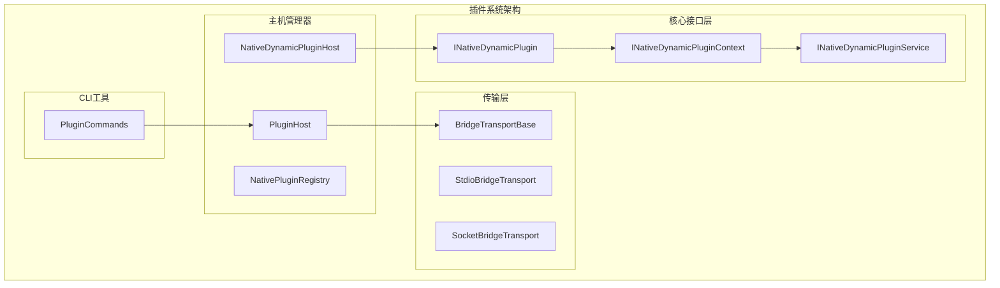
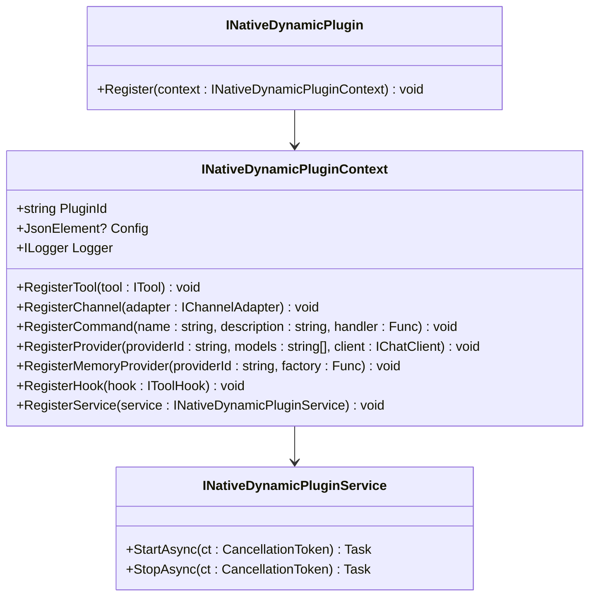
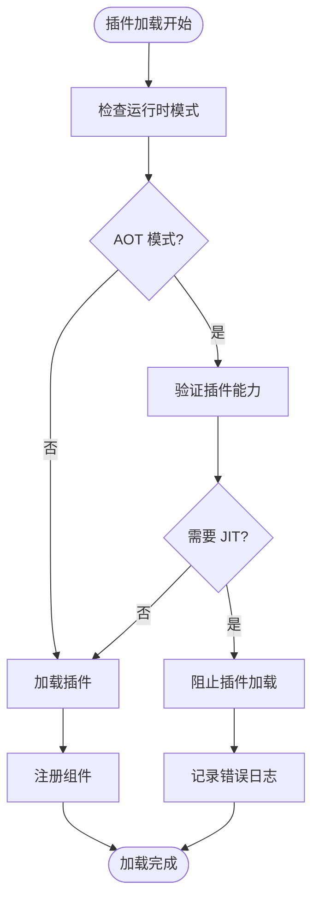
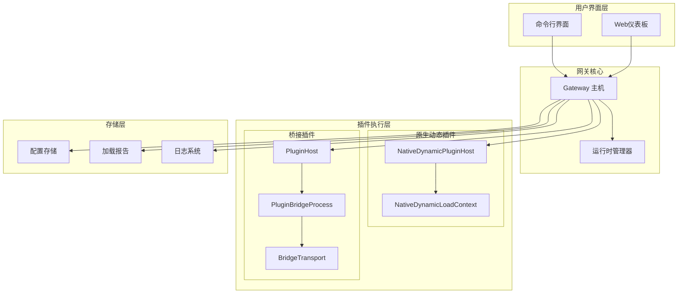
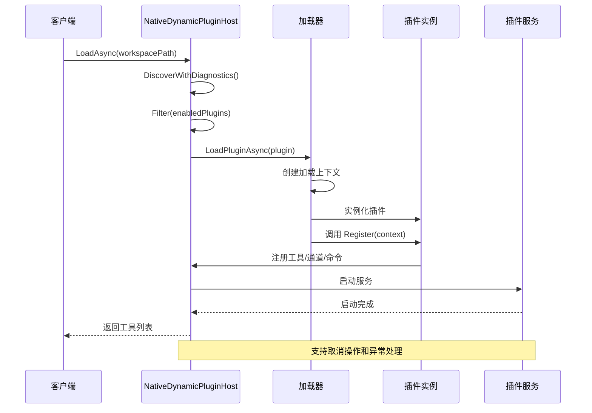
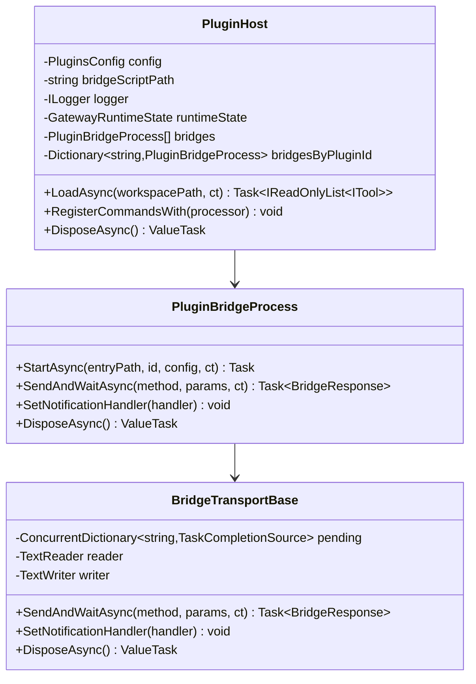
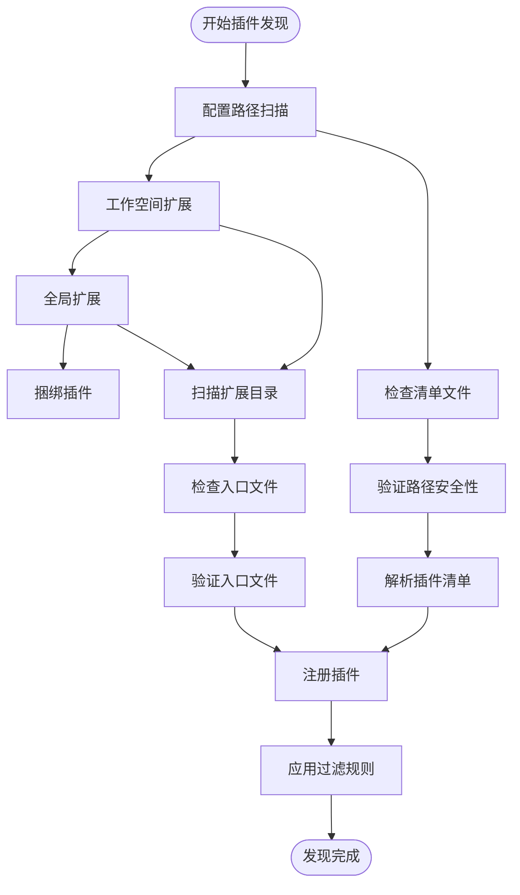
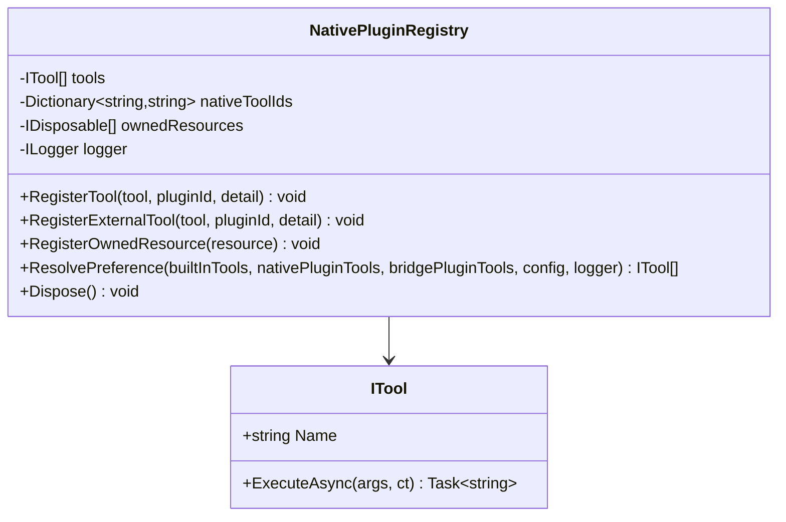
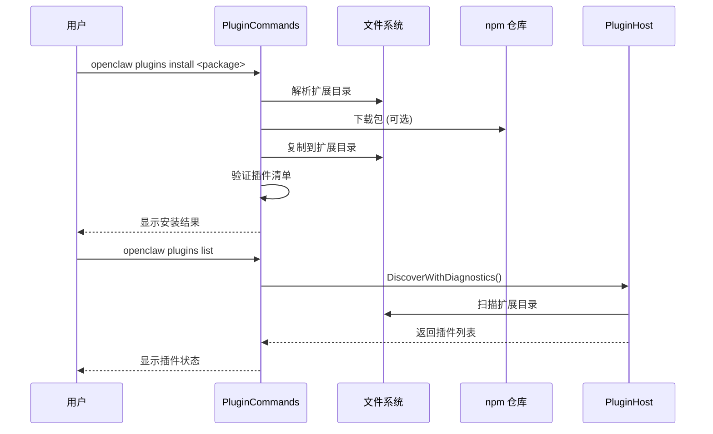
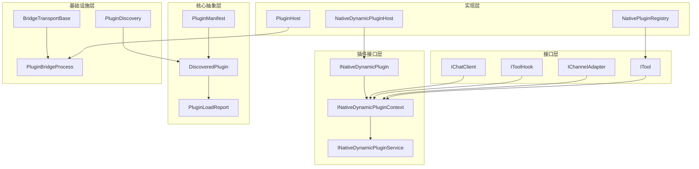

# 插件架构设计

<cite>
**本文档引用的文件**
- [INativeDynamicPlugin.cs](file://src/OpenClaw.PluginKit/INativeDynamicPlugin.cs)
- [NativeDynamicPluginHost.cs](file://src/OpenClaw.Agent/Plugins/NativeDynamicPluginHost.cs)
- [PluginHost.cs](file://src/OpenClaw.Agent/Plugins/PluginHost.cs)
- [NativePluginRegistry.cs](file://src/OpenClaw.Agent/Plugins/NativePluginRegistry.cs)
- [PluginCommands.cs](file://src/OpenClaw.Cli/PluginCommands.cs)
- [PluginDiscovery.cs](file://src/OpenClaw.Core/Plugins/PluginDiscovery.cs)
- [BridgeTransportBase.cs](file://src/OpenClaw.Agent/Plugins/BridgeTransportBase.cs)
- [employment-coach-workflow.json](file://src/OpenClaw.Plugins.EmploymentCoachWorkflow/openclaw.native-plugin.json)
- [mempalace-memory.json](file://src/OpenClaw.Plugins.Mempalace/openclaw.native-plugin.json)
- [COMPATIBILITY.md](file://docs/COMPATIBILITY.md)
</cite>

## 目录
1. [引言](#引言)
2. [项目结构](#项目结构)
3. [核心组件](#核心组件)
4. [架构概览](#架构概览)
5. [详细组件分析](#详细组件分析)
6. [依赖关系分析](#依赖关系分析)
7. [性能考虑](#性能考虑)
8. [故障排除指南](#故障排除指南)
9. [结论](#结论)
10. [附录](#附录)

## 引言

OpenClaw 插件架构是一个高度模块化和可扩展的系统，支持两种主要的插件类型：原生动态插件（Native Dynamic Plugins）和桥接插件（Bridge Plugins）。该架构设计的核心目标是在保证安全性和稳定性的同时，为开发者提供灵活的扩展能力。

插件系统采用分层架构设计，通过明确的接口定义和严格的生命周期管理，实现了插件的发现、加载、注册和卸载的完整流程。系统特别强调运行时模式的兼容性，确保在不同部署环境（AOT/JIT）中都能稳定运行。

## 项目结构

插件架构由多个相互协作的组件组成，每个组件都有明确的职责分工：

**图表来源**
- [INativeDynamicPlugin.cs:11-46](file://src/OpenClaw.PluginKit/INativeDynamicPlugin.cs#L11-L46)
- [NativeDynamicPluginHost.cs:19-51](file://src/OpenClaw.Agent/Plugins/NativeDynamicPluginHost.cs#L19-L51)
- [PluginHost.cs:14-53](file://src/OpenClaw.Agent/Plugins/PluginHost.cs#L14-L53)

**章节来源**
- [INativeDynamicPlugin.cs:1-46](file://src/OpenClaw.PluginKit/INativeDynamicPlugin.cs#L1-L46)
- [NativeDynamicPluginHost.cs:1-908](file://src/OpenClaw.Agent/Plugins/NativeDynamicPluginHost.cs#L1-L908)
- [PluginHost.cs:1-550](file://src/OpenClaw.Agent/Plugins/PluginHost.cs#L1-L550)

## 核心组件

### INativeDynamicPlugin 接口

INativeDynamicPlugin 是原生动态插件的核心接口，定义了插件与宿主系统交互的标准方式。该接口采用最小化设计原则，只包含一个核心方法：

**图表来源**
- [INativeDynamicPlugin.cs:11-46](file://src/OpenClaw.PluginKit/INativeDynamicPlugin.cs#L11-L46)

该接口设计体现了以下设计理念：

1. **单一职责原则**：每个接口只负责特定的功能领域
2. **依赖注入模式**：通过上下文对象传递依赖关系
3. **生命周期管理**：服务接口提供明确的启动和停止生命周期
4. **类型安全**：使用强类型参数确保编译时检查

**章节来源**
- [INativeDynamicPlugin.cs:11-46](file://src/OpenClaw.PluginKit/INativeDynamicPlugin.cs#L11-L46)

### 运行时模式兼容性

插件系统严格区分运行时模式，确保在不同部署环境中的兼容性：

**图表来源**
- [NativeDynamicPluginHost.cs:87-130](file://src/OpenClaw.Agent/Plugins/NativeDynamicPluginHost.cs#L87-L130)

**章节来源**
- [NativeDynamicPluginHost.cs:87-130](file://src/OpenClaw.Agent/Plugins/NativeDynamicPluginHost.cs#L87-L130)

## 架构概览

插件系统采用双通道架构，支持原生动态插件和桥接插件两种不同的执行模式：

**图表来源**
- [NativeDynamicPluginHost.cs:19-51](file://src/OpenClaw.Agent/Plugins/NativeDynamicPluginHost.cs#L19-L51)
- [PluginHost.cs:14-53](file://src/OpenClaw.Agent/Plugins/PluginHost.cs#L14-L53)

## 详细组件分析

### 原生动态插件主机 (NativeDynamicPluginHost)

NativeDynamicPluginHost 是原生动态插件的核心管理器，负责插件的完整生命周期管理：

**图表来源**
- [NativeDynamicPluginHost.cs:64-169](file://src/OpenClaw.Agent/Plugins/NativeDynamicPluginHost.cs#L64-L169)

#### 关键特性

1. **安全沙箱**：使用独立的程序集加载上下文隔离插件代码
2. **能力检测**：自动检测插件声明的能力并进行兼容性验证
3. **资源管理**：提供完整的资源清理和释放机制
4. **诊断报告**：生成详细的加载诊断信息

**章节来源**
- [NativeDynamicPluginHost.cs:210-345](file://src/OpenClaw.Agent/Plugins/NativeDynamicPluginHost.cs#L210-L345)

### 桥接插件主机 (PluginHost)

PluginHost 管理基于 Node.js 的桥接插件，通过进程间通信实现插件隔离：

**图表来源**
- [PluginHost.cs:14-90](file://src/OpenClaw.Agent/Plugins/PluginHost.cs#L14-L90)
- [BridgeTransportBase.cs:10-38](file://src/OpenClaw.Agent/Plugins/BridgeTransportBase.cs#L10-L38)

**章节来源**
- [PluginHost.cs:181-396](file://src/OpenClaw.Agent/Plugins/PluginHost.cs#L181-L396)
- [BridgeTransportBase.cs:40-75](file://src/OpenClaw.Agent/Plugins/BridgeTransportBase.cs#L40-L75)

### 插件发现和配置

插件发现系统遵循严格的优先级规则，确保插件加载的一致性和安全性：

**图表来源**
- [PluginDiscovery.cs:28-63](file://src/OpenClaw.Core/Plugins/PluginDiscovery.cs#L28-L63)

**章节来源**
- [PluginDiscovery.cs:22-105](file://src/OpenClaw.Core/Plugins/PluginDiscovery.cs#L22-L105)

### 原生插件注册表 (NativePluginRegistry)

NativePluginRegistry 管理内置的原生插件，提供统一的注册和管理接口：

**图表来源**
- [NativePluginRegistry.cs:13-120](file://src/OpenClaw.Agent/Plugins/NativePluginRegistry.cs#L13-L120)

**章节来源**
- [NativePluginRegistry.cs:74-104](file://src/OpenClaw.Agent/Plugins/NativePluginRegistry.cs#L74-L104)

### CLI 插件管理

命令行界面提供了完整的插件生命周期管理功能：

**图表来源**
- [PluginCommands.cs:18-37](file://src/OpenClaw.Cli/PluginCommands.cs#L18-L37)

**章节来源**
- [PluginCommands.cs:39-159](file://src/OpenClaw.Cli/PluginCommands.cs#L39-L159)

## 依赖关系分析

插件系统中的组件依赖关系体现了清晰的分层架构：

**图表来源**
- [INativeDynamicPlugin.cs:11-46](file://src/OpenClaw.PluginKit/INativeDynamicPlugin.cs#L11-L46)
- [NativeDynamicPluginHost.cs:19-51](file://src/OpenClaw.Agent/Plugins/NativeDynamicPluginHost.cs#L19-L51)
- [PluginHost.cs:14-53](file://src/OpenClaw.Agent/Plugins/PluginHost.cs#L14-L53)

**章节来源**
- [INativeDynamicPlugin.cs:1-46](file://src/OpenClaw.PluginKit/INativeDynamicPlugin.cs#L1-L46)
- [NativeDynamicPluginHost.cs:1-908](file://src/OpenClaw.Agent/Plugins/NativeDynamicPluginHost.cs#L1-L908)
- [PluginHost.cs:1-550](file://src/OpenClaw.Agent/Plugins/PluginHost.cs#L1-L550)

## 性能考虑

插件系统在设计时充分考虑了性能优化：

### 内存管理
- 使用弱引用和及时释放机制避免内存泄漏
- 提供资源清理的确定性生命周期管理
- 支持异步资源释放以避免阻塞主线程

### 并发处理
- 插件加载过程支持取消操作
- 使用并发数据结构处理多插件场景
- 异步 I/O 操作减少等待时间

### 缓存策略
- 插件清单和配置的缓存机制
- 已发现插件的内存缓存
- 避免重复的文件系统扫描

## 故障排除指南

### 常见问题诊断

1. **插件加载失败**
   - 检查插件清单文件格式
   - 验证插件入口文件路径
   - 确认运行时模式兼容性

2. **能力冲突**
   - 检查插件声明的能力列表
   - 验证运行时模式支持的能力
   - 查看兼容性诊断报告

3. **资源泄漏**
   - 确保插件服务正确实现 IDisposable
   - 检查插件生命周期管理
   - 验证资源清理逻辑

**章节来源**
- [COMPATIBILITY.md:96-103](file://docs/COMPATIBILITY.md#L96-L103)

### 调试技巧

1. **启用详细日志**
   - 使用调试级别日志记录插件加载过程
   - 监控插件执行状态和性能指标
   - 分析插件间的交互和冲突

2. **隔离测试**
   - 单独测试每个插件的功能
   - 验证插件与核心系统的集成
   - 测试插件在不同运行时模式下的行为

## 结论

OpenClaw 插件架构通过精心设计的接口、严格的生命周期管理和强大的扩展能力，为构建可扩展的 AI 应用程序提供了坚实的基础。系统的核心优势包括：

1. **安全性**：通过沙箱机制和运行时模式检查确保系统安全
2. **灵活性**：支持多种插件类型和执行模式
3. **可维护性**：清晰的接口设计和完善的生命周期管理
4. **可观测性**：全面的诊断报告和日志记录

该架构为未来的功能扩展和技术演进提供了充足的空间，同时保持了系统的稳定性和可靠性。

## 附录

### 最佳实践指南

1. **插件开发**
   - 遵循最小权限原则设计插件能力
   - 实现完整的生命周期管理
   - 提供详细的错误处理和恢复机制

2. **插件部署**
   - 在生产环境中使用 AOT 模式
   - 定期更新插件版本以获得安全修复
   - 建立插件监控和告警机制

3. **插件管理**
   - 建立插件测试和验证流程
   - 实施插件版本控制和回滚策略
   - 定期审查和清理不再使用的插件

### 扩展指导

1. **自定义插件类型**
   - 继承基础接口实现新的插件类型
   - 遵循现有的生命周期管理模式
   - 提供相应的配置和验证机制

2. **传输协议扩展**
   - 基于 BridgeTransportBase 实现新的传输协议
   - 确保与现有桥接机制的兼容性
   - 实现必要的安全和性能优化

3. **运行时模式支持**
   - 扩展现有的运行时模式检测机制
   - 实现新的能力映射和兼容性检查
   - 提供相应的降级和回退策略