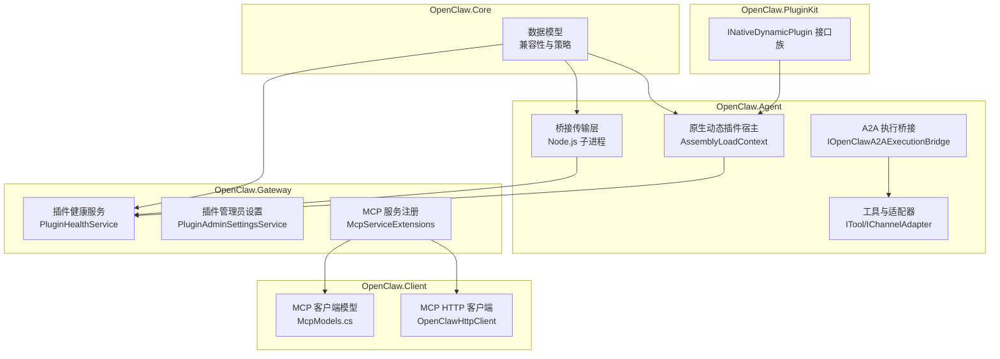
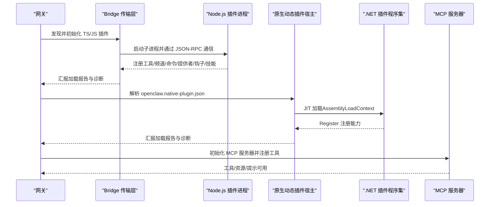
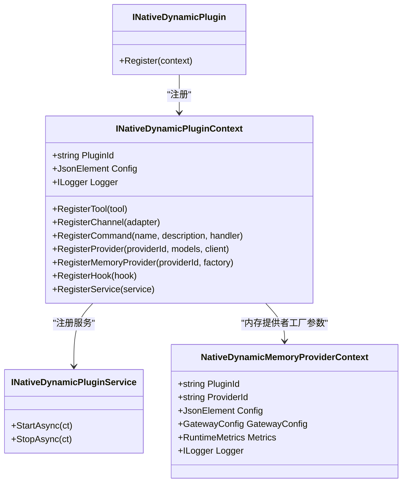
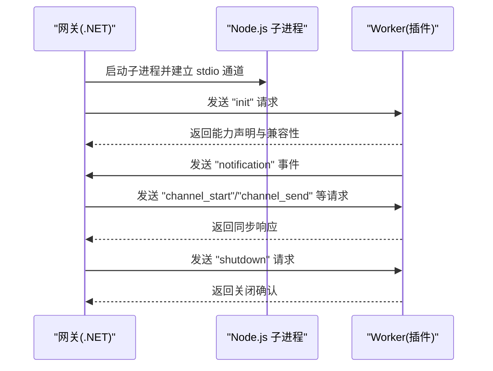
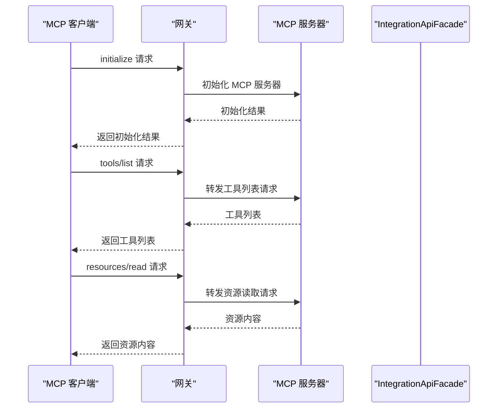
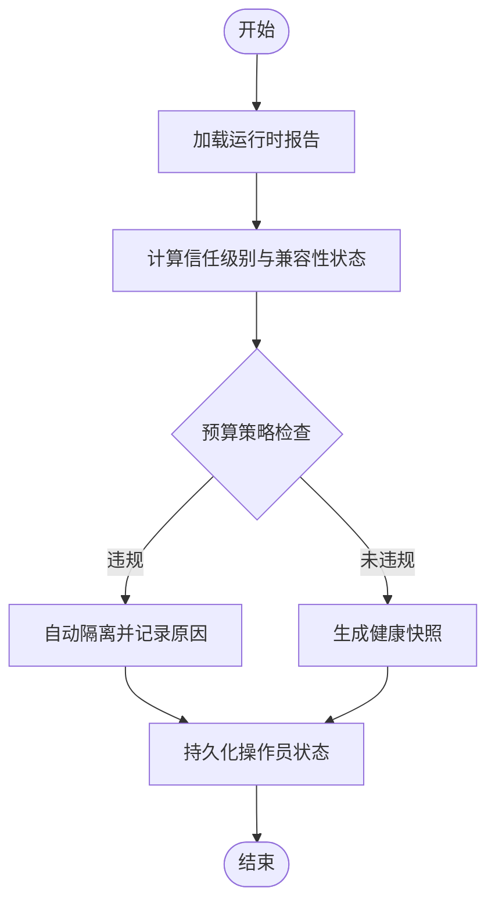
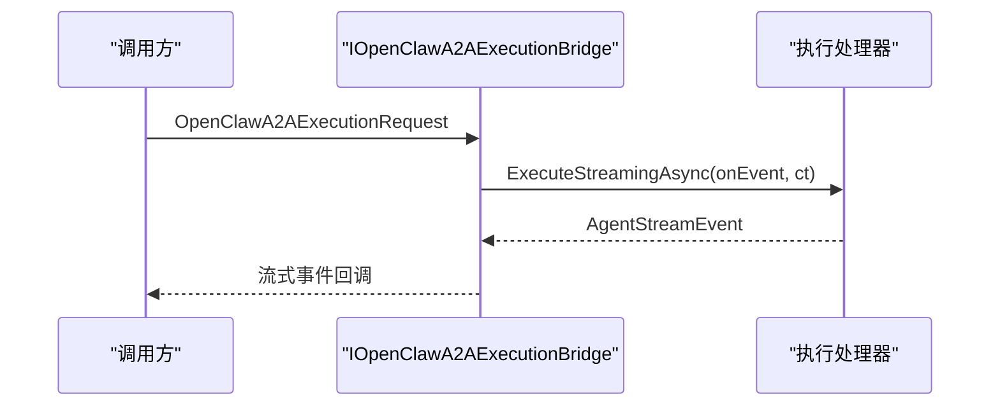
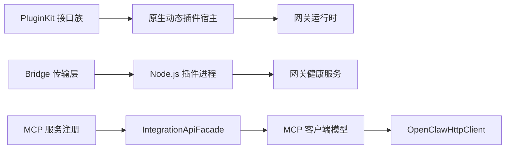

# 插件系统

<cite>
**本文引用的文件**
- [INativeDynamicPlugin.cs](file://src/OpenClaw.PluginKit/INativeDynamicPlugin.cs)
- [IOpenClawA2AExecutionBridge.cs](file://src/OpenClaw.Agent/A2A/IOpenClawA2AExecutionBridge.cs)
- [PluginAdminSettingsService.cs](file://src/OpenClaw.Gateway/PluginAdminSettingsService.cs)
- [PluginHealthService.cs](file://src/OpenClaw.Gateway/PluginHealthService.cs)
- [openclaw.native-plugin.json（就业教练工作流）](file://src/OpenClaw.Plugins.EmploymentCoachWorkflow/openclaw.native-plugin.json)
- [openclaw.native-plugin.json（记忆宫殿）](file://src/OpenClaw.Plugins.Mempalace/openclaw.native-plugin.json)
- [McpServiceExtensions.cs](file://src/OpenClaw.Gateway/Mcp/McpServiceExtensions.cs)
- [McpModels.cs](file://src/OpenClaw.Client/McpModels.cs)
- [OpenClawHttpClient.cs](file://src/OpenClaw.Client/OpenClawHttpClient.cs)
- [McpNativeTool.cs](file://src/OpenClaw.Agent/Tools/McpNativeTool.cs)
- [openclaw-plugin-system-analysis.md](file://docs/openclaw-plugin-system-analysis.md)
- [PluginBridgeIntegrationTests.cs](file://src/OpenClaw.Tests/PluginBridgeIntegrationTests.cs)
- [NativeDynamicPluginHostTests.cs](file://src/OpenClaw.Tests/NativeDynamicPluginHostTests.cs)
- [GatewayAdminEndpointTests.cs](file://src/OpenClaw.Tests/GatewayAdminEndpointTests.cs)
- [SecurityPostureBuilder.cs](file://src/OpenClaw.Gateway/SecurityPostureBuilder.cs)
</cite>

## 目录
1. [简介](#简介)
2. [项目结构](#项目结构)
3. [核心组件](#核心组件)
4. [架构总览](#架构总览)
5. [详细组件分析](#详细组件分析)
6. [依赖关系分析](#依赖关系分析)
7. [性能考量](#性能考量)
8. [故障排查指南](#故障排查指南)
9. [结论](#结论)
10. [附录](#附录)

## 简介
本技术文档面向插件系统的开发者与运维人员，系统性阐述 OpenClaw 插件体系的设计理念、桥接机制与原生插件支持，深入解析 TypeScript/JavaScript 插件通过 Node.js 桥接的实现原理、能力评估与安全控制；同时说明 .NET 原生插件的 JIT 加载机制、动态编译与性能考量，并介绍 MCP（Model Context Protocol）服务器的集成与使用。文档还提供插件开发指南、API 规范、兼容性矩阵与最佳实践，辅以示例、调试技巧与性能优化建议。

## 项目结构
插件系统横跨三个核心项目：
- OpenClaw.Core：负责数据模型、插件发现算法与验证逻辑
- OpenClaw.Agent：负责宿主编排、桥接传输、原生注册表与工具执行
- OpenClaw.PluginKit：提供动态 .NET 插件的公共 SDK 接口

此外，Gateway 层承担运行时组合与健康状态管理，CLI 与测试用例提供配置与集成验证支撑。

图表来源
- [openclaw-plugin-system-analysis.md:1-439](file://docs/openclaw-plugin-system-analysis.md#L1-L439)
- [INativeDynamicPlugin.cs:11-46](file://src/OpenClaw.PluginKit/INativeDynamicPlugin.cs#L11-L46)
- [PluginHealthService.cs:9-449](file://src/OpenClaw.Gateway/PluginHealthService.cs#L9-L449)
- [McpServiceExtensions.cs:11-36](file://src/OpenClaw.Gateway/Mcp/McpServiceExtensions.cs#L11-L36)

章节来源
- [openclaw-plugin-system-analysis.md:1-439](file://docs/openclaw-plugin-system-analysis.md#L1-L439)

## 核心组件
- 动态原生插件接口族（PluginKit）
  - INativeDynamicPlugin：插件入口，通过 Register 注册能力
  - INativeDynamicPluginContext：注册上下文，提供工具、频道、命令、提供者、内存提供者工厂、钩子、服务等注册能力
  - INativeDynamicPluginService：生命周期服务（StartAsync/StopAsync）
- 原生清单（openclaw.native-plugin.json）
  - 定义插件标识、程序集路径、类型名、能力、技能目录、JIT 限制等
- 网关健康与管理员设置
  - PluginHealthService：运行时报告聚合、信任级别判定、预算策略、操作员状态持久化
  - PluginAdminSettingsService：插件启用/禁用、配置覆盖的持久化与快照
- MCP 集成
  - McpServiceExtensions：注册官方 ModelContextProtocol 服务器与网关运行时桥接
  - McpModels：JSON-RPC 请求/响应与能力模型
  - OpenClawHttpClient：MCP 初始化、工具列表、资源读取等 HTTP 客户端封装
  - McpNativeTool：将 MCP 工具包装为 ITool 以便网关统一调度

章节来源
- [INativeDynamicPlugin.cs:11-46](file://src/OpenClaw.PluginKit/INativeDynamicPlugin.cs#L11-L46)
- [openclaw.native-plugin.json（就业教练工作流）:1-11](file://src/OpenClaw.Plugins.EmploymentCoachWorkflow/openclaw.native-plugin.json#L1-L11)
- [openclaw.native-plugin.json（记忆宫殿）:1-10](file://src/OpenClaw.Plugins.Mempalace/openclaw.native-plugin.json#L1-L10)
- [PluginHealthService.cs:9-449](file://src/OpenClaw.Gateway/PluginHealthService.cs#L9-L449)
- [PluginAdminSettingsService.cs:8-138](file://src/OpenClaw.Gateway/PluginAdminSettingsService.cs#L8-L138)
- [McpServiceExtensions.cs:11-36](file://src/OpenClaw.Gateway/Mcp/McpServiceExtensions.cs#L11-L36)
- [McpModels.cs:1-97](file://src/OpenClaw.Client/McpModels.cs#L1-L97)
- [OpenClawHttpClient.cs:254-280](file://src/OpenClaw.Client/OpenClawHttpClient.cs#L254-L280)
- [McpNativeTool.cs:1-36](file://src/OpenClaw.Agent/Tools/McpNativeTool.cs#L1-L36)

## 架构总览
插件系统支持四种来源：
- Bridge 插件（TS/JS）：通过 Node.js 子进程承载，基于 stdio/socket 的 JSON-RPC 通信
- 原生插件副本（C#）：进程内，面向已知清单的静态加载
- 动态原生插件（.NET）：JIT 模式下，使用 AssemblyLoadContext 动态加载与热重载
- MCP 服务器：外部工具生态的标准连接，支持 stdio/HTTP 传输

图表来源
- [openclaw-plugin-system-analysis.md:15-24](file://docs/openclaw-plugin-system-analysis.md#L15-L24)
- [McpServiceExtensions.cs:20-36](file://src/OpenClaw.Gateway/Mcp/McpServiceExtensions.cs#L20-L36)

章节来源
- [openclaw-plugin-system-analysis.md:15-24](file://docs/openclaw-plugin-system-analysis.md#L15-L24)

## 详细组件分析

### 动态原生插件（.NET）与 PluginKit
动态原生插件通过 openclaw.native-plugin.json 清单声明能力与入口，JIT 模式下由宿主加载到可卸载的 AssemblyLoadContext，实现热重载与隔离。注册上下文提供工具、频道、命令、提供者、内存提供者工厂、钩子、服务与技能目录注册。

图表来源
- [INativeDynamicPlugin.cs:11-46](file://src/OpenClaw.PluginKit/INativeDynamicPlugin.cs#L11-L46)

章节来源
- [INativeDynamicPlugin.cs:11-46](file://src/OpenClaw.PluginKit/INativeDynamicPlugin.cs#L11-L46)
- [openclaw.native-plugin.json（就业教练工作流）:1-11](file://src/OpenClaw.Plugins.EmploymentCoachWorkflow/openclaw.native-plugin.json#L1-L11)
- [openclaw.native-plugin.json（记忆宫殿）:1-10](file://src/OpenClaw.Plugins.Mempalace/openclaw.native-plugin.json#L1-L10)

### Bridge 插件（TS/JS）与 Node.js 桥接
Bridge 插件由宿主发现并以 Node.js 子进程运行，采用 JSON-RPC 2.0 变体通过 stdio 通信。宿主与 Worker 端约定请求/响应/通知格式，stdout 专用于 JSON-RPC，避免与诊断日志冲突。

图表来源
- [openclaw-plugin-system-analysis.md:249-333](file://docs/openclaw-plugin-system-analysis.md#L249-L333)

章节来源
- [openclaw-plugin-system-analysis.md:249-333](file://docs/openclaw-plugin-system-analysis.md#L249-L333)
- [PluginBridgeIntegrationTests.cs:44-90](file://src/OpenClaw.Tests/PluginBridgeIntegrationTests.cs#L44-L90)
- [PluginBridgeIntegrationTests.cs:745-787](file://src/OpenClaw.Tests/PluginBridgeIntegrationTests.cs#L745-L787)

### MCP 服务器集成与使用
网关通过 McpServiceExtensions 注册官方 ModelContextProtocol 服务器，并在运行时桥接到 GatewayAppRuntime。客户端使用 McpModels 与 OpenClawHttpClient 进行初始化、工具列表查询与资源读取。

图表来源
- [McpServiceExtensions.cs:20-36](file://src/OpenClaw.Gateway/Mcp/McpServiceExtensions.cs#L20-L36)
- [McpModels.cs:27-97](file://src/OpenClaw.Client/McpModels.cs#L27-L97)
- [OpenClawHttpClient.cs:262-280](file://src/OpenClaw.Client/OpenClawHttpClient.cs#L262-L280)
- [GatewayAdminEndpointTests.cs:5973-6001](file://src/OpenClaw.Tests/GatewayAdminEndpointTests.cs#L5973-L6001)

章节来源
- [McpServiceExtensions.cs:11-36](file://src/OpenClaw.Gateway/Mcp/McpServiceExtensions.cs#L11-L36)
- [McpModels.cs:1-97](file://src/OpenClaw.Client/McpModels.cs#L1-L97)
- [OpenClawHttpClient.cs:254-280](file://src/OpenClaw.Client/OpenClawHttpClient.cs#L254-L280)
- [GatewayAdminEndpointTests.cs:5973-6001](file://src/OpenClaw.Tests/GatewayAdminEndpointTests.cs#L5973-L6001)

### 插件健康与管理员设置
PluginHealthService 聚合运行时报告，计算信任级别、兼容性状态与预算违规，支持自动隔离与手动审查。PluginAdminSettingsService 提供插件启用/禁用、配置覆盖与持久化。

图表来源
- [PluginHealthService.cs:44-158](file://src/OpenClaw.Gateway/PluginHealthService.cs#L44-L158)
- [PluginHealthService.cs:239-291](file://src/OpenClaw.Gateway/PluginHealthService.cs#L239-L291)
- [PluginAdminSettingsService.cs:70-129](file://src/OpenClaw.Gateway/PluginAdminSettingsService.cs#L70-L129)

章节来源
- [PluginHealthService.cs:9-449](file://src/OpenClaw.Gateway/PluginHealthService.cs#L9-L449)
- [PluginAdminSettingsService.cs:8-138](file://src/OpenClaw.Gateway/PluginAdminSettingsService.cs#L8-L138)

### A2A 执行桥接
A2A（Agent-to-Agent）执行桥接提供统一的请求模型与流式事件回调，便于跨通道的消息处理与事件驱动。

图表来源
- [IOpenClawA2AExecutionBridge.cs:5-21](file://src/OpenClaw.Agent/A2A/IOpenClawA2AExecutionBridge.cs#L5-L21)

章节来源
- [IOpenClawA2AExecutionBridge.cs:14-21](file://src/OpenClaw.Agent/A2A/IOpenClawA2AExecutionBridge.cs#L14-L21)

## 依赖关系分析
- 插件来源耦合度
  - Bridge 插件与 MCP 服务器通过 JSON-RPC 与网关交互，耦合度低，隔离性好
  - 原生动态插件与宿主强耦合，依赖 PluginKit API 与 AssemblyLoadContext
  - 原生插件副本与宿主弱耦合，依赖清单与已知类型
- 关键依赖链
  - PluginKit 接口族 → 原生动态插件宿主 → 网关运行时
  - Bridge 传输层 → Node.js 插件进程 → 网关健康服务
  - MCP 服务注册 → IntegrationApiFacade → 客户端模型与 HTTP 客户端

图表来源
- [INativeDynamicPlugin.cs:11-46](file://src/OpenClaw.PluginKit/INativeDynamicPlugin.cs#L11-L46)
- [PluginHealthService.cs:9-449](file://src/OpenClaw.Gateway/PluginHealthService.cs#L9-L449)
- [McpServiceExtensions.cs:20-36](file://src/OpenClaw.Gateway/Mcp/McpServiceExtensions.cs#L20-L36)
- [McpModels.cs:1-97](file://src/OpenClaw.Client/McpModels.cs#L1-L97)
- [OpenClawHttpClient.cs:254-280](file://src/OpenClaw.Client/OpenClawHttpClient.cs#L254-L280)

章节来源
- [openclaw-plugin-system-analysis.md:408-417](file://docs/openclaw-plugin-system-analysis.md#L408-L417)

## 性能考量
- Bridge 插件
  - 启动成本：Node.js 进程生成约 100–300ms
  - 内存占用：子进程独立驻留，需监控工作集与私有内存
  - 参考测量：测试用例对 JS/TS 插件桥接子进程内存进行测量与断言
- 原生动态插件
  - 启动成本：程序集加载约 10–50ms
  - 隔离与热重载：AssemblyLoadContext 支持卸载与重载
  - JIT 限制：清单中 jitOnly=true 时仅在 JIT 模式下允许加载
- MCP 服务器
  - 启动成本：进程生成约 100–500ms
  - 传输开销：stdio 与 HTTP 传输的选择影响延迟与吞吐
- 安全与隔离
  - 网关安全姿态根据绑定模式、沙箱配置与浏览器工具可用性综合评估
  - 沙箱策略与公共绑定加固确保在非本地绑定场景下的安全基线

章节来源
- [openclaw-plugin-system-analysis.md:418-429](file://docs/openclaw-plugin-system-analysis.md#L418-L429)
- [PluginBridgeIntegrationTests.cs:745-787](file://src/OpenClaw.Tests/PluginBridgeIntegrationTests.cs#L745-L787)
- [NativeDynamicPluginHostTests.cs:41-203](file://src/OpenClaw.Tests/NativeDynamicPluginHostTests.cs#L41-L203)
- [SecurityPostureBuilder.cs:9-24](file://src/OpenClaw.Gateway/SecurityPostureBuilder.cs#L9-L24)

## 故障排查指南
- 插件健康与隔离
  - 使用 PluginHealthService.ListSnapshots 获取插件健康快照，关注信任级别、兼容性状态、重启次数与内存指标
  - 若触发预算策略（重启次数、工作集、兼容性错误），系统会自动隔离并记录原因
- 管理员设置
  - 通过 PluginAdminSettingsService 设置禁用/隔离/审查状态，持久化至存储路径
- Bridge 插件问题
  - 检查 Node.js 子进程是否正常启动、stdout 是否被正确保留用于 JSON-RPC
  - 确认入口文件解析与清单中的能力声明一致
- 原生动态插件问题
  - 确认清单中 jitOnly 与当前运行模式匹配
  - 检查程序集路径与类型名是否正确，以及是否满足最低宿主版本与 PluginKit 版本要求
- MCP 服务器问题
  - 确认服务器初始化成功、工具列表与资源读取可用
  - 检查客户端模型与 HTTP 客户端封装是否正确

章节来源
- [PluginHealthService.cs:58-158](file://src/OpenClaw.Gateway/PluginHealthService.cs#L58-L158)
- [PluginHealthService.cs:160-189](file://src/OpenClaw.Gateway/PluginHealthService.cs#L160-L189)
- [PluginAdminSettingsService.cs:70-129](file://src/OpenClaw.Gateway/PluginAdminSettingsService.cs#L70-L129)
- [GatewayAdminEndpointTests.cs:5973-6001](file://src/OpenClaw.Tests/GatewayAdminEndpointTests.cs#L5973-L6001)

## 结论
OpenClaw 插件系统通过多来源融合与严格的安全与性能策略，实现了高扩展性与可控风险的运行环境。Bridge 插件提供进程隔离与外部运行时灵活性；原生动态插件提供深度集成与热重载能力；MCP 服务器打通外部工具生态。结合健康服务、管理员设置与安全姿态构建，可实现从开发到生产的全生命周期治理。

## 附录

### 插件开发指南
- 动态原生插件
  - 使用 PluginKit 接口族实现 INativeDynamicPlugin，通过 Register 注册工具、频道、命令、提供者、钩子、服务与技能目录
  - 编写 openclaw.native-plugin.json，声明能力、程序集路径、类型名与 jitOnly
  - 在 JIT 模式下构建与部署，确保最低宿主版本与 PluginKit 版本匹配
- Bridge 插件（TS/JS）
  - 准备 openclaw.plugin.json 与入口文件（index.ts/js/mjs），遵循入口解析优先级
  - 使用 jiti 加载 .ts 插件，确保 stdout 专用于 JSON-RPC
  - 在 Gateway 配置中启用 Bridge 插件并设置传输模式
- MCP 服务器
  - 通过 McpServiceExtensions 注册服务器，使用 IntegrationApiFacade 桥接网关运行时
  - 客户端使用 McpModels 与 OpenClawHttpClient 进行初始化与工具/资源交互

章节来源
- [INativeDynamicPlugin.cs:11-46](file://src/OpenClaw.PluginKit/INativeDynamicPlugin.cs#L11-L46)
- [openclaw.native-plugin.json（就业教练工作流）:1-11](file://src/OpenClaw.Plugins.EmploymentCoachWorkflow/openclaw.native-plugin.json#L1-L11)
- [openclaw.native-plugin.json（记忆宫殿）:1-10](file://src/OpenClaw.Plugins.Mempalace/openclaw.native-plugin.json#L1-L10)
- [openclaw-plugin-system-analysis.md:418-429](file://docs/openclaw-plugin-system-analysis.md#L418-L429)
- [McpServiceExtensions.cs:20-36](file://src/OpenClaw.Gateway/Mcp/McpServiceExtensions.cs#L20-L36)
- [McpModels.cs:1-97](file://src/OpenClaw.Client/McpModels.cs#L1-L97)
- [OpenClawHttpClient.cs:254-280](file://src/OpenClaw.Client/OpenClawHttpClient.cs#L254-L280)

### API 规范与兼容性矩阵
- 动态原生插件能力
  - 支持工具、频道、命令、提供者、钩子、服务、技能目录注册
  - AOT 模式下受 jitOnly 限制
- Bridge 插件能力
  - 支持工具、频道、命令、提供者、钩子、技能注册
  - 进程隔离，传输模式支持 stdio/socket
- MCP 服务器能力
  - 标准化工具/资源/提示能力，支持 stdio/HTTP 传输
- 兼容性矩阵（摘要）
  - Bridge：JIT/AOT 均可，进程隔离，通道/钩子支持完整
  - 原生动态：仅 JIT，进程内，支持热重载
  - MCP：JIT/AOT 均可，进程隔离，工具为主

章节来源
- [openclaw-plugin-system-analysis.md:418-429](file://docs/openclaw-plugin-system-analysis.md#L418-L429)
- [openclaw-plugin-system-analysis.md:391-407](file://docs/openclaw-plugin-system-analysis.md#L391-L407)

### 最佳实践
- 优先使用 Bridge 插件承载需要外部运行时的场景，确保进程隔离与稳定性
- 原生动态插件适用于高性能与深度集成需求，注意 JIT 模式与热重载策略
- MCP 服务器用于对接外部工具生态，合理选择传输模式与能力声明
- 通过 PluginHealthService 与管理员设置建立自动化与人工审查相结合的治理机制
- 在公共绑定场景下启用沙箱与安全姿态评估，确保最小暴露面

章节来源
- [SecurityPostureBuilder.cs:9-24](file://src/OpenClaw.Gateway/SecurityPostureBuilder.cs#L9-L24)
- [PluginHealthService.cs:239-291](file://src/OpenClaw.Gateway/PluginHealthService.cs#L239-L291)
- [PluginAdminSettingsService.cs:70-129](file://src/OpenClaw.Gateway/PluginAdminSettingsService.cs#L70-L129)