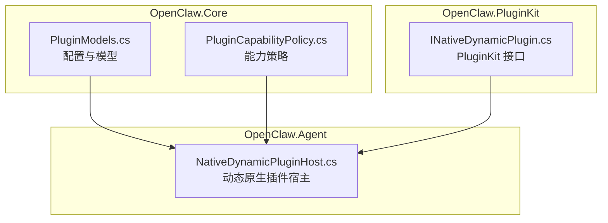
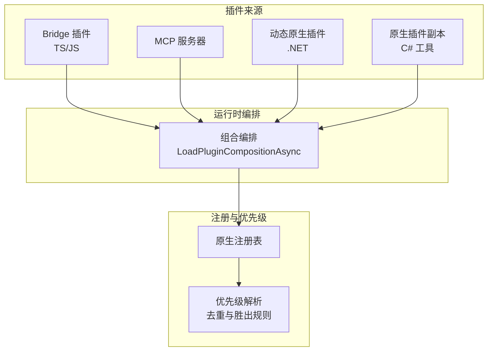
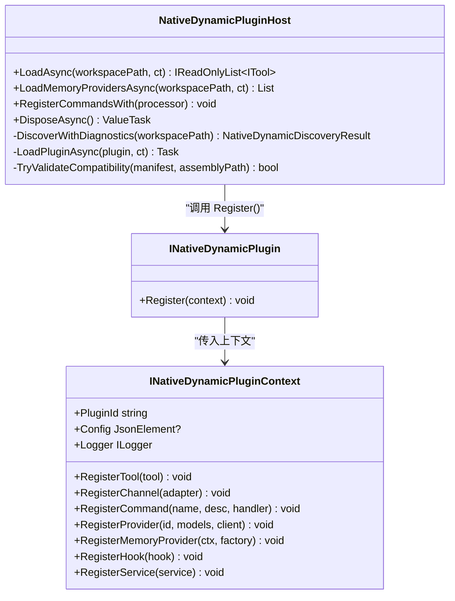
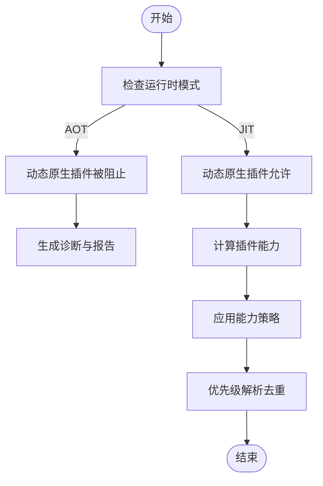
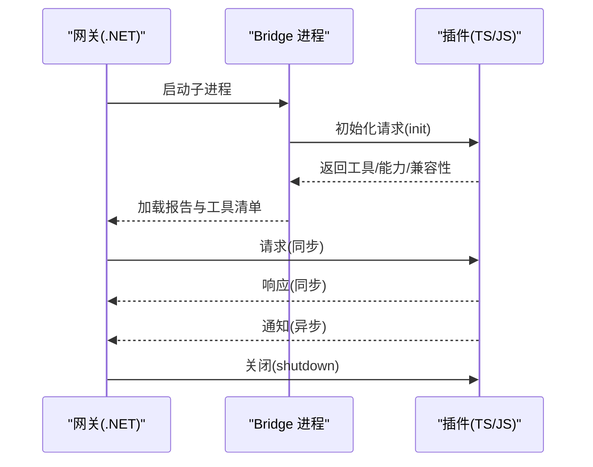
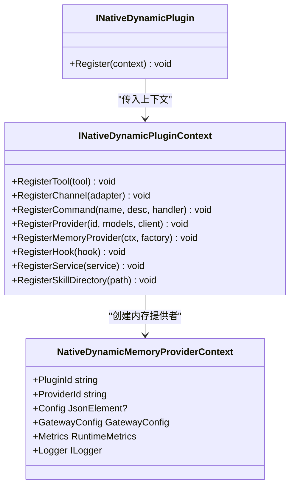
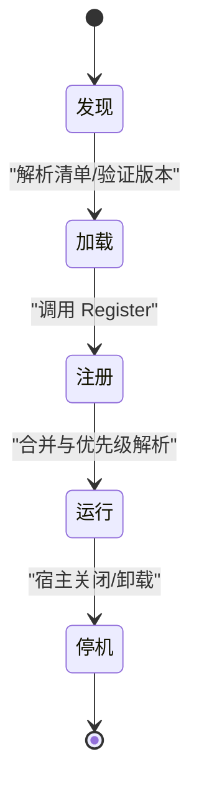
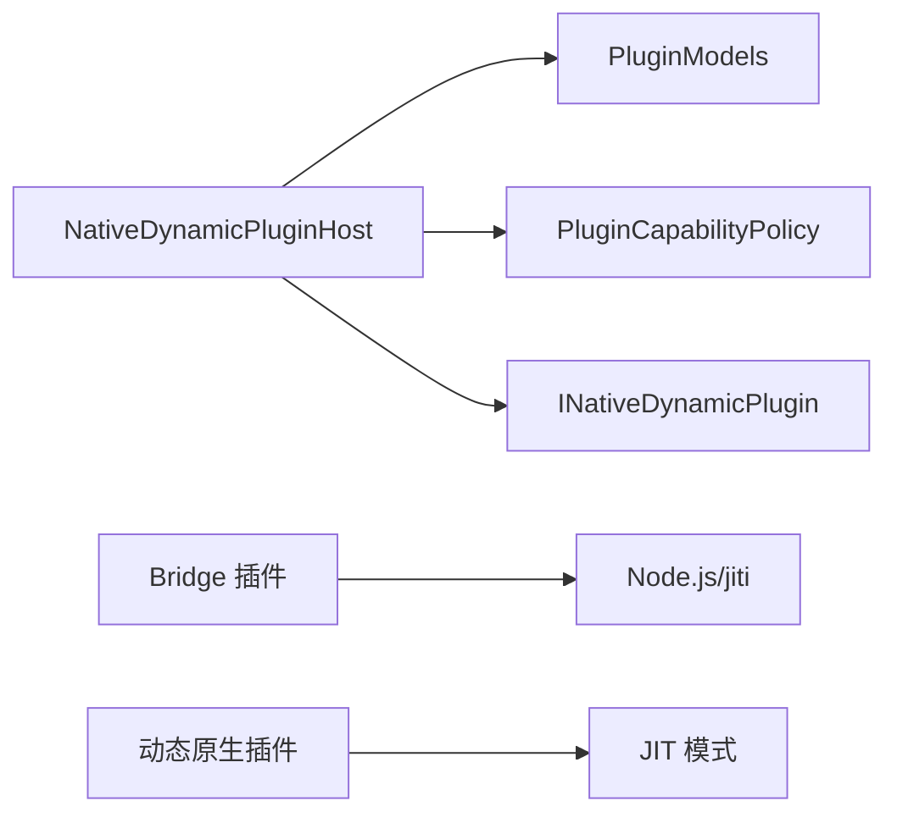

# 插件系统

<cite>
**本文档引用的文件**
- [INativeDynamicPlugin.cs](file://src/OpenClaw.PluginKit/INativeDynamicPlugin.cs)
- [NativeDynamicPluginHost.cs](file://src/OpenClaw.Agent/Plugins/NativeDynamicPluginHost.cs)
- [PluginModels.cs](file://src/OpenClaw.Core/Plugins/PluginModels.cs)
- [PluginCapabilityPolicy.cs](file://src/OpenClaw.Core/Plugins/PluginCapabilityPolicy.cs)
- [openclaw-plugin-system-analysis.md](file://docs/openclaw-plugin-system-analysis.md)
- [PluginBridgeIntegrationTests.cs](file://src/OpenClaw.Tests/PluginBridgeIntegrationTests.cs)
- [NativeDynamicPluginHostTests.cs](file://src/OpenClaw.Tests/NativeDynamicPluginHostTests.cs)
- [MempalaceMemoryStoreTests.cs](file://src/OpenClaw.Tests/MempalaceMemoryStoreTests.cs)
</cite>

## 目录
1. [简介](#简介)
2. [项目结构](#项目结构)
3. [核心组件](#核心组件)
4. [架构总览](#架构总览)
5. [详细组件分析](#详细组件分析)
6. [依赖关系分析](#依赖关系分析)
7. [性能考量](#性能考量)
8. [故障排查指南](#故障排查指南)
9. [结论](#结论)
10. [附录](#附录)

## 简介
本文件面向插件开发者与维护者，系统性阐述 OpenClaw 插件体系的设计与实现，重点覆盖以下方面：
- 插件架构与四大来源：Bridge（TS/JS）、原生动态（.NET）、原生插件副本（C#）、MCP 服务器
- 动态原生插件加载机制：清单发现、兼容性校验、程序集隔离与热重载
- 能力评估与运行时模式门控：AOT/JIT 限制与能力策略
- JS/TS 插件桥接：传输层、JSON-RPC 协议、进程间通信
- .NET 原生插件开发：PluginKit API、注册上下文、生命周期管理
- 插件生命周期管理：发现、加载、注册、运行、停机与清理
- 开发指南、API 规范、安全控制与最佳实践
- 示例、开发工具与调试方法

## 项目结构
OpenClaw 插件系统横跨三个核心项目：
- OpenClaw.Core：数据模型、发现算法、验证逻辑与能力策略
- OpenClaw.Agent：宿主编排、桥接传输、原生注册表与动态原生插件宿主
- OpenClaw.PluginKit：动态 .NET 插件 SDK（公共 API）

**图表来源**
- [PluginModels.cs:1-120](file://src/OpenClaw.Core/Plugins/PluginModels.cs#L1-L120)
- [PluginCapabilityPolicy.cs:1-58](file://src/OpenClaw.Core/Plugins/PluginCapabilityPolicy.cs#L1-L58)
- [NativeDynamicPluginHost.cs:1-120](file://src/OpenClaw.Agent/Plugins/NativeDynamicPluginHost.cs#L1-L120)
- [INativeDynamicPlugin.cs:1-46](file://src/OpenClaw.PluginKit/INativeDynamicPlugin.cs#L1-L46)

**章节来源**
- [openclaw-plugin-system-analysis.md:1-40](file://docs/openclaw-plugin-system-analysis.md#L1-L40)

## 核心组件
- 动态原生插件宿主（NativeDynamicPluginHost）
  - 负责发现、验证、加载与卸载原生动态插件
  - 管理工具、频道、命令、提供者、钩子、内存提供者与技能目录注册
  - 提供结构化诊断与加载报告
- PluginKit 接口（INativeDynamicPlugin）
  - 定义原生动态插件的注册入口与上下文能力
- 插件模型与配置（PluginModels）
  - 定义清单、发现结果、加载报告、桥接传输配置等
- 能力策略（PluginCapabilityPolicy）
  - 基于运行时模式（AOT/JIT）与插件能力的门控策略

**章节来源**
- [NativeDynamicPluginHost.cs:1-120](file://src/OpenClaw.Agent/Plugins/NativeDynamicPluginHost.cs#L1-L120)
- [INativeDynamicPlugin.cs:1-46](file://src/OpenClaw.PluginKit/INativeDynamicPlugin.cs#L1-L46)
- [PluginModels.cs:677-706](file://src/OpenClaw.Core/Plugins/PluginModels.cs#L677-L706)
- [PluginCapabilityPolicy.cs:1-58](file://src/OpenClaw.Core/Plugins/PluginCapabilityPolicy.cs#L1-L58)

## 架构总览
OpenClaw 插件系统支持四种来源，统一在运行时组合为 PluginComposition：
- Bridge 插件（TS/JS）：通过 Node.js 子进程承载，JSON-RPC 通信
- 原生插件副本（C#）：进程内工具注册
- 动态原生插件（.NET）：进程内加载，支持热重载
- MCP 服务器：外部进程工具生态接入

**图表来源**
- [openclaw-plugin-system-analysis.md:408-417](file://docs/openclaw-plugin-system-analysis.md#L408-L417)

**章节来源**
- [openclaw-plugin-system-analysis.md:15-40](file://docs/openclaw-plugin-system-analysis.md#L15-L40)

## 详细组件分析

### 动态原生插件宿主（NativeDynamicPluginHost）
- 发现与过滤
  - 支持多路径扫描（配置路径、工作区、用户目录）
  - 基于清单 openclaw.native-plugin.json 的解析与校验
  - 过滤策略：拒绝列表、允许列表、单插件启用、槽位独占
- 兼容性验证
  - 最低宿主版本、插件 API 版本、PluginKit 引用版本一致性
  - AOT 模式下禁止动态原生插件
- 加载与隔离
  - 使用可卸载的 AssemblyLoadContext 加载插件程序集
  - 程序集共享策略：System.*、Microsoft.*、netstandard、OpenClaw.Core、OpenClaw.PluginKit 从宿主共享
- 注册与报告
  - 注册工具、频道、命令、提供者、钩子、内存提供者、技能目录
  - 生成结构化诊断与加载报告
- 生命周期
  - Start：加载插件、启动服务、注册组件
  - Stop：停止服务、卸载程序集、释放资源

**图表来源**
- [NativeDynamicPluginHost.cs:19-63](file://src/OpenClaw.Agent/Plugins/NativeDynamicPluginHost.cs#L19-L63)
- [INativeDynamicPlugin.cs:11-46](file://src/OpenClaw.PluginKit/INativeDynamicPlugin.cs#L11-L46)

**章节来源**
- [NativeDynamicPluginHost.cs:64-169](file://src/OpenClaw.Agent/Plugins/NativeDynamicPluginHost.cs#L64-L169)
- [NativeDynamicPluginHost.cs:210-345](file://src/OpenClaw.Agent/Plugins/NativeDynamicPluginHost.cs#L210-L345)
- [INativeDynamicPlugin.cs:11-46](file://src/OpenClaw.PluginKit/INativeDynamicPlugin.cs#L11-L46)

### 能力评估与运行时门控
- 能力字符串：tools、services、skills、channels、commands、providers、hooks、native_dynamic
- AOT 模式门控
  - Bridge 插件：允许（进程外）
  - 动态原生插件：禁止（依赖 JIT）
- 优先级解析
  - 冲突时：内置工具优先
  - 单工具覆盖：Plugins:Overrides:{tool-name}
  - 全局默认：Plugins:Prefer（native/bridge）

**图表来源**
- [PluginCapabilityPolicy.cs:31-57](file://src/OpenClaw.Core/Plugins/PluginCapabilityPolicy.cs#L31-L57)
- [openclaw-plugin-system-analysis.md:400-407](file://docs/openclaw-plugin-system-analysis.md#L400-L407)

**章节来源**
- [PluginCapabilityPolicy.cs:1-58](file://src/OpenClaw.Core/Plugins/PluginCapabilityPolicy.cs#L1-L58)
- [openclaw-plugin-system-analysis.md:391-407](file://docs/openclaw-plugin-system-analysis.md#L391-L407)

### JS/TS 插件桥接（Bridge 传输层）
- 架构
  - 宿主-工作模型：.NET 网关为 JSON-RPC 客户端，TS/JS 插件为独立 Worker 进程
  - 通信通道：请求（网关→插件，同步）与通知（插件→网关，异步）
  - stdout 专用于 JSON-RPC，JS Worker 将 console.log 重定向至 stderr
- 协议契约
  - 请求封包：包含 method、id、params
  - 响应封包：包含 id、result、error
  - 通知封包：包含 notification、params
- 传输模式
  - stdio（唯一实战验证）、socket、hybrid（预留）

**图表来源**
- [openclaw-plugin-system-analysis.md:249-332](file://docs/openclaw-plugin-system-analysis.md#L249-L332)

**章节来源**
- [openclaw-plugin-system-analysis.md:249-332](file://docs/openclaw-plugin-system-analysis.md#L249-L332)
- [PluginBridgeIntegrationTests.cs:758-784](file://src/OpenClaw.Tests/PluginBridgeIntegrationTests.cs#L758-L784)

### .NET 原生插件开发（PluginKit）
- 接口与上下文
  - INativeDynamicPlugin：Register(INativeDynamicPluginContext)
  - INativeDynamicPluginContext：注册工具、频道、命令、提供者、钩子、服务、技能目录
- 开发流程
  - 编写插件实现类，实现 INativeDynamicPlugin.Register
  - 在 openclaw.native-plugin.json 中声明清单（id、assemblyPath、typeName、capabilities、skills）
  - 构建并放置到加载路径，确保清单与程序集在同一目录
- 生命周期
  - 宿主加载后调用 Register，随后启动服务（如需）
  - 运行期注册组件（工具、频道、命令、提供者、钩子、内存提供者、技能目录）
  - 宿主停机时停止服务并卸载程序集

**图表来源**
- [INativeDynamicPlugin.cs:11-46](file://src/OpenClaw.PluginKit/INativeDynamicPlugin.cs#L11-L46)

**章节来源**
- [INativeDynamicPlugin.cs:11-46](file://src/OpenClaw.PluginKit/INativeDynamicPlugin.cs#L11-L46)
- [openclaw-plugin-system-analysis.md:363-387](file://docs/openclaw-plugin-system-analysis.md#L363-L387)

### 插件生命周期管理
- 发现阶段
  - 扫描配置路径、工作区、用户目录
  - 解析 openclaw.native-plugin.json，验证程序集路径与清单完整性
- 加载阶段
  - 验证最低宿主版本、插件 API 版本、PluginKit 引用版本
  - 在 JIT 模式下加载程序集，AOT 模式下拒绝动态原生插件
- 注册阶段
  - 调用插件 Register，收集工具、频道、命令、提供者、钩子、内存提供者、技能目录
  - 生成结构化诊断与加载报告
- 运行阶段
  - 与其他来源（Bridge、原生副本、MCP）合并，执行优先级解析
  - 提供工具、频道、命令、提供者、钩子、内存提供者、技能目录
- 停机阶段
  - 停止服务、卸载程序集、释放资源，清理注册表

**图表来源**
- [NativeDynamicPluginHost.cs:64-169](file://src/OpenClaw.Agent/Plugins/NativeDynamicPluginHost.cs#L64-L169)
- [NativeDynamicPluginHost.cs:210-345](file://src/OpenClaw.Agent/Plugins/NativeDynamicPluginHost.cs#L210-L345)

**章节来源**
- [NativeDynamicPluginHost.cs:64-169](file://src/OpenClaw.Agent/Plugins/NativeDynamicPluginHost.cs#L64-L169)
- [NativeDynamicPluginHost.cs:210-345](file://src/OpenClaw.Agent/Plugins/NativeDynamicPluginHost.cs#L210-L345)

## 依赖关系分析
- 组件耦合
  - NativeDynamicPluginHost 依赖 Core 的模型与策略，依赖 PluginKit 的接口
  - 插件清单与配置通过 PluginModels 定义，能力策略通过 PluginCapabilityPolicy 控制
- 外部依赖
  - Bridge 插件依赖 Node.js 运行时与 jiti（TS 插件）
  - 动态原生插件依赖 JIT 模式与 AssemblyLoadContext
- 潜在循环依赖
  - 通过接口与抽象（ITool、IChannelAdapter、IToolHook 等）解耦，避免循环

**图表来源**
- [PluginModels.cs:677-706](file://src/OpenClaw.Core/Plugins/PluginModels.cs#L677-L706)
- [PluginCapabilityPolicy.cs:1-58](file://src/OpenClaw.Core/Plugins/PluginCapabilityPolicy.cs#L1-L58)
- [openclaw-plugin-system-analysis.md:249-332](file://docs/openclaw-plugin-system-analysis.md#L249-L332)

**章节来源**
- [PluginModels.cs:677-706](file://src/OpenClaw.Core/Plugins/PluginModels.cs#L677-L706)
- [PluginCapabilityPolicy.cs:1-58](file://src/OpenClaw.Core/Plugins/PluginCapabilityPolicy.cs#L1-L58)

## 性能考量
- 启动成本
  - Bridge 插件：Node.js 进程生成（约 100-300ms）
  - 动态原生插件：程序集加载（约 10-50ms）
  - MCP 服务器：进程生成（约 100-500ms）
- 内存占用
  - Bridge 插件通过子进程隔离，内存测量包含宿主与子进程快照
- 传输效率
  - stdio 为唯一实战验证的传输方式，socket 可用于高吞吐量场景

**章节来源**
- [openclaw-plugin-system-analysis.md:418-429](file://docs/openclaw-plugin-system-analysis.md#L418-L429)
- [PluginBridgeIntegrationTests.cs:785-829](file://src/OpenClaw.Tests/PluginBridgeIntegrationTests.cs#L785-L829)

## 故障排查指南
- 常见问题与诊断
  - 程序集不在根目录内：assembly_outside_root
  - 程序集未找到：assembly_not_found
  - 最低宿主版本不满足：host_version_too_old
  - 插件 API 版本不匹配：plugin_api_version_mismatch
  - 插件 ID 重复：duplicate_plugin_id
  - 技能目录声明越界：skill_dir_outside_root
- 宿主日志
  - 结构化日志记录诊断信息，包含严重级别、代码、表面、路径与消息
- 单元测试参考
  - 动态原生插件加载与安全校验
  - Bridge 插件内存测量与进程交互

**章节来源**
- [NativeDynamicPluginHost.cs:520-649](file://src/OpenClaw.Agent/Plugins/NativeDynamicPluginHost.cs#L520-L649)
- [NativeDynamicPluginHost.cs:171-188](file://src/OpenClaw.Agent/Plugins/NativeDynamicPluginHost.cs#L171-L188)
- [NativeDynamicPluginHostTests.cs:160-193](file://src/OpenClaw.Tests/NativeDynamicPluginHostTests.cs#L160-L193)
- [PluginBridgeIntegrationTests.cs:758-784](file://src/OpenClaw.Tests/PluginBridgeIntegrationTests.cs#L758-L784)

## 结论
OpenClaw 插件系统通过清晰的层次划分与严格的运行时门控，实现了多来源插件的统一扩展与高效运行。动态原生插件在 JIT 模式下提供进程内深度集成与热重载能力；Bridge 插件通过进程隔离满足外部运行时需求；能力策略与优先级解析确保系统稳定性与一致性。开发者可根据场景选择合适的扩展方式，并遵循安全与性能最佳实践。

## 附录

### 开发指南与最佳实践
- 动态原生插件
  - 使用 openclaw.native-plugin.json 声明清单，确保 assemblyPath 与 typeName 正确
  - 在 Register 中仅注册必要组件，避免重复与冲突
  - 使用 NativeDynamicMemoryProviderContext 创建内存提供者工厂
  - 在 AOT 模式下避免依赖动态原生插件
- Bridge 插件
  - 使用 stdio 传输，stdout 专用于 JSON-RPC
  - TS 插件需安装 jiti 依赖
  - 严格遵守 JSON-RPC 协议契约
- 安全控制
  - 使用能力策略与运行时门控限制危险能力
  - 通过过滤列表与槽位独占控制插件启用
  - 对程序集路径进行越界检测

**章节来源**
- [openclaw-plugin-system-analysis.md:142-247](file://docs/openclaw-plugin-system-analysis.md#L142-L247)
- [openclaw-plugin-system-analysis.md:249-332](file://docs/openclaw-plugin-system-analysis.md#L249-L332)
- [PluginModels.cs:677-706](file://src/OpenClaw.Core/Plugins/PluginModels.cs#L677-L706)
- [PluginCapabilityPolicy.cs:31-57](file://src/OpenClaw.Core/Plugins/PluginCapabilityPolicy.cs#L31-L57)

### API 接口规范（摘要）
- 动态原生插件接口
  - INativeDynamicPlugin.Register(INativeDynamicPluginContext)
  - INativeDynamicPluginContext：RegisterTool、RegisterChannel、RegisterCommand、RegisterProvider、RegisterMemoryProvider、RegisterHook、RegisterService、RegisterSkillDirectory
- Bridge 插件协议
  - 请求：init、channel_start、channel_send、shutdown 等
  - 响应：result/error
  - 通知：channel_message 等

**章节来源**
- [INativeDynamicPlugin.cs:11-46](file://src/OpenClaw.PluginKit/INativeDynamicPlugin.cs#L11-L46)
- [openclaw-plugin-system-analysis.md:259-332](file://docs/openclaw-plugin-system-analysis.md#L259-L332)

### 示例与测试参考
- 动态原生插件示例
  - EmploymentCoachWorkflow 插件与 Mempalace 内存插件
- 测试用例
  - 动态原生插件加载与安全校验
  - Bridge 插件内存测量与进程交互

**章节来源**
- [NativeDynamicPluginHostTests.cs:130-234](file://src/OpenClaw.Tests/NativeDynamicPluginHostTests.cs#L130-L234)
- [MempalaceMemoryStoreTests.cs:38-67](file://src/OpenClaw.Tests/MempalaceMemoryStoreTests.cs#L38-L67)
- [PluginBridgeIntegrationTests.cs:44-829](file://src/OpenClaw.Tests/PluginBridgeIntegrationTests.cs#L44-L829)