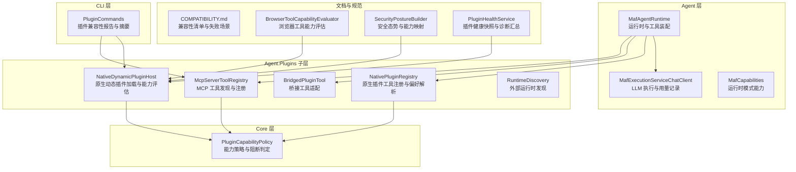
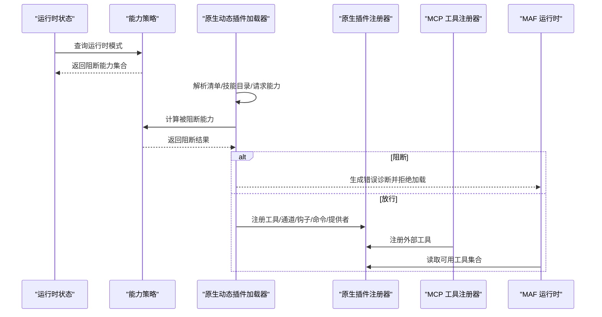
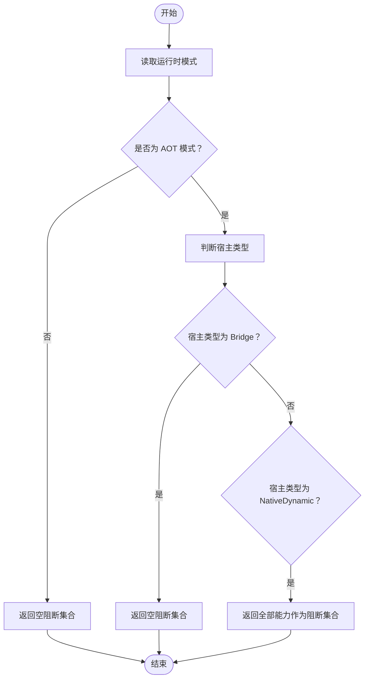
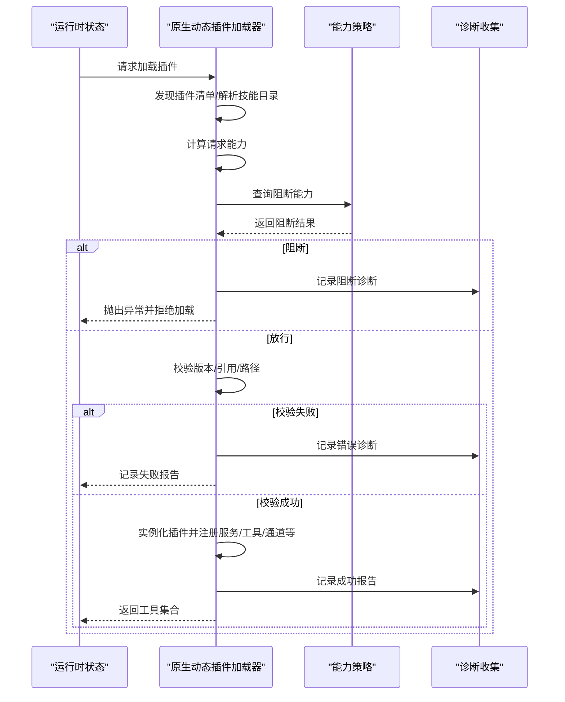
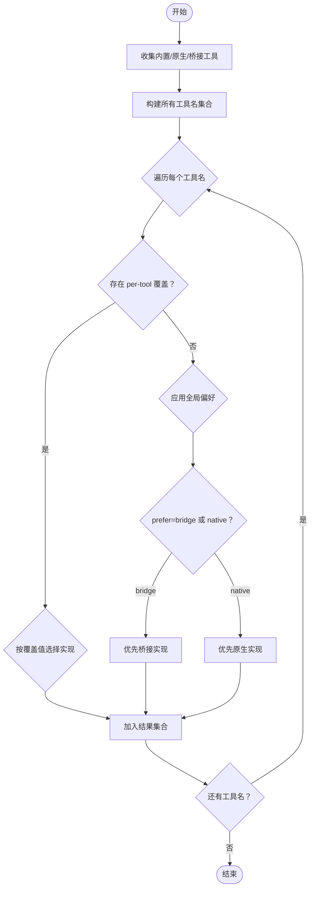
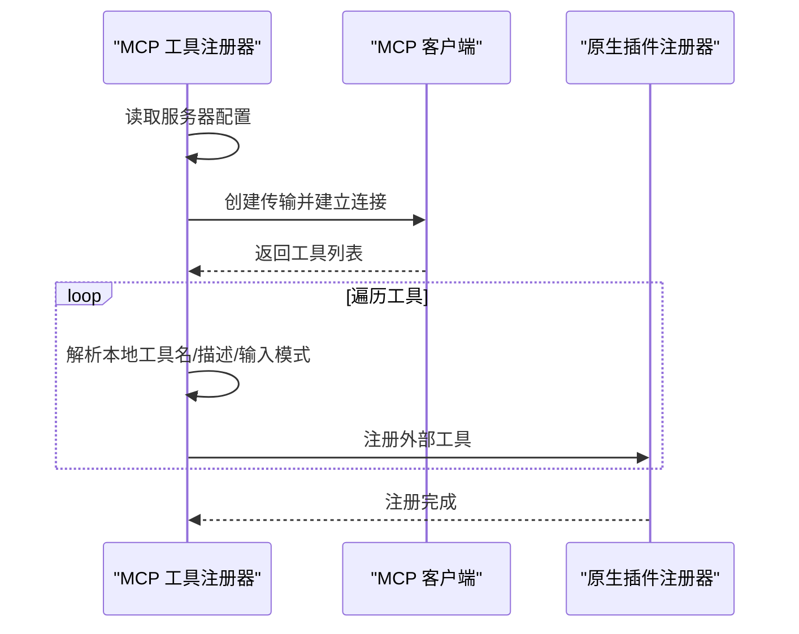
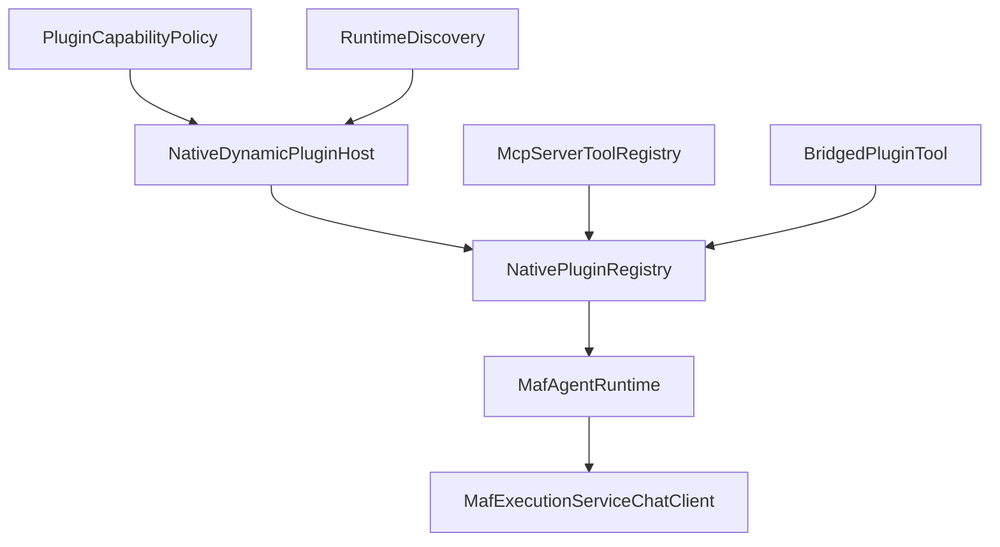

# 插件能力评估系统

<cite>
**本文档引用的文件**
- [MafCapabilities.cs](file://src/OpenClaw.Agent/MafCapabilities.cs)
- [MafAgentRuntime.cs](file://src/OpenClaw.Agent/MafAgentRuntime.cs)
- [MafExecutionServiceChatClient.cs](file://src/OpenClaw.Agent/MafExecutionServiceChatClient.cs)
- [NativeDynamicPluginHost.cs](file://src/OpenClaw.Agent/Plugins/NativeDynamicPluginHost.cs)
- [NativePluginRegistry.cs](file://src/OpenClaw.Agent/Plugins/NativePluginRegistry.cs)
- [BridgedPluginTool.cs](file://src/OpenClaw.Agent/Plugins/BridgedPluginTool.cs)
- [McpServerToolRegistry.cs](file://src/OpenClaw.Agent/Plugins/McpServerToolRegistry.cs)
- [PluginCapabilityPolicy.cs](file://src/OpenClaw.Core/Plugins/PluginCapabilityPolicy.cs)
- [RuntimeDiscovery.cs](file://src/OpenClaw.Agent/Plugins/RuntimeDiscovery.cs)
- [PluginCommands.cs](file://src/OpenClaw.Cli/PluginCommands.cs)
- [COMPATIBILITY.md](file://docs/COMPATIBILITY.md)
- [BrowserToolCapabilityEvaluator.cs](file://src/OpenClaw.Core/Security/BrowserToolCapabilityEvaluator.cs)
- [SecurityPostureBuilder.cs](file://src/OpenClaw.Gateway/SecurityPostureBuilder.cs)
- [PluginHealthService.cs](file://src/OpenClaw.Gateway/PluginHealthService.cs)
</cite>

## 目录
1. [简介](#简介)
2. [项目结构](#项目结构)
3. [核心组件](#核心组件)
4. [架构总览](#架构总览)
5. [详细组件分析](#详细组件分析)
6. [依赖关系分析](#依赖关系分析)
7. [性能考虑](#性能考虑)
8. [故障排除指南](#故障排除指南)
9. [结论](#结论)
10. [附录](#附录)

## 简介
本技术文档面向插件能力评估系统，系统性阐述插件能力检测、兼容性验证与资源需求评估机制，涵盖能力声明格式、评估算法、结果缓存策略、能力匹配规则、优先级排序与冲突解决机制，并提供配置选项、性能优化与扩展方法，以及具体评估示例与故障排除指南。

## 项目结构
插件能力评估系统主要分布在以下模块：
- Agent 层：运行时能力封装与工具执行适配（如 MAF 运行时、工具适配器）
- Core 层：通用插件能力策略与模型定义（能力枚举、策略判定）
- Agent.Plugins 子层：原生动态插件、桥接插件、MCP 工具注册等
- CLI 层：插件命令与兼容性报告输出
- 文档与规范：兼容性清单、配置校验说明

**图表来源**
- [MafAgentRuntime.cs:17-118](file://src/OpenClaw.Agent/MafAgentRuntime.cs#L17-L118)
- [MafExecutionServiceChatClient.cs:10-65](file://src/OpenClaw.Agent/MafExecutionServiceChatClient.cs#L10-L65)
- [MafCapabilities.cs:5-16](file://src/OpenClaw.Agent/MafCapabilities.cs#L5-L16)
- [PluginCapabilityPolicy.cs:5-58](file://src/OpenClaw.Core/Plugins/PluginCapabilityPolicy.cs#L5-L58)
- [NativeDynamicPluginHost.cs:19-169](file://src/OpenClaw.Agent/Plugins/NativeDynamicPluginHost.cs#L19-L169)
- [NativePluginRegistry.cs:13-265](file://src/OpenClaw.Agent/Plugins/NativePluginRegistry.cs#L13-L265)
- [BridgedPluginTool.cs:10-41](file://src/OpenClaw.Agent/Plugins/BridgedPluginTool.cs#L10-L41)
- [McpServerToolRegistry.cs:16-138](file://src/OpenClaw.Agent/Plugins/McpServerToolRegistry.cs#L16-L138)
- [RuntimeDiscovery.cs:8-115](file://src/OpenClaw.Agent/Plugins/RuntimeDiscovery.cs#L8-L115)
- [PluginCommands.cs:702-729](file://src/OpenClaw.Cli/PluginCommands.cs#L702-L729)
- [COMPATIBILITY.md:72-103](file://docs/COMPATIBILITY.md#L72-L103)
- [BrowserToolCapabilityEvaluator.cs:5-30](file://src/OpenClaw.Core/Security/BrowserToolCapabilityEvaluator.cs#L5-L30)
- [SecurityPostureBuilder.cs:103-127](file://src/OpenClaw.Gateway/SecurityPostureBuilder.cs#L103-L127)
- [PluginHealthService.cs:67-89](file://src/OpenClaw.Gateway/PluginHealthService.cs#L67-L89)

**章节来源**
- [MafAgentRuntime.cs:17-118](file://src/OpenClaw.Agent/MafAgentRuntime.cs#L17-L118)
- [PluginCapabilityPolicy.cs:5-58](file://src/OpenClaw.Core/Plugins/PluginCapabilityPolicy.cs#L5-L58)
- [NativeDynamicPluginHost.cs:19-169](file://src/OpenClaw.Agent/Plugins/NativeDynamicPluginHost.cs#L19-L169)
- [NativePluginRegistry.cs:13-265](file://src/OpenClaw.Agent/Plugins/NativePluginRegistry.cs#L13-L265)
- [McpServerToolRegistry.cs:16-138](file://src/OpenClaw.Agent/Plugins/McpServerToolRegistry.cs#L16-L138)
- [PluginCommands.cs:702-729](file://src/OpenClaw.Cli/PluginCommands.cs#L702-L729)
- [COMPATIBILITY.md:72-103](file://docs/COMPATIBILITY.md#L72-L103)

## 核心组件
- 运行时能力封装：通过常量与静态方法表达运行时对特定模式的支持度，用于能力声明与运行时约束。
- 能力策略判定：统一归一化能力列表，按运行时模式与宿主类型判断是否阻断 JIT-only 能力。
- 原生动态插件加载：扫描插件清单，解析技能目录，计算请求能力，进行兼容性校验与诊断收集。
- 原生插件注册与偏好解析：根据配置在内置工具、原生插件与桥接工具之间选择最优实现。
- MCP 工具注册：连接 MCP 服务器，发现工具并注册为本地工具。
- 桥接工具适配：将远端插件工具调用桥接到本地执行。
- 外部运行时发现：定位 Node.js 等外部运行时可执行文件。
- 兼容性与健康度：CLI 输出兼容性摘要，文档定义支持的配置子集；健康服务汇总诊断与信任级别。

**章节来源**
- [MafCapabilities.cs:5-16](file://src/OpenClaw.Agent/MafCapabilities.cs#L5-L16)
- [PluginCapabilityPolicy.cs:23-57](file://src/OpenClaw.Core/Plugins/PluginCapabilityPolicy.cs#L23-L57)
- [NativeDynamicPluginHost.cs:86-169](file://src/OpenClaw.Agent/Plugins/NativeDynamicPluginHost.cs#L86-L169)
- [NativePluginRegistry.cs:137-233](file://src/OpenClaw.Agent/Plugins/NativePluginRegistry.cs#L137-L233)
- [McpServerToolRegistry.cs:41-138](file://src/OpenClaw.Agent/Plugins/McpServerToolRegistry.cs#L41-L138)
- [BridgedPluginTool.cs:10-41](file://src/OpenClaw.Agent/Plugins/BridgedPluginTool.cs#L10-L41)
- [RuntimeDiscovery.cs:14-84](file://src/OpenClaw.Agent/Plugins/RuntimeDiscovery.cs#L14-L84)
- [PluginCommands.cs:702-729](file://src/OpenClaw.Cli/PluginCommands.cs#L702-L729)
- [COMPATIBILITY.md:72-103](file://docs/COMPATIBILITY.md#L72-L103)
- [PluginHealthService.cs:67-89](file://src/OpenClaw.Gateway/PluginHealthService.cs#L67-L89)

## 架构总览
系统以 Agent 运行时为核心，围绕“能力声明-兼容性验证-工具装配-执行”的闭环工作流展开。能力策略在加载阶段即进行阻断与诊断，避免无效装配；偏好解析在多源工具中选择最优实现；MCP 与桥接工具通过统一接口接入；CLI 与健康服务提供可观测性与治理支撑。

**图表来源**
- [PluginCapabilityPolicy.cs:31-57](file://src/OpenClaw.Core/Plugins/PluginCapabilityPolicy.cs#L31-L57)
- [NativeDynamicPluginHost.cs:86-169](file://src/OpenClaw.Agent/Plugins/NativeDynamicPluginHost.cs#L86-L169)
- [NativePluginRegistry.cs:137-233](file://src/OpenClaw.Agent/Plugins/NativePluginRegistry.cs#L137-L233)
- [McpServerToolRegistry.cs:41-138](file://src/OpenClaw.Agent/Plugins/McpServerToolRegistry.cs#L41-L138)
- [MafAgentRuntime.cs:112-116](file://src/OpenClaw.Agent/MafAgentRuntime.cs#L112-L116)

## 详细组件分析

### 组件 A：能力策略与阻断判定（PluginCapabilityPolicy）
- 能力枚举：tools、services、skills、channels、commands、providers、hooks、memory、native_dynamic 等。
- 归一化：去空、trim、小写、去重、排序。
- 阻断判定：当运行时模式为 AOT 且宿主类型为 NativeDynamic 时，返回全部能力作为阻断项；Bridge 类型不阻断。
- 判定入口：GetBlockedCapabilities、RequiresJit。

**图表来源**
- [PluginCapabilityPolicy.cs:31-57](file://src/OpenClaw.Core/Plugins/PluginCapabilityPolicy.cs#L31-L57)

**章节来源**
- [PluginCapabilityPolicy.cs:23-57](file://src/OpenClaw.Core/Plugins/PluginCapabilityPolicy.cs#L23-L57)

### 组件 B：原生动态插件加载与能力评估（NativeDynamicPluginHost）
- 发现与过滤：扫描路径、解析清单、去重、白名单/黑名单/显式禁用过滤。
- 能力计算：从清单能力+技能目录推导请求能力，附加 native_dynamic 标记。
- 兼容性校验：最小宿主版本、插件 API 版本、插件 Kit 引用版本一致性检查。
- 运行时阻断：AOT 模式下直接生成阻断诊断并拒绝加载。
- 诊断收集：重复工具名、技能目录越界、装配路径越界、清单解析失败等。
- 成功装配：记录工具/通道/钩子/命令/提供者/内存提供者/技能根目录。

**图表来源**
- [NativeDynamicPluginHost.cs:86-169](file://src/OpenClaw.Agent/Plugins/NativeDynamicPluginHost.cs#L86-L169)
- [PluginCapabilityPolicy.cs:31-57](file://src/OpenClaw.Core/Plugins/PluginCapabilityPolicy.cs#L31-L57)

**章节来源**
- [NativeDynamicPluginHost.cs:64-169](file://src/OpenClaw.Agent/Plugins/NativeDynamicPluginHost.cs#L64-L169)
- [PluginCapabilityPolicy.cs:31-57](file://src/OpenClaw.Core/Plugins/PluginCapabilityPolicy.cs#L31-L57)

### 组件 C：原生插件工具注册与偏好解析（NativePluginRegistry）
- 偏好解析：支持 prefer=bridge/native 的全局偏好，以及 per-tool overrides。
- 冲突解决：同名工具以“先到先得”原则保留首个实现，后续重复名称跳过并记录警告。
- 结果：返回去重后的工具集合，保证每个工具名唯一。

**图表来源**
- [NativePluginRegistry.cs:137-233](file://src/OpenClaw.Agent/Plugins/NativePluginRegistry.cs#L137-L233)

**章节来源**
- [NativePluginRegistry.cs:137-233](file://src/OpenClaw.Agent/Plugins/NativePluginRegistry.cs#L137-L233)

### 组件 D：MCP 工具注册与命名解析（McpServerToolRegistry）
- 连接与发现：按服务器配置创建传输（stdio/http），建立客户端，列举工具。
- 命名解析：支持工具名前缀，清洗非法字符，避免冲突。
- 输入模式：将远程 JSON Schema 文本转换为本地参数模式文本。
- 注册：将工具注册到原生注册器，形成统一工具集合。

**图表来源**
- [McpServerToolRegistry.cs:78-170](file://src/OpenClaw.Agent/Plugins/McpServerToolRegistry.cs#L78-L170)

**章节来源**
- [McpServerToolRegistry.cs:41-170](file://src/OpenClaw.Agent/Plugins/McpServerToolRegistry.cs#L41-L170)

### 组件 E：桥接工具适配（BridgedPluginTool）
- 封装桥接进程与插件 ID，暴露统一 ITool 接口。
- 参数序列化：将 JSON 参数传递给桥接进程执行。
- 错误传播：桥接执行异常透传至调用方。

**章节来源**
- [BridgedPluginTool.cs:10-41](file://src/OpenClaw.Agent/Plugins/BridgedPluginTool.cs#L10-L41)

### 组件 F：外部运行时发现（RuntimeDiscovery）
- Node.js 查找：PATH 搜索 + 常见安装路径探测，支持通配符展开。
- 通用可执行查找：通过 which/where 查找指定名称的可执行文件。

**章节来源**
- [RuntimeDiscovery.cs:14-84](file://src/OpenClaw.Agent/Plugins/RuntimeDiscovery.cs#L14-L84)

### 组件 G：运行时能力封装（MafCapabilities）
- 运行时标识：MAF 运行时 ID 常量。
- 模式支持：仅在 JIT/AOT 模式下支持。
- 能力检查：提供 EnsureSupported 占位方法。

**章节来源**
- [MafCapabilities.cs:5-16](file://src/OpenClaw.Agent/MafCapabilities.cs#L5-L16)

### 组件 H：运行时与工具装配（MafAgentRuntime）
- 工具装配：将底层工具适配为 AITool 并建立名称索引。
- 技能加载：从技能配置与插件技能目录加载技能，构建系统提示。
- 执行链路：消息构建、历史压缩/修剪、记忆回溯注入、工具调用记录、会话状态保存。

**章节来源**
- [MafAgentRuntime.cs:112-116](file://src/OpenClaw.Agent/MafAgentRuntime.cs#L112-L116)
- [MafAgentRuntime.cs:181-201](file://src/OpenClaw.Agent/MafAgentRuntime.cs#L181-L201)
- [MafAgentRuntime.cs:589-620](file://src/OpenClaw.Agent/MafAgentRuntime.cs#L589-L620)

### 组件 I：LLM 执行与用量记录（MafExecutionServiceChatClient）
- 估算与计费：基于消息与技能提示长度估算 token 使用。
- 流式处理：聚合 UsageContent 中的输入/输出 token，回填缺失值。
- 记录：更新会话 token/缓存用量、指标与提供商用量统计。

**章节来源**
- [MafExecutionServiceChatClient.cs:32-125](file://src/OpenClaw.Agent/MafExecutionServiceChatClient.cs#L32-L125)
- [MafExecutionServiceChatClient.cs:134-186](file://src/OpenClaw.Agent/MafExecutionServiceChatClient.cs#L134-L186)

### 组件 J：浏览器工具能力评估（BrowserToolCapabilityEvaluator）
- 能力评估：综合配置开关、本地执行支持、执行后端配置与注册状态。
- 结果：返回能力摘要与原因码，用于安全态势构建与用户提示。

**章节来源**
- [BrowserToolCapabilityEvaluator.cs:7-30](file://src/OpenClaw.Core/Security/BrowserToolCapabilityEvaluator.cs#L7-L30)

### 组件 K：安全态势与能力映射（SecurityPostureBuilder）
- 综合多项能力与配置：浏览器工具可用性、审批要求、沙箱配置等。
- 风险标志与建议：根据能力状态生成风险与改进建议。

**章节来源**
- [SecurityPostureBuilder.cs:103-127](file://src/OpenClaw.Gateway/SecurityPostureBuilder.cs#L103-L127)

### 组件 L：插件健康快照与诊断汇总（PluginHealthService）
- 快照生成：汇总加载状态、阻断原因、禁用/隔离状态、审查状态、兼容性状态与诊断计数。
- 信任级别：结合审查状态与诊断汇总计算信任等级与原因。

**章节来源**
- [PluginHealthService.cs:67-89](file://src/OpenClaw.Gateway/PluginHealthService.cs#L67-L89)

## 依赖关系分析
- 加载期耦合：NativeDynamicPluginHost 依赖 PluginCapabilityPolicy 进行阻断判定；依赖 RuntimeDiscovery 定位外部运行时。
- 装配期耦合：NativePluginRegistry 与 McpServerToolRegistry 共同向原生注册器提供工具；BridgedPluginTool 依赖桥接进程。
- 运行期耦合：MafAgentRuntime 依赖工具集合与技能加载；MafExecutionServiceChatClient 依赖 LLM 执行服务与用量追踪。

**图表来源**
- [PluginCapabilityPolicy.cs:31-57](file://src/OpenClaw.Core/Plugins/PluginCapabilityPolicy.cs#L31-L57)
- [NativeDynamicPluginHost.cs:86-169](file://src/OpenClaw.Agent/Plugins/NativeDynamicPluginHost.cs#L86-L169)
- [RuntimeDiscovery.cs:14-84](file://src/OpenClaw.Agent/Plugins/RuntimeDiscovery.cs#L14-L84)
- [NativePluginRegistry.cs:137-233](file://src/OpenClaw.Agent/Plugins/NativePluginRegistry.cs#L137-L233)
- [McpServerToolRegistry.cs:41-138](file://src/OpenClaw.Agent/Plugins/McpServerToolRegistry.cs#L41-L138)
- [BridgedPluginTool.cs:10-41](file://src/OpenClaw.Agent/Plugins/BridgedPluginTool.cs#L10-L41)
- [MafAgentRuntime.cs:112-116](file://src/OpenClaw.Agent/MafAgentRuntime.cs#L112-L116)
- [MafExecutionServiceChatClient.cs:10-65](file://src/OpenClaw.Agent/MafExecutionServiceChatClient.cs#L10-L65)

**章节来源**
- [NativeDynamicPluginHost.cs:86-169](file://src/OpenClaw.Agent/Plugins/NativeDynamicPluginHost.cs#L86-L169)
- [NativePluginRegistry.cs:137-233](file://src/OpenClaw.Agent/Plugins/NativePluginRegistry.cs#L137-L233)
- [McpServerToolRegistry.cs:41-138](file://src/OpenClaw.Agent/Plugins/McpServerToolRegistry.cs#L41-L138)
- [BridgedPluginTool.cs:10-41](file://src/OpenClaw.Agent/Plugins/BridgedPluginTool.cs#L10-L41)
- [MafAgentRuntime.cs:112-116](file://src/OpenClaw.Agent/MafAgentRuntime.cs#L112-L116)
- [MafExecutionServiceChatClient.cs:10-65](file://src/OpenClaw.Agent/MafExecutionServiceChatClient.cs#L10-L65)

## 性能考虑
- 工具去重与索引：通过名称索引快速定位工具，降低运行时查找成本。
- 历史压缩：在长对话中对早期回合进行摘要压缩，减少 token 消耗与上下文开销。
- 流式响应：MCP/桥接工具执行采用流式传输，提升交互延迟体验。
- 用量估算：基于消息与技能提示长度估算 token，避免昂贵的后置统计。
- 并发控制：MCP 工具注册使用信号量串行化加载，避免并发初始化竞争。

[本节为通用性能讨论，无需特定文件来源]

## 故障排除指南
- 清单解析失败：检查清单文件格式与字段完整性，参考兼容性清单中的支持关键字。
- 路径越界：清单或程序集路径不得超出插件根目录，否则产生阻断诊断。
- 最小宿主版本不满足：升级宿主版本以满足插件最低要求。
- 插件 API 版本不兼容：确保插件与宿主主版本一致。
- AOT 模式下 JIT-only 能力：移除 native_dynamic 能力声明或切换到 JIT 模式。
- 工具名冲突：遵循“先到先得”原则，调整工具名或使用 per-tool 覆盖。
- MCP 连接失败：检查传输配置、超时设置与凭据解析。
- 浏览器工具不可用：确认已开启浏览器工具、具备本地执行支持或配置了执行后端。

**章节来源**
- [COMPATIBILITY.md:72-103](file://docs/COMPATIBILITY.md#L72-L103)
- [NativeDynamicPluginHost.cs:520-649](file://src/OpenClaw.Agent/Plugins/NativeDynamicPluginHost.cs#L520-L649)
- [PluginCommands.cs:702-729](file://src/OpenClaw.Cli/PluginCommands.cs#L702-L729)
- [BrowserToolCapabilityEvaluator.cs:7-30](file://src/OpenClaw.Core/Security/BrowserToolCapabilityEvaluator.cs#L7-L30)

## 结论
插件能力评估系统通过“能力声明-策略阻断-兼容性校验-工具装配-运行时集成”的完整链路，实现了对多源插件的统一治理与高效执行。能力策略在加载期即进行阻断，避免无效装配；偏好解析与冲突解决保障工具集合的确定性；CLI 与健康服务提供可观测性与运营支撑。该体系既满足 AOT 场景的安全约束，又为 JIT 提供灵活扩展空间。

[本节为总结性内容，无需特定文件来源]

## 附录

### 能力声明格式与示例
- 清单字段：包含插件 ID、类型、程序集路径、最小宿主版本、插件 API 版本、能力数组、技能目录等。
- 能力数组：tools/services/skills/channels/commands/providers/hooks/memory/native_dynamic 等。
- 示例路径：参考插件清单解析与报告生成逻辑。

**章节来源**
- [NativeDynamicPluginHost.cs:520-649](file://src/OpenClaw.Agent/Plugins/NativeDynamicPluginHost.cs#L520-L649)
- [PluginCommands.cs:702-729](file://src/OpenClaw.Cli/PluginCommands.cs#L702-L729)

### 评估算法与结果缓存策略
- 评估算法：能力归一化 → 运行时模式判定 → 宿主类型判定 → 生成阻断集合。
- 结果缓存：系统未实现能力评估结果的持久化缓存；每次加载均重新评估并生成诊断报告。

**章节来源**
- [PluginCapabilityPolicy.cs:23-57](file://src/OpenClaw.Core/Plugins/PluginCapabilityPolicy.cs#L23-L57)
- [NativeDynamicPluginHost.cs:171-188](file://src/OpenClaw.Agent/Plugins/NativeDynamicPluginHost.cs#L171-L188)

### 能力匹配规则、优先级排序与冲突解决
- 规则：per-tool 覆盖优先于全局偏好；全局偏好为 prefer=bridge/native；默认保留首个实现。
- 冲突解决：同名工具冲突时，先到先得，后续重复名称跳过并记录警告。

**章节来源**
- [NativePluginRegistry.cs:137-233](file://src/OpenClaw.Agent/Plugins/NativePluginRegistry.cs#L137-L233)

### 配置选项与扩展方法
- 配置项：插件启用/禁用、白名单/黑名单、per-tool 覆盖、MCP 服务器配置、运行时模式等。
- 扩展方法：新增工具实现需遵循 ITool 接口；MCP 工具通过注册器统一接入；桥接工具通过桥接进程对接。

**章节来源**
- [NativePluginRegistry.cs:137-233](file://src/OpenClaw.Agent/Plugins/NativePluginRegistry.cs#L137-L233)
- [McpServerToolRegistry.cs:41-138](file://src/OpenClaw.Agent/Plugins/McpServerToolRegistry.cs#L41-L138)
- [BridgedPluginTool.cs:10-41](file://src/OpenClaw.Agent/Plugins/BridgedPluginTool.cs#L10-L41)