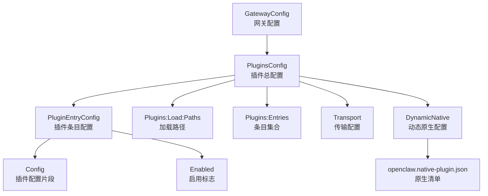
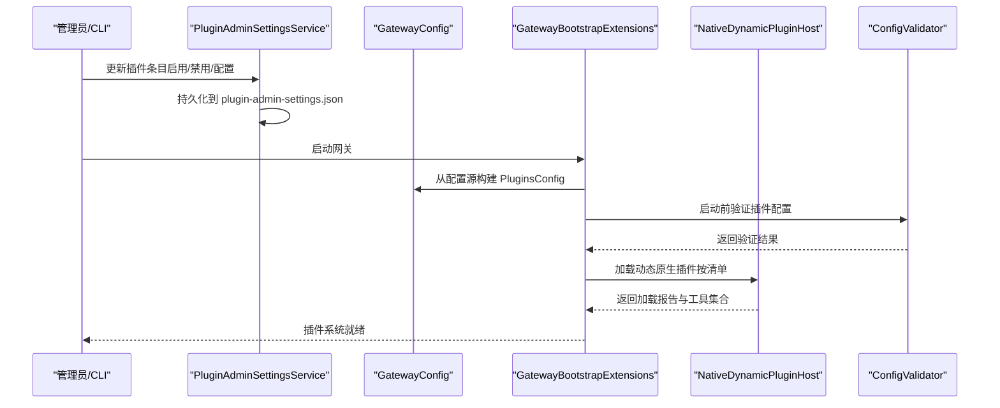
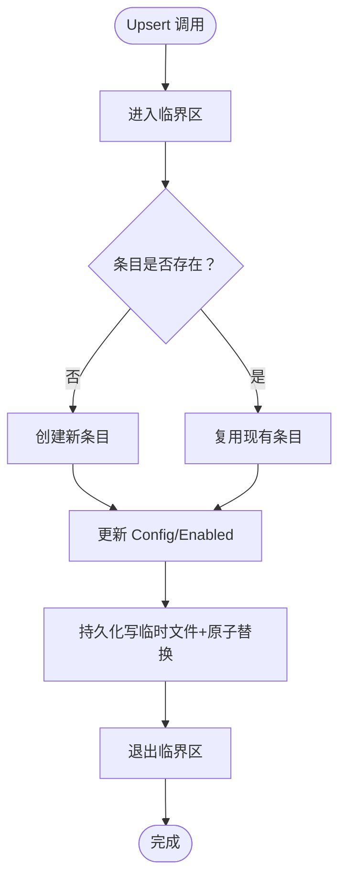
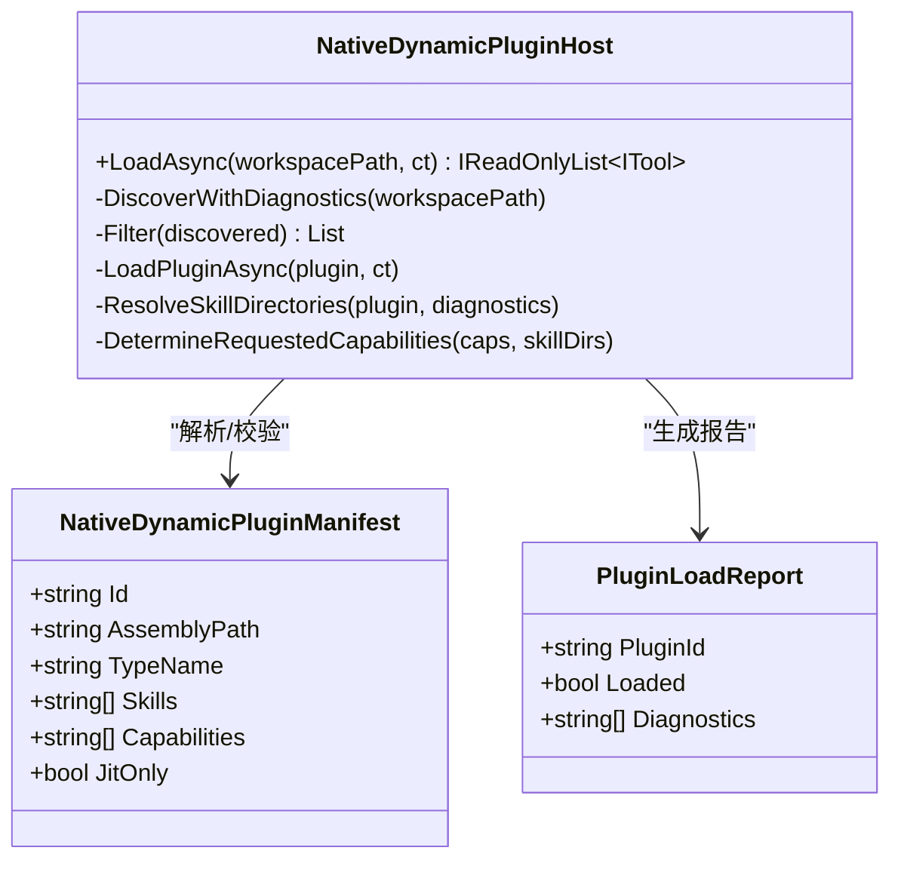
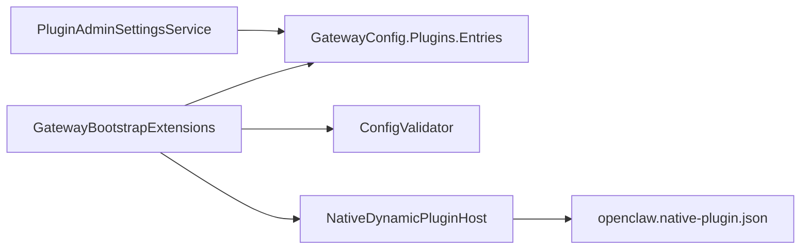

# 插件配置管理

<cite>
**本文档引用的文件**
- [PluginAdminSettingsService.cs](file://src/OpenClaw.Gateway/PluginAdminSettingsService.cs)
- [GatewayBootstrapExtensions.cs](file://src/OpenClaw.Gateway/Bootstrap/GatewayBootstrapExtensions.cs)
- [NativeDynamicPluginHost.cs](file://src/OpenClaw.Agent/Plugins/NativeDynamicPluginHost.cs)
- [openclaw.native-plugin.json](file://src/OpenClaw.Plugins.EmploymentCoachWorkflow/openclaw.native-plugin.json)
- [GatewayConfig.cs](file://src/OpenClaw.Core/Models/GatewayConfig.cs)
- [ConfigValidator.cs](file://src/OpenClaw.Core/Validation/ConfigValidator.cs)
- [openclaw-plugin-system-analysis.md](file://docs/openclaw-plugin-system-analysis.md)
- [PluginBridgeIntegrationTests.cs](file://src/OpenClaw.Tests/PluginBridgeIntegrationTests.cs)
- [SetupVerificationService.cs](file://src/OpenClaw.Core/Validation/SetupVerificationService.cs)
- [RuntimeInitializationExtensions.CompositionStages.cs](file://src/OpenClaw.Gateway/Composition/RuntimeInitializationExtensions.CompositionStages.cs)
</cite>

## 目录
1. [简介](#简介)
2. [项目结构](#项目结构)
3. [核心组件](#核心组件)
4. [架构总览](#架构总览)
5. [详细组件分析](#详细组件分析)
6. [依赖关系分析](#依赖关系分析)
7. [性能考虑](#性能考虑)
8. [故障排除指南](#故障排除指南)
9. [结论](#结论)

## 简介
本文件面向插件配置管理，系统性阐述 OpenClaw 插件体系的层次结构、配置文件格式、参数验证机制，以及桥接插件与原生插件的配置差异、启用禁用控制与运行时切换机制。文档还涵盖配置热更新、验证、默认值处理与错误恢复策略，并提供配置示例、最佳实践与故障排除建议。

## 项目结构
OpenClaw 的插件配置涉及三层：
- 网关配置层（GatewayConfig）：集中定义插件系统总开关、偏好、传输、动态原生加载路径与条目配置。
- 插件条目层（PluginEntryConfig）：针对单个插件的启用状态与配置片段，支持运行时修改与持久化。
- 插件清单层（openclaw.native-plugin.json）：原生动态插件的发现与能力声明。

**图表来源**
- [GatewayConfig.cs](file://src/OpenClaw.Core/Models/GatewayConfig.cs)
- [openclaw-plugin-system-analysis.md](file://docs/openclaw-plugin-system-analysis.md)

**章节来源**
- [GatewayConfig.cs](file://src/OpenClaw.Core/Models/GatewayConfig.cs)
- [openclaw-plugin-system-analysis.md](file://docs/openclaw-plugin-system-analysis.md)

## 核心组件
- 网关配置模型（GatewayConfig）：包含 Plugins、Runtime、Transport 等关键域，支撑插件系统的行为与约束。
- 插件条目服务（PluginAdminSettingsService）：提供插件条目的增删改查、快照获取与持久化写入。
- 动态原生插件主机（NativeDynamicPluginHost）：负责原生清单发现、兼容性校验、能力策略与加载生命周期。
- 配置验证器（ConfigValidator）：启动前对插件相关配置进行严格校验，确保运行安全。
- 系统分析文档（openclaw-plugin-system-analysis.md）：提供插件系统架构、发现机制与配置示例的权威说明。

**章节来源**
- [PluginAdminSettingsService.cs](file://src/OpenClaw.Gateway/PluginAdminSettingsService.cs)
- [NativeDynamicPluginHost.cs](file://src/OpenClaw.Agent/Plugins/NativeDynamicPluginHost.cs)
- [ConfigValidator.cs](file://src/OpenClaw.Core/Validation/ConfigValidator.cs)
- [openclaw-plugin-system-analysis.md](file://docs/openclaw-plugin-system-analysis.md)

## 架构总览
插件配置的生命周期从“加载与验证”到“运行时生效”，再到“热更新与持久化”。

**图表来源**
- [PluginAdminSettingsService.cs](file://src/OpenClaw.Gateway/PluginAdminSettingsService.cs)
- [GatewayBootstrapExtensions.cs](file://src/OpenClaw.Gateway/Bootstrap/GatewayBootstrapExtensions.cs)
- [NativeDynamicPluginHost.cs](file://src/OpenClaw.Agent/Plugins/NativeDynamicPluginHost.cs)
- [ConfigValidator.cs](file://src/OpenClaw.Core/Validation/ConfigValidator.cs)

## 详细组件分析

### 网关配置模型（GatewayConfig）
- Plugins：插件系统总开关、偏好、传输、动态原生加载与条目集合。
- Transport：桥接插件传输模式（stdio/socket/hybrid）与路径配置。
- DynamicNative：原生动态插件的启用、白名单/黑名单、加载路径与条目配置。
- Runtime：运行时模式（auto/jit/aot）与编排器（native/maf）影响插件能力。

**章节来源**
- [GatewayConfig.cs](file://src/OpenClaw.Core/Models/GatewayConfig.cs)

### 插件条目服务（PluginAdminSettingsService）
- 职责：读取/写入 admin 目录下的 plugin-admin-settings.json；提供条目快照与原子更新；线程安全地持久化。
- 关键能力：
  - 获取条目快照（GetSnapshot）
  - 查询单个条目（GetEntry）
  - 增改条目（Upsert），支持仅更新 Enabled 或 Config
  - 持久化：先写临时文件，再原子替换目标文件，失败时记录警告并抛出异常

**图表来源**
- [PluginAdminSettingsService.cs](file://src/OpenClaw.Gateway/PluginAdminSettingsService.cs)

**章节来源**
- [PluginAdminSettingsService.cs](file://src/OpenClaw.Gateway/PluginAdminSettingsService.cs)

### 动态原生插件主机（NativeDynamicPluginHost）
- 发现：扫描配置路径、工作区与用户目录，解析 openclaw.native-plugin.json 清单。
- 过滤：支持 Deny/Allow、单插件 Enabled、槽位独占等策略。
- 兼容性：校验最低宿主版本、插件 API 版本与 PluginKit 引用一致性；AOT 模式下阻止 JIT-only 插件。
- 加载：在可卸载的 AssemblyLoadContext 中加载程序集，注册工具、频道、命令、提供者、钩子、服务与技能目录。
- 报告：生成结构化诊断与加载报告，失败时清理已启动的服务与上下文。

**图表来源**
- [NativeDynamicPluginHost.cs](file://src/OpenClaw.Agent/Plugins/NativeDynamicPluginHost.cs)

**章节来源**
- [NativeDynamicPluginHost.cs](file://src/OpenClaw.Agent/Plugins/NativeDynamicPluginHost.cs)
- [openclaw.native-plugin.json](file://src/OpenClaw.Plugins.EmploymentCoachWorkflow/openclaw.native-plugin.json)

### 配置验证器（ConfigValidator）
- 验证范围：端口、LLM、内存、会话、WebSocket、工具、沙箱、编码后端、路由、工作流、中间件、插件传输、运行时模式与 MCP 服务器等。
- 插件相关重点：
  - Plugins.Transport.Mode 必须为 stdio/socket/hybrid
  - Runtime.Mode 必须为 auto/jit/aot
  - Runtime.Orchestrator 必须为 native/maf
  - MCP.enabled 时需提供 Servers，且校验传输、超时、URL 等
  - Notion 插件需校验密钥、基础 URL、版本与目标页/库

**章节来源**
- [ConfigValidator.cs](file://src/OpenClaw.Core/Validation/ConfigValidator.cs)

### 系统分析文档（openclaw-plugin-system-analysis.md）
- 桥接插件（TS/JS）：通过 PluginHost 与 Node.js 子进程通信，支持 stdio/socket 传输；配置入口为 Plugins:Load:Paths 与 Plugins:Entries:{plugin-id}。
- 动态原生插件（.NET）：通过 openclaw.native-plugin.json 清单发现，支持进程内加载与热重载；配置入口为 Plugins:DynamicNative:Load:Paths 与 Entries。
- 优先级解析：内置工具优先，单工具覆盖（Overrides），全局默认（Prefer）。
- 启动编排：Bridge → MCP → 动态原生 → 优先级解析 → PluginComposition。

**章节来源**
- [openclaw-plugin-system-analysis.md](file://docs/openclaw-plugin-system-analysis.md)

## 依赖关系分析
- 插件条目服务依赖 GatewayConfig 的 Plugins.Entries，负责持久化与运行时读取。
- 网关引导扩展负责将 IConfigurationSection 转换为 PluginsConfig 的 Config 片段。
- 动态原生插件主机依赖 openclaw.native-plugin.json 清单与运行时模式策略。
- 配置验证器贯穿启动流程，确保插件相关配置合法。

**图表来源**
- [PluginAdminSettingsService.cs](file://src/OpenClaw.Gateway/PluginAdminSettingsService.cs)
- [GatewayBootstrapExtensions.cs](file://src/OpenClaw.Gateway/Bootstrap/GatewayBootstrapExtensions.cs)
- [NativeDynamicPluginHost.cs](file://src/OpenClaw.Agent/Plugins/NativeDynamicPluginHost.cs)
- [openclaw-plugin-system-analysis.md](file://docs/openclaw-plugin-system-analysis.md)

**章节来源**
- [PluginAdminSettingsService.cs](file://src/OpenClaw.Gateway/PluginAdminSettingsService.cs)
- [GatewayBootstrapExtensions.cs](file://src/OpenClaw.Gateway/Bootstrap/GatewayBootstrapExtensions.cs)
- [NativeDynamicPluginHost.cs](file://src/OpenClaw.Agent/Plugins/NativeDynamicPluginHost.cs)
- [openclaw-plugin-system-analysis.md](file://docs/openclaw-plugin-system-analysis.md)

## 性能考虑
- 桥接插件：Node.js 子进程启动开销约 100–300ms，适合外部运行时需求。
- 动态原生插件：程序集加载约 10–50ms，支持热重载与进程内隔离。
- MCP 服务器：进程启动开销约 100–500ms，适合标准化外部工具生态。
- 传输模式：stdio 为经过实战验证的稳定模式；socket/hybrid 为可选优化路径。
- 运行时模式：AOT 下动态原生插件被阻止，桥接插件仍可用；MCP 服务器在 AOT 下仍可使用（stdio 传输）。

[本节为通用性能讨论，无需特定文件来源]

## 故障排除指南
- 插件清单无效（invalid_manifest）：检查 openclaw.native-plugin.json 语法与编码（UTF-8 无 BOM）。
- 程序集路径越界（assembly_outside_root）：确认 assemblyPath 解析在插件根目录内。
- 最低宿主版本不满足（host_version_too_old）：升级宿主版本以满足 minHostVersion。
- 插件 API 版本不匹配（plugin_api_version_mismatch）：确保插件引用的 OpenClaw.PluginKit 主版本与宿主一致。
- AOT 模式下动态原生插件被阻止（jit_mode_required）：将运行时模式调整为 JIT，或移除相关插件。
- MCP 服务器配置错误：检查 Transport、Command/Url、StartupTimeoutSeconds、RequestTimeoutSeconds。
- 桥接插件依赖缺失：Node.js 不可用时，安装 Node.js 或禁用桥接插件。
- 配置持久化失败：查看日志中的警告信息，确认存储路径权限与磁盘空间。

**章节来源**
- [NativeDynamicPluginHost.cs](file://src/OpenClaw.Agent/Plugins/NativeDynamicPluginHost.cs)
- [ConfigValidator.cs](file://src/OpenClaw.Core/Validation/ConfigValidator.cs)
- [SetupVerificationService.cs](file://src/OpenClaw.Core/Validation/SetupVerificationService.cs)

## 结论
OpenClaw 的插件配置管理通过“网关配置模型 + 插件条目服务 + 动态原生插件主机 + 配置验证器”的协同，实现了从静态配置到运行时热更新的全链路闭环。桥接插件与原生插件在能力、隔离性与运行时模式上各有侧重，结合系统分析文档提供的配置示例与最佳实践，可有效提升插件系统的安全性、可维护性与可扩展性。