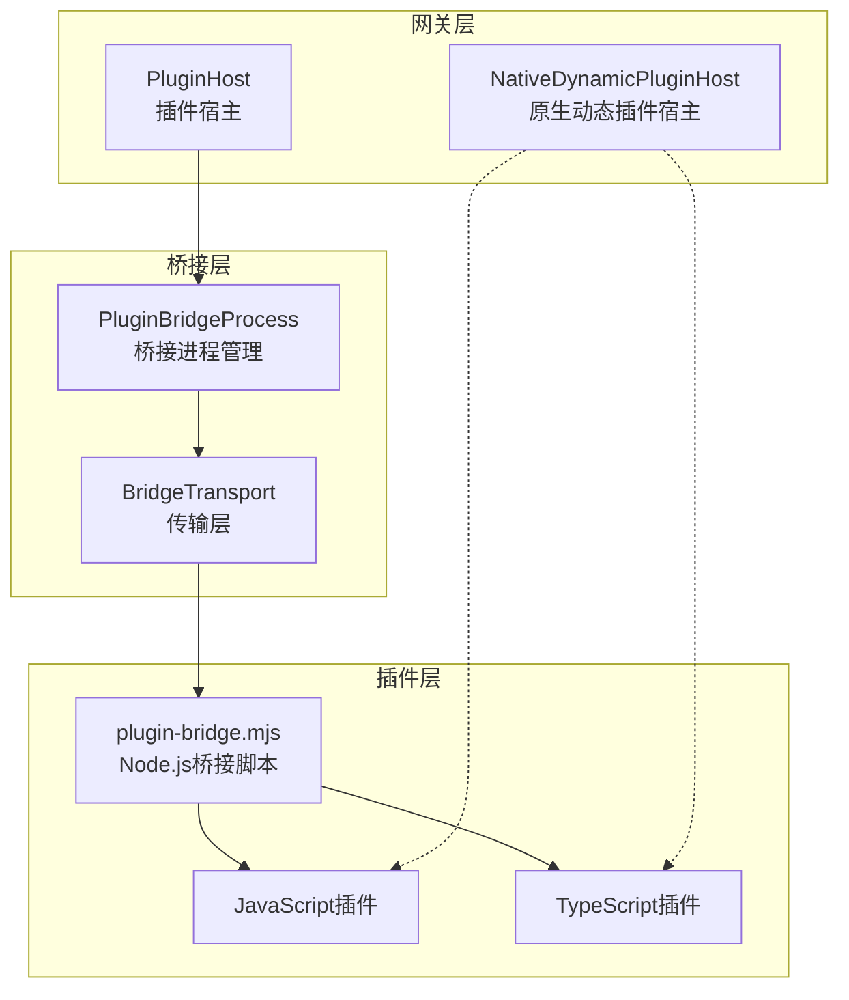
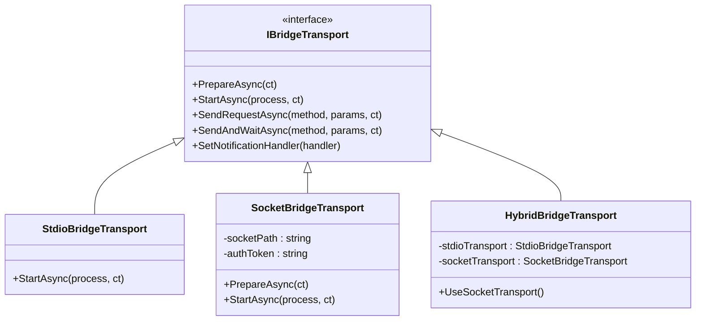
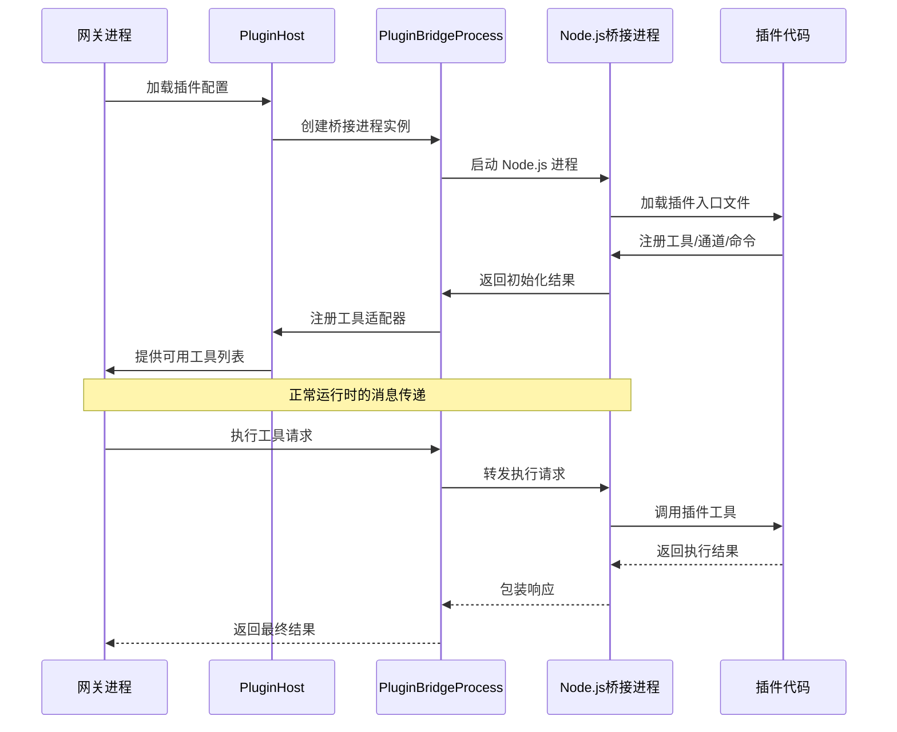
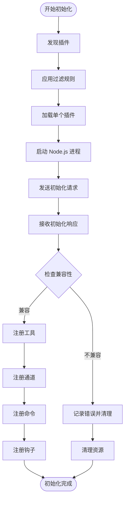
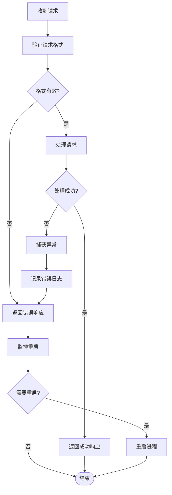
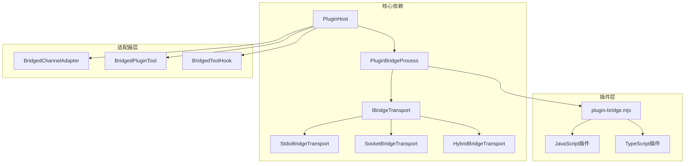

# Node.js 桥接机制

<cite>
**本文档引用的文件**
- [PluginHost.cs](file://src/OpenClaw.Agent/Plugins/PluginHost.cs)
- [PluginBridgeProcess.cs](file://src/OpenClaw.Agent/Plugins/PluginBridgeProcess.cs)
- [plugin-bridge.mjs](file://src/OpenClaw.Agent/Plugins/plugin-bridge.mjs)
- [IBridgeTransport.cs](file://src/OpenClaw.Agent/Plugins/IBridgeTransport.cs)
- [StdioBridgeTransport.cs](file://src/OpenClaw.Agent/Plugins/StdioBridgeTransport.cs)
- [SocketBridgeTransport.cs](file://src/OpenClaw.Agent/Plugins/SocketBridgeTransport.cs)
- [HybridBridgeTransport.cs](file://src/OpenClaw.Agent/Plugins/HybridBridgeTransport.cs)
- [BridgedChannelAdapter.cs](file://src/OpenClaw.Agent/Plugins/BridgedChannelAdapter.cs)
- [BridgedPluginTool.cs](file://src/OpenClaw.Agent/Plugins/BridgedPluginTool.cs)
- [BridgedToolHook.cs](file://src/OpenClaw.Agent/Plugins/BridgedToolHook.cs)
- [NativeDynamicPluginHost.cs](file://src/OpenClaw.Agent/Plugins/NativeDynamicPluginHost.cs)
- [PluginBridgeIntegrationTests.cs](file://src/OpenClaw.Tests/PluginBridgeIntegrationTests.cs)
- [openclaw-plugin-system-analysis.md](file://docs/openclaw-plugin-system-analysis.md)
</cite>

## 目录
1. [引言](#引言)
2. [项目结构](#项目结构)
3. [核心组件](#核心组件)
4. [架构概览](#架构概览)
5. [详细组件分析](#详细组件分析)
6. [依赖关系分析](#依赖关系分析)
7. [性能考虑](#性能考虑)
8. [故障排除指南](#故障排除指南)
9. [结论](#结论)

## 引言

Node.js 桥接机制是 OpenClaw 系统中连接 C# 网关与 JavaScript/TypeScript 插件的关键基础设施。该机制通过独立的 Node.js 子进程运行插件代码，实现了插件的完全隔离和安全执行。本文档深入解析了 PluginHost 的初始化过程、消息传递协议、进程间通信机制以及生命周期管理。

## 项目结构

OpenClaw 的插件系统采用分层架构设计，主要包含以下核心目录：



**图表来源**
- [PluginHost.cs:14-53](file://src/OpenClaw.Agent/Plugins/PluginHost.cs#L14-L53)
- [PluginBridgeProcess.cs:16-61](file://src/OpenClaw.Agent/Plugins/PluginBridgeProcess.cs#L16-L61)
- [plugin-bridge.mjs:1-20](file://src/OpenClaw.Agent/Plugins/plugin-bridge.mjs#L1-L20)

**章节来源**
- [PluginHost.cs:1-550](file://src/OpenClaw.Agent/Plugins/PluginHost.cs#L1-L550)
- [PluginBridgeProcess.cs:1-478](file://src/OpenClaw.Agent/Plugins/PluginBridgeProcess.cs#L1-L478)

## 核心组件

### PluginHost - 插件宿主管理器

PluginHost 是整个插件系统的协调中心，负责插件的发现、加载、工具注册和生命周期管理。其核心职责包括：

- **插件发现与过滤**：扫描配置的插件路径，应用允许/拒绝列表和启用状态
- **进程启动与管理**：为每个插件启动独立的 Node.js 子进程
- **工具注册**：将插件注册的工具转换为网关可用的 ITool 接口
- **通道适配**：为插件注册的通信通道创建适配器
- **命令路由**：将插件命令注册到聊天命令处理器

### PluginBridgeProcess - 桥接进程管理

PluginBridgeProcess 负责管理 Node.js 子进程的完整生命周期：

- **进程启动**：自动检测 Node.js 可执行文件，设置环境变量
- **传输层抽象**：支持 stdio、socket 和 hybrid 三种传输模式
- **重启机制**：实现指数退避的进程重启策略
- **内存监控**：提供进程内存使用情况的快照功能

### 传输层架构

传输层提供了统一的接口来处理不同类型的进程间通信：



**图表来源**
- [IBridgeTransport.cs:10-17](file://src/OpenClaw.Agent/Plugins/IBridgeTransport.cs#L10-L17)
- [StdioBridgeTransport.cs:9-24](file://src/OpenClaw.Agent/Plugins/StdioBridgeTransport.cs#L9-L24)
- [SocketBridgeTransport.cs:15-46](file://src/OpenClaw.Agent/Plugins/SocketBridgeTransport.cs#L15-L46)

**章节来源**
- [PluginHost.cs:14-90](file://src/OpenClaw.Agent/Plugins/PluginHost.cs#L14-L90)
- [PluginBridgeProcess.cs:16-61](file://src/OpenClaw.Agent/Plugins/PluginBridgeProcess.cs#L16-L61)

## 架构概览

OpenClaw 的插件系统采用"进程隔离 + 消息驱动"的设计理念：



**图表来源**
- [PluginHost.cs:95-179](file://src/OpenClaw.Agent/Plugins/PluginHost.cs#L95-L179)
- [PluginBridgeProcess.cs:91-112](file://src/OpenClaw.Agent/Plugins/PluginBridgeProcess.cs#L91-L112)
- [plugin-bridge.mjs:390-478](file://src/OpenClaw.Agent/Plugins/plugin-bridge.mjs#L390-L478)

## 详细组件分析

### 插件初始化流程

插件初始化是一个多阶段的过程，确保插件能够正确加载并注册其功能：



**图表来源**
- [PluginHost.cs:181-396](file://src/OpenClaw.Agent/Plugins/PluginHost.cs#L181-L396)
- [PluginBridgeProcess.cs:271-313](file://src/OpenClaw.Agent/Plugins/PluginBridgeProcess.cs#L271-L313)

### 消息传递协议

插件系统采用 JSON-RPC 2.0 协议进行消息传递，支持同步请求和异步通知：

#### 请求格式
```json
{
  "id": "唯一请求标识",
  "method": "调用方法名",
  "params": "参数对象"
}
```

#### 响应格式
```json
{
  "id": "对应请求的标识",
  "result": "成功结果",
  "error": "错误信息"
}
```

#### 通知格式
```json
{
  "notification": "通知类型",
  "params": "通知参数"
}
```

### 传输模式详解

系统支持三种传输模式，每种都有特定的使用场景：

#### Stdio 模式
- **特点**：最简单的实现，适合开发和测试
- **适用场景**：本地开发、简单插件
- **限制**：仅支持控制平面通信

#### Socket 模式
- **特点**：基于 Unix 域套接字或 Windows 命名管道
- **优势**：高性能、低延迟
- **安全**：内置认证机制

#### Hybrid 模式
- **特点**：初始化使用 stdio，运行时切换到 socket
- **优势**：兼顾开发便利性和运行时性能

**章节来源**
- [plugin-bridge.mjs:44-83](file://src/OpenClaw.Agent/Plugins/plugin-bridge.mjs#L44-L83)
- [SocketBridgeTransport.cs:48-89](file://src/OpenClaw.Agent/Plugins/SocketBridgeTransport.cs#L48-L89)

### 错误处理策略

插件系统实现了多层次的错误处理机制：



**图表来源**
- [PluginBridgeProcess.cs:214-269](file://src/OpenClaw.Agent/Plugins/PluginBridgeProcess.cs#L214-L269)
- [BridgedToolHook.cs:32-71](file://src/OpenClaw.Agent/Plugins/BridgedToolHook.cs#L32-L71)

**章节来源**
- [PluginBridgeProcess.cs:206-269](file://src/OpenClaw.Agent/Plugins/PluginBridgeProcess.cs#L206-L269)
- [BridgedToolHook.cs:9-20](file://src/OpenClaw.Agent/Plugins/BridgedToolHook.cs#L9-L20)

### 性能监控

系统提供了全面的性能监控能力：

#### 内存监控
- **主机内存**：监控插件进程的内存使用情况
- **垃圾回收**：跟踪 GC 活动对性能的影响
- **内存快照**：定期捕获内存使用快照

#### 运行时指标
- **重启统计**：记录进程重启次数和失败原因
- **响应时间**：测量请求处理延迟
- **并发控制**：限制同时运行的插件数量

**章节来源**
- [PluginBridgeProcess.cs:66-89](file://src/OpenClaw.Agent/Plugins/PluginBridgeProcess.cs#L66-L89)
- [PluginBridgeIntegrationTests.cs:785-828](file://src/OpenClaw.Tests/PluginBridgeIntegrationTests.cs#L785-L828)

## 依赖关系分析



**图表来源**
- [PluginHost.cs:23-33](file://src/OpenClaw.Agent/Plugins/PluginHost.cs#L23-L33)
- [PluginBridgeProcess.cs:27-28](file://src/OpenClaw.Agent/Plugins/PluginBridgeProcess.cs#L27-L28)

**章节来源**
- [PluginHost.cs:1-550](file://src/OpenClaw.Agent/Plugins/PluginHost.cs#L1-L550)
- [PluginBridgeProcess.cs:1-478](file://src/OpenClaw.Agent/Plugins/PluginBridgeProcess.cs#L1-L478)

## 性能考虑

### 进程启动优化
- **延迟启动**：插件在首次使用时才启动进程
- **进程池管理**：复用已启动的进程避免重复开销
- **资源限制**：为插件进程设置内存和 CPU 使用限制

### 传输层优化
- **缓冲策略**：批量处理小消息减少系统调用
- **连接复用**：在 socket 模式下复用连接
- **背压处理**：防止插件过载导致的阻塞

### 内存管理
- **垃圾回收监控**：定期触发 GC 并记录影响
- **内存泄漏检测**：监控长时间运行的内存增长
- **资源清理**：确保插件退出时释放所有资源

## 故障排除指南

### 常见问题诊断

#### Node.js 环境问题
- **症状**：无法启动插件进程
- **解决方案**：确认 Node.js 18+ 已安装且在 PATH 中

#### 传输连接失败
- **症状**：插件初始化超时
- **排查步骤**：
  1. 检查 socket 文件权限（Unix）
  2. 验证认证令牌匹配
  3. 确认防火墙未阻止本地连接

#### 插件加载错误
- **症状**：插件报告兼容性错误
- **解决方法**：检查插件导出格式是否符合要求

### 调试技巧

#### 启用详细日志
```bash
# 设置环境变量启用详细日志
export OPENCLAW_DEBUG=true
dotnet run --project src/OpenClaw.Gateway
```

#### 监控进程状态
```bash
# 查看插件进程
ps aux | grep node
# 监控内存使用
watch -n 1 pmap -x <plugin_pid>
```

#### 分析通信流量
使用 strace 或 ltrace 监控系统调用：
```bash
strace -p <plugin_pid> -e trace=read,write -o plugin_trace.log
```

**章节来源**
- [PluginBridgeProcess.cs:320-342](file://src/OpenClaw.Agent/Plugins/PluginBridgeProcess.cs#L320-L342)
- [plugin-bridge.mjs:17-18](file://src/OpenClaw.Agent/Plugins/plugin-bridge.mjs#L17-L18)

### 最佳实践

#### 插件开发规范
- **错误处理**：始终包装异步操作并提供有意义的错误信息
- **资源管理**：实现适当的清理逻辑，避免资源泄漏
- **性能优化**：避免长时间阻塞操作，使用异步模式

#### 生产部署建议
- **进程隔离**：为不同插件使用独立的 Node.js 版本
- **监控告警**：设置内存和 CPU 使用率阈值告警
- **备份策略**：定期备份插件配置和数据

#### 安全考虑
- **权限最小化**：插件进程使用最低必要权限运行
- **输入验证**：严格验证所有外部输入
- **网络隔离**：限制插件的网络访问权限

**章节来源**
- [plugin-bridge.mjs:323-358](file://src/OpenClaw.Agent/Plugins/plugin-bridge.mjs#L323-L358)
- [SocketBridgeTransport.cs:199-257](file://src/OpenClaw.Agent/Plugins/SocketBridgeTransport.cs#L199-L257)

## 结论

OpenClaw 的 Node.js 桥接机制通过精心设计的架构实现了插件系统的安全性、可扩展性和可靠性。该机制的核心优势包括：

- **进程隔离**：每个插件运行在独立的 Node.js 进程中，确保稳定性
- **灵活的传输层**：支持多种传输模式以适应不同的使用场景
- **完善的生命周期管理**：从启动到销毁的全过程监控和管理
- **强大的错误处理**：多层次的错误恢复和监控机制

通过遵循本文档中的最佳实践和故障排除指南，开发者可以构建稳定可靠的插件系统，为 OpenClaw 平台提供丰富的扩展能力。