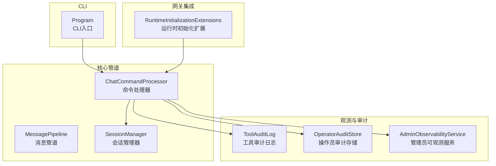
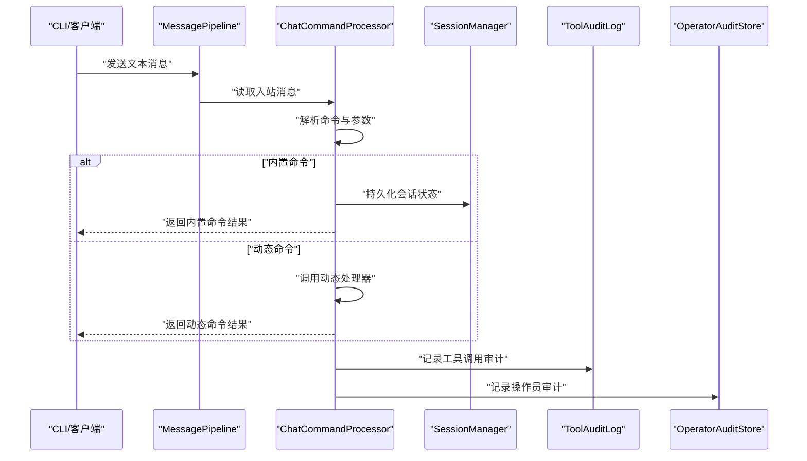
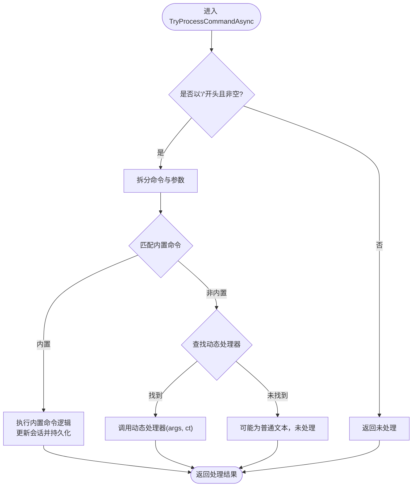
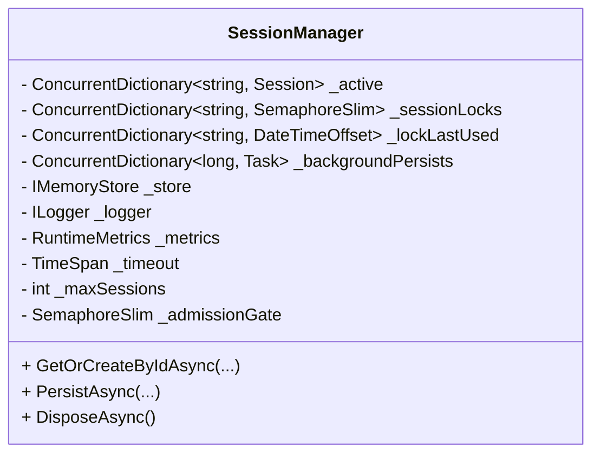
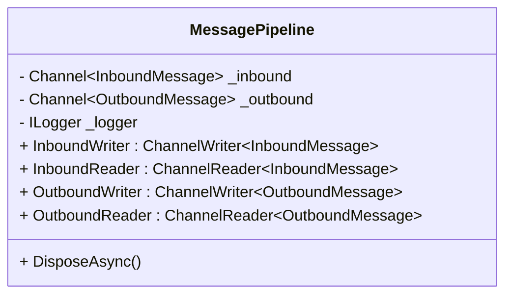
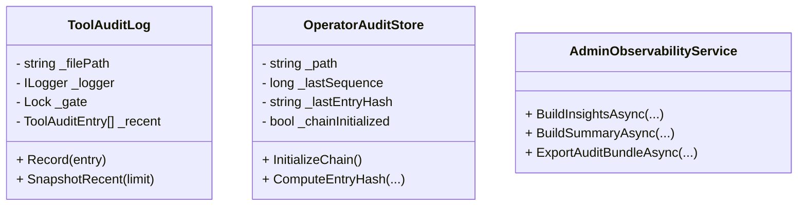
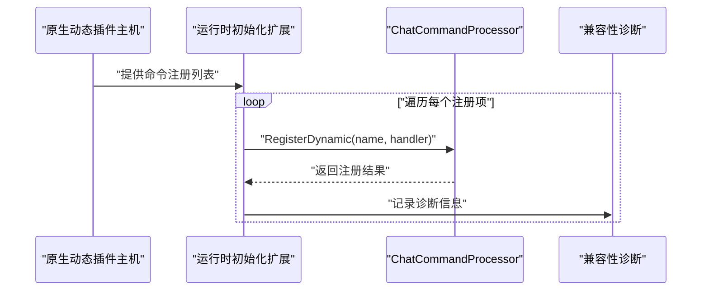
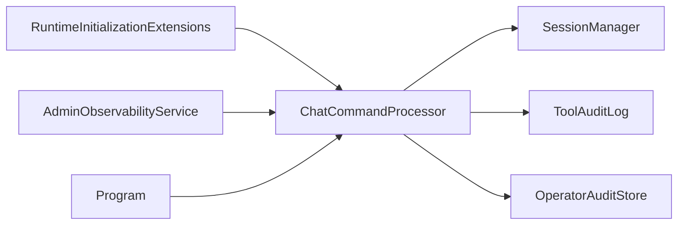

# 命令处理机制

<cite>
**本文档引用的文件**
- [ChatCommandProcessor.cs](file://src/OpenClaw.Core/Pipeline/ChatCommandProcessor.cs)
- [Session.cs](file://src/OpenClaw.Core/Models/Session.cs)
- [SessionManager.cs](file://src/OpenClaw.Core/Sessions/SessionManager.cs)
- [MessagePipeline.cs](file://src/OpenClaw.Core/Pipeline/MessagePipeline.cs)
- [ToolAuditLog.cs](file://src/OpenClaw.Core/Observability/ToolAuditLog.cs)
- [OperatorAuditStore.cs](file://src/OpenClaw.Gateway/OperatorAuditStore.cs)
- [RuntimeInitializationExtensions.CompositionStages.cs](file://src/OpenClaw.Gateway/Composition/RuntimeInitializationExtensions.CompositionStages.cs)
- [GatewayWorkersTests.cs](file://src/OpenClaw.Tests/GatewayWorkersTests.cs)
- [ChatCommandProcessorTests.cs](file://src/OpenClaw.Tests/ChatCommandProcessorTests.cs)
- [AdminObservabilityService.cs](file://src/OpenClaw.Gateway/AdminObservabilityService.cs)
- [Program.cs](file://src/OpenClaw.Cli/Program.cs)
</cite>

## 目录
1. [简介](#简介)
2. [项目结构](#项目结构)
3. [核心组件](#核心组件)
4. [架构总览](#架构总览)
5. [详细组件分析](#详细组件分析)
6. [依赖关系分析](#依赖关系分析)
7. [性能考量](#性能考量)
8. [故障排查指南](#故障排查指南)
9. [结论](#结论)
10. [附录](#附录)

## 简介
本文件系统性阐述 Kingcrab 项目中的命令处理机制，覆盖动态命令注册、参数解析、执行调度与结果返回；同时说明命令路由策略、权限验证、并发控制与超时管理，并包含命令历史记录、审计日志、性能监控与错误处理机制。最后提供命令开发规范、调试技巧与性能优化建议。

## 项目结构
命令处理机制主要分布在以下模块：
- 核心管道层：负责消息通道、命令解析与分发
- 会话管理层：负责会话状态、并发锁与持久化
- 观测与审计：负责工具调用审计、操作员审计与运行指标
- 网关集成：负责动态命令注册、兼容性诊断与运行时装配
- CLI 层：提供命令行交互入口与帮助信息

**图表来源**
- [ChatCommandProcessor.cs:19-221](file://src/OpenClaw.Core/Pipeline/ChatCommandProcessor.cs#L19-L221)
- [MessagePipeline.cs:11-56](file://src/OpenClaw.Core/Pipeline/MessagePipeline.cs#L11-L56)
- [SessionManager.cs:13-33](file://src/OpenClaw.Core/Sessions/SessionManager.cs#L13-L33)
- [ToolAuditLog.cs:39-125](file://src/OpenClaw.Core/Observability/ToolAuditLog.cs#L39-L125)
- [OperatorAuditStore.cs:130-178](file://src/OpenClaw.Gateway/OperatorAuditStore.cs#L130-L178)
- [RuntimeInitializationExtensions.CompositionStages.cs:353-394](file://src/OpenClaw.Gateway/Composition/RuntimeInitializationExtensions.CompositionStages.cs#L353-L394)
- [Program.cs:12-83](file://src/OpenClaw.Cli/Program.cs#L12-L83)

**章节来源**
- [ChatCommandProcessor.cs:19-221](file://src/OpenClaw.Core/Pipeline/ChatCommandProcessor.cs#L19-L221)
- [MessagePipeline.cs:11-56](file://src/OpenClaw.Core/Pipeline/MessagePipeline.cs#L11-L56)
- [SessionManager.cs:13-33](file://src/OpenClaw.Core/Sessions/SessionManager.cs#L13-L33)
- [ToolAuditLog.cs:39-125](file://src/OpenClaw.Core/Observability/ToolAuditLog.cs#L39-L125)
- [OperatorAuditStore.cs:130-178](file://src/OpenClaw.Gateway/OperatorAuditStore.cs#L130-L178)
- [RuntimeInitializationExtensions.CompositionStages.cs:353-394](file://src/OpenClaw.Gateway/Composition/RuntimeInitializationExtensions.CompositionStages.cs#L353-L394)
- [Program.cs:12-83](file://src/OpenClaw.Cli/Program.cs#L12-L83)

## 核心组件
- ChatCommandProcessor：内置命令集（状态查询、模型切换、思考深度、紧凑历史、简洁模式、详细输出、帮助）与动态命令注册（插件注入），支持 LLM 驱动的历史压缩回调。
- SessionManager：会话生命周期管理、并发锁、后台持久化、容量限制与超时控制。
- MessagePipeline：基于 System.Threading.Channels 的有界通道，提供背压保护与零分配吞吐。
- ToolAuditLog：工具调用审计记录（JSON Lines），包含耗时、失败、超时、治理决策等字段。
- OperatorAuditStore：操作员审计链式校验与导出，支持序列号与哈希链完整性。
- RuntimeInitializationExtensions：运行时装配阶段对动态命令注册进行诊断与兼容性检查。
- AdminObservabilityService：聚合审批、事件、审计、死信等指标，生成汇总与时间序列。
- CLI Program：命令行入口，提供 chat 模式下的斜杠命令支持与帮助信息。

**章节来源**
- [ChatCommandProcessor.cs:19-221](file://src/OpenClaw.Core/Pipeline/ChatCommandProcessor.cs#L19-L221)
- [SessionManager.cs:13-33](file://src/OpenClaw.Core/Sessions/SessionManager.cs#L13-L33)
- [MessagePipeline.cs:11-56](file://src/OpenClaw.Core/Pipeline/MessagePipeline.cs#L11-L56)
- [ToolAuditLog.cs:39-125](file://src/OpenClaw.Core/Observability/ToolAuditLog.cs#L39-L125)
- [OperatorAuditStore.cs:130-178](file://src/OpenClaw.Gateway/OperatorAuditStore.cs#L130-L178)
- [RuntimeInitializationExtensions.CompositionStages.cs:353-394](file://src/OpenClaw.Gateway/Composition/RuntimeInitializationExtensions.CompositionStages.cs#L353-L394)
- [AdminObservabilityService.cs:26-229](file://src/OpenClaw.Gateway/AdminObservabilityService.cs#L26-L229)
- [Program.cs:541-611](file://src/OpenClaw.Cli/Program.cs#L541-L611)

## 架构总览
命令处理从 CLI 或网关入口进入，经由消息管道进入命令处理器，根据命令类型分派到内置逻辑或动态处理器，期间更新会话状态并写入审计日志，最终通过网关或 CLI 返回响应。

**图表来源**
- [MessagePipeline.cs:11-56](file://src/OpenClaw.Core/Pipeline/MessagePipeline.cs#L11-L56)
- [ChatCommandProcessor.cs:70-212](file://src/OpenClaw.Core/Pipeline/ChatCommandProcessor.cs#L70-L212)
- [SessionManager.cs:13-33](file://src/OpenClaw.Core/Sessions/SessionManager.cs#L13-L33)
- [ToolAuditLog.cs:72-95](file://src/OpenClaw.Core/Observability/ToolAuditLog.cs#L72-L95)
- [OperatorAuditStore.cs:130-178](file://src/OpenClaw.Gateway/OperatorAuditStore.cs#L130-L178)

## 详细组件分析

### ChatCommandProcessor 组件分析
- 动态命令注册
  - 注册前检查是否为保留内置命令名，避免冲突。
  - 使用线程安全字典存储动态处理器，键统一规范化为以“/”开头的小写形式。
  - 支持重复注册检测，首次注册生效，后续重复返回“已存在”。
- 参数解析与执行
  - 文本必须以“/”开头，按空格拆分为命令与参数。
  - 内置命令分支覆盖状态、重置、模型、用量、思考、紧凑、简洁、详细、帮助等。
  - 动态命令分支直接调用注册的处理器函数，传入参数与取消令牌。
- 历史压缩回调
  - 可设置 LLM 驱动的历史压缩回调，若未设置则回退为简单保留最近 N 轮。
  - 压缩后自动持久化会话。
- 性能与可观测性
  - 内置命令均短路 LLM 推理，避免不必要的计算。
  - 提供缓存读写统计辅助显示。

**图表来源**
- [ChatCommandProcessor.cs:70-212](file://src/OpenClaw.Core/Pipeline/ChatCommandProcessor.cs#L70-L212)

**章节来源**
- [ChatCommandProcessor.cs:55-64](file://src/OpenClaw.Core/Pipeline/ChatCommandProcessor.cs#L55-L64)
- [ChatCommandProcessor.cs:80-211](file://src/OpenClaw.Core/Pipeline/ChatCommandProcessor.cs#L80-L211)
- [ChatCommandProcessorTests.cs:13-35](file://src/OpenClaw.Tests/ChatCommandProcessorTests.cs#L13-L35)

### SessionManager 组件分析
- 并发控制
  - 使用并发字典维护活动会话与会话级信号量，实现会话粒度的互斥访问。
  - 全局准入门控保证后台持久化任务有序执行。
- 生命周期与持久化
  - 后台持久化队列按序提交，避免竞态。
  - 提供主动释放接口，确保资源正确回收。
- 超时与容量
  - 通过配置项控制最大并发会话数与会话超时时间，防止资源耗尽。
- 测试验证
  - 单元测试覆盖并发捕获、取消令牌不破坏信号量等场景。

**图表来源**
- [SessionManager.cs:13-33](file://src/OpenClaw.Core/Sessions/SessionManager.cs#L13-L33)

**章节来源**
- [SessionManager.cs:13-33](file://src/OpenClaw.Core/Sessions/SessionManager.cs#L13-L33)
- [SessionManagerTests.cs:146-188](file://src/OpenClaw.Tests/SessionManagerTests.cs#L146-L188)

### MessagePipeline 组件分析
- 通道设计
  - 入站/出站通道均为有界通道，满载时等待，避免内存暴涨。
  - 支持多读多写，配合背压策略提升稳定性。
- 关闭与清理
  - 正常关闭时尝试完成写端并清空剩余消息，记录丢弃数量用于告警。

**图表来源**
- [MessagePipeline.cs:11-56](file://src/OpenClaw.Core/Pipeline/MessagePipeline.cs#L11-L56)

**章节来源**
- [MessagePipeline.cs:11-56](file://src/OpenClaw.Core/Pipeline/MessagePipeline.cs#L11-L56)

### 审计与可观测性组件分析
- 工具调用审计
  - 记录关键字段（时间戳、工具名、会话ID、渠道、发送者、关联ID、耗时、失败/超时、治理决策等）。
  - 采用 JSON Lines 追加写入，线程安全，支持最近条目快照。
- 操作员审计
  - 基于序列号与哈希链构建不可篡改审计链，支持导出清单与校验。
- 管理员可观测性
  - 聚合审批决策、运行时事件、操作员动作、死信、自动化运行、提供商路由等指标，生成汇总与时间序列。

**图表来源**
- [ToolAuditLog.cs:39-125](file://src/OpenClaw.Core/Observability/ToolAuditLog.cs#L39-L125)
- [OperatorAuditStore.cs:130-178](file://src/OpenClaw.Gateway/OperatorAuditStore.cs#L130-L178)
- [AdminObservabilityService.cs:26-229](file://src/OpenClaw.Gateway/AdminObservabilityService.cs#L26-L229)

**章节来源**
- [ToolAuditLog.cs:39-125](file://src/OpenClaw.Core/Observability/ToolAuditLog.cs#L39-L125)
- [OperatorAuditStore.cs:130-178](file://src/OpenClaw.Gateway/OperatorAuditStore.cs#L130-L178)
- [AdminObservabilityService.cs:26-229](file://src/OpenClaw.Gateway/AdminObservabilityService.cs#L26-L229)

### 网关动态命令注册与权限验证
- 动态命令注册
  - 在运行时装配阶段遍历原生动态插件主机的命令注册表，逐个调用处理器注册。
  - 对注册结果进行诊断：保留命令名、重复命令名等，记录兼容性诊断。
- 权限验证与批准流程
  - 测试覆盖了外部攻击者发起批准请求被拒绝、可复用批准授权绕过待批流程等场景。
  - 管理端点在执行外部 CLI 命令前进行操作员授权与 CSRF 校验。

**图表来源**
- [RuntimeInitializationExtensions.CompositionStages.cs:353-394](file://src/OpenClaw.Gateway/Composition/RuntimeInitializationExtensions.CompositionStages.cs#L353-L394)
- [ChatCommandProcessor.cs:55-64](file://src/OpenClaw.Core/Pipeline/ChatCommandProcessor.cs#L55-L64)

**章节来源**
- [RuntimeInitializationExtensions.CompositionStages.cs:353-394](file://src/OpenClaw.Gateway/Composition/RuntimeInitializationExtensions.CompositionStages.cs#L353-L394)
- [GatewayWorkersTests.cs:154-186](file://src/OpenClaw.Tests/GatewayWorkersTests.cs#L154-L186)

### CLI 命令与交互
- CLI 入口
  - 支持多种子命令与选项，提供帮助信息与版本输出。
- chat 模式
  - 支持斜杠命令（如 /help、/reset、/model 等）与图像输入命令。
  - 将用户输入转换为消息流并接收流式响应。

**章节来源**
- [Program.cs:12-83](file://src/OpenClaw.Cli/Program.cs#L12-L83)
- [Program.cs:541-611](file://src/OpenClaw.Cli/Program.cs#L541-L611)

## 依赖关系分析
- ChatCommandProcessor 依赖 SessionManager 进行会话持久化，依赖 ProviderUsageTracker 获取缓存统计（可选）。
- MessagePipeline 作为通用传输层被上层组件复用。
- ToolAuditLog 与 OperatorAuditStore 分别面向工具调用与操作员行为的审计。
- RuntimeInitializationExtensions 在装配阶段连接动态插件与命令处理器。
- AdminObservabilityService 聚合多源数据形成运营视图。

**图表来源**
- [ChatCommandProcessor.cs:35-44](file://src/OpenClaw.Core/Pipeline/ChatCommandProcessor.cs#L35-L44)
- [RuntimeInitializationExtensions.CompositionStages.cs:353-362](file://src/OpenClaw.Gateway/Composition/RuntimeInitializationExtensions.CompositionStages.cs#L353-L362)
- [AdminObservabilityService.cs:26-53](file://src/OpenClaw.Gateway/AdminObservabilityService.cs#L26-L53)
- [Program.cs:12-83](file://src/OpenClaw.Cli/Program.cs#L12-L83)

**章节来源**
- [ChatCommandProcessor.cs:35-44](file://src/OpenClaw.Core/Pipeline/ChatCommandProcessor.cs#L35-L44)
- [RuntimeInitializationExtensions.CompositionStages.cs:353-362](file://src/OpenClaw.Gateway/Composition/RuntimeInitializationExtensions.CompositionStages.cs#L353-L362)
- [AdminObservabilityService.cs:26-53](file://src/OpenClaw.Gateway/AdminObservabilityService.cs#L26-L53)
- [Program.cs:12-83](file://src/OpenClaw.Cli/Program.cs#L12-L83)

## 性能考量
- 消息吞吐
  - 使用有界通道与等待模式，避免内存压力；合理设置容量以平衡延迟与内存占用。
- 并发与锁
  - 会话级信号量与全局准入门控降低竞争；后台持久化队列避免阻塞主路径。
- 命令短路
  - 内置命令直接返回，不触发 LLM 推理，显著降低延迟与成本。
- 缓存统计
  - 提供提示词缓存读写统计，便于评估缓存命中效果与优化策略。
- 资源释放
  - 明确的异步释放流程与异常路径下的资源回收，避免泄漏。

[本节为通用性能指导，无需特定文件引用]

## 故障排查指南
- 动态命令注册失败
  - 若返回“保留命令名”，请更换命令名；若返回“重复”，请检查是否重复注册。
- 批准请求无效
  - 外部攻击者发起的批准请求会被拒绝，确认请求来源与授权上下文。
- 会话并发问题
  - 观察会话锁状态与后台持久化队列，确保未出现死锁或资源泄露。
- 审计缺失
  - 检查审计文件路径是否存在、权限是否足够；确认 JSON Lines 写入未抛出异常。
- CLI 交互异常
  - 确认 CLI 子命令与选项拼写正确；在 chat 模式下检查斜杠命令格式。

**章节来源**
- [ChatCommandProcessorTests.cs:13-35](file://src/OpenClaw.Tests/ChatCommandProcessorTests.cs#L13-L35)
- [GatewayWorkersTests.cs:154-186](file://src/OpenClaw.Tests/GatewayWorkersTests.cs#L154-L186)
- [ToolAuditLog.cs:72-95](file://src/OpenClaw.Core/Observability/ToolAuditLog.cs#L72-L95)

## 结论
该命令处理机制通过清晰的职责分离与强健的并发控制，实现了高吞吐、低延迟的命令解析与执行。内置命令提供即开即用的会话管理能力，动态命令注册支持插件生态扩展。审计与可观测性体系保障了可追溯与运营洞察。结合 CLI 与网关入口，形成了完整的命令交互闭环。

[本节为总结性内容，无需特定文件引用]

## 附录

### 命令开发规范
- 命令命名
  - 避免使用内置保留命令名；动态命令应语义明确、唯一。
- 参数解析
  - 严格区分命令与参数，必要时提供帮助文本与示例。
- 错误处理
  - 对非法参数与异常情况返回明确错误信息，避免静默失败。
- 审计与日志
  - 记录必要的审计字段（工具名、会话ID、耗时、失败/超时、治理决策等）；避免记录敏感参数与结果。
- 性能
  - 尽量短路非推理型命令；对长耗时操作提供进度反馈与取消支持。

[本节为通用开发规范，无需特定文件引用]

### 调试技巧
- 使用单元测试验证命令注册与处理逻辑。
- 在网关侧启用兼容性诊断，定位重复或保留命令问题。
- 通过 CLI chat 模式快速验证命令行为与参数格式。
- 利用管理员可观测性服务查看审批、事件与审计指标。

[本节为通用调试建议，无需特定文件引用]

### 性能优化方法
- 合理设置消息管道容量与背压策略。
- 控制会话并发数与超时阈值，避免资源争用。
- 优先使用内置命令处理常见场景，减少动态处理器开销。
- 优化工具调用超时与重试策略，避免阻塞主路径。

[本节为通用优化建议，无需特定文件引用]