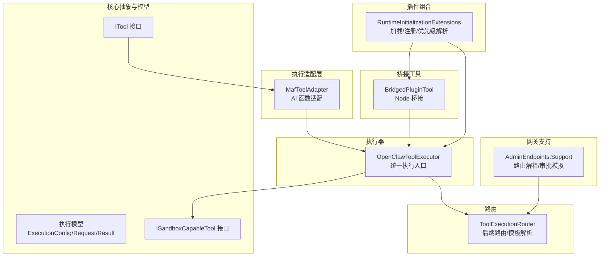
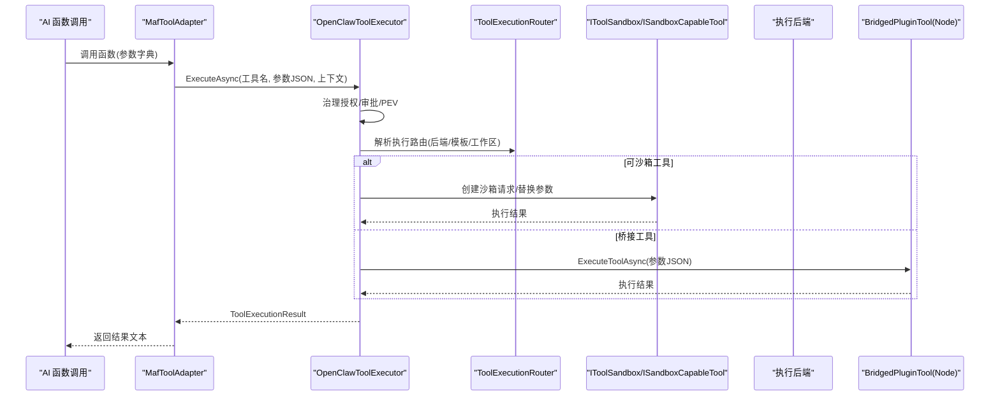
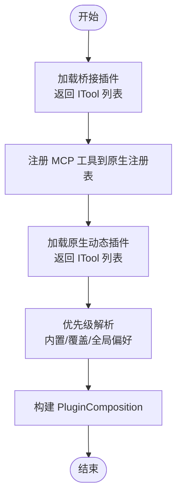
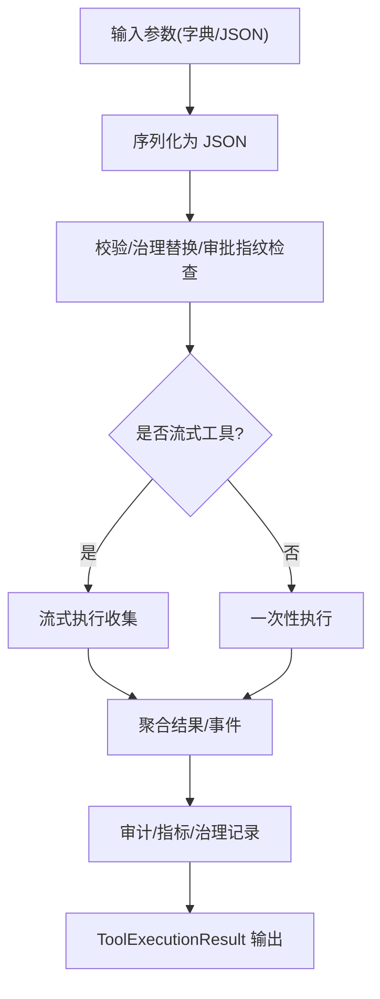
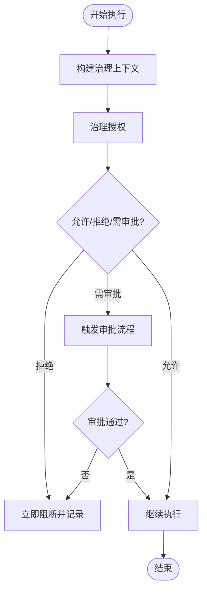
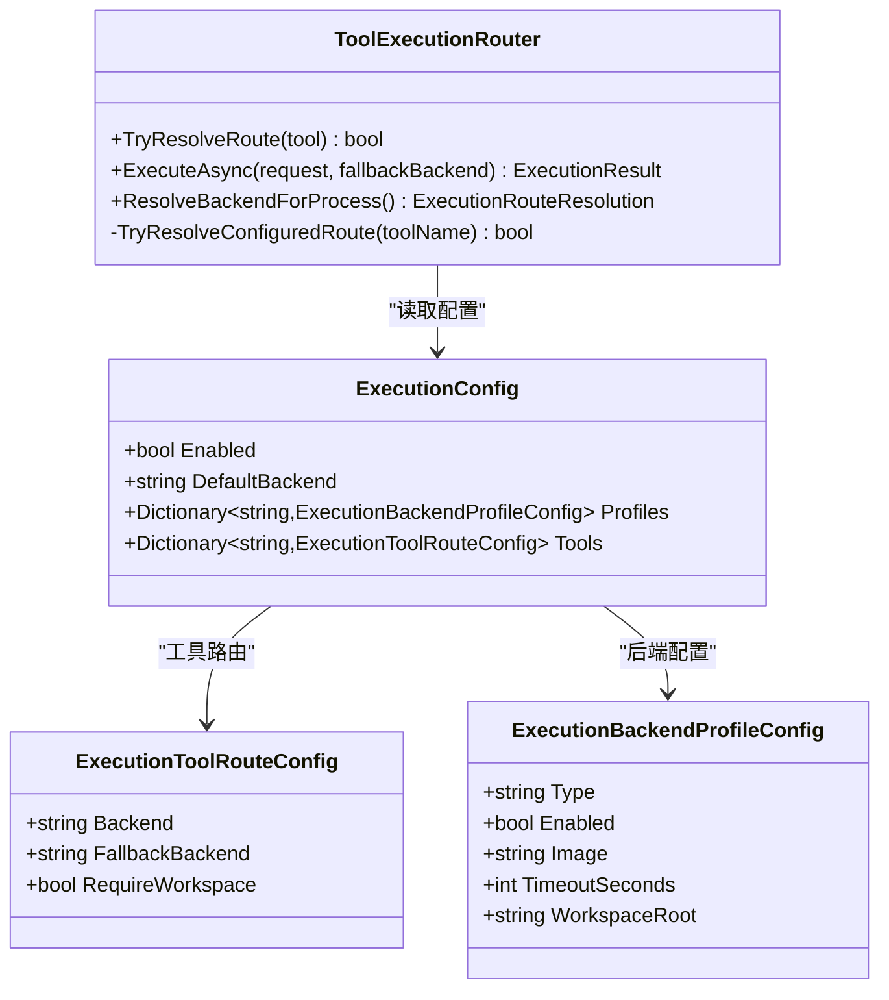
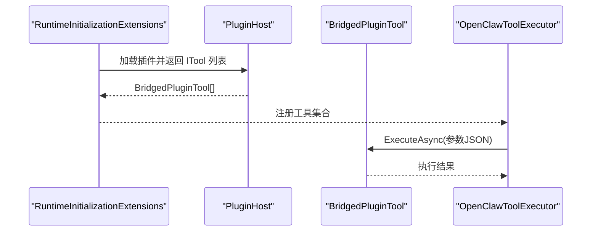
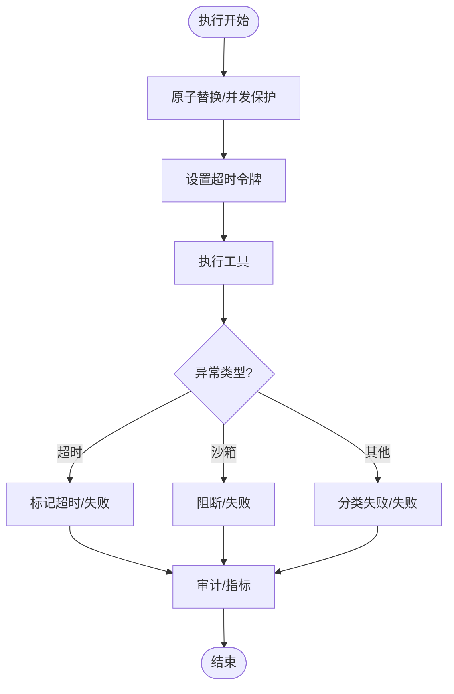
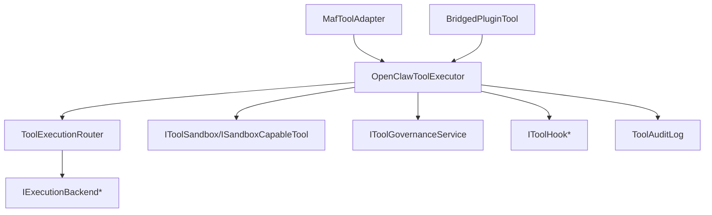

# 工具注册机制

<cite>
**本文档引用的文件**
- [ToolExecutionRouter.cs](file://src/OpenClaw.Agent/Execution/ToolExecutionRouter.cs)
- [ITool.cs](file://src/OpenClaw.Core/Abstractions/ITool.cs)
- [MafToolAdapter.cs](file://src/OpenClaw.Agent/MafToolAdapter.cs)
- [OpenClawToolExecutor.cs](file://src/OpenClaw.Agent/OpenClawToolExecutor.cs)
- [ExecutionModels.cs](file://src/OpenClaw.Core/Models/ExecutionModels.cs)
- [BridgedPluginTool.cs](file://src/OpenClaw.Agent/Plugins/BridgedPluginTool.cs)
- [AdminEndpoints.Support.cs](file://src/OpenClaw.Gateway/Endpoints/AdminEndpoints.Support.cs)
- [RuntimeInitializationExtensions.CompositionStages.cs](file://src/OpenClaw.Gateway/Composition/RuntimeInitializationExtensions.CompositionStages.cs)
- [ISandboxCapableTool.cs](file://src/OpenClaw.Core/Abstractions/ISandboxCapableTool.cs)
- [HttpSidecarToolGovernanceService.cs](file://src/OpenClaw.Core/Governance/HttpSidecarToolGovernanceService.cs)
- [ToolUsageTracker.cs](file://src/OpenClaw.Core/Observability/ToolUsageTracker.cs)
- [openclaw-plugin-system-analysis.md](file://docs/openclaw-plugin-system-analysis.md)
</cite>

## 目录
1. [简介](#简介)
2. [项目结构](#项目结构)
3. [核心组件](#核心组件)
4. [架构总览](#架构总览)
5. [详细组件分析](#详细组件分析)
6. [依赖关系分析](#依赖关系分析)
7. [性能考虑](#性能考虑)
8. [故障排查指南](#故障排查指南)
9. [结论](#结论)
10. [附录](#附录)

## 简介
本文件系统化阐述 Kingcrab/OpenClaw 的工具注册机制与执行流水线，重点覆盖以下方面：
- 桥接工具的发现与注册：包括 TypeScript/JavaScript 插件桥接、原生动态插件、MCP 服务器工具等多源聚合与优先级解析。
- 类型转换与参数映射：从 AI 函数调用参数到工具参数 Schema 的序列化/反序列化、流式与非流式执行路径。
- 返回值处理与错误传播：统一的结果封装、失败分类、超时与沙箱异常处理、治理与审计记录。
- 工具元数据提取：名称、描述、参数 Schema、可选性标记等。
- 权限验证与执行策略：治理授权、审批流程、PEV 决策、预设与会话限制。
- 路由规则：基于配置的后端路由、工作区要求、降级策略。
- 生命周期管理、并发控制、超时处理与错误传播。
- 开发规范、调试技巧与性能优化建议。

## 项目结构
围绕工具注册与执行的关键模块分布如下：
- 核心抽象与模型：定义工具接口、执行请求/结果、后端类型与路由配置。
- 执行适配层：将 ITool 适配为 AI 函数，负责参数映射与流式事件转发。
- 执行器：统一的工具执行入口，集成治理、审批、PEV、沙箱替换、超时与审计。
- 路由器：根据配置与沙箱策略选择执行后端与模板。
- 桥接工具：桥接到 Node.js 插件进程的工具实现。
- 网关支持端点：提供执行路由解释、审批模拟等辅助能力。
- 插件组合阶段：桥接插件加载、MCP 工具注册、原生动态插件加载与优先级解析。

**图表来源**
- [ITool.cs:1-17](file://src/OpenClaw.Core/Abstractions/ITool.cs#L1-L17)
- [ExecutionModels.cs:1-179](file://src/OpenClaw.Core/Models/ExecutionModels.cs#L1-L179)
- [MafToolAdapter.cs:1-63](file://src/OpenClaw.Agent/MafToolAdapter.cs#L1-L63)
- [OpenClawToolExecutor.cs:1-1059](file://src/OpenClaw.Agent/OpenClawToolExecutor.cs#L1-L1059)
- [ToolExecutionRouter.cs:1-253](file://src/OpenClaw.Agent/Execution/ToolExecutionRouter.cs#L1-L253)
- [BridgedPluginTool.cs:1-41](file://src/OpenClaw.Agent/Plugins/BridgedPluginTool.cs#L1-L41)
- [AdminEndpoints.Support.cs:1575-1774](file://src/OpenClaw.Gateway/Endpoints/AdminEndpoints.Support.cs#L1575-L1774)
- [RuntimeInitializationExtensions.CompositionStages.cs:178-227](file://src/OpenClaw.Gateway/Composition/RuntimeInitializationExtensions.CompositionStages.cs#L178-L227)

**章节来源**
- [ITool.cs:1-17](file://src/OpenClaw.Core/Abstractions/ITool.cs#L1-L17)
- [ExecutionModels.cs:1-179](file://src/OpenClaw.Core/Models/ExecutionModels.cs#L1-L179)
- [MafToolAdapter.cs:1-63](file://src/OpenClaw.Agent/MafToolAdapter.cs#L1-L63)
- [OpenClawToolExecutor.cs:1-1059](file://src/OpenClaw.Agent/OpenClawToolExecutor.cs#L1-L1059)
- [ToolExecutionRouter.cs:1-253](file://src/OpenClaw.Agent/Execution/ToolExecutionRouter.cs#L1-L253)
- [BridgedPluginTool.cs:1-41](file://src/OpenClaw.Agent/Plugins/BridgedPluginTool.cs#L1-L41)
- [AdminEndpoints.Support.cs:1575-1774](file://src/OpenClaw.Gateway/Endpoints/AdminEndpoints.Support.cs#L1575-L1774)
- [RuntimeInitializationExtensions.CompositionStages.cs:178-227](file://src/OpenClaw.Gateway/Composition/RuntimeInitializationExtensions.CompositionStages.cs#L178-L227)

## 核心组件
- ITool 抽象：最小化接口，保留名称、描述、参数 Schema 与异步执行方法，面向 AOT 剪枝优化。
- MafToolAdapter：将 ITool 适配为 AI 函数，负责参数 JSON 序列化、流式事件转发与调用结果封装。
- OpenClawToolExecutor：统一执行器，贯穿治理授权、审批、PEV、沙箱替换、超时与审计，输出标准化 ToolExecutionResult。
- ToolExecutionRouter：根据配置与沙箱策略解析执行后端、模板与工作区需求，并支持降级后端。
- BridgedPluginTool：桥接 Node.js 插件进程的工具实现，暴露 Name/Description/ParameterSchema 并委托执行。
- ISandboxCapableTool：可沙箱执行工具的扩展接口，定义默认沙箱模式、沙箱请求创建与结果格式化。
- 执行模型：ExecutionConfig/Request/Result 等，承载后端类型、工作区、环境变量、模板与进程状态等。

**章节来源**
- [ITool.cs:1-17](file://src/OpenClaw.Core/Abstractions/ITool.cs#L1-L17)
- [MafToolAdapter.cs:1-63](file://src/OpenClaw.Agent/MafToolAdapter.cs#L1-L63)
- [OpenClawToolExecutor.cs:1-1059](file://src/OpenClaw.Agent/OpenClawToolExecutor.cs#L1-L1059)
- [ToolExecutionRouter.cs:1-253](file://src/OpenClaw.Agent/Execution/ToolExecutionRouter.cs#L1-L253)
- [BridgedPluginTool.cs:1-41](file://src/OpenClaw.Agent/Plugins/BridgedPluginTool.cs#L1-L41)
- [ISandboxCapableTool.cs:1-14](file://src/OpenClaw.Core/Abstractions/ISandboxCapableTool.cs#L1-L14)
- [ExecutionModels.cs:1-179](file://src/OpenClaw.Core/Models/ExecutionModels.cs#L1-L179)

## 架构总览
工具注册与执行的整体流程如下：

**图表来源**
- [MafToolAdapter.cs:31-61](file://src/OpenClaw.Agent/MafToolAdapter.cs#L31-L61)
- [OpenClawToolExecutor.cs:134-630](file://src/OpenClaw.Agent/OpenClawToolExecutor.cs#L134-L630)
- [ToolExecutionRouter.cs:65-157](file://src/OpenClaw.Agent/Execution/ToolExecutionRouter.cs#L65-L157)
- [BridgedPluginTool.cs:35-39](file://src/OpenClaw.Agent/Plugins/BridgedPluginTool.cs#L35-L39)

## 详细组件分析

### 组件一：工具发现与注册（多源聚合与优先级）
- 桥接插件（TS/JS）：通过 PluginHost 加载，返回 ITool 列表，注入到运行时。
- MCP 服务器工具：在桥接插件加载后，将 MCP 工具注册到原生注册表。
- 原生动态插件（.NET）：NativeDynamicPluginHost 加载，返回 ITool 列表。
- 优先级解析：NativePluginRegistry.ResolvePreference 基于内置工具、单工具覆盖、全局偏好进行去重与胜负判定。
- 最终组合：RuntimeInitializationExtensions 返回 PluginComposition，包含所有工具、通道、钩子、命令、提供者等。

**图表来源**
- [RuntimeInitializationExtensions.CompositionStages.cs:178-227](file://src/OpenClaw.Gateway/Composition/RuntimeInitializationExtensions.CompositionStages.cs#L178-L227)
- [openclaw-plugin-system-analysis.md:400-428](file://docs/openclaw-plugin-system-analysis.md#L400-L428)

**章节来源**
- [RuntimeInitializationExtensions.CompositionStages.cs:178-227](file://src/OpenClaw.Gateway/Composition/RuntimeInitializationExtensions.CompositionStages.cs#L178-L227)
- [openclaw-plugin-system-analysis.md:400-428](file://docs/openclaw-plugin-system-analysis.md#L400-L428)

### 组件二：类型转换、参数映射与返回值处理
- 参数映射：MafToolAdapter 将 AIFunctionArguments 转换为字典并序列化为 JSON；OpenClawToolExecutor 对 FunctionCallContent 同样进行序列化。
- 流式处理：若工具实现 IStreamingTool 且启用流式，执行器收集增量并写入流事件。
- 结果封装：统一返回 ToolExecutionResult，包含 Invocation、ResultText、状态码、失败原因与下一步建议。
- 错误分类：根据异常类型与上下文分类失败代码，区分超时、沙箱阻断、操作员认证缺失等。

**图表来源**
- [MafToolAdapter.cs:31-61](file://src/OpenClaw.Agent/MafToolAdapter.cs#L31-L61)
- [OpenClawToolExecutor.cs:134-630](file://src/OpenClaw.Agent/OpenClawToolExecutor.cs#L134-L630)

**章节来源**
- [MafToolAdapter.cs:1-63](file://src/OpenClaw.Agent/MafToolAdapter.cs#L1-L63)
- [OpenClawToolExecutor.cs:1-1059](file://src/OpenClaw.Agent/OpenClawToolExecutor.cs#L1-L1059)

### 组件三：权限验证、治理与审批策略
- 治理授权：OpenClawToolExecutor 构造 ToolGovernanceContext，调用 IToolGovernanceService.AuthorizeAsync 获取决策。
- 治理回退：当治理服务不可用时，按配置决定 fail-closed 或 fail-open 行为。
- 审批流程：支持用户交互审批回调，结合 PEV（计划-执行-验证）评估工具调用，必要时要求审批。
- 预设与会话限制：根据 ResolvedToolPreset 与 Session.RouteAllowedTools 控制工具可用性。

**图表来源**
- [OpenClawToolExecutor.cs:198-433](file://src/OpenClaw.Agent/OpenClawToolExecutor.cs#L198-L433)
- [HttpSidecarToolGovernanceService.cs:158-199](file://src/OpenClaw.Core/Governance/HttpSidecarToolGovernanceService.cs#L158-L199)

**章节来源**
- [OpenClawToolExecutor.cs:1-1059](file://src/OpenClaw.Agent/OpenClawToolExecutor.cs#L1-L1059)
- [HttpSidecarToolGovernanceService.cs:158-199](file://src/OpenClaw.Core/Governance/HttpSidecarToolGovernanceService.cs#L158-L199)

### 组件四：执行路由与后端选择
- 配置驱动：ExecutionConfig.Tools 映射工具到后端；ExecutionBackendProfileConfig 定义后端类型、工作区、环境、镜像与超时。
- 沙箱策略：ToolSandboxPolicy 决定是否启用 opensandbox 后端及模板；可回退到本地或其他后端。
- 降级策略：当首选后端失败且存在 FallbackBackend 时自动切换，并标记 FallbackUsed。

**图表来源**
- [ToolExecutionRouter.cs:1-253](file://src/OpenClaw.Agent/Execution/ToolExecutionRouter.cs#L1-L253)
- [ExecutionModels.cs:8-60](file://src/OpenClaw.Core/Models/ExecutionModels.cs#L8-L60)

**章节来源**
- [ToolExecutionRouter.cs:1-253](file://src/OpenClaw.Agent/Execution/ToolExecutionRouter.cs#L1-L253)
- [ExecutionModels.cs:1-179](file://src/OpenClaw.Core/Models/ExecutionModels.cs#L1-L179)

### 组件五：桥接工具的发现与执行
- BridgedPluginTool：封装来自 Node.js 插件的工具注册，暴露 Name/Description/ParameterSchema，并通过 PluginBridgeProcess 执行。
- 插件组合：RuntimeInitializationExtensions 加载桥接插件并注册工具；AdminEndpoints.Support 提供执行路由解释。

**图表来源**
- [RuntimeInitializationExtensions.CompositionStages.cs:178-227](file://src/OpenClaw.Gateway/Composition/RuntimeInitializationExtensions.CompositionStages.cs#L178-L227)
- [BridgedPluginTool.cs:1-41](file://src/OpenClaw.Agent/Plugins/BridgedPluginTool.cs#L1-L41)
- [AdminEndpoints.Support.cs:1575-1629](file://src/OpenClaw.Gateway/Endpoints/AdminEndpoints.Support.cs#L1575-L1629)

**章节来源**
- [BridgedPluginTool.cs:1-41](file://src/OpenClaw.Agent/Plugins/BridgedPluginTool.cs#L1-L41)
- [RuntimeInitializationExtensions.CompositionStages.cs:178-227](file://src/OpenClaw.Gateway/Composition/RuntimeInitializationExtensions.CompositionStages.cs#L178-L227)
- [AdminEndpoints.Support.cs:1575-1629](file://src/OpenClaw.Gateway/Endpoints/AdminEndpoints.Support.cs#L1575-L1629)

### 组件六：生命周期管理、并发控制、超时与错误传播
- 生命周期：OpenClawToolExecutor.ReplaceMcpTools 原子替换 MCP 工具集合，支持热重载期间并发请求安全。
- 并发控制：工具执行器内部使用锁保护工具表更新；会话/预设维度的工具可用性检查避免越权。
- 超时处理：执行器为流式与非流式分别设置超时；超时抛出 OperationCanceledException，捕获后归类为超时失败。
- 错误传播：统一记录失败代码、失败消息、下一步建议；对沙箱异常进行阻断分类；对治理不可用进行告警并按策略回退。

**图表来源**
- [OpenClawToolExecutor.cs:119-132](file://src/OpenClaw.Agent/OpenClawToolExecutor.cs#L119-L132)
- [OpenClawToolExecutor.cs:483-530](file://src/OpenClaw.Agent/OpenClawToolExecutor.cs#L483-L530)

**章节来源**
- [OpenClawToolExecutor.cs:1-1059](file://src/OpenClaw.Agent/OpenClawToolExecutor.cs#L1-L1059)

## 依赖关系分析
- 组件耦合：
  - MafToolAdapter 依赖 ITool 与 OpenClawToolExecutor。
  - OpenClawToolExecutor 依赖 ITool、ToolExecutionRouter、IToolSandbox、IToolGovernanceService、工具钩子、审计与指标。
  - ToolExecutionRouter 依赖 GatewayConfig 与 IExecutionBackend 实现。
  - BridgedPluginTool 依赖 PluginBridgeProcess。
- 外部依赖：
  - 治理服务（HttpSidecarToolGovernanceService）提供授权与回退策略。
  - 观测性组件（ToolUsageTracker）提供工具使用统计。

**图表来源**
- [MafToolAdapter.cs:1-63](file://src/OpenClaw.Agent/MafToolAdapter.cs#L1-L63)
- [OpenClawToolExecutor.cs:1-100](file://src/OpenClaw.Agent/OpenClawToolExecutor.cs#L1-L100)
- [ToolExecutionRouter.cs:16-63](file://src/OpenClaw.Agent/Execution/ToolExecutionRouter.cs#L16-L63)
- [BridgedPluginTool.cs:1-41](file://src/OpenClaw.Agent/Plugins/BridgedPluginTool.cs#L1-L41)

**章节来源**
- [MafToolAdapter.cs:1-63](file://src/OpenClaw.Agent/MafToolAdapter.cs#L1-L63)
- [OpenClawToolExecutor.cs:1-1059](file://src/OpenClaw.Agent/OpenClawToolExecutor.cs#L1-L1059)
- [ToolExecutionRouter.cs:1-253](file://src/OpenClaw.Agent/Execution/ToolExecutionRouter.cs#L1-L253)
- [BridgedPluginTool.cs:1-41](file://src/OpenClaw.Agent/Plugins/BridgedPluginTool.cs#L1-L41)

## 性能考虑
- 工具声明缓存：OpenClawToolExecutor 缓存工具声明列表，减少重复构建开销。
- 流式执行：IStreamingTool 通过增量收集降低内存峰值，但需注意最大字符限制。
- 治理与审批：治理授权与审批等待可能引入延迟，建议合理设置超时与审批通道。
- 沙箱与后端：opensandbox 提供更强隔离，但启动与执行有额外开销；本地执行适合轻量工具。
- 指标与观测：ToolUsageTracker 提供调用次数、失败率、超时率与耗时统计，便于性能分析。

[本节为通用指导，无需特定文件来源]

## 故障排查指南
- 治理不可用：当治理侧车不可用时，按 fail-closed/fail-open 策略回退或阻断，检查网络与配置。
- 审批超时：审批回调超时会记录审计事件并标记超时，检查审批通道与超时配置。
- 沙箱阻断：ToolSandboxException 会被分类为阻断失败，检查沙箱策略与模板配置。
- 超时失败：OperationCanceledException 捕获后标记超时，调整 Tooling.ToolTimeoutSeconds。
- 审计与指标：通过 ToolAuditLog 与 RuntimeMetrics 定位失败原因与热点工具。

**章节来源**
- [HttpSidecarToolGovernanceService.cs:158-199](file://src/OpenClaw.Core/Governance/HttpSidecarToolGovernanceService.cs#L158-L199)
- [OpenClawToolExecutor.cs:483-530](file://src/OpenClaw.Agent/OpenClawToolExecutor.cs#L483-L530)
- [ToolUsageTracker.cs:1-58](file://src/OpenClaw.Core/Observability/ToolUsageTracker.cs#L1-L58)

## 结论
本机制以配置驱动的路由为核心，结合治理授权、审批与 PEV 决策，形成从工具发现、类型转换、参数映射到执行与审计的完整闭环。桥接工具通过 Node.js 进程实现跨语言扩展，原生动态插件与 MCP 工具提供多源聚合与优先级解析。执行器统一处理超时、沙箱与错误传播，并提供可观测性与审计能力，满足生产环境的安全与稳定性要求。

[本节为总结，无需特定文件来源]

## 附录

### 工具开发规范
- 实现 ITool 或 IStreamingTool/IExecutableTool/IActionDescriptorProvider 等扩展接口，确保参数 Schema 正确、可序列化。
- 若需要沙箱执行，实现 ISandboxCapableTool 并提供默认沙箱模式与结果格式化。
- 使用 ToolActionPolicyResolver/IToolActionDescriptorProvider 提供动作描述与审批指纹，提升治理与审计质量。
- 在插件中注册工具时，遵循命名规范与参数 Schema 设计，避免敏感信息泄露。

[本节为通用规范，无需特定文件来源]

### 调试技巧
- 使用 AdminEndpoints.Support.ExplainExecutionRoute 查看工具路由解析详情。
- 通过 ToolUsageTracker 与 ToolAuditLog 快速定位失败工具与耗时异常。
- 在治理不可用场景下，临时调整 fail-open/fail-closed 策略以隔离问题。

**章节来源**
- [AdminEndpoints.Support.cs:1575-1629](file://src/OpenClaw.Gateway/Endpoints/AdminEndpoints.Support.cs#L1575-L1629)
- [ToolUsageTracker.cs:1-58](file://src/OpenClaw.Core/Observability/ToolUsageTracker.cs#L1-L58)

### 性能优化建议
- 合理设置 ExecutionConfig.DefaultBackend 与 Profiles，优先使用本地或 opensandbox 以减少进程间通信开销。
- 对高耗时工具启用流式执行，避免一次性大结果导致内存压力。
- 通过 Tooling.ParallelToolExecution 与会话/预设限制控制并发与资源占用。
- 定期审查治理策略与审批流程，减少不必要的阻断与等待。

[本节为通用指导，无需特定文件来源]