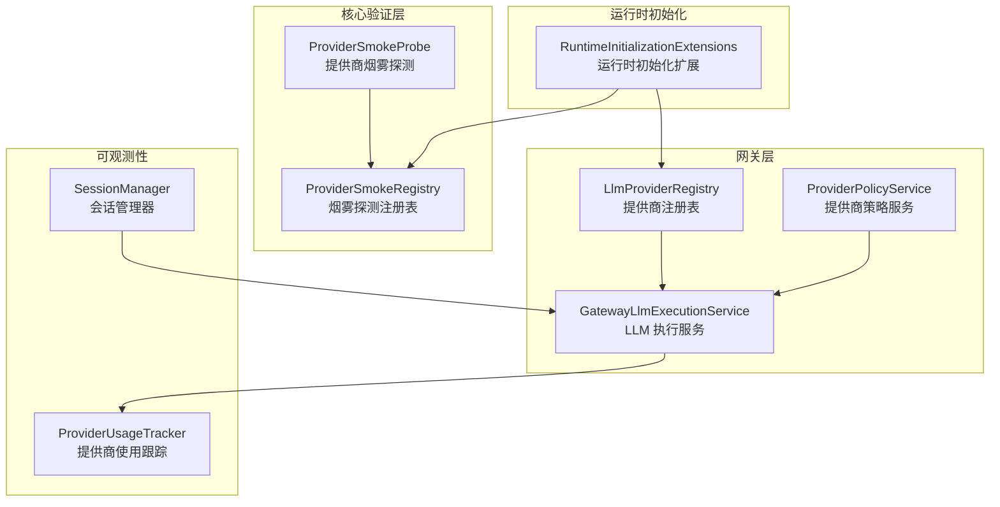
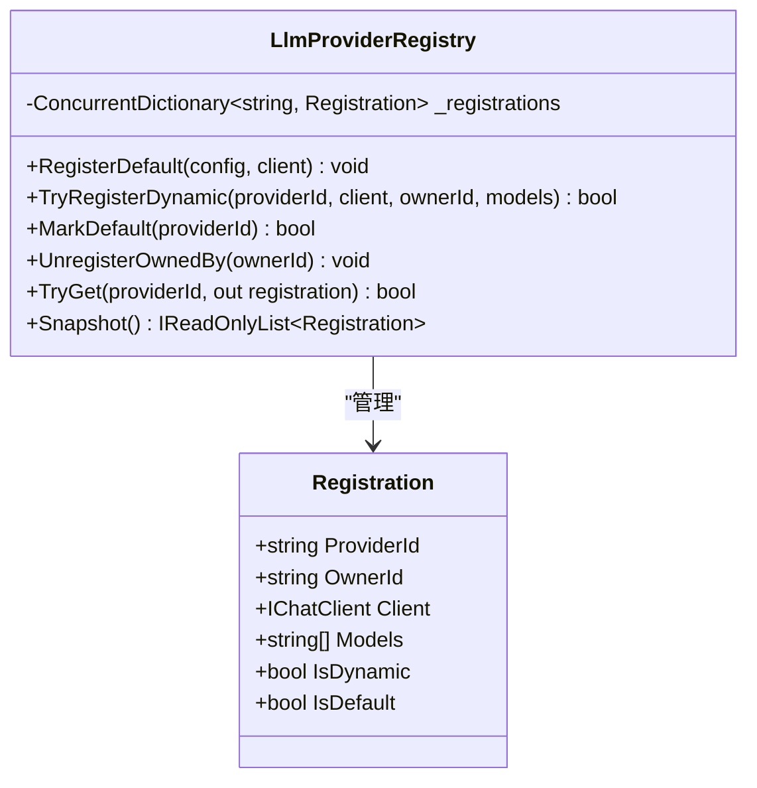
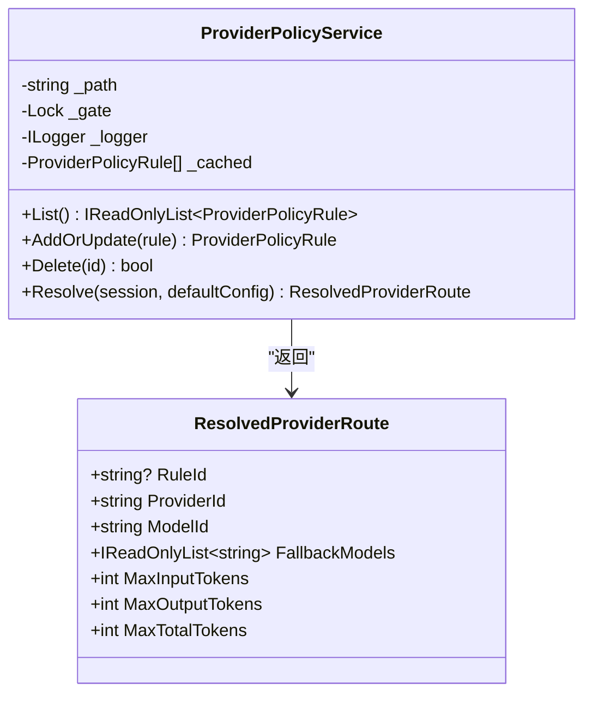
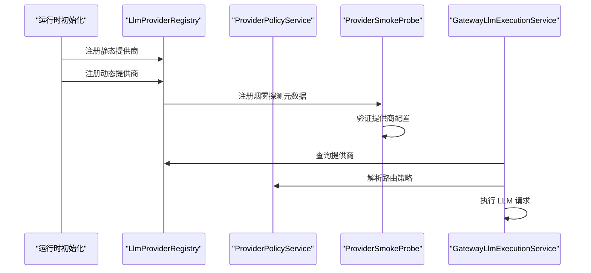
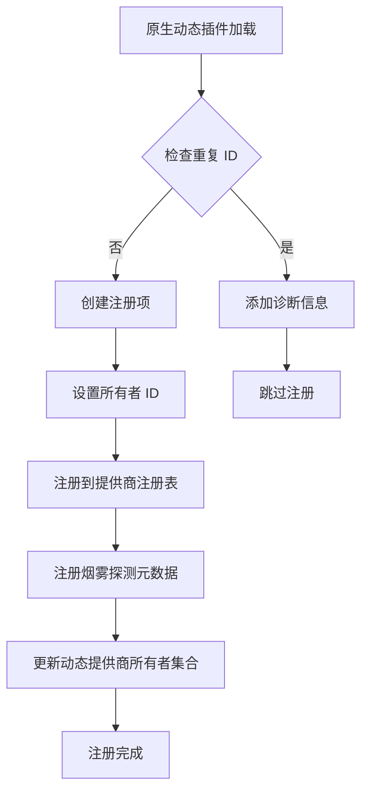
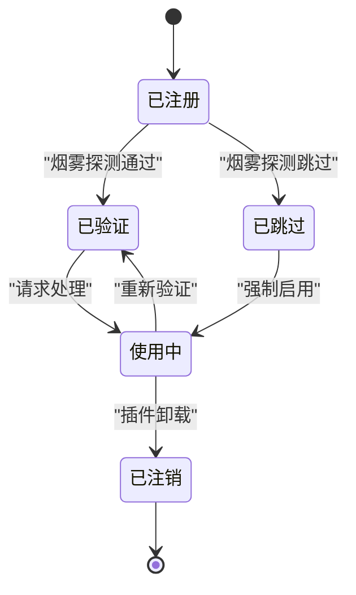
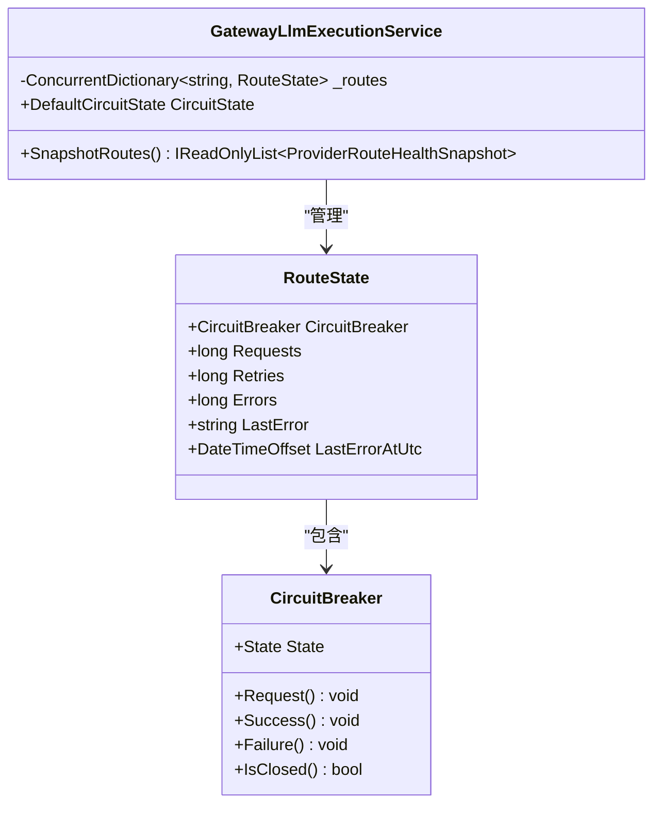
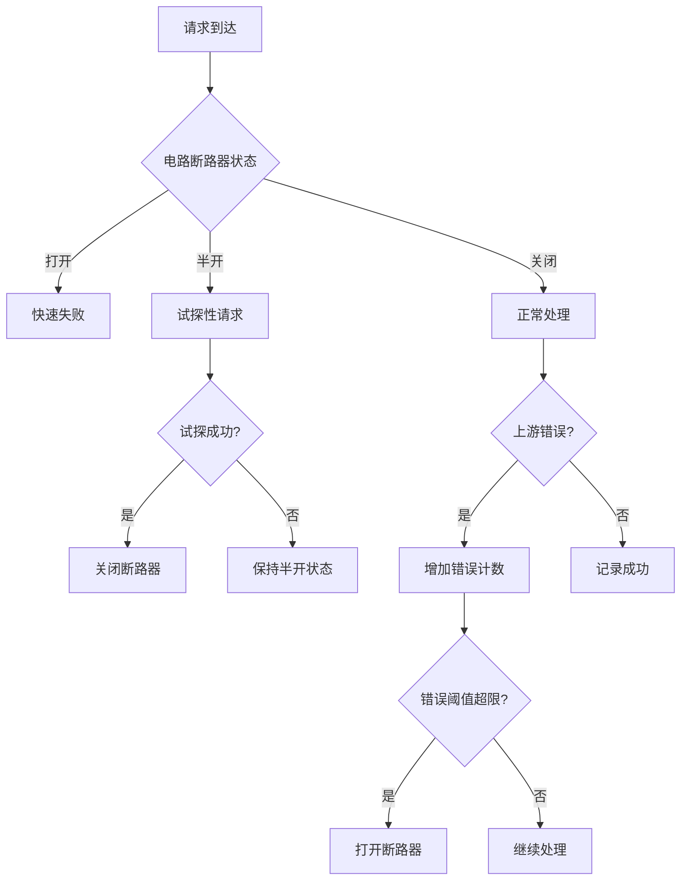
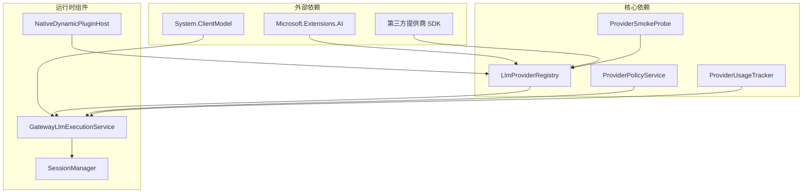
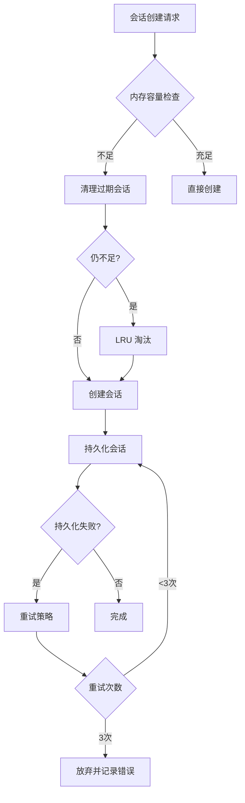

# 提供商注册机制

<cite>
**本文档引用的文件**
- [LlmProviderRegistry.cs](file://src/OpenClaw.Gateway/LlmProviderRegistry.cs)
- [ProviderPolicyService.cs](file://src/OpenClaw.Gateway/ProviderPolicyService.cs)
- [ProviderSmokeProbe.cs](file://src/OpenClaw.Core/Validation/ProviderSmokeProbe.cs)
- [ProviderSmokeRegistry.cs](file://src/OpenClaw.Core/Validation/ProviderSmokeRegistry.cs)
- [RuntimeInitializationExtensions.CompositionStages.cs](file://src/OpenClaw.Gateway/Composition/RuntimeInitializationExtensions.CompositionStages.cs)
- [GatewayLlmExecutionService.cs](file://src/OpenClaw.Gateway/GatewayLlmExecutionService.cs)
- [ProviderUsageTracker.cs](file://src/OpenClaw.Core/Observability/ProviderUsageTracker.cs)
- [SessionManager.cs](file://src/OpenClaw.Core/Sessions/SessionManager.cs)
- [OpenClaw-Session-Management.md](file://docs/OpenClaw-Session-Management.md)
- [PRODUCTION_FIXES.md](file://docs/PRODUCTION_FIXES.md)
</cite>

## 目录
1. [简介](#简介)
2. [项目结构](#项目结构)
3. [核心组件](#核心组件)
4. [架构概览](#架构概览)
5. [详细组件分析](#详细组件分析)
6. [依赖关系分析](#依赖关系分析)
7. [性能考虑](#性能考虑)
8. [故障排除指南](#故障排除指南)
9. [结论](#结论)
10. [附录](#附录)

## 简介

提供商注册机制是 Kingcrab 项目中的核心基础设施，负责动态管理各种 AI 模型提供商的生命周期、配置验证和运行时路由。该机制支持静态配置的提供商以及通过原生动态插件加载的动态提供商，提供了完整的提供商发现、适配、能力声明和配置验证流程。

本机制的关键特性包括：
- 动态提供商发现和注册
- 多种认证模式支持（API 密钥、尾网身份等）
- 运行时策略配置和模型选择
- 健康检查和故障转移
- 性能监控和使用统计
- 安全控制和访问管理

## 项目结构

提供商注册机制主要分布在以下模块中：

**图表来源**
- [LlmProviderRegistry.cs:1-91](file://src/OpenClaw.Gateway/LlmProviderRegistry.cs#L1-L91)
- [ProviderPolicyService.cs:1-166](file://src/OpenClaw.Gateway/ProviderPolicyService.cs#L1-L166)
- [ProviderSmokeProbe.cs:1-322](file://src/OpenClaw.Core/Validation/ProviderSmokeProbe.cs#L1-L322)
- [ProviderSmokeRegistry.cs:1-63](file://src/OpenClaw.Core/Validation/ProviderSmokeRegistry.cs#L1-L63)

**章节来源**
- [LlmProviderRegistry.cs:1-91](file://src/OpenClaw.Gateway/LlmProviderRegistry.cs#L1-L91)
- [ProviderPolicyService.cs:1-166](file://src/OpenClaw.Gateway/ProviderPolicyService.cs#L1-L166)
- [ProviderSmokeProbe.cs:1-322](file://src/OpenClaw.Core/Validation/ProviderSmokeProbe.cs#L1-L322)
- [ProviderSmokeRegistry.cs:1-63](file://src/OpenClaw.Core/Validation/ProviderSmokeRegistry.cs#L1-L63)

## 核心组件

### LlmProviderRegistry - 提供商注册表

LlmProviderRegistry 是提供商注册机制的核心组件，负责管理所有已注册的提供商信息。

**图表来源**
- [LlmProviderRegistry.cs:7-90](file://src/OpenClaw.Gateway/LlmProviderRegistry.cs#L7-L90)

### ProviderPolicyService - 提供商策略服务

ProviderPolicyService 提供基于会话维度的提供商路由策略，支持优先级排序和条件匹配。

**图表来源**
- [ProviderPolicyService.cs:7-166](file://src/OpenClaw.Gateway/ProviderPolicyService.cs#L7-L166)

### ProviderSmokeProbe - 提供商烟雾探测

ProviderSmokeProbe 负责验证提供商配置的有效性和可用性，支持多种提供商类型的自定义探测逻辑。

**章节来源**
- [LlmProviderRegistry.cs:21-56](file://src/OpenClaw.Gateway/LlmProviderRegistry.cs#L21-L56)
- [ProviderPolicyService.cs:86-121](file://src/OpenClaw.Gateway/ProviderPolicyService.cs#L86-L121)
- [ProviderSmokeProbe.cs:17-145](file://src/OpenClaw.Core/Validation/ProviderSmokeProbe.cs#L17-L145)
- [ProviderSmokeRegistry.cs:14-62](file://src/OpenClaw.Core/Validation/ProviderSmokeRegistry.cs#L14-L62)

## 架构概览

提供商注册机制采用分层架构设计，实现了松耦合和高内聚的组件分离：

**图表来源**
- [RuntimeInitializationExtensions.CompositionStages.cs:432-460](file://src/OpenClaw.Gateway/Composition/RuntimeInitializationExtensions.CompositionStages.cs#L432-L460)
- [GatewayLlmExecutionService.cs:181-200](file://src/OpenClaw.Gateway/GatewayLlmExecutionService.cs#L181-L200)

## 详细组件分析

### 动态提供商注册流程

动态提供商的注册通过原生动态插件系统实现，支持 JIT 和 AOT 运行时模式：

**图表来源**
- [RuntimeInitializationExtensions.CompositionStages.cs:432-460](file://src/OpenClaw.Gateway/Composition/RuntimeInitializationExtensions.CompositionStages.cs#L432-L460)

### 提供商生命周期管理

提供商生命周期包括注册、验证、使用和注销四个阶段：

### 连接池维护和负载均衡

网关实现了基于电路断路器的智能路由和负载均衡机制：

**图表来源**
- [GatewayLlmExecutionService.cs:28-50](file://src/OpenClaw.Gateway/GatewayLlmExecutionService.cs#L28-L50)

### 健康检查和故障转移

健康检查机制提供了多层保护和自动故障转移：

**图表来源**
- [GatewayLlmExecutionService.cs:166-200](file://src/OpenClaw.Gateway/GatewayLlmExecutionService.cs#L166-L200)

**章节来源**
- [RuntimeInitializationExtensions.CompositionStages.cs:432-460](file://src/OpenClaw.Gateway/Composition/RuntimeInitializationExtensions.CompositionStages.cs#L432-L460)
- [GatewayLlmExecutionService.cs:18-96](file://src/OpenClaw.Gateway/GatewayLlmExecutionService.cs#L18-L96)
- [ProviderUsageTracker.cs:1-176](file://src/OpenClaw.Core/Observability/ProviderUsageTracker.cs#L1-L176)

## 依赖关系分析

提供商注册机制的依赖关系呈现清晰的层次结构：

**图表来源**
- [LlmProviderRegistry.cs:1-4](file://src/OpenClaw.Gateway/LlmProviderRegistry.cs#L1-L4)
- [GatewayLlmExecutionService.cs:1-15](file://src/OpenClaw.Gateway/GatewayLlmExecutionService.cs#L1-L15)

**章节来源**
- [LlmProviderRegistry.cs:1-91](file://src/OpenClaw.Gateway/LlmProviderRegistry.cs#L1-L91)
- [ProviderPolicyService.cs:1-166](file://src/OpenClaw.Gateway/ProviderPolicyService.cs#L1-L166)
- [ProviderSmokeProbe.cs:1-322](file://src/OpenClaw.Core/Validation/ProviderSmokeProbe.cs#L1-L322)

## 性能考虑

### 会话管理优化

会话管理器实现了高效的内存管理和并发控制：

**图表来源**
- [SessionManager.cs:443-460](file://src/OpenClaw.Core/Sessions/SessionManager.cs#L443-L460)

### 监控和告警建议

根据生产环境的最佳实践，建议实施以下监控指标：

- **会话锁计数**：当累积超过 1000 个锁时发出告警
- **持久化失败**：当重试耗尽时发出告警  
- **速率限制命中**：可能指示攻击或配置错误
- **优雅关闭时间**：正常情况下应在 5 秒内完成

**章节来源**
- [OpenClaw-Session-Management.md:27-57](file://docs/OpenClaw-Session-Management.md#L27-L57)
- [PRODUCTION_FIXES.md:188-198](file://docs/PRODUCTION_FIXES.md#L188-L198)

## 故障排除指南

### 常见问题诊断

1. **提供商未注册**
   - 检查原生动态插件是否正确加载
   - 验证提供商 ID 是否重复
   - 确认所有者 ID 格式正确

2. **烟雾探测失败**
   - 验证 API 密钥配置
   - 检查网络连通性
   - 确认提供商端点配置

3. **路由策略不生效**
   - 检查策略优先级设置
   - 验证会话标识符匹配
   - 确认策略文件格式正确

4. **性能问题**
   - 监控电路断路器状态
   - 检查会话数量限制
   - 分析提供商使用统计

**章节来源**
- [ProviderSmokeProbe.cs:19-129](file://src/OpenClaw.Core/Validation/ProviderSmokeProbe.cs#L19-L129)
- [ProviderPolicyService.cs:86-121](file://src/OpenClaw.Gateway/ProviderPolicyService.cs#L86-L121)

## 结论

提供商注册机制通过模块化设计和分层架构，实现了灵活、可扩展且高性能的提供商管理能力。该机制支持动态提供商发现、智能路由策略、完善的健康检查和故障转移，以及全面的性能监控和安全控制。

关键优势包括：
- 支持多种运行时模式（JIT/AOT）
- 提供商级别的隔离和管理
- 智能的故障转移和负载均衡
- 详细的使用统计和监控
- 完善的安全控制和访问管理

## 附录

### 开发者指南

1. **添加新的提供商支持**
   - 在 ProviderSmokeRegistry 中注册烟雾探测处理器
   - 实现自定义的提供商客户端适配器
   - 配置相应的认证和授权机制

2. **调试技巧**
   - 使用 ProviderUsageTracker 监控提供商使用情况
   - 通过 GatewayLlmExecutionService 的健康快照分析路由状态
   - 利用会话管理器的并发控制进行压力测试

3. **运维最佳实践**
   - 定期检查提供商健康状态
   - 监控会话锁和持久化性能指标
   - 实施适当的告警和通知机制
   - 定期审查和优化路由策略